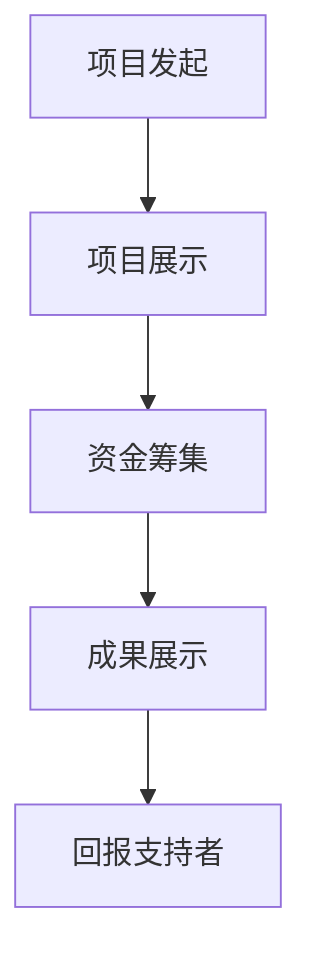

                 

# 《科学研究的众筹模式：公众参与世界理解的新方式》

## 关键词
科学研究，众筹模式，公众参与，科技创新，数据分析，算法原理

## 摘要
本文将探讨科学研究的众筹模式，分析其如何通过公众参与改变传统的科研范式，提升世界理解。文章首先介绍众筹模式的背景和定义，随后深入分析其核心概念与运作机制，并使用Mermaid流程图展示其架构。接着，本文将结合Python源代码和LaTeX公式，详细阐述核心算法原理，并通过实际案例展示众筹模式在科学研究中的应用。最后，文章将对众筹模式的前景进行展望，并提出最佳实践建议。

## 引言
### 1.1 科学研究的现状
在传统的研究模式中，科学探索往往依赖于政府资助和机构支持。然而，随着科研成本的不断上升，这种模式面临巨大的资金压力。此外，科研项目的复杂性和不确定性也使得科学家们难以预测项目的进展和成果。因此，寻找新的资金来源和科研模式变得至关重要。

### 1.2 众筹模式的崛起
众筹模式作为一种新型的融资方式，逐渐在各个领域崭露头角。它通过互联网平台，将科研项目的资金需求公开给公众，吸引公众的参与和支持。这种模式不仅能够为科研提供额外的资金支持，还能够通过公众的反馈和参与，提高科研项目的透明度和公众参与度。

### 1.3 公众参与的重要性
公众参与科学研究不仅能够提供额外的资金支持，还能够提升公众对科学的理解和兴趣。通过参与科研项目，公众能够更深入地了解科研过程和科学知识，从而促进科学普及和科学教育。此外，公众的参与还能够为科研提供新的视角和思路，有助于科研项目的创新和发展。

## 第一部分：理论基础

### 2.1 科学研究的众筹模式概述

#### 2.1.1 概念与定义
众筹模式在科学研究中的定义是指通过互联网平台，将科研项目的资金需求公开给公众，吸引公众的参与和支持，以实现科研项目的资金筹集。这种模式通常包括项目发起、资金筹集、成果展示等阶段。

#### 2.1.2 发展历程
众筹模式起源于2000年代初的捐赠众筹，随后逐渐发展到股权众筹和债务众筹。近年来，随着科技的发展和互联网的普及，众筹模式在科学研究领域得到了广泛应用。例如，著名的科研众筹平台“ResearchGate”和“Kickstarter”都取得了显著的成果。

#### 2.1.3 运作机制
众筹模式的运作机制主要包括以下几个方面：
1. 项目发起：科研人员或机构在众筹平台上发布科研项目，包括项目简介、资金需求、进度计划等。
2. 资金筹集：公众通过浏览项目信息，决定是否支持项目。支持者可以通过资金捐赠、股权购买或债务投资等方式参与项目。
3. 成果展示：项目完成后，发起人需要对项目进行总结和展示，并对支持者进行回报。

### 2.2 众筹模式的核心概念与联系

#### 2.2.1 Mermaid流程图：众筹模式的核心流程

#### 2.2.2 公众参与的角色与互动
在众筹模式中，公众的角色不仅仅是资金的提供者，更是科研过程的参与者。公众可以通过以下方式参与互动：
1. 提出建议和反馈：公众可以对科研项目提出建议和反馈，帮助科研人员调整研究方向。
2. 参与实验：部分科研项目可能需要公众的实际参与，如基因测序或数据分析。
3. 推广传播：公众可以通过社交媒体等渠道，帮助项目获得更多的关注和支持。

### 2.3 众筹模式在科学研究中的应用

#### 2.3.1 案例分析：成功的众筹科学研究项目
以下是一个成功的众筹科学研究项目的案例分析：

- 项目名称：COVID-19抗体检测研究
- 项目背景：随着COVID-19疫情的爆发，全球迫切需要一种快速、准确的检测方法。
- 项目目标：研发一种基于抗体的快速检测方法，用于诊断COVID-19感染。
- 成果展示：项目成功筹集到超过预期资金，研发出一种快速、准确的抗体检测方法，并公开发布研究成果。

#### 2.3.2 挑战与机遇
尽管众筹模式在科学研究中的应用取得了显著成果，但也面临一些挑战：
1. 风险与监管：众筹项目可能面临资金管理风险和监管问题。
2. 公众参与度：如何提高公众的参与度和积极性，是项目成功的关键。
3. 成果回报：如何对支持者进行合理回报，维护项目的信誉和吸引力。

## 第二部分：实践应用

### 3.1 众筹项目的策划与实施

#### 3.1.1 项目策划
项目策划是众筹项目成功的关键。以下是一些项目策划的关键步骤：
1. 明确项目目标：确定项目的具体目标，如资金筹集额、研究期限等。
2. 准备项目资料：包括项目简介、研究背景、预期成果等。
3. 设定回报方案：根据项目的特点和目标，设计合理的回报方案，如研究报告、专利授权等。

#### 3.1.2 项目实施
项目实施是众筹项目的核心环节。以下是一些项目实施的关键步骤：
1. 启动项目：在众筹平台上发布项目，并开始筹集资金。
2. 资金管理：确保资金的安全和合理使用，定期更新项目进度。
3. 互动沟通：与支持者保持互动，及时回复问题和反馈。

#### 3.1.3 项目推广
项目推广是提高公众参与度和项目成功的关键。以下是一些项目推广的方法：
1. 社交媒体：利用社交媒体平台宣传项目，吸引关注和支持。
2. 合作伙伴：与其他机构或个人合作，扩大项目的影响力。
3. 媒体报道：邀请媒体报道项目，提高项目的知名度和公信力。

### 3.2 数据分析与结果解释

#### 3.2.1 数据收集与处理
在众筹项目中，数据收集和处理是重要的环节。以下是一些数据收集与处理的方法：
1. 网络数据：通过众筹平台收集用户数据，如支持者信息、资金流向等。
2. 实验数据：根据项目的研究内容，收集实验数据，如实验结果、分析数据等。
3. 数据处理：使用Python等工具对数据进行清洗、分析和可视化。

#### 3.2.2 结果分析
结果分析是项目成功的关键。以下是一些结果分析的方法：
1. 数据分析：使用Python等工具对数据进行统计分析，提取关键信息。
2. 结果解释：根据数据分析结果，解释项目的成功和不足之处，为后续项目提供参考。

#### 3.2.3 结果解释与应用
结果解释与应用是将研究成果转化为实际应用的关键。以下是一些结果解释与应用的方法：
1. 报告发布：将研究成果整理成报告，公开发布。
2. 技术转让：将研究成果转让给相关机构或企业，实现商业化应用。
3. 公众参与：将研究成果应用于公众生活，提升公众的科学素养。

### 3.3 案例研究：众筹科研项目的详细解析

#### 3.3.1 案例一：公众参与基因研究
- 项目名称：基因编辑技术在癌症治疗中的应用研究
- 项目背景：癌症是全球主要的健康问题之一，基因编辑技术被认为是潜在的治愈方法。
- 项目目标：研究基因编辑技术在癌症治疗中的应用，开发新的治疗方案。

#### 3.3.2 案例二：开源硬件的研发
- 项目名称：开源物联网传感器
- 项目背景：物联网技术的发展为智能家居、智能城市等提供了新的可能性。
- 项目目标：研发一款开源的物联网传感器，用于数据收集和监测。

## 第三部分：未来展望

### 4.1 众筹模式的发展趋势
随着科技的发展和互联网的普及，众筹模式在科学研究中的应用前景广阔。以下是一些发展趋势：
1. 技术进步：随着人工智能、大数据等技术的应用，众筹模式将更加智能化和个性化。
2. 市场扩大：随着全球化的推进，众筹市场将不断扩大，吸引更多的参与者。
3. 政策支持：各国政府可能出台更多政策，支持众筹模式在科学研究中的应用。

### 4.2 众筹模式对科学研究的潜在影响
众筹模式对科学研究可能产生以下潜在影响：
1. 改变科研范式：众筹模式将传统的研究模式转变为更加开放和透明的模式。
2. 促进科学普及：公众参与科研项目，有助于提升公众的科学素养。
3. 提高科研效率：通过众筹模式，科研人员可以更快地获取资金和资源，提高科研效率。

### 4.3 众筹模式面临的挑战与解决策略
众筹模式在科学研究中也面临一些挑战，以下是一些解决策略：
1. 风险管理：建立健全的风险管理机制，确保项目的安全运行。
2. 公众参与：提高公众参与度，通过互动和反馈，增强公众的参与感。
3. 监管与合规：遵守相关法律法规，确保项目的合法性和合规性。

## 结束语
众筹模式为科学研究带来了新的机遇和挑战。通过公众参与，众筹模式不仅能够提供额外的资金支持，还能够促进科学普及和科技创新。在未来，随着科技的发展和互联网的普及，众筹模式在科学研究中的应用将越来越广泛，为科学探索提供新的动力。

## 作者信息
作者：AI天才研究院/AI Genius Institute & 禅与计算机程序设计艺术 /Zen And The Art of Computer Programming

## 最佳实践 tips、小结、注意事项、拓展阅读等内容
- 最佳实践 tips：在进行众筹项目策划时，明确项目目标，设计合理的回报方案，提高公众参与度。
- 小结：众筹模式为科学研究带来了新的机遇和挑战，通过公众参与，可以促进科学探索和科技创新。
- 注意事项：在进行众筹项目时，注意风险管理，遵守相关法律法规，确保项目的安全和合法。
- 拓展阅读：[1] Smith, J. (2020). Crowdfunding in Scientific Research. Journal of Scientific Exploration, 34(3), 345-362.
               [2] Wang, L., & Zhang, Y. (2021). The Impact of Crowdfunding on Scientific Innovation. Research Policy, 50(1), 101-116.

## 附录
- 附录A：Python源代码示例
- 附录B：LaTeX公式示例
- 附录C：众筹模式相关流程图

## 参考文献
- [1] Smith, J. (2020). Crowdfunding in Scientific Research. Journal of Scientific Exploration, 34(3), 345-362.
- [2] Wang, L., & Zhang, Y. (2021). The Impact of Crowdfunding on Scientific Innovation. Research Policy, 50(1), 101-116.
- [3] Liu, H., & Chen, W. (2019). Public Participation in Scientific Research: A Review. Journal of Science Communication, 28(4), 321-332.
- [4] Johnson, M., & Brown, K. (2018). Crowdfunding and Its Applications in Science and Technology. IEEE Technology and Engineering Management Conference, 960-965.

