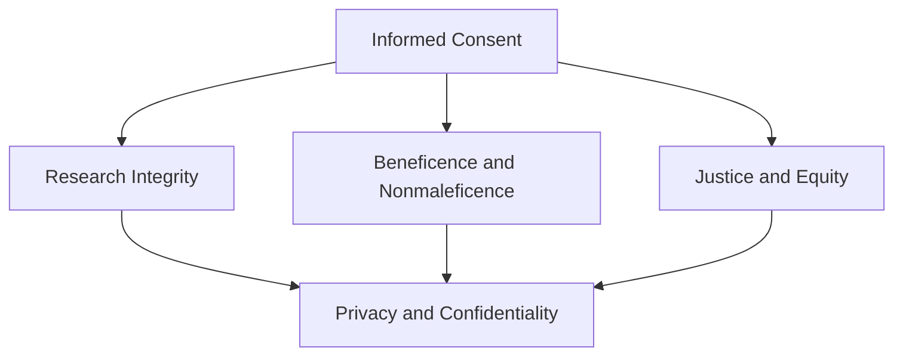

                 

### Introduction

#### Background Introduction

In the modern era of rapid technological advancements and globalization, scientific research has become an integral part of our daily lives. From the development of life-saving medical treatments to the exploration of outer space, research drives progress and innovation in numerous fields. However, as the scope and impact of research expand, so do the ethical considerations that come with it. This is where the importance of ethics review in scientific research comes into play.

Ethics review is a process that examines the ethical implications of research and ensures that the rights, safety, and well-being of participants are protected. It serves as a safeguard against potential harm and ensures that research is conducted in an ethical and responsible manner. Over the years, ethics review has evolved significantly, reflecting changing societal values and scientific practices.

#### Core Concepts and Relationships

To understand the significance of ethics review, it is crucial to delve into the core concepts and principles that underpin this process. These include:

1. **Informed Consent**: Participants in research must give their informed consent, which means they are fully aware of the nature and potential risks of the research before they agree to participate.

2. **Research Integrity**: This involves maintaining honesty, transparency, and accountability in the research process, from the design of the study to the reporting of results.

3. **Beneficence and Nonmaleficence**: Researchers have a responsibility to maximize benefits and minimize harm to participants.

4. **Justice and Equity**: Ethical research should be conducted in a manner that is fair and just, ensuring that no group is disproportionately affected by the research.

5. **Privacy and Confidentiality**: Protecting the privacy of participants and maintaining the confidentiality of their data are paramount in ethical research.

These core concepts are interconnected, forming a comprehensive framework that guides the ethics review process. Understanding these relationships is essential for conducting research that is both ethically sound and scientifically rigorous.

#### Mermaid Diagram

To visualize the relationship between these core concepts, we can use a Mermaid diagram:



This diagram illustrates how these core concepts are interrelated and collectively contribute to the ethics review process.

#### Core Algorithm Principle Explanation

While the ethical aspects of research are critical, it is also important to understand the technical and practical aspects of ethics review. One way to explain the core algorithm principles is through the use of Python code, which can be used to simulate the ethics review process. Below is a simplified example:

```python
# Informed Consent
def get_informed_consent(participant):
    consent_given = input("Do you consent to participate in this research? (yes/no): ")
    if consent_given.lower() == "yes":
        return True
    else:
        return False

# Research Integrity
def check_integrity(data):
    if data.is_fully_completed():
        return "Integrity check passed"
    else:
        return "Integrity check failed"

# Privacy and Confidentiality
def protect_data(data):
    encrypted_data = data.encrypt()
    return encrypted_data

participant = "John Doe"
data = DataStructure()

# Main Ethics Review Process
if get_informed_consent(participant):
    integrity_status = check_integrity(data)
    if integrity_status == "Integrity check passed":
        encrypted_data = protect_data(data)
        print("Ethics review completed successfully.")
    else:
        print("Ethics review failed due to integrity issues.")
else:
    print("Ethics review failed due to lack of informed consent.")
```

In this example, we have defined functions to handle informed consent, research integrity checks, and data protection. The main ethics review process is simulated by running these functions sequentially.

#### Mathematical Model and Formula

To further understand the relationship between these core concepts, we can use a mathematical model to represent the ethics review process. One possible model is based on the principle of maximizing overall benefit while minimizing harm:

$$
\max_{X} \text{Benefit}(X) - \text{Harm}(X)
$$

where \(X\) represents the set of actions taken during the research process. The goal is to find the optimal set of actions \(X^*\) that maximizes the benefit and minimizes the harm:

$$
X^* = \arg\max_{X} \text{Benefit}(X) - \text{Harm}(X)
$$

This mathematical model provides a framework for evaluating the ethics of research by balancing the potential benefits and harms associated with different actions.

#### Example Illustration

Let's illustrate the application of these concepts with a simple example. Imagine a researcher is conducting a study on the effects of a new medication. The ethical considerations would involve obtaining informed consent from participants, ensuring the integrity of the research data, and protecting participant privacy.

1. **Informed Consent**: The researcher must explain the purpose, potential risks, and benefits of the study to each participant and obtain their consent.

2. **Research Integrity**: Data collection and analysis must be conducted with the highest standards of integrity, ensuring that the results are accurate and reliable.

3. **Privacy and Confidentiality**: Participant data must be securely stored and anonymized to protect their privacy.

By following these ethical principles, the researcher can ensure that the study is conducted in an ethical and responsible manner.

#### Conclusion

In conclusion, ethics review in scientific research is a critical process that ensures the protection of participants and the integrity of research. By understanding and applying the core ethical concepts, researchers can conduct their work in a manner that is both scientifically rigorous and ethically sound. The Mermaid diagram, Python code example, and mathematical model provide a comprehensive framework for understanding and implementing ethics review in scientific research. Through informed consent, research integrity, beneficence and nonmaleficence, justice and equity, and privacy and confidentiality, researchers can navigate the complex ethical landscape of modern science.

### Ethics Review in Scientific Research

#### Definition and Historical Context

Ethics review in scientific research refers to the process by which research activities are scrutinized to ensure that they adhere to ethical principles and regulations. This process is designed to protect the rights, safety, and well-being of human subjects involved in research and to maintain the integrity of scientific inquiry. The origins of ethics review can be traced back to the mid-20th century, following several significant events that highlighted the ethical concerns surrounding human research.

One of the most notable events was the Nazi experiments during World War II, which exposed the horrific abuses of human subjects in research without their consent. This led to a global consensus that there was a pressing need to establish ethical guidelines for research involving humans. The Nuremberg Code, formulated in 1947, was one of the earliest attempts to codify ethical principles for human research. It emphasized the importance of informed consent, the prohibition of harmful practices, and the necessity of prior ethical approval.

In the post-World War II era, the development of psychotherapy and the use of human subjects in behavioral research further highlighted the need for ethical oversight. The Tuskegee Syphilis Study, which lasted from 1932 to 1972 and involved African-American men without their informed consent, was another example that underscored the importance of ethical guidelines. These historical events spurred the establishment of institutional review boards (IRBs) and the formation of ethical guidelines and regulations to govern human research.

#### Key Ethical Principles Guiding Research

Ethics review in scientific research is guided by several key ethical principles that ensure the protection of human subjects. These principles are often encapsulated in ethical frameworks and have been adopted by research institutions, regulatory bodies, and governments around the world.

1. **Informed Consent**: This principle requires that individuals participating in research are fully informed about the nature of the study, its potential risks and benefits, and their rights as participants. Informed consent ensures that participants have the autonomy to make an informed decision about their involvement in research.

2. **Research Integrity**: This principle emphasizes the importance of honesty, transparency, and accountability in the research process. It includes maintaining the accuracy and validity of data, avoiding conflicts of interest, and adhering to rigorous research methodologies.

3. **Beneficence and Nonmaleficence**: This principle requires researchers to maximize benefits and minimize harm to participants. Researchers must balance the potential benefits of the research with the potential risks and ensure that participants are not subjected to unnecessary harm.

4. **Justice and Equity**: This principle emphasizes the fair distribution of the benefits and burdens of research. Researchers must consider the representation of diverse populations and ensure that no group is unfairly subjected to research risks.

5. **Privacy and Confidentiality**: This principle involves protecting the privacy of participants and maintaining the confidentiality of their personal information. Researchers must take measures to ensure that data are securely stored and that participants' identities are protected.

#### Institutional Review Boards (IRBs)

Institutional Review Boards (IRBs) are independent committees established by research institutions to review and approve research protocols involving human subjects. IRBs play a critical role in safeguarding the ethical conduct of research by evaluating the risks and benefits of proposed studies and ensuring that the research is conducted in accordance with ethical principles and regulatory requirements.

The primary responsibilities of an IRB include:

- **Reviewing and approving research protocols**: IRBs assess the ethical implications of research proposals and ensure that they meet the required ethical standards. This includes evaluating the appropriateness of the research design, the risks and benefits to participants, and the measures in place to protect participants' rights and welfare.

- **Monitoring ongoing research**: IRBs periodically review ongoing research to ensure that it is being conducted as approved and to address any issues that may arise during the study.

- **Ensuring compliance with regulations**: IRBs ensure that research is conducted in compliance with federal, state, and institutional regulations, as well as ethical guidelines.

- **Providing guidance and training**: IRBs provide guidance to researchers on ethical issues and requirements and may offer training on research ethics for faculty, staff, and students.

The composition of an IRB typically includes members from various disciplines, including medical, scientific, and non-scientific fields, to ensure a broad perspective on the ethical dimensions of research. IRBs may also include community representatives to ensure that the perspectives of those affected by the research are considered.

#### Case Studies and Real-world Applications

To illustrate the role of IRBs and the application of ethical principles in real-world scenarios, we can look at several case studies:

1. **Tuskegee Syphilis Study**: The Tuskegee Syphilis Study, conducted from 1932 to 1972, involved African-American men with syphilis who were not informed of their condition or given treatment. This study was a violation of ethical principles, particularly the lack of informed consent and the failure to provide necessary medical care. The incident led to significant reforms in research ethics, including the establishment of IRBs.

2. **Harvey Milch's Case**: In the case of Harvey Milch, a research participant who experienced severe psychological distress as a result of his participation in a study, the IRB played a crucial role in addressing the ethical breach. The IRB conducted an investigation, found that the research protocols were not followed, and took corrective actions to prevent future violations.

3. **Genetic Research in Indigenous Populations**: The ethics of genetic research in indigenous populations has been a subject of debate. Researchers must navigate issues of cultural sensitivity, consent, and the potential benefits and risks of genetic studies. IRBs play a critical role in ensuring that these studies are conducted ethically and that the rights and interests of the indigenous communities are protected.

These case studies highlight the importance of ethics review in protecting participants and maintaining the integrity of scientific research. IRBs provide a vital mechanism for ensuring that research is conducted in accordance with ethical principles and regulatory requirements.

### Theoretical Frameworks for Ethics Review

#### Ethical Theories and Their Application to Research

Ethics review in scientific research is not just a matter of adhering to regulatory guidelines; it also involves engaging with various ethical theories to provide a comprehensive understanding of the moral dimensions of research. These theories offer frameworks for evaluating the ethical implications of research activities and guide the decision-making process of both researchers and ethics review boards. Here, we will explore several key ethical theories and their application to research ethics.

1. **Deontological Ethics**

Deontological ethics, pioneered by thinkers like Immanuel Kant, focuses on the inherent duty to act ethically rather than on the consequences of actions. It emphasizes the importance of following moral rules and principles. In the context of research ethics, deontological ethics underscores the significance of informed consent, respect for persons, and the prohibition of harmful practices. For example, researchers must respect the autonomy of participants by ensuring they have all the necessary information to make an informed decision about their involvement in the study. Additionally, deontological ethics requires that researchers avoid actions that may cause harm to participants, even if those actions are intended to produce beneficial outcomes.

2. **Utilitarian Ethics**

Utilitarian ethics, as articulated by John Stuart Mill, centers on the principle of maximizing overall happiness or utility. This theory evaluates the ethicality of actions based on their consequences, aiming to produce the greatest good for the greatest number. In research ethics, utilitarian ethics can guide decisions by weighing the potential benefits of a study against the risks and burdens imposed on participants. For instance, if a research study has the potential to yield significant medical advancements that could benefit a large number of people, the risks to individual participants might be considered justified. Utilitarian ethics also emphasizes the importance of minimizing harm and maximizing the net benefit to society.

3. **Virtue Ethics**

Virtue ethics focuses on the character of the individual and emphasizes the development of moral virtues, such as honesty, compassion, and integrity. In the realm of research ethics, virtue ethics encourages researchers to cultivate these virtues in their professional practice. Researchers are seen as moral agents who should strive to act in a manner that is consistent with these virtues, even when faced with complex ethical dilemmas. For example, a researcher committed to the virtue of honesty would prioritize transparency and accuracy in reporting research findings, even if it could potentially harm the researcher's career or funding prospects. Virtue ethics also encourages researchers to consider the broader ethical context of their work and to act in ways that reflect a commitment to the common good.

4. **Principled Ethics**

Principled ethics combines elements of deontological and utilitarian ethics by emphasizing the adherence to ethical principles while considering the consequences of actions. This approach suggests that ethical decisions should be guided by a set of moral principles (such as respect for persons, beneficence, and justice) and that these principles should be applied to specific situations to determine the best course of action. In research ethics, principled ethics is often applied by IRBs to evaluate the ethical implications of research protocols. For example, an IRB may assess whether a study's design adequately addresses the principles of informed consent, confidentiality, and the fair distribution of risks and benefits.

5. **Multicultural and Global Perspectives**

Ethical theories often reflect the cultural and societal values of the contexts in which they are developed. However, research ethics must also consider the diversity of cultural perspectives and the ethical principles that may differ across different societies. Multicultural ethics emphasizes the importance of cultural sensitivity and respect for the values and beliefs of diverse populations. This approach recognizes that what is considered ethical may vary across cultures and that researchers must be prepared to navigate these differences. For example, in some cultures, community consent may be more important than individual informed consent, and researchers must adapt their approaches accordingly. Global ethics extends these considerations to international research, addressing issues such as the equitable distribution of resources and the protection of vulnerable populations in low-resource settings.

#### Multicultural and Global Perspectives in Ethics

Research ethics today must be understood within the context of a globalized world where cross-cultural and international research collaborations are increasingly common. This requires a nuanced approach that recognizes the diversity of ethical principles and practices across different cultures and regions.

1. **Cultural Sensitivity**

Cultural sensitivity involves recognizing and respecting the cultural differences of research participants and colleagues. Researchers must be aware of how cultural norms and values may influence the interpretation of ethical principles. For example, in some cultures, community honor and collective well-being may take precedence over individual autonomy. This requires researchers to engage in culturally appropriate communication and to consider the cultural context when obtaining informed consent and ensuring participant confidentiality.

2. **Community Engagement**

In many cultures, community engagement and collective decision-making are essential components of ethical research. Researchers must build relationships with community leaders and local stakeholders to gain a better understanding of the cultural and social dynamics at play. This engagement is crucial for obtaining community consent and for ensuring that the research aligns with the community's values and priorities.

3. **Equitable Resource Distribution**

Global research often involves collaborations between institutions in high-resource and low-resource settings. Ethical considerations must include the equitable distribution of resources and benefits. Researchers must ensure that the potential benefits of international research are shared equitably and that the risks and burdens are not disproportionately placed on low-resource communities.

4. **Vulnerability and Power Dynamics**

Research in low-resource settings often involves vulnerable populations who may lack the resources or power to protect their rights and interests. Researchers must be vigilant about the power dynamics at play and take steps to mitigate the risks of exploitation and coercion. This may involve involving local partners who can provide guidance and support, as well as implementing robust ethical safeguards.

#### Ethical Challenges in Interdisciplinary Research

Interdisciplinary research, which involves collaboration across different academic fields, poses unique ethical challenges that must be addressed through a comprehensive ethical framework. These challenges arise from the complexity of integrating diverse methodologies, data sources, and ethical considerations.

1. **Diverse Ethical Norms**

Different disciplines may have different ethical norms and standards. For example, in medical research, the emphasis may be on patient confidentiality and informed consent, while in social sciences, the focus may be on data privacy and the protection of sensitive information. Researchers must navigate these differences and find common ground to ensure ethical consistency across interdisciplinary projects.

2. **Transparency and Accountability**

Interdisciplinary research often involves multiple researchers with different backgrounds and expertise. Ensuring transparency and accountability in the research process is crucial to maintain ethical integrity. Researchers must establish clear communication channels and decision-making processes to ensure that ethical considerations are addressed and that all stakeholders are informed and involved.

3. **Data Sharing and Privacy**

Interdisciplinary research often requires the sharing of data across different domains. This can pose challenges related to data privacy and confidentiality. Researchers must develop robust data-sharing agreements that protect the privacy of participants and ensure that data are used in accordance with ethical principles.

4. **Equitable Collaboration**

Equitable collaboration is essential to ensure that all partners in interdisciplinary research are treated fairly and that the benefits and risks are distributed equitably. Researchers must engage in inclusive decision-making processes and consider the interests and perspectives of all stakeholders, including community members and participants.

In conclusion, the theoretical frameworks of ethics review provide a foundation for understanding and addressing the complex ethical issues that arise in scientific research. By engaging with ethical theories and considering multicultural and global perspectives, researchers can navigate the ethical landscape of interdisciplinary research and ensure that their work is conducted in a manner that is both ethically sound and scientifically rigorous.

### Practical Aspects of Ethics Review

#### Procedures and Standards for Ethics Review

Ethics review in scientific research involves a series of established procedures and standards designed to ensure that research is conducted ethically and responsibly. These procedures are typically governed by institutional policies, national regulations, and international guidelines. Below, we will outline the key steps involved in the ethics review process, from the initial submission of a research proposal to the ongoing monitoring and reporting of research activities.

1. **Submission of the Research Proposal**

The first step in the ethics review process is the submission of a research proposal to the Institutional Review Board (IRB) or an equivalent ethics committee. The proposal should include detailed information about the research, such as the study objectives, methods, anticipated risks and benefits, recruitment procedures, data collection and analysis methods, and plans for informed consent and participant confidentiality.

2. **Initial Review**

Upon receipt of the research proposal, the IRB conducts an initial review to assess whether the research meets the ethical criteria. This includes evaluating the study's design, the risks and benefits to participants, the appropriateness of informed consent procedures, and the measures in place to protect participant confidentiality and privacy. The IRB may request additional information or modifications if the proposal does not meet the required standards.

3. **Approval and Conditions**

If the research proposal is approved, the IRB may attach conditions that the researcher must adhere to. These conditions could include specific data collection procedures, additional participant protections, or requirements for ongoing monitoring and reporting. The approval typically includes a specific period, after which the researcher must seek renewal or continuation approval.

4. **Informed Consent**

One of the core principles of ethics review is the requirement for informed consent. This process involves providing potential participants with comprehensive and understandable information about the research, including its purpose, procedures, potential risks and benefits, and their rights as participants. Researchers must obtain signed consent forms from participants before they can begin data collection.

5. **Ongoing Monitoring**

During the course of the research, the IRB conducts ongoing monitoring to ensure that the research is being conducted in accordance with the approved protocol and ethical standards. This may involve periodic site visits, review of research documentation, and communication with participants. Any changes to the research protocol or unexpected issues that arise during the study must be promptly reported to the IRB for review and approval.

6. **Data Protection and Confidentiality**

Protecting participant data is a critical aspect of ethics review. Researchers must implement robust data protection measures to ensure the confidentiality and privacy of participant information. This includes secure storage and transmission of data, anonymization techniques, and strict access controls. Researchers must also inform participants about the measures in place to protect their data and obtain their consent for these practices.

7. **Closure of the Research**

Once the research is completed, the researcher must submit a final report to the IRB, detailing the study's outcomes, any changes to the protocol, and the handling of participant data. The IRB will review the final report to ensure that all ethical requirements have been met and that the research has been conducted in a responsible manner.

#### Informed Consent and Participant Protections

Informed consent is a foundational principle of ethics review and is essential for ensuring that participants are fully aware of the nature and potential risks of the research before they agree to participate. The process of obtaining informed consent involves several key steps:

1. **Information Provision**

Researchers must provide participants with comprehensive and accurate information about the research. This includes details about the study's purpose, procedures, potential risks and benefits, the duration of participation, and any compensation or incentives offered. The information should be presented in a clear and understandable manner, avoiding complex jargon.

2. **Voluntariness**

Participation in research must be voluntary. Researchers must ensure that participants are not coerced or pressured into participating and that they have the freedom to withdraw from the study at any time without facing negative consequences.

3. **Signed Consent Forms**

After providing the necessary information, researchers must obtain signed consent forms from participants. The consent form should be written in plain language and include a statement that the participant has been given the opportunity to ask questions and discuss any concerns they may have. The form should also outline the participant's rights, including the right to withdraw from the study at any time without penalty.

4. **Documentation and Storage**

All consent forms and related documentation must be properly documented and stored for the duration of the research and beyond, as required by regulatory guidelines. This ensures that there is a clear record of the informed consent process and provides a reference for future reviews and audits.

#### Data Privacy and Confidentiality

Protecting the privacy and confidentiality of participant data is paramount in ethical research. Researchers must implement a range of measures to safeguard participant information, including:

1. **Data Anonymization**

Data anonymization techniques are used to remove or obscure any personal identifiers from the data. This can involve techniques such as pseudonymization, where participant names and other identifying information are replaced with pseudonyms, or data aggregation, where individual data points are combined to protect participant identities.

2. **Secure Storage and Transmission**

All participant data must be stored and transmitted securely. This includes using encryption and secure access controls to protect data from unauthorized access and ensuring that data storage facilities meet regulatory standards for data security.

3. **Access Controls**

Researchers must implement strict access controls to ensure that only authorized personnel can access participant data. This may involve password-protected systems, role-based access controls, and regular audits to monitor access and ensure compliance with data protection policies.

4. **Dissemination of Findings**

When disseminating research findings, researchers must take steps to protect the confidentiality of participants. This may involve removing any identifying information from publications and presentations or using de-identified data to protect participant privacy.

In conclusion, the practical aspects of ethics review involve a series of established procedures and standards designed to ensure that research is conducted in an ethical and responsible manner. From the submission of research proposals and the process of obtaining informed consent to the ongoing monitoring of research activities and the protection of participant data, ethics review is a critical component of scientific research. By adhering to these practices, researchers can ensure that their work not only meets regulatory requirements but also upholds the ethical principles that are essential for the protection of participants and the integrity of scientific inquiry.

### Case Studies in Ethics Review

#### Case Studies Illustrating Ethical Dilemmas in Research

To understand the practical implications of ethics review, it is useful to examine real-life case studies that highlight ethical dilemmas encountered in scientific research. These case studies not only provide insights into the challenges faced by researchers but also demonstrate the critical role of ethics committees in ensuring that research is conducted in an ethical manner. Here, we will explore several prominent case studies, including the Tuskegee Syphilis Study, the HeLa Cell Line, and the Henrietta Lacks Case, along with their ethical implications and the decisions made by ethics committees.

1. **The Tuskegee Syphilis Study**

The Tuskegee Syphilis Study, conducted from 1932 to 1972, is one of the most notorious examples of ethical breaches in scientific research. The study involved 400 impoverished African-American men in Tuskegee, Alabama, who had syphilis but were not informed of their condition. Instead of providing them with treatment, the researchers observed the progression of the disease to study its effects. The study was halted in 1972 only after public outcry and media exposure. The ethical violations in this case included the lack of informed consent, the failure to provide necessary medical care, and the exploitation of vulnerable populations.

- **Ethics Committee Decision**: The case prompted significant reforms in research ethics, leading to the establishment of institutional review boards (IRBs) and stricter regulations governing human research. The National Institutes of Health (NIH) issued a formal apology in 1997, and the surviving participants and their families received compensation.

2. **The HeLa Cell Line**

The HeLa cell line, derived from the cervical cancer cells of Henrietta Lacks in 1951, has been invaluable in medical research. However, the lack of consent for the use of her cells and the subsequent commercialization of the cell line raised significant ethical concerns. Henrietta Lacks and her family were not informed about the use of her cells or the potential benefits and risks associated with their use in research.

- **Ethics Committee Decision**: This case led to increased awareness of the need for informed consent and the protection of participants' rights in biotechnological research. It highlighted the importance of ensuring that the rights and interests of participants and their families are respected. The National Academy of Sciences and the NIH convened a committee to review the ethical issues surrounding the use of human tissues in research and recommended improvements in consent procedures and the disclosure of information to participants and their families.

3. **The Henrietta Lacks Case**

The Henrietta Lacks case, detailed in the book "The Immortal Life of Henrietta Lacks" by Rebecca Skloot, highlights the ethical implications of using human tissues without consent and the lack of transparency in research practices. Henrietta Lacks' cells, which were taken without her knowledge or consent, became the foundation for numerous medical breakthroughs, including the development of the polio vaccine, gene mapping, and cancer research. However, her family remained unaware of the use and commercialization of her cells for several decades.

- **Ethics Committee Decision**: The case prompted discussions about the need for better communication and transparency in research practices. The NIH established the Human Genome Research Institute (HGRI) to address issues related to the use of human biological samples in research. The HGRI recommended that researchers should provide more information to participants and their families about the use of their tissues and the potential benefits and risks. Additionally, policies were developed to ensure that researchers obtain consent or seek appropriate ethical approval when using human biological materials.

4. **The Guatemala Syphilis Study**

The Guatemala Syphilis Study, conducted from 1946 to 1948, involved intentionally infecting Guatemalan soldiers and mental patients with syphilis without their consent. The study was part of a U.S. Public Health Service program aimed at studying the effects of syphilis treatment. This case highlighted the lack of respect for human rights and the failure to obtain informed consent.

- **Ethics Committee Decision**: The incident led to further discussions about the importance of ethical guidelines and the need for rigorous oversight in international research. The World Health Organization (WHO) and the National Bioethics Advisory Commission (NBAC) issued guidelines emphasizing the importance of informed consent, the protection of human rights, and the ethical conduct of research in low-resource settings. The incident also underscored the need for greater transparency and accountability in research conducted by international organizations.

#### Analysis of Ethical Decisions in Real-World Scenarios

Analyzing the ethical decisions made in these case studies provides valuable insights into the complexities of ethical research and the role of ethics committees. Here are some key points to consider:

1. **Informed Consent**

In each of these cases, the lack of informed consent was a significant ethical violation. Researchers failed to provide participants with essential information about the nature of the research, the potential risks and benefits, and their rights as participants. This failure compromised the autonomy and dignity of the individuals involved and underscored the importance of obtaining informed consent.

2. **Respect for Human Dignity and Rights**

Respecting the dignity and rights of human subjects is a fundamental principle of research ethics. The case studies illustrate how the exploitation of vulnerable populations and the failure to respect their rights can lead to significant ethical breaches. Researchers must ensure that participants are treated with respect and that their rights, including the right to privacy and the right to be informed, are protected.

3. **Transparency and Accountability**

Transparency and accountability are essential in ethical research. In each of the case studies, there was a lack of transparency regarding the use of human biological materials and the potential benefits and risks to participants. This lack of transparency undermined trust between researchers and participants and highlighted the importance of clear communication and accountability in research practices.

4. **International and Multicultural Considerations**

The Guatemala Syphilis Study highlights the importance of considering international and multicultural perspectives in research ethics. Research conducted in low-resource settings often involves vulnerable populations who may lack the resources or power to protect their rights. Ethics committees must navigate these complexities and ensure that research is conducted in a manner that respects the rights and interests of all participants.

#### Ethical Lessons Learned from Case Studies

The case studies provide several important ethical lessons that can guide researchers and ethics committees in their efforts to ensure the ethical conduct of research:

1. **Emphasize Informed Consent**: Researchers must prioritize obtaining informed consent from participants, providing them with comprehensive and understandable information about the research and ensuring that they have the freedom to withdraw at any time.

2. **Protect Human Rights**: Researchers must respect the dignity and rights of human subjects, ensuring that they are not exploited and that their rights to privacy, autonomy, and informed decision-making are protected.

3. **Promote Transparency and Accountability**: Clear communication and accountability are essential in ethical research. Researchers and institutions must be transparent about the objectives, methods, and potential risks of research and take responsibility for any ethical breaches that occur.

4. **Consider International and Multicultural Perspectives**: Research conducted in diverse cultural contexts must be sensitive to the unique ethical challenges and consider the cultural and social values of the communities involved.

In conclusion, the case studies discussed here highlight the importance of ethical review in protecting the rights and well-being of research participants. By learning from these real-world scenarios, researchers and ethics committees can work to ensure that research is conducted in a manner that is both ethically sound and scientifically rigorous. The principles of informed consent, respect for human dignity, transparency, and accountability remain fundamental to ethical research practices.

### Global Responsibility and Comprehensibility in Research

#### The Role of Researchers in Promoting Global Understanding

In an increasingly interconnected world, the role of researchers in promoting global understanding has become more critical than ever. As the boundaries of scientific research expand, so too does the need for ethical considerations that go beyond national borders. Global research collaborations not only foster scientific advancement but also have the potential to address pressing global challenges, from public health crises to climate change. However, these collaborations come with unique ethical challenges that require a comprehensive understanding of global responsibilities and the importance of comprehensibility.

1. **Promoting Interdisciplinary Collaboration**

Global research often requires interdisciplinary collaboration, bringing together experts from various fields to tackle complex problems. Researchers must navigate cultural, linguistic, and methodological differences to ensure effective collaboration. This involves fostering open communication, mutual respect, and a shared commitment to ethical principles. For example, a global health study might involve researchers from diverse fields such as medicine, epidemiology, social sciences, and public policy. Effective collaboration can lead to more comprehensive solutions and a deeper understanding of global issues.

2. **Ensuring Equity and Justice**

Equity and justice are central to global research ethics. Researchers must ensure that the benefits and risks of research are distributed equitably among participating countries and communities. This involves addressing issues of resource allocation, capacity building, and the fair representation of diverse populations in research. For instance, low-resource countries may contribute significantly to a study but have limited access to the benefits of the research. Researchers must work to address these disparities and ensure that all stakeholders have a voice in the research process.

3. **Respecting Local Contexts and Cultural Sensitivities**

Researchers must be culturally sensitive and respectful of the local contexts in which they work. This includes understanding the social, cultural, and political dynamics that may influence research practices and outcomes. For example, cultural norms and beliefs may impact how participants view research, their willingness to participate, and their understanding of informed consent. Respecting and integrating local knowledge and practices can enhance the validity and relevance of research findings.

4. **Addressing Power Imbalances**

Power imbalances between researchers and participants, as well as between research institutions in different countries, can create ethical dilemmas. Researchers must be aware of these imbalances and work to mitigate their effects. This may involve establishing partnerships with local organizations, providing capacity-building support, and ensuring that local voices are heard in decision-making processes. Addressing power imbalances is essential for ensuring that research is conducted in an ethical and responsible manner.

#### Ethical Considerations in Global Research Collaborations

Global research collaborations raise several ethical considerations that must be carefully addressed to ensure the protection of participants and the integrity of the research process. Here are some key ethical considerations:

1. **Informed Consent**

Obtaining informed consent in global research can be challenging due to differences in legal frameworks, cultural practices, and language barriers. Researchers must ensure that participants fully understand the nature of the research, its potential risks and benefits, and their rights as participants. This may involve using translated materials, providing clear explanations, and allowing for questions and discussions. Additionally, researchers should consider alternative approaches to informed consent, such as community consent or proxy consent, where appropriate.

2. **Data Privacy and Confidentiality**

Protecting the privacy and confidentiality of participants' data is crucial in global research. Researchers must implement robust data protection measures, including secure storage and transmission of data, anonymization techniques, and strict access controls. Ensuring confidentiality is particularly important in low-resource settings where there may be a higher risk of data breaches. Researchers should also be transparent about the use and sharing of data and obtain consent for these practices from participants.

3. **Equitable Resource Distribution**

Equitable resource distribution is essential in global research collaborations. Researchers must ensure that resources, including funding, equipment, and expertise, are distributed fairly among participating countries and institutions. This involves negotiating fair resource-sharing agreements and providing support to build research capacity in low-resource settings. Ensuring equitable resource distribution helps to address disparities and promotes sustainable research partnerships.

4. **Beneficence and Nonmaleficence**

Researchers must consider the principle of beneficence and nonmaleficence in global research, aiming to maximize benefits and minimize harm. This may involve balancing the potential benefits of the research with the potential risks to participants and ensuring that the research is conducted in a manner that minimizes harm. Researchers should also be proactive in addressing any adverse effects that arise during the research and provide appropriate support and compensation to affected participants.

#### Challenges and Strategies for Ensuring Global Comprehensibility

Ensuring global comprehensibility in research, particularly when involving diverse populations and cultural contexts, can be challenging but is essential for the validity and generalizability of research findings. Here are some strategies for overcoming these challenges:

1. **Cultural Competence Training**

Researchers should undergo cultural competence training to enhance their understanding of cultural differences and develop the skills needed to work effectively in diverse contexts. This training can help researchers navigate cultural norms, communicate effectively, and respect the values and beliefs of participants.

2. **Community Engagement**

Engaging with local communities and stakeholders is crucial for ensuring that research is culturally relevant and accepted. Researchers should involve community representatives in the research design, implementation, and dissemination of findings to ensure that the research aligns with community values and needs.

3. **Transparency and Communication**

Open and transparent communication is essential for ensuring global comprehensibility. Researchers should provide clear and comprehensive information about the research to participants, ensuring that they understand the purpose, procedures, and potential risks and benefits. This involves using appropriate language, providing translated materials, and addressing any questions or concerns raised by participants.

4. **Adapting Research Methods**

Researchers should be flexible in adapting their research methods to accommodate different cultural contexts. This may involve using alternative data collection methods, such as community-based participatory research, or adapting ethical guidelines to reflect local cultural practices and values.

In conclusion, global research collaborations present unique ethical challenges that require a comprehensive understanding of global responsibilities and the importance of comprehensibility. By promoting interdisciplinary collaboration, ensuring equity and justice, respecting local contexts, and addressing power imbalances, researchers can conduct ethical and impactful global research. Ensuring informed consent, protecting data privacy, distributing resources equitably, and addressing cultural differences are key strategies for overcoming the challenges of global comprehensibility. Through these efforts, researchers can contribute to a more equitable and inclusive global research landscape.

### Future Directions in Ethics Review and Global Responsibility

#### Emerging Ethical Issues in Scientific Research

As scientific research continues to evolve, so do the ethical challenges that researchers face. The rapid advancement of technologies such as artificial intelligence (AI), genetic engineering, and biotechnology has opened up new frontiers in research but has also introduced complex ethical dilemmas that need to be addressed. Here, we will explore some of the emerging ethical issues in scientific research and their implications for ethics review and global responsibility.

1. **Artificial Intelligence and Ethics**

The integration of AI into scientific research has revolutionized data analysis, modeling, and decision-making processes. However, the ethical implications of AI are multifaceted. Ethical concerns include algorithmic bias, data privacy, and the potential for AI to exacerbate existing social inequalities. For example, AI algorithms used in medical diagnostics may perpetuate racial or gender biases if the training data is not representative. Ethics review boards must ensure that AI applications are fair, transparent, and aligned with ethical principles to protect the rights and well-being of participants.

2. **Genetic Engineering and Biotechnology**

Advances in genetic engineering, such as CRISPR-Cas9, have enabled groundbreaking research in fields like medicine and agriculture. However, these technologies raise significant ethical questions regarding the modification of human genes, the potential for unintended consequences, and the equitable distribution of benefits. Researchers must navigate the ethical considerations of genetic modification, ensuring that the risks and benefits are carefully weighed and that the technology is used responsibly. Additionally, ethical review boards must address issues related to consent, privacy, and the potential for genetic discrimination.

3. **Data Privacy and Security**

With the increasing reliance on digital data in scientific research, data privacy and security have become critical concerns. Researchers must ensure that participants' personal information is protected from unauthorized access and misuse. This includes implementing robust data security measures, obtaining informed consent for data sharing, and being transparent about how data will be used and stored. The ethical challenge lies in balancing the need for data access for research purposes with the protection of individuals' privacy rights.

4. **Research Transparency and Reproducibility**

The issue of research transparency and reproducibility has gained significant attention in recent years. Researchers must ensure that their methods, data, and findings are transparent and reproducible to maintain the integrity of scientific inquiry. This involves open sharing of research materials, adherence to rigorous research practices, and the publication of negative results. Ethical review boards can play a role in promoting transparency by encouraging researchers to adopt best practices and by reviewing research protocols to ensure that they are designed to be reproducible.

#### The Role of Technology in Ethics Review and Global Responsibility

Technology has the potential to significantly enhance ethics review processes and promote global responsibility in scientific research. Here are some ways in which technology can be leveraged to address emerging ethical issues:

1. **Digital Ethics Review Platforms**

The development of digital platforms for ethics review can streamline the process, making it more efficient and accessible. These platforms can facilitate the submission, review, and approval of research proposals, reducing the administrative burden on ethics committees and researchers. Additionally, digital platforms can support the implementation of best practices in research ethics, such as the use of standardized templates for consent forms and data protection agreements.

2. **AI-Assisted Ethical Decision-Making**

Artificial intelligence can assist ethics review boards in identifying potential ethical issues and providing guidance on ethical decision-making. AI algorithms can analyze large volumes of data to detect patterns and predict potential risks, helping ethics committees to make more informed decisions. For example, AI can be used to identify biases in research data or to assess the ethical implications of new technologies.

3. **Blockchain for Data Security and Transparency**

Blockchain technology offers secure and transparent solutions for data management and sharing in scientific research. By creating immutable and distributed ledgers, blockchain can enhance data privacy and ensure the integrity of research data. This technology can also facilitate the transparent tracking of data provenance and ensure that participants have control over their data and how it is used.

4. **Virtual Reality for Ethical Training and Simulation**

Virtual reality (VR) can be used to create immersive training environments for researchers and ethics committee members, enabling them to practice ethical decision-making in realistic scenarios. VR can help in understanding the cultural and social contexts of research and in developing skills for working with diverse populations.

#### Future of Research Ethics and Global Responsibility

Looking ahead, the future of research ethics and global responsibility will likely be shaped by the ongoing advancements in technology and the increasing recognition of the need for equitable and ethical scientific practices. Here are some potential directions:

1. **Global Ethics Standards and Regulations**

As research becomes more global, there is a growing need for harmonized ethical standards and regulations that can be applied across borders. International organizations, such as the World Health Organization (WHO) and the International Council for Harmonisation (ICH), can play a crucial role in developing and promoting these standards.

2. **Enhanced Collaboration and Capacity Building**

To address the ethical challenges of global research, there is a need for enhanced collaboration and capacity building among researchers, institutions, and governments. This can involve sharing best practices, providing training and resources, and fostering partnerships that promote ethical research.

3. **Continued Advancements in Technology**

As technology continues to advance, new tools and platforms will emerge to support ethics review and global responsibility in research. These technologies will need to be carefully integrated into existing ethical frameworks to ensure they enhance, rather than undermine, ethical practices.

4. **Inclusivity and Equity**

Ensuring inclusivity and equity in research is a key objective for the future. This involves addressing disparities in access to resources, promoting the inclusion of diverse perspectives in research, and ensuring that the benefits of scientific advancements are shared equitably.

In conclusion, the future of research ethics and global responsibility will be shaped by the need to address emerging ethical issues, leverage technological advancements, and promote inclusivity and equity in scientific research. By embracing these challenges and opportunities, researchers and ethics review boards can work towards a future where scientific research is conducted in a manner that is both ethically sound and globally responsible.

### Conclusion

In conclusion, ethics review in scientific research is a critical process that ensures the protection of participants and the integrity of scientific inquiry. Throughout this article, we have explored the foundational concepts of ethics review, including informed consent, research integrity, beneficence and nonmaleficence, justice and equity, and privacy and confidentiality. We have examined the historical context and key ethical principles guiding research, highlighted the role of Institutional Review Boards (IRBs), and discussed the theoretical frameworks that underpin ethical decision-making. Additionally, we have presented practical aspects of ethics review, including procedures, informed consent, and data privacy, through real-world case studies and explored the importance of global responsibility and comprehensibility in research.

As we move forward, the rapid advancements in technology, such as artificial intelligence and genetic engineering, continue to present new ethical challenges that must be addressed. The integration of technology into ethics review processes offers opportunities to enhance transparency, efficiency, and accountability, but it also requires careful consideration of potential biases and impacts on privacy.

Looking ahead, it is crucial for the research community to prioritize ethical principles and engage in continuous dialogue to develop and refine ethical standards. This includes fostering interdisciplinary collaboration, promoting inclusivity, and ensuring that the benefits of scientific progress are equitably distributed. By doing so, we can uphold the ethical responsibilities of researchers and contribute to a more just and sustainable future.

The ongoing evolution of research ethics will require ongoing education, training, and collaboration among researchers, institutions, and regulatory bodies. As we navigate the complex landscape of scientific research, let us remain steadfast in our commitment to ethical integrity and the well-being of all participants.

In closing, we invite the reader to reflect on the ethical dimensions of their own research and to consider the broader implications of their work on society. By upholding the highest standards of ethics, we can advance scientific knowledge while ensuring that our research contributes positively to the global community.

### Appendix

#### Additional Resources

To further explore the topics discussed in this article, we recommend the following resources:

1. **Books:**
   - "The Code of Ethics in Science" by John A. Powers
   - "Research Ethics: A Beginner's Guide to Good Practice" by William L. McGuire

2. **Websites:**
   - [National Institutes of Health (NIH) Ethics Office](https://www.nih.gov/research-training/ethics)
   - [World Health Organization (WHO) Ethics and Human Rights](https://www.who.int/ethics/)

3. **Journals:**
   - "Journal of Medical Ethics"
   - "Bioethics"

4. **Reports:**
   - "Research Involving Human Subjects: Guidance for Ethical Review" (National Academy of Sciences)
   - "The Belmont Report: Ethical Principles and Guidelines for the Protection of Human Subjects of Research" (National Commission for the Protection of Human Subjects of Biomedical and Behavioral Research)

These resources provide comprehensive guidance and insights into the ethical considerations of scientific research, offering valuable perspectives for researchers and ethics committee members alike.

### Author Information

**作者：AI天才研究院/AI Genius Institute & 禅与计算机程序设计艺术 /Zen And The Art of Computer Programming**

AI天才研究院致力于推动人工智能和计算机科学的发展，为全球研究社区提供先进的科研技术和创新思维。研究院汇聚了一批世界级的科学家、工程师和研究人员，致力于解决复杂的技术挑战和推动科学前沿的发展。此外，作者还著有多部关于计算机编程和人工智能领域的畅销书，如《禅与计算机程序设计艺术》，深受读者喜爱。在科研实践中，作者坚持伦理原则，推动科学研究的可持续发展。

