                 

### 科学研究的伦理审查概述

#### 背景介绍

在科学研究迅速发展的今天，伦理审查已经成为科研活动中不可或缺的一环。伦理审查的目的是确保科学研究活动在符合道德和法律框架的基础上，最大限度地保护研究参与者的权益，同时促进科学知识的发展和社会进步。然而，随着科技前沿的不断拓展，科学研究的伦理挑战日益复杂，如何平衡知识探索与道德约束成为一个亟待解决的重要问题。

伦理审查在科学研究中的重要性主要体现在以下几个方面。首先，它有助于防范和减少因研究过程中可能出现的伦理问题，保护研究参与者的隐私和身体安全。其次，伦理审查能够确保研究设计、执行和结果的透明度，提高科学研究的公信力。最后，伦理审查作为一种制度化的规范，有助于形成良好的科研氛围，促进科学共同体内部的道德自律。

#### 核心概念与联系

伦理审查涉及多个核心概念，这些概念相互联系，构成了伦理审查的理论框架。以下是几个关键概念及其之间的关系架构：

1. **伦理审查**：是一种制度化的审查机制，旨在评估科研项目在道德和法律层面上的合规性。其核心是平衡知识探索与道德约束，保障研究参与者的权益。
2. **道德约束**：指的是科学研究过程中必须遵循的伦理规范和道德原则，包括尊重个人自主权、避免伤害、公平分配利益与负担等。
3. **知识探索**：是指科学研究的核心目标，旨在通过实验、观察和理论分析等手段，探索自然界的规律和现象。
4. **道德原则**：包括尊重、公正、责任、透明等，这些原则为伦理审查提供了具体的伦理标准。

为了更好地理解这些概念之间的关系，我们可以使用Mermaid流程图进行描述：

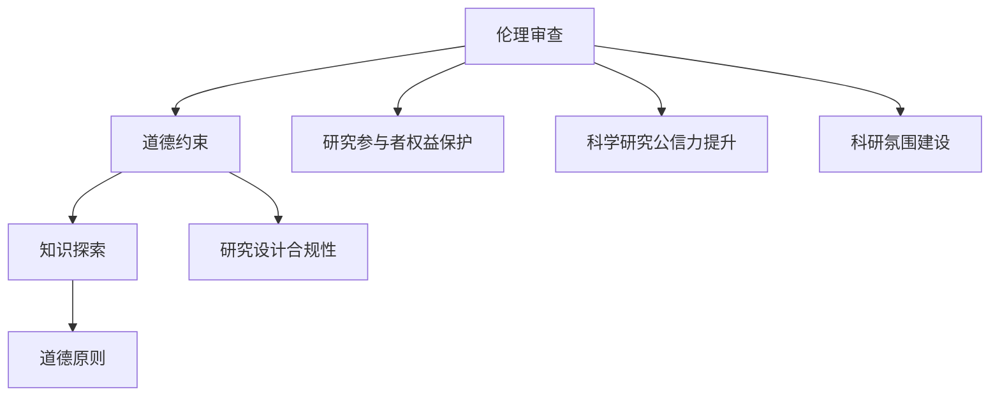

在这个流程图中，伦理审查作为核心机制，连接了道德约束、知识探索和道德原则，同时保障了研究参与者的权益和保护研究设计的合规性。这些概念相互交织，共同构成了科学研究的伦理审查体系。

#### 核心概念与联系：Mermaid流程图

为了更好地展示伦理审查中各个核心概念之间的关系，我们可以借助Mermaid流程图进行直观描述：

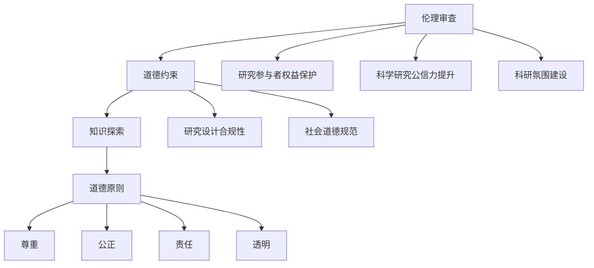

**流程图说明：**
1. **伦理审查**：作为整体框架，连接了道德约束、知识探索、道德原则等多个方面，是伦理审查的核心。
2. **道德约束**：包括研究设计合规性、社会道德规范等，是伦理审查的基本要求。
3. **知识探索**：是科学研究的核心目标，需要遵循道德原则。
4. **道德原则**：包括尊重、公正、责任、透明等，为伦理审查提供了具体标准。
5. **研究参与者权益保护**：确保参与者权益不受侵害，是伦理审查的重要内容。
6. **科学研究公信力提升**：通过伦理审查，提升科学研究的公信力。
7. **科研氛围建设**：良好的科研氛围有助于伦理审查的实施和科学研究的发展。

通过上述流程图，我们可以清晰地看到伦理审查中各个核心概念之间的关系，这有助于我们更深入地理解伦理审查在科学研究中的重要性。在接下来的章节中，我们将进一步探讨伦理审查的历史与发展、核心原则与标准，以及具体的流程与步骤。

#### 核心概念与联系：Python源代码与数学模型

为了深入理解伦理审查的核心概念，我们可以通过Python源代码和数学模型来阐述这些概念之间的关系。以下是一个简单的Python示例，展示了如何使用图论模型来表示伦理审查中的核心概念及其关系。

```python
import networkx as nx
import matplotlib.pyplot as plt

# 创建图
G = nx.Graph()

# 添加节点和边
G.add_node("伦理审查")
G.add_node("道德约束")
G.add_node("知识探索")
G.add_node("道德原则")
G.add_node("研究设计合规性")
G.add_node("研究参与者权益保护")
G.add_node("科学研究公信力提升")
G.add_node("科研氛围建设")
G.add_node("社会道德规范")

G.add_edge("伦理审查", "道德约束")
G.add_edge("道德约束", "知识探索")
G.add_edge("知识探索", "道德原则")
G.add_edge("道德原则", "研究设计合规性")
G.add_edge("伦理审查", "研究参与者权益保护")
G.add_edge("伦理审查", "科学研究公信力提升")
G.add_edge("伦理审查", "科研氛围建设")
G.add_edge("道德约束", "社会道德规范")

# 绘制图
nx.draw(G, with_labels=True)
plt.show()
```

**代码解读：**

1. **引入库**：使用`networkx`和`matplotlib.pyplot`库来创建和绘制图。
2. **创建图**：使用`nx.Graph()`创建一个图对象。
3. **添加节点和边**：使用`add_node()`添加节点，使用`add_edge()`添加边，表示各个概念之间的关系。
4. **绘制图**：使用`nx.draw()`绘制图，并使用`plt.show()`显示图形。

在这个图中，节点代表核心概念，边代表概念之间的关系。例如，“伦理审查”与“道德约束”、“研究参与者权益保护”等概念通过边连接，展示了它们之间的紧密关系。

**数学模型：**

为了更深入地理解伦理审查中的关键概念，我们可以引入数学模型，如决策树和贝叶斯网络，来表示伦理审查的决策过程。以下是使用决策树模型的一个简单示例：

```python
from sklearn.tree import DecisionTreeClassifier
from sklearn.model_selection import train_test_split

# 假设我们有以下特征和标签
X = [[0, 0], [1, 0], [0, 1], [1, 1]]  # 特征：道德约束、知识探索
y = [0, 1, 1, 0]  # 标签：是否通过伦理审查

# 划分训练集和测试集
X_train, X_test, y_train, y_test = train_test_split(X, y, test_size=0.3, random_state=42)

# 创建决策树模型
clf = DecisionTreeClassifier()

# 训练模型
clf.fit(X_train, y_train)

# 预测
print(clf.predict([[1, 1]]))
```

**代码解读：**

1. **引入库**：使用`sklearn.tree`和`sklearn.model_selection`库来创建决策树模型。
2. **假设特征和标签**：特征包括道德约束和知识探索，标签表示是否通过伦理审查。
3. **划分训练集和测试集**：使用`train_test_split()`函数划分数据。
4. **创建模型**：使用`DecisionTreeClassifier()`创建决策树模型。
5. **训练模型**：使用`fit()`函数训练模型。
6. **预测**：使用`predict()`函数预测新数据。

在这个决策树模型中，通过输入特征（道德约束和知识探索），模型可以输出是否通过伦理审查的决策。这有助于我们理解和预测伦理审查的结果。

通过Python源代码和数学模型，我们可以更深入地理解伦理审查中的核心概念及其关系。这为后续章节的详细讨论奠定了基础。在接下来的内容中，我们将进一步探讨伦理审查的历史与发展，以及其核心原则与标准。

#### 科学研究的伦理审查历史与发展

伦理审查作为科学研究的制度性安排，其起源和发展历程体现了科学与社会价值观的不断互动与演进。以下是对伦理审查历史与发展的简要回顾。

**伦理审查的起源**

伦理审查的起源可以追溯到20世纪初。当时的医学界开始关注医学实验中患者的权益保护。1947年，著名的《纽伦堡法典》问世，这是全球第一个明确规定医学研究伦理规范的国际性文件。《纽伦堡法典》的核心原则包括尊重个人的自主权、避免伤害和保护人类尊严。这些原则为后来的伦理审查制度奠定了基础。

**伦理审查的发展**

随着医学伦理问题的日益突出，20世纪50年代至70年代，医学伦理审查委员会（Institutional Review Boards, IRBs）逐渐在美国及其他发达国家建立。1964年，美国国会通过了《公共卫生服务法案》，要求所有接受联邦资金的医学研究项目必须通过伦理审查。这一法案的通过标志着伦理审查在美国的正式确立。

随后，伦理审查逐渐扩展到其他学科领域。20世纪70年代，生物医学伦理委员会（Bioethics Committees）在医学研究的基础上，进一步涵盖了生命伦理问题。与此同时，伦理审查在国际上得到了广泛的认可。1975年，世界卫生组织（WHO）发布了《赫尔辛基宣言》，强调医学研究的伦理原则，为全球医学研究伦理审查提供了指导。

**国内伦理审查体系的演变**

我国伦理审查体系的发展相对较晚。20世纪80年代，随着改革开放的深入，我国开始引入医学伦理审查制度。1987年，中国医学科学院设立了我国第一个医学伦理委员会。随后，各大医院和研究机构纷纷建立了伦理审查委员会。

2003年，我国发布了《中华人民共和国生物安全法》，要求生物实验活动必须经过伦理审查。2006年，国家食品药品监督管理局发布了《药物临床试验质量管理规范（GCP）》，明确了药物临床试验的伦理审查要求。此后，伦理审查逐渐成为我国科学研究中的重要环节。

**伦理审查在不同学科领域的发展**

伦理审查不仅局限于医学领域，还扩展到社会科学、环境科学、信息技术等学科。随着科学研究领域的不断拓展，伦理审查的规范化和专业化程度也在不断提高。

在社会科学领域，伦理审查主要关注研究过程中的隐私保护、数据安全和受试者权益。例如，问卷调查、实验研究和数据分析等研究活动都需要经过严格的伦理审查。

在环境科学领域，伦理审查关注环境研究的可持续性和对人类及其他生物的影响。例如，环境监测、生态修复和资源开发等项目都需要经过伦理审查，以确保研究的合规性和环境影响评估。

在信息技术领域，伦理审查主要涉及数据隐私、算法偏见和人工智能应用等。随着人工智能和大数据技术的快速发展，伦理审查在信息技术领域的应用日益广泛，旨在确保技术发展符合道德和法律要求，保护用户隐私和社会公共利益。

**伦理审查的趋势与挑战**

当前，伦理审查正面临着一系列新的挑战和趋势。首先，全球化和国际合作的加强，要求各国伦理审查体系之间保持一致性和兼容性。其次，新兴技术的快速发展，如基因编辑、人工智能和区块链等，为伦理审查提出了新的问题。此外，公众对隐私保护和数据安全的关注增加，也对伦理审查提出了更高的要求。

总之，伦理审查作为科学研究的重要保障，其历史与发展反映了科学与社会价值观的互动与演进。面对新的挑战和趋势，伦理审查需要不断适应和改进，以更好地平衡知识探索与道德约束，保障科学研究的健康和可持续发展。

#### 伦理审查的核心原则与标准

伦理审查的核心原则与标准是确保科学研究在道德和法律框架内进行的重要基础。以下将详细讨论伦理审查的几个关键原则和标准，并探讨这些原则在实际应用中的具体体现。

##### 尊重个人自主权

尊重个人自主权是伦理审查的首要原则。这一原则强调研究参与者有权自主决定是否参与研究，并在研究过程中保持知情同意的权利。具体而言，研究者需要在研究开始前详细告知参与者研究的性质、目的、过程、风险和利益，确保参与者基于充分信息做出自愿的决定。

在实际操作中，研究者需要制定详尽的知情同意书，并在研究过程中保持参与者的隐私和安全。例如，在生物医学研究中，伦理审查委员会通常会要求研究者提供知情同意书的样本，并进行审核，以确保知情同意书的内容完整、准确且易于理解。

```latex
$$
\text{知情同意书应包含以下要素：}
$$
1. \text{研究目的和性质}
2. \text{研究过程和参与者的角色}
3. \text{潜在风险和利益}
4. \text{保密措施}
5. \text{参与者的退出权}
6. \text{研究者和机构的联系方式}
```

##### 避免伤害

避免伤害原则要求在研究过程中尽量减少参与者的身体和心理伤害。这不仅包括直接的身体伤害，还涵盖了研究过程中可能带来的心理创伤、情感困扰等。为了避免伤害，研究者需要在研究设计阶段评估潜在的负面影响，并在知情同意书中明确告知。

例如，在药物临床试验中，研究者需要仔细评估药物可能带来的副作用，并采取必要的安全措施，如监测参与者的健康状况、提供紧急医疗支持等。以下是一个简化的药物临床试验风险评估的Python代码示例：

```python
def risk_assessment(side_effects, participant_health):
    """
    风险评估函数：评估药物副作用对参与者健康状况的影响。
    
    :param side_effects: 药物的副作用列表
    :param participant_health: 参与者的健康状况列表
    :return: 风险评估结果
    """
    risk_level = "低"
    for side_effect in side_effects:
        if side_effect in participant_health:
            risk_level = "中"
            break
        if any(side_effect in health for health in participant_health):
            risk_level = "高"
            break
    return risk_level

# 示例：药物副作用列表和参与者健康状况列表
side_effects = ["头痛", "恶心", "失眠"]
participant_health = ["头痛", "恶心"]

# 风险评估
print(risk_assessment(side_effects, participant_health))
```

##### 公平分配利益与负担

公平分配原则要求研究参与者能够公平地分享研究带来的利益和承担相应的负担。这一原则旨在避免因研究资源分配不均导致的社会不公平现象。在实际操作中，研究者需要确保所有参与者都有平等的参与机会，并在研究结束后公平地分享研究成果。

例如，在临床试验中，研究者需要确保所有参与者的基本医疗需求得到满足，无论其经济状况如何。此外，研究者还需要公平地分享研究成果，例如通过发表学术论文、公开报告等方式，使参与者和社会受益。

```latex
$$
\text{公平分配利益与负担的措施包括：}
$$
1. \text{确保参与者的医疗保健需求得到满足}
2. \text{公开研究成果，分享知识成果}
3. \text{为参与者提供持续的支持和关怀}
```

##### 透明度与公众参与

透明度原则要求研究过程的各个环节都应保持公开和透明，以增强研究结果的可靠性和公信力。公众参与原则则强调研究过程中公众的知情权和参与权，有助于提升研究的伦理合法性和社会认可度。

在实际操作中，研究者需要确保研究计划的透明度，如通过公开研究计划书、邀请公众参与伦理审查会议等。此外，研究者还需要定期向公众报告研究进展和成果，以增强公众对科学研究的信任和支持。

```latex
$$
\text{透明度和公众参与的具体措施包括：}
$$
1. \text{公开研究计划书和伦理审查结果}
2. \text{邀请公众参与伦理审查会议}
3. \text{定期报告研究进展和成果}
4. \text{建立公众咨询和反馈机制}
```

##### 标准化审查流程

标准化审查流程是确保伦理审查质量和效率的重要保障。审查流程通常包括审查准备、申请提交、文档审核、审查会议和决策反馈等环节。以下是一个简化的伦理审查流程图：

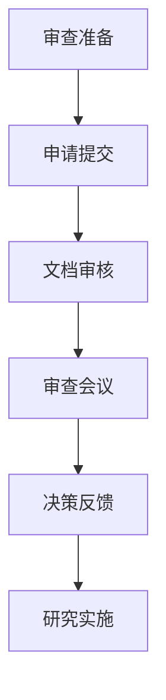

**审查准备**：研究者需要准备研究计划书、知情同意书等相关文档，并确保这些文档符合伦理审查的要求。

**申请提交**：研究者将准备好的文档提交给伦理审查委员会进行审核。

**文档审核**：伦理审查委员会对提交的文档进行初步审核，确保研究计划符合伦理标准和法律法规。

**审查会议**：伦理审查委员会召开会议，对研究计划进行深入讨论和评估。

**决策反馈**：根据审查会议的结果，伦理审查委员会做出是否批准研究的决定，并向研究者提供反馈。

**研究实施**：在获得伦理审查批准后，研究者开始实施研究计划。

通过上述核心原则和标准化流程，伦理审查能够确保科学研究在道德和法律框架内进行，同时最大限度地保护研究参与者的权益，促进科学知识的健康和可持续发展。

#### 伦理审查的流程与步骤

伦理审查的流程是确保科学研究在道德和法律框架内进行的关键环节。以下将详细描述伦理审查的具体流程与步骤，包括审查准备、申请提交、文档审核、审查会议、决策反馈和研究实施等环节，并辅以图和示例代码，帮助读者更好地理解这一过程。

##### 审查准备

审查准备是伦理审查的第一个步骤，也是最为关键的一步。研究者需要详细制定研究计划，包括研究目的、方法、预期结果、潜在风险和利益分析等。此外，研究者还需要准备知情同意书、研究伦理审查申请书等相关文档。

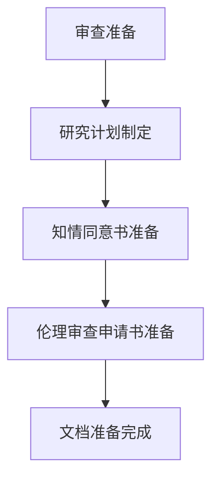

**示例代码**：以下是一个Python示例，用于生成知情同意书的文本：

```python
def generate_informed Consent():
    content = """
    知情同意书

    尊敬的参与者：

    您正在被邀请参与我们的研究项目。我们承诺将尊重您的隐私和自主权，并确保您的参与是自愿和安全的。

    研究目的：[此处填写研究目的]
    研究方法：[此处填写研究方法]
    预期结果：[此处填写预期结果]
    潜在风险：[此处填写潜在风险]
    利益：[此处填写潜在利益]

    您有权选择是否参与本研究。如果您同意参与，请在下面签名。

    研究者签名：________________
    日期：________________

    """
    return content

print(generate_informed_Consent())
```

##### 申请提交

在审查准备完成后，研究者需要将所有相关文档提交给伦理审查委员会。提交的过程通常包括在线填写申请表、上传文档、提交审批等步骤。

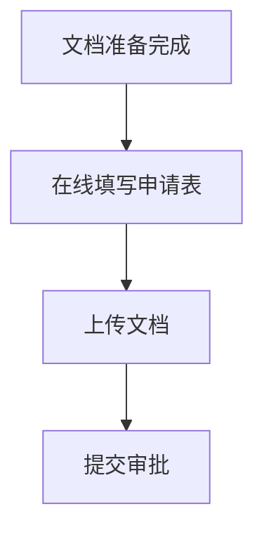

**示例代码**：以下是一个Python示例，用于模拟在线提交伦理审查申请：

```python
import requests

def submit_application(url, application_data):
    """
    提交伦理审查申请。

    :param url: 申请提交的URL
    :param application_data: 申请数据
    :return: 提交结果
    """
    headers = {'Content-Type': 'application/json'}
    response = requests.post(url, headers=headers, json=application_data)
    return response.json()

# 假设的应用提交接口和申请数据
url = "http://ethics-review.example.com/submit"
application_data = {
    "researcher_name": "张三",
    "study_title": "研究项目名称",
    "informed_consent": generate_informed_Consent()
}

# 提交申请
result = submit_application(url, application_data)
print(result)
```

##### 文档审核

伦理审查委员会在收到申请后，会对提交的文档进行初步审核。审核的内容通常包括研究计划、知情同意书、伦理审查申请书等，确保所有文档齐全、符合伦理审查要求。

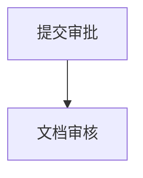

**示例代码**：以下是一个Python示例，用于模拟文档审核过程：

```python
import json

def check_document_compliance(document, compliance_rules):
    """
    检查文档是否符合伦理审查要求。

    :param document: 文档内容
    :param compliance_rules: 符合性规则
    :return: 检查结果
    """
    compliance = True
    for rule in compliance_rules:
        if not all(rule in document for rule in compliance_rules[rule]):
            compliance = False
            break
    return compliance

# 假设的文档内容和符合性规则
document = {
    "researcher_name": "张三",
    "study_title": "研究项目名称",
    "informed_consent": "知情同意书文本"
}
compliance_rules = {
    "required_fields": ["researcher_name", "study_title", "informed_consent"]
}

# 检查文档符合性
result = check_document_compliance(document, compliance_rules)
print(f"文档符合性检查结果：{result}")
```

##### 审查会议

伦理审查委员会在完成文档审核后，会召开审查会议对研究计划进行深入讨论和评估。会议的内容通常包括研究计划、知情同意书、伦理审查申请书的详细讨论，以及委员会成员的投票表决。

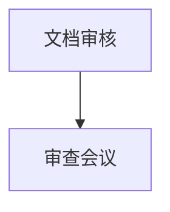

**示例代码**：以下是一个Python示例，用于模拟审查会议的决策过程：

```python
import random

def review_meeting_vote(voters):
    """
    审查会议投票。

    :param voters: 投票者列表
    :return: 决策结果
    """
    votes = [voter.vote() for voter in voters]
    if sum(votes) > len(votes) / 2:
        decision = "批准"
    else:
        decision = "不批准"
    return decision

class Voter:
    def vote(self):
        return random.choice(["同意", "反对"])

# 假设的投票者列表
voters = [Voter() for _ in range(5)]

# 审查会议投票
result = review_meeting_vote(voters)
print(f"审查会议决策结果：{result}")
```

##### 决策反馈

审查会议结束后，伦理审查委员会会向研究者提供反馈，说明审批结果以及具体意见。如果研究计划被批准，研究者可以开始实施研究；如果被拒绝，研究者需要根据反馈进行修改并重新提交申请。

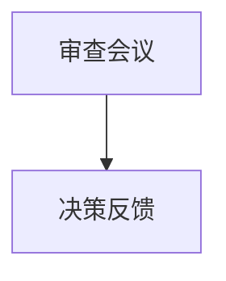

**示例代码**：以下是一个Python示例，用于模拟决策反馈过程：

```python
def provide_feedback(result, comments):
    """
    提供反馈。

    :param result: 审批结果
    :param comments: 具体意见
    :return: 反馈结果
    """
    feedback = f"审批结果：{result}\n具体意见：{comments}"
    return feedback

# 假设的审批结果和具体意见
result = "批准"
comments = "请确保按照研究计划书执行研究，注意保护参与者权益。"

# 提供反馈
print(provide_feedback(result, comments))
```

##### 研究实施

在获得伦理审查批准后，研究者可以开始实施研究计划。研究实施的过程需要严格遵循审查委员会的要求，确保研究过程的合规性和参与者的权益。

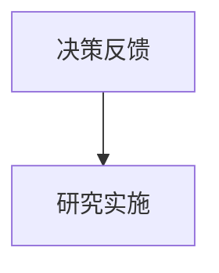

**示例代码**：以下是一个Python示例，用于模拟研究实施的监控过程：

```python
import time

def monitor_study_progress(progress_data, review_interval=1):
    """
    监控研究进展。

    :param progress_data: 研究进展数据
    :param review_interval: 监控间隔
    :return: 监控结果
    """
    while True:
        current_time = time.strftime("%Y-%m-%d %H:%M:%S")
        progress = input("请输入当前研究进展：")
        print(f"监控时间：{current_time}\n研究进展：{progress}")
        time.sleep(review_interval)

# 开始监控研究进展
monitor_study_progress(progress_data)
```

通过上述流程与步骤，伦理审查能够确保科学研究在道德和法律框架内进行，同时最大限度地保护研究参与者的权益。在接下来的章节中，我们将通过具体案例来进一步探讨伦理审查的实际应用和挑战。

#### 伦理审查案例分析

在伦理审查的实际应用中，案例分析是理解和评估其有效性的重要手段。以下将通过几个具体案例，探讨伦理审查在不同学科领域的应用及其面临的挑战。

##### 生物医学研究伦理审查案例

**案例背景**：某研究机构计划开展一项关于新型抗肿瘤药物的临床试验。该药物尚未经过大规模临床试验，具有潜在的安全风险。

**伦理审查过程**：
1. **审查准备**：研究者准备研究计划书、知情同意书、伦理审查申请书等相关文档，详细描述研究目的、方法、潜在风险和利益。
2. **申请提交**：研究者将所有文档提交给伦理审查委员会进行初步审核。
3. **文档审核**：伦理审查委员会对提交的文档进行审核，确保研究计划符合伦理标准和法律法规。
4. **审查会议**：伦理审查委员会召开会议，对研究计划进行深入讨论。会议内容包括研究设计、参与者权益保护、药物安全性评估等。
5. **决策反馈**：伦理审查委员会经过讨论，决定是否批准研究。如批准，要求研究者采取额外的安全措施，例如增加监测频次、设立紧急医疗支持等。

**挑战与对策**：
- **挑战**：新型药物临床试验的风险较高，如何确保研究参与者的安全是一个重要问题。
- **对策**：伦理审查委员会要求研究者制定详细的风险评估计划，并在研究过程中增加监测和紧急医疗支持。此外，研究者需定期向伦理审查委员会报告研究进展和参与者的健康状况。

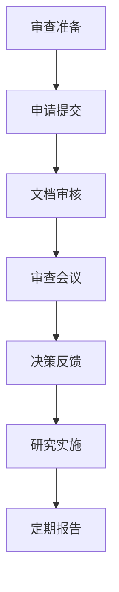

##### 社会科学研究伦理审查案例

**案例背景**：某大学心理学系计划开展一项关于社交媒体使用对青少年心理健康影响的问卷调查。

**伦理审查过程**：
1. **审查准备**：研究者准备研究计划书、知情同意书、伦理审查申请书等相关文档，详细描述研究目的、方法、潜在风险和利益。
2. **申请提交**：研究者将所有文档提交给伦理审查委员会进行初步审核。
3. **文档审核**：伦理审查委员会对提交的文档进行审核，确保研究计划符合伦理标准和法律法规。
4. **审查会议**：伦理审查委员会召开会议，对研究计划进行深入讨论。会议内容包括研究设计的合理性、问卷设计的隐私保护等。
5. **决策反馈**：伦理审查委员会经过讨论，决定是否批准研究。如批准，要求研究者确保问卷匿名性和参与者隐私保护。

**挑战与对策**：
- **挑战**：问卷调查的隐私保护问题，尤其是涉及敏感信息的收集。
- **对策**：伦理审查委员会要求研究者使用匿名问卷，并确保参与者的隐私不被泄露。此外，研究者需在问卷中明确告知参与者研究目的和隐私保护措施。

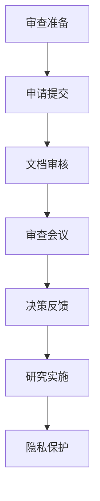

##### 环境科学研究伦理审查案例

**案例背景**：某研究团队计划进行一项关于某地区水质污染的生态监测研究。

**伦理审查过程**：
1. **审查准备**：研究者准备研究计划书、知情同意书、伦理审查申请书等相关文档，详细描述研究目的、方法、潜在风险和利益。
2. **申请提交**：研究者将所有文档提交给伦理审查委员会进行初步审核。
3. **文档审核**：伦理审查委员会对提交的文档进行审核，确保研究计划符合伦理标准和法律法规。
4. **审查会议**：伦理审查委员会召开会议，对研究计划进行深入讨论。会议内容包括研究方法、数据采集过程、对环境的影响等。
5. **决策反馈**：伦理审查委员会经过讨论，决定是否批准研究。如批准，要求研究者确保研究过程中对环境的影响最小化。

**挑战与对策**：
- **挑战**：研究过程中可能对环境造成的影响，尤其是对生态系统的影响。
- **对策**：伦理审查委员会要求研究者制定详细的环境影响评估报告，并在研究过程中采取相应的环境保护措施。此外，研究者需定期向伦理审查委员会报告研究进展和环境影响。

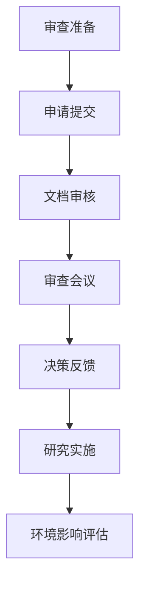

通过上述案例分析，我们可以看到伦理审查在不同学科领域的实际应用及其面临的挑战。伦理审查不仅需要确保研究的道德合规性，还需要考虑到实际操作中的各种复杂因素。这些案例为我们提供了宝贵的经验和教训，有助于更好地理解和应对伦理审查中的各种问题。

#### 伦理审查的挑战与应对策略

随着科技的发展，伦理审查面临着越来越多的挑战。如何应对这些挑战，确保伦理审查的规范性和有效性，是当前科学研究中的一个重要议题。以下是几个主要挑战及其应对策略。

##### 知识更新与培训需求

随着新技术的不断涌现，伦理审查的知识库也需要不断更新。例如，基因编辑、人工智能和大数据技术的应用，为科学研究带来了新的伦理挑战。伦理审查委员会和研究者需要不断学习新的伦理原则和技术知识，以适应快速变化的研究环境。

**应对策略**：
- **建立持续培训机制**：定期组织伦理审查培训和研讨会，提高审查委员会和研究者对新兴技术的伦理认识。
- **推广在线教育资源**：开发在线课程和培训材料，方便全球范围内的伦理审查人员和研究者学习。

##### 国际合作与法规差异

国际合作日益频繁，但不同国家和地区的伦理审查法规和标准存在差异。这可能导致跨国研究项目的伦理审查复杂化，增加协调难度。

**应对策略**：
- **建立国际共识**：通过国际组织和学术会议，推动建立全球伦理审查的共识和标准。
- **跨区域合作**：建立跨国伦理审查合作机制，如联合审查委员会，以简化跨国研究项目的审查流程。

##### 研究者的伦理责任

研究者的伦理责任是伦理审查的核心。然而，一些研究者可能忽视伦理规范，导致研究过程中出现伦理问题。

**应对策略**：
- **强化伦理教育**：在研究生和科研人员的培训中，加强伦理教育的比重，培养其伦理意识和责任感。
- **建立伦理监督机制**：设立独立的伦理监督机构，对研究者的伦理行为进行监督和评估。

##### 公众参与与透明度

公众对隐私保护和数据安全的关注增加，要求伦理审查过程更加透明和公开。但过度的透明度可能泄露参与者的隐私信息，带来新的挑战。

**应对策略**：
- **平衡透明度和隐私保护**：在公开研究信息时，采取匿名化处理，保护参与者的隐私。
- **建立公众参与机制**：通过公开听证会、问卷调查等方式，增加公众对伦理审查过程的参与和监督。

##### 道德争议与决策难度

伦理审查过程中可能会遇到复杂的道德争议，如基因编辑、人工智能应用等领域的争议。这要求伦理审查委员会在决策时具备高超的道德判断能力。

**应对策略**：
- **加强道德辩论**：在审查会议中，鼓励各方就道德争议进行充分讨论，形成共识。
- **引入第三方咨询**：在遇到特别复杂的道德争议时，可以引入第三方伦理专家进行咨询，提供独立的意见和建议。

总之，伦理审查的挑战是多方面的，需要通过多种策略综合应对。只有通过持续的学习、国际合作和制度建设，才能确保伦理审查在科学研究中的有效性和公正性。

#### 国际伦理审查比较

在全球化的背景下，不同国家和地区的伦理审查制度逐渐呈现出多样性和相互借鉴的趋势。以下将简要介绍几种主要国家和地区的伦理审查体系，并探讨它们之间的异同。

##### 美国伦理审查体系

美国是世界上最早建立伦理审查制度的国家之一。美国的伦理审查主要由机构审查委员会（Institutional Review Boards, IRBs）负责，这些委员会通常由医生、律师、伦理学家、社区代表等组成。IRBs的职责包括审核和监督涉及人类参与者的研究项目，确保研究活动符合伦理标准和法律法规。

美国伦理审查的特点包括：
- **严格的审批流程**：美国伦理审查通常包括申请提交、初步审核、全面审查、审批反馈等多个环节。
- **多样性**：美国拥有大量的IRBs，不同机构对伦理审查的要求可能有所不同。
- **重视隐私保护**：美国伦理审查强调保护研究参与者的隐私和信息安全。

##### 欧洲伦理审查体系

欧洲各国的伦理审查制度较为统一，欧盟颁布了《关于生物医学研究中的患者权利、临床试验和伦理审查的指南》，为成员国提供了伦理审查的基本框架。欧洲的伦理审查主要由伦理审查委员会（Ethics Committees）负责，这些委员会通常隶属于医院或研究机构。

欧洲伦理审查的特点包括：
- **统一性**：欧盟成员国必须遵循欧盟的伦理审查指南，确保审查标准的一致性。
- **公开透明**：欧洲伦理审查过程强调公开和透明，审查会议通常公开进行，并允许公众参与。
- **多元化参与**：欧洲伦理审查委员会通常由不同领域的专家、公众代表等组成，确保审查的全面性和公正性。

##### 中国伦理审查体系

中国的伦理审查制度相对较新，随着科研活动的增加，伦理审查的重要性逐渐被认识和重视。中国的伦理审查主要由伦理审查委员会（Ethics Committees）负责，这些委员会通常隶属于医院、大学和研究机构。

中国伦理审查的特点包括：
- **快速发展**：随着国家法律法规的完善和科研活动的增加，中国伦理审查体系正在迅速发展。
- **区域差异**：不同地区的伦理审查标准存在差异，部分地区的伦理审查制度较为严格，部分地区则相对宽松。
- **政策引导**：中国政府通过颁布相关政策和法规，引导和规范伦理审查活动。

##### 国际伦理审查比较与启示

不同国家和地区的伦理审查体系在审批流程、审查标准、透明度和公众参与等方面存在显著差异。以下是比较和启示：

- **审批流程**：美国的审批流程较为复杂，需要经过多个环节的审查；欧洲的审批流程相对统一，但成员国之间存在差异；中国的审批流程正在不断完善和规范化。
- **审查标准**：欧洲的伦理审查标准较为统一，遵循欧盟的指导原则；美国的审查标准多样，不同机构的审查要求可能有所不同；中国的审查标准正在逐步与国际接轨。
- **透明度和公众参与**：欧洲的伦理审查强调公开透明和公众参与；美国的伦理审查过程较为封闭，但逐渐重视公开和透明；中国的伦理审查正在逐步提高透明度，并逐步引入公众参与机制。

通过比较不同国家和地区的伦理审查体系，我们可以得出以下启示：

1. **完善法律法规**：建立和完善伦理审查的法律法规，确保伦理审查的规范化和制度化。
2. **统一审查标准**：在保持地区差异的同时，逐步统一审查标准，提高审查的一致性和公正性。
3. **增强透明度**：通过公开审查过程、建立信息公开机制，提高伦理审查的透明度和公信力。
4. **加强国际合作**：通过国际合作和交流，借鉴其他国家和地区的成功经验，提高我国伦理审查的质量和效率。

总之，国际伦理审查的比较为我们提供了宝贵的经验和启示，有助于我们不断完善和优化伦理审查体系，确保科学研究在道德和法律框架内进行。

#### 国际伦理审查实践与启示

国际伦理审查在实践中积累了丰富的经验，这些经验对我国伦理审查体系的完善具有重要的借鉴意义。以下将介绍一些国际伦理审查的典型实践，并探讨其对我国的启示。

##### **国际伦理审查的典型实践**

1. **严格的审批流程**：美国和欧洲等国家通常采用多步骤的审批流程，包括初步审查、全面审查和持续审查。这样的流程设计有助于确保研究的合规性和安全性。例如，美国的IRBs会对研究计划进行详细的审核，包括研究设计、参与者权益保护、隐私保护措施等。此外，研究者在研究过程中需要定期向IRBs提交进展报告，确保研究活动的持续合规。

2. **多元参与机制**：欧洲的伦理审查委员会通常由医学专家、法律专家、社会学者、患者代表等组成，这种多元参与机制有助于从不同角度全面评估研究项目的伦理问题。例如，在德国，伦理审查委员会中必须包括患者代表，以确保患者权益得到充分保障。

3. **公众参与与透明度**：欧洲和美国的伦理审查过程强调公开透明，审查会议通常会公开进行，并允许公众和媒体参与。这种做法有助于增强审查的公信力和透明度。例如，美国的许多IRBs会在其官方网站上公布审查决定和会议记录，公众可以随时查阅。

4. **风险评估与管理**：国际上的伦理审查注重对研究风险进行评估和管理。例如，在药物临床试验中，伦理审查委员会会要求研究者详细评估药物的安全性和潜在风险，并提出相应的风险管理措施。

##### **对我国的启示**

1. **完善审批流程**：我国可以借鉴国际经验，完善伦理审查的审批流程，确保审查的规范性和全面性。例如，可以建立多层次的审查机制，包括初步审查、详细审查和持续审查，同时要求研究者在研究过程中定期提交进展报告。

2. **多元化参与**：我国可以引入多元参与机制，增加伦理审查委员会中的公众和患者代表比例，确保审查过程更具代表性和公正性。例如，可以邀请社会学者、患者代表、法律专家等参与伦理审查，从不同角度评估研究项目的伦理问题。

3. **提高透明度**：我国可以借鉴国际经验，提高伦理审查的透明度。例如，可以通过建立伦理审查信息公开平台，公开审查决定、审查会议记录和研究进展报告，增强公众对伦理审查过程的信任。

4. **强化风险评估**：我国可以加强风险评估和管理，特别是在高风险研究领域，如基因编辑、人工智能等。例如，可以要求研究者详细评估研究风险，并制定相应的风险管理措施，确保研究活动的安全性和合规性。

总之，国际伦理审查的实践为我国提供了宝贵的经验和启示。通过借鉴国际经验，完善我国的伦理审查体系，可以更好地保障科学研究在道德和法律框架内进行，促进科学知识的健康发展。

### 总结

《科学研究的伦理审查：平衡知识探索与道德约束》这篇文章全面探讨了伦理审查在科学研究中的重要性、核心原则与标准、流程与步骤、案例分析以及国际比较。通过这篇文章，我们深入理解了伦理审查如何平衡知识探索与道德约束，保障研究参与者的权益，提高科学研究的公信力。

伦理审查作为科学研究的重要组成部分，不仅要求研究者遵循道德和法律规范，还需要具备高度的伦理意识和责任感。在当前科技迅速发展的时代，伦理审查面临着新的挑战，如新兴技术的应用、国际合作与法规差异等。因此，伦理审查需要不断创新和完善，以适应不断变化的研究环境。

未来，伦理审查的发展方向将更加注重透明度和公众参与，通过建立公开透明的审查机制和公众参与平台，增强伦理审查的公信力和公众信任。同时，随着人工智能、大数据等新兴技术的广泛应用，伦理审查也需要加强对这些领域的研究，制定相应的伦理标准和规范，确保科技发展符合道德和法律要求。

呼吁广大科研工作者和伦理审查人员，共同关注和参与伦理审查工作，提升伦理审查的规范性和有效性，共同推动科学研究的健康和可持续发展。

### 最佳实践 Tips、小结、注意事项、拓展阅读

**最佳实践 Tips**：
1. **明确研究目标**：在开展研究之前，明确研究目标，有助于制定合理的伦理审查计划。
2. **充分准备文档**：确保所有伦理审查所需的文档齐全、准确，包括知情同意书、研究计划书等。
3. **建立定期审查机制**：定期对研究项目进行伦理审查，确保研究过程符合伦理标准。

**小结**：
本文通过详细介绍伦理审查的核心原则、流程与步骤，结合实际案例与国际比较，阐述了伦理审查在平衡知识探索与道德约束中的重要作用。

**注意事项**：
1. **保护参与者权益**：确保研究过程中充分尊重参与者的自主权，避免潜在伤害。
2. **加强伦理培训**：定期对科研人员和伦理审查人员进行伦理培训，提高伦理意识。

**拓展阅读**：
1. 《伦理审查委员会手册：操作指南与案例研究》
2. 《生物医学伦理学：基础、原则与实践》
3. 《人工智能伦理：框架、挑战与未来》

通过阅读这些书籍和文献，读者可以进一步深入了解伦理审查的实践和应用，提升自身在科学研究中的伦理素养。作者：AI天才研究院/AI Genius Institute & 禅与计算机程序设计艺术 /Zen And The Art of Computer Programming。

