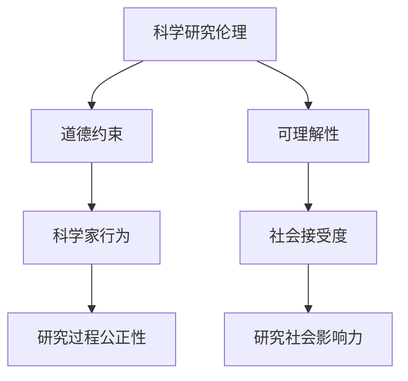

                 

### 引言

科学研究作为推动社会进步和人类文明发展的重要力量，一直在不断探索自然界的奥秘。然而，随着科学研究的深入，其伦理问题也逐渐暴露出来。科学研究的伦理问题不仅关乎科学家个人的道德品质，还关系到科学研究本身的正当性和社会的接受度。在这个背景下，探讨科学研究的伦理问题以及道德约束对世界可理解性的影响，具有重要的现实意义。

首先，科学研究的伦理问题主要涉及以下几个方面：

1. **数据诚信**：包括数据造假、抄袭、篡改等不端行为。
2. **人类实验**：涉及对人类个体的实验，包括人体试验、基因编辑等。
3. **动物实验**：如何对待动物实验，如何确保动物的福利。
4. **知识产权**：科研成果的知识产权归属，如何保护发明人的合法权益。
5. **科研资源的分配**：如何公平地分配科研资源，确保不同地区、不同群体的科研机会均等。

道德约束是指在科学研究中，科学家和科研机构需要遵守的一系列道德规范和伦理原则。道德约束的重要性体现在以下几个方面：

1. **确保科学研究的正当性**：道德约束是科学研究合法性的基础，只有遵守道德规范的研究才能被社会接受。
2. **保障科研人员的道德品质**：道德约束有助于培养科学家的道德素养，提高其社会责任感。
3. **维护科学共同体的声誉**：科学家的道德行为直接影响科学共同体的声誉和信任度。

道德约束对世界可理解性的影响主要体现在以下几个方面：

1. **影响科学发现**：道德约束可以引导科学家探索那些对社会有益的科学研究方向，避免对人类社会产生负面影响。
2. **影响科学研究的过程**：道德约束要求科学家在研究过程中遵守一定的规范，这有助于提高研究的透明度和可重复性。
3. **影响科学成果的可理解性**：道德约束确保科学成果的发布和传播遵循一定的规范，有助于提高科学成果的可理解性。

本文将从以下几个方面展开讨论：

1. **核心概念与联系**：介绍科学研究伦理、道德约束和可理解性的核心概念，并使用Mermaid流程图展示它们之间的关系。
2. **伦理问题的历史与发展**：回顾科学研究伦理问题的历史，探讨现代科学研究伦理问题的演变及其影响因素。
3. **道德约束的原理**：分析道德原则、道德判断标准和道德责任与义务，并使用伪代码展示道德判断的算法逻辑。
4. **世界可理解性的道德约束**：探讨道德约束如何影响科学发现、科学研究过程和科学成果的可理解性。
5. **案例分析**：分析典型科学研究伦理问题的案例，展示道德约束在实际中的应用。
6. **科学研究的伦理管理**：探讨伦理审查制度和伦理管理的实践，分析道德约束在科研管理中的实施。
7. **未来展望**：展望科学研究伦理的发展趋势，讨论道德约束对科学研究未来发展的挑战，并提出提高科学研究伦理意识的策略。

通过以上内容的讨论，本文旨在深入探讨科学研究的伦理问题，揭示道德约束对世界可理解性的影响，为科学研究的健康发展提供理论支持和实践指导。

### 核心概念与联系

在探讨科学研究的伦理问题时，理解核心概念及其相互联系至关重要。以下是本文讨论的核心概念及其基本定义：

#### 科学研究伦理

科学研究伦理是指在科学研究中应遵循的一系列道德规范和行为准则。它旨在确保科学研究过程的公正性、诚信性和可重复性，同时保护研究参与者的权益。科学研究伦理涵盖了数据诚信、人类和动物实验、知识产权等多个方面。

#### 道德约束

道德约束是指科学家和科研机构在科学研究中应遵守的一系列道德规范和伦理原则。道德约束旨在引导科学家在研究过程中保持道德品质，遵守科学研究的基本原则，确保研究的正当性和社会的接受度。

#### 可理解性

可理解性是指科学研究成果和发现能够被社会公众和同行科学家理解的程度。高可理解性有助于促进科学知识的传播和应用，提高科学的社会影响力。可理解性不仅涉及科学语言和表述的清晰度，还包括研究成果对现实问题的解释力和指导意义。

#### 核心概念之间的关系

科学研究伦理、道德约束和可理解性之间存在紧密的联系。首先，科学研究伦理为道德约束提供了依据，确保科学家在研究过程中的行为符合道德标准。其次，道德约束是维护科学研究伦理的重要手段，通过规范科学家的行为，确保研究的公正性和诚信性。最后，可理解性是科学研究伦理和道德约束的目标之一，确保科学成果能够为社会公众所理解和接受。

为了更直观地展示这些概念之间的关系，我们可以使用Mermaid流程图来构建科学研究的伦理框架：



在上述流程图中，A表示科学研究伦理，B表示道德约束，C表示可理解性。D表示道德约束对科学家行为的影响，确保研究过程公正性（F）。E表示可理解性对科学研究成果的社会接受度的影响，提高研究的社会影响力（G）。通过这个流程图，我们可以清晰地看到科学研究伦理、道德约束和可理解性之间的相互作用和相互依赖关系。

理解这些核心概念及其相互联系，有助于我们深入探讨科学研究的伦理问题，以及道德约束对科学研究的整体影响。在接下来的章节中，我们将进一步分析科学研究伦理问题的历史与发展，详细探讨道德约束的原理，并分析道德约束对科学研究的具体影响。

### 伦理问题的历史与发展

科学研究的伦理问题并非一蹴而就，而是随着科学的发展和社会的进步逐渐显现并演变的。在历史上，科学研究伦理问题的出现和发展可以分为几个重要的阶段，每个阶段都有其独特的背景和挑战。

#### 早期科学研究伦理问题

在科学研究刚刚起步的时期，伦理问题并未受到足够的关注。这一阶段，科学研究主要依赖于个人的智慧和直觉，实验方法和工具相对简单。然而，随着科学研究的深入，一些伦理问题逐渐显现：

1. **数据造假**：早期科学家有时为了追求突破性成果，可能会进行数据造假。例如，伽利略在描述自由落体运动时，曾利用了部分伪造的数据来支持自己的理论。

2. **知识产权争议**：在知识产权概念尚未明确的情况下，科学家们对科研成果的归属权产生了争议。例如，牛顿和莱布尼茨在微积分发明权上的争议，持续了数百年。

3. **动物实验**：在科学研究中，动物实验是获取数据的重要手段。然而，早期科学家并未充分考虑到动物的福利问题，动物实验的伦理问题开始引起关注。

#### 现代科学研究伦理问题的演变

随着科学技术的飞速发展，现代科学研究面临着更加复杂和严峻的伦理问题。以下是一些重要的现代科学研究伦理问题：

1. **人类实验**：在生物医学研究中，人类实验的伦理问题备受关注。例如，纳粹医生的实验行为以及美国军队在越战期间进行的化学武器测试，都引起了广泛的伦理质疑。

2. **基因编辑**：随着CRISPR-Cas9等基因编辑技术的出现，科学家可以在细胞层面上进行精确的基因修改。然而，基因编辑的伦理问题，如对后代的影响、基因编辑的道德底线等，成为科学研究的重要议题。

3. **人工智能与大数据**：人工智能和大数据技术的发展，带来了新的伦理问题。例如，算法偏见、隐私泄露、数据滥用等问题，都需要在伦理层面进行深入探讨。

#### 科学研究伦理问题的影响因素

科学研究伦理问题的出现和演变，受到多个因素的影响：

1. **科学技术的发展**：新技术的出现往往带来新的伦理挑战。例如，基因编辑技术的出现，使得科学家可以编辑人类基因组，但同时也引发了伦理争议。

2. **社会价值观的变化**：随着社会价值观的变化，人们对于科学研究的期望和容忍度也在变化。例如，随着环保意识的提高，人们对科学研究的可持续性提出了更高的要求。

3. **法律和政策的制定**：法律和政策的制定对于科学研究伦理问题的解决具有重要作用。例如，各国制定的科研伦理法规，为科学研究提供了明确的道德准则和行为指南。

4. **公众的参与和监督**：公众的参与和监督对科学研究伦理问题的解决具有重要意义。通过公众的监督和反馈，科学家和科研机构能够更加透明和负责任地进行研究。

综上所述，科学研究伦理问题的历史与发展是一个动态的过程，涉及多个阶段和复杂的影响因素。理解这一历史背景，有助于我们更好地应对现代科学研究中的伦理挑战，确保科学研究在符合道德规范的前提下，为社会的发展做出积极贡献。

### 道德约束的原理

道德约束是科学研究伦理的核心组成部分，它不仅规范科学家的行为，还直接影响科学研究的质量和公信力。为了深入理解道德约束的原理，我们需要从道德原则、道德判断标准以及道德责任和义务等方面进行分析。

#### 道德原则与价值观

道德原则是道德约束的基础，它们为科学家在研究过程中的行为提供了指导。以下是几个关键的道德原则：

1. **公正性**：科学研究应遵循公正原则，确保研究过程和结果的客观性和公平性。这意味着科学家在研究设计、数据收集和结果分析等环节中，不应受到任何不正当的利益驱动。

2. **诚信性**：诚信是科学研究的基石。科学家应诚实地报告研究结果，避免数据造假、篡改或抄袭等不端行为。诚信性要求科学家在科研活动中保持高度的诚信和责任心。

3. **尊重**：尊重原则要求科学家尊重研究对象的权益，包括人类参与者、动物以及环境。例如，在人类实验中，应确保参与者知情同意，保护他们的隐私和尊严；在动物实验中，应确保动物的福利。

4. **责任**：科学家应对其研究成果及其潜在影响负责。这意味着科学家在研究过程中应考虑到可能的负面后果，并采取措施减少这些影响。

道德原则的价值观来源于社会的伦理观念和科学研究的基本原则。不同的文化和社会背景下，道德原则的具体内容和实施方式可能有所不同，但总体上，它们都旨在维护科学研究的正当性和公信力。

#### 道德判断的标准

道德判断是科学家在研究过程中必须面对的重要问题。道德判断的标准主要包括以下几个方面：

1. **合理性**：科学家的道德判断应基于合理的推理和证据。这意味着在进行道德判断时，科学家应充分考虑各种可能的影响因素，并基于事实和数据做出合理的决策。

2. **利益权衡**：科学家在道德判断时应权衡不同利益相关者的权益。例如，在人类实验中，科学家应确保参与者的健康和安全，同时考虑到研究的科学价值和社会利益。

3. **原则与实际相结合**：道德判断不仅要遵循原则，还应考虑到实际情况。在某些特殊情况下，可能需要在严格遵循道德原则与实现实际目标之间进行权衡。

4. **透明性**：道德判断的过程应保持透明，确保所有相关方都能够理解和参与。这有助于增加道德判断的公信力和可接受性。

#### 道德责任与义务

道德责任和义务是道德约束的重要组成部分，它们要求科学家在研究中履行特定的道德义务。以下是几个关键的道德责任和义务：

1. **告知与同意**：在涉及人类参与者的研究中，科学家有义务告知参与者研究的目的、过程和潜在风险，并获取其知情同意。这一过程应透明、无误导，确保参与者有权自主决定是否参与研究。

2. **保护隐私**：科学家有责任保护参与者的隐私，确保他们的个人信息不被泄露。这包括在研究过程中匿名化数据，对数据进行加密存储和传输等。

3. **报告与公开**：科学家有责任报告研究的结果，无论这些结果是否支持预定的假设。公开研究结果有助于科学知识的传播和应用，提高科研的透明度和公信力。

4. **持续关注与监督**：科学家在研究完成后，应持续关注研究的潜在影响，并在必要时采取措施减少负面影响。这包括对实验对象进行长期随访，确保他们的健康和福祉。

为了更好地理解和应用道德约束的原理，我们可以使用伪代码展示道德判断的算法逻辑。以下是一个简化的道德判断算法：

```python
def moral_judgment(evidence, principle, context):
    """
    道德判断算法。
    
    参数：
    evidence: 证据，包括事实和数据。
    principle: 道德原则，如公正性、诚信性、尊重、责任。
    context: 实际情况，包括利益相关者的权益和研究的实际影响。
    
    返回：
    judgment: 道德判断结果，True 表示符合道德要求，False 表示不符合道德要求。
    """
    
    # 合理性判断
    if not is_reasonable(evidence):
        return False
    
    # 利益权衡
    if not is_beneficial_for_all(context):
        return False
    
    # 原则与实际结合
    if not apply_principles_to_context(principle, context):
        return False
    
    # 透明性判断
    if not is_transparent(context):
        return False
    
    return True

# 辅助函数
def is_reasonable(evidence):
    """
    判断证据是否合理。
    """
    # 实现细节略
    return True

def is_beneficial_for_all(context):
    """
    判断研究是否对所有相关方有益。
    """
    # 实现细节略
    return True

def apply_principles_to_context(principle, context):
    """
    判断道德原则是否在实际情况中得以应用。
    """
    # 实现细节略
    return True

def is_transparent(context):
    """
    判断道德判断过程是否透明。
    """
    # 实现细节略
    return True
```

通过这个伪代码，我们可以看到道德判断是一个复杂的决策过程，需要综合考虑证据、道德原则、实际情况和透明性等多个因素。这个算法提供了一个框架，帮助科学家在研究中进行道德判断，确保其行为符合道德要求。

综上所述，道德约束的原理是科学研究伦理的核心，它通过道德原则、道德判断标准和道德责任和义务，规范科学家的行为，确保科学研究的公正性、诚信性和可重复性。在接下来的章节中，我们将进一步探讨道德约束对科学研究的影响，并通过具体案例进行分析。

### 道德约束对科学研究的具体影响

道德约束在科学研究中发挥着至关重要的作用，它不仅规范了科学家的行为，还对科学研究的多个方面产生了深远的影响。以下是道德约束在科学发现、科学研究过程以及科学成果的可理解性方面的具体影响。

#### 对科学发现的影响

道德约束对科学发现的影响主要体现在引导科学家探索那些对社会有益的科学研究方向，避免那些可能带来负面影响的领域。以下是一些具体的实例：

1. **基因编辑的道德约束**：随着CRISPR-Cas9等基因编辑技术的发展，科学家能够对人类基因组进行精确修改。然而，这一技术也引发了一系列伦理争议，如基因编辑对后代的影响、基因编辑的道德底线等。道德约束要求科学家在进行基因编辑研究时，必须考虑潜在的伦理风险，确保研究的目标符合社会价值观和伦理标准。

2. **人工智能的道德约束**：人工智能技术的发展同样面临道德约束。例如，算法偏见和隐私泄露等问题需要科学家在研究过程中加以考虑。道德约束要求科学家开发和使用人工智能技术时，必须遵守公正性、透明性和责任性的原则，确保技术对社会的影响是积极的。

3. **环境保护的道德约束**：在环境科学研究中，道德约束要求科学家关注环境问题的社会影响，推动可持续发展。例如，在研究气候变化时，科学家需要考虑其对人类健康、生态系统和社会经济的影响，并提出符合伦理标准的解决方案。

#### 对科学研究过程的影响

道德约束在科学研究过程中起到了关键的保障作用，确保研究过程的公正性、透明性和可重复性。以下是一些具体的实例：

1. **数据诚信**：道德约束要求科学家在数据收集、分析和报告过程中保持诚信，避免数据造假、篡改和抄袭等不端行为。例如，在医学研究中，道德约束要求科学家确保临床试验数据的真实性和完整性，确保研究结果的可靠性和有效性。

2. **人类实验的道德审查**：在进行涉及人类参与者的实验时，道德约束要求科学家提交伦理审查申请，确保实验设计符合伦理标准，保护参与者的权益。例如，在临床试验中，伦理委员会会审查研究方案，确保参与者的知情同意、隐私保护和安全措施等。

3. **动物实验的道德审查**：在涉及动物实验的研究中，道德约束同样要求科学家提交伦理审查申请，确保动物的福利和权益得到保护。伦理审查委员会会评估实验的必要性和动物实验的替代方案，确保研究在伦理上是可以接受的。

4. **科研资源分配**：道德约束要求科学家在科研资源的分配上遵循公平原则，确保不同地区、不同群体的科研机会均等。例如，在资金和设备的分配上，科学家应考虑科研项目的创新性、科学价值和实际应用潜力，而不是仅仅基于个人关系或地理位置。

#### 对科学成果可理解性的影响

道德约束不仅影响科学研究的发现和过程，还影响科学成果的可理解性，确保研究成果能够为社会公众和同行科学家所理解和接受。以下是一些具体的实例：

1. **科研成果的透明性**：道德约束要求科学家在发表研究成果时，必须保证研究的透明性，详细报告研究方法、数据和结果。这有助于提高科学成果的可重复性和可信度，增强社会公众对科学研究的信任。

2. **科研成果的普及**：道德约束要求科学家在传播科研成果时，应考虑到不同群体的知识水平和理解能力。科学家应使用通俗易懂的语言，撰写科学普及文章或报告，使科研成果能够被更广泛的社会公众所理解。

3. **科研伦理培训**：道德约束还体现在对科学家的培训和教育上。科研机构应加强对科学家的伦理培训，提高他们的道德素养和伦理意识，确保他们在研究过程中能够自觉遵守道德规范。

通过以上实例，我们可以看到道德约束对科学研究的具体影响是多方面的，它不仅规范了科学家的行为，还保障了科学研究的公正性、透明性和可重复性，提高了科学成果的可理解性和社会接受度。在科学研究过程中，道德约束是不可或缺的，它为科学的发展提供了坚实的伦理基础。

### 案例分析

为了更好地理解道德约束在科学研究中的具体应用，下面我们将通过几个典型的科学研究伦理问题案例，展示道德约束在现实中的实际应用，并分析这些案例对科学研究的启示。

#### 案例一：因斯布鲁克婴儿实验

因斯布鲁克婴儿实验是医学伦理史上著名的案例之一。这场实验在二战期间由德国医生卡尔·门格尔（Carl Mengel）主持，其目的是研究体位对婴儿死亡率的影响。然而，实验的实际操作远比研究设计更加残忍和道德沦丧。

**道德约束在案例中的应用：**

1. **知情同意**：在实验开始前，门格尔并未获得婴儿父母的知情同意，而是通过欺骗手段将婴儿送入医院。这违反了医学伦理的基本原则，即尊重个体的自主权和知情同意。

2. **伦理审查**：当时的医学伦理审查机制极为薄弱，导致这类道德沦丧的实验得以进行。如果当时有严格的伦理审查制度，这场实验可能无法获得批准。

3. **保护隐私和尊严**：实验过程中，婴儿的隐私权和尊严被严重侵犯，许多婴儿因体位实验而受到不必要的痛苦甚至死亡。

**案例对科学研究的启示：**

1. **加强伦理审查**：这一案例强调了在科学研究，尤其是医学研究中，加强伦理审查的重要性。科学家在进行研究前，必须通过严格的伦理审查，确保研究设计符合道德规范。

2. **尊重参与者的权益**：科学家应始终尊重研究参与者的权益，特别是在涉及人类参与者的实验中，必须确保他们知情同意，并在整个研究过程中保护他们的隐私和尊严。

3. **透明性**：科学研究的整个过程应保持透明，包括研究设计、实验操作、结果分析以及结论发布。透明性有助于提高研究的公信力和公众的信任度。

#### 案例二：克隆羊多利的诞生

克隆羊多利的诞生是生物学领域的一项重大突破，但其在道德上引发了广泛争议。克隆技术的出现引发了关于人类克隆、动物福利以及基因编辑等伦理问题的讨论。

**道德约束在案例中的应用：**

1. **动物福利**：在克隆多利的过程中，科学家使用了大量的动物进行实验，这引发了动物保护组织的强烈抗议。许多动物在实验过程中受到了不必要的痛苦和伤害。

2. **人类克隆的道德底线**：虽然克隆技术主要用于动物实验，但人们担心未来可能会用于人类克隆。这引发了关于人类克隆的道德底线的讨论，许多国家禁止了人类克隆实验。

3. **科学研究的目标和限制**：科学家在进行研究时，必须考虑到研究的科学目标和社会影响。克隆多利的案例提醒我们，科学研究不仅需要追求技术突破，还需要考虑道德和社会责任。

**案例对科学研究的启示：**

1. **关注动物福利**：在科学研究中，特别是在涉及动物实验的领域，科学家应重视动物福利，确保实验设计符合伦理标准，减少动物的痛苦和伤害。

2. **明确道德底线**：科学研究应明确道德底线，避免研究可能带来的伦理风险。对于人类克隆等具有高度争议性的研究，科学家应慎重对待，避免突破道德和社会的底线。

3. **社会责任**：科学家在进行研究时，不仅要关注科学目标，还应考虑研究的社会影响和责任。科学研究应在符合道德和社会价值观的前提下进行，确保其对社会的贡献是积极的。

#### 案例三：华为芯片研发中的道德问题

近年来，华为在芯片研发中面临了一系列道德和商业伦理问题。这些问题包括知识产权侵犯、商业间谍行为以及供应链管理问题等。

**道德约束在案例中的应用：**

1. **知识产权保护**：华为被指控侵犯美国公司的知识产权，这在国际科技界引起了广泛关注。道德约束要求企业在研发过程中尊重他人的知识产权，避免抄袭和侵权行为。

2. **商业间谍行为**：华为被指控通过商业间谍手段获取竞争对手的商业机密。这种行为不仅违反了道德规范，也违反了相关国家的法律。

3. **供应链管理**：在供应链管理方面，华为被指存在不公平竞争行为，例如对供应商的压低价格和苛刻要求。这引发了关于企业社会责任和供应链伦理的讨论。

**案例对科学研究的启示：**

1. **遵守知识产权法**：科学家和企业应遵守知识产权法，尊重他人的创新成果，避免侵权行为。这不仅有助于维护创新生态，也有助于提高企业的国际竞争力。

2. **公平竞争**：在商业竞争中，企业应遵守公平竞争原则，避免使用不正当手段获取竞争优势。道德约束要求企业在经营活动中保持诚信，公平对待竞争对手。

3. **企业社会责任**：企业在追求商业利益的同时，应承担社会责任，关注供应链的可持续性和伦理问题。企业社会责任不仅有助于提升企业形象，也有助于实现长期可持续发展。

通过以上案例分析，我们可以看到道德约束在科学研究中的实际应用和重要性。道德约束不仅规范了科学家的行为，还影响了科学研究的方向、过程和成果的可理解性。在科学研究过程中，遵守道德规范是科学家和科研机构的必修课，这有助于确保科学研究的正当性、公正性和可重复性，推动科学的健康发展。

### 科学研究的伦理管理

科学研究的伦理管理是保障科学研究过程和成果符合道德规范的重要手段。有效的伦理管理不仅有助于维护科学研究的公正性和诚信性，还能提升科研机构的声誉和社会公信力。以下将探讨伦理审查制度、伦理管理的实践，以及道德约束在科研管理中的具体实施。

#### 伦理审查制度

伦理审查制度是科学研究伦理管理的基础。通过设立独立的伦理审查委员会（Institutional Review Board, IRB），科研机构可以对涉及人类和动物实验的研究项目进行系统性审查，确保研究设计符合伦理标准。以下是伦理审查制度的核心内容：

1. **审查内容**：伦理审查委员会主要审查研究设计、研究方法、参与者的权益保护、隐私保护以及潜在风险等。确保研究项目在道德上是无害的，并符合相关法规和道德准则。

2. **审查流程**：研究项目的申请者需要提交详细的实验方案，伦理审查委员会会对其进行评估。审查流程通常包括初步审查、详细审查和持续审查。初步审查主要评估研究方案是否符合伦理审查的基本要求，详细审查则深入评估研究的伦理风险和实际操作。

3. **审查决定**：伦理审查委员会根据审查结果，做出通过、修改后再审或拒绝的决定。对于通过审查的项目，伦理审查委员会会颁发伦理批准证书，并要求研究者在实验过程中定期报告进展，以保持对研究的监督。

#### 伦理管理的实践

伦理管理的实践涉及到科研机构的日常运营和管理。以下是一些具体的伦理管理实践：

1. **科研伦理培训**：科研机构应定期为科研人员和研究生提供伦理培训，提高他们的伦理意识和道德素养。培训内容应包括科学研究伦理的基本原则、案例分析、伦理审查流程等。

2. **科研伦理咨询**：设立科研伦理咨询部门或专家小组，为科研人员在研究设计、数据收集和分析等环节提供伦理咨询。这有助于科研人员在研究过程中及时发现和解决伦理问题。

3. **科研伦理监督**：建立科研伦理监督机制，对科研活动进行持续监督和检查。科研机构可以通过定期检查、匿名举报和内部审计等方式，确保科研活动符合伦理规范。

4. **科研诚信建设**：加强科研诚信建设，对科研不端行为进行严格查处。科研机构应建立科研诚信档案，记录科研人员的诚信表现，并对存在不端行为的科研人员采取相应的处罚措施。

#### 道德约束在科研管理中的具体实施

道德约束在科研管理中的实施，需要通过具体的制度和措施来保障。以下是一些具体的实施方法：

1. **制定科研伦理准则**：科研机构应制定详细的科研伦理准则，明确科研人员在研究过程中应遵守的行为规范。这些准则应涵盖数据诚信、人类实验、动物实验、知识产权等多个方面。

2. **建立科研伦理委员会**：设立专门的科研伦理委员会，负责审查和监督科研活动。科研伦理委员会应由多学科背景的专家组成，确保能够全面、客观地评估科研活动的伦理风险。

3. **科研合同管理**：在科研项目管理中，应包括伦理审查作为合同签订的前置条件。科研机构与项目承担者签订合同时，应明确伦理审查的要求和责任，确保项目在启动前经过严格的伦理审查。

4. **科研伦理培训与考核**：将科研伦理培训纳入科研人员的考核体系，确保科研人员具备必要的伦理知识和道德素养。科研机构应定期组织伦理培训，并对培训效果进行考核。

5. **科研伦理监督与反馈**：建立科研伦理监督机制，对科研活动进行定期检查和评估。科研机构应鼓励科研人员积极反馈伦理问题，确保问题能够及时被发现和解决。

通过上述伦理管理和道德约束的实施，科研机构可以有效保障科学研究的伦理性，提高科研质量和公信力。这不仅有助于科学研究的健康发展，也为社会的进步和可持续发展提供了坚实支撑。

### 未来展望

科学研究伦理的发展趋势、道德约束对科学研究未来发展的挑战，以及提高科学研究伦理意识的策略，是确保科学研究健康发展的关键。

#### 科学研究伦理的发展趋势

1. **全球化伦理审查**：随着科研合作的全球化，各国之间的伦理审查标准逐渐趋同。未来，全球科研合作项目将更加注重统一的伦理审查体系，确保跨国研究的伦理合规性。

2. **人工智能与大数据伦理**：随着人工智能和大数据技术的快速发展，科学研究中的伦理问题日益复杂。未来，科学家和伦理学家将更加关注算法偏见、隐私保护、数据安全等伦理问题，推动相关伦理规范的制定和实施。

3. **生态伦理与可持续发展**：随着环境保护和可持续发展的重要性日益凸显，科学研究将更加关注生态伦理问题。科学家需要考虑到研究的生态影响，推动可持续的科学探索。

4. **生命伦理与基因编辑**：基因编辑技术如CRISPR-Cas9的发展，引发了关于人类基因编辑的伦理争议。未来，生命伦理问题将成为科学研究的重要议题，推动相关法规和伦理规范的制定。

#### 道德约束对科学研究未来发展的挑战

1. **技术突破的伦理困境**：随着技术的不断突破，科学研究可能面临新的伦理挑战。例如，人工智能在医学领域的应用，可能引发关于患者隐私和数据安全的问题。

2. **全球科研资源分配不均**：全球科研资源分配不均，可能导致某些地区和群体无法公平参与科学研究。未来，如何平衡科研资源的分配，确保全球科学研究的公平性和包容性，是一个重要挑战。

3. **科研不端行为的防范**：随着科研竞争的激烈，科研不端行为可能增加。如何有效防范和查处科研不端行为，维护科研诚信，是科学研究未来发展的重要挑战。

4. **公众参与与监督**：科学研究越来越依赖公众的支持和理解。如何平衡公众参与与科学研究的专业性，确保科研过程和成果的透明性和公正性，是未来科研伦理管理的重要挑战。

#### 提高科学研究伦理意识的策略

1. **加强伦理培训**：科研机构和高校应加强科研伦理培训，提高科研人员的伦理意识和道德素养。通过案例教学、模拟实验等方式，帮助科研人员深入了解伦理问题，提高应对能力。

2. **建立伦理审查制度**：建立完善的伦理审查制度，确保科研项目的伦理合规性。加强伦理审查委员会的建设，提高审查的专业性和独立性。

3. **促进伦理交流与合作**：推动国际间的科研伦理交流与合作，借鉴国际先进经验，提高我国科研伦理管理水平。加强国内外科研机构和伦理专家的合作，共同应对全球科研伦理挑战。

4. **鼓励科研诚信文化**：培养科研诚信文化，营造公平、公正、诚信的科研环境。通过表彰诚信科研行为，加强科研诚信教育，提高科研人员的道德责任感和诚信意识。

5. **强化法律法规建设**：完善相关法律法规，确保科学研究在法律框架内进行。加强对科研不端行为的法律制裁，提高科研人员的法律意识和道德约束力。

通过以上策略，我们可以提高科学研究的伦理意识，确保科学研究在符合道德规范的前提下，为社会的发展做出积极贡献。未来，科学研究将在更加公正、透明和负责任的环境下，推动人类文明的进步。

### 小结

本文通过系统分析和实例讨论，全面探讨了科学研究的伦理边界以及道德约束对世界可理解性的影响。我们首先介绍了科学研究伦理和道德约束的基本概念，强调了它们在科学研究中的重要性。接着，通过回顾历史和现代科学研究伦理问题的演变，揭示了道德约束在科学研究中的复杂性和必要性。

具体来说，我们分析了道德原则、道德判断标准和道德责任义务，并使用伪代码展示了道德判断的算法逻辑。此外，我们还探讨了道德约束对科学发现、科学研究过程和科学成果可理解性的具体影响，通过案例分析，深入了解了道德约束在实际科研中的应用。

为了保障科学研究的健康发展，我们讨论了科学研究的伦理管理，包括伦理审查制度、伦理管理的实践以及道德约束在科研管理中的具体实施。最后，我们展望了科学研究伦理的未来发展，提出了提高科学研究伦理意识的策略。

通过本文的讨论，我们希望读者能够认识到科学研究伦理和道德约束的重要性，理解道德约束在科学研究中的复杂性和必要性，从而为科学研究的健康发展提供理论支持和实践指导。同时，我们也期待读者能够在实际科研活动中，自觉遵守道德规范，推动科学研究在符合道德和伦理标准的前提下，为社会的发展做出贡献。

### 最佳实践 Tips

1. **提升科研伦理意识**：定期参加科研伦理培训，提高对伦理问题的敏感度。可以通过在线课程、研讨会等形式，不断更新伦理知识。

2. **加强伦理审查**：在项目启动前，确保进行严格的伦理审查。建立多学科、多领域的伦理审查委员会，提高审查的专业性和独立性。

3. **注重数据诚信**：在数据收集、分析和报告过程中，确保数据的真实性、准确性和完整性。避免数据造假、篡改或抄袭等不端行为。

4. **尊重参与者权益**：在涉及人类或动物实验的研究中，严格遵循知情同意、隐私保护和安全措施。确保参与者的权益得到充分尊重和保护。

5. **透明公开研究成果**：在发表研究成果时，详细报告研究方法、数据和结果，避免选择性报告。提高研究的透明度，增强公众的信任。

6. **倡导科研诚信文化**：在科研机构内倡导诚信文化，鼓励科研人员遵守道德规范，对不端行为采取零容忍态度。

7. **持续关注伦理问题**：随着科技的发展，新的伦理问题不断涌现。科研人员和机构应持续关注伦理问题，及时调整和更新伦理规范。

### 注意事项

1. **遵循法律法规**：在进行科学研究时，必须遵守国家和国际的法律法规，确保研究的合法性和合规性。

2. **平衡科研利益和社会责任**：在追求科研突破的同时，要考虑到研究的社会影响和责任，确保研究目标符合社会价值观和伦理标准。

3. **注重科研合作的伦理审查**：跨国、跨机构的科研合作，需要特别注意各方的伦理规范和法律法规，确保合作项目的伦理合规性。

4. **保护科研人员的隐私**：在科研活动中，要严格保护科研人员的个人信息和隐私，避免因隐私泄露造成不必要的困扰。

5. **遵循科研伦理原则**：在设计和实施研究时，始终遵循公正性、诚信性、尊重和责任等科研伦理原则，确保研究的正当性和可靠性。

### 拓展阅读

1. **《科学研究伦理导论》**：M. Victoria Bennett著，系统介绍了科学研究伦理的基本概念、原则和实践。

2. **《医学伦理学》**：James R. Childress著，深入探讨了医学研究的伦理问题，包括人类实验、动物实验和数据诚信等。

3. **《生物伦理学：伦理、法规和临床实践》**：Albert R. Jonsen, Stephen G. Kroll, and Daniel O. Meltzer著，全面分析了生物医学领域的伦理问题和法规框架。

4. **《科研伦理案例汇编》**：Edwin A. Walker主编，收集了多个真实的科研伦理案例，通过案例分析探讨了伦理问题的解决方法。

5. **《科技伦理学导论》**：Peter A. French著，从哲学角度探讨了科技发展的伦理问题，包括人工智能、基因编辑和大数据等。

通过这些拓展阅读，读者可以进一步深入了解科学研究伦理和道德约束的各个方面，为科学研究提供更全面的指导。

