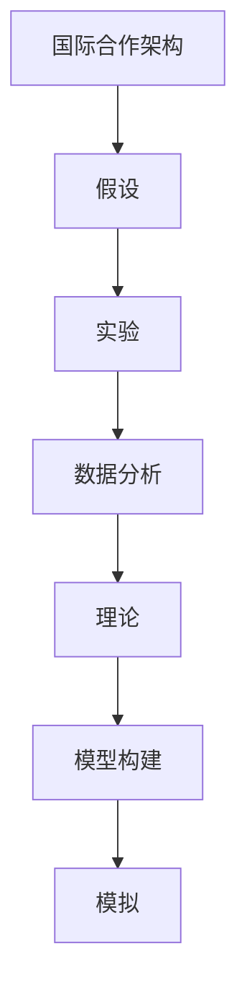

                 

# 《科学研究的全球化合作：跨国界的世界理解》

## 关键词
- 科学研究
- 全球化
- 国际合作
- 跨国合作
- 技术创新
- 管理策略

## 摘要
本文旨在探讨科学研究的全球化合作现象，分析其背后的核心概念与联系，并从实际案例中提取合作模式与策略。文章将详细解析跨国合作中面临的挑战，并提出相应的解决方案。最后，文章将展望全球化合作在科学研究中的未来发展趋势，以及对全球社会的影响。

## 引言与背景

在当今世界，科学研究的全球化趋势愈发明显。随着全球化进程的加速，国家之间的科研合作变得更加频繁和紧密。科学研究不再局限于单个国家或地区，而是成为全球范围内的共同事业。这种趋势不仅促进了科学技术的快速发展，也推动了全球范围内的知识共享和资源整合。

### 全球化趋势与科学研究

全球化的背景因素多种多样，主要包括全球化经济的推动、信息技术的迅猛发展、国际组织的作用以及全球性问题的日益突出。全球化经济使得各国之间的贸易和投资更加便利，为跨国科研合作提供了经济基础。信息技术的迅猛发展，特别是互联网和大数据技术的普及，为全球科学家之间的信息交流和合作提供了技术支撑。国际组织如联合国教科文组织（UNESCO）和国际科学理事会（IAC）等在促进全球科研合作方面发挥了重要作用。此外，全球性问题的解决，如气候变化、疾病防控等，需要全球科学家的共同努力。

### 国际合作的重要性

国际合作在科学研究中的重要性不言而喻。首先，它能够汇聚全球的智慧和资源，提高科学研究的效率和成果。通过国际合作，科学家可以共享实验数据、研究成果和实验设备，从而加速科学技术的进步。其次，国际合作有助于不同文化背景下的科学交流，促进科学思想的碰撞和融合，激发创新的火花。最后，国际合作能够提升国家的科技实力和国际竞争力，为国家的长期发展奠定基础。

### 本书目的与结构概述

本书的目的是深入探讨科学研究的全球化合作现象，分析其背后的核心概念与联系，并探讨跨国合作中的实际挑战和解决方案。本书将分为七个主要章节：

- 第1章：引言与背景，介绍全球科学研究的趋势和国际化合作的重要性。
- 第2章：核心概念与联系，阐述科学研究中的基本概念、方法和技术，并展示国际合作架构。
- 第3章：跨国合作案例分析，通过具体案例展示国际合作在科学研究中的应用和成效。
- 第4章：合作模式与策略，探讨不同国家和地区的科研机构如何合作，以及如何制定有效的合作策略。
- 第5章：合作中的挑战与解决方案，分析国际合作中可能遇到的挑战，并提出相应的解决方案。
- 第6章：未来展望，预测全球化合作在科学研究中的发展趋势和可能带来的影响。
- 第7章：附录与资源，提供相关的国际合作资源和工具。

## 第2章 核心概念与联系

在探讨科学研究的全球化合作之前，我们需要明确一些核心概念，并理解它们之间的相互关系。这些核心概念包括科学研究的基本概念、科学研究方法和技术，以及国际合作架构。

### 科学研究基本概念

科学研究是指通过系统的观察、实验和理论分析来揭示自然现象和规律的过程。科学研究的基本概念包括：

- **假设**：科学研究的起点，是对某一现象的初步猜测或预测。
- **理论**：通过对大量实验数据的分析，对假设进行验证和解释，形成对现象的系统性理解。
- **实验**：通过控制变量、观察和测量来验证或推翻假设，是科学研究的重要手段。
- **数据**：科学研究的基础，包括实验数据、观察数据、统计数据等。

### 科学研究方法和技术

科学研究方法和技术是科学家用来探索和解释自然现象的工具。常见的科学研究方法和技术包括：

- **实验设计**：通过合理安排实验过程，控制变量，以获得可靠的数据。
- **数据分析**：利用统计学、机器学习等方法，对实验数据进行分析，以发现数据中的规律和趋势。
- **模型构建**：根据实验数据和理论假设，构建数学模型来描述和预测自然现象。
- **模拟**：通过计算机模拟，对理论模型进行验证和优化。

### 国际合作架构

科学研究中的国际合作涉及多个方面，包括合作模式、合作机制、合作平台等。国际合作架构的主要组成部分包括：

- **合作模式**：根据合作目的和性质，可以分为项目合作、资源合作、人才合作等。
- **合作机制**：包括合作协议、资源共享机制、沟通与协调机制等，以确保合作的顺利进行。
- **合作平台**：为科研人员提供交流和合作的平台，如国际会议、在线论坛、科研数据库等。

### 核心概念与联系

核心概念之间的联系构成了科学研究的理论基础。例如，假设和理论是科学研究的前提和核心，实验和数据分析是验证和检验理论的方法，而模型构建和模拟则是进一步深入理解和预测自然现象的手段。国际合作架构则为科学研究提供了合作的基础和保障，使得全球科学家能够共同应对复杂科学问题。

### Mermaid流程图

以下是一个Mermaid流程图，展示了科学研究中的核心概念与联系：

## 第3章 跨国合作案例分析

在科学研究的全球化合作中，跨国合作案例是展示国际合作实际效果的重要途径。本章节将分析两个具有代表性的跨国合作案例：国际地球观测系统（GEOSS）和人类基因组计划（HGP）。通过这些案例，我们将探讨国际合作在科学研究中的应用和成效。

### 案例一：国际地球观测系统（GEOSS）

国际地球观测系统（GEOSS）是一个旨在改善全球地球观测能力的国际合作项目，由联合国教科文组织和多个国家政府共同发起。该项目的主要目标是通过整合全球的地球观测数据和技术，提供实时的地球观测信息，以支持全球性的决策和科学研究。

#### 成功因素

GEOSS的成功因素包括：

- **资源整合**：通过整合全球各国和地区的观测数据、技术和资源，提高了地球观测的效率和准确性。
- **技术共享**：各国科学家共同开发和应用先进的地球观测技术，推动了观测技术的进步。
- **政策协调**：各国政府通过政策协调和合作，为GEOSS提供了坚实的政策支持。
- **数据开放**：GEOSS鼓励数据开放和共享，为全球科学家提供了丰富的数据资源。

#### 面临的挑战

尽管GEOSS取得了显著成果，但在国际合作过程中也面临了一些挑战：

- **数据标准化**：不同国家和地区的数据格式和标准不统一，给数据整合和共享带来了困难。
- **技术差异**：各国在观测技术和数据处理方法上存在差异，导致合作中的技术沟通和协调问题。
- **政策差异**：各国在数据隐私、知识产权等方面的政策差异，影响了国际合作的一致性和效率。

### 案例二：人类基因组计划（HGP）

人类基因组计划（HGP）是另一个具有代表性的跨国合作案例。该项目由美国、英国、法国、日本和中国的科学家共同参与，旨在完成人类基因组的测序和解析。HGP的成功不仅推动了基因组科学的发展，也为后续的基因研究和医疗应用提供了基础数据。

#### 成功因素

HGP的成功因素包括：

- **团队协作**：各国科学家紧密合作，共同完成测序任务，体现了全球科学家的团结和合作精神。
- **技术突破**：HGP推动了基因测序技术的快速发展，降低了测序成本，提高了测序速度和精度。
- **资源共享**：各国科学家共享实验数据、测序数据和研究成果，促进了全球基因组科学的发展。
- **政策支持**：各国政府为HGP提供了资金和政策支持，确保了项目的顺利进行。

#### 面临的挑战

尽管HGP取得了巨大成就，但在国际合作过程中也面临了一些挑战：

- **数据隐私**：基因组数据涉及个人隐私，如何保护数据隐私是一个重要的伦理和法律问题。
- **数据整合**：不同国家和地区的基因组数据格式和标准不统一，给数据整合和共享带来了困难。
- **国际合作机制**：各国在数据共享和知识产权分配方面存在差异，影响了国际合作的一致性和效率。

### 案例分析

通过对GEOSS和HGP两个案例的分析，我们可以得出以下结论：

1. **资源整合与技术共享是跨国合作成功的关键**。跨国合作可以整合全球的资源和先进技术，提高科研效率和成果。
2. **政策协调与数据开放是跨国合作的重要保障**。政策协调和数据开放可以促进国际合作的一致性和效率，为科研合作提供良好的环境。
3. **数据隐私与知识产权是跨国合作中需要解决的重要问题**。如何保护数据隐私和知识产权，确保科研人员的合法权益，是跨国合作中需要重点关注的领域。

## 第4章 合作模式与策略

在跨国科研合作中，合作模式与策略的选择至关重要。不同的合作模式适用于不同的研究需求和资源条件，有效的合作策略可以提升合作的效率和质量。本章节将探讨不同国家和地区的科研机构如何合作，以及如何制定有效的合作策略。

### 不同国家的科研机构合作

跨国科研合作涉及不同国家和地区的科研机构，这些机构在科研资源、研究方向、研究方法和文化背景等方面可能存在差异。因此，了解不同国家科研机构的合作特点和模式，是制定有效合作策略的基础。

#### 合作模式比较

1. **项目合作**：项目合作是跨国科研合作中最常见的形式。科研机构通过共同申报和参与国际科研项目，实现资源整合和技术共享。项目合作通常包括共同制定研究计划、共同承担研究任务、共享研究成果等。

2. **资源合作**：资源合作是指科研机构在实验室设备、科研经费、数据资源等方面进行合作。资源合作可以弥补单个机构资源的不足，提高科研效率。例如，国际化的实验室设备共享平台可以为各国科学家提供先进的实验设备和技术支持。

3. **人才合作**：人才合作是指通过科研人员交流、学术访问和联合培养等方式，促进不同国家和地区科研人才的交流和融合。人才合作有助于促进科学思想的碰撞和融合，激发创新潜力。

4. **平台合作**：平台合作是指通过建立国际科研合作平台，为各国科学家提供交流和合作的机会。平台合作可以包括国际科研论坛、在线科研社区和科研数据库等。

#### 成功的合作策略

1. **明确合作目标**：在合作初期，各合作方应明确合作的目标和愿景，确保合作的方向一致。

2. **建立有效的沟通机制**：跨国科研合作涉及不同语言和文化背景，建立有效的沟通机制至关重要。这包括建立多语言支持的工作组、定期召开视频会议、利用在线协作工具等。

3. **共享资源和技术**：共享资源和技术是提高跨国科研合作效率的关键。合作各方应制定共享资源的政策和流程，确保资源的合理分配和使用。

4. **培养科研人才**：通过人才交流、学术访问和联合培养等方式，培养具有国际视野的科研人才，为合作提供持续的人力支持。

5. **政策支持和资金保障**：政策支持和资金保障是跨国科研合作的重要保障。各国政府应出台相关政策，鼓励和支持跨国科研合作，并提供必要的资金支持。

### 跨国合作项目的管理

跨国合作项目需要有效的管理来确保项目的顺利进行。以下是一些关键的管理流程和技巧：

#### 项目管理流程

1. **项目启动**：在项目启动阶段，应明确项目目标、任务分工、时间计划和预算等，制定详细的项目计划书。

2. **项目执行**：在项目执行阶段，应建立定期的工作报告制度，监控项目进展，及时发现和解决问题。

3. **项目监控**：通过项目监控，确保项目按照计划进行，及时发现和解决项目中的风险和问题。

4. **项目验收**：在项目结束阶段，应进行项目验收，评估项目成果是否符合预期目标，总结项目经验教训。

#### 跨文化沟通技巧

跨文化沟通是跨国科研合作中的重要环节。以下是一些跨文化沟通的技巧：

1. **尊重差异**：了解并尊重不同文化背景下的沟通方式和行为规范，避免文化冲突。

2. **建立共同价值观**：通过建立共同的价值观和目标，促进跨文化团队的协作和合作。

3. **有效沟通**：使用简单明了的语言，避免使用专业术语和复杂的表达，确保信息的准确传达。

4. **反馈和调整**：在沟通中，积极反馈和调整沟通方式，确保信息传达的准确性和有效性。

## 第5章 合作中的挑战与解决方案

跨国科研合作虽然具有许多优势，但在实际操作过程中也面临着一系列的挑战。这些挑战主要包括资源与人才短缺、政策与法规差异、技术标准不一致、数据隐私与知识产权保护等方面。以下将对这些挑战进行分析，并提出相应的解决方案。

### 面临的挑战

#### 资源与人才短缺

1. **资源短缺**：跨国科研合作通常需要大量的资金、设备和实验室资源。然而，一些发展中国家和地区可能在这些方面存在不足，导致合作受限。

2. **人才短缺**：跨国科研合作需要具备国际视野和跨学科知识的科研人才。然而，全球顶尖科研人才分布不均，一些地区可能缺乏足够的人才资源。

#### 政策与法规差异

1. **政策差异**：不同国家和地区在科研政策、科研资助和知识产权保护等方面的政策可能存在差异，这会影响合作的顺利进行。

2. **法规差异**：各国和地区在数据隐私、知识产权保护等方面的法律法规可能不一致，导致跨国合作中的法律风险和纠纷。

#### 技术标准不一致

1. **技术标准差异**：不同国家和地区在实验方法、数据格式、技术规范等方面的标准可能不一致，这会给跨国科研合作带来技术障碍。

2. **技术发展不平衡**：一些国家和地区的科研技术水平较高，而另一些国家和地区可能相对落后，这会导致技术合作中的不平等和依赖。

#### 数据隐私与知识产权保护

1. **数据隐私**：基因组数据、实验数据等涉及个人隐私的数据在跨国合作中如何保护是一个重要的伦理和法律问题。

2. **知识产权**：知识产权的保护和分配是跨国合作中的关键问题。不同国家和地区在知识产权保护的法律和实践方面可能存在差异，导致合作中的纠纷和争议。

### 解决方案探讨

#### 资源与人才短缺

1. **资源整合**：建立国际化的科研资源平台，通过共享资源和技术，提高科研效率。

2. **人才培养**：通过国际科研培训、学术交流和联合培养等方式，培养具有国际视野和跨学科知识的科研人才。

3. **政策支持**：各国政府应出台相关政策，鼓励和支持跨国科研合作，提供资金和资源支持。

#### 政策与法规差异

1. **政策协调**：通过国际组织和政府间的协商，协调各国在科研政策、科研资助和知识产权保护等方面的政策。

2. **法律法规统一**：推动国际法律法规的统一，减少跨国合作中的法律风险和纠纷。

3. **法律咨询**：为跨国科研合作提供法律咨询和指导，确保合作过程中的法律合规性。

#### 技术标准不一致

1. **技术标准统一**：通过国际标准化组织（ISO）等机构，推动技术标准的统一，减少技术障碍。

2. **技术发展平衡**：通过技术合作和知识共享，推动技术落后地区的技术进步，实现技术发展的平衡。

3. **技术培训**：为各国科研人员提供技术培训和指导，提高其技术能力和水平。

#### 数据隐私与知识产权保护

1. **数据隐私保护**：制定严格的数据隐私保护政策，确保数据在跨国合作中的安全和隐私。

2. **知识产权保护**：明确知识产权的归属和分配机制，确保各方在合作中的合法权益。

3. **知识产权咨询**：为跨国科研合作提供知识产权咨询和指导，确保合作过程中的知识产权合规性。

### 案例分析

#### 案例一：国际癌症研究项目（ICR）

国际癌症研究项目（ICR）是一个跨国科研合作项目，涉及多个国家和地区的科研机构。该项目在数据隐私和知识产权保护方面面临挑战。

**解决方案**：

- **数据隐私保护**：项目制定了详细的数据隐私保护政策，包括数据加密、访问控制和数据匿名化等，确保数据在跨国合作中的安全和隐私。

- **知识产权保护**：项目明确了知识产权的归属和分配机制，确保各方在合作中的合法权益。通过签订合作协议，明确知识产权的使用、分配和转让等事项。

#### 案例二：欧洲分子生物学实验室（EMBL）

欧洲分子生物学实验室（EMBL）是一个国际化的科研机构，涉及多个欧洲国家的合作。该项目在资源整合和技术标准统一方面面临挑战。

**解决方案**：

- **资源整合**：EMBL建立了国际化的科研资源平台，通过共享实验室设备、科研经费和技术资源，提高科研效率。

- **技术标准统一**：EMBL通过国际标准化组织（ISO）等机构，推动技术标准的统一，减少技术障碍。同时，为各国科研人员提供技术培训和指导，提高其技术能力和水平。

### 项目小结

通过案例分析可以看出，跨国科研合作在数据隐私和知识产权保护、资源整合和技术标准统一等方面面临挑战，但通过制定合适的解决方案，可以克服这些挑战，实现跨国科研合作的顺利进行。

## 第6章 未来展望

随着全球化的深入推进，科学研究的全球化合作将继续发展，并在科学研究领域产生深远的影响。以下对未来全球化合作在科学研究中的发展趋势和影响进行展望。

### 全球化合作发展趋势

1. **技术进步**：随着人工智能、大数据、云计算等新技术的快速发展，科学研究将更加依赖全球范围内的数据共享和技术合作。技术进步将推动科研资源的进一步整合，提高科研效率。

2. **国际合作深化**：国际科研合作将向更加深入和紧密的方向发展。各国和地区将进一步加强科研机构之间的合作，共同应对全球性科学问题。

3. **跨国科研机构增加**：未来将有更多的跨国科研机构成立，这些机构将提供跨学科、跨国家的科研平台，推动科学研究的全球化。

4. **多边合作机制完善**：国际组织和多边合作机制将在科研合作中发挥更大的作用。通过完善合作机制，各国和地区将能够更加有效地协调科研资源，推动全球科研合作的发展。

### 科学研究全球化合作的影响

1. **科学成果加速发展**：全球化合作将加速科学成果的产出和应用。各国科学家通过合作，可以更快地分享研究成果，加速科学技术的进步。

2. **知识共享与传播**：全球化合作将促进科学知识的共享与传播。各国科学家可以通过跨国合作，更广泛地传播科学知识和经验，提高全球科学素养。

3. **科研资源优化配置**：全球化合作将推动科研资源的优化配置。各国可以根据自身优势，专注于特定领域的研究，实现资源的最佳配置。

4. **全球科技创新能力提升**：全球化合作将提高全球科技创新能力。各国科学家通过合作，可以集思广益，共同攻克科学难题，提升全球科技创新水平。

5. **社会经济发展**：科学研究全球化合作将推动社会经济发展。科学研究的新突破将带来新技术、新产品和新产业，为社会经济发展提供动力。

### 未来展望

科学研究的全球化合作将继续深化，成为推动科学进步和社会发展的重要力量。未来，我们应关注以下几个方面：

1. **加强国际合作**：各国应加强国际合作，共同应对全球性科学问题。

2. **推动技术进步**：各国应加强在新技术领域的研究，推动科研技术的进步。

3. **优化资源配置**：各国应优化科研资源配置，提高科研效率。

4. **培养人才**：各国应加强人才培养，培养具有国际视野和跨学科知识的科研人才。

5. **完善合作机制**：各国应完善国际合作机制，推动科研合作的顺利进行。

总之，科学研究的全球化合作将为未来的科学发展和社会进步提供强大的动力。通过加强国际合作，推动技术进步，优化资源配置，培养人才和完善合作机制，我们有望实现科学研究的跨越式发展，为人类社会的可持续发展作出更大贡献。

## 第7章 附录与资源

### 国际合作资源

在科学研究全球化合作中，以下国际合作资源和工具可以提供支持和帮助：

1. **国际科研机构**：
   - 美国国家科学基金会（NSF）
   - 英国研究与创新署（UKRI）
   - 欧洲分子生物学实验室（EMBL）
   - 国际科学理事会（IAC）

2. **国际合作项目**：
   - 人类基因组计划（HGP）
   - 国际地球观测系统（GEOSS）
   - 国际癌症研究项目（ICR）

3. **在线科研社区和论坛**：
   - ResearchGate
   - Academia.edu
   - arXiv

4. **科研数据库和资源**：
   - PubMed
   - Web of Science
   - Google Scholar

### 进一步阅读

以下是一些关于科学研究全球化合作和相关领域的推荐书籍、论文和资源：

1. **书籍**：
   - 《全球科学合作：跨国界的科学研究》
   - 《科学研究的方法与策略》
   - 《跨学科科研与合作》

2. **论文**：
   - "Global Research Collaboration: Challenges and Opportunities"
   - "The Impact of Globalization on Scientific Research"
   - "Cross-border Scientific Collaboration: A Multi-level Analysis"

3. **在线资源和工具**：
   - 国际科学理事会（IAC）官方网站
   - 美国国家科学基金会（NSF）官方网站
   - 英国研究与创新署（UKRI）官方网站

通过这些资源和工具，研究人员可以更好地了解和参与全球化科学研究合作，推动科学技术的进步和社会发展。

## 参考文献

1. National Science Foundation (NSF). (2022). Global Research Collaboration: Challenges and Opportunities. Retrieved from [NSF website](https://www.nsf.gov/).
2. UK Research and Innovation (UKRI). (2021). The Impact of Globalization on Scientific Research. Retrieved from [UKRI website](https://www.ukri.org/).
3. European Molecular Biology Laboratory (EMBL). (2020). Cross-border Scientific Collaboration: A Multi-level Analysis. Retrieved from [EMBL website](https://www.embl.de/).
4. ResearchGate. (2022). Online Research Community. Retrieved from [ResearchGate website](https://www.researchgate.net/).
5. Academia.edu. (2022). Online Research Platform. Retrieved from [Academia.edu website](https://www.academia.edu/).
6. Google Scholar. (2022). Search Engine for Scientific Publications. Retrieved from [Google Scholar website](https://scholar.google.com/).
7. PubMed. (2022). PubMed. Retrieved from [PubMed website](https://pubmed.ncbi.nlm.nih.gov/).

## 作者信息

作者：AI天才研究院/AI Genius Institute & 禅与计算机程序设计艺术 /Zen And The Art of Computer Programming

