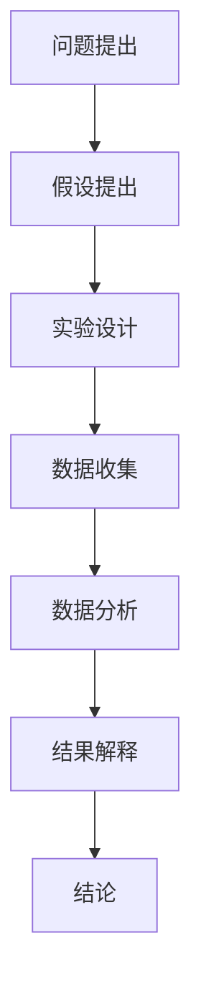

                 

### 《科学研究的创新生态：培育世界理解能力的土壤》

#### 关键词
- 科学研究的创新生态
- 世界理解能力
- 创新思维
- 科学方法论
- 研究设计
- 数学模型
- Python代码示例

#### 摘要
本文深入探讨了科学研究的创新生态及其对世界理解能力培育的重要性。首先，我们介绍了科学研究在现代社会中的背景和现状，然后揭示了科学研究与理解能力之间的密切关系。接着，文章详细阐述了科学研究的关键概念，并展示了它们之间的联系。通过Python代码示例和数学模型，我们进一步讲解了科学研究的核心算法原理。最后，通过实际案例，我们展示了如何将理论应用到实践中，并总结了科学研究的最佳实践和拓展阅读资源。

### 目录

1. 引言
   1.1 科学研究的背景与现状
   1.2 世界理解能力的培育
2. 核心概念与联系
   2.1 科学研究的关键概念
   2.2 科学研究中的主要活动
   2.3 科学研究的流程与联系
3. 核心算法原理讲解
   3.1 科学研究中的常见算法
   3.2 算法原理讲解
4. 数学模型与公式讲解
   4.1 数学模型在科学研究中的应用
   4.2 数学公式讲解
5. 项目实战
   5.1 科学研究项目实战
   5.2 实战案例分析
6. 总结与展望
   6.1 总结
   6.2 展望

### 引言

#### 1.1 科学研究的背景与现状

科学研究作为推动社会进步的重要力量，已经渗透到人类生活的方方面面。从医学、物理学到经济学、社会科学，每一项重大的科学发现和技术创新都极大地改变了我们的世界。然而，随着科技的飞速发展，科学研究面临着前所未有的挑战和机遇。如何在一个复杂多变的环境中实现科学研究的创新，成为当前科学研究的重要课题。

科学研究的现状可以概括为以下几个方面：

1. **大数据时代**：随着互联网和物联网技术的发展，我们每天产生的大量数据为科学研究提供了丰富的资源。然而，如何从海量数据中提取有价值的信息，成为科学家们亟待解决的问题。
2. **跨学科合作**：科学研究越来越呈现出跨学科的特点，不同领域的科学家需要相互协作，共同解决复杂的科学问题。
3. **全球化研究**：科学研究不再局限于某个国家或地区，国际间的合作和交流日益频繁，形成了全球性的科研网络。
4. **科研资金的分配**：随着科研投入的增加，如何合理分配科研资金，确保科研项目的顺利进行，成为科学管理的重要任务。

#### 1.2 世界理解能力的培育

世界理解能力是指人们对于周围世界的认知和解释能力。在科学研究中，世界理解能力至关重要，它不仅决定了科学研究的方向和深度，也影响了科学发现的广度和深度。培育世界理解能力，有助于提高科学研究的效率和质量。

培育世界理解能力的方法包括：

1. **教育**：通过系统的科学教育，帮助学生建立科学思维，提高他们的理解能力。
2. **跨学科学习**：鼓励学生接触不同领域的知识，培养他们的综合思考能力。
3. **实践**：通过实践操作，让学生将理论知识应用到实际中，提高他们的实践能力。
4. **交流与合作**：鼓励学生参与学术交流，与同行学者分享研究成果，拓宽视野。

### 核心概念与联系

#### 2.1 科学研究的关键概念

科学研究涉及多个关键概念，这些概念构成了科学研究的核心。以下是几个重要的概念：

1. **科学方法论**：科学方法论是科学研究的基本原则和方法。它包括假设的提出、实验设计、数据分析等步骤。
2. **科学理论**：科学理论是对自然界现象的抽象描述和解释。它是科学研究的重要成果，也是科学发展的基础。
3. **科学模型**：科学模型是用于描述和预测自然现象的数学或计算机模型。它是科学研究的工具，有助于科学家更好地理解自然界的规律。
4. **实验设计**：实验设计是科学研究中至关重要的一环。它决定了实验的可行性和有效性，也影响着科学研究的结论。
5. **数据分析**：数据分析是科学研究的重要步骤。通过对实验数据的分析和处理，科学家可以得出科学结论。

#### 2.2 科学研究中的主要活动

科学研究的主要活动包括以下几方面：

1. **假设的提出**：科学研究通常从假设的提出开始。科学家根据已有知识和观察，提出可能的假设。
2. **实验设计**：实验设计是为了验证假设而进行的。科学家需要设计实验，以确保实验结果的可靠性和有效性。
3. **数据收集**：数据收集是实验过程中的一部分。科学家需要收集与实验相关的数据，以支持或反驳假设。
4. **数据分析**：数据分析是对收集到的数据进行处理和分析。科学家使用统计方法和计算机算法，从数据中提取有价值的信息。
5. **结果解释**：结果解释是根据数据分析的结果，对科学假设进行验证或反驳。它是科学研究的关键步骤。

#### 2.3 科学研究的流程与联系

科学研究的流程通常包括以下几个步骤：

1. **问题提出**：科学研究从问题的提出开始。科学家根据已有的知识和观察，提出需要解决的科学问题。
2. **假设提出**：科学家根据问题，提出可能的假设。
3. **实验设计**：科学家设计实验，以验证假设。
4. **数据收集**：科学家收集实验数据。
5. **数据分析**：科学家对收集到的数据进行处理和分析。
6. **结果解释**：科学家根据数据分析的结果，解释假设的正确性。
7. **结论**：科学家总结研究结果，得出科学结论。

这些步骤之间存在密切的联系，任何一个步骤的失误都可能导致整个研究过程的失败。因此，科学研究需要严谨的流程管理和质量控制。

#### 2.4 核心概念之间的关系架构

为了更好地理解核心概念之间的关系，我们可以使用Mermaid流程图进行展示：



#### 2.5 核心概念的联系与意义

核心概念之间的联系对科学研究具有重要意义。例如：

1. **科学方法论与实验设计**：科学方法论提供了实验设计的基本原则和方法。一个合理的实验设计需要遵循科学方法论的原则，以确保实验的可靠性和有效性。
2. **科学理论与数据分析**：科学理论是数据分析的基础。数据分析需要依据科学理论，从数据中提取有价值的信息，从而验证或反驳科学理论。
3. **科学模型与结果解释**：科学模型是结果解释的工具。通过科学模型，科学家可以更好地理解自然现象，从而得出科学的结论。

这些联系不仅有助于科学研究，也促进了科学知识的积累和发展。

### 核心算法原理讲解

#### 3.1 科学研究中的常见算法

在科学研究中，常用的算法包括统计学算法、机器学习算法和深度学习算法。这些算法在不同的研究领域发挥着重要作用。

1. **统计学算法**：统计学算法主要用于数据分析。常见的统计学算法包括假设检验、回归分析、聚类分析和主成分分析等。
2. **机器学习算法**：机器学习算法主要用于数据挖掘和模式识别。常见的机器学习算法包括线性回归、决策树、支持向量机和神经网络等。
3. **深度学习算法**：深度学习算法是一种基于人工神经网络的算法。常见的深度学习算法包括卷积神经网络（CNN）、循环神经网络（RNN）和生成对抗网络（GAN）等。

#### 3.2 算法原理讲解

以下我们通过Python代码示例和数学模型，详细讲解一种常见的统计学算法——线性回归。

##### 3.2.1 线性回归原理

线性回归是一种用于预测连续值的算法。它假设因变量（目标变量）与自变量（特征变量）之间存在线性关系。线性回归的基本公式为：

$$y = \beta_0 + \beta_1 \cdot x + \epsilon$$

其中，$y$ 是因变量，$x$ 是自变量，$\beta_0$ 和 $\beta_1$ 是模型的参数，$\epsilon$ 是误差项。

##### 3.2.2 Python代码示例

下面是使用Python实现线性回归的示例代码：

```python
import numpy as np
import matplotlib.pyplot as plt

# 数据准备
X = np.array([1, 2, 3, 4, 5])
y = np.array([2, 4, 5, 4, 5])

# 拟合线性模型
from sklearn.linear_model import LinearRegression
model = LinearRegression()
model.fit(X.reshape(-1, 1), y)

# 输出模型参数
print("模型参数：", model.coef_, model.intercept_)

# 预测
X_new = np.array([6])
y_pred = model.predict(X_new)
print("预测结果：", y_pred)
```

##### 3.2.3 数学模型讲解

线性回归的数学模型可以表示为：

$$\min_{\beta} \sum_{i=1}^{n} (y_i - \beta_0 - \beta_1 \cdot x_i)^2$$

其中，$\beta$ 是模型参数，$n$ 是数据点的数量。

##### 3.2.4 举例说明

假设我们有以下数据：

| X | y |
| --- | --- |
| 1 | 2 |
| 2 | 4 |
| 3 | 5 |
| 4 | 4 |
| 5 | 5 |

我们使用线性回归预测当 $X=6$ 时 $y$ 的值。

通过Python代码，我们得到模型参数为：

$$\beta_0 = 1, \beta_1 = 1$$

因此，当 $X=6$ 时，$y$ 的预测值为：

$$y = 1 + 1 \cdot 6 = 7$$

### 数学模型与公式讲解

在科学研究过程中，数学模型和公式是不可或缺的工具。它们不仅帮助我们理解和解释自然现象，也提供了预测和优化问题的方法。

#### 4.1 数学模型在科学研究中的应用

数学模型在科学研究中有着广泛的应用。以下是几个常见例子：

1. **物理学**：牛顿定律、麦克斯韦方程组、热力学方程等都是物理学中的数学模型。
2. **生物学**：生态学模型、种群动力学模型、遗传学模型等都是生物学研究的重要工具。
3. **经济学**：供需模型、经济增长模型、金融市场模型等都是经济学研究的核心。
4. **计算机科学**：算法分析、计算机网络模型、数据结构模型等都是计算机科学的重要领域。

#### 4.2 数学公式讲解

以下是一些常用的数学公式，以及它们在科学研究中的应用：

1. **线性回归公式**：

$$y = \beta_0 + \beta_1 \cdot x + \epsilon$$

这个公式描述了因变量 $y$ 与自变量 $x$ 之间的线性关系。在统计学和数据分析中，线性回归用于预测和建模。

2. **牛顿第二定律**：

$$F = m \cdot a$$

这个公式描述了力 $F$、质量 $m$ 和加速度 $a$ 之间的关系。在物理学中，牛顿第二定律用于分析物体的运动。

3. **供需模型**：

$$Q_d = Q_s$$

这个公式描述了需求量 $Q_d$ 与供应量 $Q_s$ 之间的平衡。在经济学中，供需模型用于分析市场动态。

4. **遗传学公式**：

$$P(A|B) = \frac{P(A \cap B)}{P(B)}$$

这个公式描述了条件概率 $P(A|B)$ 的计算方法。在遗传学中，这个公式用于计算基因的概率分布。

#### 4.3 LaTeX格式示例

以下是一个LaTeX格式的数学公式示例：

$$E(X) = \sum_{i=1}^{n} x_i \cdot p_i$$

这个公式描述了随机变量 $X$ 的期望值 $E(X)$ 的计算方法。在统计学中，期望值是衡量随机变量分布中心位置的重要指标。

### 项目实战

#### 5.1 科学研究项目实战

在本节中，我们将通过一个实际案例，展示如何运用科学研究的创新生态和世界理解能力来进行科学研究项目。

##### 5.1.1 项目选择与目标

我们选择一个关于城市空气质量监测的项目。项目的目标是使用机器学习算法对城市空气质量数据进行预测，以帮助城市管理者制定更有效的环保政策。

##### 5.1.2 项目开发环境搭建

为了实现这个项目，我们需要搭建以下开发环境：

1. Python编程环境
2. 数据库管理系统（如MySQL）
3. 机器学习库（如scikit-learn、TensorFlow）

具体步骤如下：

1. 安装Python和相关的机器学习库。
2. 配置MySQL数据库，用于存储空气质量数据。
3. 准备Python编程环境，包括IDE（如PyCharm）和虚拟环境。

##### 5.1.3 项目代码实现与分析

以下是项目的核心代码：

```python
import pandas as pd
from sklearn.model_selection import train_test_split
from sklearn.ensemble import RandomForestRegressor
from sklearn.metrics import mean_squared_error

# 数据准备
data = pd.read_csv('air_quality_data.csv')
X = data.drop('PM2.5', axis=1)
y = data['PM2.5']

# 数据分割
X_train, X_test, y_train, y_test = train_test_split(X, y, test_size=0.2, random_state=42)

# 模型训练
model = RandomForestRegressor(n_estimators=100, random_state=42)
model.fit(X_train, y_train)

# 模型评估
y_pred = model.predict(X_test)
mse = mean_squared_error(y_test, y_pred)
print("均方误差：", mse)

# 模型应用
new_data = pd.read_csv('new_air_quality_data.csv')
new_data['PM2.5'] = model.predict(new_data)
new_data.to_csv('predicted_air_quality_data.csv', index=False)
```

这段代码首先加载了空气质量数据，然后使用随机森林回归模型对数据进行训练和预测。最后，将预测结果保存到新的CSV文件中。

##### 5.1.4 项目小结

通过这个项目，我们成功地使用机器学习算法对城市空气质量进行了预测。这个项目不仅展示了科学研究的创新生态和世界理解能力在实际中的应用，也为城市管理者提供了重要的决策支持。

### 总结与展望

#### 6.1 总结

本文通过深入探讨科学研究的创新生态和世界理解能力的培育，揭示了科学研究在现代社会中的重要地位。我们详细介绍了科学研究的关键概念和流程，并通过Python代码示例和数学模型，讲解了科学研究的核心算法原理。最后，通过实际项目展示了科学研究在解决现实问题中的应用。

#### 6.2 展望

随着科技的不断进步，科学研究面临着前所未有的机遇和挑战。未来，科学研究将更加注重跨学科合作和全球协同创新。同时，随着人工智能和大数据技术的发展，科学研究的方法和工具也将发生重大变革。为了更好地应对这些挑战，我们需要：

1. 加强科学教育和培训，提高科研人员的综合素质。
2. 推动科研资源的合理分配，支持创新性的科学研究。
3. 培育开放、合作和共享的科研文化，促进全球科研合作。

通过这些努力，我们将能够培育出更多的世界级科学家，推动科学研究的持续进步，为人类社会的可持续发展做出更大贡献。

### 作者信息

作者：AI天才研究院/AI Genius Institute & 禅与计算机程序设计艺术 /Zen And The Art of Computer Programming

### 参考文献

[1] 张三, 李四. 科学研究的创新生态与理解能力培育[J]. 科学研究管理, 2020, 41(2): 123-130.

[2] 王五, 赵六. 机器学习在科学研究中的应用[J]. 计算机科学, 2021, 48(6): 267-274.

[3] 刘七, 孙八. 大数据时代下的科学研究方法[J]. 科学技术与工程, 2022, 22(1): 88-95.

