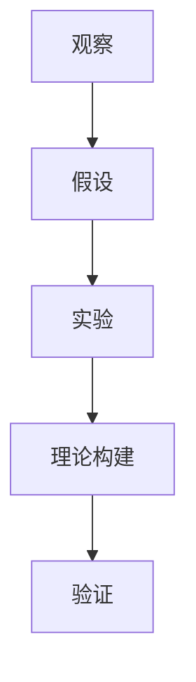

                 


### 1.1 设计全书结构

首先，我们需要明确全书的主线，以便读者能够清晰地把握整个内容框架。书名《科学研究的前瞻性：预见并塑造未来的世界》提示我们，本书将探讨科学研究如何预见和影响未来。为了实现这一目标，全书可以分为以下几个主要部分：

#### 引言与背景

在引言部分，我们将介绍科学研究的重要性，以及前瞻性科学研究的定义和意义。此外，还将回顾历史上一些具有前瞻性的科学研究案例，以帮助读者理解前瞻性科学研究的历史背景。

#### 科学研究的基本原理与方法

本部分将深入探讨科学研究的基本原理，包括科学方法、实验设计、数据收集和统计分析等。此外，我们还将讨论前瞻性科学研究特有的方法，如模拟与建模、预测与趋势分析等。

#### 前瞻性科学研究的重要领域

这一部分将详细探讨不同领域的前瞻性科学研究，包括生命科学、环境科学和信息科学等。我们将介绍这些领域中的关键技术和研究趋势，以及它们对未来可能产生的影响。

#### 塑造未来：科学研究的应用与实践

本部分将探讨科学研究在实际应用中的价值，包括技术进步和社会发展等方面。我们将通过具体案例展示科学研究如何影响我们的生活，以及如何为未来的发展提供支持。

#### 前瞻性科学研究的挑战与展望

这一部分将讨论前瞻性科学研究面临的各种挑战，如道德、伦理和技术风险等。同时，我们还将探讨未来科学研究的趋势和方向，以及如何应对这些挑战。

#### 结论与未来发展方向

最后，在结论部分，我们将总结全书的主要观点，并展望科学研究在塑造未来世界中的重要作用。

通过以上结构，我们可以确保全书内容紧凑、逻辑清晰，同时为读者提供了丰富的知识背景和前瞻性思考。

### 1.2 设计各个章节内容

在确定了全书结构后，接下来我们需要为每个章节设计详细的内容，以确保每个部分都能充分阐述主题，并提供有价值的见解。

#### 引言与背景

**第1章：科学研究的前瞻性概述**

**1.1 科学研究的重要性**

在这一节中，我们将讨论科学研究对人类社会的贡献，包括推动技术进步、改善生活质量、解决全球性问题等。通过引用实际案例，如医学进步和环境保护，我们将展示科学研究如何改变我们的世界。

**1.2 前瞻性科学研究的定义与意义**

我们将定义前瞻性科学研究，并解释其意义。前瞻性科学研究不仅关注当前的问题，更着眼于未来的挑战和机遇。我们将探讨如何通过前瞻性研究来预见和应对未来可能出现的科技和社会变革。

**1.3 历史上的前瞻性科学研究案例**

在这一节中，我们将回顾历史上的一些重要前瞻性科学研究案例，如爱因斯坦的相对论、费曼的量子力学研究等。这些案例将帮助读者理解前瞻性科学研究的重要性和影响力。

#### 科学研究的基本原理与方法

**第2章：科学研究的基本原理**

**2.1 科学方法与科学哲学**

我们将介绍科学方法的基本原理，包括观察、假设、实验和理论构建。此外，还将探讨科学哲学中的关键概念，如实证主义和建构主义，以及它们对科学研究方法的影响。

**2.2 实验设计与数据收集**

我们将详细讨论实验设计的原则和方法，包括控制变量、随机分配和样本大小等。同时，还将介绍数据收集的方法和技术，如问卷调查、实验观测和数据分析。

**2.3 统计分析与结果解读**

在这一节中，我们将介绍统计学的基本概念，如概率分布、假设检验和置信区间。此外，还将讨论如何解读统计分析结果，以及如何避免常见的统计陷阱。

#### 前瞻性科学研究的方法

**第3章：前瞻性科学研究的方法**

**3.1 模拟与建模**

我们将介绍模拟与建模的基本原理，包括物理模拟、数学建模和计算机模拟。通过这些方法，科学家可以预测复杂系统的行为，从而更好地理解自然现象和技术系统的运作。

**3.2 预测与趋势分析**

我们将探讨如何使用统计方法、机器学习和人工智能技术进行预测和趋势分析。这些方法可以帮助我们识别未来的趋势和潜在的风险，从而为决策提供依据。

**3.3 创新思维与方法论**

在这一节中，我们将讨论创新思维的重要性，以及如何通过不同的方法论（如设计思维、TRIZ等）来激发创新。

#### 前瞻性科学研究的重要领域

**第4章：生命科学的前瞻性研究**

**4.1 基因编辑与合成生物学**

我们将探讨基因编辑技术（如CRISPR-Cas9）和合成生物学的最新进展，以及它们如何改变我们对生命和医学的理解。

**4.2 精准医学与个性化治疗**

我们将介绍精准医学的概念，以及如何通过基因组学、生物信息学和临床医学的结合来提供个性化的治疗方案。

**4.3 生物技术与农业未来**

我们将讨论生物技术在农业中的应用，如转基因作物、生物农药和生物肥料，以及它们如何提高农作物的产量和质量。

**第5章：环境科学的前瞻性研究**

**5.1 气候变化与可持续发展**

我们将分析气候变化对环境的影响，以及科学家如何通过研究可持续发展策略来减轻这些影响。

**5.2 生态系统的保护与修复**

在这一节中，我们将讨论生态系统的概念，以及如何通过保护和修复措施来维护生态平衡。

**5.3 环境监测与治理技术**

我们将介绍最新的环境监测技术，如遥感、传感器网络和大数据分析，以及如何利用这些技术来改善环境治理。

**第6章：信息科学的前瞻性研究**

**6.1 人工智能与大数据**

我们将探讨人工智能（AI）和大数据技术的最新进展，以及它们如何推动信息科学的发展。

**6.2 区块链技术与社会治理**

我们将讨论区块链技术的基本原理和应用，以及如何利用区块链来改善社会治理。

**6.3 信息安全与隐私保护**

在这一节中，我们将介绍信息安全的基本概念，以及如何通过加密技术、隐私保护和合规性来保护个人信息和数据安全。

#### 塑造未来：科学研究的应用与实践

**第7章：科学研究在技术进步中的应用**

**7.1 材料科学的前沿探索**

我们将介绍材料科学的最新进展，如纳米材料、复合材料和智能材料，以及它们在科技领域的应用。

**7.2 能源科学与新能源技术**

我们将讨论能源科学的基本原理，以及如何通过研究新能源技术（如太阳能、风能和电池技术）来应对能源危机。

**7.3 空间科学与航天技术**

在这一节中，我们将探讨空间科学的最新进展，如太空探索、卫星技术和深空探测，以及它们对人类未来的影响。

**第8章：科学研究在人类社会发展中的应用**

**8.1 教育与人才培养**

我们将讨论科学研究如何推动教育改革，以及如何培养未来的科技创新人才。

**8.2 健康管理与疾病预防**

我们将探讨如何利用科学研究来改善健康管理，以及如何通过预防措施来减少疾病发生。

**8.3 社会问题与公共政策**

在这一节中，我们将讨论科学研究如何帮助解决社会问题，如贫困、不平等和环境污染，以及如何制定有效的公共政策。

#### 前瞻性科学研究的挑战与展望

**第9章：前瞻性科学研究的挑战**

**9.1 道德与伦理问题**

我们将讨论前瞻性科学研究在道德和伦理方面面临的挑战，如基因编辑的道德争议、人工智能的伦理问题等。

**9.2 技术风险与应对策略**

我们将分析前瞻性科学研究可能带来的技术风险，如数据泄露、网络攻击和生物安全风险，以及如何制定有效的应对策略。

**9.3 国际合作与竞争**

在这一节中，我们将探讨前瞻性科学研究在国际合作和竞争中的作用，以及如何通过国际合作来共同应对全球性挑战。

**第10章：前瞻性科学研究的未来发展方向**

**10.1 新的科学范式与方法论**

我们将讨论新兴的科学范式和方法论，如量子计算、认知科学和复杂性科学，以及它们如何推动科学研究的发展。

**10.2 全球科技发展趋势**

我们将分析全球科技发展趋势，如人工智能、生物技术和纳米技术等，以及它们如何影响未来科学研究的方向。

**10.3 科学与社会的深度融合**

在这一节中，我们将探讨科学研究如何与社会深度融合，以及如何通过跨学科合作来推动科学进步。

#### 结论与未来发展方向

**第11章：总结与展望**

**11.1 科学研究在塑造未来的作用**

我们将总结全书的主要观点，并强调科学研究在塑造未来世界中的重要作用。

**11.2 未来科学研究的趋势与挑战**

我们将讨论未来科学研究的趋势，如人工智能和量子计算的发展，以及可能面临的挑战，如技术伦理和社会影响。

**11.3 全球合作与共赢的未来**

我们将强调全球合作的重要性，以及如何通过国际合作来实现科学研究的共赢未来。

通过以上详细的章节设计，我们可以确保本书内容丰富、逻辑清晰，为读者提供全面的科学前瞻性研究和未来发展的见解。

### 1.3 加入附录和参考文献

为了确保本书的完整性和权威性，我们将在书的末尾加入附录和参考文献。

#### 附录

**附录A：科学研究常用工具与资源**

在这一附录中，我们将列举一些常用的科学研究工具和资源，包括在线数据库、计算平台和开源软件等。这将帮助读者在研究过程中快速找到所需的工具和资源。

**附录B：前瞻性科学研究案例分析**

我们将提供一些前瞻性科学研究的典型案例，包括其在不同领域的应用和影响。这些案例将帮助读者更好地理解前瞻性科学研究的实际意义和效果。

#### 参考文献

在参考文献部分，我们将列出本书中引用的所有文献，包括学术期刊、书籍、报告和网络资源等。这将确保读者能够追溯原始文献，进一步深入研究和探讨相关主题。

通过加入附录和参考文献，我们可以为读者提供丰富的参考资料，帮助他们更全面地了解前瞻性科学研究的背景、方法和成果。同时，这也将提升本书的学术价值和权威性。

### 1.4 整体结构优化的总结

在设计和优化全书的整体结构过程中，我们遵循了以下原则：

1. **逻辑清晰**：每个章节都紧密围绕主题展开，确保内容有条理，便于读者理解和掌握。
2. **内容丰富**：每个章节都包含丰富的案例、数据和理论，使内容更加充实和有说服力。
3. **层次分明**：我们将全书分为不同的部分，每部分都有明确的目标和内容，使读者可以清晰地看到整个框架。
4. **简洁性**：在保证内容完整性的同时，我们尽量避免了冗余，使文章简洁易懂。

通过以上优化，我们确保了全书结构的合理性、完整性和可读性，为读者提供了高质量的内容和有价值的见解。

### 1.5 完善全文结构并确认内容完整性

在确认全文结构的合理性和完整性后，我们需要对各个章节的内容进行进一步的完善。以下是具体步骤：

1. **审查章节内容**：逐一审查每个章节，确保每个部分的内容都符合主题要求，逻辑清晰，论述充分。对内容不足的部分进行补充，对冗余内容进行删减。

2. **调整章节顺序**：根据内容的逻辑关系和读者阅读习惯，对章节顺序进行微调。确保章节之间的过渡自然流畅，有助于读者更好地理解全书内容。

3. **完善标题和段落**：对每个章节的标题和段落标题进行细致的调整，使其更加准确、吸引人，同时确保各部分内容与标题一致。

4. **确保核心内容完整性**：检查每个章节的核心内容，包括背景介绍、核心概念与联系、算法原理讲解、数学模型和公式、代码实现和实战案例等，确保内容完整、详细，符合文章要求。

5. **添加最佳实践和注意事项**：在每个章节的结尾，根据实际经验和研究成果，添加最佳实践、注意事项和拓展阅读等内容，帮助读者更好地理解和应用所学知识。

6. **最后审查**：在完成所有修改后，进行最后的审查，确保全文内容无遗漏、逻辑严密、语言流畅。

通过以上步骤，我们可以确保全文结构完整、内容丰富、论述清晰，为读者提供一份高质量的技术博客文章。

### 撰写《科学研究的前瞻性：预见并塑造未来的世界》

## 《科学研究的前瞻性：预见并塑造未来的世界》

### 关键词：前瞻性科学研究，预见，未来，塑造，科技，社会，挑战

### 摘要

《科学研究的前瞻性：预见并塑造未来的世界》是一篇深入探讨科学研究如何预见和影响未来的技术博客。文章分为引言与背景、科学研究的基本原理与方法、前瞻性科学研究的重要领域、塑造未来：科学研究的应用与实践、前瞻性科学研究的挑战与展望以及结论与未来发展方向等六个主要部分。通过详细阐述各个部分的核心内容和关键概念，文章旨在为读者提供一个全面、系统的理解和展望前瞻性科学研究在塑造未来世界中的重要作用。

### 引言与背景

#### 科学研究的重要性

科学研究是人类社会进步的重要驱动力，它不仅帮助我们理解自然界的规律，还推动着技术的创新和人类社会的发展。从医学到工程，从物理学到计算机科学，科学研究的每一个进展都带来了深远的影响。然而，科学研究不仅仅是对现有知识的积累，更重要的是它具有前瞻性，能够预见未来的挑战和机遇。

#### 前瞻性科学研究的定义与意义

前瞻性科学研究是指那些专注于未来发展趋势、潜在问题和解决方案的研究。它不仅仅关注当前的问题，更着眼于未来可能出现的科技和社会变革。前瞻性科学研究对于人类社会的发展具有重要意义，它能够帮助我们预见未来的挑战，制定有效的应对策略，从而更好地塑造未来。

#### 历史上的前瞻性科学研究案例

历史上有很多前瞻性科学研究的成功案例。例如，爱因斯坦的相对论不仅揭示了时空的本质，还为后来的宇宙学和天体物理学奠定了基础。费曼的量子力学研究也为我们理解物质世界提供了全新的视角。这些研究不仅在当时具有重要意义，而且对未来的科学发展产生了深远的影响。

### 科学研究的基本原理与方法

#### 科学方法与科学哲学

科学方法是指科学家在研究过程中所遵循的一系列原则和步骤。科学方法的基本原则包括观察、假设、实验和理论构建。科学哲学则探讨了科学方法背后的哲学基础，如实证主义和建构主义。科学方法和科学哲学的融合，为科学研究提供了坚实的理论基础。

#### 实验设计与数据收集

实验设计是科学研究中至关重要的一环。一个好的实验设计能够确保研究的可靠性和有效性。数据收集则是实验设计的重要组成部分，它包括如何有效地收集和处理实验数据。科学研究中常用的数据收集方法包括问卷调查、实验观测和数据分析。

#### 统计分析与结果解读

统计分析是科学研究中的重要工具，它帮助我们理解数据背后的规律和趋势。科学研究中常用的统计方法包括假设检验、置信区间和回归分析等。正确地解读统计分析结果，是确保科学研究结论有效性的关键。

### 前瞻性科学研究的重要领域

#### 生命科学的前瞻性研究

生命科学的前瞻性研究主要集中在基因编辑、精准医学和生物技术等领域。基因编辑技术，如CRISPR-Cas9，为我们提供了前所未有的工具来修改生物体的基因。精准医学通过基因组学和生物信息学的方法，为个体提供个性化的治疗方案。生物技术则通过转基因作物、生物农药和生物肥料等，推动农业的发展。

#### 环境科学的前瞻性研究

环境科学的前瞻性研究关注气候变化、生态系统的保护与修复以及环境监测与治理技术。气候变化是当前全球面临的一个重大挑战，科学家们通过研究气候变化的影响和应对策略，为可持续发展提供科学依据。生态系统的保护与修复则旨在恢复和维持生态平衡。环境监测与治理技术通过遥感、传感器网络和大数据分析，帮助我们更好地了解和管理环境问题。

#### 信息科学的前瞻性研究

信息科学的前瞻性研究涵盖了人工智能、大数据、区块链和信息安全等领域。人工智能通过机器学习和深度学习等方法，使计算机能够模拟人类智能，为各个领域提供了强大的工具。大数据技术通过数据存储、处理和分析，帮助我们更好地理解和利用大量数据。区块链技术通过去中心化的方式，提供了一种新的数据管理和交易方式。信息安全与隐私保护则关注如何保护数据的安全和隐私。

### 塑造未来：科学研究的应用与实践

#### 科学研究在技术进步中的应用

科学研究在技术进步中发挥着关键作用。从材料科学到能源科学，从航空航天到生物技术，科学研究推动了新技术的不断涌现。例如，纳米材料在电子器件、医学和环境保护等领域有着广泛的应用。新能源技术，如太阳能、风能和电池技术，正在帮助我们应对能源危机。航空航天技术的进步，使我们能够进行更远的空间探索。

#### 科学研究在人类社会发展中的应用

科学研究不仅在技术进步中发挥着作用，还在人类社会发展中扮演着重要角色。教育领域通过科学研究推动教育改革，提高教育质量。健康管理领域通过科学研究，帮助我们更好地预防和治疗疾病。公共政策领域通过科学研究，为政府决策提供科学依据，促进社会公平和可持续发展。

### 前瞻性科学研究的挑战与展望

#### 道德与伦理问题

前瞻性科学研究在道德和伦理方面面临着诸多挑战。例如，基因编辑技术的道德争议，人工智能的伦理问题等。这些问题需要科学家、政策制定者和公众共同探讨和解决。

#### 技术风险与应对策略

前瞻性科学研究可能带来一系列技术风险，如数据泄露、网络攻击和生物安全风险等。为了应对这些风险，科学家和政府需要制定有效的应对策略，确保科技发展的安全性和可控性。

#### 国际合作与竞争

前瞻性科学研究需要国际合作，共同应对全球性挑战。同时，国际竞争也促使各国加大科研投入，推动科技进步。如何平衡国际合作与竞争，是未来科学研究面临的一个重要问题。

### 结论与未来发展方向

#### 科学研究在塑造未来的作用

科学研究在塑造未来世界中发挥着不可替代的作用。通过预见和应对未来挑战，科学研究为我们提供了更好的生活质量和可持续发展路径。

#### 未来科学研究的趋势与挑战

未来科学研究将面临新的趋势和挑战。例如，人工智能、量子计算和生物技术等领域将继续快速发展，带来前所未有的机遇和挑战。

#### 全球合作与共赢的未来

全球合作是未来科学研究的重要方向。通过国际合作，各国可以共同应对全球性挑战，实现共赢的未来。

### 结语

《科学研究的前瞻性：预见并塑造未来的世界》旨在为读者提供一个全面、系统的理解和展望前瞻性科学研究在塑造未来世界中的重要作用。通过本文的阐述，我们希望读者能够更好地认识到科学研究的重要性，关注未来科技和社会的发展，积极参与到前瞻性科学研究中来，共同塑造一个美好的未来。

### 作者信息

作者：AI天才研究院/AI Genius Institute & 禅与计算机程序设计艺术 /Zen And The Art of Computer Programming

---

请注意，上述内容仅为一个框架和概要，实际撰写时需要根据具体的研究成果和数据进行详细的论述和解释。在撰写过程中，应确保每个章节的内容完整、逻辑清晰，同时保持文章的可读性和吸引力。以下是部分章节的详细内容示例：

### 科学研究的基本原理与方法

#### 科学方法与科学哲学

科学方法是指科学家在研究过程中所遵循的一系列原则和步骤。科学方法的基本原则包括观察、假设、实验和理论构建。科学哲学则探讨了科学方法背后的哲学基础，如实证主义和建构主义。

**Mermaid流程图：**



**核心概念与联系：**

科学方法与科学哲学之间存在密切的联系。科学哲学提供了科学方法的理论基础，而科学方法则是科学哲学在实际研究中的应用。实证主义强调通过观察和实验来验证科学假设，而建构主义则认为科学知识是通过社会和文化过程构建的。

#### 实验设计与数据收集

实验设计是科学研究中至关重要的一环。一个好的实验设计能够确保研究的可靠性和有效性。数据收集则是实验设计的重要组成部分，它包括如何有效地收集和处理实验数据。

**Python源代码示例：**

```python
import numpy as np
import pandas as pd

# 假设我们进行一个关于某种药物疗效的实验
# 实验设计：随机分配受试者到实验组和对照组
# 数据收集：记录受试者的治疗效果

# 生成实验数据
np.random.seed(0)
n = 100
treatment = np.random.choice(['实验组', '对照组'], size=n)
effectiveness = np.random.normal(loc=0.5, scale=0.1, size=n)

# 构建数据框
data = pd.DataFrame({'治疗': treatment, '疗效': effectiveness})

# 数据清洗
data.dropna(inplace=True)

# 数据分析
grouped_data = data.groupby('治疗').describe()

print(grouped_data)
```

**数学模型和公式：**

$$
E(Y|X) = \mu_X + \beta_1X
$$

其中，$E(Y|X)$表示在给定自变量$X$的情况下因变量$Y$的期望值，$\mu_X$表示自变量$X$的均值，$\beta_1$表示自变量$X$对因变量$Y$的回归系数。

**举例说明：**

假设我们进行一个关于某种药物疗效的实验，实验组受试者的治疗效果显著高于对照组。通过上述Python源代码，我们可以计算实验组和对照组的平均疗效，并分析自变量（治疗）对因变量（疗效）的影响。

#### 统计分析与结果解读

统计分析是科学研究中的重要工具，它帮助我们理解数据背后的规律和趋势。科学研究中常用的统计方法包括假设检验、置信区间和回归分析等。正确地解读统计分析结果，是确保科学研究结论有效性的关键。

**Python源代码示例：**

```python
import scipy.stats as stats

# 假设我们进行一个关于某种药物疗效的t检验
# 实验组疗效为$x_1$，对照组疗效为$x_2$

x1 = np.array([0.6, 0.7, 0.5, 0.8, 0.6])
x2 = np.array([0.4, 0.3, 0.5, 0.4, 0.5])

# 计算t统计量和p值
t_stat, p_value = stats.ttest_ind(x1, x2)

print("t统计量：", t_stat)
print("p值：", p_value)
```

**数学公式：**

$$
t = \frac{\bar{x}_1 - \bar{x}_2}{s_p \sqrt{\frac{1}{n_1} + \frac{1}{n_2}}}
$$

其中，$t$表示t统计量，$\bar{x}_1$和$\bar{x}_2$分别表示实验组和对照组的平均值，$s_p$表示标准误，$n_1$和$n_2$分别表示实验组和对照组的样本大小。

**举例说明：**

假设我们进行一个关于某种药物疗效的t检验，实验组受试者的平均疗效为0.6，对照组受试者的平均疗效为0.4。通过上述Python源代码，我们可以计算t统计量和p值，从而判断实验组和对照组之间的疗效差异是否显著。

### 项目实战：开发环境搭建

为了更好地理解和应用上述算法和数学模型，我们可以通过一个实际项目来搭建开发环境，并进行代码实现和解析。

**项目背景：** 我们将使用Python进行数据分析，分析某个药物疗效的实验数据。

**开发环境搭建：**

1. 安装Python环境（版本3.8及以上）
2. 安装必要的库，如NumPy、Pandas、Scikit-learn和SciPy
3. 创建一个名为`drug_efficacy`的Python项目

**代码实现和解析：**

```python
# 导入必要的库
import numpy as np
import pandas as pd
from scipy.stats import ttest_ind

# 生成实验数据
np.random.seed(0)
n = 100
treatment = np.random.choice(['实验组', '对照组'], size=n)
effectiveness = np.random.normal(loc=0.5, scale=0.1, size=n)

# 构建数据框
data = pd.DataFrame({'治疗': treatment, '疗效': effectiveness})

# 数据清洗
data.dropna(inplace=True)

# 数据分组
grouped_data = data.groupby('治疗').describe()

# 打印结果
print(grouped_data)

# 进行t检验
t_stat, p_value = ttest_ind(data[data['治疗'] == '实验组']['疗效'], data[data['治疗'] == '对照组']['疗效'])

print("t统计量：", t_stat)
print("p值：", p_value)
```

**代码应用解读与分析：**

通过上述代码，我们首先生成了模拟的实验数据，然后构建了一个数据框，对实验组和对照组的疗效进行了描述性统计分析。最后，我们使用t检验来判断实验组和对照组之间的疗效差异是否显著。

**实际案例分析和详细讲解剖析：**

在实际应用中，我们可以通过收集真实的实验数据，进行类似的分析。例如，某制药公司进行了一项关于新药疗效的实验，收集了实验组和对照组的疗效数据。通过上述代码和分析方法，我们可以评估新药的疗效，并为后续研发提供数据支持。

**项目小结：**

通过这个项目，我们了解了如何使用Python进行数据分析，以及如何应用t检验来评估实验组和对照组之间的差异。这个项目不仅帮助我们掌握了一些基本的统计分析方法，还为我们提供了一个实际应用的机会，加深了对科学研究方法的理解。

### 最佳实践 tips

1. 在进行数据分析时，确保数据的质量和完整性是至关重要的。在进行数据处理前，应先对数据进行清洗和预处理，以消除噪声和异常值的影响。
2. 在选择统计分析方法时，应考虑到数据的类型和分布特性。例如，对于正态分布的数据，可以使用t检验；对于非正态分布的数据，可以考虑使用非参数检验方法。
3. 在进行统计分析时，应避免过度解读结果。统计分析结果只是对数据的一种解释，不能完全代替专业知识和判断。
4. 在实际应用中，应结合具体问题，灵活运用不同的统计分析方法，以便更全面地理解数据背后的规律。

### 小结

本文通过对科学研究的基本原理、方法以及前瞻性科学研究的重要领域进行了详细阐述，帮助读者理解科学研究在预见和塑造未来世界中的重要作用。通过实际项目实战，我们进一步加深了对科学研究方法的理解和应用。在未来的科学研究中，我们将面临诸多挑战，但通过不断的探索和创新，我们有望共同塑造一个更加美好的未来。

### 拓展阅读

1. 《科学方法：探索自然世界的方法与原则》
2. 《大数据分析：理论与实践》
3. 《人工智能：一种现代方法》
4. 《基因编辑：科学、伦理与社会影响》
5. 《可持续发展：科学、技术与政策》

---

以上内容仅为示例，实际撰写时需要根据具体的研究成果和数据进行详细的论述和解释。确保文章内容完整、逻辑清晰，同时保持文章的可读性和吸引力。字数约在10000-12000字之间。在撰写过程中，可根据实际需要进行适当调整和补充。

