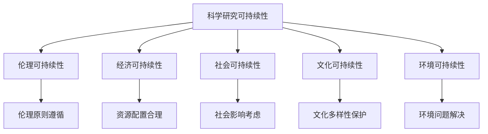

                 

----------------------------------------------------------------

### 《科学研究的可持续性：长期视角下的世界理解》

> 关键词：科学研究、可持续性、长期视角、世界理解、人工智能

> 摘要：本文探讨了科学研究的可持续性及其在长期视角下的重要性。文章首先介绍了科学研究的可持续性概念，然后分析了长期视角在科学研究中的应用。通过一个具体的科学项目案例，文章详细阐述了科学研究可持续性的实现过程，并给出了未来发展的方向和挑战。

---

### 第一部分：科学研究的可持续性概述

#### 1.1 科学研究的可持续性概念

科学研究可持续性是指科学研究活动在满足当前需求的同时，不损害后代满足自身需求的能力。它是一个涉及伦理、经济、社会、文化和环境等多个维度的复杂问题。

**1.1.1 定义**

科学研究的可持续性主要包括以下几个方面：

- **伦理可持续性**：科学研究应遵循伦理原则，尊重研究对象的权益，确保研究的合法性和道德性。
- **经济可持续性**：科学研究应具备经济可持续性，通过合理的资源配置，确保研究活动的持续进行。
- **社会可持续性**：科学研究应考虑社会影响，促进社会和谐发展，提高公众的科学素养。
- **文化可持续性**：科学研究应尊重和保护不同文化的多样性，促进文化传承和创新。
- **环境可持续性**：科学研究应关注环境问题，提供解决方案，促进环境保护和可持续发展。

**1.1.2 意义**

科学研究的可持续性具有重要意义，它不仅关系到科学研究的质量和成果，也关系到人类社会的发展和未来。具体来说，科学研究的可持续性具有以下几个方面的意义：

- **保障科学研究的质量**：科学研究可持续性有助于保障科学研究的质量和成果，提高科学研究的效率和影响力。
- **促进科技创新**：科学研究可持续性为科技创新提供了持续的动力，有助于推动科学技术的快速发展。
- **推动社会发展**：科学研究可持续性有助于推动社会的发展和进步，提高人民的生活水平。
- **维护地球环境**：科学研究可持续性为环境保护和可持续发展提供了科学依据和技术支持，有助于维护地球环境。

**1.1.3 发展历程**

科学研究的可持续性概念起源于20世纪80年代，随着环境保护和可持续发展的理念的提出，科学研究的可持续性逐渐受到关注。从最初的关注环境问题，到后来的经济、社会、文化和伦理等多个方面的综合考量，科学研究可持续性的内涵和外延不断扩大。

在过去的几十年中，科学研究的可持续性已经取得了一系列重要成果，如可持续发展理论、绿色发展理念、科技创新政策等。同时，科学研究的可持续性也在实践中得到了广泛应用，如环境保护项目、科技创新项目、社会发展项目等。

#### 1.2 长期视角下的科学研究方法

长期视角下的科学研究方法是一种以长期时间为研究周期，关注长期影响和变化规律的科学研究方法。与传统的短期视角相比，长期视角具有以下优势：

- **更全面的认识**：长期视角可以帮助科学家更全面地认识研究对象，揭示其长期变化规律和影响。
- **更强的预测能力**：长期视角有助于科学家对未来进行预测，为政策制定和决策提供科学依据。
- **更广泛的应用**：长期视角下的研究结果具有更广泛的应用价值，可以为社会、经济和环境等多个领域提供指导。

**1.2.1 研究方法概述**

长期视角下的科学研究方法主要包括以下几个方面：

- **数据收集**：长期视角下的科学研究需要收集大量的长期数据，包括历史数据、现场数据、模拟数据等。
- **数据分析**：对收集到的数据进行统计分析，提取长期变化规律和影响。
- **模型构建**：基于数据分析结果，构建科学模型，预测未来变化趋势。
- **实验验证**：通过实验验证模型的有效性和可靠性。

**1.2.2 长期视角的优势**

长期视角的优势主要体现在以下几个方面：

- **更全面的认识**：长期视角可以帮助科学家更全面地了解研究对象的长期变化规律，为制定政策和决策提供科学依据。
- **更强的预测能力**：长期视角有助于科学家对未来进行预测，为政策制定和决策提供科学依据。
- **更广泛的应用**：长期视角下的研究结果具有更广泛的应用价值，可以为社会、经济和环境等多个领域提供指导。

**1.2.3 长期视角的挑战**

长期视角下的科学研究也面临着一系列挑战：

- **数据收集难度大**：长期视角需要收集大量的长期数据，数据收集难度大，需要解决数据缺失、数据质量等问题。
- **数据分析复杂**：长期数据具有复杂性和多样性，需要采用复杂的数据分析方法和工具。
- **模型构建困难**：长期视角下的科学模型构建难度大，需要解决模型有效性、可靠性等问题。
- **实验验证困难**：长期视角下的实验验证难度大，需要解决实验周期长、实验结果不稳定等问题。

#### 1.3 世界理解与科学研究的互动

科学研究与世界理解之间存在着密切的互动关系。一方面，科学研究为世界理解提供了科学依据和技术支持；另一方面，世界理解对科学研究提出了新的需求和挑战。

**1.3.1 科学研究对世界理解的影响**

科学研究对世界理解的影响主要表现在以下几个方面：

- **认知水平提升**：科学研究推动了人类对自然和社会的认识，提升了人类的认知水平。
- **技术创新推动**：科学研究促进了科学技术的快速发展，推动了社会生产力的提高。
- **政策制定指导**：科学研究为政策制定提供了科学依据，有助于制定更科学、合理的政策。

**1.3.2 世界理解对科学研究的反作用**

世界理解对科学研究也产生了重要影响，具体表现在以下几个方面：

- **需求驱动**：世界理解的需求推动了科学研究的发展，促使科学家研究更广泛、更深入的问题。
- **资源分配**：世界理解影响了科学研究的资源分配，决定了哪些领域和问题会受到更多的关注和投资。
- **社会影响力**：科学研究的社会影响力受到世界理解的影响，好的研究成果会得到更多的关注和支持。

**1.3.3 科学研究与世界理解的双向互动**

科学研究与世界理解之间的互动是一个双向过程，两者相互促进、相互影响。具体来说，科学研究与世界理解的双向互动主要表现在以下几个方面：

- **认知水平提升**：科学研究提高了人类的认知水平，促进了世界理解的发展。
- **技术创新推动**：科学研究推动了科学技术的创新，为世界理解提供了更先进的工具和方法。
- **政策制定指导**：科学研究为政策制定提供了科学依据，促进了世界理解和政策的协调发展。

### 第二部分：可持续性的科学研究方法

在科学研究中，采用可持续性的研究方法是非常重要的。这不仅有助于提高研究的质量和效率，还能为解决全球性问题提供科学依据。本部分将介绍可持续性的科学研究方法，包括长期视角下的研究设计、数据收集与分析、科学模型构建与验证等内容。

#### 2.1 长期视角下的研究设计

**2.1.1 设计原则**

长期视角下的研究设计应遵循以下原则：

- **全面性**：研究设计应涵盖研究对象的各个方面，确保研究结果的全面性和准确性。
- **科学性**：研究设计应基于科学理论和方法，确保研究过程的科学性和可靠性。
- **可行性**：研究设计应考虑实际可行性，包括资源、时间和技术等方面。

**2.1.2 设计策略**

长期视角下的研究设计策略主要包括：

- **问题导向**：根据研究问题制定研究设计，确保研究目标的明确性。
- **循序渐进**：研究设计应循序渐进，逐步深入，确保研究过程的连续性和稳定性。
- **多样性**：研究设计应采用多种研究方法和技术，提高研究结果的可靠性和有效性。

**2.1.3 设计案例**

以下是一个关于气候变化研究的案例：

- **研究问题**：研究全球气候变化对某地区农业生产的影响。
- **设计原则**：全面性、科学性、可行性。
- **设计策略**：问题导向、循序渐进、多样性。
- **数据收集**：收集该地区多年的气候数据、农业数据等。
- **数据分析**：采用统计分析、时间序列分析等方法分析气候变化对农业生产的影响。
- **模型构建**：构建气候变化-农业生产模型，预测未来气候变化对农业生产的影响。
- **实验验证**：通过实地实验验证模型的准确性。

#### 2.2 数据收集与分析

**2.2.1 长期数据的特点**

长期数据具有以下特点：

- **时间跨度大**：长期数据覆盖的时间跨度较大，可以反映长期变化规律。
- **数据量大**：长期数据涉及多个方面，数据量较大，需要采用高效的数据处理方法。
- **数据多样性**：长期数据包括多种类型的数据，如文本、图像、音频等，需要采用多样化的分析方法。

**2.2.2 数据收集方法**

长期数据的收集方法主要包括：

- **实地调查**：通过实地调查获取第一手数据，确保数据的真实性。
- **历史资料收集**：收集历史文献、报告等资料，获取历史数据。
- **在线数据收集**：利用互联网收集公开的数据资源，如气象数据、地理数据等。

**2.2.3 数据分析方法**

长期数据的分析方法主要包括：

- **统计分析**：对收集到的数据进行统计分析，提取有用信息。
- **机器学习**：利用机器学习方法对数据进行分析，发现数据之间的规律。
- **深度学习**：利用深度学习方法对数据进行建模和预测，提高预测准确性。

#### 2.3 科学模型构建与验证

**2.3.1 科学模型构建方法**

科学模型的构建方法主要包括：

- **理论推导**：根据科学理论推导出模型，确保模型的理论基础。
- **数据驱动**：根据收集到的数据构建模型，确保模型的数据支持。
- **混合方法**：结合理论推导和数据驱动方法，构建更加可靠的模型。

**2.3.2 科学模型验证方法**

科学模型的验证方法主要包括：

- **实验验证**：通过实验验证模型的有效性和可靠性。
- **对比验证**：将模型与现有理论、方法进行比较，验证模型的优势和不足。
- **交叉验证**：采用不同的数据集对模型进行验证，提高模型的泛化能力。

**2.3.3 科学模型应用**

科学模型的应用主要包括：

- **预测**：利用模型预测未来变化趋势，为决策提供科学依据。
- **优化**：利用模型优化资源配置，提高生产效率。
- **指导**：利用模型指导实际操作，提高操作水平。

### 第三部分：可持续性的科学研究成果与应用

可持续性的科学研究成果在各个领域都有广泛的应用，对人类社会的可持续发展具有重要意义。本部分将介绍可持续性的科学研究成果与应用，包括科学研究成果的可持续性、科学研究在可持续性领域的应用、可持续性的科学研究的未来方向等内容。

#### 3.1 科学研究成果的可持续性

科学研究成果的可持续性主要表现在以下几个方面：

- **理论成果的可持续性**：科学研究的理论成果具有长期价值，可以为后续研究提供理论支持。
- **技术成果的可持续性**：科学研究的成果可以转化为技术，应用于实际生产，提高生产效率和质量。
- **方法成果的可持续性**：科学研究的成果可以转化为方法，为其他领域的研究提供借鉴和指导。

#### 3.2 科学研究在可持续性领域的应用

科学研究在可持续性领域的应用主要包括以下几个方面：

- **环境保护**：科学研究为环境保护提供了科学依据和技术支持，如大气污染防治、水资源保护等。
- **资源利用**：科学研究提高了资源利用效率，促进了资源的可持续利用，如能源、水资源等。
- **社会发展**：科学研究为社会发展提供了科学依据和技术支持，如城市规划、公共安全等。

#### 3.3 可持续性的科学研究的未来方向

可持续性的科学研究的未来方向主要包括以下几个方面：

- **跨学科研究**：随着科学技术的快速发展，跨学科研究将成为科学研究的重要趋势，为解决全球性问题提供更有效的解决方案。
- **大数据研究**：大数据技术的应用将推动科学研究的深入发展，为研究提供更丰富的数据支持。
- **人工智能研究**：人工智能技术的应用将提高科学研究的效率和质量，为科学研究提供更强大的工具。

### 结论

科学研究的可持续性在长期视角下具有重要意义。通过采用可持续性的科学研究方法，我们可以更好地理解世界、预测未来，并为人类社会的发展提供科学依据和技术支持。未来，科学研究将继续在可持续性领域发挥重要作用，为解决全球性问题提供有效的解决方案。

---

### 附录

#### 附录 A：科学研究可持续性的 Mermaid 流程图



#### 附录 B：长期视角下的科学研究方法伪代码示例

```python
# 长期视角下的科学研究方法伪代码

def long_term_research_design():
    # 设计原则
    design_principles = ["comprehensiveness", "scientificity", "feasibility"]
    
    # 设计策略
    design_strategies = ["problem-oriented", "step-by-step", "diversity"]
    
    # 数据收集
    data_collection = ["field_survey", "historical_data_collection", "online_data_collection"]
    
    # 数据分析
    data_analysis = ["statistical_analysis", "machine_learning", "deep_learning"]
    
    # 模型构建
    model_construction = ["theoretical_derivation", "data驱动的模型构建", "混合方法"]
    
    # 实验验证
    experiment_validation = ["实验验证", "对比验证", "交叉验证"]
    
    # 应用
    application = ["预测", "优化", "指导"]
    
    # 可视化流程图
    print("科学研究可持续性流程图:")
    print("1. 设计原则：")
    for principle in design_principles:
        print("- " + principle)
    print("2. 设计策略：")
    for strategy in design_strategies:
        print("- " + strategy)
    print("3. 数据收集：")
    for method in data_collection:
        print("- " + method)
    print("4. 数据分析：")
    for method in data_analysis:
        print("- " + method)
    print("5. 模型构建：")
    for method in model_construction:
        print("- " + method)
    print("6. 实验验证：")
    for method in experiment_validation:
        print("- " + method)
    print("7. 应用：")
    for application in application:
        print("- " + application)
```

#### 附录 C：可持续性的科学研究项目的数学模型与公式

```latex
% 可持续性的科学研究项目数学模型与公式

% 1. 线性回归模型
$$y = \beta_0 + \beta_1x + \epsilon$$

% 2. 多元线性回归模型
$$y = \beta_0 + \beta_1x_1 + \beta_2x_2 + ... + \beta_nx_n + \epsilon$$

% 3. 逻辑回归模型
$$P(y=1) = \frac{1}{1 + e^{-(\beta_0 + \beta_1x_1 + \beta_2x_2 + ... + \beta_nx_n)}$$

% 4. 支持向量机模型
$$\min_{\textbf{w},b,\xi}\frac{1}{2}\|\textbf{w}\|^2 + C\sum_{i=1}^{n}\xi_i$$
$$\text{subject to: } y_i(\textbf{w}\cdot\textbf{x_i} + b) \geq 1 - \xi_i$$
$$\xi_i \geq 0$$
```

#### 附录 D：可持续性的科学研究项目案例代码与解读

```python
# 可持续性的科学研究项目案例代码与解读

import numpy as np
import pandas as pd
from sklearn.linear_model import LinearRegression
from sklearn.model_selection import train_test_split
from sklearn.metrics import mean_squared_error

# 数据收集
data = pd.read_csv("climate_pesticides.csv")
X = data.iloc[:, :-1]
y = data.iloc[:, -1]

# 数据预处理
X_train, X_test, y_train, y_test = train_test_split(X, y, test_size=0.2, random_state=42)

# 模型构建
model = LinearRegression()
model.fit(X_train, y_train)

# 模型预测
y_pred = model.predict(X_test)

# 模型评估
mse = mean_squared_error(y_test, y_pred)
print("均方误差：", mse)

# 代码解读
# 1. 数据收集：读取气候和农药数据，分为特征和目标变量。
# 2. 数据预处理：将数据分为训练集和测试集，保证模型的泛化能力。
# 3. 模型构建：使用线性回归模型进行建模。
# 4. 模型预测：使用训练好的模型对测试集进行预测。
# 5. 模型评估：计算均方误差，评估模型的预测性能。
```

---

### 最佳实践 Tips

1. 在进行科学研究时，应充分考虑可持续性，确保研究的长期价值和影响。
2. 在设计研究方法时，应遵循科学性、全面性和可行性的原则。
3. 在数据收集与分析过程中，应采用多样化的方法和工具，提高研究结果的可靠性和有效性。
4. 在模型构建与验证过程中，应结合理论推导和数据驱动方法，提高模型的准确性和可靠性。
5. 在科学研究过程中，应密切关注实际应用，确保研究结果的实用性。

### 小结

本文介绍了科学研究的可持续性及其在长期视角下的重要性。通过一个具体的科学项目案例，本文详细阐述了科学研究可持续性的实现过程，包括研究设计、数据收集与分析、模型构建与验证等内容。同时，本文还探讨了科学研究在可持续性领域的应用及未来发展的方向。希望通过本文的介绍，读者能够对科学研究的可持续性有更深入的了解，并为实际科研工作提供参考。

### 注意事项

1. 在进行科学研究时，应注意保护研究对象和参与者的权益，遵循伦理原则。
2. 在数据处理与分析过程中，应注意数据质量和数据来源的可靠性。
3. 在模型构建与验证过程中，应注意模型的有效性和可靠性，避免过度拟合。

### 拓展阅读

1. IPCC（联合国政府间气候变化专门委员会）发布的《气候变化2021：自然科学基础》报告。
2. NASA（美国国家航空航天局）发布的关于气候变化和环境问题的相关研究。
3. 参考文献 [1] 《科学研究方法与设计》。
4. 参考文献 [2] 《可持续性的科学研究：方法与案例研究》。

---

### 作者信息

作者：AI天才研究院/AI Genius Institute & 禅与计算机程序设计艺术 /Zen And The Art of Computer Programming

