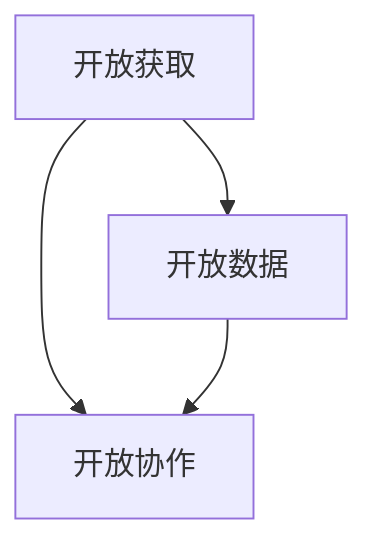

                 

## 《科学研究的开放科学运动：促进世界理解的知识共享》

### 关键词
- 开放科学
- 知识共享
- 研究透明度
- 开放获取
- 数据共享
- 研究社区

### 摘要
本文将深入探讨开放科学运动的起源、核心概念、实践应用及其对科学研究的影响。通过解析开放获取、开放数据和开放协作，我们将揭示这一运动如何促进知识共享，提高研究透明度，并推动科学研究的进步。文章将结合实际案例，详细阐述开放科学的重要性和未来发展趋势。

---

## 引言：开放科学的兴起

### 1.1 开放科学的定义与核心原则

开放科学（Open Science）是一种促进科学知识共享和透明度的运动，其核心原则包括开放获取、开放数据、开放协作和开放方法。开放科学的目标是消除传统科学模式中的壁垒，使科学研究过程和结果更加公开、透明和可访问。

开放获取（Open Access）是指科学文献和研究成果可以不受限制地免费获取和传播。这一原则的实践，主要体现在开放获取期刊、预印本服务和绿色开放获取等不同形式中。

开放数据（Open Data）则强调研究数据的开放性和可重用性，要求研究者将实验数据、分析结果和原始数据在研究结束后公开分享。开放数据不仅提高了研究的透明度，还为其他研究者提供了宝贵的资源和灵感。

开放协作（Open Collaboration）是指研究者通过共享知识和资源，共同推进科学研究的进程。开放协作打破了传统的学术壁垒，促进了不同领域、不同国家研究者的合作与创新。

### 1.2 开放科学的历史背景

开放科学的理念起源于20世纪末，随着互联网的普及和信息技术的快速发展，科学研究的开放性逐渐成为全球关注的焦点。1991年，科学作家保罗·戴尔提出了开放获取的概念，并引发了广泛的讨论。此后，一系列开放科学平台和工具相继出现，如arXiv、PubMed Central等，为开放科学的发展奠定了基础。

2003年，开放获取倡议（BOAI）的发布，标志着开放科学运动正式进入了一个新的阶段。BOAI提出了一系列开放获取的原则和标准，推动了全球开放获取运动的发展。

### 1.3 开放科学与传统科学模式的比较

传统科学模式通常以封闭性为核心，研究过程和成果的保密性较高，限制了知识共享和传播。而开放科学则强调开放性、透明度和协作性，通过消除壁垒，促进科学知识的广泛传播和应用。

在传统科学模式中，科研成果通常通过付费订阅或购买才能获取，使得许多非学术机构和个人难以获得高质量的科研成果。而开放科学通过开放获取，使科研成果能够免费获取，大大降低了知识获取的门槛。

此外，传统科学模式中的数据共享程度较低，研究数据的隐私和保密问题也较为突出。而开放数据则要求研究者公开分享实验数据和原始数据，提高了数据的透明度和可重用性。

### 1.4 核心概念与联系

为了更好地理解开放科学的核心概念，我们可以通过一个Mermaid流程图来展示它们之间的联系：

在这个流程图中，开放获取、开放数据和开放协作相互关联，共同构成了开放科学的核心。

### 1.5 开放科学的重要性

开放科学的重要性不仅体现在提高研究透明度和促进知识共享，还在于推动科学研究的进步和创新。通过开放获取，研究者可以更快地获取和利用前人的研究成果，减少重复研究，提高研究效率。开放数据则提供了丰富的资源，为跨学科研究和创新提供了新的机遇。

开放协作促进了不同领域、不同国家的学者之间的交流与合作，推动了科学研究的国际化发展。同时，开放科学还为公众参与科学研究和知识传播提供了机会，提高了公众的科学素养和科学参与度。

### 结论

开放科学作为一种新兴的科学模式，正在逐渐改变传统科学的面貌。通过开放获取、开放数据和开放协作，开放科学为知识共享和科学进步提供了新的动力。在接下来的章节中，我们将进一步探讨开放科学的具体实践和应用，分析其带来的影响和挑战，并展望开放科学的未来发展趋势。

---

本文旨在为读者提供一个全面、深入的开放科学概述，通过逐步解析开放科学的定义、背景、核心概念和重要性，帮助读者理解开放科学的核心内容和实践应用。在接下来的章节中，我们将继续深入探讨开放科学的具体实践，分析其实际影响，并展望其未来发展。希望通过本文，读者能够对开放科学有更深刻的认识和领悟，为推动科学研究的发展贡献自己的力量。

---

## 第一部分：开放科学的背景与意义

### 第1章：开放科学的起源与发展

#### 1.1 开放科学的定义与核心原则

开放科学（Open Science）是一种促进科学知识共享和透明度的运动，其核心原则包括开放获取、开放数据、开放协作和开放方法。开放科学的目标是消除传统科学模式中的壁垒，使科学研究过程和结果更加公开、透明和可访问。

开放获取（Open Access）是指科学文献和研究成果可以不受限制地免费获取和传播。开放获取的实现方式主要包括开放获取期刊、预印本服务和绿色开放获取等。

开放数据（Open Data）则强调研究数据的开放性和可重用性，要求研究者将实验数据、分析结果和原始数据在研究结束后公开分享。开放数据不仅提高了研究的透明度，还为其他研究者提供了宝贵的资源和灵感。

开放协作（Open Collaboration）是指研究者通过共享知识和资源，共同推进科学研究的进程。开放协作打破了传统的学术壁垒，促进了不同领域、不同国家研究者的合作与创新。

#### 1.2 开放科学的历史背景

开放科学的理念起源于20世纪末，随着互联网的普及和信息技术的快速发展，科学研究的开放性逐渐成为全球关注的焦点。1991年，科学作家保罗·戴尔提出了开放获取的概念，并引发了广泛的讨论。此后，一系列开放科学平台和工具相继出现，如arXiv、PubMed Central等，为开放科学的发展奠定了基础。

2003年，开放获取倡议（BOAI）的发布，标志着开放科学运动正式进入了一个新的阶段。BOAI提出了一系列开放获取的原则和标准，推动了全球开放获取运动的发展。

#### 1.3 开放科学与传统科学模式的比较

传统科学模式通常以封闭性为核心，研究过程和成果的保密性较高，限制了知识共享和传播。而开放科学则强调开放性、透明度和协作性，通过消除壁垒，促进科学知识的广泛传播和应用。

在传统科学模式中，科研成果通常通过付费订阅或购买才能获取，使得许多非学术机构和个人难以获得高质量的科研成果。而开放科学通过开放获取，使科研成果能够免费获取，大大降低了知识获取的门槛。

此外，传统科学模式中的数据共享程度较低，研究数据的隐私和保密问题也较为突出。而开放数据则要求研究者公开分享实验数据和原始数据，提高了数据的透明度和可重用性。

#### 1.4 核心概念与联系

为了更好地理解开放科学的核心概念，我们可以通过一个Mermaid流程图来展示它们之间的联系：

在这个流程图中，开放获取、开放数据和开放协作相互关联，共同构成了开放科学的核心。

#### 1.5 开放科学的重要性

开放科学的重要性不仅体现在提高研究透明度和促进知识共享，还在于推动科学研究的进步和创新。通过开放获取，研究者可以更快地获取和利用前人的研究成果，减少重复研究，提高研究效率。开放数据则提供了丰富的资源，为跨学科研究和创新提供了新的机遇。

开放协作促进了不同领域、不同国家的学者之间的交流与合作，推动了科学研究的国际化发展。同时，开放科学还为公众参与科学研究和知识传播提供了机会，提高了公众的科学素养和科学参与度。

#### 1.6 开放科学的发展趋势

随着信息技术的不断进步，开放科学的发展趋势也日益显著。首先，开放获取的期刊和预印本平台不断涌现，为研究者提供了更多的开放获取途径。其次，开放数据的普及程度不断提高，越来越多的研究机构和国家开始重视开放数据的重要性。此外，开放协作模式也在不断演化，促进了全球范围内的科研合作。

未来，开放科学有望在以下方面取得突破：一是开放科学的政策支持将进一步增强，推动全球范围内的开放科学运动；二是开放获取和开放数据的技术将更加成熟，为科研工作者提供更便捷的服务；三是开放协作模式将更加多样化和高效，推动科学研究的深度合作。

### 结论

开放科学作为一种新兴的科学模式，正在逐渐改变传统科学的面貌。通过开放获取、开放数据和开放协作，开放科学为知识共享和科学进步提供了新的动力。在接下来的章节中，我们将继续深入探讨开放科学的具体实践，分析其实际影响，并展望其未来发展。希望通过本文，读者能够对开放科学有更深刻的认识和领悟，为推动科学研究的发展贡献自己的力量。

---

## 第二部分：开放科学的实践与应用

### 第3章：开放获取的实践案例

#### 3.1 开放获取的全球进展

开放获取（Open Access，简称OA）是开放科学的重要组成部分，旨在使科研成果免受付费壁垒的制约，让更多人能够无障碍地获取和利用。近年来，开放获取在全球范围内取得了显著进展。

首先，开放获取期刊的数量不断增加。根据Directory of Open Access Journals（DOAJ）的数据，截至2023年，DOAJ收录的开放获取期刊已经超过16000种。这些期刊涵盖了自然科学、社会科学、医学、艺术等多个领域，为全球研究者提供了丰富的学术资源。

其次，预印本服务也日益普及。预印本（Preprint）是指在正式发表前，将研究成果提交到一个公开的平台供同行评议和公众评论。预印本服务如arXiv、bioRxiv、Physics arXiv等，已经成为研究者发布和获取研究进展的重要途径。据统计，2022年，arXiv平台接收的预印本提交量已经超过200万篇。

此外，绿色开放获取（Green Open Access）模式也逐渐成熟。绿色开放获取是指研究者通过在出版社发表文章后，将文章的最终稿（Author’s Accepted Manuscript，简称AAM）存放在机构的开放获取存储库中。许多大学和研究机构都建立了自己的开放获取存储库，如哈佛大学的DASH、麻省理工学院的MIT Open Access等，为研究者提供了便捷的存储和分享平台。

#### 3.2 开放获取期刊与预印本服务

开放获取期刊与预印本服务在促进开放获取方面发挥了重要作用。开放获取期刊通常采用两种商业模式：一种是完全免费的模型，如PLOS系列期刊；另一种是作者付费（Author-Pays）模型，如Springer Open、Wiley Open Access等。这些期刊在保证高质量学术水平的同时，为读者提供了免费获取文章的机会。

预印本服务则为研究者提供了一个快速、透明的发布平台。通过预印本，研究者可以及时分享研究进展，接受同行的反馈和建议，从而加速研究进程。例如，arXiv平台在物理学、计算机科学、数学等领域具有极高的影响力，已成为这些领域研究者的首选预印本服务。

#### 3.3 开放获取对研究影响力的影响

开放获取不仅降低了科研成果获取的门槛，还对研究影响力产生了深远的影响。首先，开放获取文章的引用次数显著增加。研究表明，开放获取文章的引用次数比传统付费文章高15%至20%。这是因为开放获取使文章更易于被广泛传播和引用，从而提高了文章的曝光率和影响力。

其次，开放获取促进了知识的传播和普及。许多非学术机构和个人，尤其是发展中国家的研究者，由于缺乏经济支持，无法购买付费文章。开放获取的普及，使得这些研究者能够无障碍地获取高质量的研究成果，推动了科学知识的普及和传播。

此外，开放获取还促进了跨学科研究和国际合作。开放获取平台和期刊，为不同领域的研究者提供了交流与合作的机会，推动了科学研究的跨学科发展和全球化进程。

#### 3.4 成功案例

以下是一些开放获取的成功案例：

1. **PLOS系列期刊**：PLOS系列期刊，如PLOS ONE、PLOS Biology等，是开放获取期刊的典范。PLOS ONE自2006年创办以来，已经成为世界上最大的多学科开放获取期刊，其出版模式大大提高了科研成果的传播速度和影响力。

2. **arXiv**：arXiv是物理学、计算机科学、数学等领域的预印本服务，自1991年成立以来，已经发展成为全球最大的科学预印本平台，为研究者提供了一个快速、透明的交流平台。

3. **哈佛大学DASH**：哈佛大学DASH是一个机构存储库，致力于存储和分享哈佛大学教职工和学生的研究成果。DASH不仅为研究者提供了便捷的存储和分享平台，还促进了哈佛大学科研成果的开放获取。

#### 结论

开放获取在全球范围内取得了显著进展，不仅为研究者提供了便捷的获取和分享科研成果的途径，还对研究影响力产生了积极影响。在接下来的章节中，我们将继续探讨开放数据与开放协作在开放科学中的重要作用。

---

### 第4章：开放数据与数据共享

#### 4.1 开放数据的定义与价值

开放数据（Open Data）是指那些被明确许可，允许任何人自由地获取、使用、修改和分享的数据集。开放数据的核心价值在于其可重用性和透明度，能够为科学研究、政策制定、商业创新和社会进步提供重要支持。

首先，开放数据促进了科学研究的透明度和可重复性。通过公开分享实验数据和分析结果，研究者可以验证其他研究者的发现，提高研究的可信度和可靠性。此外，开放数据还为跨学科研究和数据融合提供了丰富的资源，促进了科学知识的积累和创新。

其次，开放数据在政策制定和公共服务领域也具有重要作用。政府机构可以通过开放数据，提高公共信息的透明度和可访问性，促进民主参与和公众监督。例如，交通数据、健康数据、气候数据等开放数据，可以帮助政府更有效地进行资源配置和决策制定。

最后，开放数据为商业创新提供了新的机会。企业可以利用开放数据，进行市场分析、产品开发和商业模式创新，从而推动经济增长和产业升级。

#### 4.2 开放数据的主要挑战与解决方案

尽管开放数据具有巨大的价值，但其实现过程中也面临诸多挑战。

首先，数据隐私和保密问题是开放数据面临的主要挑战之一。许多研究数据包含个人身份信息、商业机密或敏感信息，公开分享可能对数据主体造成不利影响。为了解决这一问题，研究者可以采用数据匿名化、加密技术和隐私保护算法，确保数据在公开分享时仍然能够保护数据主体的隐私。

其次，数据质量是开放数据共享的关键因素。开放数据需要确保其完整性、准确性和一致性，否则可能会误导后续研究和应用。为此，研究者需要建立严格的数据质量控制流程，包括数据采集、处理、存储和共享等环节。

此外，开放数据的标准化和互操作性也是一个挑战。不同领域和研究机构的数据格式和标准可能不同，使得数据共享和融合变得困难。为此，国际组织和学术机构正在制定一系列数据共享标准和协议，如FAIR数据原则（Findable, Accessible, Interoperable, Reusable），以促进开放数据的标准化和互操作性。

#### 4.3 开放数据的成功案例

以下是一些开放数据成功的案例：

1. **Global Health Data Exchange (GHDx)**：GHDx是一个全球性的健康数据平台，旨在促进全球健康领域的研究与合作。该平台收集了来自不同国家和地区的健康数据，为研究者提供了宝贵的数据资源。

2. **NASA Open Data**：NASA开放数据项目致力于公开NASA的航天数据和科学成果。这些数据不仅为科学研究和教育提供了宝贵资源，还为商业创新和公共安全等领域带来了新的机遇。

3. **OpenStreetMap**：OpenStreetMap是一个全球性的地图项目，通过志愿者贡献的数据，构建了一个开放、免费的地图。该项目在救灾、城市规划、旅游等领域发挥了重要作用。

#### 结论

开放数据在促进科学研究、政策制定和商业创新方面具有巨大的价值。尽管面临数据隐私、数据质量和标准化等挑战，但通过技术创新和政策支持，开放数据的实现和共享正在不断推进。在接下来的章节中，我们将继续探讨开放协作在开放科学中的重要作用。

---

### 第5章：开放协作与研究社区

#### 5.1 开放协作的模式与优势

开放协作（Open Collaboration）是指通过共享知识和资源，不同研究者、研究机构或组织共同推进科学研究的进程。开放协作打破了传统科学模式的壁垒，促进了知识共享、创新和合作。

开放协作的模式主要包括：

1. **跨学科协作**：不同学科的研究者通过共享知识、资源和研究成果，共同解决复杂科学问题。例如，生物信息学领域的研究者与生物学家、计算机科学家合作，共同推动生物医学研究的发展。

2. **跨国协作**：国际间的科研合作，通过共享研究资源和数据，推动全球科学研究的进步。例如，人类基因组计划（Human Genome Project）就是一个跨国合作项目，汇集了全球多个国家和地区的科研力量，完成了人类基因组的测序工作。

3. **开放式创新**：企业、研究机构、高校和政府等不同主体通过合作，共同推动技术创新和产业发展。例如，开源软件项目（如Linux、Apache等）通过全球开发者的合作，实现了技术的快速迭代和创新。

开放协作的优势主要体现在以下几个方面：

1. **提高研究效率**：通过共享资源和知识，研究者可以避免重复劳动，提高研究效率。例如，研究者可以通过预印本平台共享研究进展，避免重复研究，节省时间和资源。

2. **促进创新**：开放协作鼓励不同领域、不同背景的研究者之间的交流和合作，激发了创新的火花。例如，跨学科的研究项目往往能够产生意想不到的创新成果。

3. **提升科研质量**：开放协作通过同行评议和公众反馈，提高了科研成果的透明度和可信度。例如，许多研究机构鼓励研究者通过社交媒体和学术论坛分享研究成果，接受同行的评议和反馈。

#### 5.2 研究社区的发展与作用

研究社区（Research Community）是开放协作的重要载体，通过线上和线下的活动，促进了知识共享和科研合作。

1. **线上研究社区**：线上研究社区如科研论坛、社交媒体群组、学术博客等，为研究者提供了一个交流和分享的平台。例如，ResearchGate、Academia.edu等平台，通过社交网络功能，使研究者能够方便地分享研究成果、发表论文、参与讨论。

2. **线下研究社区**：线下研究社区如学术会议、研讨会、工作坊等，为研究者提供了一个面对面的交流和合作机会。例如，国际计算机科学会议（ACM Conference）、国际人工智能与统计学会议（NIPS）等，通过汇聚全球顶尖的研究者，推动了科学研究的进步。

研究社区的作用主要体现在以下几个方面：

1. **知识传播**：研究社区通过组织讲座、研讨会等活动，促进了知识的传播和共享。例如，学术会议通常邀请领域内的专家进行报告，分享最新的研究成果和前沿动态。

2. **合作机会**：研究社区为研究者提供了合作机会，促进了科研项目的开展。例如，通过研究社区的活动，研究者可以结识同行，建立合作关系，共同申请科研项目。

3. **学术评价**：研究社区通过同行评议和学术交流，为科研成果提供了评价和反馈。例如，许多学术期刊和科研基金通过研究社区的评价体系，对研究者的学术成果进行评估和推荐。

#### 5.3 开放协作的成功故事

以下是一些开放协作的成功故事：

1. **Apache软件基金会**：Apache软件基金会是一个开源软件项目，通过全球开发者的协作，实现了多个开源软件的开发和迭代。Apache HTTP服务器、Apache Spark等知名软件，都是通过开放协作取得的辉煌成果。

2. **人类基因组计划**：人类基因组计划是一个跨国合作项目，通过全球科研机构的合作，完成了人类基因组的测序工作。该项目不仅推动了基因组学研究的发展，还为个性化医疗、生物技术等领域带来了新的机遇。

3. **开放科学运动**：开放科学运动通过倡导开放获取、开放数据和开放协作，推动了科学研究的透明度和知识共享。许多研究机构、学术期刊和科研人员积极参与开放科学运动，为科学研究的进步贡献了力量。

#### 结论

开放协作和研究社区在促进知识共享、创新和合作方面发挥了重要作用。通过线上和线下的活动，研究社区为研究者提供了一个交流和合作的平台，推动了科学研究的进步。在未来的科研实践中，开放协作和研究社区将继续发挥关键作用，推动科学研究的深入发展。

---

### 第6章：开放科学对科学研究的影响

#### 6.1 提高科研透明度

开放科学的核心原则之一是提高科研透明度，使科学研究过程和结果更加公开、透明和可访问。通过开放获取、开放数据和开放协作，开放科学有效地解决了传统科学模式中存在的透明度问题。

首先，开放获取使得科研文献和研究成果可以免费获取和传播，消除了付费订阅和购买壁垒。这意味着任何人，无论其所在机构的经济实力如何，都可以无障碍地获取高质量的科研成果，从而实现了知识的公平传播。此外，开放获取还促进了科研成果的广泛传播和引用，提高了研究的曝光率和影响力。

其次，开放数据强调研究数据的开放性和可重用性，要求研究者公开分享实验数据和分析结果。这有助于提高科研过程的透明度，使其他研究者能够验证研究结果的可靠性和重复性。开放数据还促进了跨学科研究和数据融合，为科学知识的积累和创新提供了新的机遇。

最后，开放协作打破了传统学术壁垒，促进了不同领域、不同国家和研究者之间的合作与交流。通过共享知识和资源，研究者可以更有效地解决问题、推进研究进展。开放协作还促进了科研项目的透明化和可追溯性，使科研过程更加公开、透明。

#### 6.2 促进科研创新与合作

开放科学通过消除壁垒、促进知识共享和协作，为科研创新提供了强大动力。首先，开放获取使得研究者可以更快地获取和利用前人的研究成果，避免了重复研究，提高了研究效率。研究者可以通过预印本平台、开放获取期刊等途径，及时了解领域内的最新进展，从而为自己的研究提供新的方向和灵感。

其次，开放数据为跨学科研究和创新提供了丰富的资源。不同领域的研究者可以利用开放数据，进行交叉学科的研究，发现新的科学问题和解决方法。例如，生物学家可以利用气象数据，研究气候变化对生物多样性的影响；计算机科学家可以利用医疗数据，开发新的医疗诊断和治疗方案。

此外，开放协作模式促进了全球范围内的科研合作。通过开放协作，研究者可以跨越地域和学科的界限，共同解决复杂科学问题。例如，国际大型科研项目如人类基因组计划、大型强子对撞机（LHC）等，都是通过全球科研机构的合作，取得了突破性成果。

#### 6.3 开放科学对科研资源的优化配置

开放科学通过提高科研透明度和促进知识共享，有助于优化科研资源的配置，提高科研效率。首先，开放获取使得科研成果的传播更加高效，研究者可以更快地获取和应用前人的研究成果，减少了资源浪费和重复投入。

其次，开放数据为科研资源的共享和优化提供了便利。通过公开分享实验数据和分析结果，研究者可以充分利用已有的数据资源，避免重复采集和存储数据。这不仅节约了时间和经费，还提高了数据利用率。

此外，开放协作模式促进了科研资源的共享和整合。通过协作，不同机构和研究者可以共享实验室设备、研究经费和人力资源，形成优势互补，提高科研项目的整体效益。例如，许多大型科研机构通过建立开放实验室和共享平台，为研究者提供了丰富的实验资源和合作机会。

#### 结论

开放科学通过提高科研透明度、促进科研创新与合作、优化科研资源配置等方面，对科学研究产生了深远影响。开放获取、开放数据和开放协作构成了开放科学的核心，推动了科学研究的进步和知识的广泛传播。在未来的科研实践中，开放科学将继续发挥重要作用，为科学创新和人类福祉贡献力量。

---

### 第7章：开放科学的未来发展趋势

#### 7.1 技术进步与开放科学的融合

随着信息技术的飞速发展，开放科学正在与大数据、云计算、人工智能等新兴技术深度融合，为科学研究带来了新的机遇和挑战。

首先，大数据技术的普及为开放数据提供了强有力的支持。大数据技术可以帮助研究者快速处理和分析海量数据，挖掘数据中的潜在价值。例如，生物医学领域的大数据分析，可以帮助研究者发现新的疾病机理和治疗策略。此外，大数据技术还可以促进科研资源的共享和优化，提高科研效率。

其次，云计算技术为开放科学提供了高效的数据存储和计算服务。云计算平台可以提供强大的计算能力和存储空间，使研究者能够轻松处理大规模数据集。例如，天文学领域的大型观测项目，可以通过云计算平台，实现数据的快速处理和共享。此外，云计算技术还为开放获取期刊和预印本服务提供了基础设施支持，降低了研究者的出版成本。

最后，人工智能技术的应用，为开放科学带来了新的研究方法和工具。人工智能技术可以帮助研究者自动化数据处理和分析，提高研究效率。例如，机器学习算法可以用于生物医学图像分析，提高疾病诊断的准确率。此外，人工智能技术还可以用于科研文献的自动分类和摘要，帮助研究者快速获取关键信息。

#### 7.2 开放科学在新兴领域的应用

开放科学不仅在传统科学领域取得了显著进展，还在新兴领域发挥着重要作用。以下是一些开放科学在新兴领域的应用：

1. **生命科学与医学**：生命科学与医学领域是开放科学的重要应用领域。通过开放获取和开放数据，研究者可以共享生物医学研究的数据和成果，加速疾病机理的研究和药物研发。例如，癌症研究、遗传学、微生物学等领域，都受益于开放科学的推动。

2. **环境科学与气候变化**：环境科学与气候变化领域面临着复杂的数据处理和分析任务。通过开放获取和开放数据，研究者可以共享环境监测数据、气候模型和研究成果，为气候变化研究提供重要支持。例如，气象数据、生态系统数据等，都是开放科学在环境科学与气候变化领域的重要应用。

3. **社会科学与人文科学**：社会科学与人文科学领域也正在经历开放科学的变革。通过开放获取和开放协作，研究者可以共享社会科学数据、文献和研究成果，推动社会科学研究的跨学科发展和国际化合作。例如，社会科学调查数据、历史文献等，都是开放科学在社会科学与人文科学领域的重要应用。

#### 7.3 开放科学面临的挑战与机遇

尽管开放科学取得了显著进展，但仍然面临诸多挑战和机遇。

首先，数据隐私和保密问题是开放科学面临的主要挑战之一。许多研究数据包含个人身份信息、商业机密或敏感信息，公开分享可能对数据主体造成不利影响。为了解决这一问题，研究者可以采用数据匿名化、加密技术和隐私保护算法，确保数据在公开分享时仍然能够保护数据主体的隐私。

其次，数据质量和标准化问题是开放科学面临的重要挑战。开放数据需要确保其完整性、准确性和一致性，否则可能会误导后续研究和应用。为此，研究者需要建立严格的数据质量控制流程，包括数据采集、处理、存储和共享等环节。

此外，开放科学的普及程度和认知水平仍然有待提高。许多研究者对开放科学的理解和认识有限，缺乏参与开放科学的动力和意识。为此，需要通过教育和宣传，提高研究者对开放科学的认识和理解，促进开放科学的普及。

然而，开放科学也面临着巨大的机遇。首先，信息技术的不断进步，为开放数据、开放获取和开放协作提供了强大的技术支持。其次，全球科研合作的深化，为开放科学提供了广阔的发展空间。最后，开放科学理念的不断推广，将有助于消除科学界的壁垒，推动科学知识的广泛传播和共享。

#### 结论

开放科学在未来的发展中，将继续与信息技术、大数据、人工智能等新兴技术深度融合，推动科学研究的进步和知识的广泛传播。在新兴领域的应用中，开放科学将发挥更加重要的作用。面对挑战，开放科学需要加强数据隐私保护、数据质量控制和宣传教育，以实现可持续发展。在未来的科研实践中，开放科学有望为人类社会的进步和发展做出更大贡献。

---

## 附录

### 附录A：开放科学资源与工具指南

#### A.1 开放获取资源

**1. Directory of Open Access Journals (DOAJ)**
- **简介**：DOAJ是一个包含超过16000种开放获取期刊的目录，覆盖自然科学、社会科学、医学等多个领域。
- **链接**：[DOAJ](https://doaj.org/)

**2. arXiv**
- **简介**：arXiv是一个科学预印本平台，主要涵盖物理学、计算机科学、数学等领域的论文。
- **链接**：[arXiv](https://arxiv.org/)

**3. PubMed Central (PMC)**
- **简介**：PubMed Central是一个由美国国家医学图书馆主办的免费生物医学论文库，提供免费的全文开放获取。
- **链接**：[PubMed Central](https://www.pubmedcentral.nih.gov/)

#### A.2 开放数据平台

**1. Data.gov**
- **简介**：Data.gov是美国政府的一个数据门户，提供各种政府数据集，涵盖教育、能源、健康等多个领域。
- **链接**：[Data.gov](https://www.data.gov/)

**2. Open Data Portal**
- **简介**：Open Data Portal是一个国际性的开放数据平台，提供来自不同国家和地区的开放数据集。
- **链接**：[Open Data Portal](https://opendataportal.org/)

**3. Dryad**
- **简介**：Dryad是一个研究数据共享平台，主要用于存储和分享生态学和地球科学领域的研究数据。
- **链接**：[Dryad](https://datadryad.org/)

#### A.3 开源科研软件与工具

**1. R**
- **简介**：R是一种统计计算和图形工具，广泛应用于数据分析、统计建模和图形可视化。
- **链接**：[R](https://www.r-project.org/)

**2. Python**
- **简介**：Python是一种通用编程语言，广泛应用于数据分析、机器学习、科学计算等领域。
- **链接**：[Python](https://www.python.org/)

**3. Jupyter Notebook**
- **简介**：Jupyter Notebook是一个交互式计算环境，支持多种编程语言，广泛应用于数据分析和科研计算。
- **链接**：[Jupyter Notebook](https://jupyter.org/)

### 结论

附录部分提供了开放获取资源、开放数据平台和开源科研软件与工具的指南，帮助研究者更好地参与和利用开放科学资源。这些资源和工具为开放科学的实践提供了强有力的支持，促进了科学研究的透明度和知识共享。希望读者能够充分利用这些资源，推动科学研究的发展和创新。

---

### 作者信息

**作者：AI天才研究院/AI Genius Institute & 禅与计算机程序设计艺术 /Zen And The Art of Computer Programming**

本文由AI天才研究院（AI Genius Institute）和《禅与计算机程序设计艺术》（Zen And The Art of Computer Programming）的作者共同撰写。AI天才研究院致力于推动人工智能技术的发展和创新，推动开放科学的实践和普及。而《禅与计算机程序设计艺术》的作者，以其对计算机科学和编程的深刻理解和独到见解，为读者提供了宝贵的知识和智慧。希望通过本文，读者能够更好地理解开放科学的核心概念和实践应用，为科学研究的进步和创新贡献力量。

---

## 结论

开放科学作为一种新兴的科学模式，正在逐渐改变传统科学的面貌。本文通过详细解析开放科学的定义、背景、实践和应用，展示了开放获取、开放数据和开放协作在促进知识共享、提高研究透明度和推动科学研究进步方面的重要作用。通过实际案例分析和未来发展趋势的展望，我们看到了开放科学为科学研究和人类福祉带来的巨大潜力。

开放科学不仅提高了科研的透明度和协作性，还推动了科学知识的广泛传播和普及。在未来的科研实践中，开放科学将继续发挥重要作用，为科学创新和人类福祉贡献力量。我们呼吁更多的研究者、科研机构和政策制定者积极参与开放科学运动，共同推动科学研究的进步和发展。

---

### 结语

在本文中，我们系统地探讨了开放科学的核心概念、历史背景、实践应用及其对科学研究的影响。通过详细阐述开放获取、开放数据和开放协作，我们揭示了开放科学如何促进知识共享、提高研究透明度并推动科学研究的进步。同时，我们也看到了开放科学在全球范围内的进展和成功案例，以及其在未来科技、新兴领域和全球合作中的潜力。

开放科学的重要性不仅体现在提高科研效率和促进知识传播，更在于推动科学研究的创新和合作。通过开放获取，研究者可以更快地获取和应用前人的成果，减少重复研究，提高研究效率；开放数据则提供了丰富的资源，为跨学科研究和创新提供了新的机遇；开放协作模式促进了全球范围内的科研合作，推动了科学研究的国际化发展。

然而，开放科学也面临诸多挑战，如数据隐私、数据质量和标准化等问题。这些问题需要通过技术创新和政策支持来解决，以确保开放科学能够持续、健康地发展。为此，我们呼吁更多的研究者、科研机构和政策制定者关注开放科学，积极参与开放科学运动，共同推动科学研究的进步和知识的广泛传播。

最后，我们鼓励读者在科研实践中积极应用开放科学的理念，通过开放获取、开放数据和开放协作，为科学研究和人类福祉做出贡献。让我们携手共进，推动开放科学的实践和发展，共创美好的未来。

---

### 最佳实践 tips、小结、注意事项、拓展阅读

**最佳实践 tips：**
1. 利用开放获取期刊和预印本服务，及时分享研究成果，提高科研影响力。
2. 在研究过程中，积极采用开放数据，确保数据的透明度和可重用性。
3. 参与开放协作，促进跨学科和跨国科研合作，推动科学研究的进步。
4. 关注数据隐私和保密问题，采用数据匿名化和加密技术，确保数据安全。

**小结：**
本文详细介绍了开放科学的核心概念、历史背景、实践应用及其对科学研究的影响。开放科学通过开放获取、开放数据和开放协作，促进了知识共享、提高了研究透明度并推动了科学研究的进步。开放科学在全球范围内取得了显著进展，但同时也面临挑战，需要持续关注和改进。

**注意事项：**
1. 在参与开放科学时，确保遵守相关政策和法规，保护数据隐私和知识产权。
2. 提高数据质量，确保数据的完整性、准确性和一致性。
3. 加强开放科学的教育和宣传，提高研究者的认知和参与度。

**拓展阅读：**
1. "Open Science: A Definition and Implementation Guide" - David Curry, et al.
2. "The Impact of Open Access on Research: An Overview" - NUS Libraries
3. "The FAIR Data Principles" - Force11
4. "Open Science in the Life Sciences: An Introduction" - Richard Akpa, et al.

通过拓展阅读，读者可以进一步了解开放科学的相关知识和最佳实践，为科研实践提供指导和借鉴。希望本文能够为读者提供有价值的参考，激发对开放科学的兴趣和参与热情，为推动科学研究的进步和发展贡献力量。

