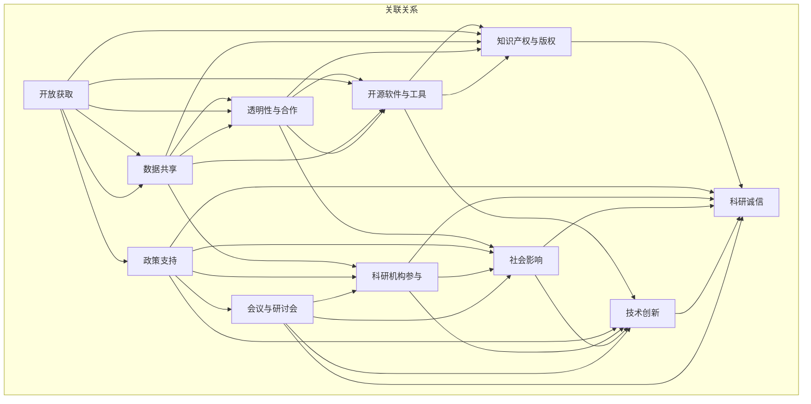

                 


### 开放科学的背景与核心概念

在当今信息化和全球化的时代，科学研究的开放科学运动正在迅速发展。开放科学（Open Science）不仅是一种新的研究模式，更是一种推动知识共享、加速科学进展的全球性运动。那么，什么是开放科学？它有哪些核心概念？本文将深入探讨这些核心问题，并为读者提供全面的背景介绍。

#### 开放科学的定义

开放科学，顾名思义，指的是在科学研究过程中，将研究成果、数据、工具和方法对公众开放，从而促进知识共享和协作的一种科学实践。这种开放性主要体现在以下几个方面：

1. **开放获取**：研究成果以免费和开放的方式向公众提供，使得所有人都能阅读和使用科学论文、书籍和其他研究成果。
2. **数据共享**：科学家在研究过程中产生的大量数据能够被其他人访问和重复使用，从而提高数据的利用率和研究效率。
3. **合作与协作**：开放科学鼓励科学家之间的合作，通过共享资源和知识，推动科学研究的共同进步。
4. **开源与开放源码**：在科学研究中使用的软件、工具和算法等是开源的，任何人都可以自由使用、修改和分享。

#### 开放科学的重要性

开放科学的重要性体现在以下几个方面：

1. **提高研究透明度**：开放科学使得科学研究过程更加透明，公众和同行可以了解研究的全过程和结论，从而提高研究的可信度和公正性。
2. **加速科学进展**：开放获取和共享的数据、工具和方法，可以缩短研究周期，加速科学发现的进程。
3. **降低研究成本**：通过资源共享和协作，可以降低单个研究者的经济负担，使得更多人能够参与科学研究。
4. **促进创新**：开放科学鼓励创新，任何人都可以基于已有的研究成果进行进一步的探索和改进，从而推动科学技术的快速发展。

#### 开放科学的历史与发展

开放科学并非新兴事物，其发展历程可以追溯到20世纪末期。最早的开放科学实践可以追溯到科学论文的开放获取期刊（如《生物信息学杂志》），随后，开放获取运动逐渐扩展到整个科学领域。近年来，随着互联网技术的发展，开放科学的实践和理念得到了进一步的推广和深化。

1. **开放获取期刊**：20世纪90年代，开放获取期刊如《生物信息学杂志》（Bioinformatics）和《科学数据》（Science Data）开始兴起，这些期刊允许作者将论文免费发布在互联网上，读者无需支付订阅费用即可阅读全文。
2. **预印本服务**：预印本服务（如arXiv）使得科学家可以在正式发表前分享他们的研究，加快了研究传播的速度。
3. **科学数据共享**：各大科研机构纷纷建立科学数据共享平台，如美国的国家生物技术信息中心（NCBI）和欧洲分子生物学实验室（EMBL-EBI），为科学家提供数据访问和存储服务。
4. **开源软件与工具**：开源软件（如Linux、Python）和科学工具（如MATLAB、R语言）的使用，使得科学家能够更高效地开展研究，并促进软件的改进和优化。

#### 开放科学的核心概念与原则

开放科学的核心概念和原则包括以下几个方面：

1. **开放获取**：开放获取（Open Access）是指科研成果以免费和开放的方式向公众提供。这可以通过两种方式实现：一是通过开放获取期刊，二是通过绿色开放获取，即作者在提交至传统期刊后，将论文存放在个人或机构的开放存储库中。

2. **透明性与合作**：开放科学强调研究过程的透明性，包括实验方法、数据分析过程和研究结果的公开，以促进同行评审和科学讨论。同时，开放科学鼓励科学家之间的合作与协作，通过共享资源和知识，推动科学研究的共同进步。

3. **数据共享与重复使用**：开放科学强调数据共享，即科学家在研究过程中产生的数据应免费、开放地提供给他人使用，以便他人可以基于这些数据进行进一步的研究和分析。

4. **开源软件与工具**：开放科学倡导使用开源软件和工具，这样任何人都可以自由使用、修改和分享，从而促进科学技术的快速发展。

5. **知识产权与版权**：开放科学在倡导开放共享的同时，也需要保护知识产权和版权，确保科研人员的权益得到尊重。

#### 开放科学运动的全球趋势

开放科学运动在全球范围内得到了广泛的响应和支持。许多国家和地区纷纷推出政策，鼓励和支持开放科学实践。以下是一些全球开放科学运动的趋势：

1. **政策支持**：许多国家和地区政府纷纷出台政策，支持开放获取和科学数据共享。例如，欧盟推出了“开放科学”政策，要求公共资助的研究成果必须开放获取。
2. **科研机构参与**：各大科研机构和大学积极参与开放科学运动，建立开放获取期刊、数据共享平台和开源软件库，为科学家提供支持和资源。
3. **开放科学会议与研讨会**：全球范围内定期举行开放科学会议和研讨会，促进科学家之间的交流与合作，分享开放科学的经验和最佳实践。
4. **社会影响**：开放科学运动对社会产生了深远的影响，推动了科研诚信、科学普及和公众参与科学研究的进程。

通过上述分析，我们可以看到，开放科学作为一种推动知识共享和促进科学进步的重要运动，正在全球范围内迅速发展。其核心概念和原则，如开放获取、透明性、合作、数据共享和开源，已经成为科学家和研究机构的重要指导原则。随着技术的不断进步和政策的不断完善，开放科学运动有望在未来发挥更大的作用，推动科学研究的创新和发展。

#### 核心概念之间的联系架构

为了更好地理解开放科学的核心概念，我们使用Mermaid流程图来展示它们之间的联系架构。



在这个Mermaid流程图中，我们展示了开放科学的核心概念之间的联系。开放获取、数据共享、透明性与合作、开源软件与工具以及知识产权与版权是开放科学的基础。这些核心概念相互关联，共同构成了开放科学的整体架构。政策支持、科研机构参与、社会影响、技术创新和科研诚信等则是开放科学在实践中产生的影响和结果。

通过这个流程图，我们可以更清晰地理解开放科学的核心概念及其相互关系，从而更好地把握开放科学的发展趋势和方向。

#### 开放获取期刊与预印本服务

开放获取期刊（Open Access Journals）和预印本服务（Preprint Servers）是开放科学运动的重要组成部分，它们为科学家的研究成果提供了广泛的传播和共享平台。在这部分内容中，我们将深入探讨开放获取期刊和预印本服务的定义、工作原理以及它们在科学研究中的重要性。

##### 开放获取期刊

开放获取期刊是指那些允许作者将研究成果以免费、开放的方式发布在互联网上，供公众阅读和下载的学术期刊。与传统的订阅模式期刊不同，开放获取期刊不收取订阅费用，读者无需支付任何费用即可访问全文。

**工作原理：**
开放获取期刊的工作原理主要包括以下几个方面：

1. **作者投稿**：作者将研究论文提交给开放获取期刊，经过同行评审后，论文会被接受并发布在期刊网站上。
2. **同行评审**：同行评审是确保研究质量和学术诚信的重要环节。评审过程通常由同行专家进行，以确保论文的学术价值和创新性。
3. **出版与发布**：经过评审的论文会被整理、编辑并发布在期刊的网站上，供全球读者免费访问和下载。
4. **长期存储**：开放获取期刊通常会与数字仓储平台合作，确保论文的长期存储和可访问性。

**优势：**
开放获取期刊具有以下优势：

1. **提高研究透明度**：开放获取期刊使得研究过程和结果更加透明，公众和同行可以更容易地了解研究过程和结论。
2. **加速科学进展**：由于论文的免费和开放访问，研究成果可以更快地传播和分享，从而加速科学发现的进程。
3. **降低研究成本**：开放获取期刊不需要读者支付订阅费用，降低了科研机构和个人的经济负担。

**挑战：**
尽管开放获取期刊有众多优势，但也面临一些挑战：

1. **评审质量**：由于开放获取期刊的同行评审过程需要大量的时间和资源，有时可能存在评审质量不高等问题。
2. **版权问题**：开放获取期刊在版权方面存在一些争议，例如作者在提交论文时可能需要签署版权转让协议，这可能影响后续的研究使用。
3. **可持续性**：开放获取期刊的运营成本较高，如何确保其可持续性是一个重要问题。

##### 预印本服务

预印本服务是指科学家在正式发表前，将研究成果以预印本的形式发布在预印本服务器上，供全球科研人员和公众免费访问和讨论。预印本服务器通常是非商业性的，旨在促进科学交流和知识共享。

**工作原理：**
预印本服务的工作原理主要包括以下几个方面：

1. **作者提交**：作者将研究论文提交到预印本服务器，服务器会对论文进行基本的格式检查，确保其符合预印本服务的格式要求。
2. **在线发布**：经过提交和格式检查后，论文会被发布在预印本服务器的网站上，供全球读者访问和下载。
3. **同行评议**：预印本服务通常不提供正式的同行评审过程，但允许作者在论文发布后邀请同行进行评论和讨论。
4. **持续更新**：预印本服务器会定期更新已发布的论文，确保最新的研究动态能够及时传播。

**优势：**
预印本服务具有以下优势：

1. **加速研究传播**：预印本服务使得研究成果可以在正式发表前更快速地传播，加快了科学发现的进程。
2. **促进科学讨论**：预印本服务提供了作者与同行交流的平台，使得科学家可以在论文发表前进行讨论和反馈，提高研究的质量和影响力。
3. **降低发表延误**：预印本服务减少了正式发表前的延误时间，有助于缩短研究周期。

**挑战：**
预印本服务同样面临一些挑战：

1. **评审质量**：由于预印本服务通常不提供正式的同行评审，可能存在论文质量不高等问题。
2. **版权问题**：预印本服务的版权问题与开放获取期刊相似，可能影响后续的研究使用。
3. **隐私与安全性**：预印本服务需要确保提交的论文和个人信息的安全性和隐私性。

##### 实际案例

以下是一些开放获取期刊和预印本服务的实际案例：

1. **开放获取期刊：《科学数据》（Science Data）**  
   《科学数据》是一个开放获取期刊，专注于发布高质量的科学数据。它由科睿唯安（Clarivate Analytics）主办，为全球科研人员提供免费的数据发布和共享服务。

2. **预印本服务：arXiv**  
   arXiv是一个非营利性的预印本服务器，主要发布物理学、数学、计算机科学、量子力学和统计学等领域的研究论文。它吸引了全球成千上万的科研人员，成为了科学研究的重要交流平台。

通过开放获取期刊和预印本服务，科学家可以更方便地传播和分享研究成果，促进科学知识的广泛传播和交流。这些平台不仅提高了研究的透明度和可访问性，还加快了科学发现的进程，为科学技术的进步做出了重要贡献。

#### 科学数据共享与存储

科学数据共享与存储是开放科学的重要组成部分，对于促进全球范围内的知识共享具有重要意义。在这一部分，我们将探讨科学数据共享的重要性、面临的挑战以及现有的解决方案。

##### 科学数据共享的重要性

科学数据是科学研究的重要资产，它记录了实验结果、模型模拟、观测数据等，对于后续研究有着重要的参考价值。科学数据共享的重要性体现在以下几个方面：

1. **提高研究的可重复性**：共享科学数据可以使得其他研究者能够重复实验和验证结果，从而提高研究的可信度和可靠性。
2. **促进跨学科合作**：共享的数据可以为不同领域的科学家提供新的研究视角和思路，促进跨学科的合作和创新。
3. **加速科学进展**：共享的科学数据可以缩短研究周期，使得科学家能够更快地获得所需的数据和信息，从而加速科学发现的进程。
4. **降低研究成本**：通过共享数据，研究者不需要重新收集相同的数据，从而降低了研究成本和资源消耗。

##### 面临的挑战

尽管科学数据共享具有诸多优势，但在实际操作过程中，仍然面临一些挑战：

1. **数据隐私与安全性**：科学数据通常包含敏感信息，如个人健康数据、实验结果等，如何保护这些数据的安全性是一个重要问题。
2. **数据格式与兼容性**：不同研究项目和数据源可能使用不同的数据格式，如何确保数据的兼容性和互操作性是一个挑战。
3. **数据质量与标准化**：科学数据的质量和标准化程度参差不齐，如何确保数据的准确性和一致性是一个重要问题。
4. **知识产权与版权**：科学数据在共享过程中，如何保护知识产权和版权是一个需要解决的问题。

##### 现有的解决方案

为了应对上述挑战，科学家和科研机构已经采取了一系列解决方案：

1. **数据共享平台**：许多科研机构和大学建立了数据共享平台，如美国国家生物技术信息中心（NCBI）、欧洲分子生物学实验室（EMBL-EBI）等，这些平台提供了数据存储、检索和共享的服务。
2. **数据标准与规范**：为了提高数据的质量和标准化程度，科学家和标准化组织制定了数据标准和规范，如数据模型、数据格式等。
3. **数据加密与安全协议**：为了保护科学数据的安全性，科研机构和数据共享平台采用了数据加密和安全协议，如SSL/TLS加密、防火墙等。
4. **知识产权保护**：在科学数据共享过程中，科研机构和数据共享平台采用了知识产权保护措施，如版权声明、使用许可等。

##### 实际案例

以下是一些科学数据共享与存储的实际案例：

1. **开放生物医学研究数据共享平台：DataShare**  
   DataShare是一个开放的数据共享平台，专注于生物医学领域。它提供了数据存储、共享和访问的服务，使得科学家能够方便地共享和获取生物医学数据。

2. **地球科学数据共享平台：EOSDIS**  
   EOSDIS是美国国家航空航天局（NASA）的一个地球科学数据共享平台，提供了大量的地球观测数据，如气象数据、海洋数据等。这些数据对全球科学家和研究项目具有重要意义。

通过科学数据共享与存储，科学家可以更方便地获取和使用数据，促进全球范围内的知识共享和科学合作。这不仅可以提高研究的质量和效率，还可以加速科学技术的进步。

#### 科学研究的合作与协作平台

科学研究是一个复杂而庞大的过程，需要多学科、多机构的协同合作。为了提高科研效率和成果质量，各种科研合作与协作平台应运而生。这些平台提供了便捷的工具和资源，帮助科学家进行有效合作和资源共享。以下，我们将探讨这些平台的特点、功能及应用案例。

##### 平台的特点与功能

科研合作与协作平台具有以下主要特点与功能：

1. **资源共享**：平台提供了丰富的科研资源，如科研文献、数据库、软件工具等，使得科学家可以方便地获取和利用这些资源。
2. **项目管理**：平台支持科研项目管理的功能，科学家可以在线创建项目、分配任务、跟踪进度、共享文档等。
3. **数据共享**：平台提供了数据存储和共享的功能，科学家可以在平台上上传、存储和分享研究数据，确保数据的可访问性和重复使用。
4. **在线协作**：平台支持多人在线协作，科学家可以在平台上实时沟通、讨论、协作，提高科研效率和成果质量。
5. **协作工具**：平台集成了各种协作工具，如聊天室、论坛、文档编辑器、项目管理工具等，方便科学家进行协作。
6. **安全与隐私**：平台采用了先进的安全技术和隐私保护措施，确保科研数据的安全和隐私。

##### 应用案例

以下是一些科研合作与协作平台的应用案例：

1. **GitHub**  
   GitHub是一个全球知名的代码托管和协作平台，广泛用于软件开发和科研项目的协作。科学家可以使用GitHub创建项目仓库、共享代码、协作开发，同时，GitHub也提供了丰富的文档和社区资源，方便科学家进行知识分享和交流。

2. **Confluence**  
   Confluence是由Atlassian公司开发的一款协作平台，用于团队内部的知识管理和协作。科学家可以使用Confluence创建项目文档、共享研究报告、在线讨论和协作，提高科研项目的管理效率和成果质量。

3. **Slack**  
   Slack是一款流行的团队沟通和协作工具，支持实时消息、频道交流、文件共享和集成各种应用。科学家可以使用Slack与团队成员实时沟通、讨论研究问题、分享科研进展，提高团队协作效率和科研效率。

4. **Google Workspace**  
   Google Workspace（原G Suite）是由Google提供的一系列办公协作工具，包括文档、表格、邮件、日历等。科学家可以使用Google Workspace进行在线文档编辑、共享数据表格、管理项目进度，实现高效协作。

5. **Mendeley**  
   Mendeley是由ResearchGate公司开发的一款文献管理和协作工具，用于科研文献的整理、标注、共享和引用。科学家可以使用Mendeley整理研究资料、共享文献资源、协同撰写论文，提高科研工作效率。

##### 实际应用

以下是一个具体的科研协作平台应用的实例：

**项目名称**：全球气候变化研究项目  
**应用平台**：Confluence

**项目描述**：一个国际科学家团队计划开展全球气候变化研究，他们选择了Confluence作为协作平台。在Confluence上，团队创建了多个项目页面，用于整理研究计划、共享文献资料、讨论研究问题、记录实验数据等。团队成员可以通过Confluence实时更新项目进展、分配任务、共享文档和数据进行协作。此外，Confluence还提供了项目管理工具，帮助团队跟踪项目进度、确保项目按时完成。

**应用效果**：通过Confluence，团队成员实现了高效协作和资源共享，研究进度和成果质量得到了显著提升。项目完成后，团队将研究成果整理成报告，发布在开放获取期刊上，供全球科研人员和公众免费访问和参考。

通过上述应用案例，我们可以看到，科研合作与协作平台在提高科研效率和成果质量方面发挥了重要作用。这些平台为科学家提供了便捷的工具和资源，促进了全球范围内的科研合作和知识共享，为科学技术的进步做出了重要贡献。

#### 开源软件与工具在科学研究中的应用

在科学研究过程中，开源软件和工具的使用已经成为一种趋势。它们不仅为科学家提供了丰富的资源，还促进了科学研究的创新和发展。在这一部分，我们将深入探讨开源软件和工具在科学研究中的应用，包括使用实例、优势以及开源社区的贡献。

##### 开源软件与工具的使用实例

1. **Python**  
   Python是一种广泛使用的编程语言，以其简洁易懂的语法和丰富的库支持，在科学研究领域得到了广泛应用。例如，科学家可以使用Python进行数据分析、机器学习和数据可视化。以下是一个简单的Python代码示例，用于数据分析和可视化：

   ```python
   import pandas as pd
   import matplotlib.pyplot as plt

   # 加载数据
   data = pd.read_csv('example_data.csv')

   # 数据分析
   summary = data.describe()

   # 数据可视化
   plt.scatter(data['x'], data['y'])
   plt.xlabel('X轴')
   plt.ylabel('Y轴')
   plt.show()
   ```

2. **MATLAB**  
   MATLAB是一种强大的科学计算软件，广泛应用于数学、工程和物理学等领域。例如，科学家可以使用MATLAB进行信号处理、图像处理和数值模拟。以下是一个简单的MATLAB代码示例，用于信号处理：

   ```matlab
   % 生成随机信号
   t = 0:0.01:10;
   x = sin(2*pi*0.5*t);

   % 信号傅里叶变换
   X = fft(x);

   % 绘制信号和傅里叶变换结果
   plot(t, x, 'b');
   plot(t, abs(X), 'r');
   legend('原始信号', '傅里叶变换结果');
   ```

3. **R语言**  
   R语言是一种专门用于统计分析的数据科学语言，广泛应用于生物信息学、统计学和数据分析等领域。例如，科学家可以使用R进行数据分析和可视化。以下是一个简单的R代码示例，用于数据分析和可视化：

   ```R
   # 加载数据
   data <- read.csv('example_data.csv')

   # 数据分析
   summary <- summary(data)

   # 数据可视化
   plot(data$x, data$y, main='数据可视化', xlab='X轴', ylab='Y轴')
   ```

##### 开源软件与工具的优势

1. **免费与开放性**：开源软件和工具是免费的，任何人都可以下载和使用，无需支付高昂的许可费用。此外，开源软件和工具的源代码是公开的，用户可以自由修改和优化，以满足特定需求。
2. **丰富的资源和社区支持**：开源软件和工具通常拥有庞大的社区支持，用户可以方便地获取帮助和资源，例如教程、文档、论坛等。这使得科学家在遇到问题时可以迅速获得解决方案。
3. **灵活性与可扩展性**：开源软件和工具通常具有良好的灵活性和可扩展性，用户可以根据需求进行定制和优化，以满足特定的研究需求。
4. **促进合作与共享**：开源软件和工具鼓励用户之间的合作与共享，科学家可以基于已有的开源项目进行改进和扩展，从而推动科学研究的创新和发展。

##### 开源社区的贡献

开源社区在科学研究中的贡献是不可忽视的。以下是一些开源社区的贡献实例：

1. **OpenCV**  
   OpenCV是一个开源的计算机视觉库，提供了丰富的计算机视觉算法和工具。开源社区不断优化和改进OpenCV，使其在图像处理、物体识别和跟踪等领域取得了显著进展。

2. **SciPy**  
   SciPy是一个开源的科学计算库，基于NumPy库构建。SciPy提供了广泛的科学计算功能，包括数学、数值分析、信号处理和优化等，为科学家提供了强大的计算工具。

3. **TensorFlow**  
   TensorFlow是一个开源的深度学习框架，由Google开发。开源社区对TensorFlow进行了大量的优化和改进，使其在图像识别、自然语言处理和强化学习等领域取得了重大突破。

通过开源软件和工具的使用，科学家可以更高效地开展研究，提高研究质量和成果。同时，开源社区的合作与共享，也为科学研究的创新和发展提供了强大的支持。未来，随着开源软件和工具的进一步发展和普及，科学研究将迎来更加繁荣的时代。

#### 开放科学对科学研究的影响

开放科学作为一种新兴的研究模式，正在深刻地影响着科学研究的各个方面。本文将详细探讨开放科学对科学研究的影响，包括提高研究透明度、加速科学进展、降低研究成本等方面的作用。

##### 提高研究透明度

开放科学的一个核心原则是提高研究的透明度，使得研究过程和结果更加公开和透明。通过开放获取期刊、预印本服务、数据共享平台等手段，科学家的研究成果可以更广泛地传播，公众和同行可以方便地访问和获取这些信息。这种透明度不仅有助于提高研究的可信度和公正性，还能够促进同行评审和科学讨论。

1. **同行评审过程的公开**：开放科学使得同行评审过程更加透明。评审者的身份、评审意见和反馈都可以公开，有助于确保评审过程的公正性和合理性。此外，开放评审还可以吸引更多的专家参与，提高评审质量。

2. **实验方法和数据的公开**：开放科学鼓励科学家公开实验方法和数据，使得其他研究者可以重复实验和验证结果。这种公开性有助于提高研究结果的可靠性，防止研究欺诈和误报。

3. **研究过程和结果的分享**：通过开放科学平台，科学家可以实时分享研究过程和结果，使得同行和研究机构可以及时了解研究进展，提供反馈和建议。这种分享有助于提高研究效率，减少重复劳动。

##### 加速科学进展

开放科学通过促进知识共享和合作，可以显著加速科学进展。以下是一些具体的影响：

1. **研究成果的快速传播**：开放获取期刊和预印本服务使得研究成果可以迅速传播，缩短了正式发表前的等待时间。这有助于科学家快速获取最新的研究进展，为后续研究提供参考。

2. **数据共享与重复使用**：开放科学鼓励科学家共享实验数据和研究成果，使得其他研究者可以重复实验和验证结果。这种数据共享可以大大缩短研究周期，加速科学进展。

3. **合作与协作**：开放科学促进了科学家之间的合作与协作。通过共享资源和知识，科学家可以共同开展研究项目，解决复杂科学问题。这种合作有助于发挥各自优势，提高研究效率。

4. **跨学科研究**：开放科学打破了学科之间的壁垒，促进了跨学科研究。科学家可以基于共享的数据和知识，进行跨领域的合作研究，推动科学创新的融合与发展。

##### 降低研究成本

开放科学通过降低研究成本，使得更多人能够参与科学研究，从而推动了科学普及和科技创新。以下是一些具体的影响：

1. **减少订阅费用**：开放获取期刊和预印本服务使得公众可以免费访问科学论文，减少了科研机构和个人的订阅费用。这对于资源有限的科研机构和个人来说，是一个重要的成本节约措施。

2. **资源共享**：开放科学鼓励科学家共享实验设备和数据，减少了重复投资和资源浪费。科学家可以通过合作和共享，最大化利用已有的资源，降低研究成本。

3. **开源软件与工具**：开源软件和工具在科学研究中的应用，使得科学家可以免费使用和改进这些工具，降低了研究开发和维护的成本。例如，Python、MATLAB和R等开源软件在科学计算、数据分析和可视化等领域发挥着重要作用。

4. **降低知识产权和版权成本**：开放科学在倡导知识共享的同时，也推动了知识产权和版权的改革。通过开放许可和共享协议，科学家可以更灵活地使用他人成果，降低知识产权和版权的成本。

##### 实际案例

以下是一个开放科学在降低研究成本方面的实际案例：

**案例名称**：开放生物医学研究项目

**项目描述**：一个国际科学家团队计划开展一项开放生物医学研究项目，研究一种新型药物的疗效和安全性。为了降低研究成本，团队选择了开放获取期刊和预印本服务，公开研究成果，并与其他研究机构共享实验数据和工具。

**实施过程**：

1. **公开研究方法和数据**：团队在预印本服务上发布研究方法和初步数据，吸引其他科学家参与讨论和验证。
2. **协作研究**：团队与其他研究机构合作，共享实验设备和技术，提高了研究效率和成果质量。
3. **开放获取发表**：研究成果在开放获取期刊上发表，使得全球科研人员和公众可以免费访问和使用这些成果。

**效果评估**：

1. **成本节约**：通过开放获取和协作研究，团队在研究过程中节约了大量的订阅费用和设备投资。
2. **成果质量提高**：团队通过公开数据和协作研究，提高了研究结果的可靠性和创新性。
3. **知识共享**：研究成果的公开和共享，促进了全球范围内的科学合作和知识共享。

通过上述探讨，我们可以看到，开放科学在提高研究透明度、加速科学进展和降低研究成本等方面具有显著的影响。这些影响不仅推动了科学研究的创新和发展，还为科学普及和科技创新提供了强大的支持。未来，随着开放科学的进一步发展和普及，科学研究将迎来更加繁荣和高效的时期。

#### 开放科学面临的挑战

尽管开放科学在促进知识共享和科研创新方面取得了显著成效，但它仍然面临一系列挑战，这些挑战包括版权与知识产权、数据隐私与安全性、质量与信任问题。本文将深入分析这些问题，并提出相应的解决方案和最佳实践。

##### 版权与知识产权

1. **版权问题**：
   - **版权转让与保留**：在开放获取期刊和预印本服务中，作者通常需要签署版权转让协议，将研究成果的版权转让给期刊或服务提供商。这种转让可能会限制作者后续的研究使用，引发争议。
   - **双重发布**：某些期刊可能禁止作者在开放获取期刊发表文章后，将同一研究成果在其他期刊发表。这种限制可能导致作者面临版权纠纷。

   **解决方案与最佳实践**：
   - **版权声明**：作者在提交论文时应仔细阅读版权声明，了解期刊的版权政策。如果期刊允许，作者可以选择保留部分版权，如署名权、修改权和引用权。
   - **开放许可**：采用开放许可协议，如Creative Commons（CC）许可，明确授权他人使用研究成果的方式，同时保护作者的基本权益。

##### 数据隐私与安全性

1. **数据隐私问题**：
   - **个人数据保护**：科学研究中常涉及个人隐私数据，如健康记录、身份信息等。如何在数据共享的同时保护个人隐私成为一个挑战。
   - **数据泄露风险**：大规模的数据共享可能带来数据泄露的风险，影响个人和机构的隐私和安全。

   **解决方案与最佳实践**：
   - **数据匿名化**：在共享数据前，应进行数据匿名化处理，去除或加密个人识别信息，以保护个人隐私。
   - **加密与访问控制**：采用加密技术和访问控制机制，确保只有授权用户可以访问敏感数据，降低数据泄露风险。
   - **隐私政策与协议**：制定明确的数据隐私政策和使用协议，确保数据共享者在使用数据时遵循相关隐私保护规定。

##### 质量与信任问题

1. **研究质量**：
   - **审核标准**：开放科学中，如何确保研究成果的质量是一个重要问题。开放获取期刊和预印本服务的审核标准可能与传统期刊存在差异。
   - **学术诚信**：开放科学可能面临学术不端行为，如论文抄袭、数据造假等，影响研究质量和学术信任。

   **解决方案与最佳实践**：
   - **严格审核**：开放获取期刊和预印本服务应制定严格的审核标准，确保研究成果的质量。例如，采用双盲评审、同行评审等机制。
   - **学术监督**：建立学术监督机制，鼓励科学家进行自我监督和相互监督，提高学术诚信水平。
   - **透明披露**：要求作者在论文中明确披露研究过程、数据来源和实验方法，增强研究结果的透明度和可信度。

2. **信任问题**：
   - **评价体系**：开放科学中，如何评价研究成果的质量和影响力成为一个挑战。现有的学术评价体系可能难以适应开放科学的特征。
   - **声誉建设**：开放科学可能面临声誉建设问题，如何建立良好的学术声誉和信任关系是一个重要议题。

   **解决方案与最佳实践**：
   - **多元化评价**：建立多元化的学术评价体系，综合考虑研究成果的质量、创新性、影响力和可重复性等指标。
   - **声誉认证**：推动学术机构和组织对优秀研究成果进行认证和推荐，提高研究成果的声誉和认可度。
   - **开放评价**：鼓励科研人员和机构在学术交流和合作中，公开评价和反馈，建立良好的学术信任关系。

通过上述解决方案和最佳实践，开放科学可以更好地应对面临的挑战，推动科学研究的健康发展。未来，随着开放科学的不断完善和推广，它将为科学创新和知识共享发挥更大的作用。

### 开放科学的成功案例与最佳实践

开放科学在全球范围内已经取得了一系列成功案例，这些案例不仅展示了开放科学的具体应用，也为其他科研机构和科学家提供了宝贵的经验和最佳实践。以下是一些典型的开放科学成功案例以及相关的最佳实践。

#### 开放获取期刊的成功案例

1. **《生物信息学》（Bioinformatics）**  
   《生物信息学》是一本开放获取期刊，自1994年成立以来，一直致力于发表生物信息学领域的高质量研究论文。该期刊通过开放获取模式，使得研究成果能够迅速传播，吸引了大量的读者和引用。最佳实践：该期刊建立了严格的同行评审流程，确保论文质量，同时采用了多种技术手段，如DOI（数字对象标识符）和参考文献链接，提高论文的可访问性和引用率。

2. **《科学数据》（Science Data）**  
   《科学数据》是一本专注于发布科学数据的开放获取期刊，由科睿唯安（Clarivate Analytics）主办。该期刊提供了一个平台，让科学家可以免费发布和共享高质量的科学数据，促进数据的重复使用和跨学科合作。最佳实践：该期刊采用了标准化数据格式和数据验证机制，确保数据的质量和一致性，同时为用户提供便捷的数据检索和下载服务。

#### 预印本服务的成功案例

1. **arXiv**  
   arXiv是一个非营利性的预印本服务器，专注于物理学、数学、计算机科学、量子力学和统计学等领域。自1991年成立以来，arXiv已经成为全球科学家发布预印本论文的主要平台之一，吸引了大量的用户和引用。最佳实践：arXiv采用了高效的提交和审核流程，确保预印本论文的质量和及时性，同时建立了丰富的分类和搜索功能，方便用户检索和浏览论文。

2. **bioRxiv**  
   bioRxiv是生物医学领域的预印本服务器，由冷泉港实验室（Cold Spring Harbor Laboratory）运营。bioRxiv自2013年成立以来，已经成为生物医学研究的重要交流平台，吸引了大量的用户和引用。最佳实践：bioRxiv采用了严格的同行评审和开放评审机制，确保预印本论文的质量和公正性，同时为用户提供实时讨论和反馈功能，促进学术交流和合作。

#### 科学数据共享的成功案例

1. **国家生物技术信息中心（NCBI）**  
   NCBI是美国国家卫生研究院（NIH）的一个分支机构，提供了大量的生物医学和生物信息学数据，如基因序列、蛋白质结构、基因组数据等。NCBI的数据共享平台为全球科学家提供了丰富的数据资源，推动了生物医学研究的发展。最佳实践：NCBI采用了高效的数据存储和检索技术，确保数据的安全性和可访问性，同时建立了详细的数据使用协议，保护知识产权和数据隐私。

2. **欧洲分子生物学实验室（EMBL-EBI）**  
   EMBL-EBI是欧洲分子生物学实验室的一个部门，提供了丰富的生物信息学数据和服务，如蛋白质序列、结构、代谢网络等。EMBL-EBI的数据共享平台为全球科学家提供了重要的数据资源，促进了跨学科合作和知识共享。最佳实践：EMBL-EBI建立了详细的数据使用政策，确保数据的质量和可信度，同时为用户提供便捷的数据下载和在线分析工具。

#### 开源软件与工具的成功案例

1. **Python**  
   Python是一种广泛使用的开源编程语言，以其简洁易懂的语法和丰富的库支持，在科学计算、数据分析、机器学习等领域发挥了重要作用。Python的开源社区为科学家提供了强大的计算工具，提高了科研效率。最佳实践：Python开源社区定期发布更新和改进版本，确保软件的稳定性和安全性，同时建立了丰富的文档和教程，帮助用户快速入门和掌握。

2. **MATLAB**  
   MATLAB是一种强大的科学计算软件，广泛应用于数学、工程和物理学等领域。MATLAB开源了一些核心工具箱，促进了科学计算的开放和协作。最佳实践：MATLAB开源社区为用户提供丰富的工具箱和函数库，方便用户自定义和扩展功能，同时定期举办开源项目研讨会和交流活动，促进社区的共同进步。

通过上述成功案例和最佳实践，我们可以看到，开放科学在推动知识共享和科研创新方面发挥了重要作用。这些案例不仅展示了开放科学的实际应用效果，还为其他科研机构和科学家提供了宝贵的经验和启示。未来，随着开放科学的进一步发展和推广，它将为科学研究和科技创新带来更多的机遇和挑战。

### 中国开放科学的发展现状

中国开放科学的发展正处于快速推进的阶段，取得了显著成果。本文将介绍中国开放科学的发展现状，包括政策支持、科研机构参与度、学术成果的开放获取情况，以及面临的挑战和问题。

#### 政策支持

中国政府高度重视开放科学的发展，出台了一系列政策和措施，推动开放科学实践。以下是一些关键政策：

1. **《国家科技创新规划》**：该规划明确了开放科学的重要性，提出要建立健全开放科学体系，促进科技成果的开放获取和共享。
2. **《国家自然科学基金资助政策》**：国家自然科学基金委要求获得资助的项目在完成研究后，必须将研究成果公开发表，并提供免费访问。
3. **《中国科学院开放科学行动计划》**：中国科学院提出了“开放科学行动计划”，旨在建设开放科学平台，推动科研资源开放共享。

#### 科研机构参与度

中国各大科研机构和高校积极参与开放科学实践，建立了多个开放科学平台和数据库，如：

1. **中国科学院文献情报中心**：建立了中国科学文献数据库（CSDL），提供科学文献的开放获取和检索服务。
2. **北京大学开放获取系统**：北京大学图书馆推出了一系列开放获取期刊和预印本服务，促进了学术成果的共享。
3. **清华大学开源软件联盟**：清华大学推动了开源软件在科学研究中的应用，建立了多个开源项目，促进了科研合作和创新。

#### 学术成果的开放获取情况

中国在开放获取方面取得了显著进展，以下是一些具体数据：

1. **开放获取期刊**：中国已有数百种开放获取期刊，涵盖了自然科学、工程技术、医学等领域。部分期刊如《中国科学》、《中华医学杂志》等在国际学术界享有较高声誉。
2. **预印本服务**：中国已有多个预印本服务平台，如“中国预印本”、“医预印本”等，为科研人员提供了便捷的成果发布和共享服务。
3. **科学数据共享**：中国科学院、国家自然科学基金委等机构建立了多个科学数据共享平台，提供了大量的生物医学、地球科学、环境科学等领域的数据资源。

#### 面临的挑战和问题

尽管中国在开放科学方面取得了显著成果，但仍然面临一些挑战和问题：

1. **政策执行力度**：一些开放科学政策在执行过程中存在不到位的情况，需要加强监督和落实。
2. **数据质量和标准化**：科学数据的质量和标准化程度参差不齐，影响了数据的共享和利用。
3. **知识产权保护**：在开放科学实践中，如何平衡知识产权保护和数据共享是一个需要解决的问题。
4. **科研机构与高校的参与度**：一些科研机构和高校对开放科学的重视程度不够，参与度有待提高。

总之，中国开放科学的发展取得了显著进展，但仍然面临一些挑战和问题。未来，需要进一步加强政策支持，提高科研机构和高校的参与度，推动开放科学的深入发展，为科技创新和知识共享做出更大贡献。

#### 中国开放科学的机遇与未来

随着全球开放科学运动的不断推进，中国开放科学也迎来了前所未有的发展机遇。在这一部分，我们将探讨中国开放科学的机遇，分析其未来发展的方向和策略，并提出具体的发展建议。

##### 机遇

1. **政策支持**：中国政府高度重视开放科学的发展，出台了一系列政策和措施，为开放科学提供了有力的支持。这些政策不仅为开放科学的发展提供了保障，也为科研人员和机构提供了更多的资源和支持。
2. **科技创新需求**：在全球科技创新竞争日益激烈的背景下，中国需要通过开放科学来提高科技创新能力和国际竞争力。开放科学可以促进国内外科研人员的合作，共享资源和知识，推动科学技术的快速发展。
3. **互联网和大数据技术**：随着互联网和大数据技术的发展，科学研究的手段和方式发生了深刻变革。开放科学可以更好地利用这些新技术，提高科研效率和成果质量，为科技创新提供强有力的支撑。

##### 未来发展方向和策略

1. **加强政策支持和执行**：政府应继续加强对开放科学的支持，完善相关政策，确保政策的有效执行。例如，可以加大对开放获取期刊和预印本服务的支持力度，推动科研机构建立健全的数据共享机制。
2. **推动科研资源开放共享**：科研机构和高校应积极推动科研资源的开放共享，包括科学数据、实验设备、研究工具等。通过建立共享平台，实现资源的最大化利用，提高科研效率。
3. **促进国际合作**：开放科学强调国际合作，中国应积极参与全球开放科学运动，与国际科研机构和组织建立合作关系，共享科研资源，推动科学技术的跨国界合作。
4. **培养开放科学文化**：开放科学需要建立一种开放、合作、共享的科研文化。政府、科研机构和高校应加强开放科学的教育和宣传，培养科研人员的开放科学意识，推动开放科学理念的普及和实践。

##### 具体发展建议

1. **建立开放科学基金**：政府可以设立开放科学基金，支持开放获取期刊、预印本服务、科学数据共享等开放科学项目，推动开放科学的深入发展。
2. **加强学术交流**：政府、科研机构和高校应定期举办开放科学研讨会、论坛等活动，促进学术交流，分享开放科学经验和最佳实践。
3. **完善数据共享机制**：科研机构和高校应建立健全的数据共享机制，包括数据标准、数据质量控制和数据访问权限管理等，确保科学数据的高效共享和利用。
4. **推动开源软件和工具的发展**：政府、科研机构和高校应鼓励和支持开源软件和工具的发展，为科研人员提供丰富的开源资源，提高科研效率。
5. **加强知识产权保护**：在开放科学实践中，应加强对知识产权的保护，确保科研人员的权益得到尊重和保护。

总之，中国开放科学面临着巨大的机遇和挑战。通过加强政策支持、推动科研资源开放共享、促进国际合作和培养开放科学文化，中国开放科学有望在未来取得更大的发展和成就，为科技创新和知识共享做出更大的贡献。

#### 开放科学的未来展望

随着技术的不断进步和全球科学合作意识的增强，开放科学正迎来前所未有的发展机遇。以下是对开放科学未来发展趋势、社会影响以及潜在的新挑战的展望。

##### 未来发展趋势

1. **数据驱动的科学研究**：随着大数据、人工智能和机器学习的兴起，科学数据将更加丰富和多样化。开放科学将推动更多数据共享和复用，使科学研究更加数据驱动，从而加速科学发现和创新。
2. **全球科学合作**：开放科学促进了全球科学家的合作与交流。未来，跨国、跨学科的合作将更加普遍，全球科学共同体将更加紧密地联合起来，共同应对全球性挑战。
3. **开放科学工具和平台的普及**：随着开源软件和工具的不断发展，更多的科学家将能够轻松地使用这些工具进行科研工作。开放科学平台将成为科研人员不可或缺的助手，推动科学研究的进步。
4. **知识共享文化的建立**：开放科学将逐步推动开放、合作、共享的科研文化，鼓励科学家在研究过程中积极分享知识和资源，促进全球科学共同体的共同发展。

##### 社会影响

1. **科学普及和公众参与**：开放科学使得科学研究的成果更加容易被公众获取，提高了科学普及的广度和深度。公众可以更直观地了解科学研究的进展和成果，激发对科学的兴趣和参与热情。
2. **科技创新和社会进步**：开放科学促进了科学技术的创新和发展，为解决社会问题提供了强有力的支持。通过开放共享知识和资源，科学家可以更快地找到解决方案，推动社会进步。
3. **教育改革**：开放科学为教育提供了丰富的教学资源，教师和学生可以更方便地获取最新的科研成果和学习材料。这将推动教育改革，提高教育质量。

##### 新挑战

1. **数据隐私和安全**：随着数据共享的普及，数据隐私和安全问题将变得更加突出。科学家需要确保在数据共享过程中保护个人隐私和数据安全，防止数据泄露和滥用。
2. **知识产权保护**：开放科学在推动知识共享的同时，也需要保护知识产权和版权。如何平衡开放共享与知识产权保护是一个重要的挑战。
3. **质量控制与信任**：开放科学需要确保研究成果的质量和可信度。建立有效的质量控制机制和评估体系，确保开放科学成果的可信性和可靠性，是未来需要解决的问题。
4. **可持续发展**：开放科学需要大量的资源支持，如人力、资金和技术等。如何确保开放科学项目的可持续性，是未来需要关注的问题。

总之，开放科学作为推动知识共享和科学创新的重要力量，具有广阔的发展前景。未来，随着技术的进步和全球合作的加强，开放科学将继续发挥重要作用，为人类社会的进步和发展做出更大贡献。

### 附录

在本文的附录部分，我们将推荐一些与开放科学相关的资源与工具，以帮助读者进一步了解和参与到开放科学运动中。

#### 资源推荐

1. **开放获取期刊**：
   - **PLOS ONE**：一个多学科开放获取期刊，致力于发表高质量的研究论文。
   - **Scientific Reports**：由Nature Research出版，涵盖广泛的科学领域，支持开放获取。

2. **预印本服务**：
   - **arXiv**：涵盖物理学、数学、计算机科学等领域的预印本服务器。
   - **bioRxiv**：生物医学领域的预印本平台，提供快速发表和同行评审。

3. **科学数据共享平台**：
   - **Dryad**：生物学和生态学领域的数据共享平台。
   - **Figshare**：提供对研究数据的开放存储、共享和展示。

4. **开源软件和工具**：
   - **Python**：广泛使用的开源编程语言，适用于科学计算和数据分析。
   - **R**：专门用于统计分析和图形表示的开源语言。

#### 文献推荐

1. **"The Open Science Framework: Building the Infrastructure for Open Research"**：由OKFest和Open Science Working Group发布，详细介绍了开放科学框架的构建和应用。
2. **"Open Science: The Report of the Working Group on Open Science at the European Commission"**：欧洲委员会开放科学工作组发布的一份报告，探讨了开放科学在欧洲的实施策略。
3. **"The Road to Open Science"**：由Science Europe发布，介绍了开放科学的发展历程和未来展望。

通过利用这些资源与工具，读者可以深入了解开放科学的概念和实践，参与到开放科学运动中，为科学知识的共享和科学进步做出贡献。

### 总结

本文全面探讨了开放科学的核心概念、背景、关键组成部分以及其对社会和科学研究的影响。我们首先介绍了开放科学的定义和重要性，然后详细分析了开放获取期刊与预印本服务、科学数据共享与存储、科研合作与协作平台以及开源软件与工具在科学研究中的应用。接着，我们讨论了开放科学对科学研究提高透明度、加速进展、降低成本等方面的积极影响，同时也不回避其面临的挑战，如版权、数据隐私、质量与信任问题。

通过成功案例和最佳实践，我们展示了开放科学在实际应用中的成效。最后，我们对中国开放科学的发展现状进行了分析，提出了未来的机遇和策略，并对开放科学的未来展望进行了深入探讨。文章的附录部分则提供了丰富的资源与文献推荐，以供进一步学习和研究。

开放科学不仅推动了科学研究的透明性和效率，也为科学知识的全球共享和科技创新提供了强大的支持。未来，随着技术的进步和政策的支持，开放科学将发挥更大的作用，推动全球科学共同体的合作与发展。呼吁广大科研人员积极参与开放科学运动，共同推动科学知识的共享和科学进步，为人类社会的可持续发展做出贡献。作者：AI天才研究院/AI Genius Institute & 禅与计算机程序设计艺术 /Zen And The Art of Computer Programming。

