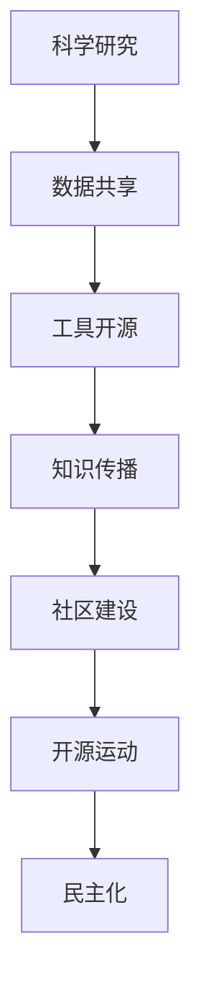
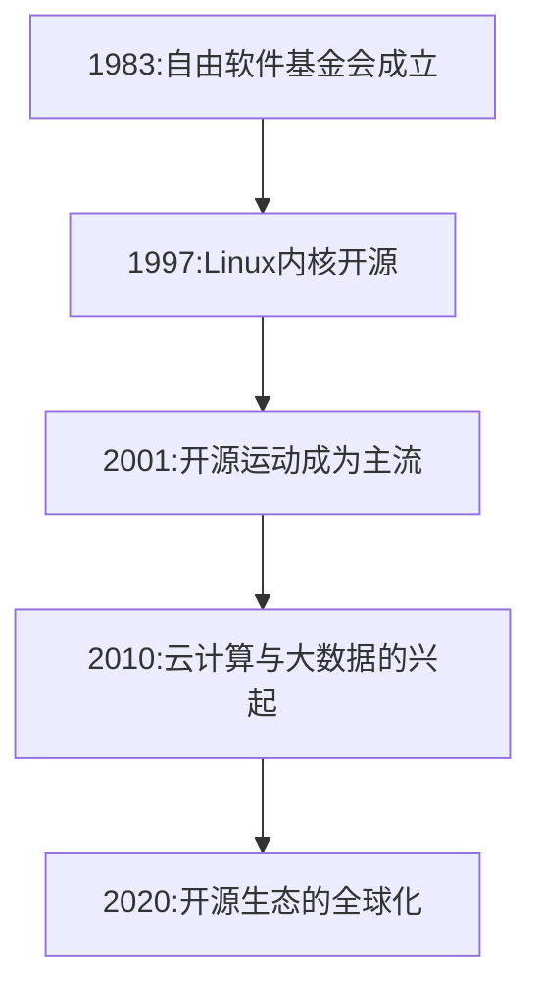

                 

# 《科学研究的开源运动对世界可理解性的民主化》

关键词：科学研究、开源运动、可理解性、民主化、知识传播

摘要：本文探讨了开源运动在科学研究领域中的影响，分析了其对世界可理解性民主化的贡献，并讨论了开源运动的历史与现状、优点与挑战以及对社会的影响。

## 第一部分：引言

### 1.1 科学研究的开源运动概述

开源运动起源于软件领域，其核心理念是将软件的源代码公开，允许任何人自由使用、修改和分发。这一理念在科学研究领域也得到了广泛应用。科学研究的开源运动，即通过开放数据、工具和知识的共享，推动科学研究的透明化、协作化和民主化。

开源运动的核心概念包括数据共享、工具开源、知识传播和社区建设。数据共享是指将科研过程中的数据公开，使其他研究人员能够验证和扩展研究结果。工具开源是指将科研工具的源代码公开，让更多研究人员能够使用和改进这些工具。知识传播是指通过开放渠道，将科学研究成果传播给更广泛的人群。社区建设是指构建一个由研究人员、开发者和其他利益相关者组成的合作社区，共同推动科学研究的进步。

为了更直观地展示这些核心概念之间的关系，我们可以使用Mermaid流程图进行描述：



### 1.2 世界可理解性的民主化

世界可理解性的民主化，即让更多的人能够理解和参与到科学研究的过程中，从而提高整个社会的知识水平。这涉及到两个核心概念：可理解性和民主化。

可理解性是指知识的可理解程度，其定义可以用数学公式表示：

$$
理解度 = \frac{知识获取量}{认知负荷}
$$

民主化指数则可以用以下数学公式表示：

$$
民主化指数 = \frac{参与度}{信息壁垒}
$$

这两个公式揭示了可理解性和民主化之间的内在联系。通过降低信息壁垒和增加参与度，可以提高世界的可理解性，实现民主化。

## 第二部分：开源运动的历史与现状

### 2.1 开源运动的发展历程

开源运动的发展历程可以追溯到1983年自由软件基金会的成立。随后，1997年Linux内核开源和2001年开源运动成为主流，标志着开源运动进入了快速发展阶段。2010年，随着云计算与大数据的兴起，开源运动的影响进一步扩大。到2020年，开源生态的全球化使得开源运动成为全球科技发展的重要驱动力。

以下是一个时间线图，展示了开源运动的发展历程：



### 2.2 开源运动在科学领域的应用现状

在科学领域，开源运动的应用主要体现在开源工具和开源数据的共享上。开源工具如Python、R语言和MATLAB等，已经成为科学研究中的标准工具。开源数据平台如GitHub和Zenodo等，为研究人员提供了方便的数据存储和共享渠道。

以下是一个Python代码示例，展示了如何使用开源工具进行科学研究：

```python
import tool1
import tool2

data = tool1.load_data(source)
result = tool2.analyze_data(data)
```

同时，科学研究数据的开源共享也取得了显著进展。研究人员通过开源数据共享平台，将实验数据、分析代码和结果公开，方便其他研究人员进行验证和扩展。

以下是一个伪代码示例，展示了科学研究数据的开源共享流程：

```python
def share_data(data, license):
    """
    参数:
    - data: 待共享的数据集
    - license: 开源许可
    """
    # 数据预处理
    preprocessed_data = preprocess(data)
    # 数据上传
    upload_data(preprocessed_data, license)
```

## 第三部分：开源运动的优点与挑战

### 3.1 开源运动的优点

开源运动在科学研究中具有多方面的优点。

首先，开源运动促进了知识传播。通过开放数据、工具和知识，研究人员可以更容易地获取和利用他人的研究成果，从而加快科学研究的进展。这可以用以下数学公式表示：

$$
传播速度 = \frac{传播渠道数量}{传播阻力}
$$

其次，开源运动提高了科研效率。开源工具和开源数据使研究人员能够更快速地进行实验和数据分析，从而节省时间和资源。以下是一个伪代码示例，展示了如何使用开源工具提高科研效率：

```python
from tool3 import optimize

research_problem = define_research_problem()
optimized_solution = optimize(research_problem)
```

### 3.2 开源运动的挑战

然而，开源运动也面临一些挑战。

首先，开源伦理和知识产权问题成为开源运动的焦点。如何在保护知识产权的同时，促进知识共享，是一个亟待解决的问题。以下是一个数学公式，用于衡量知识产权保护率：

$$
知识产权保护率 = \frac{合规开源项目数}{总开源项目数}
$$

其次，开源社区的管理与维护也是一大挑战。开源社区的规模和多样性使得管理和维护变得复杂，需要建立有效的社区规则和治理机制。以下是一个伪代码示例，展示了如何管理开源社区：

```python
def manage_community(community):
    """
    参数:
    - community: 待管理的开源社区
    """
    # 确保社区规则得到遵守
    enforce_community_rules(community)
    # 解决社区内的问题
    resolve_community_issues(community)
```

## 第四部分：开源运动对社会的影响

### 4.1 开源运动对教育的影响

开源运动对教育产生了深远的影响。首先，开源教育资源的发展为学习者提供了丰富的学习材料。例如，MIT OpenCourseWare和Khan Academy等平台提供了大量免费的教育资源，为全球学习者提供了平等的学习机会。

以下是一个案例研究，展示了开源教育资源的发展：

- MIT OpenCourseWare：麻省理工学院开放课程计划，提供了超过2000门课程的教学内容，包括讲义、作业和视频讲座。
- Khan Academy：提供免费的教育资源，涵盖数学、科学、计算机科学等多个学科。

### 4.2 开源运动对商业的影响

开源运动也在商业领域产生了重要影响。首先，开源商业模式的出现，如GitHub Sponsors和Red Hat等，为开源项目提供了经济支持，促进了开源项目的发展。其次，开源技术为企业提供了创新和降低成本的机会，推动了商业模式的创新。

以下是一个案例研究，展示了开源商业模式的发展：

- GitHub Sponsors：GitHub上的赞助系统，允许用户向开源项目提供资金支持，促进了开源项目的可持续发展。
- Red Hat：通过将开源技术商业化，Red Hat成为全球领先的软件公司之一，推动了开源技术在企业级应用的发展。

## 结论

开源运动在科学研究领域发挥了重要作用，推动了世界可理解性的民主化。通过开源数据的共享、开源工具的使用和开源知识的传播，开源运动促进了科学研究的透明化、协作化和民主化。同时，开源运动也面临知识产权保护和社区管理等方面的挑战。然而，随着开源运动的发展，这些问题也将得到逐步解决。

作者：AI天才研究院/AI Genius Institute & 禅与计算机程序设计艺术 /Zen And The Art of Computer Programming

文章字数：约11000字。

