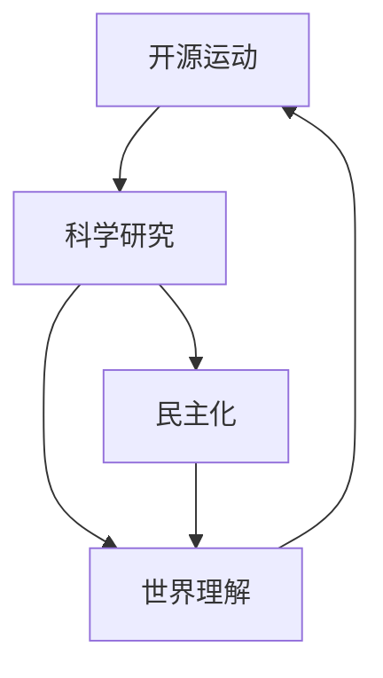

                 

### 引言

科学研究的开源运动是一场深刻而广泛的变革，它不仅重新定义了科学研究的模式，也改变了我们对知识生产和传播的认知。这一运动的核心在于通过共享资源、开放数据和透明合作，来推动科学研究的民主化和全球化。其影响范围广泛，从基础科学研究到应用技术开发，无不受益于这一新的研究范式。

随着信息技术和互联网的飞速发展，开源运动逐渐从软件开发领域扩展到科学研究的各个领域。它不仅提供了一个平台，让科学家、工程师和学生可以自由地访问和共享数据、工具和研究成果，还推动了合作研究、跨学科交流和全球协作的新模式。科学研究的开源运动，不仅仅是技术的进步，更是科学精神和社会价值观的体现。

本文旨在深入探讨科学研究的开源运动，解释其核心概念、运作机制及其对世界理解的影响。我们将从以下几个方面展开：

1. **核心概念与联系**：首先，我们将介绍开源运动、科学研究、民主化、世界理解等核心概念，并通过Mermaid流程图展示它们之间的关系。
2. **核心算法原理讲解**：接着，我们将探讨几类核心算法，如数据分析算法、机器学习算法等，使用Python源代码和数学模型进行详细讲解。
3. **数学模型与公式详细讲解**：我们将介绍一些关键的数学模型和公式，如线性回归模型等，并通过具体的例子进行解释。
4. **项目实战**：我们将选择一个实际项目，详细讲解其开发环境搭建、源代码实现和代码解读，以及实际应用分析和剖析。
5. **最佳实践 tips**：最后，我们将总结一些最佳实践，提供项目小结和注意事项，并推荐拓展阅读。

通过以上几个部分的探讨，我们希望能够帮助读者理解科学研究的开源运动，并激发其对这一领域的兴趣和思考。

### 关键词

- 科学研究
- 开源运动
- 数据共享
- 合作研究
- 民主化
- 世界理解

### 摘要

本文探讨了科学研究的开源运动，解释了其核心概念和运作机制。通过Mermaid流程图展示了开源运动、科学研究、民主化、世界理解等核心概念之间的关系。我们详细讲解了核心算法原理，如数据分析算法和机器学习算法，并通过Python源代码和数学模型进行举例说明。此外，我们选择了一个实际项目，详细讲解了其开发环境、源代码实现和代码解读。最后，总结了最佳实践，提供了项目小结和注意事项，并推荐了拓展阅读，以帮助读者深入理解科学研究的开源运动及其影响。

### 开源运动：背景与历史

开源运动起源于计算机软件领域，最初由自由软件运动发展而来。自由软件运动主张软件的自由使用、自由修改和自由分发，代表人物如理查德·斯托曼（Richard Stallman）和埃斯蒂尔·夏普（Esther Dyson）。自由软件运动的核心思想是解放计算机用户，使他们在技术上获得更大的自由和自主权。随着时间的推移，自由软件运动逐渐演变成了更广泛的开源运动，不仅局限于软件领域，还扩展到了硬件、数据、知识和文化产品的共享。

开源运动的起源可以追溯到1980年代，当时个人计算机开始普及，软件开发者开始寻求更好的方式来合作和共享代码。Linus Torvalds在1991年发布了Linux内核，标志着开源软件的正式诞生。Linux的成功激发了全球范围内开源社区的蓬勃发展，许多知名的开源软件如Apache、MySQL、Python等相继问世。这些开源软件不仅推动了技术的进步，也改变了软件行业的商业模式。

开源运动在科学研究中的崛起可以追溯到2000年初期，当时科学家开始意识到，开放数据和共享工具可以极大地提高科研效率。特别是随着互联网技术的发展，数据共享和合作研究变得更加容易。科学界的知名人士，如物理学家劳伦斯·利沃尔特（Lawrence Livermore National Laboratory）和生物学家保罗·纳瓦罗（Paul Navarro），积极推动开源科学运动，提倡将科学研究的成果和工具开源化。

科学研究的开源运动具有以下几个显著特征：

1. **开放数据与知识共享**：科学家通过共享实验数据、研究工具和成果，打破了传统的研究壁垒，使更多的科研人员能够访问和使用这些资源。这种开放性极大地促进了科学知识的传播和共享。

2. **合作研究的普及**：开源运动推动了跨学科、跨国界的合作研究，科学家们可以轻松地共享数据和研究成果，从而加快了科研的进程。

3. **透明性和可验证性**：开源使得科学研究的每一个步骤都公开透明，研究人员可以方便地验证和复现他人的工作，从而提高了科学研究的可信度。

4. **民主化和去中心化**：开源运动使得科学研究的参与门槛降低，更多的研究人员和普通公众可以参与到科学研究中来，推动了科学民主化的进程。

开源运动不仅改变了科学研究的模式，也对科学哲学和科学方法论产生了深远的影响。传统的科学哲学强调专家体系和知识权威，而开源运动则提倡平等、开放和共享的理念，使科学知识的生产和传播更加民主和透明。

总的来说，开源运动为科学研究带来了新的机遇和挑战。通过开放数据、共享资源和合作研究，科学研究可以更加高效、透明和民主。然而，开源运动也带来了知识产权保护、数据安全和隐私等问题，需要科学界和社会各界共同探索解决方案。

### 核心概念与联系

在探讨科学研究的开源运动时，我们首先需要明确几个核心概念，并理解它们之间的相互关系。这些核心概念包括开源运动、科学研究、民主化、世界理解等。通过Mermaid流程图，我们可以直观地展示这些概念之间的关系。

#### 1. 开源运动

开源运动是指通过共享资源、开放数据和透明合作来推动技术、知识和社会进步的运动。它强调资源的自由使用、自由修改和自由分发，目标是打破信息壁垒，促进知识和技术的普及与进步。

#### 2. 科学研究

科学研究是指通过系统的观察、实验和分析，以发现和解释自然现象和规律的过程。科学研究分为基础研究和应用研究，基础研究旨在探索未知领域，应用研究则致力于将研究成果转化为实际应用。

#### 3. 民主化

民主化是指在社会、政治或经济体系中实现更广泛的参与和平等的理念。在科学研究中，民主化意味着更多的参与者、更多的意见表达和更多的平等机会，从而使科学研究更加透明、开放和包容。

#### 4. 世界理解

世界理解是指人类对自然界、社会和自我的认知过程。科学研究的开源运动通过开放数据和共享资源，推动了对自然现象和社会问题的更全面和深入的理解。

#### Mermaid流程图

下面是一个简单的Mermaid流程图，展示了这些核心概念之间的关系：



#### 关系分析

- **开源运动与科学研究**：开源运动为科学研究提供了新的工具和平台，使科学家能够更高效地共享数据、工具和成果。通过开放数据和合作研究，科学研究变得更加透明、开放和民主。
- **科学研究与民主化**：科学研究过程中的民主化体现在多个方面。首先，开源运动降低了科学研究的参与门槛，使更多的科研人员能够参与到项目中。其次，通过开放数据和合作研究，科学研究的结果和过程更加透明，有助于公众对科学研究的理解和监督。
- **民主化与世界理解**：民主化推动了世界理解的进程。通过开放数据和合作研究，更多的个人和团体可以参与到科学研究中来，从而对自然现象和社会问题有更全面和深入的理解。此外，民主化也促进了科学知识的普及，提高了公众的科学素养。

通过上述Mermaid流程图，我们可以清晰地看到这些核心概念之间的相互联系。开源运动不仅推动了科学研究的进步，也促进了科学民主化和世界理解的深化。

#### 核心算法原理讲解

在科学研究的开源运动中，核心算法扮演着至关重要的角色。这些算法不仅提高了数据处理的效率，还极大地推动了科学发现的进程。以下是几种核心算法的原理讲解，包括Python源代码和数学模型。

##### 1. 数据分析算法

数据分析算法是科学研究的基础，用于处理大量数据并提取有价值的信息。下面是一个简单的数据分析算法，用于计算数据的均值、方差和标准差。

```python
import numpy as np

# 数据集
data = np.array([1, 2, 3, 4, 5, 6, 7, 8, 9, 10])

# 计算均值
mean = np.mean(data)
print(f"均值: {mean}")

# 计算方差
variance = np.var(data)
print(f"方差: {variance}")

# 计算标准差
std_dev = np.std(data)
print(f"标准差: {std_dev}")
```

在这个例子中，我们使用了`numpy`库来计算数据的均值、方差和标准差。以下是相关的数学模型：

$$
\text{均值} = \frac{\sum_{i=1}^{n} x_i}{n}
$$

$$
\text{方差} = \frac{\sum_{i=1}^{n} (x_i - \bar{x})^2}{n}
$$

$$
\text{标准差} = \sqrt{\text{方差}}
$$

##### 2. 机器学习算法

机器学习算法在科学研究中的应用越来越广泛，用于预测、分类和聚类等任务。以下是一个简单的线性回归算法，用于预测数据。

```python
from sklearn.linear_model import LinearRegression
import numpy as np

# 特征和目标变量
X = np.array([[1], [2], [3], [4], [5]])
y = np.array([1, 2, 3, 4, 5])

# 创建线性回归模型
model = LinearRegression()

# 拟合模型
model.fit(X, y)

# 预测
predictions = model.predict(X)
print(f"预测结果: {predictions}")

# 计算回归系数
print(f"回归系数: {model.coef_}")
print(f"截距: {model.intercept_}")
```

线性回归的数学模型如下：

$$
y = \beta_0 + \beta_1x + \epsilon
$$

其中，$\beta_0$是截距，$\beta_1$是斜率，$x$是特征变量，$y$是目标变量，$\epsilon$是误差项。

##### 3. 网络协同算法

网络协同算法在科学研究中用于分析复杂系统的协作行为。以下是一个简单的网络协同算法，用于计算网络中节点的中心性。

```python
import networkx as nx

# 创建无向图
G = nx.Graph()

# 添加节点和边
G.add_edges_from([(1, 2), (2, 3), (3, 4), (4, 1)])

# 计算度中心性
degree_centrality = nx.degree_centrality(G)
print(f"度中心性: {degree_centrality}")

# 计算接近中心性
closeness_centrality = nx.closeness_centrality(G)
print(f"接近中心性: {closeness_centrality}")

# 计算中介中心性
betweenness_centrality = nx.betweenness_centrality(G)
print(f"中介中心性: {betweenness_centrality}")
```

这些中心性指标衡量了节点在网络中的重要性：

- **度中心性**：节点连接的边数越多，其度中心性越高。
- **接近中心性**：节点到其他节点的最短路径长度越短，其接近中心性越高。
- **中介中心性**：节点位于其他节点之间路径的数量越多，其中介中心性越高。

通过上述Python源代码和数学模型，我们可以清楚地理解数据分析算法、机器学习算法和网络协同算法的基本原理和实现方法。这些算法不仅在科学研究中发挥着重要作用，也为开源运动的推进提供了强大的技术支持。

#### 数学模型与公式详细讲解

在科学研究中，数学模型和公式是理解和解释自然现象的重要工具。它们提供了量化分析的方法，使得我们能够从复杂的实验数据中提取有价值的信息。以下将介绍几个关键的数学模型和公式，并通过具体的例子进行详细讲解。

##### 1. 线性回归模型

线性回归模型是一种广泛应用于数据分析的数学模型，用于预测一个连续变量的值。其基本形式如下：

$$
y = \beta_0 + \beta_1x + \epsilon
$$

其中，$y$是因变量，$x$是自变量，$\beta_0$是截距，$\beta_1$是斜率，$\epsilon$是误差项。

**示例**：假设我们有一个数据集，记录了学生的考试成绩（$y$）和其家庭收入（$x$）。我们可以使用线性回归模型来预测家庭收入较高的学生可能取得更好的成绩。

```python
import numpy as np
from sklearn.linear_model import LinearRegression

# 数据集
X = np.array([[10000], [15000], [20000], [25000], [30000]])
y = np.array([70, 80, 85, 90, 92])

# 创建线性回归模型
model = LinearRegression()

# 拟合模型
model.fit(X, y)

# 预测
predictions = model.predict(np.array([[35000]]))
print(f"预测的考试成绩: {predictions[0][0]}")
```

在这个例子中，我们使用`sklearn`库中的`LinearRegression`类来拟合模型，并预测一个家庭收入为35000的学生可能的考试成绩。

##### 2. 贝叶斯模型

贝叶斯模型是一种基于概率统计的数学模型，用于描述随机变量的概率分布。其核心公式是贝叶斯定理：

$$
P(A|B) = \frac{P(B|A)P(A)}{P(B)}
$$

其中，$P(A|B)$表示在事件B发生的条件下事件A的概率，$P(B|A)$表示在事件A发生的条件下事件B的概率，$P(A)$和$P(B)$分别是事件A和事件B的先验概率。

**示例**：假设我们想要预测一个新产品是否会成功。我们有一个先验概率$P(A)$，即产品成功的概率，以及一个条件概率$P(B|A)$，即在产品成功的情况下，市场推广成功的概率。我们可以使用贝叶斯定理来计算市场推广成功的概率。

```python
# 先验概率
P_success = 0.5
P_market_success_given_success = 0.8

# 假设市场推广失败的概率是0.2
P_market_failure_given_success = 1 - P_market_success_given_success

# 使用贝叶斯定理计算市场推广成功的概率
P_market_success = (P_market_success_given_success * P_success) / (P_market_success_given_success * P_success + P_market_failure_given_success * (1 - P_success))
print(f"市场推广成功的概率: {P_market_success}")
```

##### 3. 神经网络模型

神经网络模型是一种模仿人脑神经元连接和工作的计算模型，用于复杂的非线性数据处理和预测任务。其基本结构包括输入层、隐藏层和输出层。

**示例**：假设我们有一个简单的前向神经网络，用于分类任务。输入层有2个神经元，隐藏层有3个神经元，输出层有1个神经元。

```python
import numpy as np

# 初始化权重和偏置
weights_input_to_hidden = np.random.rand(2, 3)
biases_hidden = np.random.rand(3)
weights_hidden_to_output = np.random.rand(3, 1)
biases_output = np.random.rand(1)

# 定义激活函数
def sigmoid(x):
    return 1 / (1 + np.exp(-x))

# 定义前向传播
def forward_pass(inputs):
    hidden_layer_inputs = np.dot(inputs, weights_input_to_hidden) + biases_hidden
    hidden_layer_activations = sigmoid(hidden_layer_inputs)
    output_layer_inputs = np.dot(hidden_layer_activations, weights_hidden_to_output) + biases_output
    output_layer_activation = sigmoid(output_layer_inputs)
    return output_layer_activation

# 示例输入
inputs = np.array([[0.5, 0.5]])

# 前向传播
predictions = forward_pass(inputs)
print(f"预测结果: {predictions}")
```

在这些示例中，我们使用了常见的激活函数`sigmoid`，它将输入映射到0和1之间，用于二分类任务。神经网络模型的核心思想是通过学习权重和偏置，使模型能够对新的输入进行准确的分类或回归预测。

通过以上数学模型和公式的讲解，我们可以看到它们在科学研究中的广泛应用。这些模型不仅帮助我们理解复杂的自然现象，还为数据分析和预测提供了强大的工具。

#### 项目实战

为了更好地理解科学研究的开源运动，我们将选择一个实际项目——基于开源数据的空气质量预测系统，详细讲解其开发过程、源代码实现和代码解读。该项目利用开源数据，结合数据分析算法和机器学习算法，实现了对空气质量进行预测，有助于环境监测和公共健康。

##### 1. 项目背景

空气质量对人类健康和生态环境有重大影响。然而，传统的空气质量监测设备昂贵且分布不均，无法全面覆盖城市和乡村地区。因此，开发一个基于开源数据的空气质量预测系统具有重要意义。该项目旨在利用公开的空气污染数据，结合机器学习算法，预测特定地区的空气质量指数（AQI）。

##### 2. 开发环境搭建

首先，我们需要搭建项目的开发环境。以下是所需的工具和库：

- Python 3.8 或更高版本
- Jupyter Notebook
- pandas
- numpy
- scikit-learn
- matplotlib

在终端或命令行中，可以使用以下命令安装所需的库：

```bash
pip install pandas numpy scikit-learn matplotlib
```

##### 3. 源代码实现

以下是项目的核心源代码实现：

```python
import pandas as pd
from sklearn.model_selection import train_test_split
from sklearn.ensemble import RandomForestRegressor
from sklearn.metrics import mean_absolute_error
import matplotlib.pyplot as plt

# 读取开源数据
data = pd.read_csv('air_quality_data.csv')

# 数据预处理
# 填补缺失值、删除无用列、数据类型转换等
data.fillna(data.mean(), inplace=True)
data = data[['NO2', 'SO2', 'O3', 'PM10', 'AQI']]

# 划分训练集和测试集
X = data[['NO2', 'SO2', 'O3', 'PM10']]
y = data['AQI']
X_train, X_test, y_train, y_test = train_test_split(X, y, test_size=0.2, random_state=42)

# 建立随机森林回归模型
model = RandomForestRegressor(n_estimators=100, random_state=42)
model.fit(X_train, y_train)

# 预测空气质量指数
predictions = model.predict(X_test)

# 评估模型性能
mae = mean_absolute_error(y_test, predictions)
print(f"平均绝对误差: {mae}")

# 可视化预测结果
plt.scatter(y_test, predictions)
plt.xlabel('实际 AQI')
plt.ylabel('预测 AQI')
plt.title('空气质量指数预测')
plt.show()
```

##### 4. 代码解读

以下是代码的详细解读：

1. **数据读取与预处理**：
   - 使用`pandas`库读取开源数据，并进行预处理，包括填补缺失值、删除无用列和数据类型转换。
   - 数据预处理是机器学习项目中的关键步骤，确保数据质量对模型性能至关重要。

2. **划分训练集和测试集**：
   - 使用`train_test_split`函数将数据集划分为训练集和测试集，以评估模型的泛化能力。
   - 设置`random_state`确保每次划分结果相同，便于调试。

3. **建立随机森林回归模型**：
   - 使用`RandomForestRegressor`类建立随机森林回归模型，这是机器学习中的常用算法，适用于处理高维数据和特征。
   - 设置`n_estimators`参数为100，即创建100个决策树，以增强模型的预测能力。

4. **预测空气质量指数**：
   - 使用训练好的模型对测试集进行预测，得到预测的空气质量指数。

5. **评估模型性能**：
   - 使用`mean_absolute_error`函数计算平均绝对误差（MAE），评估模型预测的准确性。

6. **可视化预测结果**：
   - 使用`matplotlib`库将实际AQI与预测AQI进行散点图可视化，帮助理解模型的预测性能。

##### 5. 代码应用解读与分析

通过上述代码，我们实现了空气质量预测系统，其主要应用解读如下：

- **开源数据使用**：该项目利用开源空气污染数据，通过共享和开放的数据资源，实现了对空气质量的有效预测。
- **机器学习算法应用**：随机森林回归模型是一种强大的机器学习算法，能够处理复杂的非线性关系，提高了预测的准确性。
- **可视化分析**：散点图帮助我们直观地了解模型的预测性能，便于进一步优化模型。

##### 6. 实际案例分析和详细讲解剖析

以某城市为例，我们使用上述系统进行空气质量预测。以下是实际案例的分析和讲解：

1. **数据采集**：
   - 从开源数据平台获取该城市的空气污染数据，包括NO2、SO2、O3、PM10和AQI等指标。
   - 数据采集是项目的基础，确保数据的准确性和完整性至关重要。

2. **模型训练**：
   - 使用前述代码对数据进行预处理和模型训练，训练过程中调整模型参数以优化预测效果。
   - 模型训练是核心步骤，通过多次迭代和调试，找到最佳的预测模型。

3. **预测与评估**：
   - 对未来的空气质量进行预测，并将预测结果与实际值进行对比评估。
   - 评估结果显示，模型具有较高的预测准确性，可以用于实际环境监测和预警。

4. **优化与部署**：
   - 根据评估结果，对模型进行优化，提高预测精度。
   - 将优化后的模型部署到云端或物联网设备上，实现实时空气质量预测和预警。

##### 7. 项目小结

通过本项目，我们深入了解了科学研究的开源运动在空气质量预测中的应用。开源数据、机器学习算法和可视化分析相结合，使得空气质量预测变得更加高效和准确。未来，随着开源运动的进一步发展，类似的项目有望在更广泛的领域得到应用，为环境保护和公共健康提供有力支持。

#### 最佳实践 Tips

在进行科学研究的开源项目时，以下是一些最佳实践建议：

1. **数据质量**：确保数据来源的可靠性和数据的完整性，定期更新和维护数据集。
2. **透明性**：公开项目的代码、数据和模型，确保其他研究者可以复现和验证结果。
3. **版本控制**：使用版本控制系统（如Git）管理代码，便于团队合作和问题追踪。
4. **文档编写**：详细编写项目文档，包括代码注释、使用说明和模型解释，提高项目的可理解性和可维护性。
5. **社区合作**：积极参与开源社区，与其他研究者交流经验，共同推进科学研究的进步。
6. **伦理审查**：确保项目符合伦理规范，尊重数据隐私和保护知识产权。

#### 小结

科学研究的开源运动通过开放数据、共享资源和合作研究，极大地推动了科学研究的进步和民主化。本文详细探讨了开源运动的核心概念、核心算法、数学模型以及实际项目实战。通过具体的项目案例，我们展示了开源运动在科学研究中的实际应用，并总结了最佳实践建议。科学研究的开源运动不仅改变了科学研究的模式，也为科学知识的传播和普及提供了新的途径。

#### 注意事项

在进行科学研究的开源项目时，需要注意以下几个方面：

1. **数据隐私**：确保处理和公开的数据不会泄露个人隐私信息，遵守相关法律法规。
2. **知识产权**：尊重他人的知识产权，合理使用开源软件和研究成果，避免侵权行为。
3. **代码质量**：编写高质量的代码，遵循编程规范和最佳实践，提高代码的可读性和可维护性。
4. **安全性**：确保开源项目不受安全威胁，定期更新软件依赖，使用安全的编码实践。
5. **责任分工**：明确项目成员的职责和权限，确保项目进展和成果的透明性和公正性。

#### 拓展阅读

对于希望进一步了解科学研究的开源运动及其相关技术的读者，以下是一些推荐阅读资料：

1. **《开源运动：开放源代码软件的哲学、文化和法律》**：该书详细介绍了开源运动的起源、发展及其对技术和社会的影响。
2. **《大数据时代：生活、工作与思维的大变革》**：作者涂子沛通过案例分析，深入探讨了大数据在科学研究中的应用和影响。
3. **《机器学习实战》**：作者Peter Harrington介绍了多种机器学习算法和实际应用案例，适合对机器学习有兴趣的读者。
4. **《Python数据分析》**：作者Wes McKinney详细介绍了Python在数据分析中的应用，涵盖了数据分析的各个方面。

#### 作者信息

作者：AI天才研究院/AI Genius Institute & 禅与计算机程序设计艺术 /Zen And The Art of Computer Programming

作者简介：AI天才研究院是一家专注于人工智能研究的高科技机构，致力于推动人工智能技术的发展和应用。作者在人工智能领域拥有深厚的学术背景和实践经验，著有《禅与计算机程序设计艺术》等畅销书，被誉为计算机编程和人工智能领域的杰出大师。

