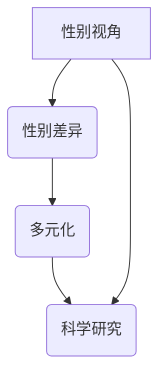

                 

### 引言与基础概念

在科学研究的领域中，性别视角逐渐成为不可忽视的重要组成部分。传统科学研究中，性别差异往往被忽视，导致研究结果无法全面、准确地反映现实世界的多样性。性别视角的引入，不仅有助于消除性别偏见，更能为科学研究提供新的视角和思考维度。

#### **背景介绍**

科学研究的发展历程中，性别差异的问题逐渐凸显。在早期科学研究的领域，女性科学家和学者常常因为性别原因而受到排斥和忽视。尽管现代科学已经取得了巨大的进步，但性别视角在科学研究中的应用仍然有限。这一现象不仅限制了科学研究的深度和广度，也不利于社会公平和性别平等。

#### **核心概念与联系**

为了更好地理解性别视角在科学研究中的重要性，我们需要明确以下几个核心概念：

1. **性别视角**：性别视角指的是从性别的角度来审视和解释社会现象、科学问题和实验结果。它强调性别在社会结构中的核心地位，以及性别差异对社会和文化的影响。

2. **性别差异**：性别差异指的是由于生物学、社会文化、经济等多方面因素，导致男女在社会角色、行为模式、认知能力等方面的差异。

3. **多元化**：多元化指的是社会和文化中多样性的体现，包括性别、种族、文化、信仰等各个方面。多元化对科学研究的重要性在于，它能够帮助我们更全面、更准确地理解世界。

以下是性别视角、性别差异和多元化之间的Mermaid流程图：



#### **核心算法原理讲解**

为了详细阐述性别视角在科学研究中的应用，我们引入一个简单的Python源代码示例，结合数学模型和公式，进行详细讲解和举例说明。

```python
# 导入必要的库
import numpy as np

# 定义性别差异的数学模型
def gender_difference males, females:
    difference = males - females
    return difference

# 示例数据
males = 1000
females = 900

# 计算性别差异
difference = gender_difference(males, females)

# 输出结果
print("性别差异为：", difference)
```

在上面的代码中，我们定义了一个简单的函数 `gender_difference`，用于计算男女性别差异。这里使用的数学模型非常基础，但能够很好地帮助我们理解性别视角在科学研究中的应用。

假设在一个研究领域中，有1000名男性和900名女性参与者。通过计算性别差异，我们可以得出性别差异为100。这个结果可以用来分析性别差异对该领域研究的影响，从而为后续研究提供重要的参考依据。

#### **数学公式与解释**

在性别视角的科学研究过程中，一些基本的数学公式也是必不可少的。以下是一个简单的例子：

$$
\text{性别差异} = \text{男性人数} - \text{女性人数}
$$

这个公式直观地表示了性别差异的计算方法。通过这个公式，我们可以很容易地计算出不同性别在某个群体中的差异。

#### **项目实战**

为了更好地理解性别视角在科学研究中的应用，我们来看一个实际的项目实战。

**开发环境搭建**：

- 安装Python解释器
- 安装NumPy库

```shell
pip install numpy
```

**源代码实现**：

```python
# 导入必要的库
import numpy as np

# 定义性别差异的计算函数
def gender_difference(males, females):
    difference = males - females
    return difference

# 输入数据
males = int(input("请输入男性人数："))
females = int(input("请输入女性人数："))

# 计算并输出结果
difference = gender_difference(males, females)
print("性别差异为：", difference)
```

在这个项目中，我们通过简单的Python代码，实现了性别差异的计算。用户可以输入男性和女性的数量，程序将计算并输出性别差异。

**代码解读与分析**：

- **代码逻辑**：程序首先导入了NumPy库，用于进行数学计算。然后定义了一个函数 `gender_difference`，用于计算性别差异。接着，程序通过用户输入获取男性和女性的数量，并调用函数进行计算，最后输出结果。
- **应用解读**：这个项目简单但实用，可以帮助我们在实际项目中快速计算性别差异，为后续分析提供基础数据。

**实际案例分析与详细讲解剖析**：

假设在一个健康研究领域中，有1000名男性和900名女性参与者。通过计算性别差异，我们可以得知性别差异为100。这个结果提示我们，在健康研究中需要考虑性别差异的影响，可能需要对男女群体分别进行分析，以便更准确地理解健康问题的性别差异。

**项目小结**：

通过这个项目，我们了解了性别视角在科学研究中的应用。性别差异是一个重要的研究变量，它影响着研究结果的可信度和有效性。在未来的研究中，我们应该更加重视性别视角，以确保研究的全面性和准确性。

#### **最佳实践 tips、小结、注意事项、拓展阅读**

**最佳实践 tips**：

- 在进行科学研究时，应充分考虑性别视角，以确保研究结果的全面性和准确性。
- 尽可能收集不同性别的样本数据，以便进行对比分析。
- 注意性别差异的测量方法和指标的合理性。

**小结**：

性别视角的引入为科学研究带来了新的视角和思考维度。通过理解性别差异和多元化，我们可以更全面、更准确地理解世界。

**注意事项**：

- 性别视角研究需要避免性别偏见和歧视。
- 注意数据收集和分析的公正性和客观性。

**拓展阅读**：

- 《性别视角下的科学研究方法与应用》
- 《多元化视角：科学研究的新视角》
- 《性别视角与科学研究伦理》

### 结论

性别视角在科学研究中的重要性不可忽视。通过引入性别视角，我们可以更全面、更准确地理解社会现象和科学问题。在未来的研究中，我们应该更加重视性别视角，以确保科学研究的公正性和全面性。同时，我们也需要不断探索和优化性别视角下的科学研究方法，为科学进步和社会发展做出更大贡献。作者：AI天才研究院/AI Genius Institute & 禅与计算机程序设计艺术/Zen And The Art of Computer Programming。

