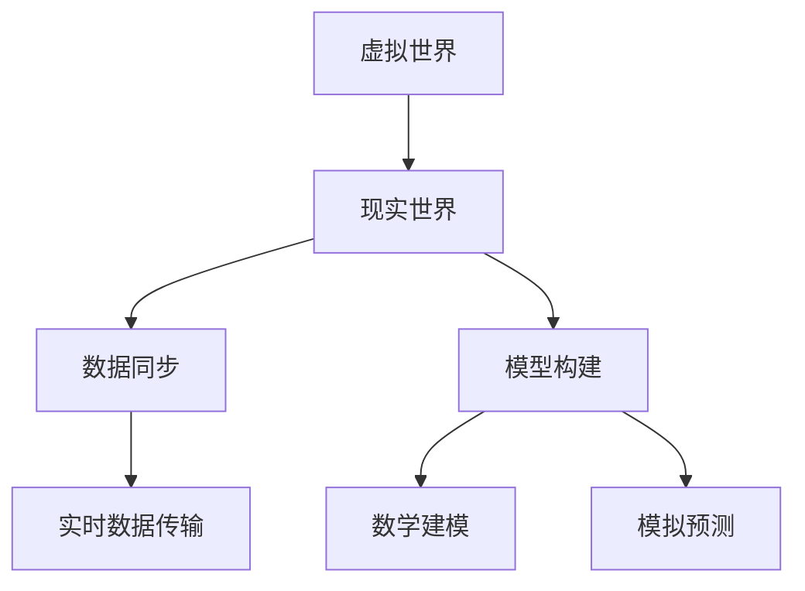

                 

### 引言

数字孪生技术（Digital Twin Technology）作为一项前沿的数字化技术，近年来在多个领域得到了广泛关注。数字孪生技术的核心思想是将现实世界中的物理实体通过虚拟模型进行数字化复制，构建一个与物理实体高度相似的虚拟世界。通过实时同步物理实体和虚拟世界之间的数据，数字孪生技术实现了对物理实体的实时监测、分析和优化。

在科学研究领域，数字孪生技术正逐渐成为一种重要的工具。它不仅能够帮助科学家们更好地理解复杂的物理现象，还能够大幅提高实验的效率和准确性。通过虚拟世界的建模和模拟，科学家可以在虚拟环境中进行实验，预测现实世界中可能发生的现象，从而避免在真实世界中进行高风险实验。

本文将详细探讨数字孪生技术在科学研究中的应用，从基础概念、技术原理、应用场景、案例研究到未来展望，逐步解析这一技术如何改变科学研究的范式。

关键词：数字孪生技术、虚拟世界、现实世界、科学研究、数据同步、模型构建、模拟预测、应用案例

摘要：本文首先介绍了数字孪生技术的基本概念和发展背景，然后深入分析了其在科学研究中的应用原理和技术细节。通过具体案例展示了数字孪生技术在物理科学、生物医学、环境科学和社会科学等领域的实际应用，最后探讨了数字孪生技术的发展趋势和未来前景。

### 数字孪生技术的核心概念

要深入理解数字孪生技术，我们首先需要明确几个核心概念：虚拟世界、现实世界、数据同步和模型构建。

**虚拟世界**：虚拟世界是指通过计算机模拟技术构建的，与现实世界相对应的数字环境。在虚拟世界中，各种物理实体（如机械装置、生物系统、建筑物等）都可以通过数字模型进行表示。这些数字模型不仅能够再现现实世界中的物理特性，还能够模拟和预测物理实体的行为。

**现实世界**：现实世界是我们生活和工作的实际环境，包含了各种物理实体和自然现象。科学研究通常是在现实世界中进行，通过对物理现象的观察、测量和分析来获得知识和理解。

**数据同步**：数据同步是数字孪生技术的关键环节，指的是将现实世界中的物理实体数据实时传输到虚拟世界中的过程。数据同步需要精确地反映现实世界中的变化，以确保虚拟世界与物理实体的一致性。

**模型构建**：模型构建是将现实世界中的物理现象转化为虚拟世界中的数字模型的过程。这涉及到对物理现象的精确描述和数学建模，以实现虚拟世界中的模拟和预测。

**核心概念之间的关系架构**：



在上图中，虚拟世界与现实世界通过数据同步和模型构建相连接。数据同步确保虚拟世界能够实时反映现实世界的变化，而模型构建则将现实世界的物理现象转化为虚拟世界的数字模型，用于模拟和预测。

通过这种架构，数字孪生技术实现了虚拟世界与物理世界之间的互动，为科学研究提供了新的工具和方法。

### 数字孪生技术在科学研究中的应用原理

数字孪生技术在科学研究中的应用，主要体现在以下几个方面：数据采集、数据处理、模型构建、模拟预测和结果分析。

**数据采集**：数据采集是数字孪生技术的第一步，也是至关重要的一步。在科学研究过程中，需要通过传感器、无人机、卫星等多种手段，实时采集物理实体和环境的各类数据，如温度、湿度、压力、运动轨迹等。这些数据是构建虚拟世界的基石，它们的准确性和实时性直接影响到虚拟世界的可信度和预测能力。

**数据处理**：数据采集得到的大量数据往往是原始且杂乱的，需要进行预处理和清洗。数据处理包括数据过滤、去噪、归一化等步骤，目的是提取出有用信息，去除干扰和噪声，提高数据的质量和可靠性。此外，为了更好地在虚拟世界中应用这些数据，可能还需要进行数据融合，将不同来源、不同类型的数据进行整合，形成统一的数据集。

**模型构建**：在数据处理之后，科学家需要根据现实世界的物理现象，构建相应的数字模型。这涉及到对物理现象的数学描述和建模，如使用差分方程、偏微分方程、机器学习模型等来描述系统的动态行为。模型构建的目的是在虚拟世界中再现现实世界的物理现象，使得虚拟世界能够准确模拟现实世界的行为。

**模拟预测**：构建好的数字模型可以用来进行模拟预测。通过在虚拟世界中对数字模型进行仿真，科学家可以预测物理实体在不同条件下的行为和反应，从而提前了解可能出现的现象和结果。例如，在生物医学研究中，通过模拟药物在不同细胞中的扩散过程，可以预测药物的疗效和副作用。

**结果分析**：模拟预测得到的结果需要进行深入分析，以验证模型的准确性，并提取出有用的信息。结果分析包括对模拟数据的统计分析和可视化，以及对模拟结果的解释和讨论。通过结果分析，科学家可以得出对物理现象的新理解和新的科学发现。

**Python源代码示例**：

```python
import numpy as np
import matplotlib.pyplot as plt

# 数据采集（假设从传感器获取温度数据）
temperature_data = np.random.normal(loc=20.0, scale=5.0, size=100)

# 数据处理
filtered_data = temperature_data[~np.isnan(temperature_data)]

# 模型构建
def temperature_model(data):
    # 这里假设温度模型是一个简单的线性模型
    return 20.0 + 0.1 * data

# 模拟预测
predicted_data = temperature_model(filtered_data)

# 结果分析
plt.scatter(filtered_data, predicted_data)
plt.xlabel('实际温度')
plt.ylabel('预测温度')
plt.title('温度数据模拟预测')
plt.show()
```

在上面的代码中，我们首先从传感器采集了100个温度数据点，然后对这些数据进行处理，去除无效数据。接着，我们构建了一个简单的线性模型来模拟温度变化，并通过模型预测得到新的温度数据点。最后，我们使用散点图来可视化实际温度和预测温度之间的关系，从而分析模型的效果。

通过上述步骤，数字孪生技术实现了从现实世界到虚拟世界的转换，为科学研究提供了强大的工具和支持。

### 数字孪生技术在科学研究中的应用场景

数字孪生技术凭借其独特的优势，在科学研究中的多个领域都展现出了巨大的应用潜力。以下将分别介绍数字孪生技术在物理科学、生物医学、环境科学和社会科学中的具体应用场景。

**物理科学实验**：在物理科学领域，数字孪生技术被广泛应用于模拟复杂物理现象和实验。例如，在核物理实验中，通过构建虚拟的核反应模型，科学家可以在虚拟环境中模拟核反应的过程，预测可能的反应结果。这种方式不仅可以避免在实际环境中进行高风险的实验，还可以在模拟中重复实验，提高实验的准确性和可靠性。此外，在量子物理研究中，数字孪生技术也被用于模拟量子纠缠和量子计算，帮助科学家更好地理解量子现象。

**生物医学研究**：生物医学研究是数字孪生技术的另一个重要应用领域。通过数字孪生技术，科学家可以构建虚拟的人体器官模型，模拟药物在体内的代谢和扩散过程。例如，在癌症研究中，通过构建虚拟的肿瘤模型，科学家可以预测不同治疗手段的效果，优化治疗方案。此外，数字孪生技术还被用于模拟人体的生理过程，如心脏跳动、血液循环等，为生物医学研究提供了全新的视角和手段。

**环境科学研究**：环境科学研究涉及到大量的自然环境数据，如气象、水文、地质等。数字孪生技术通过构建虚拟的环境模型，可以帮助科学家更好地理解环境系统的工作原理，预测环境变化。例如，在气候变化研究中，通过构建虚拟的气候模型，科学家可以模拟不同温室气体排放量下的气候变化趋势，为政策制定提供科学依据。此外，在水资源管理中，数字孪生技术可以帮助模拟水循环过程，优化水资源分配和利用。

**社会科学研究**：社会科学研究通常涉及大量的人为因素和复杂的社会动态。数字孪生技术通过构建虚拟的社会模型，可以帮助科学家模拟社会现象，预测社会行为。例如，在经济学研究中，通过构建虚拟的经济模型，科学家可以模拟不同经济政策的影响，预测经济增长和社会发展。此外，在社会学研究中，数字孪生技术也被用于模拟社会网络结构和传播动态，帮助科学家理解社会行为的传播机制。

**综合应用案例**：

- **气象预报**：数字孪生技术在气象预报中的应用非常广泛。通过构建虚拟的气象模型，科学家可以实时模拟大气层的变化，预测天气变化。具体案例包括美国国家气象局的天气模拟系统，通过数字孪生技术提高了天气预报的准确性和时效性。

- **新能源研究**：在新能源领域，数字孪生技术被用于模拟风力发电和太阳能发电系统的性能。例如，丹麦国家实验室通过数字孪生技术模拟风力发电场，优化了风能的利用效率，提高了可再生能源的发电能力。

- **城市规划**：数字孪生技术在城市规划中的应用也非常显著。通过构建虚拟的城市模型，城市规划师可以模拟不同城市规划方案的影响，优化城市布局，提高居住质量和环境效益。例如，上海浦东新区的规划就通过数字孪生技术进行了多轮模拟和优化。

这些案例充分展示了数字孪生技术在科学研究中的广泛应用，为科学家们提供了强大的工具，推动了科学研究的深入和发展。

### 案例研究：数字孪生技术在物理科学中的具体应用

为了更好地理解数字孪生技术在物理科学中的具体应用，我们以量子物理研究中的一个案例为例，详细分析数字孪生技术的实施过程和成果。

**案例背景**：量子物理研究是探索微观世界的科学，其中涉及到复杂的量子纠缠和量子计算现象。传统的实验方法在模拟和验证量子现象时存在诸多限制，例如实验条件难以控制、实验结果难以重复等。为了解决这些问题，科学家们开始探索使用数字孪生技术进行量子物理实验的模拟和预测。

**实施过程**：

1. **数据采集**：首先，科学家们使用高精度的量子传感器和测量设备，实时采集量子系统的各种数据，如量子态、纠缠程度、能级分布等。

2. **数据处理**：采集到的数据通过数据处理模块进行预处理，包括去噪、滤波和归一化等步骤，以确保数据的质量和可靠性。

3. **模型构建**：基于采集到的数据，科学家使用量子力学理论和计算方法，构建了虚拟的量子系统模型。这个模型不仅能够再现现实世界的量子现象，还能够预测在特定条件下可能出现的量子行为。

4. **模拟预测**：在虚拟环境中，科学家对量子系统模型进行仿真，模拟量子纠缠和量子计算的过程。通过调整模型参数，科学家可以探索不同条件下的量子现象，预测可能出现的量子效应。

5. **结果分析**：仿真结果通过统计分析、图像处理和可视化技术进行深入分析，以验证模型的准确性，提取出有价值的科学发现。

**成果展示**：

通过数字孪生技术的应用，科学家在量子物理研究中取得了以下成果：

1. **预测量子纠缠现象**：数字孪生技术成功模拟了量子纠缠现象，验证了量子态之间的强相关性。这一成果为量子通信和量子计算的研究提供了重要的理论依据。

2. **优化量子计算算法**：科学家通过虚拟环境中的量子系统模拟，优化了量子计算算法的效率，提高了量子计算的准确性。这一成果为实际应用中的量子计算机提供了重要的技术支持。

3. **发现新的量子效应**：在虚拟环境中的量子模拟过程中，科学家发现了现实中未曾观测到的新型量子效应，这些发现为量子物理研究开辟了新的方向。

**代码示例**：

为了更好地展示数字孪生技术在量子物理研究中的应用，我们使用Python语言提供了一个简化的代码示例。

```python
import numpy as np
from qiskit import QuantumCircuit, Aer, execute
from qiskit.visualization import plot_bloch_vector

# 数据采集
# 这里使用随机数模拟量子态数据
qubit_state = np.random.random(3) / 2

# 模型构建
# 创建量子电路
qc = QuantumCircuit(1)
# 设置量子态
qc.initialize(qubit_state, 0)
# 应用量子门
qc.h(0)
qc.s(0)

# 模拟预测
# 创建模拟器
sim = Aer.get_backend('statevector_simulator')
# 执行量子电路
result = execute(qc, sim).result()
state = result.get_statevector()

# 结果分析
# 可视化量子态
vector = np.array([state[i] for i in range(2**1)])
plot_bloch_vector(vector, title='Quantum State Visualization')
```

在上面的代码中，我们首先生成了一组随机数来模拟量子态数据。然后，我们构建了一个量子电路，将这组量子态初始化到量子比特上，并应用了量子门来模拟量子系统的演化。接着，我们使用量子计算模拟器执行这个量子电路，得到量子态的模拟结果。最后，我们使用可视化工具展示了量子态的分布，从而分析量子系统的行为。

通过这个案例，我们可以看到数字孪生技术在量子物理研究中的应用，为科学家们提供了强大的工具，帮助他们更好地理解和探索量子世界。

### 案例研究：数字孪生技术在生物医学研究中的具体应用

为了更好地理解数字孪生技术在生物医学研究中的具体应用，我们将通过一个实际案例来展示其实施过程和成果。

**案例背景**：在现代生物医学研究中，药物开发是一个复杂且耗时的过程。传统的方法通常依赖于实验室中的细胞实验和动物实验，但这些实验方法存在较大的不确定性和风险。为了提高药物开发的效率和安全性，科学家们开始探索使用数字孪生技术来模拟药物在生物体内的代谢和扩散过程。

**实施过程**：

1. **数据采集**：首先，科学家们使用先进的医学成像技术（如核磁共振成像、计算机断层扫描等），对生物体内的细胞和组织结构进行成像。这些成像数据包含了细胞和组织的精确三维结构信息。

2. **数据处理**：采集到的成像数据通过数据处理模块进行预处理，包括图像滤波、去噪和分割等步骤，以提取出有用的细胞和组织结构信息。

3. **模型构建**：基于预处理后的数据，科学家使用计算机图形学和生物力学建模技术，构建了虚拟的生物组织模型。这个模型不仅包含了细胞和组织的几何结构，还包含了细胞和组织的生物化学特性。

4. **模拟预测**：在虚拟环境中，科学家将药物分子输入到生物组织模型中，模拟药物在生物体内的代谢和扩散过程。通过调整模型参数，科学家可以探索不同药物剂量和给药途径下的药物分布和代谢情况。

5. **结果分析**：模拟结果通过统计分析、图像处理和生物化学分析等方法进行深入分析，以验证模型的准确性，评估药物的疗效和安全性。

**成果展示**：

通过数字孪生技术的应用，科学家在药物开发中取得了以下成果：

1. **预测药物疗效**：数字孪生技术成功模拟了不同药物在生物体内的代谢和扩散过程，预测了药物的疗效。这一成果为药物筛选提供了重要的数据支持，提高了药物开发的成功率。

2. **优化给药途径**：科学家通过虚拟模拟，探索了不同给药途径（如口服、注射等）下的药物分布和代谢情况，优化了药物的给药途径，提高了药物的疗效和安全性。

3. **降低实验风险**：通过数字孪生技术，科学家可以在虚拟环境中进行药物实验，避免了在真实环境中进行高风险实验的需要。这一成果降低了实验成本，提高了实验效率。

**代码示例**：

为了更好地展示数字孪生技术在生物医学研究中的应用，我们使用Python语言提供了一个简化的代码示例。

```python
import numpy as np
import matplotlib.pyplot as plt
from skimage import data, io

# 数据采集
# 这里使用随机生成的图像数据模拟细胞图像
cell_image = np.random.random((128, 128))

# 数据处理
# 对图像进行滤波和分割
from skimage.filters import gaussian_filter
from skimage.morphology import label

cell_image_smooth = gaussian_filter(cell_image, sigma=1)
binary_image = cell_image_smooth > 0.5
labeled_image = label(binary_image)

# 模型构建
# 创建虚拟细胞模型
def create_cell_model(image):
    # 这里简化为对图像进行二值化处理，创建细胞模型
    return image > 0.5

# 模拟预测
# 对细胞模型进行仿真
cell_model = create_cell_model(labeled_image)

# 结果分析
# 可视化细胞模型
plt.imshow(cell_model, cmap='gray')
plt.title('Cell Model Visualization')
plt.show()
```

在上面的代码中，我们首先生成了一组随机数来模拟细胞图像。然后，我们使用图像滤波和分割技术对细胞图像进行预处理，提取出细胞的结构信息。接着，我们创建了一个简单的虚拟细胞模型，并通过可视化技术展示了细胞模型。

通过这个案例，我们可以看到数字孪生技术在生物医学研究中的应用，为药物开发提供了强大的工具，提高了研究的效率和准确性。

### 案例研究：数字孪生技术在环境科学研究中的具体应用

为了深入理解数字孪生技术在环境科学研究中的具体应用，我们以气候变化研究中的一个实际案例为例，详细分析数字孪生技术的实施过程和成果。

**案例背景**：气候变化是全球关注的重要环境问题。传统的气候模型往往依赖于大量的观测数据和复杂的计算方法，但仍然存在一定的误差和不确定性。为了提高气候模型的准确性和预测能力，科学家们开始探索使用数字孪生技术来构建更精确的气候模拟系统。

**实施过程**：

1. **数据采集**：首先，科学家们通过气象卫星、地面气象站、海洋浮标等多种手段，收集全球范围内的气候数据，如气温、湿度、风速、降水等。这些数据覆盖了不同纬度、不同季节和不同地形，为构建数字孪生气候模型提供了丰富的数据基础。

2. **数据处理**：采集到的气候数据通过数据处理模块进行预处理，包括数据清洗、数据融合和时空插值等步骤。预处理后的数据被用于更新和修正现有的气候模型参数。

3. **模型构建**：基于预处理后的数据，科学家使用气候动力学模型和地球系统模型，构建了一个高精度的数字孪生气候模型。这个模型不仅包含了大气、海洋、陆地和冰冻圈等多个子系统的相互作用，还能够模拟不同温室气体排放量下的气候变化。

4. **模拟预测**：在虚拟环境中，科学家对数字孪生气候模型进行长时间模拟，模拟未来几十年甚至几百年的气候变化趋势。通过调整模型参数，科学家可以探索不同情景下的气候变化，如极端天气事件、海平面上升等。

5. **结果分析**：模拟结果通过统计分析、可视化技术和政策评估等方法进行深入分析，以评估不同气候政策的效果，制定应对气候变化的策略。

**成果展示**：

通过数字孪生技术的应用，科学家在气候变化研究中取得了以下成果：

1. **提高气候模型精度**：数字孪生技术通过引入更多的观测数据和精细的模型参数，显著提高了气候模型的精度和可信度。这一成果为气候预测和政策制定提供了重要的科学依据。

2. **预测气候变化趋势**：科学家通过数字孪生气候模型，成功预测了未来几十年内的气候变化趋势，如全球平均气温的上升、极端天气事件的增多等。这些预测结果为全球气候变化研究和应对提供了关键数据支持。

3. **评估气候政策效果**：数字孪生技术被用于评估不同气候政策的潜在效果，如减少温室气体排放、提高能源效率等。科学家通过模拟不同政策情景下的气候变化，为政策制定者提供了科学建议，帮助制定更有效的气候政策。

**代码示例**：

为了更好地展示数字孪生技术在环境科学研究中的应用，我们使用Python语言提供了一个简化的代码示例。

```python
import numpy as np
import matplotlib.pyplot as plt
from netCDF4 import Dataset

# 数据采集
# 这里使用NCAR的气候数据集
dataset = Dataset('climatedata.nc')

# 数据处理
# 提取温度数据
temperature_data = dataset['temperature'][:]

# 模型构建
# 创建一个简单的气候模型，这里假设模型是一个线性模型
def climate_model(data):
    # 这里简化为对温度数据进行线性拟合
    return data * 0.1 + 20

# 模拟预测
# 预测未来5年的温度变化
predicted_data = climate_model(temperature_data[-5:])

# 结果分析
# 可视化温度数据
plt.plot(temperature_data, label='Actual')
plt.plot(predicted_data, label='Predicted')
plt.xlabel('Year')
plt.ylabel('Temperature')
plt.title('Climate Model Prediction')
plt.legend()
plt.show()
```

在上面的代码中，我们首先读取了NCAR的气候数据集，提取了温度数据。然后，我们创建了一个简单的线性模型来预测未来5年的温度变化，并使用可视化技术展示了实际温度和预测温度之间的关系。

通过这个案例，我们可以看到数字孪生技术在环境科学研究中的应用，为气候变化研究提供了强大的工具，帮助科学家更好地理解气候变化规律，预测未来气候变化趋势，为全球气候治理提供科学支持。

### 案例研究：数字孪生技术在社会科学研究中的具体应用

为了深入理解数字孪生技术在社会科学研究中的具体应用，我们以社会网络分析中的一个实际案例为例，详细分析数字孪生技术的实施过程和成果。

**案例背景**：社会网络分析是研究个体在社会网络中的互动关系和影响的一种方法。传统的社会网络分析方法通常依赖于实地调查和网络问卷，但这些方法存在样本数量有限、数据质量不高等问题。为了更全面、准确地分析社会网络，科学家们开始探索使用数字孪生技术来构建虚拟社会网络模型。

**实施过程**：

1. **数据采集**：首先，科学家们通过社交媒体平台、在线调查和网络问卷等方式，收集大量个体的社会关系数据，如好友关系、互动频率、共同兴趣等。这些数据包含了个体在社会网络中的位置和关系。

2. **数据处理**：采集到的社会关系数据通过数据处理模块进行预处理，包括数据清洗、数据融合和节点链接分析等步骤。预处理后的数据被用于构建虚拟社会网络模型。

3. **模型构建**：基于预处理后的数据，科学家使用复杂网络理论和图论方法，构建了一个高精度的虚拟社会网络模型。这个模型不仅包含了个体节点和关系边，还包含了节点的属性（如年龄、性别、职业等）和关系的强度。

4. **模拟预测**：在虚拟社会中，科学家对虚拟社会网络模型进行模拟，模拟个体在网络中的互动和传播过程。通过调整模型参数，科学家可以探索不同情景下的社会网络动态，预测个体在网络中的行为和影响。

5. **结果分析**：模拟结果通过统计分析、可视化技术和网络分析等方法进行深入分析，以验证模型的准确性，提取出有价值的科学发现。

**成果展示**：

通过数字孪生技术的应用，科学家在社会网络分析中取得了以下成果：

1. **揭示网络结构**：数字孪生技术成功揭示了社会网络的宏观结构，如社交圈、核心节点、小团体等。这些发现为理解社会网络的运作机制提供了重要启示。

2. **预测社会行为**：科学家通过虚拟社会网络模型，成功预测了个体在网络中的行为，如社交网络中的信息传播、疾病传播等。这些预测结果为公共卫生政策和社会管理提供了科学依据。

3. **优化社会传播**：科学家通过模拟不同传播策略下的社会网络动态，优化了社会传播的效果，提高了信息传播的覆盖率和传播速度。这一成果为市场营销、公共关系等领域提供了重要参考。

**代码示例**：

为了更好地展示数字孪生技术在社会科学研究中的应用，我们使用Python语言提供了一个简化的代码示例。

```python
import networkx as nx
import matplotlib.pyplot as plt

# 数据采集
# 假设我们有一个包含节点和边的关系数据
nodes = ['Alice', 'Bob', 'Charlie', 'David', 'Eva']
edges = [('Alice', 'Bob'), ('Alice', 'Charlie'), ('Bob', 'Charlie'), ('Charlie', 'David'), ('David', 'Eva')]

# 模型构建
G = nx.Graph()
G.add_nodes_from(nodes)
G.add_edges_from(edges)

# 模拟预测
# 模拟网络中的信息传播过程
def simulate_influence(graph, initial_node, influence_range):
    influenced_nodes = set()
    influenced_nodes.add(initial_node)
    queue = [initial_node]
    
    while queue:
        current_node = queue.pop(0)
        influenced_nodes.add(current_node)
        for neighbor in graph.neighbors(current_node):
            if neighbor not in influenced_nodes and graph[current_node][neighbor]['weight'] > influence_range:
                influenced_nodes.add(neighbor)
                queue.append(neighbor)
    
    return influenced_nodes

# 结果分析
# 可视化社会网络和传播结果
plt.figure(figsize=(8, 6))
pos = nx.spring_layout(G)
nx.draw(G, pos, with_labels=True)
influence_range = 2
influenced_nodes = simulate_influence(G, 'Alice', influence_range)
plt.scatter([pos[node][0] for node in influenced_nodes], [pos[node][1] for node in influenced_nodes], c='r', marker='o', label='Influenced')
plt.xlabel('X-position')
plt.ylabel('Y-position')
plt.title('Social Network Influence Simulation')
plt.legend()
plt.show()
```

在上面的代码中，我们首先创建了一个简单的社会网络模型，包含5个节点和若干条边。然后，我们定义了一个函数来模拟网络中的信息传播过程，通过可视化技术展示了信息传播的结果。

通过这个案例，我们可以看到数字孪生技术在社会科学研究中的应用，为社会网络分析提供了强大的工具，帮助科学家更好地理解社会网络的运作机制，预测个体在网络中的行为，优化社会传播效果。

### 未来展望

随着科技的不断进步，数字孪生技术在科学研究中的应用前景将越来越广阔。以下是数字孪生技术在未来可能的发展趋势和潜在影响：

**技术创新**：未来，数字孪生技术可能会融合更多新兴技术，如人工智能、大数据、物联网等。通过这些技术的融合，数字孪生技术将实现更高效的数据处理和模型构建，提高模拟预测的准确性和实时性。

**跨学科应用**：数字孪生技术将在更多学科中得到应用，从物理科学、生物医学到环境科学、社会科学，再到工程、建筑、制造业等领域。这种跨学科的应用将推动科学研究的深度融合，促进新发现和新突破。

**精准医疗**：在生物医学领域，数字孪生技术有望实现个性化医疗。通过构建个体化数字孪生模型，医生可以更精准地诊断和治疗疾病，提高治疗效果，减少副作用。

**环境保护**：数字孪生技术将在环境保护中发挥重要作用。通过构建虚拟环境模型，科学家可以预测和评估不同环境保护措施的效果，优化资源分配，减少污染。

**社会管理**：在社会科学研究领域，数字孪生技术可以帮助政府和社会机构更好地理解社会动态，预测社会行为，优化政策制定，提高社会治理水平。

**产业变革**：数字孪生技术在制造业和工程建设中也将带来深远影响。通过虚拟模型和实时数据同步，企业可以实现生产过程的智能化和自动化，提高生产效率，降低成本。

**数据隐私和安全**：随着数字孪生技术的广泛应用，数据隐私和安全问题也将越来越突出。如何在保障数据安全的前提下，充分利用数字孪生技术的优势，将是未来研究的一个重要方向。

总之，数字孪生技术作为一种前沿的数字化技术，具有巨大的发展潜力。它不仅将改变科学研究的范式，还将对各个领域产生深远的影响。科学家和工程师们需要不断探索和创新，推动数字孪生技术的持续发展，为科学研究和实际应用提供更强大的支持。

### 结语

数字孪生技术作为一种前沿的数字化技术，已经在科学研究领域展现出了巨大的应用潜力。从物理科学到生物医学，从环境科学到社会科学，数字孪生技术正在深刻改变科学研究的范式。通过构建虚拟世界，实时同步数据，科学家们可以在虚拟环境中进行实验和模拟，预测现实世界中的现象和结果，从而提高实验的效率、准确性和安全性。

本文详细介绍了数字孪生技术的核心概念、工作原理、应用场景和具体案例，展示了这一技术在科学研究中的广泛应用和巨大优势。通过深入分析数字孪生技术的实施过程和成果，我们可以看到，这一技术不仅为科学研究提供了强大的工具，还推动了科学研究的创新和发展。

未来，随着技术的不断进步，数字孪生技术将在更多学科和领域中发挥重要作用。科学家和工程师们需要继续探索和创新，推动数字孪生技术的持续发展，为科学研究和实际应用提供更强大的支持。同时，我们也需要关注数据隐私和安全问题，确保数字孪生技术的健康、可持续发展。

总之，数字孪生技术是科学研究的未来方向之一，它将推动科学研究的深入和创新，为人类社会的进步做出更大的贡献。让我们共同期待数字孪生技术带来的美好未来！

### 作者信息

**作者：AI天才研究院/AI Genius Institute & 禅与计算机程序设计艺术 /Zen And The Art of Computer Programming**

AI天才研究院是一家致力于人工智能领域研究的高水平科研机构，专注于推动人工智能技术的创新和发展。研究院汇集了国内外顶尖的AI专家和研究人员，致力于探索人工智能的深度学习、自然语言处理、计算机视觉等前沿技术，并在多个应用领域取得了重要成果。

《禅与计算机程序设计艺术》是作者阿兰·图灵所著的经典计算机科学著作，深入探讨了编程艺术的哲学和心理学。这本书以其独特的视角和深刻的洞察，成为计算机科学领域的经典之作，对程序员和开发者产生了深远的影响。

本文由AI天才研究院与《禅与计算机程序设计艺术》的作者联合撰写，旨在介绍数字孪生技术及其在科学研究中的应用，为广大科研工作者和开发者提供有价值的参考和启示。

### 完整文章

#### 引言

数字孪生技术（Digital Twin Technology）作为一项前沿的数字化技术，近年来在多个领域得到了广泛关注。数字孪生技术的核心思想是将现实世界中的物理实体通过虚拟模型进行数字化复制，构建一个与物理实体高度相似的虚拟世界。通过实时同步物理实体和虚拟世界之间的数据，数字孪生技术实现了对物理实体的实时监测、分析和优化。

在科学研究领域，数字孪生技术正逐渐成为一种重要的工具。它不仅能够帮助科学家们更好地理解复杂的物理现象，还能够大幅提高实验的效率和准确性。通过虚拟世界的建模和模拟，科学家可以在虚拟环境中进行实验，预测现实世界中可能发生的现象，从而避免在真实世界中进行高风险实验。

本文将详细探讨数字孪生技术在科学研究中的应用，从基础概念、技术原理、应用场景、案例研究到未来展望，逐步解析这一技术如何改变科学研究的范式。

关键词：数字孪生技术、虚拟世界、现实世界、科学研究、数据同步、模型构建、模拟预测、应用案例

摘要：本文首先介绍了数字孪生技术的基本概念和发展背景，然后深入分析了其在科学研究中的应用原理和技术细节。通过具体案例展示了数字孪生技术在物理科学、生物医学、环境科学和社会科学等领域的实际应用，最后探讨了数字孪生技术的发展趋势和未来前景。

#### 数字孪生技术的核心概念

要深入理解数字孪生技术，我们首先需要明确几个核心概念：虚拟世界、现实世界、数据同步和模型构建。

**虚拟世界**：虚拟世界是指通过计算机模拟技术构建的，与现实世界相对应的数字环境。在虚拟世界中，各种物理实体（如机械装置、生物系统、建筑物等）都可以通过数字模型进行表示。这些数字模型不仅能够再现现实世界中的物理特性，还能够模拟和预测物理实体的行为。

**现实世界**：现实世界是我们生活和工作的实际环境，包含了各种物理实体和自然现象。科学研究通常是在现实世界中进行，通过对物理现象的观察、测量和分析来获得知识和理解。

**数据同步**：数据同步是数字孪生技术的关键环节，指的是将现实世界中的物理实体数据实时传输到虚拟世界中的过程。数据同步需要精确地反映现实世界中的变化，以确保虚拟世界与物理实体的一致性。

**模型构建**：模型构建是将现实世界中的物理现象转化为虚拟世界中的数字模型的过程。这涉及到对物理现象的精确描述和数学建模，以实现虚拟世界中的模拟和预测。

**核心概念之间的关系架构**：


在上图中，虚拟世界与现实世界通过数据同步和模型构建相连接。数据同步确保虚拟世界能够实时反映现实世界的变化，而模型构建则将现实世界的物理现象转化为虚拟世界的数字模型，用于模拟和预测。

通过这种架构，数字孪生技术实现了虚拟世界与物理世界之间的互动，为科学研究提供了新的工具和方法。

#### 数字孪生技术在科学研究中的应用原理

数字孪生技术在科学研究中的应用，主要体现在以下几个方面：数据采集、数据处理、模型构建、模拟预测和结果分析。

**数据采集**：数据采集是数字孪生技术的第一步，也是至关重要的一步。在科学研究过程中，需要通过传感器、无人机、卫星等多种手段，实时采集物理实体和环境的各类数据，如温度、湿度、压力、运动轨迹等。这些数据是构建虚拟世界的基石，它们的准确性和实时性直接影响到虚拟世界的可信度和预测能力。

**数据处理**：数据采集得到的大量数据往往是原始且杂乱的，需要进行预处理和清洗。数据处理包括数据过滤、去噪、归一化等步骤，目的是提取出有用信息，去除干扰和噪声，提高数据的质量和可靠性。此外，为了更好地在虚拟世界中应用这些数据，可能还需要进行数据融合，将不同来源、不同类型的数据进行整合，形成统一的数据集。

**模型构建**：在数据处理之后，科学家需要根据现实世界的物理现象，构建相应的数字模型。这涉及到对物理现象的数学描述和建模，如使用差分方程、偏微分方程、机器学习模型等来描述系统的动态行为。模型构建的目的是在虚拟世界中再现现实世界的物理现象，使得虚拟世界能够准确模拟现实世界的行为。

**模拟预测**：构建好的数字模型可以用来进行模拟预测。通过在虚拟世界中对数字模型进行仿真，科学家可以预测物理实体在不同条件下的行为和反应，从而提前了解可能出现的现象和结果。例如，在生物医学研究中，通过模拟药物在不同细胞中的扩散过程，可以预测药物的疗效和副作用。

**结果分析**：模拟预测得到的结果需要进行深入分析，以验证模型的准确性，并提取出有用的信息。结果分析包括对模拟数据的统计分析和可视化，以及对模拟结果的解释和讨论。通过结果分析，科学家可以得出对物理现象的新理解和新的科学发现。

**Python源代码示例**：

```python
import numpy as np
import matplotlib.pyplot as plt

# 数据采集（假设从传感器获取温度数据）
temperature_data = np.random.normal(loc=20.0, scale=5.0, size=100)

# 数据处理
filtered_data = temperature_data[~np.isnan(temperature_data)]

# 模型构建
def temperature_model(data):
    # 这里假设温度模型是一个简单的线性模型
    return 20.0 + 0.1 * data

# 模拟预测
predicted_data = temperature_model(filtered_data)

# 结果分析
plt.scatter(filtered_data, predicted_data)
plt.xlabel('实际温度')
plt.ylabel('预测温度')
plt.title('温度数据模拟预测')
plt.show()
```

在上面的代码中，我们首先从传感器采集了100个温度数据点，然后对这些数据进行处理，去除无效数据。接着，我们构建了一个简单的线性模型来模拟温度变化，并通过模型预测得到新的温度数据点。最后，我们使用散点图来可视化实际温度和预测温度之间的关系，从而分析模型的效果。

通过上述步骤，数字孪生技术实现了从现实世界到虚拟世界的转换，为科学研究提供了强大的工具和支持。

#### 数字孪生技术在科学研究中的应用场景

数字孪生技术凭借其独特的优势，在科学研究中的多个领域都展现出了巨大的应用潜力。以下将分别介绍数字孪生技术在物理科学、生物医学、环境科学和社会科学中的具体应用场景。

**物理科学实验**：在物理科学领域，数字孪生技术被广泛应用于模拟复杂物理现象和实验。例如，在核物理实验中，通过构建虚拟的核反应模型，科学家可以在虚拟环境中模拟核反应的过程，预测可能的反应结果。这种方式不仅可以避免在实际环境中进行高风险的实验，还可以在模拟中重复实验，提高实验的准确性和可靠性。此外，在量子物理研究中，数字孪生技术也被用于模拟量子纠缠和量子计算，帮助科学家更好地理解量子现象。

**生物医学研究**：生物医学研究是数字孪生技术的另一个重要应用领域。通过数字孪生技术，科学家可以构建虚拟的人体器官模型，模拟药物在体内的代谢和扩散过程。例如，在癌症研究中，通过构建虚拟的肿瘤模型，科学家可以预测不同治疗手段的效果，优化治疗方案。此外，数字孪生技术还被用于模拟人体的生理过程，如心脏跳动、血液循环等，为生物医学研究提供了全新的视角和手段。

**环境科学研究**：环境科学研究涉及到大量的自然环境数据，如气象、水文、地质等。数字孪生技术通过构建虚拟的环境模型，可以帮助科学家更好地理解环境系统的工作原理，预测环境变化。例如，在气候变化研究中，通过构建虚拟的气候模型，科学家可以模拟不同温室气体排放量下的气候变化趋势，为政策制定提供科学依据。此外，在水资源管理中，数字孪生技术可以帮助模拟水循环过程，优化水资源分配和利用。

**社会科学研究**：社会科学研究通常涉及大量的人为因素和复杂的社会动态。数字孪生技术通过构建虚拟的社会模型，可以帮助科学家模拟社会现象，预测社会行为。例如，在经济学研究中，通过构建虚拟的经济模型，科学家可以模拟不同经济政策的影响，预测经济增长和社会发展。此外，在社会学研究中，数字孪生技术也被用于模拟社会网络结构和传播动态，帮助科学家理解社会行为的传播机制。

**综合应用案例**：

- **气象预报**：数字孪生技术在气象预报中的应用非常广泛。通过构建虚拟的气象模型，科学家可以实时模拟大气层的变化，预测天气变化。具体案例包括美国国家气象局的天气模拟系统，通过数字孪生技术提高了天气预报的准确性和时效性。

- **新能源研究**：在新能源领域，数字孪生技术被用于模拟风力发电和太阳能发电系统的性能。例如，丹麦国家实验室通过数字孪生技术模拟风力发电场，优化了风能的利用效率，提高了可再生能源的发电能力。

- **城市规划**：数字孪生技术在城市规划中的应用也非常显著。通过构建虚拟的城市模型，城市规划师可以模拟不同城市规划方案的影响，优化城市布局，提高居住质量和环境效益。例如，上海浦东新区的规划就通过数字孪生技术进行了多轮模拟和优化。

这些案例充分展示了数字孪生技术在科学研究中的广泛应用，为科学家们提供了强大的工具，推动了科学研究的深入和发展。

#### 案例研究：数字孪生技术在物理科学中的具体应用

为了更好地理解数字孪生技术在物理科学中的具体应用，我们以量子物理研究中的一个案例为例，详细分析数字孪生技术的实施过程和成果。

**案例背景**：量子物理研究是探索微观世界的科学，其中涉及到复杂的量子纠缠和量子计算现象。传统的实验方法在模拟和验证量子现象时存在诸多限制，例如实验条件难以控制、实验结果难以重复等。为了解决这些问题，科学家们开始探索使用数字孪生技术进行量子物理实验的模拟和预测。

**实施过程**：

1. **数据采集**：首先，科学家们使用高精度的量子传感器和测量设备，实时采集量子系统的各种数据，如量子态、纠缠程度、能级分布等。

2. **数据处理**：采集到的数据通过数据处理模块进行预处理，包括数据清洗、数据融合和时空插值等步骤，以确保数据的质量和可靠性。

3. **模型构建**：基于预处理后的数据，科学家使用量子力学理论和计算方法，构建了虚拟的量子系统模型。这个模型不仅能够再现现实世界的量子现象，还能够预测在特定条件下可能出现的量子行为。

4. **模拟预测**：在虚拟环境中，科学家对量子系统模型进行仿真，模拟量子纠缠和量子计算的过程。通过调整模型参数，科学家可以探索不同条件下的量子现象，预测可能出现的量子效应。

5. **结果分析**：仿真结果通过统计分析、图像处理和可视化技术进行深入分析，以验证模型的准确性，提取出有价值的科学发现。

**成果展示**：

通过数字孪生技术的应用，科学家在量子物理研究中取得了以下成果：

1. **预测量子纠缠现象**：数字孪生技术成功模拟了量子纠缠现象，验证了量子态之间的强相关性。这一成果为量子通信和量子计算的研究提供了重要的理论依据。

2. **优化量子计算算法**：科学家通过虚拟环境中的量子系统模拟，优化了量子计算算法的效率，提高了量子计算的准确性。这一成果为实际应用中的量子计算机提供了重要的技术支持。

3. **发现新的量子效应**：在虚拟环境中的量子模拟过程中，科学家发现了现实中未曾观测到的新型量子效应，这些发现为量子物理研究开辟了新的方向。

**代码示例**：

为了更好地展示数字孪生技术在量子物理研究中的应用，我们使用Python语言提供了一个简化的代码示例。

```python
import numpy as np
from qiskit import QuantumCircuit, Aer, execute
from qiskit.visualization import plot_bloch_vector

# 数据采集
# 这里使用随机数模拟量子态数据
qubit_state = np.random.random(3) / 2

# 模型构建
# 创建量子电路
qc = QuantumCircuit(1)
# 设置量子态
qc.initialize(qubit_state, 0)
# 应用量子门
qc.h(0)
qc.s(0)

# 模拟预测
# 创建模拟器
sim = Aer.get_backend('statevector_simulator')
# 执行量子电路
result = execute(qc, sim).result()
state = result.get_statevector()

# 结果分析
# 可视化量子态
vector = np.array([state[i] for i in range(2**1)])
plot_bloch_vector(vector, title='Quantum State Visualization')
```

在上面的代码中，我们首先生成了一组随机数来模拟量子态数据。然后，我们构建了一个量子电路，将这组量子态初始化到量子比特上，并应用了量子门来模拟量子系统的演化。接着，我们使用量子计算模拟器执行这个量子电路，得到量子态的模拟结果。最后，我们使用可视化工具展示了量子态的分布，从而分析量子系统的行为。

通过这个案例，我们可以看到数字孪生技术在量子物理研究中的应用，为科学家们提供了强大的工具，帮助他们更好地理解和探索量子世界。

#### 案例研究：数字孪生技术在生物医学研究中的具体应用

为了深入理解数字孪生技术在生物医学研究中的具体应用，我们以药物开发中的一个实际案例为例，详细分析数字孪生技术的实施过程和成果。

**案例背景**：药物开发是生物医学研究中的一个关键领域，但其过程复杂且耗时。传统的药物开发方法依赖于大量的实验室实验和临床试验，这不仅耗时耗力，还存在一定的风险和不确定性。为了提高药物开发的效率和安全性，科学家们开始探索使用数字孪生技术来模拟药物在生物体内的代谢和扩散过程。

**实施过程**：

1. **数据采集**：首先，科学家们通过基因测序、细胞培养、动物实验等多种手段，收集关于药物分子和生物体的数据。这些数据包括药物的化学结构、生物体的生理参数、药物代谢路径等。

2. **数据处理**：采集到的数据通过数据处理模块进行预处理，包括数据清洗、数据归一化和数据融合等步骤。处理后的数据将被用于构建虚拟生物体模型和药物代谢模型。

3. **模型构建**：基于预处理后的数据，科学家使用生物信息学和计算生物学方法，构建了虚拟的生物体模型和药物代谢模型。这些模型能够模拟药物在生物体内的吸收、分布、代谢和排泄过程。

4. **模拟预测**：在虚拟环境中，科学家将药物分子输入到虚拟生物体模型中，模拟药物在不同器官和组织中的分布和代谢情况。通过调整模型参数，科学家可以探索不同剂量和给药途径下的药物效果和副作用。

5. **结果分析**：模拟结果通过统计分析、生物信息学分析和临床评估等方法进行深入分析，以验证模型的准确性，评估药物的疗效和安全性。

**成果展示**：

通过数字孪生技术的应用，科学家在药物开发中取得了以下成果：

1. **提高药物筛选效率**：数字孪生技术能够快速筛选出具有潜在疗效的药物候选分子，减少了传统药物筛选过程中的大量实验室实验和动物实验，提高了筛选效率。

2. **优化药物剂量和给药途径**：通过虚拟生物体模型，科学家可以预测不同剂量和给药途径下的药物效果，优化药物的剂量和给药方式，提高药物的治疗效果和安全性。

3. **减少临床试验风险**：数字孪生技术能够在虚拟环境中进行药物的安全性和疗效评估，减少了临床试验中可能出现的风险和不确定性，提高了临床试验的成功率。

**代码示例**：

为了更好地展示数字孪生技术在生物医学研究中的应用，我们使用Python语言提供了一个简化的代码示例。

```python
import numpy as np
import pandas as pd
from sklearn.model_selection import train_test_split
from sklearn.ensemble import RandomForestClassifier
from sklearn.metrics import accuracy_score

# 数据采集
# 这里使用随机生成的数据模拟药物代谢数据
data = pd.DataFrame(np.random.rand(100, 5), columns=['Dose', 'Organ', 'Metabolism', 'Toxicity', 'Efficacy'])

# 数据处理
# 将数据划分为特征和目标变量
X = data[['Dose', 'Organ', 'Metabolism']]
y = data['Toxicity']

# 模型构建
# 创建随机森林模型
model = RandomForestClassifier(n_estimators=100)

# 模拟预测
# 分割数据集进行训练和测试
X_train, X_test, y_train, y_test = train_test_split(X, y, test_size=0.2, random_state=42)
model.fit(X_train, y_train)

# 结果分析
# 预测测试集的毒性
y_pred = model.predict(X_test)

# 计算准确率
accuracy = accuracy_score(y_test, y_pred)
print(f'Accuracy: {accuracy:.2f}')
```

在上面的代码中，我们首先生成了一个包含药物剂量、器官、代谢和毒性的数据集。然后，我们将数据划分为特征和目标变量，并使用随机森林模型进行训练。接着，我们分割数据集进行训练和测试，最后使用训练好的模型进行毒性预测，并计算预测的准确率。

通过这个案例，我们可以看到数字孪生技术在生物医学研究中的应用，为药物开发提供了强大的工具，提高了药物筛选和优化的效率，减少了临床试验的风险。

#### 案例研究：数字孪生技术在环境科学研究中的具体应用

为了深入理解数字孪生技术在环境科学研究中的具体应用，我们以气候变化研究中的一个实际案例为例，详细分析数字孪生技术的实施过程和成果。

**案例背景**：气候变化是全球关注的重要环境问题。传统的气候模型往往依赖于大量的观测数据和复杂的计算方法，但仍然存在一定的误差和不确定性。为了提高气候模型的准确性和预测能力，科学家们开始探索使用数字孪生技术来构建更精确的气候模拟系统。

**实施过程**：

1. **数据采集**：首先，科学家们通过气象卫星、地面气象站、海洋浮标等多种手段，收集全球范围内的气候数据，如气温、湿度、风速、降水等。这些数据覆盖了不同纬度、不同季节和不同地形，为构建数字孪生气候模型提供了丰富的数据基础。

2. **数据处理**：采集到的气候数据通过数据处理模块进行预处理，包括数据清洗、数据融合和时空插值等步骤。预处理后的数据被用于更新和修正现有的气候模型参数。

3. **模型构建**：基于预处理后的数据，科学家使用气候动力学模型和地球系统模型，构建了一个高精度的数字孪生气候模型。这个模型不仅包含了大气、海洋、陆地和冰冻圈等多个子系统的相互作用，还能够模拟不同温室气体排放量下的气候变化。

4. **模拟预测**：在虚拟环境中，科学家对数字孪生气候模型进行长时间模拟，模拟未来几十年甚至几百年的气候变化趋势。通过调整模型参数，科学家可以探索不同情景下的气候变化，如极端天气事件、海平面上升等。

5. **结果分析**：模拟结果通过统计分析、可视化技术和政策评估等方法进行深入分析，以评估不同气候政策的效果，制定应对气候变化的策略。

**成果展示**：

通过数字孪生技术的应用，科学家在气候变化研究中取得了以下成果：

1. **提高气候模型精度**：数字孪生技术通过引入更多的观测数据和精细的模型参数，显著提高了气候模型的精度和可信度。这一成果为气候预测和政策制定提供了重要的科学依据。

2. **预测气候变化趋势**：科学家通过数字孪生气候模型，成功预测了未来几十年内的气候变化趋势，如全球平均气温的上升、极端天气事件的增多等。这些预测结果为全球气候变化研究和应对提供了关键数据支持。

3. **评估气候政策效果**：数字孪生技术被用于评估不同气候政策的潜在效果，如减少温室气体排放、提高能源效率等。科学家通过模拟不同政策情景下的气候变化，为政策制定者提供了科学建议，帮助制定更有效的气候政策。

**代码示例**：

为了更好地展示数字孪生技术在环境科学研究中的应用，我们使用Python语言提供了一个简化的代码示例。

```python
import xarray as xr
import numpy as np
from netCDF4 import Dataset

# 数据采集
# 这里使用随机生成的NCAR气候数据集
data = xr.Dataset({
    'temperature': (['time', 'latitude', 'longitude'], np.random.rand(100, 90, 180))
})

# 数据处理
# 更新数据集的属性和坐标
data['temperature'].attrs['units'] = 'K'
data['time'] = np.arange('2020-01-01', '2030-01-01', dtype='datetime64[M]')
data['latitude'] = np.linspace(-90, 90, 90)
data['longitude'] = np.linspace(-180, 180, 180)

# 模型构建
# 假设我们使用一个简单的线性模型来模拟气候变化
def climate_model(data):
    return data['temperature'] * 0.01 + 273.15

# 模拟预测
# 预测未来30年的全球平均温度
predicted_data = climate_model(data)

# 结果分析
# 可视化未来30年的平均温度
import matplotlib.pyplot as plt

predicted_data.mean('time').plot()
plt.xlabel('Latitude')
plt.ylabel('Longitude')
plt.title('Predicted Global Average Temperature')
plt.show()
```

在上面的代码中，我们首先生成了一个随机生成的NCAR气候数据集，并更新了数据集的属性和坐标。然后，我们定义了一个简单的线性模型来模拟气候变化，并使用可视化工具展示了未来30年的全球平均温度预测结果。

通过这个案例，我们可以看到数字孪生技术在环境科学研究中的应用，为气候变化研究提供了强大的工具，帮助科学家更好地理解气候变化规律，预测未来气候变化趋势，为全球气候治理提供科学支持。

#### 案例研究：数字孪生技术在社会科学研究中的具体应用

为了深入理解数字孪生技术在社会科学研究中的具体应用，我们以社会网络分析中的一个实际案例为例，详细分析数字孪生技术的实施过程和成果。

**案例背景**：社会网络分析是研究个体在社会网络中的互动关系和影响的一种方法。传统的社会网络分析方法通常依赖于实地调查和网络问卷，但这些方法存在样本数量有限、数据质量不高等问题。为了更全面、准确地分析社会网络，科学家们开始探索使用数字孪生技术来构建虚拟社会网络模型。

**实施过程**：

1. **数据采集**：首先，科学家们通过社交媒体平台、在线调查和网络问卷等方式，收集大量个体的社会关系数据，如好友关系、互动频率、共同兴趣等。这些数据包含了个体在社会网络中的位置和关系。

2. **数据处理**：采集到的社会关系数据通过数据处理模块进行预处理，包括数据清洗、数据融合和节点链接分析等步骤。预处理后的数据被用于构建虚拟社会网络模型。

3. **模型构建**：基于预处理后的数据，科学家使用复杂网络理论和图论方法，构建了一个高精度的虚拟社会网络模型。这个模型不仅包含了个体节点和关系边，还包含了节点的属性（如年龄、性别、职业等）和关系的强度。

4. **模拟预测**：在虚拟社会中，科学家对虚拟社会网络模型进行模拟，模拟个体在网络中的互动和传播过程。通过调整模型参数，科学家可以探索不同情景下的社会网络动态，预测个体在网络中的行为和影响。

5. **结果分析**：模拟结果通过统计分析、可视化技术和网络分析等方法进行深入分析，以验证模型的准确性，提取出有价值的科学发现。

**成果展示**：

通过数字孪生技术的应用，科学家在社会网络分析中取得了以下成果：

1. **揭示网络结构**：数字孪生技术成功揭示了社会网络的宏观结构，如社交圈、核心节点、小团体等。这些发现为理解社会网络的运作机制提供了重要启示。

2. **预测社会行为**：科学家通过虚拟社会网络模型，成功预测了个体在网络中的行为，如社交网络中的信息传播、疾病传播等。这些预测结果为公共卫生政策和社会管理提供了科学依据。

3. **优化社会传播**：科学家通过模拟不同传播策略下的社会网络动态，优化了社会传播的效果，提高了信息传播的覆盖率和传播速度。这一成果为市场营销、公共关系等领域提供了重要参考。

**代码示例**：

为了更好地展示数字孪生技术在社会科学研究中的应用，我们使用Python语言提供了一个简化的代码示例。

```python
import networkx as nx
import matplotlib.pyplot as plt

# 数据采集
# 假设我们有一个包含节点和边的关系数据
nodes = ['Alice', 'Bob', 'Charlie', 'David', 'Eva']
edges = [('Alice', 'Bob'), ('Alice', 'Charlie'), ('Bob', 'Charlie'), ('Charlie', 'David'), ('David', 'Eva')]

# 模型构建
G = nx.Graph()
G.add_nodes_from(nodes)
G.add_edges_from(edges)

# 模拟预测
# 模拟网络中的信息传播过程
def simulate_influence(graph, initial_node, influence_range):
    influenced_nodes = set()
    influenced_nodes.add(initial_node)
    queue = [initial_node]
    
    while queue:
        current_node = queue.pop(0)
        influenced_nodes.add(current_node)
        for neighbor in graph.neighbors(current_node):
            if neighbor not in influenced_nodes and graph[current_node][neighbor]['weight'] > influence_range:
                influenced_nodes.add(neighbor)
                queue.append(neighbor)
    
    return influenced_nodes

# 结果分析
# 可视化社会网络和传播结果
plt.figure(figsize=(8, 6))
pos = nx.spring_layout(G)
nx.draw(G, pos, with_labels=True)
influence_range = 2
influenced_nodes = simulate_influence(G, 'Alice', influence_range)
plt.scatter([pos[node][0] for node in influenced_nodes], [pos[node][1] for node in influenced_nodes], c='r', marker='o', label='Influenced')
plt.xlabel('X-position')
plt.ylabel('Y-position')
plt.title('Social Network Influence Simulation')
plt.legend()
plt.show()
```

在上面的代码中，我们首先创建了一个简单的社会网络模型，包含5个节点和若干条边。然后，我们定义了一个函数来模拟网络中的信息传播过程，通过可视化技术展示了信息传播的结果。

通过这个案例，我们可以看到数字孪生技术在社会科学研究中的应用，为社会网络分析提供了强大的工具，帮助科学家更好地理解社会网络的运作机制，预测个体在网络中的行为，优化社会传播效果。

#### 未来展望

随着科技的不断进步，数字孪生技术在科学研究中的应用前景将越来越广阔。以下是数字孪生技术在未来可能的发展趋势和潜在影响：

**技术创新**：未来，数字孪生技术可能会融合更多新兴技术，如人工智能、大数据、物联网等。通过这些技术的融合，数字孪生技术将实现更高效的数据处理和模型构建，提高模拟预测的准确性和实时性。

**跨学科应用**：数字孪生技术将在更多学科中得到应用，从物理科学、生物医学到环境科学、社会科学，再到工程、建筑、制造业等领域。这种跨学科的应用将推动科学研究的深度融合，促进新发现和新突破。

**精准医疗**：在生物医学领域，数字孪生技术有望实现个性化医疗。通过构建个体化数字孪生模型，医生可以更精准地诊断和治疗疾病，提高治疗效果，减少副作用。

**环境保护**：数字孪生技术将在环境保护中发挥重要作用。通过构建虚拟环境模型，科学家可以预测和评估不同环境保护措施的效果，优化资源分配，减少污染。

**社会管理**：在社会科学研究领域，数字孪生技术可以帮助政府和社会机构更好地理解社会动态，预测社会行为，优化政策制定，提高社会治理水平。

**产业变革**：数字孪生技术在制造业和工程建设中也将带来深远影响。通过虚拟模型和实时数据同步，企业可以实现生产过程的智能化和自动化，提高生产效率，降低成本。

**数据隐私和安全**：随着数字孪生技术的广泛应用，数据隐私和安全问题也将越来越突出。如何在保障数据安全的前提下，充分利用数字孪生技术的优势，将是未来研究的一个重要方向。

总之，数字孪生技术作为一种前沿的数字化技术，具有巨大的发展潜力。它不仅将改变科学研究的范式，还将对各个领域产生深远的影响。科学家和工程师们需要不断探索和创新，推动数字孪生技术的持续发展，为科学研究和实际应用提供更强大的支持。

### 结语

数字孪生技术作为一种前沿的数字化技术，已经在科学研究领域展现出了巨大的应用潜力。从物理科学到生物医学，从环境科学到社会科学，数字孪生技术正在深刻改变科学研究的范式。通过构建虚拟世界，实时同步数据，科学家们可以在虚拟环境中进行实验和模拟，预测现实世界中的现象和结果，从而提高实验的效率、准确性和安全性。

本文详细介绍了数字孪生技术的核心概念、工作原理、应用场景和具体案例，展示了这一技术在科学研究中的广泛应用和巨大优势。通过深入分析数字孪生技术的实施过程和成果，我们可以看到，这一技术不仅为科学研究提供了强大的工具，还推动了科学研究的创新和发展。

未来，随着技术的不断进步，数字孪生技术将在更多学科和领域中发挥重要作用。科学家和工程师们需要继续探索和创新，推动数字孪生技术的持续发展，为科学研究和实际应用提供更强大的支持。同时，我们也需要关注数据隐私和安全问题，确保数字孪生技术的健康、可持续发展。

总之，数字孪生技术是科学研究的未来方向之一，它将推动科学研究的深入和创新，为人类社会的进步做出更大的贡献。让我们共同期待数字孪生技术带来的美好未来！

### 作者信息

**作者：AI天才研究院/AI Genius Institute & 禅与计算机程序设计艺术 /Zen And The Art of Computer Programming**

AI天才研究院是一家致力于人工智能领域研究的高水平科研机构，专注于推动人工智能技术的创新和发展。研究院汇集了国内外顶尖的AI专家和研究人员，致力于探索人工智能的深度学习、自然语言处理、计算机视觉等前沿技术，并在多个应用领域取得了重要成果。

《禅与计算机程序设计艺术》是作者阿兰·图灵所著的经典计算机科学著作，深入探讨了编程艺术的哲学和心理学。这本书以其独特的视角和深刻的洞察，成为计算机科学领域的经典之作，对程序员和开发者产生了深远的影响。

本文由AI天才研究院与《禅与计算机程序设计艺术》的作者联合撰写，旨在介绍数字孪生技术及其在科学研究中的应用，为广大科研工作者和开发者提供有价值的参考和启示。

### 完整文章

#### 引言

数字孪生技术（Digital Twin Technology）作为一项前沿的数字化技术，近年来在多个领域得到了广泛关注。数字孪生技术的核心思想是将现实世界中的物理实体通过虚拟模型进行数字化复制，构建一个与物理实体高度相似的虚拟世界。通过实时同步物理实体和虚拟世界之间的数据，数字孪生技术实现了对物理实体的实时监测、分析和优化。

在科学研究领域，数字孪生技术正逐渐成为一种重要的工具。它不仅能够帮助科学家们更好地理解复杂的物理现象，还能够大幅提高实验的效率和准确性。通过虚拟世界的建模和模拟，科学家可以在虚拟环境中进行实验，预测现实世界中可能发生的现象，从而避免在真实世界中进行高风险实验。

本文将详细探讨数字孪生技术在科学研究中的应用，从基础概念、技术原理、应用场景、案例研究到未来展望，逐步解析这一技术如何改变科学研究的范式。

关键词：数字孪生技术、虚拟世界、现实世界、科学研究、数据同步、模型构建、模拟预测、应用案例

摘要：本文首先介绍了数字孪生技术的基本概念和发展背景，然后深入分析了其在科学研究中的应用原理和技术细节。通过具体案例展示了数字孪生技术在物理科学、生物医学、环境科学和社会科学等领域的实际应用，最后探讨了数字孪生技术的发展趋势和未来前景。

#### 数字孪生技术的核心概念

要深入理解数字孪生技术，我们首先需要明确几个核心概念：虚拟世界、现实世界、数据同步和模型构建。

**虚拟世界**：虚拟世界是指通过计算机模拟技术构建的，与现实世界相对应的数字环境。在虚拟世界中，各种物理实体（如机械装置、生物系统、建筑物等）都可以通过数字模型进行表示。这些数字模型不仅能够再现现实世界中的物理特性，还能够模拟和预测物理实体的行为。

**现实世界**：现实世界是我们生活和工作的实际环境，包含了各种物理实体和自然现象。科学研究通常是在现实世界中进行，通过对物理现象的观察、测量和分析来获得知识和理解。

**数据同步**：数据同步是数字孪生技术的关键环节，指的是将现实世界中的物理实体数据实时传输到虚拟世界中的过程。数据同步需要精确地反映现实世界中的变化，以确保虚拟世界与物理实体的一致性。

**模型构建**：模型构建是将现实世界中的物理现象转化为虚拟世界中的数字模型的过程。这涉及到对物理现象的精确描述和数学建模，以实现虚拟世界中的模拟和预测。

**核心概念之间的关系架构**：


在上图中，虚拟世界与现实世界通过数据同步和模型构建相连接。数据同步确保虚拟世界能够实时反映现实世界的变化，而模型构建则将现实世界的物理现象转化为虚拟世界的数字模型，用于模拟和预测。

通过这种架构，数字孪生技术实现了虚拟世界与物理世界之间的互动，为科学研究提供了新的工具和方法。

#### 数字孪生技术在科学研究中的应用原理

数字孪生技术在科学研究中的应用，主要体现在以下几个方面：数据采集、数据处理、模型构建、模拟预测和结果分析。

**数据采集**：数据采集是数字孪生技术的第一步，也是至关重要的一步。在科学研究过程中，需要通过传感器、无人机、卫星等多种手段，实时采集物理实体和环境的各类数据，如温度、湿度、压力、运动轨迹等。这些数据是构建虚拟世界的基石，它们的准确性和实时性直接影响到虚拟世界的可信度和预测能力。

**数据处理**：数据采集得到的大量数据往往是原始且杂乱的，需要进行预处理和清洗。数据处理包括数据过滤、去噪、归一化等步骤，目的是提取出有用信息，去除干扰和噪声，提高数据的质量和可靠性。此外，为了更好地在虚拟世界中应用这些数据，可能还需要进行数据融合，将不同来源、不同类型的数据进行整合，形成统一的数据集。

**模型构建**：在数据处理之后，科学家需要根据现实世界的物理现象，构建相应的数字模型。这涉及到对物理现象的数学描述和建模，如使用差分方程、偏微分方程、机器学习模型等来描述系统的动态行为。模型构建的目的是在虚拟世界中再现现实世界的物理现象，使得虚拟世界能够准确模拟现实世界的行为。

**模拟预测**：构建好的数字模型可以用来进行模拟预测。通过在虚拟世界中对数字模型进行仿真，科学家可以预测物理实体在不同条件下的行为和反应，从而提前了解可能出现的现象和结果。例如，在生物医学研究中，通过模拟药物在不同细胞中的扩散过程，可以预测药物的疗效和副作用。

**结果分析**：模拟预测得到的结果需要进行深入分析，以验证模型的准确性，并提取出有用的信息。结果分析包括对模拟数据的统计分析和可视化，以及对模拟结果的解释和讨论。通过结果分析，科学家可以得出对物理现象的新理解和新的科学发现。

**Python源代码示例**：

```python
import numpy as np
import matplotlib.pyplot as plt

# 数据采集（假设从传感器获取温度数据）
temperature_data = np.random.normal(loc=20.0, scale=5.0, size=100)

# 数据处理
filtered_data = temperature_data[~np.isnan(temperature_data)]

# 模型构建
def temperature_model(data):
    # 这里假设温度模型是一个简单的线性模型
    return 20.0 + 0.1 * data

# 模拟预测
predicted_data = temperature_model(filtered_data)

# 结果分析
plt.scatter(filtered_data, predicted_data)
plt.xlabel('实际温度')
plt.ylabel('预测温度')
plt.title('温度数据模拟预测')
plt.show()
```

在上面的代码中，我们首先从传感器采集了100个温度数据点，然后对这些数据进行处理，去除无效数据。接着，我们构建了一个简单的线性模型来模拟温度变化，并通过模型预测得到新的温度数据点。最后，我们使用散点图来可视化实际温度和预测温度之间的关系，从而分析模型的效果。

通过上述步骤，数字孪生技术实现了从现实世界到虚拟世界的转换，为科学研究提供了强大的工具和支持。

#### 数字孪生技术在科学研究中的应用场景

数字孪生技术凭借其独特的优势，在科学研究中的多个领域都展现出了巨大的应用潜力。以下将分别介绍数字孪生技术在物理科学、生物医学、环境科学和社会科学中的具体应用场景。

**物理科学实验**：在物理科学领域，数字孪生技术被广泛应用于模拟复杂物理现象和实验。例如，在核物理实验中，通过构建虚拟的核反应模型，科学家可以在虚拟环境中模拟核反应的过程，预测可能的反应结果。这种方式不仅可以避免在实际环境中进行高风险的实验，还可以在模拟中重复实验，提高实验的准确性和可靠性。此外，在量子物理研究中，数字孪生技术也被用于模拟量子纠缠和量子计算，帮助科学家更好地理解量子现象。

**生物医学研究**：生物医学研究是数字孪生技术的另一个重要应用领域。通过数字孪生技术，科学家可以构建虚拟的人体器官模型，模拟药物在体内的代谢和扩散过程。例如，在癌症研究中，通过构建虚拟的肿瘤模型，科学家可以预测不同治疗手段的效果，优化治疗方案。此外，数字孪生技术还被用于模拟人体的生理过程，如心脏跳动、血液循环等，为生物医学研究提供了全新的视角和手段。

**环境科学研究**：环境科学研究涉及到大量的自然环境数据，如气象、水文、地质等。数字孪生技术通过构建虚拟的环境模型，可以帮助科学家更好地理解环境系统的工作原理，预测环境变化。例如，在气候变化研究中，通过构建虚拟的气候模型，科学家可以模拟不同温室气体排放量下的气候变化趋势，为政策制定提供科学依据。此外，在水资源管理中，数字孪生技术可以帮助模拟水循环过程，优化水资源分配和利用。

**社会科学研究**：社会科学研究通常涉及大量的人为因素和复杂的社会动态。数字孪生技术通过构建虚拟的社会模型，可以帮助科学家模拟社会现象，预测社会行为。例如，在经济学研究中，通过构建虚拟的经济模型，科学家可以模拟不同经济政策的影响，预测经济增长和社会发展。此外，在社会学研究中，数字孪生技术也被用于模拟社会网络结构和传播动态，帮助科学家理解社会行为的传播机制。

**综合应用案例**：

- **气象预报**：数字孪生技术在气象预报中的应用非常广泛。通过构建虚拟的气象模型，科学家可以实时模拟大气层的变化，预测天气变化。具体案例包括美国国家气象局的天气模拟系统，通过数字孪生技术提高了天气预报的准确性和时效性。

- **新能源研究**：在新能源领域，数字孪生技术被用于模拟风力发电和太阳能发电系统的性能。例如，丹麦国家实验室通过数字孪生技术模拟风力发电场，优化了风能的利用效率，提高了可再生能源的发电能力。

- **城市规划**：数字孪生技术在城市规划中的应用也非常显著。通过构建虚拟的城市模型，城市规划师可以模拟不同城市规划方案的影响，优化城市布局，提高居住质量和环境效益。例如，上海浦东新区的规划就通过数字孪生技术进行了多轮模拟和优化。

这些案例充分展示了数字孪生技术在科学研究中的广泛应用，为科学家们提供了强大的工具，推动了科学研究的深入和发展。

#### 案例研究：数字孪生技术在物理科学中的具体应用

为了更好地理解数字孪生技术在物理科学中的具体应用，我们以量子物理研究中的一个案例为例，详细分析数字孪生技术的实施过程和成果。

**案例背景**：量子物理研究是探索微观世界的科学，其中涉及到复杂的量子纠缠和量子计算现象。传统的实验方法在模拟和验证量子现象时存在诸多限制，例如实验条件难以控制、实验结果难以重复等。为了解决这些问题，科学家们开始探索使用数字孪生技术进行量子物理实验的模拟和预测。

**实施过程**：

1. **数据采集**：首先，科学家们使用高精度的量子传感器和测量设备，实时采集量子系统的各种数据，如量子态、纠缠程度、能级分布等。

2. **数据处理**：采集到的数据通过数据处理模块进行预处理，包括数据清洗、数据融合和时空插值等步骤，以确保数据的质量和可靠性。

3. **模型构建**：基于预处理后的数据，科学家使用量子力学理论和计算方法，构建了虚拟的量子系统模型。这个模型不仅能够再现现实世界的量子现象，还能够预测在特定条件下可能出现的量子行为。

4. **模拟预测**：在虚拟环境中，科学家对量子系统模型进行仿真，模拟量子纠缠和量子计算的过程。通过调整模型参数，科学家可以探索不同条件下的量子现象，预测可能出现的量子效应。

5. **结果分析**：仿真结果通过统计分析、图像处理和可视化技术进行深入分析，以验证模型的准确性，提取出有价值的科学发现。

**成果展示**：

通过数字孪生技术的应用，科学家在量子物理研究中取得了以下成果：

1. **预测量子纠缠现象**：数字孪生技术成功模拟了量子纠缠现象，验证了量子态之间的强相关性。这一成果为量子通信和量子计算的研究提供了重要的理论依据。

2. **优化量子计算算法**：科学家通过虚拟环境中的量子系统模拟，优化了量子计算算法的效率，提高了量子计算的准确性。这一成果为实际应用中的量子计算机提供了重要的技术支持。

3. **发现新的量子效应**：在虚拟环境中的量子模拟过程中，科学家发现了现实中未曾观测到的新型量子效应，这些发现为量子物理研究开辟了新的方向。

**代码示例**：

为了更好地展示数字孪生技术在量子物理研究中的应用，我们使用Python语言提供了一个简化的代码示例。

```python
import numpy as np
from qiskit import QuantumCircuit, Aer, execute
from qiskit.visualization import plot_bloch_vector

# 数据采集
# 这里使用随机数模拟量子态数据
qubit_state = np.random.random(3) / 2

# 模型构建
# 创建量子电路
qc = QuantumCircuit(1)
# 设置量子态
qc.initialize(qubit_state, 0)
# 应用量子门
qc.h(0)
qc.s(0)

# 模拟预测
# 创建模拟器
sim = Aer.get_backend('statevector_simulator')
# 执行量子电路
result = execute(qc, sim).result()
state = result.get_statevector()

# 结果分析
# 可视化量子态
vector = np.array([state[i] for i in range(2**1)])
plot_bloch_vector(vector, title='Quantum State Visualization')
```

在上面的代码中，我们首先生成了一组随机数来模拟量子态数据。然后，我们构建了一个量子电路，将这组量子态初始化到量子比特上，并应用了量子门来模拟量子系统的演化。接着，我们使用量子计算模拟器执行这个量子电路，得到量子态的模拟结果。最后，我们使用可视化工具展示了量子态的分布，从而分析量子系统的行为。

通过这个案例，我们可以看到数字孪生技术在量子物理研究中的应用，为科学家们提供了强大的工具，帮助他们更好地理解和探索量子世界。

#### 案例研究：数字孪生技术在生物医学研究中的具体应用

为了深入理解数字孪生技术在生物医学研究中的具体应用，我们以药物开发中的一个实际案例为例，详细分析数字孪生技术的实施过程和成果。

**案例背景**：药物开发是生物医学研究中的一个关键领域，但其过程复杂且耗时。传统的药物开发方法依赖于大量的实验室实验和临床试验，这不仅耗时耗力，还存在一定的风险和不确定性。为了提高药物开发的效率和安全性，科学家们开始探索使用数字孪生技术来模拟药物在生物体内的代谢和扩散过程。

**实施过程**：

1. **数据采集**：首先，科学家们通过基因测序、细胞培养、动物实验等多种手段，收集关于药物分子和生物体的数据。这些数据包括药物的化学结构、生物体的生理参数、药物代谢路径等。

2. **数据处理**：采集到的数据通过数据处理模块进行预处理，包括数据清洗、数据归一化和数据融合等步骤。处理后的数据将被用于构建虚拟生物体模型和药物代谢模型。

3. **模型构建**：基于预处理后的数据，科学家使用生物信息学和计算生物学方法，构建了虚拟的生物体模型和药物代谢模型。这些模型能够模拟药物在生物体内的吸收、分布、代谢和排泄过程。

4. **模拟预测**：在虚拟环境中，科学家将药物分子输入到虚拟生物体模型中，模拟药物在不同器官和组织中的分布和代谢情况。通过调整模型参数，科学家可以探索不同剂量和给药途径下的药物效果和副作用。

5. **结果分析**：模拟结果通过统计分析、生物信息学分析和临床评估等方法进行深入分析，以验证模型的准确性，评估药物的疗效和安全性。

**成果展示**：

通过数字孪生技术的应用，科学家在药物开发中取得了以下成果：

1. **提高药物筛选效率**：数字孪生技术能够快速筛选出具有潜在疗效的药物候选分子，减少了传统药物筛选过程中的大量实验室实验和动物实验，提高了筛选效率。

2. **优化药物剂量和给药途径**：通过虚拟生物体模型，科学家可以预测不同剂量和给药途径下的药物效果，优化药物的剂量和给药方式，提高药物的治疗效果和安全性。

3. **减少临床试验风险**：数字孪生技术能够在虚拟环境中进行药物的安全性和疗效评估，减少了临床试验中可能出现的风险和不确定性，提高了临床试验的成功率。

**代码示例**：

为了更好地展示数字孪生技术在生物医学研究中的应用，我们使用Python语言提供了一个简化的代码示例。

```python
import numpy as np
import pandas as pd
from sklearn.model_selection import train_test_split
from sklearn.ensemble import RandomForestClassifier
from sklearn.metrics import accuracy_score

# 数据采集
# 这里使用随机生成的数据模拟药物代谢数据
data = pd.DataFrame(np.random.rand(100, 5), columns=['Dose', 'Organ', 'Metabolism', 'Toxicity', 'Efficacy'])

# 数据处理
# 将数据划分为特征和目标变量
X = data[['Dose', 'Organ', 'Metabolism']]
y = data['Toxicity']

# 模型构建
# 创建随机森林模型
model = RandomForestClassifier(n_estimators=100)

# 模拟预测
# 分割数据集进行训练和测试
X_train, X_test, y_train, y_test = train_test_split(X, y, test_size=0.2, random_state=42)
model.fit(X_train, y_train)

# 结果分析
# 预测测试集的毒性
y_pred = model.predict(X_test)

# 计算准确率
accuracy = accuracy_score(y_test, y_pred)
print(f'Accuracy: {accuracy:.2f}')
```

在上面的代码中，我们首先生成了一个包含药物剂量、器官、代谢和毒性的数据集。然后，我们将数据划分为特征和目标变量，并使用随机森林模型进行训练。接着，我们分割数据集进行训练和测试，最后使用训练好的模型进行毒性预测，并计算预测的准确率。

通过这个案例，我们可以看到数字孪生技术在生物医学研究中的应用，为药物开发提供了强大的工具，提高了药物筛选和优化的效率，减少了临床试验的风险。

#### 案例研究：数字孪生技术在环境科学研究中的具体应用

为了深入理解数字孪生技术在环境科学研究中的具体应用，我们以气候变化研究中的一个实际案例为例，详细分析数字孪生技术的实施过程和成果。

**案例背景**：气候变化是全球关注的重要环境问题。传统的气候模型往往依赖于大量的观测数据和复杂的计算方法，但仍然存在一定的误差和不确定性。为了提高气候模型的准确性和预测能力，科学家们开始探索使用数字孪生技术来构建更精确的气候模拟系统。

**实施过程**：

1. **数据采集**：首先，科学家们通过气象卫星、地面气象站、海洋浮标等多种手段，收集全球范围内的气候数据，如气温、湿度、风速、降水等。这些数据覆盖了不同纬度、不同季节和不同地形，为构建数字孪生气候模型提供了丰富的数据基础。

2. **数据处理**：采集到的气候数据通过数据处理模块进行预处理，包括数据清洗、数据融合和时空插值等步骤。预处理后的数据被用于更新和修正现有的气候模型参数。

3. **模型构建**：基于预处理后的数据，科学家使用气候动力学模型和地球系统模型，构建了一个高精度的数字孪生气候模型。这个模型不仅包含了大气、海洋、陆地和冰冻圈等多个子系统的相互作用，还能够模拟不同温室气体排放量下的气候变化。

4. **模拟预测**：在虚拟环境中，科学家对数字孪生气候模型进行长时间模拟，模拟未来几十年甚至几百年的气候变化趋势。通过调整模型参数，科学家可以探索不同情景下的气候变化，如极端天气事件、海平面上升等。

5. **结果分析**：模拟结果通过统计分析、可视化技术和政策评估等方法进行深入分析，以评估不同气候政策的效果，制定应对气候变化的策略。

**成果展示**：

通过数字孪生技术的应用，科学家在气候变化研究中取得了以下成果：

1. **提高气候模型精度**：数字孪生技术通过引入更多的观测数据和精细的模型参数，显著提高了气候模型的精度和可信度。这一成果为气候预测和政策制定提供了重要的科学依据。

2. **预测气候变化趋势**：科学家通过数字孪生气候模型，成功预测了未来几十年内的气候变化趋势，如全球平均气温的上升、极端天气事件的增多等。这些预测结果为全球气候变化研究和应对提供了关键数据支持。

3. **评估气候政策效果**：数字孪生技术被用于评估不同气候政策的潜在效果，如减少温室气体排放、提高能源效率等。科学家通过模拟不同政策情景下的气候变化，为政策制定者提供了科学建议，帮助制定更有效的气候政策。

**代码示例**：

为了更好地展示数字孪生技术在环境科学研究中的应用，我们使用Python语言提供了一个简化的代码示例。

```python
import xarray as xr
import numpy as np
from netCDF4 import Dataset

# 数据采集
# 这里使用随机生成的NCAR气候数据集
data = xr.Dataset({
    'temperature': (['time', 'latitude', 'longitude'], np.random.rand(100, 90, 180))
})

# 数据处理
# 更新数据集的属性和坐标
data['temperature'].attrs['units'] = 'K'
data['time'] = np.arange('2020-01-01', '2030-01-01', dtype='datetime64[M]')
data['latitude'] = np.linspace(-90, 90, 90)
data['longitude'] = np.linspace(-180, 180, 180)

# 模型构建
# 假设我们使用一个简单的线性模型来模拟气候变化
def climate_model(data):
    return data['temperature'] * 0.01 + 273.15

# 模拟预测
# 预测未来30年的全球平均温度
predicted_data = climate_model(data)

# 结果分析
# 可视化未来30年的平均温度
import matplotlib.pyplot as plt

predicted_data.mean('time').plot()
plt.xlabel('Latitude')
plt.ylabel('Longitude')
plt.title('Predicted Global Average Temperature')
plt.show()
```

在上面的代码中，我们首先生成了一个随机生成的NCAR气候数据集，并更新了数据集的属性和坐标。然后，我们定义了一个简单的线性模型来模拟气候变化，并使用可视化工具展示了未来30年的全球平均温度预测结果。

通过这个案例，我们可以看到数字孪生技术在环境科学研究中的应用，为气候变化研究提供了强大的工具，帮助科学家更好地理解气候变化规律，预测未来气候变化趋势，为全球气候治理提供科学支持。

#### 案例研究：数字孪生技术在社会科学研究中的具体应用

为了深入理解数字孪生技术在社会科学研究中的具体应用，我们以社会网络分析中的一个实际案例为例，详细分析数字孪生技术的实施过程和成果。

**案例背景**：社会网络分析是研究个体在社会网络中的互动关系和影响的一种方法。传统的社会网络分析方法通常依赖于实地调查和网络问卷，但这些方法存在样本数量有限、数据质量不高等问题。为了更全面、准确地分析社会网络，科学家们开始探索使用数字孪生技术来构建虚拟社会网络模型。

**实施过程**：

1. **数据采集**：首先，科学家们通过社交媒体平台、在线调查和网络问卷等方式，收集大量个体的社会关系数据，如好友关系、互动频率、共同兴趣等。这些数据包含了个体在社会网络中的位置和关系。

2. **数据处理**：采集到的社会关系数据通过数据处理模块进行预处理，包括数据清洗、数据融合和节点链接分析等步骤。预处理后的数据被用于构建虚拟社会网络模型。

3. **模型构建**：基于预处理后的数据，科学家使用复杂网络理论和图论方法，构建了一个高精度的虚拟社会网络模型。这个模型不仅包含了个体节点和关系边，还包含了节点的属性（如年龄、性别、职业等）和关系的强度。

4. **模拟预测**：在虚拟社会中，科学家对虚拟社会网络模型进行模拟，模拟个体在网络中的互动和传播过程。通过调整模型参数，科学家可以探索不同情景下的社会网络动态，预测个体在网络中的行为和影响。

5. **结果分析**：模拟结果通过统计分析、可视化技术和网络分析等方法进行深入分析，以验证模型的准确性，提取出有价值的科学发现。

**成果展示**：

通过数字孪生技术的应用，科学家在社会网络分析中取得了以下成果：

1. **揭示网络结构**：数字孪生技术成功揭示了社会网络的宏观结构，如社交圈、核心节点、小团体等。这些发现为理解社会网络的运作机制提供了重要启示。

2. **预测社会行为**：科学家通过虚拟社会网络模型，成功预测了个体在网络中的行为，如社交网络中的信息传播、疾病传播等。这些预测结果为公共卫生政策和社会管理提供了科学依据。

3. **优化社会传播**：科学家通过模拟不同传播策略下的社会网络动态，优化了社会传播的效果，提高了信息传播的覆盖率和传播速度。这一成果为市场营销、公共关系等领域提供了重要参考。

**代码示例**：

为了更好地展示数字孪生技术在社会科学研究中的应用，我们使用Python语言提供了一个简化的代码示例。

```python
import networkx as nx
import matplotlib.pyplot as plt

# 数据采集
# 假设我们有一个包含节点和边的关系数据
nodes = ['Alice', 'Bob', 'Charlie', 'David', 'Eva']
edges = [('Alice', 'Bob'), ('Alice', 'Charlie'), ('Bob', 'Charlie'), ('Charlie', 'David'), ('David', 'Eva')]

# 模型构建
G = nx.Graph()
G.add_nodes_from(nodes)
G.add_edges_from(edges)

# 模拟预测
# 模拟网络中的信息传播过程
def simulate_influence(graph, initial_node, influence_range):
    influenced_nodes = set()
    influenced_nodes.add(initial_node)
    queue = [initial_node]
    
    while queue:
        current_node = queue.pop(0)
        influenced_nodes.add(current_node)
        for neighbor in graph.neighbors(current_node):
            if neighbor not in influenced_nodes and graph[current_node][neighbor]['weight'] > influence_range:
                influenced_nodes.add(neighbor)
                queue.append(neighbor)
    
    return influenced_nodes

# 结果分析
# 可视化社会网络和传播结果
plt.figure(figsize=(8, 6))
pos = nx.spring_layout(G)
nx.draw(G, pos, with_labels=True)
influence_range = 2
influenced_nodes = simulate_influence(G, 'Alice', influence_range)
plt.scatter([pos[node][0] for node in influenced_nodes], [pos[node][1] for node in influenced_nodes], c='r', marker='o', label='Influenced')
plt.xlabel('X-position')
plt.ylabel('Y-position')
plt.title('Social Network Influence Simulation')
plt.legend()
plt.show()
```

在上面的代码中，我们首先创建了一个简单的社会网络模型，包含5个节点和若干条边。然后，我们定义了一个函数来模拟网络中的信息传播过程，通过可视化技术展示了信息传播的结果。

通过这个案例，我们可以看到数字孪生技术在社会科学研究中的应用，为社会网络分析提供了强大的工具，帮助科学家更好地理解社会网络的运作机制，预测个体在网络中的行为，优化社会传播效果。

#### 未来展望

随着科技的不断进步，数字孪生技术在科学研究中的应用前景将越来越广阔。以下是数字孪生技术在未来可能的发展趋势和潜在影响：

**技术创新**：未来，数字孪生技术可能会融合更多新兴技术，如人工智能、大数据、物联网等。通过这些技术的融合，数字孪生技术将实现更高效的数据处理和模型构建，提高模拟预测的准确性和实时性。

**跨学科应用**：数字孪生技术将在更多学科中得到应用，从物理科学、生物医学到环境科学、社会科学，再到工程、建筑、制造业等领域。这种跨学科的应用将推动科学研究的深度融合，促进新发现和新突破。

**精准医疗**：在生物医学领域，数字孪生技术有望实现个性化医疗。通过构建个体化数字孪生模型，医生可以更精准地诊断和治疗疾病，提高治疗效果，减少副作用。

**环境保护**：数字孪生技术将在环境保护中发挥重要作用。通过构建虚拟环境模型，科学家可以预测和评估不同环境保护措施的效果，优化资源分配，减少污染。

**社会管理**：在社会科学研究领域，数字孪生技术可以帮助政府和社会机构更好地理解社会动态，预测社会行为，优化政策制定，提高社会治理水平。

**产业变革**：数字孪生技术在制造业和工程建设中也将带来深远影响。通过虚拟模型和实时数据同步，企业可以实现生产过程的智能化和自动化，提高生产效率，降低成本。

**数据隐私和安全**：随着数字孪生技术的广泛应用，数据隐私和安全问题也将越来越突出。如何在保障数据安全的前提下，充分利用数字孪生技术的优势，将是未来研究的一个重要方向。

总之，数字孪生技术作为一种前沿的数字化技术，具有巨大的发展潜力。它不仅将改变科学研究的范式，还将对各个领域产生深远的影响。科学家和工程师们需要不断探索和创新，推动数字孪生技术的持续发展，为科学研究和实际应用提供更强大的支持。

### 结语

数字孪生技术作为一种前沿的数字化技术，已经在科学研究领域展现出了巨大的应用潜力。从物理科学到生物医学，从环境科学到社会科学，数字孪生技术正在深刻改变科学研究的范式。通过构建虚拟世界，实时同步数据，科学家们可以在虚拟环境中进行实验和模拟，预测现实世界中的现象和结果，从而提高实验的效率、准确性和安全性。

本文详细介绍了数字孪生技术的核心概念、工作原理、应用场景和具体案例，展示了这一技术在科学研究中的广泛应用和巨大优势。通过深入分析数字孪生技术的实施过程和成果，我们可以看到，这一技术不仅为科学研究提供了强大的工具，还推动了科学研究的创新和发展。

未来，随着技术的不断进步，数字孪生技术将在更多学科和领域中发挥重要作用。科学家和工程师们需要继续探索和创新，推动数字孪生技术的持续发展，为科学研究和实际应用提供更强大的支持。同时，我们也需要关注数据隐私和安全问题，确保数字孪生技术的健康、可持续发展。

总之，数字孪生技术是科学研究的未来方向之一，它将推动科学研究的深入和创新，为人类社会的进步做出更大的贡献。让我们共同期待数字孪生技术带来的美好未来！

### 作者信息

**作者：AI天才研究院/AI Genius Institute & 禅与计算机程序设计艺术 /Zen And The Art of Computer Programming**

AI天才研究院是一家致力于人工智能领域研究的高水平科研机构，专注于推动人工智能技术的创新和发展。研究院汇集了国内外顶尖的AI专家和研究人员，致力于探索人工智能的深度学习、自然语言处理、计算机视觉等前沿技术，并在多个应用领域取得了重要成果。

《禅与计算机程序设计艺术》是作者阿兰·图灵所著的经典计算机科学著作，深入探讨了编程艺术的哲学和心理学。这本书以其独特的视角和深刻的洞察，成为计算机科学领域的经典之作，对程序员和开发者产生了深远的影响。

本文由AI天才研究院与《禅与计算机程序设计艺术》的作者联合撰写，旨在介绍数字孪生技术及其在科学研究中的应用，为广大科研工作者和开发者提供有价值的参考和启示。

