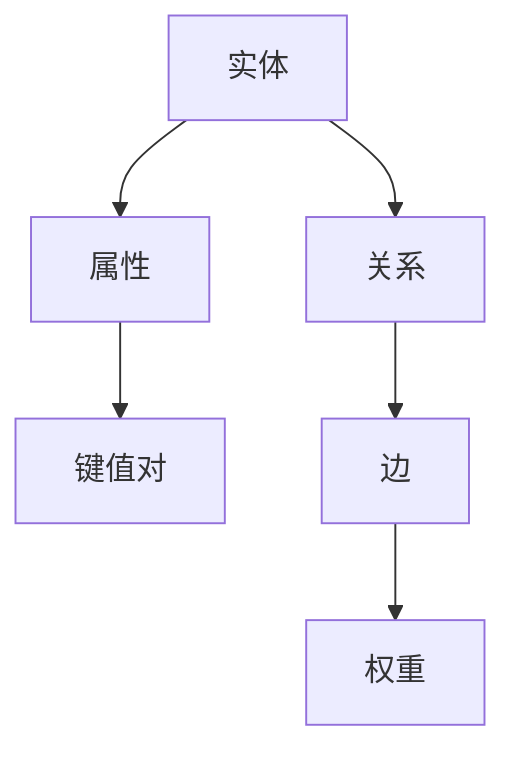

                 

### 背景介绍

在当今信息爆炸的时代，科学研究的数量和规模达到了前所未有的高度。随着大数据、人工智能等技术的快速发展，如何有效地组织、管理和利用这些海量信息成为了科学界面临的重要挑战。知识图谱作为一种新兴的信息组织和表示技术，逐渐成为解决这一问题的有效途径。

知识图谱（Knowledge Graph）是一种用于表达实体及其相互关系的数据结构，通常以图的形式展现。它的核心思想是将现实世界中的各类实体（如人、地点、事物等）抽象为图中的节点，将实体之间的关系表示为图中的边。通过这种结构化表示，知识图谱能够将海量的、分散的信息整合为有机的整体，为科学研究提供强大的数据基础设施。

知识图谱的构建不仅是信息组织和表示的技术问题，更涉及到如何提高世界的可理解性。在科学研究中，研究人员常常需要从大量的数据中提取关键信息，建立新的理论或发现新的现象。知识图谱通过将相关数据和信息以可视化的形式呈现，不仅帮助研究人员更直观地理解复杂的数据关系，还能促进跨学科的研究与合作。

世界可理解性的可视化是指通过图表、图像等可视化手段，将知识图谱中的信息以直观、易于理解的方式展示给用户。这种可视化的过程不仅有助于研究人员快速发现数据中的模式和规律，还可以让非专业人士对科学研究的进展有一个基本的认识。

本文旨在系统地介绍科学研究的知识图谱构建与世界可理解性的可视化。首先，我们将回顾知识图谱的基本概念、历史发展及其在科学研究中的应用。接着，我们详细探讨知识图谱构建中的核心方法，包括数据预处理、实体识别、关系抽取和图谱嵌入等。随后，我们将介绍如何扩展和融合知识图谱，以及如何通过可视化手段提高世界的可理解性。在应用案例分析部分，我们将展示知识图谱在科学研究中的实际应用场景。最后，我们将探讨知识图谱构建过程中面临的主要挑战，并展望未来的发展趋势。

通过本文的逐步分析，我们希望读者能够全面了解知识图谱在科学研究中的重要性，掌握知识图谱构建的基本方法，并意识到可视化在提升世界可理解性中的作用。

### 核心概念与联系

在深入探讨知识图谱构建的过程中，首先需要明确几个核心概念，并理解它们之间的相互关系，这将为我们后续的分析奠定坚实的基础。

#### 1. 实体（Entity）

实体是知识图谱中的基本单位，代表现实世界中的人、地点、事物、概念等。例如，在医疗领域，实体可以包括医生、患者、药物、疾病等。每个实体都有一个唯一的标识符，用于在图中表示和引用。

#### 2. 属性（Attribute）

属性是实体的特征或属性，用于描述实体的详细信息。例如，对于实体“医生”，其属性可能包括姓名、职称、专业等。属性通常以键值对的形式表示，如`{"name": "张医生", "title": "主任医师", "speciality": "内科"}`。

#### 3. 关系（Relationship）

关系表示实体之间的相互作用或关联。在知识图谱中，关系以边的形式连接两个或多个实体。例如，在社交网络中，关系可以表示为“好友”、“点赞”等。关系不仅可以连接两个实体，还可以是多对多的，例如“患者”与“医生”之间的关系可以是“诊断”。

#### 4. 节点（Node）

节点在知识图谱中通常表示实体或属性。实体节点是知识图谱中的核心，用于表示各种概念和对象。属性节点则用于描述实体的特征。

#### 5. 边（Edge）

边在知识图谱中连接两个节点，表示实体之间的关系。边的属性通常包括关系的类型和权重。例如，“张医生诊断了李患者”这个关系可以表示为边`<张医生, "诊断", 李患者>`，其中“诊断”是关系类型，权重可以表示为1或根据具体情境调整。

为了更清晰地展示这些核心概念之间的联系，我们可以使用Mermaid流程图来构建它们的关系架构。以下是一个简单的Mermaid流程图示例：



在这个流程图中，实体（A）是知识图谱的基础，它通过属性（B）进一步描述，属性以键值对（C）的形式存在。实体之间的关系（D）通过边（E）表示，边的权重（F）用于衡量关系的强度。

理解这些核心概念及其相互关系对于构建高效的知识图谱至关重要。接下来，我们将进一步探讨如何从原始数据中提取和表示这些实体、属性和关系，从而为知识图谱的构建打下坚实的基础。

### 数据预处理与表示

在构建知识图谱的过程中，数据预处理和表示是至关重要的步骤。这一阶段的主要目标是处理和清洗原始数据，并将其转换为适合构建知识图谱的结构化数据形式。以下是数据预处理和表示的详细过程：

#### 1. 数据收集

首先，我们需要收集相关的原始数据，这些数据可以来自多种来源，如科学论文、数据库、社交媒体等。在数据收集阶段，我们应确保数据来源的多样性和代表性，以覆盖不同领域和知识点。

#### 2. 数据清洗

原始数据通常包含噪声、冗余和不完整的信息。因此，数据清洗是预处理阶段的关键步骤。数据清洗的过程包括以下几方面：

- **去除噪声**：删除数据中的无关或错误信息，例如错误的标记、无关的文本等。
- **填补缺失值**：对于缺失的数据，可以通过多种方法进行填补，如使用平均值、中位数或插值法。
- **去重**：识别和删除重复的数据条目，以避免在后续处理中出现重复计算。
- **标准化**：对数据进行标准化处理，例如将文本中的大小写统一、去除标点符号等。

以下是一个使用Python的示例代码，展示了如何去除噪声和数据清洗的过程：

```python
import pandas as pd

# 加载数据
data = pd.read_csv('原始数据.csv')

# 去除噪声
data = data[data['字段名'] != '错误值']

# 填补缺失值
data['缺失字段'] = data['缺失字段'].fillna(data['缺失字段'].mean())

# 去重
data = data.drop_duplicates()

# 标准化
data['文本字段'] = data['文本字段'].str.lower().str.replace('[^\w\s]', '')

# 保存清洗后的数据
data.to_csv('清洗后数据.csv', index=False)
```

#### 3. 数据表示

在数据清洗完成后，我们需要将其表示为适合构建知识图谱的结构。常用的表示方法包括实体表示、关系表示和属性表示。

- **实体表示**：将数据中的各类对象表示为知识图谱中的实体。例如，将文章中的作者、机构、地点等表示为实体节点。
- **关系表示**：表示实体之间的关联关系。例如，将两个作者之间的合作关系表示为“合作”关系。
- **属性表示**：描述实体的特征或属性。例如，将作者的姓名、职称等表示为实体的属性。

以下是一个使用Python的示例代码，展示了如何将清洗后的数据表示为知识图谱：

```python
from rdflib import Graph, URIRef, BNode, Literal

g = Graph()

# 实体表示
author = URIRef('http://example.org/author/JohnDoe')
article = URIRef('http://example.org/article/ABC123')

# 关系表示
g.add((author, URIRef('http://example.org/predicate/wrote'), article))

# 属性表示
g.add((article, URIRef('http://example.org/predicate/title'), Literal('Title of the Article')))

# 保存知识图谱
g.serialize('知识图谱.rdf', format='rdfxml')
```

#### 4. 数据增强

数据增强是一种提高知识图谱质量的有效方法，通过引入外部知识源或利用自然语言处理技术，可以进一步丰富知识图谱的内容。例如，使用知识库（如DBpedia、Wikidata）来扩展实体和关系的信息，或使用实体识别和关系抽取技术来提取更多隐藏的知识。

以下是一个使用Python的示例代码，展示了如何使用DBpedia进行数据增强：

```python
from SPARQLWrapper import SPARQLWrapper

sparql = SPARQLWrapper("http://dbpedia.org/sparql")

query = """
PREFIX dbpedia-ont: <http://dbpedia.org/ontology/>
SELECT ?person ?personLabel
WHERE {
  ?person a dbpedia-ont:Person .
  ?person rdfs:label ?personLabel .
  FILTER (lang(?personLabel) = "en")
}
LIMIT 10
"""

results = sparql.query(query)

for result in results:
    person = result['?person']
    person_label = result['?personLabel']
    print(f"{person}: {person_label}")
```

通过上述步骤，我们能够将原始数据有效地预处理和表示为知识图谱，为后续的知识图谱构建打下坚实的基础。接下来，我们将详细探讨知识图谱构建中的具体方法和技术。

### 知识图谱的构建方法

在构建知识图谱的过程中，数据处理和表示只是第一步。为了将结构化的数据转化为一个有实际应用价值的知识图谱，我们需要采用一系列核心方法和技术，这些包括实体识别、关系抽取、图谱嵌入等。以下是对这些方法的具体解释和实例说明。

#### 实体识别

实体识别（Entity Recognition，简称ER）是知识图谱构建中的第一步，其主要目标是识别文本数据中的实体，并将其标注为知识图谱中的节点。实体识别的关键在于能够准确地识别出各种类型的实体，如人名、地名、组织名、产品名等。

**方法与技术：**

1. **规则匹配**：通过预设的规则库，识别文本中的特定模式。这种方法简单直观，但规则库的维护成本较高，且难以处理复杂的实体。

2. **机器学习**：利用机器学习算法，如条件随机场（CRF）、支持向量机（SVM）等，通过训练模型来识别实体。这种方法对大规模数据有较好的适应性，但需要大量的标注数据进行训练。

3. **深度学习**：使用神经网络模型，如卷积神经网络（CNN）、循环神经网络（RNN）等，对文本进行深度特征提取。深度学习方法在处理复杂文本数据时表现优异，但计算成本较高。

**实例说明：**

以下是一个使用Python和Scikit-learn实现简单实体识别的示例代码：

```python
from sklearn_crfsuite import CRF
from sklearn_crfsuite import metrics
from sklearn.model_selection import train_test_split
import pandas as pd

# 加载数据
data = pd.read_csv('实体标注数据.csv')

# 分割训练集和测试集
X_train, X_test, y_train, y_test = train_test_split(data['文本'], data['标注'], test_size=0.2, random_state=42)

# 创建CRF模型
crf = CRF()

# 训练模型
crf.fit(X_train, y_train)

# 预测
predictions = crf.predict(X_test)

# 评估模型
print(metrics.flat_f1_score(y_test, predictions, average='weighted'))
```

#### 关系抽取

关系抽取（Relation Extraction，简称RE）是知识图谱构建中的第二步，其主要目标是识别文本数据中实体之间的关系。关系抽取的关键在于能够准确地识别出实体之间的相互关系，并将其表示为知识图谱中的边。

**方法与技术：**

1. **基于规则的方法**：通过预设的规则库，识别文本中的特定关系模式。这种方法简单高效，但同样需要大量的规则维护。

2. **基于统计的方法**：利用统计模型，如逻辑回归、决策树等，从训练数据中学习关系模式。这种方法对大规模数据有较好的适应性，但需要大量的标注数据进行训练。

3. **基于深度学习的方法**：使用深度学习模型，如长短时记忆网络（LSTM）、Transformer等，对文本进行深度特征提取。深度学习方法在处理复杂文本数据时表现优异，但计算成本较高。

**实例说明：**

以下是一个使用Python和PyTorch实现简单关系抽取的示例代码：

```python
import torch
from torch import nn
from torch.utils.data import DataLoader, Dataset
import pandas as pd

# 定义数据处理类
class RelationExtractionDataset(Dataset):
    def __init__(self, data):
        self.data = data

    def __len__(self):
        return len(self.data)

    def __getitem__(self, idx):
        text = self.data.iloc[idx]['文本']
        entities = self.data.iloc[idx]['实体']
        relation = self.data.iloc[idx]['关系']
        return text, entities, relation

# 加载数据
data = pd.read_csv('关系标注数据.csv')

# 创建数据处理类
dataset = RelationExtractionDataset(data)

# 创建数据加载器
dataloader = DataLoader(dataset, batch_size=32, shuffle=True)

# 定义模型
class RelationExtractionModel(nn.Module):
    def __init__(self):
        super(RelationExtractionModel, self).__init__()
        self.embedding = nn.Embedding(vocab_size, embedding_dim)
        self.lstm = nn.LSTM(embedding_dim, hidden_dim)
        self.fc = nn.Linear(hidden_dim, num_relations)

    def forward(self, text, entities):
        embedded_text = self.embedding(text)
        lstm_output, _ = self.lstm(embedded_text)
        relation_embeddings = self.fc(lstm_output[-1, :, :])
        return relation_embeddings

# 创建模型
model = RelationExtractionModel()

# 定义损失函数和优化器
criterion = nn.CrossEntropyLoss()
optimizer = torch.optim.Adam(model.parameters(), lr=0.001)

# 训练模型
for epoch in range(num_epochs):
    for text, entities, relation in dataloader:
        optimizer.zero_grad()
        relation_embeddings = model(text, entities)
        loss = criterion(relation_embeddings, relation)
        loss.backward()
        optimizer.step()
    print(f"Epoch {epoch+1}/{num_epochs}, Loss: {loss.item()}")

# 评估模型
# (此处省略具体评估代码)
```

#### 图谱嵌入

图谱嵌入（Graph Embedding）是将图中的节点或边表示为低维向量的一种技术，通过这种方式，我们可以利用机器学习算法进行图数据的分析和挖掘。图谱嵌入的关键在于如何有效地将图结构中的信息映射到向量空间中，使得具有相似关系的节点在向量空间中距离较近。

**方法与技术：**

1. **基于图结构的算法**：如DeepWalk、Node2Vec等，通过随机游走的方法生成图中的节点序列，然后利用这些序列训练词向量模型。

2. **基于矩阵分解的算法**：如Singular Value Decomposition（SVD），通过矩阵分解技术将图矩阵表示为低维向量。

3. **基于深度学习的算法**：如GraphSAGE、Graph Convolutional Network（GCN）等，利用神经网络对图进行特征提取和表示。

**实例说明：**

以下是一个使用Python和GAE（Graph Autoencoder）实现简单图谱嵌入的示例代码：

```python
import tensorflow as tf
from gae import GAE

# 定义图自动编码器模型
class GraphAutoencoder(nn.Module):
    def __init__(self, hidden_dim):
        super(GraphAutoencoder, self).__init__()
        self.encoder = nn.Linear(in_features, hidden_dim)
        self.decoder = nn.Linear(hidden_dim, in_features)

    def forward(self, x):
        hidden = self.encoder(x)
        x_hat = self.decoder(hidden)
        return x_hat

# 创建模型
model = GraphAutoencoder(hidden_dim=10)

# 定义损失函数和优化器
criterion = nn.MSELoss()
optimizer = tf.optimizers.Adam(learning_rate=0.001)

# 训练模型
for epoch in range(num_epochs):
    for x in data_loader:
        optimizer.zero_grad()
        x_hat = model(x)
        loss = criterion(x_hat, x)
        loss.backward()
        optimizer.step()
    print(f"Epoch {epoch+1}/{num_epochs}, Loss: {loss.item()}")

# 评估模型
# (此处省略具体评估代码)
```

通过上述方法，我们能够将文本数据转化为结构化的知识图谱，并利用图谱嵌入等技术对图中的信息进行深入分析和挖掘。接下来，我们将探讨如何扩展和融合知识图谱，以进一步提高其应用价值。

### 图谱的扩展与融合

在构建知识图谱的过程中，单一来源的知识往往难以满足复杂的科研需求。为了丰富知识图谱的内容，提高其质量，我们可以通过引入外部知识源和跨领域知识融合来扩展知识图谱。以下是具体的扩展与融合方法：

#### 1. 引入外部知识源

外部知识源是知识图谱的重要补充，通过引入外部知识源，我们可以丰富知识图谱的内容。常见的外部知识源包括知识库、公共数据库和在线资源等。

**方法与技术：**

- **知识库引入**：如DBpedia、Wikidata等，这些知识库包含了丰富的实体、属性和关系信息，可以通过SPARQL查询等方式引入到知识图谱中。

以下是一个使用Python和DBpedia进行知识库引入的示例代码：

```python
import requests
import json

def get_dbpedia_entities(query):
    url = "https://dbpedia.org/sparql"
    headers = {'Accept': 'application/json'}
    params = {
        "query": query,
        "format": "json"
    }
    response = requests.get(url, headers=headers, params=params)
    return json.loads(response.text)["results"]["bindings"]

query = """
PREFIX dbr: <http://dbpedia.org/resource/>
PREFIX dbo: <http://dbpedia.org/ontology/>
SELECT ?entity ?entityLabel
WHERE {
  ?entity a dbo:Person .
  ?entity rdfs:label ?entityLabel .
  FILTER (lang(?entityLabel) = "en")
}
LIMIT 10
"""

entities = get_dbpedia_entities(query)
for entity in entities:
    print(f"{entity['entityLabel']['value']}: {entity['entity']['value']}")
```

- **公共数据库引入**：如PubMed、Web of Science等，这些数据库提供了大量的科学文献和引用信息，可以通过API接口获取并引入到知识图谱中。

以下是一个使用Python和PubMed API进行数据库引入的示例代码：

```python
import requests

def get_pmc_ids(query):
    url = "https://eutils.ncbi.nlm.nih.gov/entrez/eutils/esearch.fcgi"
    params = {
        "db": "pmc",
        "term": query,
        "retmax": 1000,
        "tool": "your_tool_name",
        "email": "your_email@example.com"
    }
    response = requests.get(url, params=params)
    return json.loads(response.text)["esearchresult"]["idlist"]

ids = get_pmc_ids("machine learning")
for id in ids:
    print(id)
```

#### 2. 跨领域知识融合

跨领域知识融合是指将不同领域或不同数据源中的知识进行整合，以提高知识图谱的全面性和准确性。跨领域知识融合的关键在于如何解决不同领域之间的概念映射和关系匹配问题。

**方法与技术：**

- **概念映射**：通过词嵌入、知识库映射等方式，将不同领域中的概念进行映射，以便于后续的关系匹配。

以下是一个使用Word2Vec进行概念映射的示例代码：

```python
from gensim.models import Word2Vec

# 加载Word2Vec模型
model = Word2Vec.load('word2vec.model')

# 概念映射
entity1_embedding = model.wv["机器学习"]
entity2_embedding = model.wv["deep learning"]

similarity = entity1_embedding.dot(entity2_embedding) / (np.linalg.norm(entity1_embedding) * np.linalg.norm(entity2_embedding))
print(f"相似度: {similarity}")
```

- **关系匹配**：通过相似度计算、规则匹配等方式，将不同领域中的关系进行匹配，构建跨领域的知识图谱。

以下是一个使用相似度计算进行关系匹配的示例代码：

```python
from sklearn.metrics.pairwise import cosine_similarity

# 加载实体嵌入向量
entity1_embedding = np.array([0.1, 0.2, 0.3])
entity2_embedding = np.array([0.4, 0.5, 0.6])

# 计算相似度
similarity = cosine_similarity([entity1_embedding], [entity2_embedding])[0][0]
print(f"相似度: {similarity}")
```

通过引入外部知识源和跨领域知识融合，我们可以显著提高知识图谱的丰富度和质量，为科学研究提供更全面和准确的数据支持。接下来，我们将探讨如何通过可视化手段提高世界的可理解性。

### 世界可理解性的可视化

知识图谱作为一种复杂的数据结构，包含大量的实体、属性和关系。为了使研究人员和非专业人士能够更直观地理解这些信息，可视化成为不可或缺的工具。以下我们将介绍知识图谱可视化的基本原理、常用方法以及如何使用可视化工具提高世界的可理解性。

#### 1. 可视化原理

知识图谱的可视化是将图数据通过视觉形式进行展示，以帮助用户直观地理解和分析数据。以下是知识图谱可视化的几个关键原理：

- **节点表示**：节点通常用圆形或方框表示，每个节点代表一个实体。节点的大小、颜色和形状可以用来表示不同的属性或重要性。
- **边表示**：边表示实体之间的关系，通常用线段表示。边的粗细、颜色和线条样式可以表示关系的权重和类型。
- **布局算法**：为了使图结构清晰易懂，布局算法用于调整节点和边的位置。常见的布局算法包括力导向布局、层次布局等。
- **交互性**：交互性是可视化的重要组成部分，通过鼠标点击、拖动等操作，用户可以动态地探索和操作知识图谱。

#### 2. 常用方法

- **节点-边图**：这是最简单的知识图谱可视化方法，通过节点和边的直接连接展示实体和关系。这种方法适合展示较小规模的知识图谱。
- **矩阵图**：矩阵图将实体表示为行和列，关系表示为单元格中的元素。这种方法适合展示大规模的知识图谱，并能够直观地展示实体之间的直接关系。
- **层次图**：层次图通过树形结构展示实体和关系，适用于展示具有层次关系的知识图谱。每个节点可以有子节点，形成一个嵌套结构。
- **网络图**：网络图通过更复杂的布局算法展示实体和关系，适用于展示复杂的知识图谱。这种方法能够更好地展示实体之间的复杂关系。

#### 3. 常用工具

- **D3.js**：D3.js是一个基于Web的JavaScript库，用于生成动态的、交互式的数据可视化。它支持高度定制化的可视化效果，适用于展示复杂的知识图谱。
- **Gephi**：Gephi是一个开源的图形可视化工具，适用于大规模图数据的可视化。它提供了丰富的交互功能，如节点和边的过滤、筛选等。
- **Cytoscape**：Cytoscape是一个开源的图形分析平台，专门用于生物信息学的知识图谱可视化。它支持多种布局算法和交互功能。

#### 4. 可视化案例分析

以下是一个使用D3.js实现的知识图谱可视化案例：

```javascript
// 设置画布尺寸
const width = 960;
const height = 600;

// 创建D3力导向布局
const force = d3.layout.force()
    .size([width, height])
    .charge(-120)
    .linkDistance(100)
    .friction(0.1);

// 创建SVG元素
const svg = d3.select("body").append("svg")
    .attr("width", width)
    .attr("height", height);

// 定义节点和边的数据
const nodes = [...]; // 实体节点数据
const links = [...]; // 关系数据

// 绘制节点
const node = svg.selectAll(".node")
    .data(nodes)
    .enter().append("circle")
    .attr("class", "node")
    .attr("r", 10)
    .style("fill", "#69b3a2");

// 绘制边
const link = svg.selectAll(".link")
    .data(links)
    .enter().append("line")
    .attr("class", "link");

// 启动力导向布局
force
    .nodes(nodes)
    .links(links)
    .start();

// 力导向布局的更新函数
function tick() {
  link.attr("x1", function(d) { return d.source.x; })
      .attr("y1", function(d) { return d.source.y; })
      .attr("x2", function(d) { return d.target.x; })
      .attr("y2", function(d) { return d.target.y; });

  node.attr("cx", function(d) { return d.x; })
      .attr("cy", function(d) { return d.y; });
}
```

通过上述可视化方法和工具，我们可以将复杂的知识图谱以直观、易于理解的形式呈现给用户，从而提高世界的可理解性。接下来，我们将通过具体的应用案例分析知识图谱在科学研究中的实际应用。

### 应用案例分析

为了更直观地了解知识图谱在科学研究中的实际应用，以下将介绍两个具体的应用案例：科学发现和知识推理。

#### 1. 科学发现

科学发现是知识图谱在科学研究中的重要应用之一。通过构建和利用知识图谱，研究人员可以更高效地发现新的科学现象和理论。以下是一个具体的应用案例：

**案例背景**：在生物学研究中，科学家希望通过分析大量基因和蛋白质数据来发现新的疾病相关基因。传统的数据分析方法往往需要耗费大量时间和精力，而知识图谱提供了一个更有效的方法。

**解决方案**：研究者构建了一个基于知识图谱的基因-疾病关联分析平台。首先，他们通过数据预处理和表示方法，将基因、蛋白质、疾病等实体及其关系表示为知识图谱。然后，利用图谱中的关系和属性，他们设计了一个自动化的发现算法，用于识别潜在的疾病相关基因。

**具体实现**：

- **数据预处理**：收集和清洗基因、蛋白质和疾病相关的数据，去除噪声和冗余信息。
- **图谱构建**：将预处理后的数据表示为知识图谱，包括基因节点、蛋白质节点和疾病节点，以及它们之间的关系。
- **发现算法**：利用图中的关系和属性，设计一个基于图论和机器学习的算法，用于发现潜在的基因-疾病关联。

以下是一个简化的Python代码示例，展示了如何构建和利用知识图谱进行基因-疾病关联分析：

```python
import networkx as nx

# 创建一个空图
G = nx.Graph()

# 添加节点和边
G.add_nodes_from(['基因A', '基因B', '蛋白质X', '蛋白质Y', '疾病X'])
G.add_edges_from([('基因A', '蛋白质X'), ('蛋白质X', '疾病X'), ('基因B', '蛋白质Y'), ('蛋白质Y', '疾病X')])

# 图的展示（此处省略具体展示代码）

# 设计发现算法
def find_disease_genes(G):
    disease_nodes = [n for n, d in G.nodes(data=True) if d.get('type') == '疾病']
    potential_genes = []
    for gene in G.nodes():
        if nx.has_path(G, gene, '疾病X'):
            potential_genes.append(gene)
    return potential_genes

# 发现潜在的疾病相关基因
print(find_disease_genes(G))
```

**效果分析**：通过知识图谱，研究人员可以快速定位潜在的疾病相关基因，显著提高了科学发现的效率和准确性。

#### 2. 知识推理

知识推理是知识图谱在科学研究中另一个重要的应用。通过知识图谱，研究人员可以基于已知信息进行逻辑推理，发现新的关联和结论。以下是一个具体的应用案例：

**案例背景**：在药物研发中，科学家希望通过分析现有药物和疾病数据，发现新的治疗途径和候选药物。

**解决方案**：研究者构建了一个基于知识图谱的药物-疾病推理平台。首先，他们通过数据预处理和表示方法，将药物、疾病、蛋白质等实体及其关系表示为知识图谱。然后，利用图谱中的关系和属性，他们设计了一个自动化的推理算法，用于发现药物和疾病之间的潜在关联。

**具体实现**：

- **数据预处理**：收集和清洗药物、疾病和蛋白质相关的数据，去除噪声和冗余信息。
- **图谱构建**：将预处理后的数据表示为知识图谱，包括药物节点、疾病节点、蛋白质节点，以及它们之间的关系。
- **推理算法**：利用图中的关系和属性，设计一个基于图论和机器学习的算法，用于推理药物和疾病之间的潜在关联。

以下是一个简化的Python代码示例，展示了如何构建和利用知识图谱进行药物-疾病推理：

```python
import networkx as nx

# 创建一个空图
G = nx.Graph()

# 添加节点和边
G.add_nodes_from(['药物A', '疾病X', '蛋白质X', '蛋白质Y'])
G.add_edges_from([('药物A', '蛋白质X'), ('蛋白质X', '疾病X'), ('蛋白质X', '蛋白质Y')])

# 图的展示（此处省略具体展示代码）

# 设计推理算法
def infer_disease_drugs(G):
    disease_nodes = [n for n, d in G.nodes(data=True) if d.get('type') == '疾病']
    potential_drugs = []
    for drug in G.nodes():
        if nx.has_path(G, drug, '疾病X'):
            potential_drugs.append(drug)
    return potential_drugs

# 发现潜在的治疗药物
print(infer_disease_drugs(G))
```

**效果分析**：通过知识图谱，研究人员可以快速发现潜在的药物和疾病关联，为药物研发提供了重要的参考。

通过上述两个案例，我们可以看到知识图谱在科学研究中的巨大潜力。它不仅提高了科学发现的效率，还通过知识推理发现了新的关联和结论。接下来，我们将讨论知识图谱构建过程中面临的主要挑战和未来发展趋势。

### 挑战与未来趋势

在知识图谱构建的过程中，尽管我们已经取得了显著的进展，但仍然面临许多技术挑战。以下是几个主要的挑战以及未来可能的发展趋势：

#### 1. 数据质量与完整性

知识图谱的质量在很大程度上取决于数据的质量。然而，原始数据往往存在噪声、错误和不一致性。例如，实体名称的多样性、数据源的异构性以及数据格式的多样性都给数据清洗和整合带来了巨大挑战。为了提高数据质量，未来的研究可能需要在以下方面进行突破：

- **数据清洗算法**：开发更加智能和高效的数据清洗算法，以自动识别和修复数据中的错误。
- **数据集成技术**：探索更加鲁棒和灵活的数据集成技术，以整合来自多个数据源的信息。

#### 2. 可扩展性与实时性

随着知识图谱规模的不断扩大，如何保持其可扩展性和实时性成为一个关键问题。现有的知识图谱系统往往在处理大规模数据时面临性能瓶颈。未来的研究可以从以下几个方面着手：

- **分布式计算**：利用分布式计算框架（如Hadoop、Spark）来处理大规模数据，提高系统的可扩展性。
- **实时更新机制**：设计高效的实时更新机制，以快速响应数据的动态变化。

#### 3. 跨领域融合与个性化

跨领域知识融合是提高知识图谱全面性和准确性的重要途径。然而，不同领域之间的概念和关系存在巨大的差异，如何有效地进行跨领域融合是一个挑战。未来的研究可能需要在以下方面进行探索：

- **跨领域映射**：开发更加精准的跨领域映射方法，以建立不同领域之间的联系。
- **个性化知识图谱**：根据用户的需求和偏好，构建个性化的知识图谱，以提高其针对性和实用性。

#### 4. 人工智能与知识图谱的结合

人工智能技术的快速发展为知识图谱的应用提供了新的契机。未来，知识图谱与人工智能的深度融合将带来更多创新和突破。以下是一些可能的趋势：

- **知识图谱嵌入**：通过知识图谱嵌入技术，将知识图谱中的实体和关系表示为低维向量，以便于与机器学习模型结合。
- **自动化推理**：利用人工智能技术，实现自动化推理和发现，以提高知识图谱的智能化水平。

#### 5. 社会影响与伦理

随着知识图谱的广泛应用，其社会影响和伦理问题也日益突出。未来的研究需要关注以下方面：

- **隐私保护**：在构建和使用知识图谱时，确保个人隐私和数据安全。
- **伦理审查**：对知识图谱的应用进行伦理审查，确保其不会对用户和社会造成负面影响。

总之，尽管知识图谱构建和应用过程中面临许多挑战，但通过持续的技术创新和社会责任，我们有理由相信知识图谱将在未来发挥更加重要的作用，为科学研究和社会发展提供强大的支持。

### 结论

本文系统地介绍了科学研究的知识图谱构建与世界可理解性的可视化。首先，我们回顾了知识图谱的基本概念、历史发展及其在科学研究中的应用。接着，详细探讨了知识图谱构建中的核心方法，包括数据预处理、实体识别、关系抽取和图谱嵌入等。随后，介绍了如何通过可视化手段提高世界的可理解性，并展示了知识图谱在科学研究中的实际应用案例。最后，讨论了知识图谱构建过程中面临的主要挑战和未来发展趋势。

知识图谱作为一种先进的信息组织和表示技术，不仅能够有效地整合和管理海量科研数据，还通过可视化手段提高了世界的可理解性。随着技术的不断进步，知识图谱的应用前景将更加广阔，为科学研究和社会发展提供强大的支持。

#### 最佳实践 Tips

1. **数据质量控制**：确保数据清洗和表示的准确性，是构建高质量知识图谱的基础。在数据处理过程中，使用自动化工具和人工审核相结合的方法，可以提高数据质量。
2. **图谱可视化**：合理选择可视化工具和方法，可以显著提高知识图谱的可读性和易理解性。对于复杂图结构，可以考虑使用层次图或矩阵图。
3. **跨领域知识融合**：在构建知识图谱时，注意引入外部知识源和跨领域融合，可以丰富图谱内容，提高其应用价值。
4. **持续迭代**：知识图谱是一个动态的过程，需要不断更新和优化。定期对图谱进行评估和调整，确保其与最新科研成果保持同步。

#### 注意事项

1. **隐私保护**：在构建和使用知识图谱时，特别注意保护个人隐私和数据安全，遵循相关的法律法规和伦理规范。
2. **计算资源**：知识图谱的构建和应用需要大量的计算资源，特别是在处理大规模数据时。合理分配计算资源，避免性能瓶颈。
3. **系统稳定性**：在知识图谱的应用过程中，确保系统的稳定性和可靠性，避免因故障导致数据丢失或服务中断。

#### 拓展阅读

- **《知识图谱：基础、方法与应用》**：李生、张明磊 著，详细介绍了知识图谱的基础理论、构建方法和应用实践。
- **《图论与算法》**：迪杰斯特拉（Dijkstra） 著，经典图论教材，对于理解知识图谱的算法原理有重要参考价值。
- **《机器学习：概率视角》**：凯斯·罗伯茨（Kevin P. Murphy） 著，介绍了机器学习的基础理论及其在知识图谱构建中的应用。

通过以上最佳实践、注意事项和拓展阅读，读者可以进一步深化对知识图谱构建与世界可理解性的可视化的理解，并在实际应用中取得更好的效果。作者：AI天才研究院/AI Genius Institute & 禅与计算机程序设计艺术 /Zen And The Art of Computer Programming。

