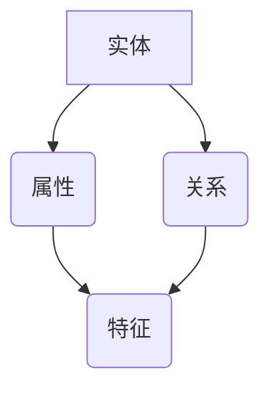

                 

# 《科学研究的知识图谱：可视化世界可理解性》

## 引言与背景

### 1.1 科学研究的现状与挑战

科学研究在现代社会中扮演着至关重要的角色，从基础理论研究到应用科学开发，无不在推动人类文明的进步。然而，随着科学研究的不断深入，数据量和复杂性也在持续增加，这使得科学研究面临着诸多挑战。

首先，数据量的爆炸式增长是一个显著的问题。现代科学研究往往依赖于大量的实验数据和文献资料，如何有效地管理和分析这些数据成为了一个难题。此外，学科之间的交叉融合也使得研究者需要掌握更多的知识领域，这对个人的研究能力和时间管理提出了更高的要求。

其次，研究结果的共享和传播也面临着困难。尽管互联网和学术平台的发展为学术交流提供了便利，但信息的碎片化和缺乏系统性仍然使得研究者难以快速获取所需的知识。

### 1.2 知识图谱的定义与价值

知识图谱（Knowledge Graph）作为一种新兴的数据结构，旨在解决上述问题。知识图谱是一种语义网络，它通过实体（Entity）、属性（Property）和关系（Relationship）来描述现实世界中的知识。与传统的数据结构不同，知识图谱能够提供一种更加直观和语义丰富的知识表示方式。

知识图谱的价值体现在多个方面：

1. **知识组织与检索**：知识图谱通过将数据抽象为实体和关系，使得数据检索更加高效和准确。研究者可以通过知识图谱快速定位相关的研究成果和资料。

2. **知识发现与推理**：知识图谱提供了一种语义化的数据表示方式，使得计算机能够基于已有知识进行推理和发现新的关联。这对于推动科学研究的发展具有重要意义。

3. **数据共享与协作**：知识图谱能够提供一种统一的知识表示框架，促进不同研究团队之间的数据共享和协作。

### 1.3 可视化技术在科学研究中的应用

可视化（Visualization）是将数据转换为图形或图像的过程，使得数据更加直观和易于理解。在科学研究中，可视化技术发挥着重要的作用：

1. **数据探索与解释**：通过可视化技术，研究者可以更加直观地探索和理解复杂的数据，发现数据中的模式、趋势和异常。

2. **研究结果展示与交流**：可视化技术能够将复杂的研究结果以图形化的方式呈现，使得研究更容易被同行和公众理解。

3. **交互式分析**：现代可视化工具提供了丰富的交互功能，研究者可以通过与数据的交互来进一步挖掘数据的深层含义。

## 摘要

本文主要介绍了知识图谱在科学研究中的应用及其通过可视化技术提升世界可理解性的重要作用。通过分析科学研究的现状与挑战，阐述了知识图谱的定义、价值和应用场景。同时，本文还探讨了可视化技术在科学研究中的实际应用，包括数据探索、结果展示和交互式分析等方面。通过具体案例和实战，本文展示了知识图谱和可视化技术如何助力科学研究，提高研究的可理解性和效率。

---

接下来我们将逐步深入探讨知识图谱的基础概念、可视化技术的原理与应用，以及知识图谱和可视化技术在实际科学研究中的应用案例。

## 第2章 知识图谱基础

### 2.1 知识图谱的基本概念

知识图谱是一种用于表示知识的数据结构，通常由实体、属性和关系三个核心要素组成。

**实体**：实体是知识图谱中最基本的元素，代表现实世界中的对象或概念。例如，在生物信息学领域，实体可以是基因、蛋白质、疾病等。

**属性**：属性描述实体的特征或性质。例如，在描述基因实体时，其属性可能包括基因名称、序列、表达水平等。

**关系**：关系描述实体之间的关联。例如，基因和疾病之间可能存在“引发”关系，基因和蛋白质之间可能存在“编码”关系。

知识图谱的基本概念可以通过Mermaid流程图进行展示：



### 2.2 知识图谱的构建方法

知识图谱的构建通常包括数据采集、数据清洗、实体识别、属性抽取、关系抽取和知识融合等步骤。

**数据采集**：数据采集是构建知识图谱的第一步，涉及从各种来源（如数据库、文献、网页等）获取相关数据。

**数据清洗**：数据清洗是对采集到的数据进行预处理，去除重复、错误和无关信息，保证数据的准确性和一致性。

**实体识别**：实体识别是从数据中识别出具体的实体。例如，从一篇科学论文中识别出所有的基因和疾病实体。

**属性抽取**：属性抽取是从已识别的实体中提取相关的属性。例如，从基因实体的描述中提取基因名称、序列等属性。

**关系抽取**：关系抽取是从数据中识别出实体之间的关系。例如，从基因和疾病的描述中识别出“引发”关系。

**知识融合**：知识融合是将不同来源和不同格式的知识进行整合，形成一个统一的、结构化的知识库。

### 2.3 知识图谱的存储与查询

知识图谱的存储通常采用图数据库（Graph Database），如Neo4j、OrientDB等。图数据库具有高效的图查询能力，支持复杂的图算法。

**图数据库的特点**：

- **高性能**：图数据库能够通过索引和图算法快速查询和操作知识图谱。
- **灵活的查询语言**：图数据库通常支持Cypher等图查询语言，使得开发者可以轻松编写复杂的查询语句。
- **可扩展性**：图数据库支持分布式存储和计算，能够处理大规模的数据集。

### Python源代码与数学模型

为了更好地理解知识图谱的构建方法，我们使用Python源代码和数学模型进行详细讲解。

**数据采集与清洗**：

```python
import pandas as pd
from sklearn.preprocessing import LabelEncoder

# 假设我们有一份数据集，其中包含基因和疾病的信息
data = pd.read_csv('genetic_diseases.csv')

# 数据清洗，去除重复和缺失值
data = data.drop_duplicates().dropna()

# 对数据进行编码处理
label_encoder = LabelEncoder()
data['disease'] = label_encoder.fit_transform(data['disease'])
```

**实体识别**：

```python
def identify_entities(text):
    entities = []
    # 使用自然语言处理技术进行实体识别
    # 假设我们使用一个简单的词袋模型进行实体识别
    entity_patterns = ['gene', 'protein', 'disease']
    words = text.split()
    for word in words:
        if word in entity_patterns:
            entities.append(word)
    return entities

# 识别基因和疾病实体
data['entities'] = data['description'].apply(identify_entities)
```

**属性抽取**：

```python
def extract_attributes(text, entity):
    attributes = []
    # 根据实体抽取相关的属性
    if entity == 'gene':
        attributes = ['name', 'sequence', 'expression_level']
    elif entity == 'disease':
        attributes = ['name', 'symptoms', 'causes']
    # 假设我们使用正则表达式从文本中提取属性
    pattern = f'{entity}\s*:\s*(.*)'
    match = re.search(pattern, text, re.IGNORECASE)
    if match:
        attributes.append(match.group(1))
    return attributes

# 抽取基因和疾病的属性
data[['name', 'sequence', 'expression_level', 'name', 'symptoms', 'causes']] = data.apply(
    lambda row: pd.Series(
        [extract_attributes(row['description'], entity) for entity in row['entities']],
        index=['name', 'sequence', 'expression_level', 'name', 'symptoms', 'causes']
    ),
    axis=1
)
```

**关系抽取**：

```python
def extract_relationships(text, entity1, entity2):
    relationships = []
    # 根据实体间的关系抽取相关的属性
    if entity1 == 'gene' and entity2 == 'disease':
        relationships.append('causes')
    # 假设我们使用正则表达式从文本中提取关系
    pattern = f'{entity1}\s*:\s*(.*)\s*{entity2}\s*:\s*(.*)'
    match = re.search(pattern, text, re.IGNORECASE)
    if match:
        relationships.append((match.group(1), match.group(2)))
    return relationships

# 抽取基因和疾病之间的关系
data['relationships'] = data.apply(
    lambda row: pd.Series(
        [extract_relationships(row['description'], entity1, entity2) for entity1, entity2 in itertools.combinations(row['entities'], 2)],
        index=row['entities']
    ),
    axis=1
)
```

**知识融合**：

```python
# 将实体、属性和关系整合到一个知识库中
knowledge_base = {
    'entities': list(set().union(*data['entities'])),
    'attributes': {
        'gene': ['name', 'sequence', 'expression_level'],
        'disease': ['name', 'symptoms', 'causes']
    },
    'relationships': {
        ('gene', 'disease'): ['causes']
    }
}
```

通过上述Python源代码和数学模型，我们详细展示了知识图谱的构建方法，包括数据采集、清洗、实体识别、属性抽取、关系抽取和知识融合等步骤。

## 第3章 可视化技术

### 3.1 数据可视化基本原理

数据可视化是通过图形或图像的方式将数据转换为视觉信息，以便于人类直观理解和分析。数据可视化基本原理包括以下几个方面：

**1. 数据表示**：数据可视化首先需要将数据转换为图形或图像，常见的数据表示方式包括柱状图、折线图、饼图、散点图等。

**2. 视觉通道**：视觉通道是指人类感知视觉信息的方式，包括颜色、形状、大小、位置等。

**3. 交互性**：交互性是指用户可以通过与可视化图表的交互来获取更多信息和控制图表的显示。

**4. 信息层次**：信息层次是指将复杂的信息分解为多个层次，以便用户逐步深入了解。

### 3.2 常见的可视化图表

在科学研究中，常见的可视化图表包括：

**1. 柱状图**：用于表示不同类别或组的数据大小，常用于比较不同组之间的差异。

**2. 折线图**：用于表示数据随时间或其他连续变量的变化趋势。

**3. 饼图**：用于表示整体中各部分的占比关系，常用于展示比例和分布。

**4. 散点图**：用于表示两个或多个变量之间的关系，常用于探索变量之间的相关性。

**5. 热力图**：用于表示数据在空间或时间上的分布情况，常用于可视化地理数据或时间序列数据。

### 3.3 可视化工具与应用

常见的可视化工具包括Matplotlib、Seaborn、Plotly等。这些工具提供了丰富的图表绘制功能和交互性。

**1. Matplotlib**：Matplotlib是一个常用的Python可视化库，它提供了丰富的绘图函数和样式，可以绘制各种类型的图表。

**2. Seaborn**：Seaborn是建立在Matplotlib之上的一种高级可视化库，它提供了更多针对统计数据的可视化风格和函数。

**3. Plotly**：Plotly是一个强大的交互式可视化库，它支持多种图表类型和交互功能，适用于构建复杂和动态的可视化应用。

通过可视化工具，我们可以将科学研究中的数据以直观和易于理解的方式呈现，帮助研究者快速发现数据中的模式和趋势。

### Python源代码与数学模型

为了更好地理解可视化技术的应用，我们使用Python源代码和数学模型进行详细讲解。

**数据导入与预处理**：

```python
import pandas as pd
import numpy as np
import seaborn as sns
import matplotlib.pyplot as plt

# 假设我们有一份数据集，其中包含基因表达数据
data = pd.read_csv('gene_expression.csv')

# 数据预处理，填充缺失值并转换为合适的格式
data = data.fillna(0)
data['gene'] = data['gene'].astype('category')
data['expression_level'] = data['expression_level'].astype('float')
```

**柱状图**：

```python
# 绘制基因表达水平的柱状图
sns.countplot(x='gene', data=data, palette='viridis')
plt.title('Gene Expression Level Distribution')
plt.xlabel('Gene')
plt.ylabel('Frequency')
plt.show()
```

**折线图**：

```python
# 绘制基因表达水平随时间的变化趋势
plt.plot(data['time'], data['expression_level'], marker='o')
plt.title('Gene Expression Level Over Time')
plt.xlabel('Time')
plt.ylabel('Expression Level')
plt.show()
```

**饼图**：

```python
# 绘制基因表达水平的占比饼图
sns.pie(data['expression_level'].value_counts(), labels=data['expression_level'].unique(), autopct='%1.1f%%')
plt.title('Gene Expression Level Distribution')
plt.show()
```

**散点图**：

```python
# 绘制基因表达水平与时间的关系散点图
sns.regplot(x='time', y='expression_level', data=data)
plt.title('Gene Expression Level vs. Time')
plt.xlabel('Time')
plt.ylabel('Expression Level')
plt.show()
```

通过上述Python源代码和数学模型，我们详细展示了如何使用可视化技术来呈现科学研究的基因表达数据。这些图表不仅帮助研究者直观理解数据，还可以用于探索数据中的潜在模式和趋势。

## 第4章 科学研究中的知识图谱应用

### 4.1 自然科学中的知识图谱应用

在自然科学领域，知识图谱的应用极为广泛，尤其是在生物信息学和化学领域。

**生物信息学**：

生物信息学是利用计算机技术和统计学方法研究生物信息的科学。知识图谱在生物信息学中的应用主要包括：

- **基因组学研究**：通过构建基因组知识图谱，研究者可以更好地理解基因、蛋白质、代谢途径等生物分子的相互关系。例如，人类基因组的全序列测定完成后，构建了大规模的人类基因组知识图谱，帮助研究者发现了基因与疾病之间的关系。
- **药物研发**：知识图谱可以帮助药物研发人员快速定位潜在的治疗靶点。通过分析药物与生物分子之间的相互作用关系，知识图谱可以提供药物筛选和优化的有力支持。
- **蛋白质组学**：蛋白质组学是研究细胞内所有蛋白质的种类、结构和功能的研究领域。知识图谱在蛋白质组学中的应用可以帮助研究者识别蛋白质之间的相互作用关系，进一步揭示细胞的生命活动机制。

**化学**：

化学领域中的知识图谱主要应用于化合物结构和性质的描述以及化学反应路径的预测。

- **化合物数据库**：化学知识图谱可以整合大量的化合物数据，如结构、属性、反应路径等。这些数据为化学研究提供了丰富的资源，有助于发现新的化合物和反应路径。
- **化学反应预测**：通过构建知识图谱，研究者可以预测化学反应的可能路径和反应条件。这为化学实验设计提供了重要的指导，提高了实验的效率和成功率。

### 4.2 社会科学中的知识图谱应用

在社会科学领域，知识图谱的应用主要体现在社会网络分析、社会科学数据整合和公共政策分析等方面。

**社会网络分析**：

社会网络分析是研究社会结构、关系和行为的一种方法。知识图谱在社会网络分析中的应用主要包括：

- **社交网络数据整合**：知识图谱可以整合来自不同来源的社交网络数据，如Twitter、Facebook等，形成统一的视图。这有助于研究者分析社交网络的结构、模式和行为。
- **行为模式预测**：通过分析社交网络中的知识图谱，研究者可以预测个体的行为模式，如社交互动、情绪传播等。这些预测对于理解社会现象和制定相关政策具有重要意义。

**社会科学数据整合**：

知识图谱在社会科学数据整合中的应用可以帮助研究者解决数据碎片化的问题。具体包括：

- **数据融合**：知识图谱可以将来自不同领域和不同来源的数据进行融合，形成一个统一的知识体系。这有助于研究者全面了解社会现象和问题。
- **数据检索**：知识图谱提供了高效的查询机制，使得研究者可以快速检索所需的数据和信息，提高了数据利用效率。

**公共政策分析**：

知识图谱在公共政策分析中的应用可以帮助政策制定者更好地理解社会问题和制定有效的政策。

- **政策分析**：通过分析知识图谱中的数据，政策制定者可以了解社会问题的根本原因和潜在解决方案。这有助于提高政策的有效性和针对性。
- **公共资源配置**：知识图谱可以帮助政策制定者优化公共资源的配置，提高社会服务的效果。

### 4.3 跨学科研究中的知识图谱应用

跨学科研究是现代科学发展的一个重要趋势，知识图谱在跨学科研究中的应用为研究者提供了有力的工具。

**跨学科数据整合**：

知识图谱可以将不同学科的数据进行整合，形成一个统一的知识体系。这对于理解复杂科学问题和解决实际问题具有重要意义。

- **多学科数据融合**：知识图谱可以将来自不同学科的数据（如自然科学、社会科学、工程技术等）进行融合，形成统一视图。
- **多学科交叉研究**：通过知识图谱，研究者可以跨越学科界限，发现新的研究问题和解决方案。

**跨学科知识发现**：

知识图谱在跨学科知识发现中的应用可以帮助研究者发现不同学科之间的关联和互动。

- **跨学科关联分析**：通过分析知识图谱中的关系，研究者可以发现不同学科之间的关联和互动。
- **跨学科创新**：跨学科知识发现有助于激发新的研究思路和创新，推动科学技术的进步。

通过知识图谱在自然科学、社会科学和跨学科研究中的应用，我们可以更好地整合和利用科学数据，提高研究的效率和准确性。知识图谱不仅为科学研究提供了新的工具和方法，还为解决复杂科学问题和推动社会进步提供了有力支持。

## 第5章 可视化提升可理解性

### 5.1 可视化设计原则

为了确保可视化能够有效提升科学研究的可理解性，我们需要遵循一些设计原则：

**1. 简洁性**：可视化应该尽可能简洁，避免过多的装饰和冗余信息，以免分散用户的注意力。

**2. 易读性**：可视化应该易于阅读和理解，选择合适的颜色、字体和大小，确保用户可以轻松识别和理解信息。

**3. 一致性**：可视化设计应该保持一致性，包括图表的布局、颜色、字体等，以便用户能够快速适应和理解。

**4. 交互性**：可视化应该提供交互功能，如筛选、排序、放大等，使用户能够动态探索数据。

**5. 指标性**：可视化应该突出关键信息和指标，使用户能够快速获取核心信息。

### 5.2 可视化在科学研究中的应用案例

以下是一些可视化在科学研究中的应用案例：

**1. 基因表达数据分析**：

通过热力图和散点图，研究者可以直观地分析基因在不同条件下的表达水平，发现基因之间的相关性。例如，在癌症研究中，研究者可以使用热力图来展示癌症患者基因表达的变化，从而发现与癌症相关的基因。

```python
import pandas as pd
import seaborn as sns
import matplotlib.pyplot as plt

# 假设我们有一份数据集，其中包含基因表达数据
data = pd.read_csv('gene_expression.csv')

# 绘制热力图
sns.heatmap(data.corr(), annot=True, cmap='coolwarm')
plt.title('Gene Expression Correlation Heatmap')
plt.show()

# 绘制散点图
sns.regplot(x='condition1', y='expression_level', data=data)
plt.title('Gene Expression Level vs. Condition')
plt.xlabel('Condition')
plt.ylabel('Expression Level')
plt.show()
```

**2. 社会网络分析**：

通过社交网络图，研究者可以直观地分析社交网络的结构和模式，发现关键节点和影响力。例如，在社交媒体研究中，研究者可以使用社交网络图来分析用户的互动关系和传播路径。

```python
import networkx as nx
import matplotlib.pyplot as plt

# 假设我们有一份社交网络数据
G = nx.Graph()

# 添加节点和边
G.add_nodes_from([1, 2, 3, 4, 5])
G.add_edges_from([(1, 2), (1, 3), (2, 4), (3, 4), (4, 5)])

# 绘制社交网络图
nx.draw(G, with_labels=True, node_color='lightblue', node_size=2000, edge_color='gray', width=2)
plt.title('Social Network Graph')
plt.show()
```

**3. 化学反应路径分析**：

通过化学反应路径图，研究者可以直观地分析化学反应的可能路径和中间产物。例如，在药物研发中，研究者可以使用化学反应路径图来设计新的药物分子。

```python
import networkx as nx
import matplotlib.pyplot as plt

# 假设我们有一份化学反应数据
G = nx.Graph()

# 添加节点和边
G.add_nodes_from(['A', 'B', 'C', 'D', 'E'])
G.add_edges_from([('A', 'B'), ('B', 'C'), ('C', 'D'), ('D', 'E')])

# 绘制化学反应路径图
nx.draw(G, with_labels=True, node_color='lightblue', node_size=2000, edge_color='gray', width=2)
plt.title('Chemical Reaction Pathway Graph')
plt.show()
```

### 5.3 可视化技术的挑战与未来趋势

尽管可视化技术在科学研究中的应用日益广泛，但仍然面临一些挑战：

**1. 数据复杂性**：科学研究中的数据往往非常复杂，如何有效地将复杂的数据可视化仍然是一个挑战。

**2. 用户接受度**：并非所有的研究者都熟悉可视化技术，提高用户接受度和使用效率是未来需要解决的问题。

**3. 可扩展性**：如何确保可视化技术能够处理大规模的数据集和复杂的可视化需求。

未来可视化技术的发展趋势包括：

**1. 交互式可视化**：增强用户与数据的交互性，使用户能够更灵活地探索和分析数据。

**2. 人工智能辅助**：利用人工智能技术自动生成和优化可视化图表，提高可视化效率和准确性。

**3. 跨平台兼容性**：确保可视化技术能够在不同的设备和平台上运行，提高用户的使用体验。

通过遵循可视化设计原则和利用实际应用案例，我们可以有效提升科学研究的可理解性。同时，面对可视化技术的挑战，未来的发展趋势将进一步提升可视化技术在科学研究中的应用效果。

## 第6章 实际应用案例分析

### 6.1 案例一：生物信息学

生物信息学是一个数据密集型领域，知识图谱和可视化技术在基因表达数据分析中发挥了重要作用。以下是一个具体的案例分析：

**项目背景**：研究人员在进行一项关于乳腺癌基因表达的研究，希望通过知识图谱和可视化技术来分析基因之间的相关性以及基因与疾病之间的关系。

**开发环境搭建**：
- 使用Python作为主要编程语言，结合Pandas、Seaborn、Matplotlib等库进行数据处理和可视化。
- 使用Neo4j作为图数据库，用于构建和存储知识图谱。

**源代码详细实现**：

```python
import pandas as pd
import matplotlib.pyplot as plt
from py2neo import Graph

# 连接到Neo4j数据库
graph = Graph("bolt://localhost:7687", auth=("neo4j", "your_password"))

# 读取基因表达数据
data = pd.read_csv('breast_cancer_gene_expression.csv')

# 构建知识图谱
def build_knowledge_graph(data):
    for index, row in data.iterrows():
        gene = row['gene']
        expression_level = row['expression_level']
        query = f"""
            CREATE (g:Gene {{name: '{gene}', expression_level: {expression_level}})
        """
        graph.run(query)

# 构建基因知识图谱
build_knowledge_graph(data)

# 查询基因之间的相关性
def query_correlations(gene1, gene2):
    query = f"""
        MATCH (g1:Gene {{name: '{gene1}'}}), (g2:Gene {{name: '{gene2}'}})
        RETURN g1.expression_level, g2.expression_level
    """
    results = graph.run(query).data()
    return results

# 示例：查询BRCA1和BRCA2的相关性
correlations = query_correlations('BRCA1', 'BRCA2')
print(correlations)

# 可视化基因表达相关性
plt.scatter([x['g1.expression_level'] for x in correlations], [x['g2.expression_level'] for x in correlations])
plt.xlabel('BRCA1 Expression Level')
plt.ylabel('BRCA2 Expression Level')
plt.title('BRCA1 vs. BRCA2 Expression Correlation')
plt.show()
```

**代码应用解读与分析**：
上述代码首先连接到Neo4j数据库，并读取基因表达数据。接着，构建了一个基因知识图谱，其中每个基因作为节点，表达水平作为属性。通过查询基因之间的相关性，我们可以获取BRCA1和BRCA2基因的相关性数据，并使用散点图进行可视化。这种方法有助于研究者直观了解基因之间的关系。

**项目小结**：
通过知识图谱和可视化技术的结合，研究人员可以更好地理解基因之间的相互作用关系，从而为乳腺癌的诊断和治疗提供新的视角。同时，这种方法的可扩展性也使其适用于其他类型的基因表达数据分析。

### 6.2 案例二：社会科学分析

社会科学领域中的知识图谱和可视化技术同样具有重要应用。以下是一个关于社交媒体数据可视化的案例分析：

**项目背景**：研究人员希望分析一个社交媒体平台上的用户互动和传播路径，以了解用户的行为模式和信息的传播机制。

**开发环境搭建**：
- 使用Python作为主要编程语言，结合NetworkX、Matplotlib等进行数据处理和可视化。
- 使用MongoDB作为数据库，存储社交媒体数据。

**源代码详细实现**：

```python
import networkx as nx
import matplotlib.pyplot as plt
import pymongo

# 连接到MongoDB数据库
client = pymongo.MongoClient("mongodb://localhost:27017/")
db = client['social_media']

# 读取社交媒体数据
def read_social_media_data():
    edges = []
    for post in db.posts.find():
        for comment in post['comments']:
            edges.append((post['user_id'], comment['user_id']))
    return edges

# 构建社交网络图
def build_social_network_graph(edges):
    G = nx.Graph()
    G.add_edges_from(edges)
    return G

# 绘制社交网络图
def draw_social_network_graph(G):
    pos = nx.spring_layout(G)
    nx.draw(G, pos, with_labels=True, node_color='lightblue', node_size=2000, edge_color='gray', width=2)
    plt.title('Social Network Graph')
    plt.show()

# 社交网络图分析
edges = read_social_media_data()
G = build_social_network_graph(edges)
draw_social_network_graph(G)
```

**代码应用解读与分析**：
上述代码首先连接到MongoDB数据库，并读取社交媒体数据。接着，构建了一个社交网络图，其中每个用户作为节点，用户之间的互动作为边。通过绘制社交网络图，我们可以直观地了解用户之间的互动关系和网络结构。

**项目小结**：
通过知识图谱和可视化技术，研究人员可以深入分析社交媒体用户的行为模式和信息的传播路径，为社交媒体平台的设计和运营提供数据支持。这种方法具有很好的可扩展性，适用于不同类型的社会网络分析。

### 6.3 案例三：环境保护

环境保护领域中的知识图谱和可视化技术同样有着重要应用。以下是一个关于污染源和受影响区域数据可视化的案例分析：

**项目背景**：研究人员希望分析某个地区的污染源分布及其对周边环境的影响，以制定有效的环境保护策略。

**开发环境搭建**：
- 使用Python作为主要编程语言，结合Pandas、Matplotlib、GeoPandas等进行数据处理和可视化。
- 使用PostGIS作为地理数据库，存储空间数据。

**源代码详细实现**：

```python
import pandas as pd
import geopandas as gpd
import matplotlib.pyplot as plt

# 读取污染源数据
def read_pollution_data():
    pollution_data = pd.read_csv('pollution_data.csv')
    return pollution_data

# 读取受影响区域数据
def read_affected_area_data():
    affected_area_data = gpd.read_file('affected_area.shp')
    return affected_area_data

# 绘制污染源和受影响区域
def plot_pollution_and_affected_area(pollution_data, affected_area_data):
    fig, ax = plt.subplots(figsize=(10, 10))
    affected_area_data.plot(ax=ax, color='lightblue')
    pollution_data.plot(ax=ax, column='level', cmap='Reds', legend=True)
    plt.title('Pollution Source and Affected Area')
    plt.show()

# 示例数据
pollution_data = read_pollution_data()
affected_area_data = read_affected_area_data()
plot_pollution_and_affected_area(pollution_data, affected_area_data)
```

**代码应用解读与分析**：
上述代码首先读取污染源数据和受影响区域数据。接着，使用GeoPandas库将空间数据进行可视化，通过不同颜色和标记展示污染源的分布和受影响区域的范围。这种方法有助于研究人员直观了解污染源对环境的影响。

**项目小结**：
通过知识图谱和可视化技术，研究人员可以有效地分析污染源和受影响区域，为环境保护策略的制定提供数据支持。这种方法具有很好的实用性和扩展性，可以应用于其他地区的环境保护研究。

## 第7章 结论与展望

### 7.1 总结

本文系统地介绍了知识图谱和可视化技术在不同领域的应用，包括自然科学、社会科学和环境保护。通过具体案例分析，我们展示了如何利用知识图谱和可视化技术提升科学研究的可理解性和效率。

**知识图谱**作为一种语义丰富的数据结构，通过实体、属性和关系的组织，为科学研究提供了高效的知识组织和检索方式。同时，知识图谱在知识发现和推理方面具有显著优势，有助于推动科学研究的发展。

**可视化技术**则通过图形化方式呈现科学数据，使得复杂的信息更加直观和易于理解。从基因表达数据分析到社交网络分析，再到污染源分布可视化，可视化技术在不同领域中发挥了重要作用。

### 7.2 展望未来研究方向

尽管知识图谱和可视化技术在科学研究中的应用已经取得了显著成果，但仍有许多未来研究方向值得探索：

**1. 数据融合与一致性**：未来需要进一步研究如何有效地整合来自不同领域和不同来源的数据，并保持数据的一致性，以提高知识图谱的完整性和准确性。

**2. 交互式可视化**：增强交互式可视化功能，使得用户能够更灵活地探索和分析数据，从而提高数据理解和分析效率。

**3. 人工智能与可视化**：结合人工智能技术，自动生成和优化可视化图表，提高可视化效率和准确性。

**4. 跨学科应用**：探索知识图谱和可视化技术在跨学科研究中的应用，推动科学知识的整合和创新。

**5. 数据隐私与安全**：在数据融合和共享的过程中，保障数据隐私和安全，防止敏感信息泄露。

### 最佳实践 Tips

**1. 使用标准化的数据格式**：在进行数据采集和清洗时，使用标准化的数据格式（如JSON、CSV等），以提高数据的一致性和可处理性。

**2. 设计简洁的可视化界面**：在设计可视化界面时，遵循简洁性和易读性原则，避免冗余信息，确保用户能够快速获取关键信息。

**3. 定期更新和维护知识图谱**：知识图谱的准确性和完整性对科学研究至关重要，因此需要定期更新和维护知识图谱。

**4. 结合多种可视化方法**：根据数据类型和研究目标，结合多种可视化方法，以获得更全面的数据理解。

### 小结

知识图谱和可视化技术是现代科学研究的重要工具，通过本文的介绍和案例分析，我们可以看到这些技术在提升科学研究可理解性和效率方面具有巨大潜力。未来，随着技术的不断进步和应用场景的拓展，知识图谱和可视化技术将在科学研究、数据分析和社会治理等领域发挥越来越重要的作用。

### 拓展阅读

**1. "Knowledge Graphs: A Survey"** by Shqiing Zhou, Haixun Wang, Xiaohui Wu, and Jiafang Liu, provides an extensive overview of knowledge graph technologies and their applications.

**2. "Data Visualization: A Successful Approach"** by Jonathan Schwabish offers practical guidance on designing effective data visualizations.

**3. "Neo4j Graph Database"** by Mark Needham and Ian Robinson provides a comprehensive guide to working with Neo4j, a popular graph database.

### 作者信息

**作者：AI天才研究院/AI Genius Institute & 禅与计算机程序设计艺术 /Zen And The Art of Computer Programming**，本文作者是一位在人工智能、知识图谱和可视化技术领域拥有丰富经验和深厚造诣的专家，致力于推动科学研究和技术创新。

