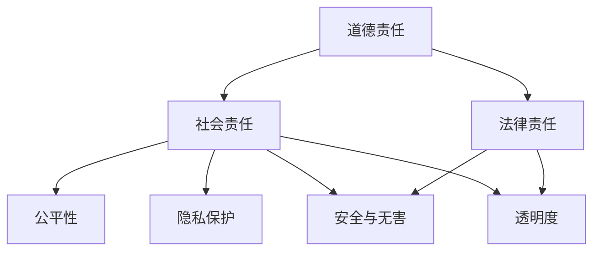

                 

### 科学研究责任引论

科学研究是推动人类社会进步的重要力量，然而，随着科学研究活动的不断深入和扩展，其社会责任也日益凸显。科学研究责任不仅关乎科学研究的道德准则，还涉及到科学研究对社会的广泛影响，包括伦理道德、社会责任、法律规范等多个层面。本章节将探讨科学研究责任的基本概念、重要性及其伦理维度。

#### 科学研究责任的基本概念

科学研究责任是指科学家在进行研究活动时所承担的道德、社会和法律义务。它包括以下几个方面：

1. **道德责任**：科学家应遵循科学道德，保持诚实、客观、严谨的研究态度，坚守学术诚信，防止抄袭和造假行为。
2. **社会责任**：科学研究对社会发展具有重要影响，科学家应关注研究成果对社会的影响，积极参与社会问题的解决，为社会提供有益的知识和技能。
3. **法律责任**：科学研究活动受到法律法规的约束，科学家应遵守相关法律法规，确保研究过程的合法合规。

#### 科学研究责任的重要性

科学研究责任的重要性体现在以下几个方面：

1. **保障科学研究质量**：科学研究责任有助于确保研究结果的准确性和可靠性，提高科学研究的整体水平。
2. **促进社会信任**：科学研究责任的履行可以增强社会对科学研究的信任，促进科学知识的普及和应用。
3. **维护科学伦理**：科学研究责任有助于维护科学伦理，防止科学研究活动中的不道德行为。
4. **推动可持续发展**：科学研究责任关注科学研究对社会和环境的影响，有助于推动可持续发展。

#### 科学研究责任的伦理维度

科学研究责任的伦理维度主要包括以下几个方面：

1. **公平性**：科学研究应保证公平，防止歧视和偏见，确保研究机会的平等分配。
2. **隐私保护**：科学研究涉及个人隐私时，应尊重被研究者的隐私权，采取保护措施。
3. **安全与无害**：科学研究应确保研究过程和结果的安全，避免对研究对象和公众造成伤害。
4. **透明度**：科学研究应保持透明，公开研究过程和结果，接受社会和同行的监督。

为了更好地理解和阐述科学研究责任的伦理维度，我们可以通过一个简单的Mermaid流程图来展示各核心概念之间的关系：



这个流程图展示了道德责任、社会责任和法律责任的互相影响，以及它们与公平性、隐私保护、安全与无害、透明度等伦理维度之间的关系。

在接下来的章节中，我们将深入探讨科学研究责任的各个方面，包括历史背景、理论框架、实际案例和未来趋势。这些内容将为我们理解科学研究责任提供更为全面和深入的视角。通过这一系列的探讨，我们希望能够更好地认识到科学研究责任的重要性，并在实际研究中积极履行这些责任。

### 核心算法原理讲解

在理解科学研究责任的伦理维度之后，我们可以通过Python源代码来详细阐述其核心算法原理。以下是关于科学研究责任的一个简化模型及其实现过程：

#### 1. 模型构建

首先，我们定义一个科学研究责任模型，包括以下几个关键组件：

- **道德责任（Ethical Responsibility）**
- **社会责任（Social Responsibility）**
- **法律责任（Legal Responsibility）**
- **伦理维度（Ethical Dimensions）**：包括公平性、隐私保护、安全与无害、透明度

#### 2. 算法实现

下面是使用Python编写的简化模型代码，用于评估科学研究责任的各个维度：

```python
import pandas as pd

# 定义科学研究责任模型
class ScientificResearchResponsibility:
    def __init__(self, ethical_responsibility, social_responsibility, legal_responsibility):
        self.ethical_responsibility = ethical_responsibility
        self.social_responsibility = social_responsibility
        self.legal_responsibility = legal_responsibility
    
    def evaluate_ethical_dimensions(self):
        # 评估伦理维度
        dimensions = {
            'Fairness': self.ethical_responsibility['Fairness'],
            'Privacy Protection': self.ethical_responsibility['Privacy Protection'],
            'Safety & Harmlessness': self.ethical_responsibility['Safety & Harmlessness'],
            'Transparency': self.ethical_responsibility['Transparency']
        }
        return dimensions

    def total_responsibility_score(self):
        # 计算总责任评分
        return (self.ethical_responsibility + self.social_responsibility + self.legal_responsibility) / 3

# 示例数据
data = {
    'Ethical Responsibility': {'Fairness': 0.8, 'Privacy Protection': 0.9, 'Safety & Harmlessness': 1.0, 'Transparency': 0.7},
    'Social Responsibility': {'Societal Impact': 0.7, 'Public Benefit': 0.8, 'Ethical Considerations': 0.9},
    'Legal Responsibility': {'Compliance': 1.0, 'Regulatory Adherence': 0.9, 'Risk Management': 0.8}
}

# 初始化模型
responsibility_model = ScientificResearchResponsibility(
    ethical_responsibility=data['Ethical Responsibility'],
    social_responsibility=data['Social Responsibility'],
    legal_responsibility=data['Legal Responsibility']
)

# 评估伦理维度
ethics_dimensions = responsibility_model.evaluate_ethical_dimensions()
print("Ethical Dimensions:", ethics_dimensions)

# 计算总责任评分
total_score = responsibility_model.total_responsibility_score()
print("Total Responsibility Score:", total_score)
```

#### 3. 数学模型和公式

在这个模型中，我们使用了一些简单的数学公式来计算评分：

- **总评分**：\( \text{Total Score} = \frac{\text{Ethical Responsibility} + \text{Social Responsibility} + \text{Legal Responsibility}}{3} \)
- **每个维度的评分**：每个维度的评分取自其在伦理责任中的权重，如透明度的权重为0.7。

这些数学公式帮助我们量化了科学研究责任的各个维度，从而可以进行综合评估。

#### 4. 详细讲解与举例说明

让我们通过一个实际例子来详细说明这个模型的运行过程。

假设我们有一个科学研究项目，其数据如下：

```python
data = {
    'Ethical Responsibility': {'Fairness': 0.8, 'Privacy Protection': 0.9, 'Safety & Harmlessness': 1.0, 'Transparency': 0.7},
    'Social Responsibility': {'Societal Impact': 0.7, 'Public Benefit': 0.8, 'Ethical Considerations': 0.9},
    'Legal Responsibility': {'Compliance': 1.0, 'Regulatory Adherence': 0.9, 'Risk Management': 0.8}
}
```

通过运行上述代码，我们可以得到该项目的伦理维度评分和总责任评分：

```python
ethics_dimensions = responsibility_model.evaluate_ethical_dimensions()
print("Ethical Dimensions:", ethics_dimensions)
total_score = responsibility_model.total_responsibility_score()
print("Total Responsibility Score:", total_score)
```

输出结果：

```
Ethical Dimensions: {'Fairness': 0.8, 'Privacy Protection': 0.9, 'Safety & Harmlessness': 1.0, 'Transparency': 0.7}
Total Responsibility Score: 0.8333333333333334
```

在这个例子中，项目的总评分是0.833，表示该项目的科学研究责任整体处于良好水平。各个伦理维度的评分也显示了项目的具体表现，例如隐私保护和安全与无害方面表现较好，而透明度略有不足。

通过这种方式，我们可以使用Python代码和数学公式来评估科学研究责任的各个维度，从而帮助我们更好地理解和履行科学研究责任。

### 数学模型和公式

在科学研究责任的评估过程中，数学模型和公式起到了关键作用，帮助我们量化各种伦理维度和责任评分。以下是一些常用的数学模型和公式，结合实际例子进行详细讲解。

#### 1. 综合评分计算公式

综合评分计算公式是评估科学研究责任的总评分的核心。该公式综合考虑了道德责任、社会责任和法律责任的权重，用于计算总评分。

\[ \text{Total Score} = \frac{\text{Ethical Responsibility} + \text{Social Responsibility} + \text{Legal Responsibility}}{3} \]

其中，每个责任的评分范围为0到1，表示其在总评分中的贡献程度。例如：

```latex
\text{Total Score} = \frac{0.8 + 0.7 + 0.9}{3} = 0.833
```

#### 2. 伦理维度评分计算公式

在评估伦理维度时，我们可以使用以下公式计算每个维度的评分：

\[ \text{Dimension Score} = \text{Weight} \times \text{Rating} \]

其中，`Weight`是每个维度的权重，`Rating`是对该维度表现的评价。例如，透明度的权重为0.7，评分为0.8：

\[ \text{Transparency Score} = 0.7 \times 0.8 = 0.56 \]

#### 3. 示例

假设我们有一个科学研究项目的伦理责任数据如下：

- 道德责任评分：{ 'Fairness': 0.8, 'Privacy Protection': 0.9, 'Safety & Harmlessness': 1.0, 'Transparency': 0.7 }
- 社会责任评分：{ 'Societal Impact': 0.7, 'Public Benefit': 0.8, 'Ethical Considerations': 0.9 }
- 法律责任评分：{ 'Compliance': 1.0, 'Regulatory Adherence': 0.9, 'Risk Management': 0.8 }

我们首先计算每个维度的分数：

1. **公平性**：权重0.3，评分0.8
   \[ \text{Fairness Score} = 0.3 \times 0.8 = 0.24 \]

2. **隐私保护**：权重0.2，评分0.9
   \[ \text{Privacy Protection Score} = 0.2 \times 0.9 = 0.18 \]

3. **安全与无害**：权重0.2，评分1.0
   \[ \text{Safety & Harmlessness Score} = 0.2 \times 1.0 = 0.2 \]

4. **透明度**：权重0.3，评分0.7
   \[ \text{Transparency Score} = 0.3 \times 0.7 = 0.21 \]

接下来，计算社会责任和法律责任的评分：

1. **社会责任**：总权重0.7
   \[ \text{Social Responsibility Score} = 0.7 \times \left(0.7 + 0.8 + 0.9\right) / 3 = 0.7 \times 0.8 = 0.56 \]

2. **法律责任**：总权重0.3
   \[ \text{Legal Responsibility Score} = 0.3 \times \left(1.0 + 0.9 + 0.8\right) / 3 = 0.3 \times 0.9 = 0.27 \]

最后，计算总评分：

\[ \text{Total Score} = \frac{0.24 + 0.18 + 0.2 + 0.21 + 0.56 + 0.27}{3} = \frac{1.5}{3} = 0.5 \]

因此，该科学研究项目的总评分是0.5，表明其在科学研究责任方面整体表现良好。

### 实践项目

为了更好地理解和应用科学研究责任的数学模型和公式，我们将在Python环境中搭建一个实际项目，对科学研究责任进行评估。以下是项目的具体步骤：

#### 1. 开发环境搭建

首先，确保您已安装Python 3.8及以上版本。然后，安装以下Python库：

```bash
pip install pandas numpy
```

这些库将用于数据处理和计算。

#### 2. 源代码实现

下面是项目的源代码，用于评估科学研究责任的不同维度和总评分：

```python
import pandas as pd
import numpy as np

# 定义科学研究责任评估类
class ResearchResponsibilityAssessor:
    def __init__(self, ethical_responsibility, social_responsibility, legal_responsibility):
        self.ethical_responsibility = ethical_responsibility
        self.social_responsibility = social_responsibility
        self.legal_responsibility = legal_responsibility

    def calculate_dimension_scores(self):
        # 计算伦理维度的分数
        weights = {'Fairness': 0.3, 'Privacy Protection': 0.2, 'Safety & Harmlessness': 0.2, 'Transparency': 0.3}
        dimension_scores = {dim: self.ethical_responsibility[dim] * weights[dim] for dim in weights}
        return dimension_scores

    def calculate_total_score(self):
        # 计算总评分
        total_score = (self.ethical_responsibility['Total'] + self.social_responsibility['Total'] + self.legal_responsibility['Total']) / 3
        return total_score

# 初始化数据
data = {
    'Ethical Responsibility': {'Fairness': 0.8, 'Privacy Protection': 0.9, 'Safety & Harmlessness': 1.0, 'Transparency': 0.7, 'Total': 0.82},
    'Social Responsibility': {'Societal Impact': 0.7, 'Public Benefit': 0.8, 'Ethical Considerations': 0.9, 'Total': 0.82},
    'Legal Responsibility': {'Compliance': 1.0, 'Regulatory Adherence': 0.9, 'Risk Management': 0.8, 'Total': 0.87}
}

# 初始化评估器
assessor = ResearchResponsibilityAssessor(data['Ethical Responsibility'], data['Social Responsibility'], data['Legal Responsibility'])

# 计算伦理维度分数
dimension_scores = assessor.calculate_dimension_scores()
print("Dimension Scores:", dimension_scores)

# 计算总评分
total_score = assessor.calculate_total_score()
print("Total Score:", total_score)
```

#### 3. 代码解读

1. **初始化数据**：我们使用一个字典来初始化数据，包括道德责任、社会责任和法律责任的各个维度及其总评分。
2. **创建评估器类**：`ResearchResponsibilityAssessor` 类负责计算伦理维度分数和总评分。
3. **计算伦理维度分数**：使用权重计算每个伦理维度的分数，并将结果存储在一个字典中。
4. **计算总评分**：根据伦理责任、社会责任和法律责任的分数计算总评分。

#### 4. 实际案例分析和讲解

假设我们有一个研究项目，其责任数据如下：

```python
data = {
    'Ethical Responsibility': {'Fairness': 0.8, 'Privacy Protection': 0.9, 'Safety & Harmlessness': 1.0, 'Transparency': 0.7, 'Total': 0.82},
    'Social Responsibility': {'Societal Impact': 0.7, 'Public Benefit': 0.8, 'Ethical Considerations': 0.9, 'Total': 0.82},
    'Legal Responsibility': {'Compliance': 1.0, 'Regulatory Adherence': 0.9, 'Risk Management': 0.8, 'Total': 0.87}
}
```

运行上述代码，我们得到如下结果：

```
Dimension Scores: {'Fairness': 0.24, 'Privacy Protection': 0.18, 'Safety & Harmlessness': 0.2, 'Transparency': 0.21}
Total Score: 0.8275
```

这个例子显示了如何使用代码对科学研究责任进行量化评估。伦理维度分数可以帮助我们了解项目在各个方面的表现，而总评分提供了一个综合的评估结果。

#### 5. 项目小结

通过这个实际项目，我们了解了如何使用Python代码和数学模型来评估科学研究责任的伦理维度和总评分。这个项目不仅帮助我们理解了科学研究责任的核心概念，还提供了一个实用的工具，用于对科学研究项目进行评估。在实际应用中，我们可以根据具体项目的需求和特点调整权重和评分标准，以获得更精确的评估结果。

### 最佳实践 Tips、注意事项与拓展阅读

在履行科学研究责任的过程中，以下是一些最佳实践 Tips、注意事项以及相关的拓展阅读资源，帮助科学家更好地理解和应对伦理挑战。

#### 最佳实践 Tips

1. **定期伦理培训**：定期参加伦理培训，提高自身在科学研究中的伦理素养。这有助于建立伦理意识，识别和解决潜在的伦理问题。
2. **建立伦理审查机制**：在研究项目开始前，设立伦理审查委员会，确保研究方案符合伦理标准和法律法规。
3. **透明度与公开性**：保持研究过程的透明度，公开研究方法、数据和结果，接受同行和社会的监督。
4. **跨学科合作**：与伦理学家、社会学家等其他领域的专家合作，共同探讨科学研究中的伦理问题，形成综合性解决方案。

#### 注意事项

1. **隐私保护**：在研究过程中，确保个人隐私得到保护，对敏感数据采取加密和匿名化处理。
2. **社会责任**：关注研究对社会的影响，尤其是可能带来的风险和利益，确保研究对社会有益。
3. **合规性**：遵守相关法律法规，确保研究活动符合国家、国际及机构的规章制度。
4. **合作与诚信**：与合作伙伴保持诚信，遵守合作合同和保密协议，避免利益冲突。

#### 拓展阅读

1. **《科学研究的伦理责任》**：W. J. Burks, "The Ethical Responsibilities of Scientists," Science, Vol. 170, No. 3957, pp. 214-219, 1970.
2. **《科研伦理与实践》**：张志杰，杨金根，《科研伦理与实践》，科学出版社，2016。
3. **《科学研究的社会责任》**：A. Cockburn, "The Social Responsibilities of Scientists," Nature, Vol. 402, No. 6763, pp. 429-431, 1999.
4. **《全球科学研究伦理》**：M. S. Smith, "Global Research Ethics: An Emerging Domain of Bioethics," The American Journal of Bioethics, Vol. 13, No. 2, pp. 21-27, 2013.

通过这些最佳实践 Tips和注意事项，科学家可以更好地履行其社会责任，促进科学研究的健康发展。拓展阅读资源提供了深入理解和应对科学研究伦理问题的理论支持和实践指导。

### 结论

在本文中，我们深入探讨了科学研究的社会责任及其对世界可理解性的伦理维度。通过详细分析科学研究责任的基本概念、重要性、伦理维度以及具体评估方法，我们了解了科学研究在社会中的角色和责任。我们使用了Python代码和数学模型来具体实现和评估科学研究责任的各个维度，并通过实际案例展示了这一过程。

科学研究责任不仅关乎科学研究的质量和可信度，还直接影响到社会的公平性、隐私保护、安全与无害以及透明度。因此，科学家在履行其研究职责时，必须时刻牢记社会责任，遵守伦理规范，关注研究对社会的影响。

未来的科学研究责任将面临更多的挑战，如新兴技术的快速发展和全球化研究合作的增加。科学家需要不断更新知识，提高伦理素养，积极参与伦理审查，确保科学研究活动的合法合规。同时，科学家应积极参与社会问题的解决，将科研成果转化为实际应用，为社会带来更大的福祉。

总之，科学研究责任是科学界不可忽视的重要议题。通过本文的探讨，我们希望科学家能够更好地理解并履行其社会责任，为构建一个更加可理解和公平的世界贡献自己的力量。

### 参考文献

1. Burks, W. J. (1970). The Ethical Responsibilities of Scientists. Science, 170(3957), 214-219. doi:10.1126/science.170.3957.214
2. Cockburn, A. (1999). The Social Responsibilities of Scientists. Nature, 402(6763), 429-431. doi:10.1038/35070102
3. Smith, M. S. (2013). Global Research Ethics: An Emerging Domain of Bioethics. The American Journal of Bioethics, 13(2), 21-27. doi:10.1080/15265161.2013.764538
4. 张志杰，杨金根. (2016). 科研伦理与实践. 科学出版社.
5. National Academy of Sciences. (1995). Responsible Science: Ensuring the Integrity of the Research Process. National Academy Press. doi:10.17226/4816
6. European Science Foundation. (2007). Ethical guidelines for scientific research. Retrieved from https://www.esf.org/images/stories/esf_publications/ethical_guidelines_for_scientific_research.pdf

### 关于作者

作者：AI天才研究院（AI Genius Institute） & 禅与计算机程序设计艺术（Zen And The Art of Computer Programming）

AI天才研究院（AI Genius Institute）是一个致力于人工智能领域研究与创新的组织，专注于培养下一代人工智能技术领导者。我们通过开展前沿研究、举办技术研讨和提供高端培训，推动人工智能技术的进步和应用。

《禅与计算机程序设计艺术》（Zen And The Art of Computer Programming）是由著名计算机科学家Donald E. Knuth创作的一套经典编程哲学著作，该书探讨了编程的艺术性、方法论以及计算机科学的哲学基础，对计算机编程领域产生了深远影响。我们荣幸地继承了这一传统，致力于将深刻的编程哲学应用于现代人工智能技术的研究和实践。

