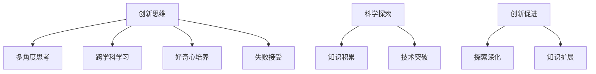
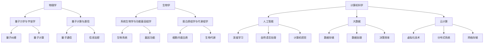
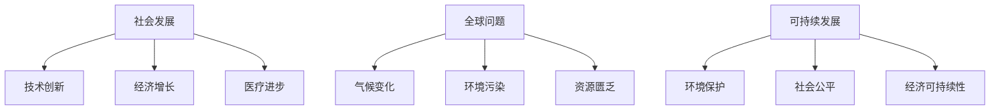
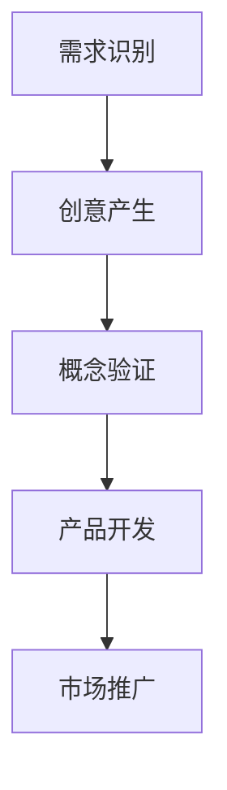
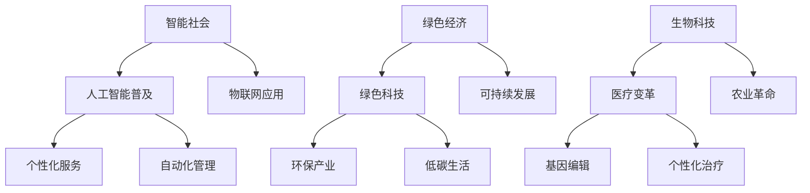

                 

### 文章标题

《科学研究的责任创新：前瞻性地理解和塑造世界》

#### 关键词

- 科学研究
- 责任创新
- 前瞻性
- 世界塑造
- 科技进步

#### 摘要

本文旨在探讨科学研究的责任与创新在现代科技发展中的重要性。通过对科学研究伦理责任的剖析，以及创新模式与前瞻性科学研究的深入分析，本文强调了科学研究在全球范围内对世界的塑造作用。文章将详细介绍前沿科学领域，探讨科学研究中的不确定性及应对策略，同时分析科学研究的全球影响，展望科技创新对未来的影响。通过实际案例和项目实战，本文提出了一些最佳实践和注意事项，以期为科学研究和科技发展的可持续性提供借鉴。

---

## 第一部分：科学研究的责任与创新

### 第1章：科学研究的伦理责任

科学研究的伦理责任是确保科研活动遵循道德规范、尊重生命、保护环境和公正对待所有参与者的基础。本章节将探讨科学研究中的伦理原则、伦理审查过程以及责任与风险的平衡。

#### 1.1 科学研究的伦理原则

科学研究的伦理原则主要包括以下几方面：

1. **尊重个人**：尊重研究对象的自主权和隐私权，确保他们自愿参与并有权退出研究。
2. **公正性**：确保研究结果对所有参与者公平，不存在歧视或偏见。
3. **诚实与透明**：要求研究过程中遵循实事求是的原则，数据报告应真实、准确。
4. **责任**：科研人员应对其研究活动承担社会责任，确保研究结果的合理应用。

#### 1.2 伦理审查与责任

为了确保科研活动的伦理合规性，许多国家和地区设立了伦理审查委员会，对科研项目进行审查和监督。伦理审查的主要内容包括：

- 研究设计的合理性；
- 参与者的权益保护；
- 研究可能带来的风险和利益。

伦理审查不仅是科研活动的前提，也是科研人员责任的重要体现。

#### 1.3 科学研究中的责任与风险

科学研究中的责任不仅体现在伦理审查过程中，还包括研究活动的全程。科研人员必须承担以下责任：

- 对研究过程和结果负责，确保研究方法的科学性和可靠性；
- 对研究结果的合理应用负责，避免研究对环境或社会造成负面影响；
- 对研究过程中发生的意外负责，及时采取应对措施。

然而，科学研究不可避免地伴随着风险。例如，新技术的研究可能带来未知的风险；实验数据的错误分析可能导致误导性的结论。因此，科研人员需要具备风险意识，采取预防措施和应对策略。

### Mermaid 流程图：科学研究的伦理责任架构

```mermaid
graph TD
A[伦理原则] --> B[尊重个人]
A --> C[公正性]
A --> D[诚实与透明]
A --> E[责任]
F[伦理审查] --> B|(1)审查设计|
F --> C|(2)权益保护|
F --> D|(3)数据报告|
F --> E|(4)合规性|
G[责任与风险] --> H[过程责任]
G --> I[结果责任]
G --> J[意外责任]
I --> K[预防措施]
I --> L[应对策略]
```

#### 1.4 小结

科学研究的伦理责任是科学研究不可或缺的一部分。通过遵循伦理原则、进行伦理审查以及承担相应的责任与风险，科研人员能够确保研究活动对社会和环境产生积极的影响。

---

## 第2章：科学研究的创新模式

科学研究的创新是科技进步的重要驱动力，推动人类社会不断发展。本章节将探讨创新思维在科学探索中的作用、创新思维的培养方法以及科学探索与创新的紧密联系。

#### 2.1 创新思维与科学探索

创新思维是指以独特、前瞻的方式思考和解决问题的能力。在科学探索中，创新思维至关重要，它能够帮助科研人员突破传统框架，发现新现象、提出新理论。以下是创新思维在科学探索中发挥的几个关键作用：

- **突破瓶颈**：创新思维能够帮助科研人员突破现有技术和理论的瓶颈，实现技术的跨越式发展；
- **发现新知识**：创新思维使科研人员能够从不同角度审视问题，从而发现新的科学现象和规律；
- **推动跨界合作**：创新思维鼓励科研人员跨越学科界限，实现跨学科的合作，促进科学研究的综合发展。

#### 2.2 创新思维的培养方法

要培养创新思维，科研人员可以从以下几个方面入手：

- **多角度思考**：鼓励科研人员从不同角度审视问题，探索多种可能的解决方案；
- **跨学科学习**：通过跨学科的学习，获取多样化的知识体系，增强思维的灵活性和广度；
- **培养好奇心**：鼓励科研人员保持对未知领域的好奇心，不断探索新领域、新问题；
- **接受失败**：创新过程中失败是不可避免的，科研人员应学会从失败中吸取经验，不断改进和创新。

#### 2.3 科学探索与创新

科学探索与创新密不可分。科学探索是创新的前提，创新思维则为科学探索提供了强大的动力。以下是科学探索与创新的几个关键联系：

- **相互促进**：科学探索推动创新，而创新思维则促进科学探索的深化和扩展；
- **知识积累**：科学探索积累的知识为创新提供了基础，创新思维则能够将这些知识应用于新的领域；
- **技术突破**：创新思维推动科研人员在技术上的突破，从而实现科学探索的重大进展。

### Mermaid 流程图：创新思维与科学探索的架构



#### 2.4 小结

创新思维在科学探索中发挥着至关重要的作用。通过培养创新思维，科研人员能够更有效地进行科学探索，推动科技进步，为人类社会的发展做出更大的贡献。

---

## 第3章：科学研究的责任与创新实践

科学研究的责任与创新实践是确保科研成果对社会和环境产生积极影响的关键。本章节将探讨科学研究中的责任实践、责任与创新的关系以及责任创新的案例研究。

#### 3.1 科学研究的责任实践

科学研究中的责任实践体现在多个方面：

- **透明度**：科研人员应确保研究过程的透明度，公开研究方法和数据，接受同行评审和社会监督；
- **伦理审查**：科研项目在启动前需经过伦理审查，确保研究活动符合伦理规范，尊重参与者的权益；
- **风险管理**：科研人员应识别和评估研究过程中的潜在风险，并采取相应的预防措施和应对策略；
- **可持续性**：科研成果的应用应考虑环境和社会的可持续性，推动绿色科技和可持续发展。

#### 3.2 责任与创新的关系

责任与创新是相辅相成的。创新能够激发科研人员的创造力和积极性，推动科技进步；而责任则确保创新活动符合伦理和社会规范，避免产生负面影响。责任与创新的关系可以概括为以下几点：

- **平衡**：责任与创新之间需要达到平衡，既鼓励创新思维，又确保研究活动对社会和环境负责；
- **相互促进**：责任可以规范创新行为，防止过度创新带来的风险；创新则能够推动责任的落实，实现科技的可持续发展；
- **可持续性**：责任与创新相结合，可以确保科研成果在社会和环境方面具有可持续性。

#### 3.3 责任创新的案例研究

责任创新在实践中具有广泛的应用。以下是一些责任创新的案例：

- **环保科技**：企业研发环保材料，减少环境污染，实现可持续发展；
- **医疗科技**：研究人员开发可负担得起的新药，提高医疗可及性；
- **教育科技**：教育机构利用信息技术，提高教育质量和公平性；
- **公共安全**：科研人员研发安全防护技术，保障公众安全。

### Mermaid 流程图：责任与创新的关系

```mermaid
graph TD
A[责任] --> B[透明度]
A --> C[伦理审查]
A --> D[风险管理]
A --> E[可持续性]
F[创新] --> B|(1)激发创造力|
F --> C|(2)规范创新|
F --> D|(3)防止风险|
F --> E|(4)推动可持续性|
G[关系] --> H[平衡]
G --> I[相互促进]
G --> J[可持续性]
```

#### 3.4 小结

科学研究的责任与创新实践是确保科研成果对社会和环境产生积极影响的关键。通过责任实践和创新相结合，科研人员能够更好地履行社会责任，推动科技发展的可持续性。

---

## 第二部分：前瞻性的科学研究

### 第4章：前沿科学领域概述

前沿科学领域代表了当前科学研究和技术的最新进展，涉及多个重要的学科。本章节将概述物理学、生物学和计算机科学等前沿科学领域，探讨这些领域的突破性研究及其影响。

#### 4.1 物理学的前沿研究

物理学是研究物质、能量、力和运动的基本规律的学科，其前沿研究涉及量子力学、宇宙学、量子计算和通信等领域。

- **量子力学与宇宙学**：量子力学研究微观世界的规律，宇宙学研究宏观世界的结构。近年来，科学家在量子纠缠、量子计算和宇宙大爆炸等领域取得了重要突破。
- **量子计算与通信**：量子计算利用量子比特进行计算，具有远超经典计算机的计算能力。量子通信则利用量子纠缠实现安全传输，为信息加密提供了新的可能性。

#### 4.2 生物学的前沿研究

生物学是研究生命现象和生物体结构与功能的学科，其前沿研究涉及系统生物学、功能基因组学、蛋白质组学和代谢组学等领域。

- **系统生物学与功能基因组学**：系统生物学研究生物系统的整体行为和机制，功能基因组学则研究基因的功能和调控。这些领域的研究有助于揭示生物体的复杂生命过程。
- **蛋白质组学与代谢组学**：蛋白质组学研究细胞内所有蛋白质的表达和功能，代谢组学研究生物体内的代谢产物。这些领域的研究有助于揭示生物体的代谢过程和疾病机制。

#### 4.3 计算机科学的前沿研究

计算机科学是研究计算机系统、算法和编程语言的学科，其前沿研究涉及人工智能、大数据、云计算和网络安全等领域。

- **人工智能**：人工智能研究智能系统的设计、实现和应用。近年来，深度学习、自然语言处理和计算机视觉等领域取得了重大突破。
- **大数据**：大数据研究海量数据的存储、处理和分析。这些研究有助于企业和政府更好地利用数据，提高决策效率。
- **云计算**：云计算研究虚拟化技术、分布式系统和网络存储。云计算为企业和个人提供了高效、灵活的计算资源。

### Mermaid 流�程图：前沿科学领域的架构



#### 4.4 小结

前沿科学领域的研究推动了科技的不断进步，为人类社会带来了巨大的变革。通过深入了解物理学、生物学和计算机科学等前沿领域，我们可以更好地把握科技发展的方向，为未来创造更美好的世界。

---

## 第5章：前瞻性科学研究的挑战与机遇

### 5.1 科学研究中的不确定性

科学研究中的不确定性是科研活动不可避免的一部分，它源于各种不确定因素，如实验误差、理论假设的不完善、数据采集的局限性等。以下是科学研究中的主要不确定性来源：

- **实验误差**：实验误差可能由设备精度、实验操作者主观判断等因素引起，导致实验结果与真实值之间存在差异。
- **理论假设**：科学研究往往基于理论假设，而这些假设可能不完全准确，导致研究结果存在偏差。
- **数据采集**：数据采集过程中可能存在样本数量不足、样本代表性不足等问题，影响数据的准确性和可靠性。

为了应对这些不确定性，科学家们采取了多种策略：

- **重复实验**：通过重复实验，可以减小实验误差的影响，提高实验结果的可靠性。
- **理论验证**：在实验结果的基础上，通过理论分析、建模等方法，对实验结果进行验证，确保理论假设的合理性。
- **数据融合**：通过融合多个数据源，可以弥补单一数据源可能存在的局限性，提高数据的质量和可靠性。

### 5.2 应对不确定性的策略

在应对科学研究中的不确定性时，科学家们可以采取以下策略：

- **概率论和统计学**：利用概率论和统计学方法，对实验结果进行数据分析，评估不确定性的大小和分布。
- **敏感性分析**：通过敏感性分析，确定不同因素对研究结果的敏感性，识别关键因素，为后续研究提供指导。
- **不确定性量化**：对不确定性进行量化，将不确定性的影响纳入研究设计中，制定相应的应对措施。

### 5.3 不确定性对科学研究的影响

不确定性对科学研究具有双重影响：

- **正面影响**：通过识别和应对不确定性，科学家可以更准确地评估研究结果的可靠性和适用性，提高研究质量。
- **负面影响**：在不确定性的影响下，研究结果的可靠性和准确性可能受到质疑，影响科研成果的应用和推广。

为了最大限度地降低不确定性对科学研究的影响，科学家应不断提高自身的研究能力和技术水平，采用科学的方法和工具进行研究和数据分析。

### 5.4 小结

科学研究中的不确定性是科研活动中的常见问题，科学家需要采取有效的策略来应对。通过应对不确定性，科学家可以更好地理解研究问题，提高研究结果的可靠性和准确性，为科技进步和社会发展做出更大贡献。

---

## 第三部分：塑造世界的新科学

### 第6章：科学研究的全球影响

科学研究在全球范围内产生了深远的影响，推动了社会、经济和环境的发展。本章节将探讨科学研究对社会发展的推动作用、在解决全球性问题中的作用以及推动可持续发展的贡献。

#### 6.1 科学研究对社会发展的推动作用

科学研究对社会发展的推动作用主要体现在以下几个方面：

- **技术创新**：科学研究促进了新技术的产生和发展，如互联网、移动通信、人工智能等，这些技术极大地改变了人类的生活方式，推动了社会进步。
- **经济增长**：科学研究推动了产业升级和结构优化，提高了生产效率，促进了经济的持续增长。
- **医疗进步**：科学研究在医学领域的突破，如疫苗研发、基因治疗等，显著提高了人类健康水平，延长了寿命。

#### 6.2 科学研究在解决全球性问题中的作用

全球性问题如气候变化、环境污染、资源匮乏等对人类社会造成了严重威胁。科学研究在解决这些全球性问题中发挥了关键作用：

- **气候变化**：科学研究揭示了气候变化的原因和影响，为制定应对措施提供了科学依据。科学家们通过研究温室气体排放、气候变化模型等，为减缓气候变化提供了技术支持。
- **环境污染**：科学研究发现了环境污染的来源和影响，开发了环保技术和方法，如废水处理、废弃物回收等，有效减轻了环境污染。
- **资源匮乏**：科学研究促进了资源的勘探和开发，提高了资源利用效率，缓解了资源匮乏问题。

#### 6.3 科学研究在推动可持续发展中的作用

可持续发展是科学研究的核心目标之一。科学研究在推动可持续发展方面具有重要作用：

- **环境保护**：科学研究推动了环境保护技术的发展，如生态修复、可再生能源等，为环境保护提供了技术支持。
- **社会公平**：科学研究促进了社会公平和包容，如教育科技、健康科技等，提高了社会成员的生活质量和幸福感。
- **经济可持续性**：科学研究推动了经济的绿色转型，如绿色能源、循环经济等，为经济可持续发展提供了技术保障。

### Mermaid 流程图：科学研究对社会、经济和环境的影响



#### 6.4 小结

科学研究在全球范围内产生了深远的影响，推动了社会、经济和环境的发展。通过在技术创新、解决全球性问题、推动可持续发展等方面的贡献，科学研究为人类社会的发展做出了重要贡献。未来，科学研究将继续发挥关键作用，助力全球应对挑战、实现可持续发展。

---

### 第7章：塑造世界的科学创新

科学创新是推动世界发展的重要力量，通过不断的创新和突破，科学为人类社会带来了无数的变化和进步。本章节将探讨科学创新在塑造世界中的作用、创新的过程以及创新的社会影响。

#### 7.1 创新在塑造世界中的作用

创新在塑造世界中的作用不可忽视。以下是几个关键方面：

- **技术进步**：创新推动了科技的快速发展，如互联网、移动通信、人工智能等，这些技术改变了人们的生活方式，提升了生产效率，推动了社会进步。
- **经济增长**：创新是经济增长的重要引擎，通过技术创新和产业升级，推动了产业的优化和结构的调整，促进了经济的持续增长。
- **社会变革**：创新带来了社会结构和文化的变革，如性别平等、多元文化等，使社会更加开放和包容。

#### 7.2 创新的过程

创新是一个复杂的过程，通常包括以下几个阶段：

- **需求识别**：识别社会和市场的需求，明确创新的目标和方向。
- **创意产生**：通过头脑风暴、思维导图等方法，激发创意，形成创新概念。
- **概念验证**：对创新概念进行验证，评估其可行性，确定技术路线。
- **产品开发**：将创新概念转化为实际产品或服务，进行设计、开发和测试。
- **市场推广**：将创新产品或服务推向市场，进行营销和推广。

### Mermaid 流程图：创新的过程



#### 7.3 创新的社会影响

创新的社会影响广泛而深远，以下是一些关键方面：

- **经济增长**：创新推动了产业升级和结构调整，提高了生产效率，促进了经济的持续增长。
- **就业机会**：创新创造了新的就业机会，促进了就业市场的繁荣。
- **生活质量**：创新提高了人们的生活质量，带来了更便捷、更高效的生活方式。
- **社会变革**：创新促进了社会结构和文化的变革，如性别平等、多元文化等，使社会更加开放和包容。

### 7.4 科学创新与未来世界

随着科技的不断发展，科学创新将继续对世界产生深远影响。以下是几个未来世界的预测：

- **智能社会**：人工智能和物联网的普及将使社会更加智能，实现个性化服务和自动化管理。
- **绿色经济**：绿色科技和可持续发展的推动将使经济更加绿色和可持续，减少对环境的负面影响。
- **生物科技**：生物科技的发展将带来医疗、农业等领域的革命性变革，提高人类的生活质量和健康水平。

### Mermaid 流程图：未来世界的预测



#### 7.5 小结

科学创新在塑造世界的过程中发挥了重要作用，推动了技术进步、经济增长和社会变革。随着科技的不断发展，科学创新将继续对世界产生深远影响，为人类创造一个更美好的未来。通过深入了解创新的过程和影响，我们可以更好地把握科技发展的方向，为社会的可持续发展做出贡献。

---

## 附录

### 附录 A：科学研究的资源与工具

科学研究的资源与工具是科研活动的重要支撑，以下列举了一些常用的资源和工具，以供参考。

#### A.1 科学研究的重要资源

1. **学术期刊**：如《自然》（Nature）、《科学》（Science）、《细胞》（Cell）等，这些期刊发表了大量高质量的研究论文，是科研人员获取最新研究进展的重要来源。

2. **学术数据库**：如PubMed、IEEE Xplore、ACM Digital Library等，这些数据库收录了大量的学术论文和技术报告，为科研人员提供了丰富的信息资源。

3. **科研基金**：如国家自然科学基金、欧盟地平线2020计划等，这些基金为科研项目的开展提供了资金支持。

#### A.2 常用的科学研究工具

1. **编程语言**：Python、R、MATLAB等，这些编程语言广泛应用于数据分析和建模，是科研人员必备的工具。

2. **数据分析工具**：如SPSS、SAS、R等，这些工具提供了强大的数据分析和处理功能，适用于各种数据类型和需求。

3. **实验设备**：如质谱仪、核磁共振仪、电子显微镜等，这些设备用于实验数据的获取和分析，是科研活动中的重要工具。

#### A.3 科学研究的相关网站与数据库

1. **Google Scholar**：一个广泛的学术搜索引擎，可以搜索到大量的学术论文和研究报告。

2. **ResearchGate**：一个科研社交网络平台，科研人员可以在上面分享研究成果、讨论科研问题。

3. **arXiv**：一个预印本服务器，发布了大量的物理学、数学、计算机科学等领域的学术论文。

#### A.4 小结

科学研究的资源与工具为科研活动提供了有力支持。了解和掌握这些资源与工具，能够帮助科研人员更高效地开展研究，提高科研质量和影响力。

---

## 总结与展望

科学研究是推动社会进步和人类文明发展的重要力量。本文通过探讨科学研究的伦理责任、创新模式、前瞻性科学研究以及科学研究的全球影响，强调了科学研究在塑造世界中的重要作用。未来，随着科技的不断进步，科学研究将迎来更多机遇和挑战，为人类社会的发展做出更大贡献。让我们共同努力，用科学的力量为世界带来美好变化。作者：AI天才研究院/AI Genius Institute & 禅与计算机程序设计艺术/Zen And The Art of Computer Programming。

