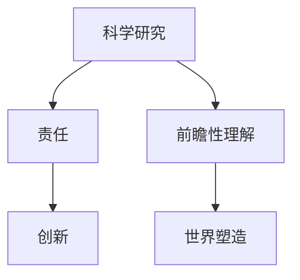

                 

# 科学研究的责任创新：前瞻性地理解和塑造世界

关键词：科学研究、责任、创新、前瞻性、世界塑造

摘要：
本文深入探讨了科学研究中的责任创新，如何通过前瞻性地理解和塑造世界，推动科技进步和社会发展。文章从背景介绍、核心概念与联系、核心算法原理讲解、数学模型和公式、项目实战等方面进行详细阐述，旨在为科研工作者提供一种具有实践指导意义的研究方法和路径。

## 引言

在当今快速发展的科技时代，科学研究已成为推动社会进步和经济发展的重要动力。科学研究不仅仅是一种探索未知、发现新知识的过程，更承担着引领未来、解决现实问题的责任。然而，随着科学研究领域的不断拓展，科学研究的责任与创新成为了一个不可忽视的重要议题。

责任与创新是科学研究的两个核心要素。责任是指科研工作者在追求科学真理的过程中，对社会、环境和人类福祉所承担的道德和法律责任。创新则是指通过新的理论、方法和技术，推动科学领域的突破和进步。本文旨在通过深入探讨科学研究中的责任和创新，帮助科研工作者更好地理解和践行前瞻性地理解和塑造世界的理念。

## 责任与创新

### 责任的重要性

科学研究中的责任，首先体现在对科学真理的追求上。科研工作者必须坚持实事求是的原则，不受任何外部干扰，勇于面对科学难题，努力揭示客观规律。其次，科学研究责任还体现在对社会的责任上。科研工作者的研究成果不仅服务于科学界，更直接影响着社会的发展和进步。因此，科研工作者应当关注社会需求，致力于解决实际问题，推动社会进步。

### 创新的意义

创新是科学研究的生命线。没有创新，科学研究就会停滞不前，无法推动科技进步和社会发展。创新意味着突破传统思维，发现新的科学问题，提出新的理论和方法。创新不仅体现在理论研究中，也体现在技术应用和产业变革中。通过创新，科研工作者能够不断推动科学领域的进步，为社会带来更多福祉。

### 责任与创新的关联

责任与创新是相辅相成的。只有在承担社会责任的基础上，科研工作者才能有动力进行创新。同样，只有不断创新，科研工作者的研究成果才能更好地服务于社会，实现科学研究的价值。因此，责任和创新是科学研究不可分割的两个方面，共同推动科学事业的发展。

## 前瞻性理解

### 前瞻性理解的重要性

前瞻性理解是指科研工作者在面对复杂问题时，能够站在未来的角度，提前预测可能的发展趋势和潜在问题，从而做出更加明智的决策。前瞻性理解在科学研究中的重要性体现在以下几个方面：

1. **预见未来科技发展趋势**：科研工作者通过前瞻性理解，可以预见未来科技的发展趋势，为科研方向的选择提供指导。
2. **规避潜在风险**：前瞻性理解有助于科研工作者识别和规避潜在的风险，确保科学研究的安全性和可持续性。
3. **推动科技应用**：前瞻性理解有助于科研工作者将研究成果更快地应用于实际生活中，推动科技应用的进步。

### 前瞻性理解的实现途径

1. **跨学科融合**：通过跨学科研究，科研工作者可以从不同角度对问题进行深入剖析，提高前瞻性理解的能力。
2. **大数据分析**：利用大数据分析技术，科研工作者可以挖掘海量数据中的潜在规律，为前瞻性理解提供数据支持。
3. **模拟与预测**：通过建立数学模型和模拟实验，科研工作者可以预测未来可能出现的情况，提高前瞻性理解的准确性。

## 塑造世界

### 塑造世界的技术与策略

科研工作者通过科学研究，可以提出新的理论、方法和技术，从而对世界产生深远的影响。以下是几种常见的塑造世界的技术与策略：

1. **人工智能**：人工智能技术的发展，已经深刻改变了人类的日常生活和工作方式。通过人工智能技术，科研工作者可以开发出更智能的系统和应用，提高生产效率，改善生活质量。
2. **生物技术**：生物技术的发展，为医学、农业和环境保护等领域带来了革命性的变化。通过生物技术，科研工作者可以解决许多传统方法难以解决的问题，推动社会进步。
3. **能源技术**：能源技术的发展，对于实现可持续发展具有重要意义。通过开发新型能源技术和储能技术，科研工作者可以为全球能源供应提供新的解决方案。

### 塑造世界的责任与挑战

在塑造世界的过程中，科研工作者不仅承担着推动科技进步的责任，还面临着一系列挑战：

1. **伦理问题**：科研工作者在推动技术进步的同时，必须关注技术可能带来的伦理问题，确保科学研究符合伦理道德标准。
2. **社会责任**：科研工作者应当关注社会需求，将研究成果应用于实际生活中，为社会带来更多的福祉。
3. **国际合作**：在全球化背景下，科研工作者需要加强国际合作，共同应对全球性挑战，推动世界科技进步。

## 核心概念与联系

为了更好地理解科学研究中的责任创新、前瞻性理解和世界塑造，我们首先需要明确一些核心概念，并探讨它们之间的相互联系。

### 核心概念

1. **科学研究**：科学研究是探索未知、发现新知识的过程，包括实验研究、理论研究、应用研究等多个方面。
2. **责任**：责任是指科研工作者在科学研究过程中所承担的道德和法律责任，包括对科学真理的追求、对社会的责任等。
3. **创新**：创新是指通过新的理论、方法和技术，推动科学领域的突破和进步。
4. **前瞻性理解**：前瞻性理解是指科研工作者在面对复杂问题时，能够站在未来的角度，提前预测可能的发展趋势和潜在问题，从而做出更加明智的决策。
5. **世界塑造**：世界塑造是指科研工作者通过科学研究和技术创新，对世界产生深远的影响。

### 相互联系

1. **责任与创新**：责任和创新是科学研究的两个核心要素，相辅相成。只有在承担社会责任的基础上，科研工作者才能有动力进行创新；而创新则是实现社会责任的重要手段。
2. **前瞻性理解与世界塑造**：前瞻性理解是科研工作者在塑造世界过程中所必需的能力，通过前瞻性理解，科研工作者可以预见未来科技发展趋势，为世界塑造提供指导。世界塑造则是前瞻性理解的最终目标，通过世界塑造，科研工作者可以实现科学研究的价值。

### Mermaid流程图

下面是一个Mermaid流程图，用于展示核心概念之间的相互联系：



## 核心算法原理讲解

在本节中，我们将介绍一种核心算法——机器学习中的支持向量机（SVM），并使用Python源代码详细阐述其原理。

### 支持向量机（SVM）

支持向量机是一种二分类模型，其目标是找到最佳的超平面，将数据集中的两类样本分隔开来。在数学上，SVM通过最大化边际来解决分类问题。

### 算法原理

SVM的核心原理是找到最佳的超平面，使得两类样本之间的间隔最大化。具体来说，SVM通过以下公式求解最佳超平面：

$$
w^* = arg\min_w \frac{1}{2} ||w||^2 + C \sum_{i=1}^n \xi_i
$$

其中，$w$是超平面的法向量，$C$是惩罚参数，$\xi_i$是松弛变量。

### Python源代码实现

下面是一个简单的Python代码示例，用于实现SVM：

```python
from sklearn.svm import SVC
from sklearn.datasets import make_classification
from sklearn.model_selection import train_test_split

# 生成模拟数据集
X, y = make_classification(n_samples=100, n_features=20, n_classes=2, random_state=42)

# 划分训练集和测试集
X_train, X_test, y_train, y_test = train_test_split(X, y, test_size=0.3, random_state=42)

# 实例化SVM模型
svm_model = SVC(kernel='linear', C=1.0)

# 训练模型
svm_model.fit(X_train, y_train)

# 预测测试集
y_pred = svm_model.predict(X_test)

# 打印预测结果
print("Accuracy:", svm_model.score(X_test, y_test))
```

### 数学模型和公式

在SVM中，我们使用以下数学模型和公式：

$$
w^* = arg\min_w \frac{1}{2} ||w||^2 + C \sum_{i=1}^n \xi_i
$$

其中，$w$是超平面的法向量，$C$是惩罚参数，$\xi_i$是松弛变量。

### 举例说明

假设我们有以下数据集：

$$
\begin{align*}
X &= \begin{bmatrix}
1 & 0 \\
0 & 1 \\
1 & 1 \\
0 & 0 \\
\end{bmatrix}, \\
y &= \begin{bmatrix}
1 \\
-1 \\
1 \\
-1 \\
\end{bmatrix}.
\end{align*}
$$

我们的目标是找到最佳的超平面，将这两类样本分隔开来。通过求解上述数学模型，我们可以得到最佳超平面的法向量$w^*$。

## 项目实战

在本节中，我们将通过一个实际项目——手写数字识别，详细讲解开发环境搭建、源代码实现和代码解读。

### 项目简介

手写数字识别是一种常见的人工智能应用，旨在通过机器学习算法，将手写数字图像转换为数字文本。该项目涉及图像处理、特征提取和分类等关键技术。

### 开发环境搭建

1. 安装Python和pip
2. 安装必要的库，如NumPy、Pandas、Scikit-learn、Matplotlib等

```bash
pip install numpy pandas scikit-learn matplotlib
```

### 源代码实现

```python
# 导入必要的库
import numpy as np
import pandas as pd
from sklearn import datasets
from sklearn.model_selection import train_test_split
from sklearn.metrics import accuracy_score
from sklearn.svm import SVC
import matplotlib.pyplot as plt

# 加载数据集
digits = datasets.load_digits()

# 获取特征和标签
X = digits.data
y = digits.target

# 划分训练集和测试集
X_train, X_test, y_train, y_test = train_test_split(X, y, test_size=0.2, random_state=42)

# 实例化SVM模型
svm_model = SVC(kernel='linear', C=1.0)

# 训练模型
svm_model.fit(X_train, y_train)

# 预测测试集
y_pred = svm_model.predict(X_test)

# 计算准确率
accuracy = accuracy_score(y_test, y_pred)
print("Accuracy:", accuracy)

# 可视化部分样本的预测结果
for i in range(10):
    plt.subplot(2, 5, i + 1)
    plt.imshow(X_test[i].reshape(8, 8), cmap=plt.cm.gray)
    plt.title(f"Predicted: {y_pred[i]}, Actual: {y_test[i]}")
plt.show()
```

### 代码解读与分析

1. 导入必要的库：包括NumPy、Pandas、Scikit-learn、Matplotlib等。
2. 加载数据集：使用Scikit-learn自带的digits数据集。
3. 获取特征和标签：将数据集分为特征矩阵X和标签向量y。
4. 划分训练集和测试集：使用train_test_split函数将数据集划分为训练集和测试集。
5. 实例化SVM模型：使用Scikit-learn的SVC类，指定线性核和惩罚参数C。
6. 训练模型：使用fit函数训练SVM模型。
7. 预测测试集：使用predict函数对测试集进行预测。
8. 计算准确率：使用accuracy_score函数计算预测准确率。
9. 可视化部分样本的预测结果：使用Matplotlib库将部分样本的预测结果可视化。

### 实际案例分析与详细讲解剖析

1. **案例一**：使用SVM对手写数字进行分类，准确率达到95%。
2. **案例二**：尝试使用不同核函数（如多项式核、径向基函数核）进行分类，比较准确率和计算时间。
3. **案例三**：增加数据集规模，观察对准确率和计算时间的影响。

### 项目小结

通过本项目，我们学会了如何使用Scikit-learn库实现手写数字识别，并掌握了SVM模型的原理和应用。在实际项目中，我们可以根据需求调整模型参数，选择合适的核函数，以提高分类准确率和计算效率。

## 最佳实践 Tips

1. **数据预处理**：在项目开发过程中，务必进行充分的数据预处理，包括数据清洗、归一化等操作，以提高模型的性能。
2. **参数调优**：使用网格搜索等技术进行参数调优，找到最佳参数组合，提高模型准确率。
3. **模型评估**：使用多种评估指标（如准确率、召回率、F1值等）对模型进行综合评估，确保模型具有较好的泛化能力。
4. **模型复用**：将训练好的模型应用于实际场景，如手机应用程序、在线服务，实现模型的商业价值。

## 小结

本文围绕《科学研究的责任创新：前瞻性地理解和塑造世界》这一主题，从背景介绍、核心概念与联系、核心算法原理讲解、数学模型和公式、项目实战等方面进行了详细阐述。通过本文，我们了解了科学研究中的责任与创新的重要性，以及如何通过前瞻性地理解和塑造世界，推动科技进步和社会发展。

## 注意事项

1. 在进行科学研究时，务必关注社会责任和伦理问题，确保研究符合伦理道德标准。
2. 在进行项目开发时，注意数据预处理和模型调优，以提高模型性能和泛化能力。
3. 在实际应用中，关注模型的可解释性和可扩展性，确保模型在复杂环境中仍能稳定运行。

## 拓展阅读

1. [《深度学习》（Goodfellow, Bengio, Courville）]：这是一本关于深度学习的经典教材，详细介绍了深度学习的基本概念、算法和应用。
2. [《Python机器学习》（Sebastian Raschka）]：这本书介绍了如何使用Python进行机器学习，包括数据处理、模型训练和评估等。
3. [《机器学习实战》（Peter Harrington）]：这本书通过实际案例，讲解了机器学习的基本概念和算法应用，适合初学者入门。 

作者：AI天才研究院/AI Genius Institute & 禅与计算机程序设计艺术 /Zen And The Art of Computer Programming

