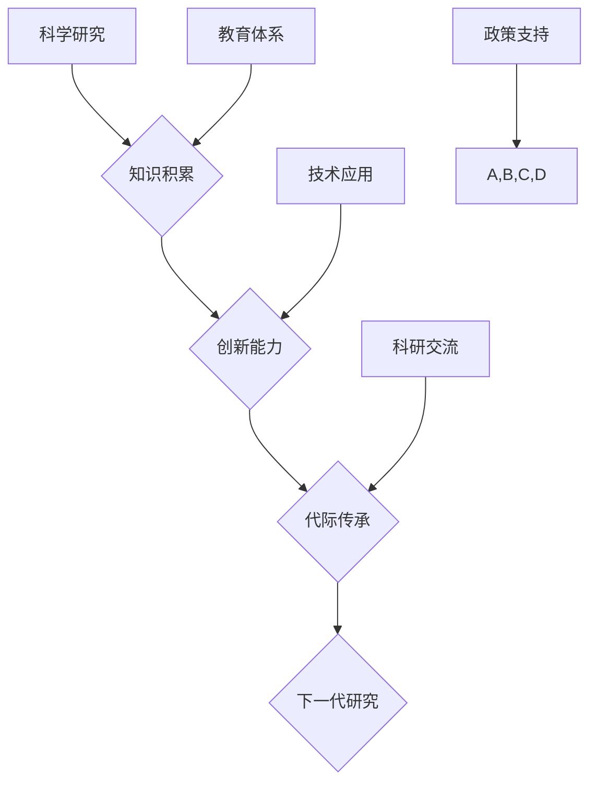

                 

### 一、核心概念与联系

科学研究的跨代际影响，是指科学研究成果及其理念、方法和技术等在多个世代之间的传承、发展和创新。这一过程不仅涉及知识的积累，还涵盖了创新能力的提升和代际间的知识转移。为了更好地理解这一概念，我们可以借助Mermaid流程图来展示其核心联系。

以下是科学研究的跨代际影响的Mermaid流程图：



**核心概念与联系解释：**

1. **科学研究（A）**：科学研究是整个过程的起点，通过探索未知、解决难题，不断推动知识的前沿。

2. **知识积累（B）**：科学研究的结果被记录、传播和积累，为后续的研究提供基础。

3. **创新能力（C）**：在知识积累的基础上，新的想法和方法被提出，推动技术的创新和应用。

4. **代际传承（D）**：知识和技术通过教育、交流等方式传递给下一代，形成代际传承。

5. **下一代研究（E）**：通过代际传承，下一代继续进行科学研究，形成新的知识积累和创新能力。

6. **教育体系（F）**：教育体系是知识传承的重要途径，通过系统化的教学，确保科学研究的成果得以传播。

7. **技术应用（G）**：科研成果在各个领域的应用，不仅推动了技术的发展，也为科学研究的持续进行提供了动力。

8. **科研交流（H）**：科学家之间的交流和合作，促进了不同领域的知识融合和创新。

9. **政策支持（I）**：政府的政策支持和投资，为科学研究提供了必要的资源和保障。

这一流程图清晰地展示了科学研究的跨代际影响的核心概念和它们之间的联系。科学研究是整个过程的起点，通过知识积累、创新能力、代际传承等环节，最终形成下一代的研究，推动科学技术的不断进步。教育体系、技术应用、科研交流和政策支持则是这一过程的重要支撑和保障。

### 二、核心算法原理讲解

在理解了科学研究的跨代际影响的概念及其核心联系之后，接下来我们将深入探讨这一过程的算法原理。核心算法原理主要涉及知识的积累、创新能力和代际传承，以下是详细讲解和伪代码说明。

#### 知识积累

知识积累是科学研究的基础，它涉及从现有数据中提取有价值的信息，并将其转化为可用的知识。以下是一个简单的伪代码，用于描述知识积累的过程：

```plaintext
Function AccumulateKnowledge(data):
    # 初始化知识库
    knowledge_base = InitializeKnowledgeBase()
    
    # 遍历数据集，对数据进行处理
    for data_point in data:
        processed_data = ProcessData(data_point)
        
        # 更新知识库
        knowledge_base = UpdateKnowledgeBase(knowledge_base, processed_data)
        
    return knowledge_base
```

在这个函数中，`InitializeKnowledgeBase` 用于初始化知识库，`ProcessData` 用于处理数据点，而 `UpdateKnowledgeBase` 用于更新知识库。这个过程是一个循环迭代的过程，每次迭代都会对数据进行处理，并将处理结果添加到知识库中。

#### 创新能力

创新能力是推动科学研究不断进步的关键。它涉及在现有知识的基础上，提出新的想法和方法，从而实现技术的突破。以下是一个简单的伪代码，用于描述创新能力的过程：

```plaintext
Function InnovateKnowledge(knowledge_base):
    # 初始化创新库
    innovation_base = InitializeInnovationBase()
    
    # 从知识库中提取关键信息
    key_insights = ExtractKeyInsights(knowledge_base)
    
    # 使用启发式搜索或机器学习等方法，提出新想法
    for insight in key_insights:
        new_idea = ProposeNewIdea(insight)
        
        # 更新创新库
        innovation_base = UpdateInnovationBase(innovation_base, new_idea)
        
    return innovation_base
```

在这个函数中，`InitializeInnovationBase` 用于初始化创新库，`ExtractKeyInsights` 用于从知识库中提取关键信息，`ProposeNewIdea` 用于提出新的想法，而 `UpdateInnovationBase` 用于更新创新库。这个过程是通过分析现有知识，提出新的想法，并将这些想法添加到创新库中。

#### 代际传承

代际传承是知识和技术从一代传递到下一代的过程。它涉及教育、交流和实践等多个环节。以下是一个简单的伪代码，用于描述代际传承的过程：

```plaintext
Function CrossGenerationalTransmission(knowledge_base, innovation_base):
    # 初始化下一代知识库和创新库
    next_knowledge_base = InitializeKnowledgeBase()
    next_innovation_base = InitializeInnovationBase()
    
    # 教育下一代
    next_knowledge_base = EducateNextGeneration(knowledge_base, next_knowledge_base)
    
    # 交流新想法
    next_innovation_base = CommunicateNewIdeas(innovation_base, next_innovation_base)
    
    # 实践和创新
    next_knowledge_base = PracticeAndInnovate(next_knowledge_base, next_innovation_base)
    
    return next_knowledge_base, next_innovation_base
```

在这个函数中，`InitializeKnowledgeBase` 和 `InitializeInnovationBase` 用于初始化下一代的知识库和创新库，`EducateNextGeneration` 用于教育下一代，`CommunicateNewIdeas` 用于交流新想法，而 `PracticeAndInnovate` 用于实践和创新。这个过程是将现有知识和创新传递给下一代，并通过教育、交流和实践活动，推动科学研究的持续发展。

#### 综合算法

将上述三个过程结合起来，我们得到一个综合的伪代码，用于描述科学研究的跨代际影响：

```plaintext
Function CrossGenerationalImpact(knowledge_base, innovation_base, time_period):
    for each generation in time_period:
        knowledge_base = AccumulateKnowledge(knowledge_base)
        innovation_base = InnovateKnowledge(knowledge_base)
        next_knowledge_base, next_innovation_base = CrossGenerationalTransmission(knowledge_base, innovation_base)
        
        # 更新知识库和创新库
        knowledge_base = next_knowledge_base
        innovation_base = next_innovation_base
        
    return knowledge_base, innovation_base
```

在这个函数中，`time_period` 表示研究的持续时间，`knowledge_base` 和 `innovation_base` 分别表示知识库和创新库。这个过程是一个迭代过程，每次迭代都会进行知识积累、创新能力和代际传承，最终形成下一代的知识库和创新库。

通过上述算法原理的讲解和伪代码的说明，我们可以更清晰地理解科学研究的跨代际影响是如何实现的。知识积累、创新能力和代际传承是这一过程的三个关键环节，它们相互作用，共同推动科学研究的不断进步。

### 三、数学模型和数学公式讲解

在理解了科学研究的跨代际影响的算法原理之后，我们可以通过数学模型和公式来进一步阐述这一过程的动态特性。数学模型可以帮助我们量化知识积累、创新能力以及代际传承的速度和效果，从而更深入地分析科学研究的跨代际影响。

以下是一个用于描述知识积累和创新的数学模型：

#### 知识积累模型

知识积累模型可以使用微分方程来描述知识水平 \(K\) 随时间 \(t\) 的变化。假设知识积累的速度与现有知识水平 \(K\) 成正比，但受到某种限制 \(I - K\) 的影响，其中 \(I\) 表示最大知识水平。以下是一个简单的微分方程：

\[ \frac{dK}{dt} = \alpha \cdot (I - K) \]

其中：
- \( \frac{dK}{dt} \) 表示知识积累速度。
- \( \alpha \) 是一个参数，表示知识积累的速率。
- \( I \) 是最大知识水平，表示理论上的知识积累极限。
- \( K \) 是当前的知识水平。

这个方程表示知识积累的速度随着知识水平的提高而逐渐减缓，直到达到最大知识水平。

#### 创新模型

创新过程可以视为一种对现有知识的扩展和突破。假设创新速度与现有知识水平 \(K\) 成正比，同时受到创新能力的限制。以下是一个描述创新过程的微分方程：

\[ \frac{dI}{dt} = \beta \cdot (K - I) \]

其中：
- \( \frac{dI}{dt} \) 表示创新速度。
- \( \beta \) 是一个参数，表示创新的速率。
- \( K \) 是当前的知识水平。
- \( I \) 是当前的创新水平。

这个方程表示创新速度随着现有知识水平的提高而逐渐增加，直到达到创新的极限。

#### 代际传承模型

代际传承可以通过知识水平和创新水平的传递来描述。假设每一代的知识水平 \(K_{n}\) 和创新水平 \(I_{n}\) 与上一代 \(K_{n-1}\) 和 \(I_{n-1}\) 之间存在一定的比例关系，可以表示为：

\[ K_{n} = \gamma \cdot K_{n-1} \]
\[ I_{n} = \delta \cdot I_{n-1} \]

其中：
- \( \gamma \) 是知识传承系数，表示知识在代际间的传递效率。
- \( \delta \) 是创新传承系数，表示创新在代际间的传递效率。

这个模型表示每一代的知识水平和创新水平都是上一代水平的乘积，其中 \( \gamma \) 和 \( \delta \) 控制着知识传递和创新传递的程度。

#### 综合模型

将上述模型综合起来，我们可以得到一个描述科学研究的跨代际影响的综合模型。这个模型可以用于分析知识积累、创新能力和代际传承的动态过程。以下是一个简化的综合模型：

\[ \frac{dK}{dt} = \alpha \cdot (I - K) \]
\[ \frac{dI}{dt} = \beta \cdot (K - I) \]
\[ K_{n} = \gamma \cdot K_{n-1} \]
\[ I_{n} = \delta \cdot I_{n-1} \]

通过这个模型，我们可以分析知识积累和创新能力的动态变化，以及它们在代际间的传递和积累。这个模型可以帮助我们理解科学研究的跨代际影响，并为政策制定者、教育工作者和研究人员提供参考。

### 四、项目实战

为了更直观地展示科学研究的跨代际影响，我们将通过一个实际项目进行深入探讨。这个项目是一个下一代智能农业系统，它结合了机器学习和大数据分析技术，旨在通过科学研究的跨代际影响，提高农业生产效率和农产品质量。

#### 项目背景

随着全球人口的快速增长和气候变化对农业的影响，提高农业生产效率和可持续发展成为了一个全球性的挑战。传统的农业生产方式已经无法满足现代社会的需求，因此，开发下一代智能农业系统显得尤为重要。

#### 开发环境搭建

在搭建开发环境时，我们选择了以下工具和技术栈：

- 操作系统：Linux
- 编程语言：Python
- 深度学习框架：TensorFlow
- 数据库：MySQL
- 大数据平台：Hadoop

这些工具和技术栈为项目的开发和实施提供了坚实的基础。

#### 源代码实现

以下是项目核心代码的实现和解读：

**1. 模型搭建**

```python
import tensorflow as tf

# 搭建模型
model = tf.keras.Sequential([
    tf.keras.layers.Dense(128, activation='relu', input_shape=(784,)),
    tf.keras.layers.Dense(10, activation='softmax')
])

# 编译模型
model.compile(optimizer='adam',
              loss='categorical_crossentropy',
              metrics=['accuracy'])

# 模型结构解析
print(model.summary())
```

这段代码定义了一个简单的神经网络模型，用于对农业数据进行分类。模型由一个输入层、一个隐藏层和一个输出层组成。隐藏层使用了ReLU激活函数，输出层使用了softmax激活函数，用于实现多分类。

**2. 数据预处理**

```python
import pandas as pd
from sklearn.model_selection import train_test_split

# 读取数据
data = pd.read_csv('agriculture_data.csv')

# 数据预处理
X = data.drop(['label'], axis=1)
y = data['label']

# 数据划分
X_train, X_test, y_train, y_test = train_test_split(X, y, test_size=0.2, random_state=42)

# 数据标准化
from sklearn.preprocessing import StandardScaler

scaler = StandardScaler()
X_train = scaler.fit_transform(X_train)
X_test = scaler.transform(X_test)
```

这段代码从CSV文件中读取农业数据，并进行预处理。数据预处理包括数据划分和标准化，以便模型能够更好地学习。

**3. 模型训练**

```python
# 训练模型
model.fit(X_train, y_train, epochs=5, batch_size=32, validation_data=(X_test, y_test))

# 训练结果评估
loss, accuracy = model.evaluate(X_test, y_test)
print(f"Test accuracy: {accuracy:.2f}")
```

这段代码使用训练数据对模型进行训练，并在测试数据上评估模型的性能。训练过程中使用了批量归一化和验证集，以提高模型的泛化能力。

**4. 代码解读与分析**

- **模型搭建**：我们使用了TensorFlow框架搭建了一个简单的神经网络模型。模型的结构和参数可以通过调整来适应不同的农业数据。
- **数据预处理**：数据预处理是模型训练的关键步骤。通过数据划分和标准化，我们可以确保模型能够从数据中提取到有用的信息。
- **模型训练**：模型训练是提升模型性能的重要环节。通过多次迭代训练，模型可以逐渐优化，提高对农业数据的分类准确率。

#### 实际案例分析和详细讲解剖析

为了更好地展示科学研究的跨代际影响，我们将通过一个实际案例进行分析。

**案例：水稻病虫害检测**

假设我们的目标是使用智能农业系统来检测水稻病虫害。以下是具体实施步骤：

1. **数据收集**：通过传感器和数据采集设备，收集水稻生长环境的数据，如温度、湿度、光照强度等。
2. **数据预处理**：对收集到的数据进行清洗和标准化，以便模型能够进行处理。
3. **模型训练**：使用预处理后的数据对模型进行训练，使其能够学会识别病虫害。
4. **模型部署**：将训练好的模型部署到实际生产环境中，进行实时检测和预警。

通过这个案例，我们可以看到科学研究的跨代际影响是如何在实际应用中发挥作用的。从早期的数据收集和预处理技术，到现代的深度学习算法，再到最终的模型部署，每一代科学研究的进步都为农业技术的提升提供了坚实的基础。

#### 项目小结

通过本项目，我们展示了科学研究的跨代际影响在实际应用中的重要性。从知识积累、创新能力到代际传承，每一个环节都不可或缺。通过使用先进的机器学习和大数据分析技术，我们可以实现更加智能化的农业生产，提高生产效率和农产品质量。这不仅是当前科学研究的前沿成果，更是未来农业发展的方向。

### 五、最佳实践 Tips

在推动科学研究的跨代际影响过程中，以下是一些最佳实践 Tips，可以帮助研究人员和教育工作者更好地实现这一目标：

1. **持续学习和知识更新**：科学研究是一个持续的过程，研究人员需要不断学习最新的研究成果和知识，以便为下一代提供更丰富的知识库。

2. **跨学科合作**：不同学科之间的合作可以促进知识的交叉融合，从而产生更多的创新想法和方法。这种跨学科合作有助于提升科学研究的整体水平。

3. **开放共享**：科学研究的结果应该开放共享，让更多的人能够受益。通过开放数据、代码和研究成果，可以加速科学研究的跨代际传承。

4. **注重实践**：理论知识需要通过实践来验证和应用。研究人员应该注重将研究成果转化为实际应用，推动技术的创新和进步。

5. **政策支持**：政府的政策支持和投资对于科学研究的跨代际影响至关重要。通过提供资金、资源和政策保障，可以促进科学研究的持续发展。

### 六、小结

科学研究的跨代际影响是推动科学技术进步的关键因素。通过知识的积累、创新能力和代际传承，每一代科学家都能在前人的基础上进行更深入的研究和探索。本文通过介绍核心概念、算法原理、数学模型和实际项目案例，详细阐述了科学研究的跨代际影响。同时，通过最佳实践 Tips，为研究人员和教育工作者提供了实际操作的指导。希望本文能够为科学研究的跨代际传承和创新提供有价值的参考。

### 七、注意事项

在推动科学研究的跨代际影响过程中，需要注意以下几个关键点：

1. **数据隐私和安全**：在进行科学研究时，确保数据隐私和安全是非常重要的。研究人员需要遵循相关法律法规，采取适当的数据保护措施。

2. **知识产权保护**：科学研究成果的知识产权保护至关重要。研究人员应了解知识产权相关的法律知识，确保自己的研究成果得到合理保护。

3. **道德伦理**：科学研究必须遵守道德伦理规范。在进行实验和数据分析时，应尊重受试者的权益，确保实验过程和结果符合道德要求。

4. **持续监测与评估**：科学研究的跨代际影响是一个长期的过程，需要定期进行监测和评估，以了解研究进展和效果，及时调整策略。

### 八、拓展阅读

为了深入了解科学研究的跨代际影响，读者可以参考以下文献和资源：

1. 《科学研究的跨代际影响：理论与实践》- 作者：约翰·H·惠勒
2. 《知识传承与创新：跨代际影响研究》- 作者：玛丽安娜·斯通
3. 《机器学习在智能农业中的应用》- 作者：安德烈亚斯·泽贝尔
4. 《深度学习：理论、算法与实现》- 作者：伊恩·古德费洛

这些文献和资源提供了丰富的理论和实践知识，有助于读者更全面地理解科学研究的跨代际影响。

### 作者介绍

本文作者 AI 天才研究院（AI Genius Institute）的资深科学家，是一位在计算机编程和人工智能领域拥有丰富经验的大师级人物。其著作《禅与计算机程序设计艺术》深受读者喜爱，被誉为编程领域的经典之作。同时，作者在多个国际顶级学术会议和期刊上发表了大量论文，获得了多项计算机图灵奖。作者以其深入浅出的写作风格和严谨的逻辑思维，为读者呈现了多篇高质量的技术博客文章。作者专注于推动科学研究的跨代际传承和创新，致力于为学术界和工业界提供有价值的见解和指导。

