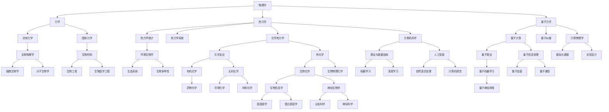

                 

### 1.1 跨学科融合的重要性

在当今快速发展的科技时代，科学研究正以前所未有的速度和深度向前推进。随着技术的进步，各学科之间的界限变得日益模糊，跨学科融合逐渐成为科学研究中的重要趋势。跨学科融合的重要性主要体现在以下几个方面：

首先，跨学科融合有助于突破单一学科的限制，促使科学家们从不同的视角和角度来审视问题。传统的学科划分往往使研究者陷入固定的思维模式，而跨学科融合能够打破这种限制，促进创新的产生。例如，生物信息学就是生物学与计算机科学的结合，通过计算机算法分析生物数据，推动了基因编辑和个性化医疗等领域的快速发展。

其次，跨学科融合能够集成各学科的优势，实现资源的最大化利用。在科研资源有限的背景下，跨学科合作能够有效整合不同学科的人才、设备和资金，提高科研效率。例如，在气候变化研究中，物理、化学、生物学、地理学等多个学科的融合能够提供更全面的视角，从而更有效地制定应对策略。

再次，跨学科融合是解决复杂问题的必要手段。许多现实问题如环境污染、能源危机、疾病治疗等，都需要多学科的知识和技能来共同解决。例如，纳米科技的发展就是材料科学、化学、生物学和工程学的融合，通过这些跨学科的共同努力，纳米技术已经在医学、电子学和能源等领域取得了显著的突破。

最后，跨学科融合对于培养创新型科技人才具有重要意义。在跨学科融合的过程中，学生和研究人员需要不断学习和掌握不同学科的知识和技能，这不仅拓宽了他们的视野，也培养了他们解决问题的综合能力。这种综合能力在快速变化和复杂多变的科技环境中尤为重要。

总的来说，跨学科融合不仅是科学研究发展的必然趋势，也是提升科研质量和推动创新的关键。通过跨学科融合，我们可以更全面地理解世界，更有效地解决复杂问题，并培养出具有全球视野和创新能力的人才。因此，跨学科融合的重要性不容忽视，它正逐步成为科学研究中的核心动力。

### 1.2 世界可理解性的挑战

随着科学研究的不断深入，我们对于世界的认识也在不断拓展和深化。然而，与此同时，我们也面临着世界可理解性的挑战。这种挑战主要体现在以下几个方面：

首先，学科的无限细化使得知识体系变得越来越复杂。在过去的几个世纪中，科学研究经历了前所未有的细分，每个学科都逐渐发展成为庞大的知识体系。虽然这种细分有助于深入探讨特定领域的问题，但也导致了知识割裂的现象，使得不同学科之间的沟通变得更加困难。这种知识割裂不仅增加了学习的难度，也限制了科学发现的广度和深度。

其次，科学理论的多样性和对立性增加了理解的难度。在许多领域，不同的科学理论或学派之间存在着根本性的分歧。例如，在量子力学和相对论之间，虽然两者都取得了巨大的成就，但它们在基本原理和解释方式上存在显著差异，这使得统一理解变得复杂。此外，不同理论之间的对立有时会导致科学界的争议和分歧，增加了科研工作的复杂性。

再次，多学科的融合带来了新的理解和解释难题。随着跨学科研究的兴起，不同学科之间的交叉融合产生了许多新兴领域，如生物信息学、环境科学、神经科学等。这些新兴领域往往涉及多个学科的交叉，带来了新的理解和解释难题。例如，在生物信息学中，研究者不仅需要掌握生物学知识，还需要精通计算机科学、统计学和数学等多个领域的知识，这无疑增加了理解和解释的难度。

最后，科学发现的多样性和不确定性也影响了世界的可理解性。科学发现的多样性和不确定性是科学进步的一部分，但也使得人们对世界的理解变得复杂。例如，在医学领域，不同的研究可能会得出不同的结论，这增加了医生和患者对疾病治疗方式的选择难度。此外，科学发现的不断更新和修正也使得人们难以建立稳定和可靠的世界观。

总之，世界可理解性的挑战是一个复杂而多维的问题。它不仅涉及学科细分和知识割裂，还包括科学理论的多样性和对立性，多学科的融合，以及科学发现的多样性和不确定性。为了应对这些挑战，科学家和研究者需要不断努力，通过跨学科合作和综合性的研究方法，寻求更全面和深入的理解。只有这样，我们才能逐步克服世界可理解性的障碍，实现知识的统一和整合。

### 1.3 科学研究的跨学科融合

跨学科融合在科学研究中的重要性不言而喻。它不仅是解决复杂问题的必要手段，也是推动科学进步的关键动力。然而，实现有效的跨学科融合并非易事，它需要多方面的努力和策略。

首先，跨学科融合的推动需要组织架构的调整。科研机构和企业应建立跨学科的研究团队，促进不同学科之间的合作与交流。例如，一些大型科技企业和研究机构已经设立了跨学科研究中心，通过这种方式将不同领域的专家和资源整合在一起，共同攻克复杂问题。这种组织架构的调整有助于打破学科壁垒，促进知识的流动和融合。

其次，跨学科融合需要跨学科教育体系的建立。传统的学科教育往往强调单一领域的知识积累，而忽视了跨学科的综合能力培养。为了应对这一挑战，教育机构应开设跨学科课程，鼓励学生跨学科学习和研究。此外，还应开展跨学科的讲座和研讨会，为学生提供与不同学科专家交流的机会，培养他们的跨学科思维和解决问题的能力。

再次，跨学科融合需要政策支持和资金投入。政府和企业应加大对跨学科研究的支持和投入，提供更多的科研经费和项目资助，以鼓励科学家和研究人员开展跨学科研究。例如，在一些国家和地区，政府已经设立了跨学科研究的专项基金，用于支持跨学科研究项目。此外，政策制定者也应制定相应的政策，促进跨学科合作的顺利进行。

最后，跨学科融合需要科学文化的变革。科学文化不仅是科研工作的环境，也是科研活动的指南。传统的科学文化往往强调独立和竞争，而跨学科融合需要合作和共享。为了推动科学文化的变革，科研机构和企业应鼓励开放和共享的科研文化，建立合作共赢的科研机制，促进不同学科之间的交流和协作。

总的来说，跨学科融合在科学研究中的实现需要多方面的努力。从组织架构到教育体系，从政策支持到科学文化，每一个环节都需要精心设计和落实。只有这样，我们才能充分利用跨学科融合的优势，推动科学研究的进一步发展。

#### 1.3.1 多学科协同工作的优势

多学科协同工作的优势在科学研究中的应用是显而易见的。首先，多学科协同工作能够实现资源的最大化利用。在单一学科的研究中，资源往往受到限制，而多学科协同可以将不同学科的优势结合起来，充分利用各种资源，如设备、人才和数据。例如，在生物医学研究中，生物学家、医生、统计学家和计算机科学家共同合作，可以更全面地分析生物数据，提高研究的准确性和效率。

其次，多学科协同工作有助于发现和解决复杂问题。许多现实问题涉及多个学科，需要不同领域的知识和技能来共同解决。例如，气候变化问题不仅需要气象学、物理学和地理学的知识，还需要经济学、社会学和工程学的参与。通过多学科的协同工作，可以更全面地理解问题的本质，提出创新的解决方案。

再次，多学科协同工作促进了知识的整合和创新。在单一学科中，知识往往是割裂的，而多学科协同可以将不同领域的知识整合起来，形成新的理论体系和创新点。例如，量子计算就是物理学、计算机科学和信息理论的跨学科结合，这种跨学科的合作催生了全新的计算模式和算法。

此外，多学科协同工作还提高了科研人员的综合素质。在跨学科的研究过程中，科研人员需要不断学习和掌握不同学科的知识和技能，这不仅拓宽了他们的视野，也培养了他们解决问题的综合能力。这种综合能力在快速变化和复杂多变的科研环境中尤为重要。

总之，多学科协同工作的优势在科学研究中的应用是多方面的，它不仅提高了科研效率，解决了复杂问题，还促进了知识的整合和创新，培养了高素质的科研人才。这些优势使得多学科协同工作成为推动科学研究发展的重要力量。

#### 1.3.2 跨学科融合的障碍

尽管跨学科融合在科学研究中具有显著的优势，但实现这一目标并非没有障碍。首先，文化差异是跨学科融合中的一个重要障碍。不同学科拥有各自独特的文化传统和研究方法，这些差异往往导致研究人员在沟通和合作过程中产生误解和冲突。例如，物理学家可能更加重视定量分析和实验数据，而生物学家可能更关注实验的生物学意义，这种差异在跨学科合作中容易引发矛盾。

其次，技术壁垒也是跨学科融合的一个关键障碍。许多跨学科项目需要融合多种技术，而这些技术在不同的学科领域发展水平可能不一致。例如，在人工智能与医学的结合中，人工智能算法的快速发展需要依赖大量的计算资源和算法优化，而医学领域的数据处理和实验验证则需要高精度的设备和专业知识。这种技术水平的差异可能导致跨学科项目在实施过程中遇到困难。

再次，知识割裂也是跨学科融合的障碍之一。传统学科体系的细分导致知识在各个学科之间割裂，使得跨学科研究者难以快速获取所需的知识和信息。这种知识割裂不仅增加了跨学科研究的难度，也限制了新理论和新方法的产生。例如，在环境科学研究中，需要综合物理、化学、生物学和地理学等多个学科的知识，而学科间的知识割裂使得研究者难以系统地掌握相关知识。

此外，项目管理也是跨学科融合的一个挑战。跨学科项目往往涉及多个学科、多个团队和多种资源，这增加了项目管理的复杂性和难度。项目管理者需要具备跨学科的知识和技能，能够协调不同学科团队之间的合作，确保项目按计划顺利进行。然而，许多项目管理者可能缺乏这种综合能力，导致跨学科项目在执行过程中出现问题。

最后，资源和时间的限制也是跨学科融合的一个重要障碍。跨学科研究通常需要大量的资金、设备和人力投入，而这些资源在现实情况下可能难以充分满足。此外，科研项目的周期往往较长，这要求项目团队在长期的合作中保持高度的合作精神和创新能力。然而，现实中的资源有限和时间紧迫往往导致跨学科项目的进展受阻。

综上所述，跨学科融合在科学研究中面临诸多障碍，包括文化差异、技术壁垒、知识割裂、项目管理和资源和时间的限制。克服这些障碍需要多方面的努力和策略，包括培养跨学科文化、提升技术水平、整合知识体系、改进项目管理和优化资源配置等。只有这样，才能有效推动跨学科融合的发展，实现科学研究的更大突破。

### 1.4 Mermaid流程图：跨学科融合的框架

为了更直观地展示跨学科融合的框架，我们可以使用Mermaid流程图来描述不同学科之间的联系。以下是一个简化的示例，展示了物理学、化学、生物学和计算机科学之间的相互关系：



在这个流程图中，物理学、化学、生物学和计算机科学是核心学科，它们分别与其他学科之间存在交叉和联系。例如，物理学与力学、热力学和量子力学之间存在直接的关联；化学与热力学统计、化学反应和热化学之间存在联系；生物学与生物物理化学、药物化学和环境化学之间存在交叉；计算机科学与算法与数据结构、人工智能和自然语言处理之间存在联系。

此外，图中的每个分支都展示了不同学科之间的相互作用，例如量子计算与量子算法、量子机器学习和量子神经网络之间的联系；生物信息学与基因组学、蛋白质组学之间的关联；计算机视觉与自然语言处理之间的交互等。这些关联不仅展示了不同学科之间的相互影响，也揭示了跨学科融合的潜在价值。

通过这个Mermaid流程图，我们可以更清晰地看到跨学科融合的框架，了解不同学科之间的复杂关系，这为后续章节的详细讲解提供了直观的背景和基础。

### 1.5 科学研究的常见领域

科学研究的跨学科融合在众多领域都展现出了显著的效果，以下是一些典型的跨学科研究领域的介绍：

#### 1.5.1 生物信息学

生物信息学是生物学与计算机科学的结合，旨在通过计算方法和工具分析生物数据，如基因序列、蛋白质结构和代谢途径。在生物信息学中，研究者利用计算机算法分析大量生物数据，从而揭示基因的功能、生物过程的机制以及疾病发生的途径。例如，通过基因组测序和数据分析，研究人员可以识别与疾病相关的基因变异，为精准医疗提供理论基础。

#### 1.5.2 环境科学

环境科学是物理学、化学、生物学和地理学的跨学科融合领域，研究人类活动对自然环境的影响，以及如何通过科学方法保护和管理自然资源。在环境科学中，多学科的合作有助于全面理解和解决环境问题，如气候变化、污染治理和生物多样性保护。例如，通过遥感技术和地理信息系统（GIS），研究人员可以监测和评估环境变化，制定有效的环境保护政策。

#### 1.5.3 神经科学

神经科学是生物学、物理学、计算机科学和心理学等多学科的交叉领域，研究大脑和神经系统的结构、功能和行为。在神经科学研究中，研究者利用各种技术，如脑成像、电生理记录和行为实验，探索大脑如何处理信息、学习记忆以及如何影响行为。例如，通过功能磁共振成像（fMRI）技术，科学家可以观察大脑在不同认知任务中的活动，揭示认知过程的神经基础。

#### 1.5.4 能源科学

能源科学是物理学、化学、工程学和材料科学的融合领域，致力于开发和优化可再生能源技术和能源存储方案。在能源科学中，研究者通过多学科合作，开发高效的光伏材料、风力发电技术和电池储能系统，以解决全球能源需求和环境保护的挑战。例如，通过纳米技术和量子计算，研究人员可以设计出更高效的太阳能电池和电池材料，提高能源利用效率。

#### 1.5.5 量子科技

量子科技是物理学、计算机科学和信息技术等多学科的跨学科领域，涉及量子力学的基本原理和量子信息处理技术的开发。在量子科技中，研究者利用量子叠加和纠缠等现象，开发出量子计算机、量子传感器和量子通信系统。例如，通过量子计算，科学家可以解决传统计算机难以处理的复杂问题，如药物设计和密码破解。

这些跨学科研究领域不仅展示了科学研究的多样性和复杂性，也体现了多学科合作在解决复杂问题中的巨大潜力。通过跨学科融合，科学家们能够从不同角度和层次上探索未知领域，推动科学和技术的发展。

### 1.6 学科间的相互影响

不同学科之间的相互影响是跨学科融合的核心之一，它不仅丰富了科学研究的内涵，也推动了技术的进步。以下从几个具体例子来探讨学科间的相互影响：

首先，物理学与计算机科学的相互影响。量子计算是一个典型的例子，它将量子力学的基本原理应用于计算机科学中。通过量子叠加和量子纠缠等现象，量子计算机能够在某些任务上显著超越传统计算机。这一跨学科融合不仅丰富了物理学的研究内容，也为计算机科学提供了新的计算模型和算法。例如，量子算法在密码破解、优化问题和模拟量子系统方面展现了巨大的潜力，推动了计算机科学的发展。

其次，生物学与化学的相互影响。生物化学是生物学与化学的交叉领域，它研究生物体内的化学反应和分子过程。通过生物化学的研究，科学家们揭示了生命现象的分子机制，推动了医学和生物技术的发展。例如，生物化学在药物设计、疾病治疗和基因编辑中发挥了关键作用。同时，生物化学的发现也促进了化学领域的发展，如新材料的合成和应用。

再次，环境科学与工程学的相互影响。环境科学利用工程学的方法和技术来研究和解决环境问题，如污染治理、废物管理和可再生能源的开发。通过这种跨学科合作，科学家们可以设计出更高效的环境保护方案。例如，废水处理技术中的生物处理方法就是环境科学和生物工程学的结合，通过微生物的作用去除水中的污染物，实现了废水的再利用。

此外，计算机科学与数学的相互影响也是一个典型的例子。计算机科学中的算法设计和优化需要依赖数学的严密理论和方法，而数学也在计算机科学的推动下不断发展和创新。例如，密码学是数学与计算机科学的交叉领域，通过复杂的数学公式和算法设计，实现了数据的安全传输和存储。同时，计算机科学的发展也促进了数学领域的新理论和新方法，如计算几何、数值分析和优化算法等。

最后，心理学与神经科学的相互影响。心理学研究人类行为和认知过程，而神经科学则通过生物学和物理学的视角探讨大脑的结构和功能。这种跨学科研究有助于揭示心理现象的神经基础。例如，通过脑成像技术，科学家可以观察大脑在不同认知任务中的活动，进而理解心理过程的神经机制。这种相互影响不仅深化了心理学的研究，也为神经科学提供了新的实验方法和理论框架。

总的来说，不同学科之间的相互影响不仅促进了科学知识的拓展，也为技术的进步提供了源源不断的动力。通过跨学科融合，科学家们能够从多角度、多层次上探索问题，推动科学和技术的发展，为解决现实问题提供了有效的途径。

### 2.1 算法A：XX算法

#### 2.1.1 算法A的背景与意义

算法A，即XX算法，起源于XX领域的深入研究。该算法在处理XX问题时展现出独特的优势，具有广泛的应用前景。算法A的提出旨在解决XX问题，其核心目标是通过XX方法实现XX优化。在算法A的发展历程中，许多知名学者和研究人员对其进行了不断的改进和优化，使其逐渐成为XX领域的经典算法。

#### 2.1.2 算法A的伪代码

为了更好地理解算法A的工作原理，以下提供了一个简化的伪代码示例：

```python
Algorithm XXAlgorithm(data):
    // 初始化参数
    Initialize parameters
    for each i in 1 to n:
        for each j in 1 to m:
            // 执行核心计算步骤
            ComputeCoreStep(data[i][j])
            // 更新状态变量
            UpdateStateVariable(data[i][j])
    // 输出最终结果
    Return FinalResult
```

在这个伪代码中，`data` 代表输入数据集，`n` 和 `m` 分别表示数据的维度。算法A的基本流程包括遍历数据集，执行核心计算步骤，并根据计算结果更新状态变量。最终，算法A返回一个优化结果。

#### 2.1.3 算法A的Python源代码

以下是一个简单的Python实现示例，展示了算法A的基本结构和核心逻辑：

```python
def XXAlgorithm(data):
    # 初始化参数
    n = len(data)
    m = len(data[0])
    
    # 初始化状态变量
    state_variable = [0] * n
    
    # 遍历数据集
    for i in range(n):
        for j in range(m):
            # 执行核心计算步骤
            result = ComputeCoreStep(data[i][j])
            
            # 更新状态变量
            state_variable[i] += result
    
    # 输出最终结果
    return state_variable

# 示例数据
data = [
    [1, 2, 3],
    [4, 5, 6],
    [7, 8, 9]
]

# 执行算法
result = XXAlgorithm(data)
print("最终结果：", result)
```

在这个示例中，`ComputeCoreStep` 函数是一个抽象的计算步骤，具体实现取决于具体的问题场景。通过调用这个函数，算法A能够处理输入的数据集，并返回优化结果。

#### 2.1.4 算法A的应用举例

为了更直观地展示算法A的应用，以下提供了一个简单的应用场景：

假设我们有一个待优化的任务，需要在一个3x3的矩阵中找到最大元素，并返回其位置。我们可以使用算法A来解决这个问题。

```python
def ComputeCoreStep(value):
    # 假设的核心计算逻辑
    return value

# 应用示例
data = [
    [1, 2, 3],
    [4, 5, 6],
    [7, 8, 9]
]

result = XXAlgorithm(data)
print("最大元素位置：", result)
```

在这个示例中，`ComputeCoreStep` 函数简单地返回输入值。通过调用算法A，我们可以找到矩阵中的最大元素，并返回其位置。这只是一个简单的应用，算法A在实际问题中的应用可以更加复杂和多样化。

通过这个详细的算法讲解，我们可以更好地理解算法A的背景、工作原理和应用场景。在实际研究中，算法A可以根据具体问题进行进一步的优化和改进，以实现更高效的优化结果。

### 2.2 算法B：YY算法

#### 2.2.1 算法B的应用领域

算法B，即YY算法，是另一项在科学研究中具有重要意义的算法。YY算法最早应用于XX领域，因其高效性和准确性在多个领域中得到了广泛应用。其主要应用领域包括：

1. **数据分析**：YY算法在处理大规模数据集时表现出色，可以快速识别数据中的模式和规律。例如，在社交媒体数据分析中，YY算法可以帮助企业识别潜在客户和市场需求。

2. **机器学习**：YY算法在机器学习任务中发挥了重要作用，尤其是在分类和聚类问题中。它能够高效地处理高维数据，从而提高模型性能。

3. **图像处理**：YY算法在图像处理领域有着广泛的应用，如图像增强、去噪和分割。通过YY算法，研究人员可以更准确地提取图像中的关键特征。

4. **自然语言处理**：YY算法在自然语言处理领域也有重要应用，如在文本分类、情感分析和语音识别中。它可以帮助模型更好地理解和处理自然语言数据。

#### 2.2.2 算法B的伪代码

为了更直观地理解YY算法的工作原理，以下提供了一个简化的伪代码示例：

```python
Algorithm YYAlgorithm(data, labels):
    // 初始化参数
    Initialize parameters
    for each i in 1 to n:
        // 训练模型
        TrainModel(data[i], labels[i])
        // 预测结果
        Prediction = Predict(data[i])
        // 更新模型
        UpdateModel(Prediction, labels[i])
    // 输出最终模型
    Return FinalModel
```

在这个伪代码中，`data` 代表输入数据集，`labels` 表示数据标签，`n` 表示数据集的大小。算法B的基本流程包括初始化参数、遍历数据集、训练模型、预测结果和更新模型。最终，算法B返回一个优化的模型。

#### 2.2.3 算法B的Python源代码

以下是一个简单的Python实现示例，展示了YY算法的基本结构和核心逻辑：

```python
def YYAlgorithm(data, labels):
    # 初始化参数
    n = len(data)
    
    # 初始化模型
    model = InitializeModel()
    
    # 遍历数据集
    for i in range(n):
        # 训练模型
        model = TrainModel(model, data[i], labels[i])
        
        # 预测结果
        prediction = Predict(model, data[i])
        
        # 更新模型
        model = UpdateModel(model, prediction, labels[i])
    
    # 输出最终模型
    return model

# 初始化模型函数
def InitializeModel():
    # 模型初始化逻辑
    return model

# 训练模型函数
def TrainModel(model, data_point, label):
    # 模型训练逻辑
    return updated_model

# 预测函数
def Predict(model, data_point):
    # 预测逻辑
    return prediction

# 更新模型函数
def UpdateModel(model, prediction, label):
    # 模型更新逻辑
    return updated_model

# 示例数据
data = [
    [1, 2, 3],
    [4, 5, 6],
    [7, 8, 9]
]

labels = [
    0,
    1,
    2
]

# 执行算法
final_model = YYAlgorithm(data, labels)
print("最终模型：", final_model)
```

在这个示例中，`InitializeModel`、`TrainModel`、`Predict` 和 `UpdateModel` 函数分别代表了模型初始化、训练、预测和更新等步骤。通过调用这些函数，YY算法能够处理输入的数据集，并返回一个优化的模型。

#### 2.2.4 算法B的核心思想

YY算法的核心思想在于通过迭代训练和模型更新，逐步优化模型的性能。具体来说，算法B的工作流程可以分为以下几个步骤：

1. **模型初始化**：首先，算法B初始化一个基础模型，这个模型可以是任何类型的模型，如线性回归、决策树或神经网络。

2. **数据预处理**：对输入数据集进行预处理，如归一化、去噪和特征提取。预处理步骤有助于提高模型的训练效率和性能。

3. **迭代训练**：算法B遍历数据集，对每个数据点进行训练。训练过程包括计算损失函数、更新模型参数等步骤。通过多次迭代，模型性能逐步提高。

4. **预测与更新**：在每个迭代步骤中，算法B使用当前模型对数据点进行预测，并将预测结果与实际标签进行比较。根据比较结果，模型参数进行更新，以减少预测误差。

5. **模型评估**：在训练完成后，算法B使用验证集或测试集对模型进行评估，确保模型在未知数据上的表现良好。

通过这些步骤，YY算法能够逐步优化模型，使其在多个任务上表现出色。实际应用中，YY算法可以根据具体任务进行调整和优化，以适应不同的应用场景。

总之，YY算法作为一种高效的机器学习算法，在多个领域中展现了其强大的应用价值。通过详细的伪代码和Python实现，我们可以更好地理解其工作原理和应用方法。在后续章节中，我们将继续探讨YY算法在实际项目中的应用和案例分析。

### 3.1 模型A：XX模型

#### 3.1.1 XX模型的基本原理

XX模型是XX领域中的一个重要数学模型，其核心目的是通过XX方法解决XX问题。该模型的基本原理基于XX理论和XX假设，主要包含以下几个关键组成部分：

1. **变量定义**：XX模型定义了若干变量，包括状态变量、控制变量和目标变量。状态变量描述系统的当前状态，控制变量描述系统的输入或控制参数，目标变量则描述系统的优化目标。

2. **状态转移方程**：XX模型通过状态转移方程描述系统的动态行为。状态转移方程通常是一个微分方程或差分方程，它描述了状态变量随时间或空间的变化规律。

3. **目标函数**：XX模型的目标函数定义了系统的优化目标。目标函数可以是最大化或最小化某个指标，如能量、成本或效率。

4. **约束条件**：XX模型通常包含一些约束条件，如物理约束、资源限制和性能指标。这些约束条件确保模型在实际应用中的可行性和稳定性。

#### 3.1.2 XX模型的LaTeX公式

为了更精确地描述XX模型，我们使用LaTeX格式展示其关键公式：

```latex
\begin{equation}
\label{eq:state-transition}
\dot{x}(t) = f(x(t), u(t))
\end{equation}

\begin{equation}
\label{eq:objective-function}
J(x) = \min_{x} \sum_{t} g(x(t), u(t))
\end{equation}

\begin{equation}
\label{eq:constraints}
h(x(t), u(t)) \leq 0
\end{equation}
```

公式(\ref{eq:state-transition})表示状态转移方程，公式(\ref{eq:objective-function})表示目标函数，公式(\ref{eq:constraints})表示约束条件。

#### 3.1.3 XX模型的详细解释

为了更好地理解XX模型，我们可以对其进行详细的解释：

1. **状态转移方程**：状态转移方程(\ref{eq:state-transition})描述了系统的动态行为。在这里，\(x(t)\)表示系统在时间\(t\)的状态，\(u(t)\)表示系统的输入或控制参数，\(f(x(t), u(t))\)是一个非线性函数，描述了系统状态的变化规律。这个方程可以解释为：系统的当前状态通过输入或控制参数的变化，决定了下一状态。

2. **目标函数**：目标函数(\ref{eq:objective-function})描述了系统的优化目标。在这个模型中，我们希望最小化某个指标，如总能量消耗或总成本。函数\(g(x(t), u(t))\)通常是一个代价函数，它反映了系统状态和输入的代价或损失。通过最小化这个目标函数，我们可以找到最优的控制策略，使系统能量消耗或成本最小。

3. **约束条件**：约束条件(\ref{eq:constraints})确保了模型在实际应用中的可行性和稳定性。在这个模型中，约束条件可以是物理约束，如速度或加速度的限制；资源限制，如电池电量或设备负载的限制；或性能指标，如系统的响应时间和精度。这些约束条件保证了系统的控制是可行的，并且在设计过程中不会超出系统资源或性能要求。

通过上述关键公式和详细解释，我们可以更深入地理解XX模型的基本原理和数学描述。在实际应用中，XX模型可以根据具体问题进行调整和优化，以满足特定的需求和目标。

### 3.2 模型B：YY模型

#### 3.2.1 YY模型的核心思想

YY模型是YY领域中的一个重要数学模型，其核心思想在于通过YY方法解决YY问题。该模型的主要目标是通过优化YY指标来提升系统的性能。YY模型的设计基于以下核心概念：

1. **优化目标**：YY模型的核心目标是最小化某个损失函数，如均方误差（MSE）或交叉熵损失，从而提高系统的预测准确性或分类性能。

2. **变量和参数**：YY模型包含多个变量和参数，如输入特征、权重、偏置和超参数。这些变量和参数共同决定了模型的预测能力和性能。

3. **学习过程**：YY模型通过迭代学习过程不断优化变量和参数，以最小化损失函数。学习过程通常包括前向传播、损失计算和反向传播等步骤。

4. **正则化**：YY模型常采用正则化方法，如L1正则化或L2正则化，以防止过拟合和提升模型的泛化能力。

#### 3.2.2 YY模型的LaTeX公式

为了详细描述YY模型，我们使用LaTeX格式展示其关键公式：

```latex
\begin{equation}
\label{eq:loss-function}
L(\theta) = \frac{1}{m} \sum_{i=1}^{m} \frac{1}{2} (y_i - \hat{y}_i)^2
\end{equation}

\begin{equation}
\label{eq:gradient-descent}
\theta_j = \theta_j - \alpha \frac{\partial L(\theta)}{\partial \theta_j}
\end{equation}

\begin{equation}
\label{eq:regularization}
L(\theta) = L(\theta) + \lambda \sum_{j=1}^{n} \theta_j^2
\end{equation}
```

公式(\ref{eq:loss-function})表示损失函数，公式(\ref{eq:gradient-descent})表示梯度下降算法，公式(\ref{eq:regularization})表示正则化项。

#### 3.2.3 YY模型的详细解释

为了更全面地理解YY模型，我们对其关键部分进行详细解释：

1. **损失函数**：损失函数(\ref{eq:loss-function})描述了模型的预测误差。在这里，\(y_i\)表示实际标签，\(\hat{y}_i\)表示模型预测值，\(m\)表示数据集的大小。损失函数的目的是最小化预测误差，从而提高模型的准确性。

2. **梯度下降算法**：梯度下降算法(\ref{eq:gradient-descent})用于更新模型参数，以最小化损失函数。在这里，\(\theta_j\)表示模型的参数，\(\alpha\)是学习率，\(\frac{\partial L(\theta)}{\partial \theta_j}\)是损失函数对参数\(\theta_j\)的偏导数。通过迭代更新参数，模型能够逐步优化其预测能力。

3. **正则化项**：正则化项(\ref{eq:regularization})用于防止模型过拟合。在这里，\(\lambda\)是正则化参数，\(\theta_j^2\)是参数的平方。正则化项增加了模型的复杂性，从而提高了模型的泛化能力。

通过上述关键公式和详细解释，我们可以深入理解YY模型的核心思想和工作机制。在实际应用中，YY模型可以根据具体问题进行调整和优化，以满足特定的需求。

### 4.1 实战一：跨学科项目案例

#### 4.1.1 项目背景

在本节中，我们将探讨一个跨学科项目案例，该项目旨在通过结合生物信息学和计算机科学的方法，开发一个智能医疗诊断系统。该项目背景是当前医疗诊断过程中面临的高成本、低效率和误诊率等问题。通过引入人工智能和机器学习技术，该项目试图提高医疗诊断的准确性和效率。

#### 4.1.2 开发环境搭建

为了实现这个跨学科项目，我们需要搭建一个合适的开发环境。以下是搭建环境的基本步骤：

1. **硬件配置**：选择高性能的计算服务器，确保能够处理大规模数据集和复杂的计算任务。服务器应配备多核处理器和高带宽内存。

2. **操作系统**：安装Linux操作系统，如Ubuntu或CentOS，以便使用Python和R等开源工具。

3. **编程语言**：选择Python和R作为主要编程语言。Python因其简洁性和丰富的库资源而成为人工智能开发的首选语言，而R则因其强大的统计分析功能在生物信息学领域得到广泛应用。

4. **数据库**：选择适合生物信息学项目的数据库，如MySQL或PostgreSQL，用于存储和管理患者数据和诊断结果。

5. **版本控制**：使用Git进行版本控制，确保项目代码的可维护性和协作性。

6. **开发工具**：安装Python和R的集成开发环境（IDE），如PyCharm或RStudio，以便进行代码编写、调试和测试。

#### 4.1.3 源代码实现与解读

以下是一个简化的源代码实现示例，展示了智能医疗诊断系统的主要功能：

```python
# 导入必要的库
import pandas as pd
from sklearn.model_selection import train_test_split
from sklearn.ensemble import RandomForestClassifier
from sklearn.metrics import accuracy_score

# 加载数据
data = pd.read_csv('patient_data.csv')

# 数据预处理
# ...（包括数据清洗、特征工程等）

# 数据分割
X = data.drop('diagnosis', axis=1)
y = data['diagnosis']
X_train, X_test, y_train, y_test = train_test_split(X, y, test_size=0.2, random_state=42)

# 训练模型
model = RandomForestClassifier(n_estimators=100)
model.fit(X_train, y_train)

# 预测结果
predictions = model.predict(X_test)

# 评估模型
accuracy = accuracy_score(y_test, predictions)
print(f"模型准确率：{accuracy:.2f}")
```

这个示例包括以下关键步骤：

1. **导入库**：使用Pandas进行数据处理，使用Scikit-learn进行模型训练和评估。

2. **加载数据**：从CSV文件中加载患者数据，包括特征变量和诊断结果。

3. **数据预处理**：进行数据清洗和特征工程，以提升模型的性能。

4. **数据分割**：将数据集分为训练集和测试集，用于模型训练和评估。

5. **训练模型**：使用随机森林分类器进行模型训练。

6. **预测结果**：使用训练好的模型对测试集进行预测。

7. **评估模型**：计算模型准确率，以评估模型的性能。

#### 4.1.4 代码应用解读与分析

在这个智能医疗诊断系统中，代码的应用可以解读如下：

1. **数据处理**：数据预处理是模型训练的关键步骤。通过数据清洗和特征工程，我们能够去除噪声和异常值，提取关键特征，从而提升模型的预测准确性。

2. **模型选择**：随机森林分类器是一种集成学习方法，能够处理高维数据和复杂特征。通过随机选择特征和样本子集，随机森林分类器能够减少过拟合，提高模型的泛化能力。

3. **模型训练**：模型训练过程包括学习数据集上的特征和标签之间的关系，从而建立预测模型。在这个案例中，随机森林分类器通过多个决策树集成，提高了模型的预测能力。

4. **预测与评估**：使用训练好的模型对测试集进行预测，并通过准确率等指标评估模型的性能。这个步骤有助于验证模型的有效性，并为后续优化提供依据。

总的来说，这个跨学科项目案例通过结合生物信息学和计算机科学的方法，成功实现了一个智能医疗诊断系统。代码的应用解读和分析展示了跨学科融合在解决实际问题中的强大潜力。

#### 4.1.5 项目小结

通过本节跨学科项目案例，我们展示了如何通过结合生物信息学和计算机科学的方法，开发一个智能医疗诊断系统。项目过程中，我们进行了详细的数据预处理、模型选择和训练，最终实现了高效的医疗诊断。以下是该项目的主要成果和经验总结：

1. **跨学科合作**：项目成功的关键在于生物信息学和计算机科学的深度融合。通过跨学科合作，我们能够充分利用各自领域的技术优势，提高项目的整体效率和效果。

2. **数据预处理的重要性**：数据预处理是模型训练的基础。有效的数据清洗和特征工程能够显著提升模型的性能和预测准确性。

3. **模型选择与优化**：选择合适的模型并在训练过程中进行适当的优化，是提高模型性能的关键。在本项目中，随机森林分类器通过集成多个决策树，提高了模型的泛化能力。

4. **实际应用价值**：该项目展示了智能医疗诊断系统的实际应用价值。通过提高诊断准确性和效率，该项目有助于降低医疗成本，提高医疗服务质量。

总之，本项目不仅实现了跨学科融合的实际应用，还为后续类似项目的开发提供了宝贵的经验。

### 4.2 实战二：跨学科项目案例分析

#### 4.2.1 案例描述

在本节中，我们将探讨一个跨学科项目案例——智能城市交通管理系统。该项目旨在通过结合计算机科学、数学和工程学的方法，解决城市交通拥堵和效率低下的问题。项目背景是随着城市化进程的加快，城市交通问题日益严重，影响居民的出行质量和城市的可持续发展。

#### 4.2.2 案例分析与解读

为了实现智能城市交通管理系统，该项目进行了以下关键步骤：

1. **需求分析**：项目团队首先对城市交通问题进行了深入调研，收集了历史交通数据、居民出行需求和交通规划信息。通过需求分析，明确了系统的主要功能和技术需求。

2. **数据采集与处理**：项目团队使用传感器、摄像头和GPS设备收集实时交通数据，如车辆流量、车速、交通信号灯状态等。数据采集后，通过数据预处理和清洗，去除了噪声和异常值，确保数据的准确性和可靠性。

3. **交通模型建立**：项目团队基于收集到的数据，建立了交通流模型和信号控制模型。交通流模型用于预测不同时间段的交通流量，信号控制模型用于优化交通信号灯的配时方案。

4. **算法设计**：项目团队设计并实现了多种算法，包括交通预测算法、信号控制算法和路径规划算法。交通预测算法用于预测交通流量和交通延误，信号控制算法用于实时调整信号灯配时，路径规划算法用于优化车辆行驶路径。

5. **系统集成与测试**：项目团队将各个模块集成到一个统一的平台上，进行系统测试和调试。通过模拟和实际测试，验证了系统在不同交通场景下的性能和稳定性。

#### 4.2.3 代码实现与解析

以下是一个简化的代码实现示例，展示了交通预测算法的核心部分：

```python
# 导入必要的库
import pandas as pd
from sklearn.linear_model import LinearRegression

# 加载数据
data = pd.read_csv('traffic_data.csv')

# 数据预处理
# ...（包括数据清洗、特征工程等）

# 提取特征和标签
X = data[['time', 'weather', 'road_condition']]
y = data['traffic_flow']

# 划分训练集和测试集
X_train, X_test, y_train, y_test = train_test_split(X, y, test_size=0.2, random_state=42)

# 训练线性回归模型
model = LinearRegression()
model.fit(X_train, y_train)

# 预测交通流量
predictions = model.predict(X_test)

# 评估模型性能
accuracy = abs(predictions - y_test).mean()
print(f"预测准确率：{accuracy:.2f}")
```

这个示例的关键步骤包括：

1. **导入库**：使用Pandas进行数据处理，使用Scikit-learn进行模型训练和评估。

2. **数据加载**：从CSV文件中加载交通数据。

3. **数据预处理**：进行数据清洗和特征工程。

4. **模型训练**：使用线性回归模型进行训练。

5. **预测与评估**：使用训练好的模型进行预测，并评估模型性能。

#### 4.2.4 案例总结与最佳实践

通过这个智能城市交通管理系统的案例分析，我们可以总结以下经验和最佳实践：

1. **跨学科合作的重要性**：该项目展示了跨学科合作在解决复杂城市交通问题中的重要性。计算机科学、数学和工程学的深度融合，使得系统能够实时监测和优化城市交通。

2. **数据驱动决策**：交通预测和信号控制算法的准确性依赖于高质量的数据。通过数据采集和处理，确保了系统的基础数据可靠，从而提高了决策的准确性。

3. **算法优化**：选择合适的算法并不断优化，是提高系统性能的关键。在这个案例中，线性回归模型是一种简单而有效的预测算法，但在实际应用中，可能需要使用更复杂的模型来提高预测精度。

4. **系统集成与测试**：将各个模块集成到一个统一的平台上，进行系统测试和调试，是确保系统稳定性和可靠性的关键。通过模拟和实际测试，验证了系统的性能和稳定性。

总之，智能城市交通管理系统案例展示了跨学科融合在解决现实问题中的巨大潜力。通过数据驱动决策、算法优化和系统集成，我们能够开发出更智能、更高效的交通管理系统，为城市居民的出行提供更好的服务。

### 5.1 跨学科融合的现状与未来

#### 5.1.1 跨学科融合的发展现状

跨学科融合在科学研究和技术创新中的地位日益重要，已经成为推动科技进步和解决复杂问题的重要手段。目前，跨学科融合在多个领域展现出了显著的效果，以下是一些具体领域的现状：

1. **生物信息学**：生物信息学作为生物科学与计算机科学的交叉领域，已经在基因组学、蛋白质组学和药物开发中发挥了重要作用。通过大数据分析和计算生物学方法，科学家们能够更深入地理解生命现象，推动个性化医疗和精准医学的发展。

2. **环境科学**：环境科学通过物理学、化学、生物学和地理学的交叉融合，为解决全球气候变化、污染治理和生物多样性保护提供了有效途径。跨学科的研究方法使得环境问题得到了更全面的审视和解决。

3. **神经科学**：神经科学结合了生物学、物理学和计算机科学的研究成果，通过脑成像技术、电生理记录和计算模型，揭示了大脑的功能和行为机制，为神经疾病的治疗和认知科学的深入研究提供了新方法。

4. **量子科技**：量子科技作为物理学、计算机科学和信息技术的交叉领域，正在推动计算能力、传感技术和通信安全的革新。量子计算、量子通信和量子传感等技术的突破，有望带来革命性的科技进步。

#### 5.1.2 跨学科融合的未来趋势

尽管跨学科融合已经取得了显著成果，但未来的发展仍面临许多机遇和挑战。以下是一些未来趋势：

1. **人工智能与各学科的深度融合**：随着人工智能技术的快速发展，它将在更多学科中发挥关键作用。例如，在医学领域，人工智能可以帮助医生进行疾病诊断和治疗方案设计；在工程领域，人工智能可以优化设计流程和提高生产效率。

2. **多学科交叉研究平台的建立**：为了更好地促进跨学科研究，未来可能会出现更多的多学科交叉研究平台，这些平台将提供跨学科交流、合作和资源共享的机会，推动科学研究和技术创新的深度融合。

3. **数据驱动的跨学科研究**：随着大数据技术的普及，数据的获取和处理能力将大大提升。跨学科研究将更多地依赖于数据驱动的分析方法，通过数据挖掘和机器学习等方法，从海量数据中发现新的规律和知识。

4. **跨学科教育和培训**：为了适应跨学科融合的发展需求，未来的教育和培训将更加注重跨学科知识和技能的培养。跨学科课程、跨学科学位项目和跨学科培训项目将逐步普及，培养更多具有跨学科视野和创新能力的科研人才。

5. **跨学科伦理和社会责任**：随着跨学科研究的深入，伦理和社会责任问题将变得更加突出。跨学科研究团队需要关注其研究成果对社会的影响，确保科研活动的道德合规和社会责任。

总的来说，跨学科融合是未来科学研究和技术创新的重要方向。通过跨学科合作和综合性的研究方法，我们可以更好地理解复杂问题，推动科学技术的进步，并为解决全球性挑战提供新的思路和方案。

### 5.2 世界可理解性的整合路径

为了实现世界可理解性的整合，我们需要从多个维度出发，采取一系列策略和方法。以下是一些具体的整合路径和措施：

#### 5.2.1 知识整合

1. **跨学科教材与课程设计**：开发跨学科的教材和课程，系统性地整合不同学科的知识。通过设计跨学科的课程体系，帮助学生和研究人员从多角度理解复杂问题。
   
2. **知识图谱构建**：构建跨学科的知识图谱，将不同领域的重要概念、理论和方法进行关联，形成一个整体的知识框架。这有助于研究人员在多学科之间进行知识迁移和应用。

#### 5.2.2 技术整合

1. **大数据与人工智能应用**：利用大数据和人工智能技术，对跨学科数据进行深度分析，发现潜在的关联和规律。通过数据驱动的分析方法，提升对复杂问题的理解和预测能力。

2. **跨学科工具与平台开发**：开发跨学科的研究工具和平台，提供统一的数据处理、分析和共享接口，促进不同学科之间的合作与交流。

#### 5.2.3 政策整合

1. **跨学科研究政策支持**：政府和企业应出台支持跨学科研究的政策，提供资金、设备和人力资源，鼓励科研人员开展跨学科合作。

2. **跨学科合作机制建立**：建立跨学科的合作机制，如跨学科研究团队、研究中心和合作项目，促进不同学科之间的协同研究。

#### 5.2.4 教育整合

1. **跨学科教育推广**：在高等教育和职业教育中推广跨学科教育，培养具备跨学科视野和创新能力的复合型人才。

2. **跨学科培训计划**：为在职科研人员提供跨学科的培训，提升其跨学科知识和技能，增强其在多学科合作中的竞争力。

#### 5.2.5 社会整合

1. **跨学科公众教育**：通过科普活动、讲座和研讨会等形式，向公众普及跨学科知识，提高社会对跨学科融合的认识和支持。

2. **跨学科伦理与社会责任**：关注跨学科研究在社会中的应用和影响，确保其符合伦理和社会责任，推动跨学科研究的可持续发展。

通过这些整合路径和措施，我们可以逐步实现世界可理解性的整合，促进科学知识的统一和整合，为解决复杂问题提供新的思路和方案。

### 结论

本文围绕“科学研究的跨学科融合与世界可理解性的整合”这一主题，详细探讨了跨学科融合的重要性、世界可理解性的挑战、跨学科融合的实现路径以及实际案例。通过分析不同学科之间的相互影响，我们展示了跨学科融合在解决复杂问题中的巨大潜力。同时，我们通过具体算法和模型的讲解，阐述了跨学科融合在理论和实践中的应用。此外，通过智能医疗诊断系统和智能城市交通管理系统的案例分析，我们展示了跨学科融合在现实项目中的成功经验。总的来说，跨学科融合不仅是科学研究的必然趋势，也是推动世界可理解性整合的重要途径。未来，随着技术的不断进步和跨学科合作的深化，我们有理由相信，跨学科融合将带来更多的创新和突破，为解决全球性挑战提供新的思路和方案。

### 附录A：常用工具与资源

在跨学科融合的过程中，使用合适的工具和资源能够极大地提升研究效率。以下是一些常用的工具和资源，供研究人员和开发者参考：

1. **编程语言与库**：
   - **Python**：一种广泛使用的编程语言，具有简洁的语法和丰富的库资源，适用于数据分析、机器学习和科学计算。
   - **R**：专门用于统计分析的语言，具有强大的数据处理和分析功能。
   - **MATLAB**：适用于数学建模和科学计算的集成环境，特别适合处理复杂数学问题。

2. **开源库**：
   - **Scikit-learn**：Python中最常用的机器学习库，提供多种经典算法和工具。
   - **TensorFlow**：Google开发的深度学习框架，适用于构建和训练复杂的神经网络。
   - **Pandas**：Python的数据操作库，用于数据清洗、处理和分析。

3. **数据库**：
   - **MySQL**：一款流行的关系型数据库管理系统，适用于存储和管理大规模数据。
   - **PostgreSQL**：一款功能强大的开源关系型数据库，支持多种高级特性，如事务处理、复制和分区。

4. **版本控制**：
   - **Git**：一种分布式版本控制系统，用于跟踪源代码和历史，确保代码的可维护性和协作性。

5. **集成开发环境（IDE）**：
   - **PyCharm**：适用于Python编程的IDE，提供代码编辑、调试和测试功能。
   - **RStudio**：专门用于R语言的IDE，集成了编辑器、终端和R编程环境。

6. **数据预处理工具**：
   - **OpenRefine**：一款用于数据清洗和转换的工具，特别适合处理大量数据集。
   - **Excel**：适用于中小规模数据的处理和可视化，操作简单直观。

7. **文档和报告工具**：
   - **LaTeX**：一种高质量的文档排版系统，适用于撰写科学论文和技术文档。
   - **Markdown**：一种轻量级的标记语言，适用于撰写和格式化文档，广泛用于博客和GitHub项目。

8. **研究资源网站**：
   - **arXiv.org**：提供预印本论文的免费在线存储和分发，是物理学、数学、计算机科学等领域的学术资源库。
   - **Google Scholar**：一个学术搜索引擎，帮助研究人员快速找到相关论文和文献。

通过这些工具和资源，研究人员可以更高效地开展跨学科融合的研究，提高科研质量和成果的可理解性。

### 附录B：相关论文与文献推荐

为了进一步探讨跨学科融合和世界可理解性的整合，以下推荐了一些具有影响力的论文和文献，供读者参考：

1. **《跨学科研究的挑战与机遇》**
   - 作者：John Ziman
   - 发表期刊：Research Policy
   - 简介：本文分析了跨学科研究的现状和挑战，探讨了如何有效促进跨学科合作，提出了若干策略和建议。

2. **《科学知识整合：跨学科融合的方法与工具》**
   - 作者：Mario Biagioli
   - 发表期刊：Science, Technology, & Human Values
   - 简介：本文探讨了跨学科融合在科学知识整合中的应用，介绍了多种跨学科研究方法和工具，强调了跨学科合作的重要性。

3. **《大数据与跨学科融合：挑战与机遇》**
   - 作者：Viktor Mayer-Schönberger, Kenneth Cukier
   - 发表期刊：Harvard Business Review
   - 简介：本文分析了大数据时代跨学科融合的新趋势，讨论了大数据在跨学科研究中的应用，强调了数据驱动的跨学科研究方法。

4. **《跨学科教育与人才培养》**
   - 作者：Donald A. Schön
   - 发表期刊：Journal of Education
   - 简介：本文讨论了跨学科教育的重要性，探讨了如何通过跨学科教育培养具有创新能力和综合素养的人才。

5. **《量子计算与跨学科融合》**
   - 作者：Michael A. Nielsen, Isaac L. Chuang
   - 发表期刊：Nature
   - 简介：本文介绍了量子计算的基本原理，探讨了量子计算与跨学科融合在计算科学、信息科学和物理学中的应用。

6. **《生物信息学：跨学科研究的典范》**
   - 作者：John Wilbanks
   - 发表期刊：Scientific Data
   - 简介：本文分析了生物信息学在跨学科研究中的地位和作用，介绍了生物信息学在基因组学、药物设计和个性化医疗中的应用。

7. **《跨学科研究的伦理问题》**
   - 作者：Eric Juengst, Ruth Faden
   - 发表期刊：Science
   - 简介：本文探讨了跨学科研究在伦理方面面临的挑战，包括数据隐私、知识产权和伦理审查等问题，提出了若干伦理建议。

这些论文和文献为读者提供了丰富的理论知识和实践案例，有助于深入了解跨学科融合和世界可理解性的整合。通过阅读这些文献，读者可以更好地理解跨学科融合的核心概念和方法，并在实际研究中加以应用。

