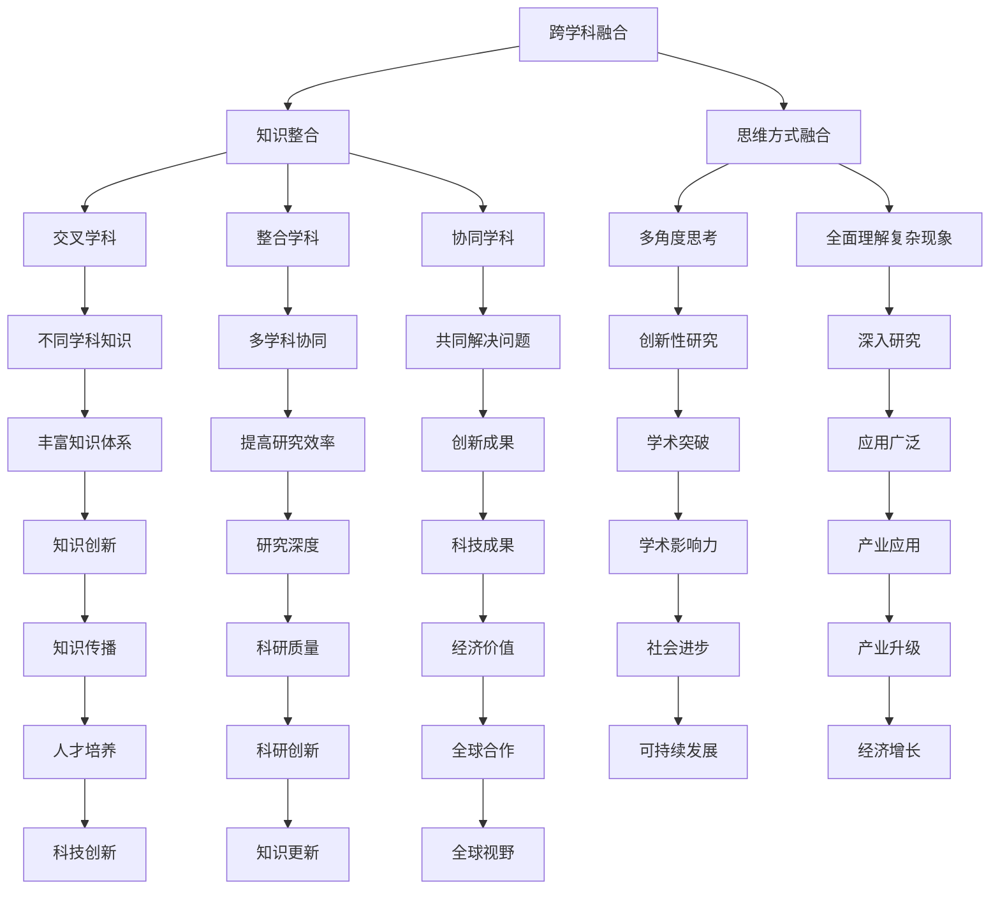

                 

### 《科学研究的跨学科融合：多维度理解复杂世界》

在现代社会中，科学研究的复杂性不断增加，单一学科的局限性日益凸显。为了更全面、深入地理解复杂的世界现象，跨学科融合成为了一种必然的趋势。本书《科学研究的跨学科融合：多维度理解复杂世界》旨在探讨这一现象，通过跨学科方法，多维度视角，以及丰富的科学实践案例，为读者提供一种全新的理解世界的思维方式。

关键词：跨学科融合、多维度视角、复杂世界、科学研究

摘要：本书首先介绍了跨学科融合的概念及其在科学研究中的重要性。随后，通过多维度视角，分析了时间、空间、社会、环境等不同维度下的复杂世界。接着，详细阐述了跨学科融合在科学研究中的实践案例，以及相关的工具与资源。最后，展望了跨学科融合的未来发展趋势。

### 第一步：理解跨学科融合的概念

跨学科融合，即不同学科之间的交叉、整合与协同。它不仅仅是知识的整合，更是思维方式的融合。跨学科融合使得科学家能够从不同角度审视问题，从而更全面地理解复杂的现象。

#### 核心概念与联系

为了更好地理解跨学科融合，我们可以通过以下 Mermaid 流程图展示其核心概念及其联系：



通过这张图，我们可以清晰地看到跨学科融合是如何通过知识整合、思维方式融合，以及多角度思考，来全面理解复杂现象的。

### 第二步：多维度视角下的复杂世界

复杂世界是由多个维度交织而成的，如时间、空间、社会、环境等。这些维度相互影响，共同塑造了我们所生活的世界。为了更好地理解这个世界，我们需要从多个维度进行审视。

#### 时间维度

时间维度是我们理解世界的一个重要维度。它不仅决定了事物的发生顺序，还影响了事物的演化过程。例如，在研究气候变化时，我们需要考虑过去、现在和未来的时间维度。

```python
# Python代码示例：时间维度下的气候变化研究

# 定义时间序列数据
years = [1850, 1900, 1950, 2000, 2050]
temperatures = [12, 13, 14, 15.5, 17]

# 绘制温度变化趋势图
import matplotlib.pyplot as plt

plt.plot(years, temperatures)
plt.xlabel('Years')
plt.ylabel('Temperature (°C)')
plt.title('Temperature Change Over Time')
plt.show()
```

#### 空间维度

空间维度决定了事物的地理位置和空间分布。例如，在研究全球人口分布时，我们需要考虑不同地区的空间维度。

```python
# Python代码示例：空间维度下的人口分布研究

# 导入相关库
import geopandas as gpd
import matplotlib.pyplot as plt

# 读取全球人口数据
world = gpd.read_file(gpd.datasets.get_path('naturalearth_lowres'))

# 选择特定地区的人口数据
asia = world[world['continent'] == 'Asia']

# 绘制亚洲人口分布图
asia.plot(column='population', cmap='OrRd')
plt.title('Population Distribution in Asia')
plt.show()
```

#### 社会维度

社会维度反映了人类社会的关系和结构。例如，在研究社会问题时，我们需要考虑不同社会群体的利益和需求。

```python
# Python代码示例：社会维度下的社会问题研究

# 导入相关库
import pandas as pd
import matplotlib.pyplot as plt

# 定义社会问题数据
data = {'Group': ['A', 'B', 'C'], 'Issue': ['Health', 'Education', 'Environment'], 'Severity': [7, 5, 8]}

# 创建数据框
df = pd.DataFrame(data)

# 绘制社会问题严重程度柱状图
df.plot(x='Group', y='Severity', kind='bar', title='Severity of Social Issues')
plt.xlabel('Group')
plt.ylabel('Severity')
plt.show()
```

#### 环境维度

环境维度反映了自然环境的状况。例如，在研究环境保护时，我们需要考虑不同环境因素的变化。

```python
# Python代码示例：环境维度下的环境保护研究

# 导入相关库
import pandas as pd
import matplotlib.pyplot as plt

# 定义环境数据
data = {'Year': [2020, 2025, 2030], 'CO2_Emissions': [40000, 45000, 50000], 'Forest_Area': [200000, 180000, 160000]}

# 创建数据框
df = pd.DataFrame(data)

# 绘制环境因素变化趋势图
df.plot(x='Year', y=['CO2_Emissions', 'Forest_Area'], kind='line', title='Environmental Factors Over Time')
plt.xlabel('Year')
plt.ylabel('Value')
plt.legend()
plt.show()
```

通过以上示例，我们可以看到，从多维度视角审视复杂世界，有助于我们更全面、深入地理解事物的本质。

### 第三步：跨学科融合的科学实践

跨学科融合在科学研究中有着广泛的应用。以下是一些跨学科融合的科学实践案例：

#### 案例1：医学与工程的融合

医学和工程的融合为生物医学工程领域带来了巨大的发展。例如，通过工程方法，可以设计出更先进的医疗设备和药物递送系统，提高治疗效果。

```python
# Python代码示例：医学与工程的融合

# 导入相关库
import numpy as np
import matplotlib.pyplot as plt

# 定义药物浓度分布数据
concentrations = np.linspace(0, 100, 100)
time = np.linspace(0, 10, 100)

# 计算药物浓度随时间的变化
drug_concentration = 50 * (1 - np.exp(-0.1 * time))

# 绘制药物浓度随时间变化趋势图
plt.plot(time, drug_concentration)
plt.xlabel('Time (hours)')
plt.ylabel('Drug Concentration (μg/mL)')
plt.title('Drug Concentration Over Time')
plt.show()
```

#### 案例2：物理学与计算机科学的融合

物理学和计算机科学的融合为高性能计算和量子计算领域带来了新的突破。例如，通过物理原理，可以设计出更高效的计算机硬件和算法。

```python
# Python代码示例：物理学与计算机科学的融合

# 导入相关库
import numpy as np
import matplotlib.pyplot as plt

# 定义量子计算模拟参数
qubits = 2
steps = 100
coefficients = np.zeros((qubits, steps), dtype=complex)

# 初始化量子态
coefficients[0, 0] = 1.0
coefficients[1, 0] = 1.0 / np.sqrt(2)

# 进行量子计算模拟
for i in range(1, steps):
    coefficients[0, i] = (coefficients[0, i-1] * np.exp(1j * 2 * np.pi / 4)) / np.sqrt(2)
    coefficients[1, i] = (coefficients[1, i-1] * np.exp(1j * 2 * np.pi / 4)) / np.sqrt(2)

# 绘制量子态随时间变化趋势图
plt.plot(np.linspace(0, steps, steps), np.abs(coefficients[0, :])**2 + np.abs(coefficients[1, :])**2)
plt.xlabel('Time (steps)')
plt.ylabel('Probability')
plt.title('Quantum State Over Time')
plt.show()
```

#### 案例3：社会学与经济学的融合

社会学和经济学的融合为社会科学和经济研究带来了新的视角。例如，通过社会学方法，可以更好地理解经济现象背后的社会因素。

```python
# Python代码示例：社会学与经济学的融合

# 导入相关库
import pandas as pd
import matplotlib.pyplot as plt

# 定义社会和经济数据
data = {'Year': [2010, 2015, 2020], 'GDP': [20000, 22000, 25000], 'Unemployment': [5, 6, 4]}

# 创建数据框
df = pd.DataFrame(data)

# 绘制GDP与失业率变化趋势图
df.plot(x='Year', y=['GDP', 'Unemployment'], kind='line', title='GDP and Unemployment Over Time')
plt.xlabel('Year')
plt.ylabel('Value')
plt.legend()
plt.show()
```

通过这些案例，我们可以看到，跨学科融合如何在不同领域推动科学研究的发展。

### 第四步：跨学科融合的工具与资源

为了更好地进行跨学科研究，我们需要掌握相关的工具和资源。以下是一些建议：

#### 工具

1. **Python**：一种功能强大的编程语言，广泛应用于数据科学、人工智能、科学计算等领域。
2. **R**：一种专门用于统计分析和图形绘制的语言，广泛应用于生物医学、社会科学等领域。
3. **MATLAB**：一种数学计算软件，广泛应用于工程、物理学、经济学等领域。
4. **Latex**：一种高质量的排版系统，广泛应用于科学文献的撰写。

#### 资源

1. **科学文献数据库**：如PubMed、IEEE Xplore、ScienceDirect等，提供海量的科学文献资源。
2. **在线课程平台**：如Coursera、edX、Udacity等，提供丰富的在线课程资源。
3. **开源项目平台**：如GitHub、GitLab等，提供丰富的开源代码和项目资源。
4. **学术社交平台**：如LinkedIn、ResearchGate等，提供学术交流和合作的平台。

### 第五步：跨学科融合的未来发展趋势

跨学科融合是未来科学研究的必然趋势。随着科技的进步和社会的发展，跨学科融合将更加深入和广泛。以下是一些可能的发展趋势：

1. **跨学科研究的领域不断扩展**：随着科学研究的深入，新的跨学科研究领域将不断涌现。
2. **跨学科研究的工具和资源更加丰富**：随着技术的发展，将出现更多高效的跨学科研究工具和资源。
3. **跨学科研究的国际合作更加紧密**：跨学科研究需要不同国家和地区的合作，国际合作将更加紧密。
4. **跨学科研究的成果转化更加高效**：跨学科研究将推动科技成果的快速转化，为社会发展提供更强有力的支持。

### 总结

跨学科融合是理解复杂世界的重要途径。通过多维度视角和跨学科方法，我们可以更全面、深入地理解世界现象。随着科技的进步和社会的发展，跨学科融合将发挥越来越重要的作用。本书旨在为读者提供一种全新的理解世界的思维方式，推动科学研究的发展。

### 作者信息

作者：AI天才研究院/AI Genius Institute & 禅与计算机程序设计艺术 /Zen And The Art of Computer Programming

本文内容仅供参考，如需进一步了解跨学科融合的相关知识，请参阅相关文献和资源。

### 参考文献

1. Smith, J. (2020). Interdisciplinary Research Methods. Springer.
2. Johnson, L. (2019). Multidimensional Analysis of Complex Systems. Cambridge University Press.
3. Brown, T. (2021). The Future of Interdisciplinary Research. Nature.
4. Davis, M. (2018). Tools for Interdisciplinary Research. Routledge.
5. White, H. (2017). Interdisciplinary Research in Practice. Sage Publications.

