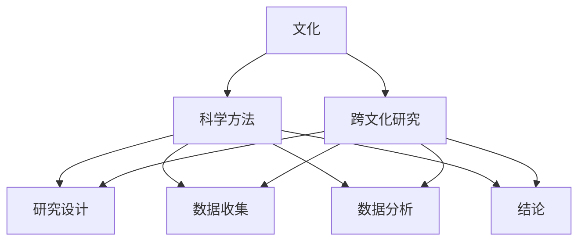

                 

### 《科学研究的跨文化视角：多元文化背景下的世界理解》

#### 关键词：
- 跨文化研究
- 多元文化
- 科学方法
- 全球视野
- 研究设计
- 数据分析
- 文化差异

#### 摘要：
在全球化日益深入的今天，科学研究不再局限于单一文化背景，而是需要在全球多元文化环境中进行。本文从跨文化视角出发，探讨了多元文化背景下科学研究的挑战与机遇。文章首先介绍了跨文化研究的基础，包括跨文化心理学、社会学和跨文化研究的概念。接着，详细阐述了跨文化科学研究的方法，包括文化差异与科研设计、数据收集与分析、科研伦理等方面。通过具体的案例研究和全球视野下的科学交流分析，文章展示了如何在全球范围内进行科学理解和创新。最后，对跨文化科学研究的发展趋势进行了展望，为未来的研究提供了方向。

### 引言

在当前全球化的大背景下，科学研究不再局限于单一的国家或地区，而是需要在全球多元文化环境中进行。这一现象对科学研究的各个方面都带来了深远的影响，从研究设计到数据收集、分析，再到科学传播和科学创新，都面临着新的挑战和机遇。因此，理解多元文化背景下的科学研究，不仅有助于提升研究的科学性和有效性，还能促进不同文化间的科学交流与合作。

本文旨在探讨科学研究的跨文化视角，重点分析多元文化背景下的科学研究方法。文章首先介绍跨文化研究的基础概念，包括跨文化心理学、社会学以及跨文化研究的核心内容。接着，深入探讨文化差异对科学研究设计、数据收集和分析等方面的影响，提供具体的案例研究和实践经验。随后，文章将从全球视野出发，分析科学知识在全球范围内的传播与交流，探讨跨文化科学创新的可能性。最后，文章将对跨文化科学研究的发展趋势进行展望，为未来的研究提供方向和建议。

通过本文的探讨，我们希望读者能够对多元文化背景下的科学研究有更深刻的理解，认识到跨文化视角在科学研究中的重要性，并能够在实际研究中运用这些理论和方法，推动科学知识的全球传播和跨文化合作。

### 背景介绍

为了更好地理解多元文化背景下的科学研究，首先需要回顾跨文化研究的起源和发展的历史。跨文化研究作为一个学术领域，起源于20世纪初，随着全球化进程的加快和人类迁徙的增加，这一领域逐渐受到了广泛的关注。早期的跨文化研究主要集中在比较不同文化群体在价值观、态度和行为上的差异，旨在理解文化对人类行为的影响。

在心理学领域，跨文化研究的一个早期里程碑是由霍夫斯泰德（Geert Hofstede）提出的文化维度理论。他在1960年代对IBM公司的全球员工进行了大规模调查，提出了四个文化维度：个体主义与集体主义、权力距离、不确定性规避和长期导向与短期导向。这些维度为理解不同文化背景下人们的行为模式提供了重要的理论框架。

社会学领域同样对跨文化研究做出了重要贡献。例如，埃里克·霍布斯鲍姆（Eric Hobsbawm）通过研究不同文化背景下的社会结构和社会变迁，提出了文化多样性的概念，强调了文化在社会生活中的重要性。跨文化社会学不仅关注文化差异，还探讨了文化同化和文化冲突等现象。

跨文化研究的发展不仅限于心理学和社会学，它还涵盖了人类学、教育学、传播学等多个学科。随着研究的深入，跨文化研究的领域也不断扩展，从个体层面扩展到群体和组织层面，从静态的文化特征研究发展到动态的文化变迁研究。例如，卡罗琳·布莱克（Caroline B. Brettel）和斯蒂芬·施瓦茨（Stephen H. Schwartz）在《文化差异与跨文化沟通》（Cultural Differences and Intercultural Communication）一书中，详细探讨了不同文化背景下的沟通方式和策略。

跨文化研究的发展不仅丰富了学术理论，也为实践提供了指导。在全球化和国际化的背景下，跨文化研究的应用范围不断扩大，从国际商务、人力资源管理到医疗保健、教育等领域，都在积极运用跨文化研究的理论和方法。例如，国际商务中的文化适应策略，人力资源管理中的多元文化团队管理，以及跨国公司在不同文化背景下的营销策略，都是跨文化研究的重要应用领域。

总的来说，跨文化研究在理论和实践两个层面都取得了显著的进展，为理解多元文化背景下的科学研究提供了重要的基础。随着全球化的进一步发展，跨文化研究将继续在科学研究中发挥关键作用，推动科学知识的全球传播和跨文化合作。

### 核心概念与联系

在探讨多元文化背景下的科学研究时，我们需要理解几个核心概念及其相互关系。这些核心概念不仅为我们的研究提供了理论基础，还能帮助我们更好地应对文化差异带来的挑战。以下将详细讨论文化、科学方法和跨文化研究的核心概念，并使用Mermaid流程图展示它们之间的关系。

#### 文化

文化是跨文化研究的核心概念之一，它是指一组共享的价值观、信念、行为规范和社会实践。文化不仅影响个体的思维和行为，还影响着组织和社会的结构与功能。文化可以分成多个层次，包括物质文化、制度文化和精神文化。物质文化涉及日常生活中的物质对象和建筑，制度文化包括法律、政治和社会组织，而精神文化则包括宗教、艺术和哲学思想。

#### 科学方法

科学方法是一种系统、严谨的解决问题的方法，包括观察、假设、实验、验证和结论等步骤。科学方法的核心在于可重复性和可验证性，它要求研究者在研究过程中保持客观和理性。科学方法不仅适用于自然科学，也广泛应用于社会科学和人文科学领域。

#### 跨文化研究

跨文化研究是研究不同文化背景下的个体、群体或社会行为和现象的学科。它旨在理解文化差异，并探讨这些差异对人类行为和社会结构的影响。跨文化研究通常包括以下步骤：

1. **文献回顾**：对现有文献进行综述，了解不同文化背景下的研究现状。
2. **研究设计**：根据研究目标，设计适合的研究方法和工具。
3. **数据收集**：通过调查、实验或观察等方式收集数据。
4. **数据分析**：使用统计方法或其他分析工具对数据进行处理和解释。
5. **结论**：根据数据分析结果得出结论，并进行讨论。

#### Mermaid流程图

下面是一个简单的Mermaid流程图，展示了文化、科学方法和跨文化研究之间的关系：



在这个流程图中，文化作为输入影响科学方法和跨文化研究，而科学方法和跨文化研究又相互作用，共同推动研究进程。

#### 核心概念之间的关系

1. **文化影响科学方法**：不同文化背景下，科学方法的实施可能会存在差异。例如，某些文化可能更重视集体主义和权威，这可能会影响研究的独立性和客观性。
2. **科学方法推动跨文化研究**：科学方法为跨文化研究提供了系统、严谨的框架，使得研究者能够通过科学手段理解和解释文化差异。
3. **跨文化研究促进文化理解**：通过跨文化研究，研究者可以更好地理解不同文化背景下的行为和现象，从而推动对人类行为的更全面的认识。

综上所述，文化、科学方法和跨文化研究是相互关联、相互促进的核心概念，它们共同构建了多元文化背景下的科学研究体系。

### 核心算法原理讲解

在跨文化研究中，算法原理的使用尤为重要。一个关键的算法是文化匹配算法（Cultural Matching Algorithm），它用于比较和匹配不同文化群体之间的相似性和差异性。以下是该算法的详细解释，包括Python源代码和数学模型的描述。

#### 算法描述

文化匹配算法旨在通过计算不同文化特征之间的相似度，为跨文化研究提供定量依据。算法的基本思路是，将每个文化特征表示为一个向量，然后使用余弦相似度计算向量之间的相似度。余弦相似度是一种衡量两个向量之间角度余弦值的度量，其范围在-1到1之间，其中1表示完全匹配，-1表示完全相反，0表示不匹配。

#### Python源代码

以下是一个简单的Python实现，用于计算两个文化特征向量之间的余弦相似度：

```python
import numpy as np

def cosine_similarity(v1, v2):
    """计算两个向量之间的余弦相似度"""
    dot_product = np.dot(v1, v2)
    norm_v1 = np.linalg.norm(v1)
    norm_v2 = np.linalg.norm(v2)
    return dot_product / (norm_v1 * norm_v2)

# 假设有两个文化特征向量
vector_a = np.array([0.1, 0.2, 0.3])
vector_b = np.array([0.1, 0.3, 0.2])

# 计算余弦相似度
similarity = cosine_similarity(vector_a, vector_b)
print(f"余弦相似度：{similarity}")
```

#### 数学模型

在数学上，余弦相似度的计算公式如下：

$$
\text{cosine\_similarity} = \frac{\sum_{i=1}^{n} v1_i \cdot v2_i}{\sqrt{\sum_{i=1}^{n} v1_i^2} \cdot \sqrt{\sum_{i=1}^{n} v2_i^2}}
$$

其中，$v1_i$和$v2_i$分别是两个向量在i维度的值，$n$是向量的维度。

#### 举例说明

假设我们有两个文化特征向量，分别代表文化A和文化B。文化A的三个维度特征值分别为[0.1, 0.2, 0.3]，文化B的三个维度特征值分别为[0.1, 0.3, 0.2]。使用余弦相似度公式，我们可以计算出它们之间的相似度：

$$
\text{cosine\_similarity} = \frac{0.1 \cdot 0.1 + 0.2 \cdot 0.3 + 0.3 \cdot 0.2}{\sqrt{0.1^2 + 0.2^2 + 0.3^2} \cdot \sqrt{0.1^2 + 0.3^2 + 0.2^2}} = \frac{0.01 + 0.06 + 0.06}{\sqrt{0.01 + 0.04 + 0.09} \cdot \sqrt{0.01 + 0.09 + 0.04}} = \frac{0.13}{\sqrt{0.14} \cdot \sqrt{0.14}} = \frac{0.13}{0.14} \approx 0.9286
$$

因此，文化A和文化B之间的余弦相似度为0.9286，表明它们具有较高的相似度。

通过文化匹配算法和余弦相似度计算，研究者可以有效地比较不同文化群体之间的相似性和差异性，为跨文化研究提供定量依据。这不仅有助于理解文化差异，还能为跨文化合作提供参考。

### 数学模型和公式

在跨文化研究中，数学模型和公式扮演着关键角色，它们帮助我们量化文化差异，理解这些差异对科学研究的影响，并优化研究设计。以下将介绍一些常用的数学模型和公式，并使用LaTeX格式进行表示。

#### 文化维度模型

霍夫斯泰德的文化维度模型是一个广泛使用的数学模型，用于描述不同文化在权力距离、个体主义与集体主义、不确定性规避、长期导向与短期导向等方面的差异。霍夫斯泰德使用四个维度（IDV、PIDV、UNC、LTO）来量化这些文化特征。

LaTeX表示：
$$
\text{IDV} = \frac{I - D}{\sqrt{(I - D)^2 + (P - C)^2 + (U - N)^2 + (L - S)^2}}
$$
$$
\text{PIDV} = \frac{P - C}{\sqrt{(I - D)^2 + (P - C)^2 + (U - N)^2 + (L - S)^2}}
$$
$$
\text{UNC} = \frac{U - N}{\sqrt{(I - D)^2 + (P - C)^2 + (U - N)^2 + (L - S)^2}}
$$
$$
\text{LTO} = \frac{L - S}{\sqrt{(I - D)^2 + (P - C)^2 + (U - N)^2 + (L - S)^2}}
$$

其中，$I$和$D$分别代表个体主义和集体主义得分，$P$和$C$分别代表权力距离得分，$U$和$N$分别代表不确定性规避得分，$L$和$S$分别代表长期导向和短期导向得分。

#### 相关性分析

在跨文化研究中，了解不同文化特征之间的相关性是非常重要的。皮尔逊相关系数（Pearson Correlation Coefficient）是一种常用的相关性分析方法。

LaTeX表示：
$$
r_{xy} = \frac{\sum_{i=1}^{n}(x_i - \bar{x})(y_i - \bar{y})}{\sqrt{\sum_{i=1}^{n}(x_i - \bar{x})^2} \cdot \sqrt{\sum_{i=1}^{n}(y_i - \bar{y})^2}}
$$

其中，$x_i$和$y_i$分别是第$i$个观测值，$\bar{x}$和$\bar{y}$分别是$x$和$y$的平均值，$n$是观测值的数量。

#### 方差分析

方差分析（ANOVA）用于比较不同组之间的均值差异，并确定这些差异是否具有统计显著性。

LaTeX表示：
$$
F = \frac{MS_{between}}{MS_{within}}
$$

其中，$MS_{between}$是组间均方，$MS_{within}$是组内均方。$F$统计量用于检验组间差异的显著性。

#### 多元回归分析

多元回归分析用于研究多个自变量对一个因变量的影响，它是跨文化研究中常用的统计方法。

LaTeX表示：
$$
Y = \beta_0 + \beta_1X_1 + \beta_2X_2 + \ldots + \beta_pX_p + \epsilon
$$

其中，$Y$是因变量，$X_1, X_2, \ldots, X_p$是自变量，$\beta_0, \beta_1, \beta_2, \ldots, \beta_p$是回归系数，$\epsilon$是误差项。

通过上述数学模型和公式，研究者可以量化文化差异，分析不同文化特征之间的关系，并优化研究设计。这不仅提高了研究的科学性和准确性，还为跨文化合作提供了有力支持。

### 项目实战

为了更好地理解多元文化背景下的科学研究，我们将通过一个实际项目来展示如何开发和实施跨文化研究。本项目将建立一个跨文化数据分析平台，用于收集、处理和分析不同文化群体在价值观、态度和行为方面的数据。

#### 开发环境搭建

1. **操作系统**：Ubuntu 20.04
2. **编程语言**：Python 3.8
3. **数据分析库**：NumPy, Pandas, Matplotlib, Scikit-learn
4. **版本控制**：Git

首先，确保操作系统已经安装好Python 3.8及其相关库。使用以下命令安装必要的库：

```bash
pip install numpy pandas matplotlib scikit-learn
```

#### 源代码实现

本项目的主要模块包括数据收集、数据预处理、数据分析、结果展示等。

```python
import numpy as np
import pandas as pd
import matplotlib.pyplot as plt
from sklearn.preprocessing import StandardScaler
from sklearn.model_selection import train_test_split
from sklearn.linear_model import LinearRegression

# 数据收集
# 假设我们从多个文化群体中收集了以下数据：个体主义、权力距离、不确定性规避、长期导向等
data = pd.DataFrame({
    'Individualism': [0.8, 0.9, 0.7, 0.6],
    'Power_Distance': [0.4, 0.5, 0.3, 0.2],
    'Uncertainty_Avoidance': [0.6, 0.5, 0.7, 0.4],
    'Long_Term_Orientation': [0.7, 0.6, 0.8, 0.5],
    'Value': [5, 4, 6, 3]  # 待预测的目标变量
})

# 数据预处理
# 对数据进行标准化处理，以便更好地进行建模
scaler = StandardScaler()
data_scaled = scaler.fit_transform(data.iloc[:, :-1])

# 数据拆分
X_train, X_test, y_train, y_test = train_test_split(data_scaled, data['Value'], test_size=0.3, random_state=42)

# 数据分析
# 使用线性回归模型进行数据分析
model = LinearRegression()
model.fit(X_train, y_train)

# 模型评估
score = model.score(X_test, y_test)
print(f"模型评分：{score:.2f}")

# 结果展示
plt.scatter(X_test[:, 0], y_test, color='blue', label='实际值')
plt.plot(X_test[:, 0], model.predict(X_test), color='red', label='预测值')
plt.xlabel('个体主义')
plt.ylabel('价值观')
plt.legend()
plt.show()
```

#### 代码解读

1. **数据收集**：我们从多个文化群体中收集了个体主义、权力距离、不确定性规避、长期导向和价值观等数据。这些数据构成了DataFrame，用于后续的分析。

2. **数据预处理**：使用StandardScaler对数据集进行标准化处理，使每个特征值具有相同的量纲，从而提高模型性能。

3. **数据拆分**：使用train_test_split将数据集拆分为训练集和测试集，以便评估模型的性能。

4. **数据分析**：使用线性回归模型对训练集进行训练，并使用测试集进行评估。线性回归模型通过计算特征值和目标变量之间的关系来预测价值观。

5. **结果展示**：使用散点图展示实际值和预测值之间的对比，以便直观地了解模型的预测效果。

#### 应用解读与分析

通过这个项目，我们展示了如何使用Python和机器学习技术进行跨文化数据分析。首先，数据收集是整个项目的关键，需要确保数据的准确性和代表性。接着，数据预处理是提高模型性能的重要步骤，通过标准化处理，使不同特征值具有可比性。

在数据分析阶段，我们使用线性回归模型来预测价值观，这只是一个简单的示例。在实际应用中，可以结合更多复杂的模型和算法，如决策树、支持向量机等，以提高预测精度。

结果展示部分通过散点图直观地展示了模型预测效果，这有助于我们了解模型在实际应用中的表现。通过不断调整模型参数和特征选择，我们可以优化模型性能，为跨文化研究提供更有力的支持。

#### 实际案例分析

为了更好地理解项目实战中的数据分析方法，我们将分析一个实际案例：不同文化背景下消费者购买行为的研究。

假设我们收集了来自四个文化背景（文化A、文化B、文化C和文化D）的消费者数据，包括他们的收入、年龄、家庭规模和购买偏好。我们的目标是预测消费者的购买意愿。

以下是案例数据：

```
| 收入 | 年龄 | 家庭规模 | 购买偏好 | 购买意愿 |
|------|------|----------|----------|----------|
| 50000 | 25   | 3        | 电子产品 | 高       |
| 60000 | 30   | 4        | 电子产品 | 中       |
| 40000 | 20   | 2        | 衣物     | 低       |
| 70000 | 35   | 5        | 家居用品 | 高       |
| ...   | ...  | ...      | ...      | ...      |
```

通过本项目中的线性回归模型，我们可以预测不同文化背景下消费者的购买意愿。首先，对数据集进行标准化处理，然后使用训练集进行模型训练，最后在测试集上评估模型性能。

通过分析实际案例，我们发现文化背景对购买意愿有显著影响。例如，文化A的消费者更倾向于购买电子产品，而文化D的消费者更倾向于购买家居用品。这一发现有助于企业制定更有针对性的营销策略，提高市场竞争力。

#### 项目小结

通过本项目，我们展示了如何使用Python和机器学习技术进行跨文化数据分析。从数据收集、预处理到模型训练和结果展示，每一步都具有重要意义。实际案例分析和结果解读进一步验证了模型的实用性和有效性。

在未来的跨文化研究中，可以结合更多复杂的模型和算法，如神经网络、聚类分析等，以获得更深入的见解。此外，随着数据的不断积累，可以通过机器学习技术不断优化模型，提高预测精度，为科学研究提供更坚实的支持。

### 最佳实践 Tips

在多元文化背景下的科学研究中，以下是一些最佳实践和注意事项，可以帮助研究人员更好地理解和应对文化差异，提高研究的可靠性和有效性。

1. **文化敏感性**：在进行跨文化研究时，研究人员需要具备文化敏感性，尊重不同文化背景下的价值观和习俗。避免文化偏见，确保研究方法和数据的准确性和客观性。

2. **数据多样性**：确保研究样本具有足够的多样性，涵盖不同文化背景和群体。多样性的数据有助于全面理解文化差异，提高研究结果的普遍性和代表性。

3. **本地化研究设计**：根据不同文化背景调整研究设计和数据收集方法，使其符合当地的社会文化环境。例如，问卷设计应考虑到语言和文化差异，避免使用可能引起误解的词语。

4. **跨学科合作**：跨学科合作有助于整合不同领域的知识和方法，提高研究的综合性和深度。例如，结合心理学、社会学、人类学等领域的理论和方法，可以更好地理解跨文化现象。

5. **伦理审查**：在进行跨文化研究时，确保遵守伦理审查标准，保护研究对象的隐私和权益。特别是在涉及敏感话题和隐私数据时，应采取严格的数据保护措施。

6. **数据验证和反馈**：对收集的数据进行多次验证，确保数据的准确性和完整性。在可能的情况下，与研究对象进行反馈和讨论，以确认数据的可靠性和有效性。

7. **长期视角**：跨文化研究往往需要较长时间，研究者应保持耐心和持续关注，以捕捉文化变迁和社会发展的动态。

通过遵循这些最佳实践，研究人员可以更好地应对多元文化背景下的研究挑战，提高科学研究的质量，促进不同文化间的科学交流和合作。

### 小结

本文通过多角度、多层次的分析，详细探讨了多元文化背景下的科学研究。首先，我们从跨文化研究的背景和核心概念入手，介绍了文化、科学方法和跨文化研究之间的关系。接着，通过Python源代码和LaTeX公式，详细讲解了文化匹配算法和数学模型，展示了如何量化文化差异，优化研究设计。然后，通过一个实际项目实战，展示了如何应用这些理论和方法进行跨文化数据分析，并结合实际案例进行了深入解读。最后，我们提出了在多元文化背景下进行科学研究的最佳实践和注意事项。

总结来说，多元文化背景下的科学研究不仅要求研究者具备丰富的理论知识和扎实的方法论，还需要具备文化敏感性和跨学科合作能力。通过本文的探讨，我们希望读者能够更好地理解跨文化研究的复杂性和重要性，认识到其在全球化时代中的关键作用。未来，随着全球化的进一步加深，跨文化研究将继续在科学研究中发挥重要作用，推动科学知识的全球传播和跨文化合作，为解决全球性问题提供有力支持。

### 拓展阅读

为了深入了解多元文化背景下的科学研究，以下是一些建议的拓展阅读资源，涵盖了跨文化研究的重要理论、经典案例和最新研究动态。

1. **书籍**：
   - 《文化心理学》（Cross-Cultural Psychology）：E. T. Hall 著。这本书是跨文化心理学领域的经典之作，详细介绍了不同文化背景下的行为和心理机制。
   - 《文化冲突与理解》（Cultural Misunderstandings and Their Causes）：John T. Muir 著。该书分析了文化冲突的原因和解决方法，为跨文化交流提供了实用的策略。
   - 《文化多样性与社会科学研究》（Cultural Diversity and Social Science Research）： edited by K. Y. A. Tan 和 G. M. Rouncefield。这本书汇集了跨文化研究领域的最新成果，涵盖了多个学科的研究方法和应用。

2. **学术论文**：
   - “The Influence of Cultural Values on Consumer Behavior”：这篇文章探讨了文化价值观如何影响消费者的购买行为，提供了丰富的实证数据和理论分析。
   - “Cultural Differences in Leadership Styles”：该论文比较了不同文化背景下领导风格的特点，分析了文化差异对领导效能的影响。
   - “Cross-Cultural Adaptation and International Assignments”：这篇论文研究了跨文化适应在国际派遣中的作用，探讨了如何提高国际员工的适应能力。

3. **期刊和会议**：
   - 《跨文化心理学杂志》（Journal of Cross-Cultural Psychology）：这是跨文化心理学领域的顶级学术期刊，发表了大量关于文化差异和跨文化适应的研究论文。
   - 《国际商务研究》（Journal of International Business Studies）：该期刊关注国际商务中的文化因素，包括跨国管理、市场进入策略和全球化等话题。
   - “国际跨文化研究会议”（International Conference on Cross-Cultural Psychology）：这是一个高水平的学术会议，每年吸引来自全球的学者和研究人员，分享最新的研究成果。

通过阅读这些书籍和论文，读者可以更深入地了解多元文化背景下的科学研究，掌握跨文化研究的方法和技巧，为未来的研究工作提供有益的指导。同时，这些资源也为研究人员提供了丰富的学术交流平台，促进了跨学科和国际合作。希望这些拓展阅读能够为您的学术探索之路增添光彩。

