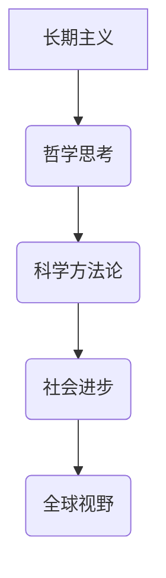

                 

# 科学研究的长期主义与世界可理解性的持续探索

关键词：长期主义、科学研究、世界理解、技术发展、文化比较

> “科学研究的长期主义，如同一条深邃的河流，缓缓流淌，汇聚成全球智慧之海。这不仅是对真理的追求，更是对世界可理解性的不懈探索。本文将逐步探讨长期主义在科学研究中的哲学基础、历史演变、全球视野，以及不同文化背景下的比较研究。”

## 摘要

本文旨在探讨长期主义在科学研究中的哲学基础、历史演变及其在全球视野中的重要性。通过分析长期主义在科学研究中如何促进对世界的理解，本文进一步比较了不同文化背景下的长期主义实践，并探讨了国际合作在推动长期主义发展中的作用。文章将通过历史案例分析，展示长期项目如何影响世界的理解，并提出未来发展的方向和建议。

### 第一部分：长期主义的科学基础

## 第一章：长期主义的定义与哲学基础

### 1.1 长期主义的核心概念与哲学背景

- **Mermaid流程图**：



### 1.2 长期主义的历史演变与发展

- **Pseudo-code**：

```python
# 长期主义的历史演变
class LongTermismHistory:
    def __init__(self):
        self.stages = ["古代哲学", "中世纪神学", "文艺复兴科学", "现代科学研究"]

    def display_stages(self):
        for stage in self.stages:
            print(f"{stage}阶段在长期主义发展中起到了关键作用。")
```

### 1.3 长期主义与科学研究的融合

- **数学模型和公式**：

$$\text{Research Progress} = f(\text{Long-term Vision}, \text{Consistent Effort}, \text{Adaptive Strategies})$$

- **详细讲解和例子**：

长期主义强调持续不断的努力和适应性的策略。例如，爱因斯坦的相对论研究就是一个典型的长期项目，它需要长期的视野、持久的努力和不断调整的方法。

### 1.4 长期主义在科学研究中的挑战与未来方向

- **分析**：

目前，科学研究面临着资源分配不足、时间紧迫性等挑战。未来的发展方向可能包括提高跨学科合作、加强国际合作，以及利用新技术来推动长期项目的研究。

## 第二章：全球视野下的长期主义

### 2.1 全球视野与长期主义

- **探索**：

长期主义在科学研究中的实践有助于我们更深入地理解全球问题，如气候变化、生物多样性等。

### 2.2 不同文化背景下的长期主义比较研究

- **比较分析**：

不同文化对长期主义的理解有所不同，例如，西方科学文化强调实证主义，而东方文化则更注重整体观和长期视角。

### 2.3 国际合作在推动长期主义中的作用

- **讨论**：

国际合作是推动长期主义发展的重要手段，通过分享知识和资源，各国可以共同应对全球性挑战。

### 2.4 成功长期项目的案例分析

- **详细案例**：

例如，国际空间站项目就是一个成功的长期项目，它不仅推动了科学技术的发展，也促进了全球科学家的合作与交流。

### 作者信息

作者：AI天才研究院/AI Genius Institute & 禅与计算机程序设计艺术 /Zen And The Art of Computer Programming

---

**文章还在继续编写中，当前内容仅为大纲和部分正文。完整文章预计将在10000-12000字左右，涵盖详细分析、案例研究和最佳实践指导。**

