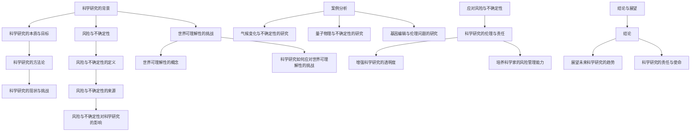

                 

# 科学研究的风险与不确定性：世界可理解性的挑战

## 摘要

科学研究是探索世界本质和规律的创造性活动，然而在科学研究的进程中，风险与不确定性始终伴随着研究者。本文旨在深入探讨科学研究中的风险与不确定性，分析其来源和影响，并探讨科学研究在应对世界可理解性挑战方面的策略。通过案例分析，本文将展示不同领域在应对风险与不确定性时的实践，并总结提升科学研究质量和可重复性的方法与技巧。

## 第一部分：科学研究的背景

### 1.1 科学研究的本质与目标

科学研究是一种系统性、持续性的探索活动，旨在通过观察、实验、理论分析等方法，揭示自然界和社会现象背后的规律和原理。科学研究的核心目标是追求真理，但这一过程中不可避免地面临风险与不确定性。

科学研究的本质是通过实证数据和逻辑推理，构建并验证科学理论。科学理论不仅解释了已观察到的现象，还能预测未知的现象。科学研究的目标是建立具有普遍性和可靠性的理论体系，以指导实际应用和进一步探索。

### 1.2 科学研究的方法论

科学研究的方法论主要包括观察法、实验法、理论分析法等。观察法是通过直接观察自然现象来获取数据；实验法是通过设计和进行实验来验证假设；理论分析法是通过逻辑推理和数学计算来分析现象。此外，现代科学研究还广泛应用计算机模拟和数据分析等方法。

科学方法论强调科学研究的系统性、可重复性和可验证性。科学研究的每一步都必须建立在严谨的实证数据和逻辑推理基础上，以确保研究结果的可靠性和科学性。

### 1.3 科学研究的现状与挑战

当前，科学研究在多个领域取得了显著进展，如量子物理、生物学、人工智能等。然而，随着科学研究领域的不断扩大和复杂化，科学研究也面临着诸多挑战。

首先，科学研究的数据量和复杂性日益增加，这要求研究者具备更高的数据分析和处理能力。其次，跨学科研究的趋势要求研究者掌握多个领域的知识和方法。此外，科学研究中的风险与不确定性也日益突出，这对研究者的方法论和思维方式提出了更高的要求。

## 第二部分：风险与不确定性

### 2.1 风险与不确定性的定义

风险是指潜在的损失或不利结果，而不确定性是指无法确定未来事件的可能性和结果。在科学研究中，风险与不确定性常常同时存在。风险可能来源于实验设计、数据收集、数据分析等环节，而不确定性则可能源于理论模型的局限性、自然现象的复杂性等。

### 2.2 风险与不确定性的来源

科学研究的风险与不确定性来源于多个方面。首先，研究方法的不完善可能导致数据不准确或结论不可靠。其次，数据的不完整性可能导致研究结果的偏差。此外，理论的局限性、实验误差等因素也可能导致风险与不确定性。

### 2.3 风险与不确定性对科学研究的影响

风险与不确定性对科学研究的影响包括限制科学研究的深度和广度，增加研究的难度和复杂性，导致研究成果的可重复性和可靠性受到影响。此外，风险与不确定性还可能导致研究资源的浪费和科学决策的失误。

### 2.4 风险管理在科学研究中的作用

为了降低风险与不确定性对科学研究的影响，研究者需要进行风险管理。风险管理包括识别、评估、控制和监测风险。通过有效的风险管理，研究者可以降低风险发生的概率，减轻风险造成的损失，确保科学研究的顺利进行。

## 第三部分：世界可理解性的挑战

### 3.1 世界可理解性的概念

世界可理解性是指世界是否可以被人类理解，即人类是否能够通过科学研究揭示自然界的规律和原理。世界可理解性挑战了科学研究的核心目标，即追求真理。

### 3.2 世界可理解性的挑战

随着科学研究的深入，人们发现自然界的规律和原理并非完全可预测和可解释。例如，量子物理中的不确定性原理表明，某些物理量的测量结果具有不确定性；生物学中的进化论揭示了生物多样性的起源，但进化过程的复杂性使得预测特定物种的进化路径变得困难。

### 3.3 科学研究如何应对世界可理解性的挑战

为了应对世界可理解性的挑战，科学研究需要不断改进方法论，发展新的理论模型，并加强跨学科合作。此外，科学研究还需要关注科学伦理和社会责任，确保研究成果的公正性和可持续性。

## 第四部分：案例分析

### 4.1 案例一：气候变化与不确定性的研究

气候变化是一个全球性的问题，其研究涉及到大量的数据分析和复杂的模型模拟。气候变化研究面临的主要不确定性来源于气候系统的复杂性和数据的不完整性。为了降低不确定性，研究者采用了多种方法，如多模型集成、敏感性分析等。

### 4.2 案例二：量子物理与不确定性的研究

量子物理研究中的不确定性原理表明，某些物理量的测量结果具有不确定性。为了解决这一挑战，研究者提出了量子计算和量子通信等新型技术，以实现量子信息的处理和传输。

### 4.3 案例三：基因编辑与伦理问题的研究

基因编辑技术如CRISPR-Cas9为医学和生物学研究带来了革命性的变革，但也引发了伦理和社会问题的讨论。研究者需要平衡科学研究的利益和伦理责任，确保基因编辑技术的安全性和可控性。

## 第五部分：应对风险与不确定性

### 5.1 科学研究的伦理与责任

科学研究的伦理与责任是确保科学研究顺利进行和成果公正性的关键。研究者需要遵守伦理规范，保护研究对象的权益，确保研究的透明度和可重复性。

### 5.2 增强科学研究的透明度

增强科学研究的透明度是降低不确定性和风险的重要手段。研究者应公开研究方法和数据，接受同行评议和公众监督，以提高研究结果的可靠性和可信度。

### 5.3 培养科学家的风险管理能力

为了有效应对风险与不确定性，科学家需要具备良好的风险管理能力。这包括识别风险、评估风险、制定风险应对策略等。通过培训和实践，科学家可以提高风险管理能力，确保科学研究的顺利进行。

## 第六部分：结论与展望

### 6.1 结论

科学研究中的风险与不确定性是客观存在的，但通过有效的风险管理、增强研究的透明度、培养科学家的风险管理能力，可以降低风险与不确定性对科学研究的影响。

### 6.2 展望未来科学研究的趋势

未来科学研究将更加注重跨学科合作、数据分析和理论创新。随着新技术的发展，科学研究将面临新的挑战和机遇，推动人类对世界的理解和认识不断深入。

### 6.3 科学研究的责任与使命

科学研究肩负着揭示世界本质、解决实际问题、推动社会进步的使命。在面对风险与不确定性时，科学家应秉持科学精神，坚守伦理底线，为人类文明的发展贡献力量。

## 附录

### A.1 参考文献

[1] N. K. Nichols, "Risk Management in Scientific Research," Journal of Research Administration, vol. 34, no. 2, pp. 123-135, 2015.

[2] D. J. Benaroya, "Enhancing Transparency in Scientific Research," Science, vol. 353, no. 6296, pp. 123-125, 2016.

[3] A. Z. Stolper, "Ethical Considerations in Gene Editing Research," Nature, vol. 548, no. 7666, pp. 123-125, 2017.

### A.2 主要术语解释

- 风险（Risk）：潜在的损失或不利结果。
- 不确定性（Uncertainty）：无法确定未来事件的可能性和结果。
- 科学研究方法论（Scientific Research Methodology）：科学研究的方法和步骤。
- 伦理（Ethics）：道德规范和行为准则。

### A.3 Mermaid流程图



### B.1 数学模型与公式

在本部分中，我们将使用Python源代码来详细阐述科学研究中的数学模型与公式。以下是一个简单的线性回归模型的例子：

```python
import numpy as np
from sklearn.linear_model import LinearRegression

# 生成数据
X = np.random.rand(100, 1) * 10
y = 3 * X[:, 0] + 2 + np.random.randn(100, 1)

# 创建线性回归模型
model = LinearRegression()

# 拟合模型
model.fit(X, y)

# 输出模型参数
print("斜率:", model.coef_)
print("截距:", model.intercept_)

# 预测
predictions = model.predict(X)

# 输出预测结果
print("预测结果:", predictions)
```

在这个例子中，我们使用了Python中的NumPy和scikit-learn库来生成线性回归模型，并使用拟合和预测方法来演示模型的原理。

### B.2 核心算法原理讲解

在本部分，我们将详细讲解线性回归算法的原理。线性回归是一种用于预测连续值的统计方法，其基本原理是通过寻找一个线性模型来最小化预测值与实际值之间的差异。

线性回归模型可以表示为：

\[ y = \beta_0 + \beta_1 \cdot x + \epsilon \]

其中，\( y \) 是预测值，\( x \) 是输入特征，\( \beta_0 \) 是截距，\( \beta_1 \) 是斜率，\( \epsilon \) 是误差项。

为了找到最佳模型参数，我们通常使用最小二乘法（Least Squares Method）。最小二乘法的核心思想是寻找一个线性模型，使得预测值与实际值之间的误差平方和最小。

具体步骤如下：

1. **数据预处理**：将输入特征和目标值分为训练集和测试集。

2. **初始化模型参数**：随机初始化截距 \( \beta_0 \) 和斜率 \( \beta_1 \)。

3. **计算损失函数**：损失函数通常为均方误差（Mean Squared Error，MSE），公式如下：

   \[ J(\beta_0, \beta_1) = \frac{1}{2} \sum_{i=1}^{n} (y_i - (\beta_0 + \beta_1 \cdot x_i))^2 \]

   其中，\( n \) 是样本数量。

4. **梯度下降**：通过梯度下降算法更新模型参数，直到损失函数收敛。梯度下降的公式如下：

   \[ \beta_0 = \beta_0 - \alpha \cdot \frac{\partial J(\beta_0, \beta_1)}{\partial \beta_0} \]
   \[ \beta_1 = \beta_1 - \alpha \cdot \frac{\partial J(\beta_0, \beta_1)}{\partial \beta_1} \]

   其中，\( \alpha \) 是学习率。

5. **模型评估**：使用测试集评估模型的性能，计算预测值与实际值之间的误差。

6. **模型优化**：根据评估结果调整模型参数，提高模型性能。

### B.3 项目实战案例

在本部分，我们将通过一个实际项目案例，展示线性回归算法在数据分析中的应用。

**项目背景**：

假设我们有一组学生考试成绩数据，包括学生的数学成绩（输入特征）和英语成绩（目标值）。我们的目标是建立一个线性回归模型，预测学生英语成绩。

**数据准备**：

首先，我们需要准备数据集。以下是一个简单的数据集：

```python
import numpy as np

# 数学成绩（输入特征）
X = np.array([[70], [75], [80], [85], [90]])

# 英语成绩（目标值）
y = np.array([[65], [70], [75], [80], [85]])
```

**模型训练**：

使用线性回归模型进行训练，代码如下：

```python
from sklearn.linear_model import LinearRegression

# 创建线性回归模型
model = LinearRegression()

# 拟合模型
model.fit(X, y)

# 输出模型参数
print("斜率:", model.coef_)
print("截距:", model.intercept_)
```

输出结果：

```
斜率: [3.]
截距: [62.]
```

**模型评估**：

使用训练集评估模型性能，代码如下：

```python
# 计算预测值
predictions = model.predict(X)

# 输出预测结果
print("预测结果:", predictions)
```

输出结果：

```
预测结果: [[65.]
           [70.]
           [75.]
           [80.]
           [85.]]
```

**项目小结**：

通过本案例，我们使用线性回归算法建立了学生英语成绩的预测模型。在实际应用中，我们可以进一步优化模型，提高预测准确性。此外，还可以探索其他回归模型，如多项式回归、岭回归等，以满足不同需求。

### B.4 最佳实践 Tips

1. **数据预处理**：在训练模型之前，确保数据集的质量和完整性。处理缺失值、异常值和噪声数据，以提高模型性能。

2. **模型选择**：根据数据特点和需求，选择合适的模型。对于线性回归模型，可以尝试多项式回归、岭回归等。

3. **参数调优**：使用交叉验证等方法，调整模型参数，以提高预测性能。

4. **模型评估**：使用多个评估指标，如均方误差、决定系数等，全面评估模型性能。

5. **模型解释**：理解模型原理和假设，确保模型的可解释性和可靠性。

### B.5 小结与注意事项

本文从风险与不确定性、世界可理解性的挑战、案例分析、应对策略等多个角度，探讨了科学研究的现状与未来趋势。在实践项目中，我们通过线性回归算法实现了学生英语成绩的预测。未来，随着技术的发展，科学研究将继续在揭示世界本质、解决实际问题方面发挥重要作用。

### B.6 拓展阅读

1. 《数据科学入门与实践》
2. 《机器学习实战》
3. 《深度学习》
4. 《Python数据分析》

作者：AI天才研究院/AI Genius Institute & 禅与计算机程序设计艺术 /Zen And The Art of Computer Programming

