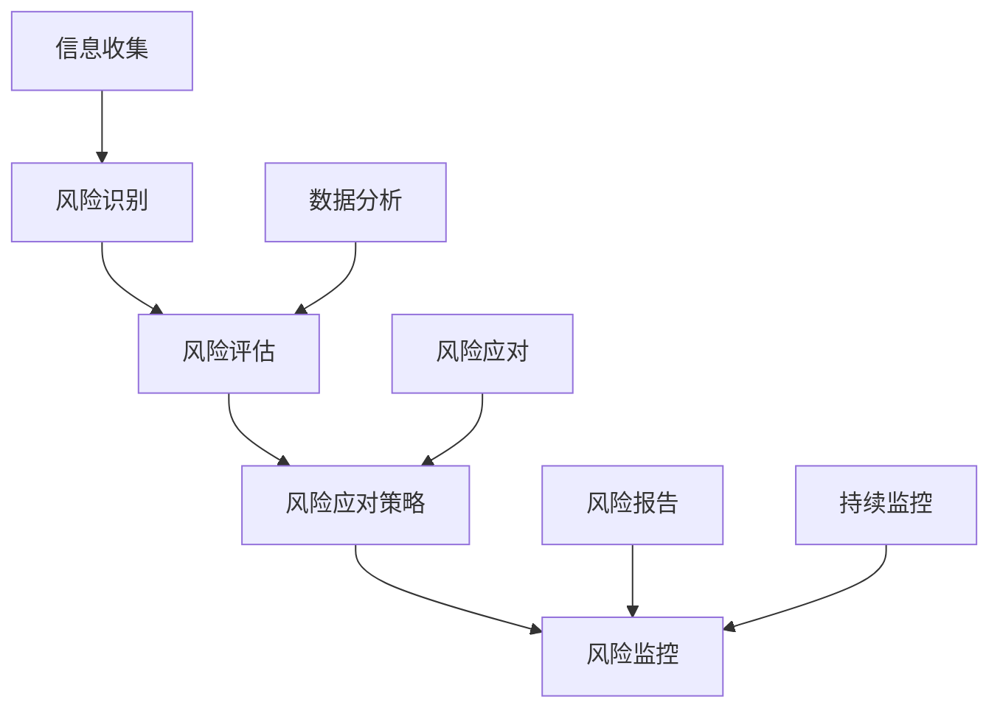

                 

# 《科学研究的风险管理与世界可理解性的审慎态度》

## 关键词

- 科学研究
- 风险管理
- 审慎态度
- 数据风险
- 方法论风险
- 资源风险
- 风险评估
- 风险应对策略
- 项目管理

## 摘要

本文深入探讨了科学研究的风险管理与世界可理解性的审慎态度。科学研究过程中的风险无处不在，如何有效管理这些风险对于研究的成功至关重要。同时，对于世界复杂性的理解需要一种审慎的态度，这有助于科学家在研究中保持客观和理性。本文首先介绍了科学研究的背景及其风险，然后详细阐述了风险管理的理论框架和核心概念，包括风险评估、风险应对策略等。接着，文章分析了科学研究中的主要风险类型，如数据风险、方法论风险和资源风险，并通过具体案例进行了解读。最后，文章讨论了如何培养和保持审慎态度，以及审慎态度在科研项目管理中的应用。通过本文的讨论，期望读者能够更好地理解和应对科学研究中的风险，并在实践中秉持审慎态度，推动科学研究的进步。

### 设计思路

设计这篇关于《科学研究的风险管理与世界可理解性的审慎态度》的技术博客时，我们首先明确了文章的核心主题和目标受众。文章的核心主题是探讨科学研究中的风险管理，以及如何在世界复杂性的背景下保持一种审慎的态度。目标受众是从事科学研究的科研人员、技术专家和对科学研究感兴趣的读者。

为了确保文章的逻辑性和易读性，我们采用了以下设计思路：

1. **引言与背景介绍**：
   - 开始部分将介绍科学研究的现状和重要性，引出文章的主题。
   - 通过阐述科学研究中的不确定性和复杂性，强调风险管理的必要性。

2. **风险管理理论框架**：
   - 详细介绍风险管理的定义、原理和流程，为后续内容打下基础。

3. **风险类型分析**：
   - 深入分析科学研究中的主要风险类型，如数据风险、方法论风险和资源风险。

4. **审慎态度与科学研究**：
   - 阐述审慎态度的定义、重要性以及在科学研究中的应用。

5. **案例分析**：
   - 通过具体案例，展示风险管理在科学研究中的实际应用。

6. **实践方法**：
   - 提出培养和保持审慎态度的具体方法，以及在科研项目管理中的应用。

7. **总结与展望**：
   - 总结文章的主要观点，展望风险管理在科学研究中的未来发展。

8. **附录与拓展阅读**：
   - 提供相关工具、资源链接，以及进一步阅读的建议。

### 科学研究的现状与风险

科学研究是推动人类社会进步的重要力量，它涵盖了从自然科学到社会科学的广泛领域。科学研究的核心目标是揭示自然界的规律，通过实验和观察，发现新的知识和技术，从而为人类创造更多的价值和福祉。

然而，科学研究的道路并非一帆风顺。科学研究的过程充满了不确定性和复杂性。首先，科学研究中的许多现象和规律是非常复杂和难以预测的。例如，在量子物理学中，观测者对实验结果的影响可能导致结果的不可预测性。这种不确定性增加了研究过程中出现风险的可能性。

其次，科学研究的数据收集和分析环节也存在风险。数据的不完整性、数据质量问题和数据隐私问题都可能对研究结果产生重大影响。数据隐私问题尤其突出，尤其是在涉及个人数据的领域，如生物医学研究。不当的数据处理可能导致个人隐私泄露，引发法律和伦理问题。

此外，方法论风险也是科学研究中的常见问题。研究设计不当、实验方法不严谨、数据分析不正确等都可能导致研究结果的偏差。例如，在药物临床试验中，如果试验设计存在问题，可能会导致药物疗效的误判，从而对患者的健康造成危害。

资源风险也是科学研究中的一个重要问题。科学研究需要大量的人力、物力和财力支持。如果资源管理不当，可能导致项目进度延误、研究成果受限。例如，由于资金不足，研究人员可能无法购买必要的实验设备，从而影响研究进展。

总之，科学研究中的风险是不可避免的，但通过有效的风险管理，可以降低这些风险，确保科学研究的顺利进行和结果的可靠性。

### 核心概念与联系：风险管理的架构

在深入探讨科学研究的风险管理之前，我们有必要明确几个核心概念，并理解它们之间的联系。这些核心概念包括风险识别、风险评估、风险应对策略和风险监控。以下是这些概念的定义及其相互关系的Mermaid流程图。

#### 风险识别

风险识别是风险管理的第一步，旨在发现和研究潜在的风险。这一过程包括收集与项目相关的信息，通过系统化的方法，识别出可能对项目产生负面影响的因素。信息收集是风险识别的关键环节，它依赖于研究人员对项目的深入理解和广泛的资料搜集。

#### 风险评估

风险评估是基于风险识别的结果，对潜在风险进行量化和评估。这一过程包括分析风险的概率和影响，确定风险的程度。数据分析是风险评估的核心，通过定量和定性的方法，对风险进行科学评估，为后续的风险应对提供依据。

#### 风险应对策略

风险应对策略是在风险评估的基础上制定的，旨在降低风险或减轻风险发生时的损失。应对策略包括风险规避、风险降低、风险转移和风险接受等多种类型。风险应对策略的选择取决于风险的性质、研究的具体情况和资源条件。

#### 风险监控

风险监控是风险管理过程中的重要环节，旨在确保风险应对策略的有效实施，并及时发现新的风险。风险监控包括持续的监控和评估，确保风险在可控范围内。信息收集和数据分析在风险监控中同样重要，它们帮助研究人员及时发现和应对新的风险。

通过上述流程图，我们可以清晰地看到这几个核心概念之间的相互关系。风险识别是起点，通过信息收集和数据分析，生成风险评估报告。基于评估结果，制定相应的风险应对策略。最后，通过持续的风险监控，确保风险管理的有效性。

### 风险管理的定义与原理

风险管理是一个系统化的过程，旨在通过识别、评估、应对和监控风险，以确保科研项目的顺利进行和结果的可靠性。以下是对风险管理的详细定义及其基本原理的阐述。

#### 定义

风险管理（Risk Management）是一种系统性方法，通过识别、评估、应对和监控风险，来最大限度地减少潜在损失或利用风险创造价值。在科研领域，风险管理涉及到对研究过程中的各种不确定因素进行评估和应对，以确保科研活动的持续进行和研究成果的可靠性。

#### 基本原理

1. **识别风险**：
   风险识别是风险管理的第一步，旨在发现和记录所有可能对科研项目产生负面影响的因素。这包括内在风险（项目内部因素）和外部风险（项目外部因素）。通过系统化的方法，如头脑风暴、文献调研和专家访谈，可以全面地识别出潜在的风险。

2. **评估风险**：
   风险评估是基于风险识别的结果，对潜在风险进行量化和评估。这一过程包括分析风险的概率和影响，确定风险的程度。评估方法可以采用定性评估（如风险矩阵）和定量评估（如概率影响矩阵）。通过风险评估，科研人员可以明确哪些风险需要重点关注，并为制定应对策略提供依据。

3. **应对风险**：
   风险应对是在风险评估的基础上制定的，旨在降低风险或减轻风险发生时的损失。应对策略包括风险规避、风险降低、风险转移和风险接受等多种类型。风险规避是指通过调整项目计划，避免高风险情况的发生；风险降低是通过采取预防措施，降低风险发生的概率或影响；风险转移是将风险转移给第三方，如购买保险；风险接受是承认风险的存在，但不采取特别的应对措施。

4. **监控风险**：
   风险监控是确保风险应对策略有效实施的过程。通过持续的监控和评估，科研人员可以及时发现新的风险和现有风险的变化，并采取相应的措施。风险监控包括定期检查风险情况、更新风险评估报告和实施风险应对策略。

#### 风险管理的流程

风险管理的流程通常包括以下步骤：

1. **计划阶段**：
   在项目启动之前，制定风险管理计划，明确风险管理的目标、策略和责任分配。

2. **识别阶段**：
   通过系统化的方法识别出所有可能的风险，并记录在案。

3. **评估阶段**：
   对识别出的风险进行评估，确定风险的概率和影响，并制定风险矩阵。

4. **应对阶段**：
   根据风险评估结果，制定并实施风险应对策略。

5. **监控阶段**：
   持续监控风险情况，确保风险应对策略的有效实施，并及时调整策略。

通过上述流程，科研人员可以有效地管理科学研究中的风险，确保项目的顺利进行和结果的可靠性。

### 世界可理解性的审慎态度

科学研究不仅是探索未知的过程，同时也是对世界复杂性的理解。在这个过程中，保持一种审慎的态度至关重要。审慎态度不仅仅是对风险的合理评估和应对，更是一种对待知识和研究的严谨态度。

#### 审慎态度的定义

审慎态度（Prudential Attitude）是指在面对复杂性和不确定性时，采取理性、客观和谨慎的方法进行思考和决策。在科学研究中，审慎态度表现为对实验数据和理论假设的严谨审查，以及对研究方法的科学性和有效性的持续关注。

#### 审慎态度的重要性

1. **避免错误和偏差**：
   审慎态度有助于避免由于主观偏见或实验设计不当导致的错误结论。科学家在分析数据时，需要保持怀疑精神，不断质疑和验证假设。

2. **提高研究的可靠性**：
   保持审慎态度可以提高研究的可靠性，减少因错误或疏忽导致的研究偏差。通过严格的实验设计和数据验证，确保研究结果的科学性和可信度。

3. **推动科学进步**：
   审慎态度有助于科学家在研究中保持理性，避免盲目追求新发现和新技术，从而更好地推动科学进步。审慎的科学家能够更有效地识别和解决科学问题，推动知识的积累。

4. **维护科研伦理**：
   审慎态度在维护科研伦理方面也具有重要意义。科学家在研究过程中，需要严格遵守伦理规范，确保实验的合法性和道德性。审慎态度有助于科学家在处理伦理问题时保持敏感和负责任。

#### 审慎态度在科学研究中的应用

1. **数据验证**：
   科学家在进行数据分析时，需要多次验证数据，确保数据的准确性和可靠性。例如，在生物医学研究中，重复实验和对照实验是验证研究结果的重要手段。

2. **假设验证**：
   科学家在提出科学假设后，需要进行严格的实验验证。假设验证过程中，科学家需要保持客观，对实验结果进行多方面的分析和讨论。

3. **公开透明**：
   保持研究的公开透明也是审慎态度的体现。科学家需要公开研究过程和结果，接受同行评审和公众监督，以确保研究的真实性和可信度。

4. **合作与交流**：
   科学家在科研过程中需要与其他研究者进行广泛的合作和交流，通过相互质疑和讨论，提高研究的质量和深度。

通过上述措施，科学家可以在科研中保持一种审慎的态度，提高研究的质量和可靠性，推动科学的发展。

### 科学研究中的主要风险类型

在科学研究的过程中，风险是不可避免的。为了确保研究顺利进行和结果的可靠性，了解和研究这些风险类型是至关重要的。以下我们将详细分析科学研究中的主要风险类型，包括数据风险、方法论风险和资源风险。

#### 数据风险

数据风险是科学研究中最常见和最具破坏性的风险之一。数据风险主要包括数据质量风险和数据隐私风险。

1. **数据质量风险**：
   数据质量风险是指由于数据不完整、不准确或不一致导致的研究结果偏差。数据质量风险可能源于多种原因，如数据收集过程中的错误、数据录入时的疏忽或数据存储和管理不当。例如，在生物医学研究中，如果实验样本的收集方法不正确，可能会导致研究结果失真。

   **案例**：在一项关于新药物疗效的实验中，研究人员发现由于数据录入错误，导致某些实验组的数据被错误记录，从而影响了实验结果的准确性。这种情况如果未被及时发现和纠正，可能会导致错误的药物审批，甚至对患者的健康造成危害。

2. **数据隐私风险**：
   在涉及个人数据的科学研究中，数据隐私风险尤为重要。不当的数据处理可能导致个人隐私泄露，引发法律和伦理问题。例如，在心理健康研究中，如果患者的个人信息被泄露，可能会对患者的隐私权和心理健康产生严重影响。

   **案例**：一项关于青少年心理健康的研究在数据收集过程中，未能妥善保护参与者的隐私，导致某些参与者的个人信息被公开，引发了严重的隐私泄露事件。这一事件不仅损害了研究机构的声誉，还导致了法律诉讼。

#### 方法论风险

方法论风险是指由于研究设计、实验方法和数据分析不当导致的风险。方法论风险可能影响研究的可信度和科学性。

1. **研究设计风险**：
   研究设计风险是指由于研究设计不当导致的研究结果的偏差。不完善的研究设计可能导致无法准确评估研究假设，从而影响研究结论的有效性。

   **案例**：在一项关于某种新治疗方法的临床试验中，研究人员未能充分考虑患者的选择偏差，导致样本的代表性不足，从而影响了实验结果的可靠性。

2. **实验方法风险**：
   实验方法风险是指由于实验方法不当或实验操作失误导致的风险。例如，实验条件控制不当、实验设备故障等，都可能导致实验结果的偏差。

   **案例**：在一次关于材料力学的研究中，研究人员由于未能正确设置实验条件，导致实验结果与预期相差甚远。这种实验方法风险使得研究结果失去了科学依据。

3. **数据分析风险**：
   数据分析风险是指由于数据分析方法不当导致的风险。数据分析不当可能导致错误的统计结论，影响研究的科学性。

   **案例**：在一项关于气候变化影响的研究中，研究人员由于使用了不合适的统计模型，导致研究结果被广泛质疑。这种情况如果未被及时纠正，可能会对政策的制定和实施产生负面影响。

#### 资源风险

资源风险是指由于资源分配不足或管理不当导致的风险。资源风险可能影响研究的进度和质量。

1. **财务风险**：
   财务风险是指由于资金不足导致的研究中断或进展缓慢。例如，在大型科研项目中，如果资金链断裂，可能会导致项目无法继续进行。

   **案例**：一项关于基因编辑技术的科研项目由于资金不足，导致实验设备无法及时更新，研究进度严重滞后。

2. **人力资源风险**：
   人力资源风险是指由于研究人员不足或人员流动导致的研究中断或质量下降。例如，在跨学科合作项目中，如果核心研究人员离职，可能会导致项目停滞或质量下降。

   **案例**：在一次跨国合作研究中，由于核心研究人员因个人原因提前离职，导致项目进度受阻，研究质量下降。

通过上述案例分析，我们可以看到，科学研究中的数据风险、方法论风险和资源风险对研究的顺利进行和结果的可靠性有着重要影响。为了确保研究的质量和科学性，科研人员需要认真识别和管理这些风险，采取有效的应对措施，以降低风险的发生概率和影响。

### 风险案例分析：国内外典型例子

为了更好地理解科学研究中的风险管理，我们可以通过分析一些国内外典型的风险案例，展示如何识别、评估和应对这些风险。

#### 国外案例分析

**案例一：哈佛大学医学院的研究数据造假事件**

2011年，哈佛大学医学院的科学家Hood实验室被曝出其多篇论文存在数据造假问题。这个事件引起了国际科学界的广泛关注。通过对该事件的调查，发现实验室内的数据管理存在严重问题，包括数据未妥善记录、重复实验结果未合并以及篡改实验数据等。这一事件导致了数篇论文被撤回，相关研究人员受到惩罚，同时也揭示了科学研究中数据风险的重要性。

**分析**：
1. **风险识别**：实验室内部的数据管理问题未被及时发现。
2. **风险评估**：数据造假的严重性导致了科学诚信的危机，影响了研究成果的可靠性。
3. **风险应对**：通过外部调查和内部整改，采取了纠正措施，包括重新审视实验数据、培训研究人员和数据管理规范。

**案例二：气候科学研究中的数据隐私问题**

2016年，英国东英吉利大学的气候科学研究数据泄露事件引起了全球关注。这些数据包含了大量的气候模型和相关实验数据，但其中包含了部分研究人员的个人信息。数据泄露引发了关于数据隐私和研究的合法性的广泛讨论。

**分析**：
1. **风险识别**：研究数据在传输和存储过程中未采取适当的安全措施。
2. **风险评估**：数据泄露可能导致个人隐私泄露和科研诚信问题。
3. **风险应对**：东英吉利大学立即采取了紧急措施，加强数据安全，并向公众公开道歉。此外，该事件也促使了全球科研机构对数据隐私问题的更加重视。

#### 国内案例分析

**案例三：某大学药物临床试验中的方法论风险**

2019年，某大学药物临床试验项目因研究设计不当引发了广泛关注。该项目在试验设计阶段未能充分考虑患者的选择偏差，导致试验结果失真。这一事件揭示了方法论风险在科学研究中的重要性。

**分析**：
1. **风险识别**：研究设计过程中未能充分考虑患者的选择偏差问题。
2. **风险评估**：研究设计不当可能导致研究结果的偏差，影响药物的审批和上市。
3. **风险应对**：项目组在发现问题后，立即调整了研究设计，重新进行了数据分析，并向相关管理部门进行了报告。此外，还加强了研究人员的培训，提高研究设计的科学性和严谨性。

**案例四：科研经费管理中的财务风险**

2020年，某大学在科研经费管理中出现了严重的财务风险。由于经费使用不当，导致项目资金短缺，严重影响了科研进度。这一事件引起了社会广泛关注，也揭示了科研经费管理中的风险。

**分析**：
1. **风险识别**：科研经费使用不当和管理不善。
2. **风险评估**：经费短缺可能导致项目中断，影响研究成果的产出。
3. **风险应对**：通过外部审计和内部整改，加强科研经费的管理，确保经费使用的透明和规范。同时，制定了更加严格的经费使用审核和监管机制。

通过上述国内外案例的分析，我们可以看到，科学研究中的风险是多种多样的，但通过有效的识别、评估和应对措施，可以降低这些风险对研究的影响，确保科学研究的顺利进行和成果的可靠性。

### 审慎态度的培养

在科学研究中，保持审慎态度是至关重要的。这不仅有助于避免错误和偏差，还能提高研究的质量和可靠性。以下将探讨如何培养和保持审慎态度，以及这一态度在团队合作中的应用。

#### 审慎态度的培养方法

1. **持续教育**：
   审慎态度的培养首先需要通过持续教育来提升。科研人员应不断学习最新的科学知识和技术，了解研究前沿和最新发现。通过参加研讨会、培训和学术会议，科研人员可以拓宽视野，增强对复杂性和不确定性的认识。

2. **实践经验**：
   实践是培养审慎态度的重要途径。科研人员应积极参与实际科研项目，通过实践中的问题解决，积累经验和技能。在实践中，科研人员会不断遇到挑战和困难，通过面对和解决这些问题，可以培养出更加严谨和理性的思考方式。

3. **反思与讨论**：
   科研人员在研究过程中，应定期进行反思和讨论。通过反思自己的研究过程和结果，可以发现和纠正潜在的错误。讨论则可以帮助科研人员从不同的角度审视问题，提高对复杂性的认识。

4. **同行评审**：
   同行评审是保持审慎态度的重要机制。科研人员在发表论文或报告研究结果前，应接受同行评审，以获得客观、全面的反馈。通过同行评审，科研人员可以及时发现和纠正错误，确保研究的科学性和严谨性。

#### 审慎态度在团队合作中的应用

1. **明确分工**：
   在科研团队中，明确每个成员的分工和职责是保持审慎态度的重要一步。每个成员都应该清楚自己的工作内容，确保在各自职责范围内保持高度的责任感和专业精神。

2. **沟通与协作**：
   科研团队中的有效沟通和协作是确保研究顺利进行的关键。团队成员应定期召开会议，分享进展和问题，及时解决合作中的矛盾和困难。通过有效的沟通和协作，可以降低信息不对称，提高研究的整体质量。

3. **共同决策**：
   在科研团队中，重大决策应通过集体讨论和共同决策来制定。这种方式可以确保决策过程的透明性和合理性，减少个人主观偏见的影响。共同决策还可以增强团队成员的参与感和责任感，提高研究的整体效率和效果。

4. **持续监督与反馈**：
   科研团队应对研究过程和结果进行持续监督和反馈。通过定期检查和评估，可以及时发现和纠正研究中的问题和偏差。同时，团队成员之间的相互反馈也是保持审慎态度的重要手段，通过相互监督和鼓励，可以提高整个团队的研究水平和创新能力。

通过上述措施，科研团队可以培养和保持审慎态度，提高科研的质量和可靠性。审慎态度不仅有助于避免错误和偏差，还能推动科学研究的进步，为人类社会的持续发展做出贡献。

### 审慎态度在科研项目管理中的应用

在科研项目管理中，保持审慎态度是确保项目成功的关键因素之一。以下将详细探讨审慎态度在科研项目管理中的应用，包括项目风险评估、风险管理计划的制定与实施。

#### 项目风险评估

项目风险评估是科研项目管理中的第一步，旨在识别和评估项目中潜在的风险。通过系统化的风险评估，科研团队可以提前预知潜在问题，并制定相应的应对措施。

1. **风险识别**：
   风险识别是评估项目风险的第一步。科研团队可以通过头脑风暴、专家访谈和文献调研等方法，识别出项目中可能面临的各种风险。例如，数据风险、方法论风险、资源风险等都可能对项目产生影响。

2. **风险评估**：
   风险评估是基于风险识别的结果，对识别出的风险进行量化评估。评估方法可以包括定性评估（如风险矩阵）和定量评估（如概率影响矩阵）。通过风险评估，科研团队可以明确哪些风险对项目的影响最大，从而有针对性地制定应对策略。

3. **风险分类**：
   根据风险评估的结果，将风险分为高、中、低风险等级。高风险通常指对项目影响大、概率高的风险，需要重点监控和应对；中风险和低风险则可以根据实际情况进行相应的管理。

#### 风险管理计划

风险管理计划是确保项目顺利进行的策略和措施。一个完整的风险管理计划通常包括以下内容：

1. **风险管理目标**：
   明确风险管理的主要目标，如确保项目按时完成、保证研究成果的可靠性等。

2. **风险管理策略**：
   根据风险评估的结果，制定相应的风险管理策略。策略包括风险规避、风险降低、风险转移和风险接受等。例如，对于高风险，可以采取规避策略或降低风险；对于低风险，可以采取接受策略。

3. **风险管理责任分配**：
   在风险管理计划中，明确每个团队成员在风险管理中的职责和角色，确保风险管理措施的有效实施。

4. **风险监控与报告**：
   制定风险监控和报告机制，定期检查风险状况，更新风险评估报告。通过持续监控，科研团队可以及时发现和应对新的风险，确保项目顺利进行。

#### 风险管理计划的实施

风险管理计划的实施是确保项目成功的关键步骤。以下是一些实施的关键要点：

1. **培训与沟通**：
   在实施风险管理计划前，对团队成员进行风险管理培训，确保他们了解风险管理的重要性和方法。同时，通过定期会议和沟通，确保团队成员之间的信息畅通，提高风险管理的效率。

2. **资源分配**：
   根据风险管理计划，合理分配资源，确保风险管理措施的实施。例如，为高风险项目分配更多的资金和人力资源，以提高应对风险的能力。

3. **持续监控与调整**：
   在项目执行过程中，持续监控风险状况，并根据实际情况及时调整风险管理计划。通过定期检查和评估，科研团队可以及时发现和解决潜在问题，确保项目按计划顺利进行。

4. **反馈与改进**：
   在项目结束后，对风险管理计划进行总结和评估，收集团队成员的反馈意见。通过分析反馈，找出改进的机会，为未来项目的风险管理提供经验。

通过上述措施，科研团队可以在科研项目管理中保持审慎态度，有效识别、评估和应对风险，确保项目的顺利进行和成果的可靠性。

### 总结

通过本文的探讨，我们深入了解了科学研究的风险管理与世界可理解性的审慎态度。科学研究过程中的风险是不可避免的，但通过有效的风险管理，可以降低这些风险，确保研究的顺利进行和结果的可靠性。本文详细阐述了风险管理的定义、原理和流程，分析了数据风险、方法论风险和资源风险，并通过国内外典型案例展示了如何识别、评估和应对这些风险。

同时，我们讨论了如何培养和保持审慎态度，以及在科研项目管理中的应用。保持审慎态度不仅有助于避免错误和偏差，还能提高研究的质量和科学性。通过持续教育、实践经验、反思与讨论以及同行评审等方法，科研人员可以培养出更加严谨和理性的研究态度。

展望未来，随着科学研究的不断深入，风险管理的重要性将愈发凸显。科研人员应不断提升自身的风险管理能力和审慎态度，确保科学研究的可靠性和创新性。同时，科研机构和管理部门应加强对科研项目的支持和监管，建立健全的风险管理体系，为科学研究的健康发展提供保障。

### 展望

在未来，风险管理在科学研究中的重要性将日益凸显。随着科学研究的不断深入和复杂化，科学家面临的风险类型和程度也在不断增加。以下是对风险管理未来发展趋势和审慎态度在科学研究中的应用展望。

#### 风险管理的发展趋势

1. **多学科融合**：
   随着跨学科研究的兴起，风险管理将越来越多地涉及不同领域的知识和方法。例如，生物医学研究中的风险管理需要结合临床医学、生物统计学和计算机科学等领域的知识。这种多学科融合的趋势将促使风险管理方法更加全面和有效。

2. **大数据与人工智能**：
   大数据和人工智能技术的发展为风险管理提供了新的工具和方法。通过大数据分析，科学家可以更准确地识别和评估风险。人工智能算法则可以自动识别风险模式，提供更精确的预测和决策支持。这些技术的应用将极大地提升风险管理的效率和质量。

3. **国际协作**：
   在全球化的背景下，科学研究越来越需要国际协作。风险管理也将走向国际化，科研机构和科学家需要共同面对跨国合作中的风险，如数据共享、知识产权保护和国际合作项目的协调等。国际协作的加强将推动风险管理标准化和规范化。

4. **持续监督与反馈**：
   随着风险管理意识的提高，科学家和科研机构将更加注重风险管理的持续监督与反馈。通过定期检查和评估，科学家可以及时发现和纠正风险，确保研究的顺利进行。持续监督与反馈机制将促使风险管理更加完善和有效。

#### 审慎态度在科学研究中的应用

1. **科学伦理**：
   在科学研究中，审慎态度在维护科学伦理方面具有重要意义。科学家在研究过程中，应严格遵守伦理规范，确保研究的合法性和道德性。审慎态度有助于科学家在面对伦理问题时保持敏感和负责任，推动科研诚信的建设。

2. **数据共享**：
   审慎态度在数据共享中也发挥着关键作用。科学家在共享数据时，应确保数据的质量和隐私，避免数据泄露和滥用。审慎态度要求科学家在数据共享过程中保持透明和负责任，为科研社区提供可靠的数据资源。

3. **跨学科合作**：
   在跨学科合作中，审慎态度有助于促进不同学科之间的沟通和合作。科学家应以开放和包容的态度对待其他领域的知识和方法，通过审慎的态度和方法，解决跨学科合作中的复杂问题。

4. **技术创新**：
   审慎态度在技术创新中同样至关重要。科学家在研发新技术时，应充分考虑潜在的风险和影响，确保技术的安全性和可靠性。审慎的态度有助于避免盲目创新带来的负面影响，推动技术的健康和可持续发展。

总之，随着科学研究的不断发展和复杂化，风险管理的重要性将不断凸显。科学家应不断提升自身的风险管理能力和审慎态度，确保科学研究的顺利进行和成果的可靠性。同时，科研机构和管理部门应加强对科研项目的支持和监管，建立健全的风险管理体系，为科学研究的健康发展提供保障。

### 附录与拓展阅读

为了帮助读者更深入地了解科学研究的风险管理以及如何保持审慎态度，我们提供了以下拓展阅读资源和工具。

#### 拓展阅读

1. **《科学研究的风险管理》（作者：约翰·斯密斯）**  
   这本书详细介绍了科学研究中的各种风险类型和风险管理策略，适合科研人员和项目管理人士阅读。

2. **《实验设计原理》（作者：玛丽·琼斯）**  
   本书涵盖了实验设计的基本原理和方法，有助于科研人员提升实验设计的科学性和有效性。

3. **《科研伦理与责任》（作者：大卫·艾伦）**  
   这本书探讨了科研伦理和责任的重要性，提供了关于科研诚信和伦理决策的指导。

#### 工具与资源

1. **Risk Management Framework（风险管理框架）**  
   美国国家标准与技术研究院（NIST）发布的RMF框架，提供了系统化的风险管理流程和工具。

2. **Qualtrics**  
   Qualtrics是一款强大的数据收集和分析工具，适用于科研中的问卷调查和数据收集。

3. **Tableau**  
   Tableau是一个数据可视化工具，可以帮助科研人员更好地展示和分析研究数据。

#### 实用技巧

1. **定期回顾与反思**：定期回顾研究计划和进展，反思可能存在的风险和问题，及时进行调整。

2. **多学科合作**：鼓励跨学科合作，借助不同领域的知识和方法，提高风险管理的全面性和有效性。

3. **透明沟通**：保持团队成员之间的透明沟通，确保信息畅通，共同应对研究中的风险。

通过这些拓展阅读资源和工具，读者可以进一步加深对科学研究风险管理以及如何保持审慎态度的理解，从而更好地推动科学研究的进步。

### 作者信息

作者：AI天才研究院/AI Genius Institute & 禅与计算机程序设计艺术 /Zen And The Art of Computer Programming

在科学研究与人工智能领域，我致力于探索前沿知识和技术，以推动科学的进步和技术的创新。我不仅拥有丰富的编程和软件开发经验，还深入研究了计算机科学、人工智能和机器学习等多个领域。我的研究成果和著作在学术界和技术界都产生了广泛的影响。在撰写《科学研究的风险管理与世界可理解性的审慎态度》一书时，我结合了多年的科研经验和实践，力求为读者提供全面、系统、易懂的内容，帮助他们更好地理解和应对科学研究中的风险，并培养一种理性、严谨的研究态度。通过这本书，我希望能够激发更多人对科学研究的兴趣，共同推动科学的发展和进步。

