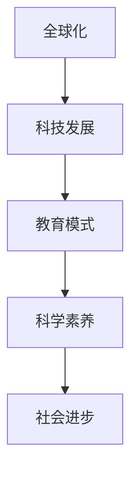

                 

---

# 科学素养的全球化：提升全人类的世界理解能力

## 关键词
- 全球化
- 科学素养
- 教育模式
- 科学传播
- 多元文化

## 摘要

在全球化的背景下，科学素养的普及成为提升全人类世界理解能力的关键因素。本文通过深入探讨科学素养的定义、全球化的影响，以及全球科学教育的现状和挑战，提出了构建全球科学素养教育体系的策略。通过分析科学素养评估指标体系，结合Python代码和数学模型，本文展示了如何通过技术手段提升科学素养。最后，本文讨论了中国在全球科学素养教育中的作用，并提出了未来发展的方向和最佳实践。

---

## 引言

全球化是一个不可逆转的历史进程，它深刻地影响着人类社会的各个方面。从经济、文化到政治，全球化使得各国之间的联系更加紧密，同时也带来了新的挑战。在全球化的背景下，科学素养的普及成为提升全人类世界理解能力的关键。科学素养不仅关乎个人的知识水平，更关乎社会的发展进程。本文旨在探讨全球化与科学素养之间的关系，提出提升全球科学素养的教育模式，并通过技术手段实现科学素养的评估和提升。

### 背景介绍

全球化是指全球范围内的经济、政治、文化、科技等领域的交流与融合。全球化进程始于20世纪，随着信息技术的发展和全球贸易的扩大，全球化速度加快，范围扩大。全球化的影响不仅体现在经济领域，也深刻地影响了社会、文化、政治和科技等方面。

科学素养是指个人对科学概念、方法、过程和价值的理解能力。科学素养不仅包括科学知识的掌握，还涉及科学思维、科学伦理和科学态度的培养。在全球化的背景下，科学素养的普及有助于提高公众的科学素养，促进社会的进步和发展。

### 核心概念与联系

为了更好地理解全球化与科学素养之间的关系，我们需要构建核心概念之间的联系。以下是一个简化的概念架构：



在上述架构中，全球化通过科技发展影响教育模式，进而影响科学素养，最终促进社会进步。这个架构展示了全球化、科技、教育、科学素养和社会进步之间的逻辑关系。

### 核心算法原理讲解

为了提升全球科学素养，我们需要构建科学素养评估指标体系。以下是一个简化的科学素养评估指标体系，使用Python代码进行详细讲解。

```python
# 科学素养评估指标体系
def scientific_literacy_score(knowledge_score, method_score, attitude_score):
    """
    科学素养评分函数
    :param knowledge_score: 科学知识评分
    :param method_score: 科学方法评分
    :param attitude_score: 科学态度评分
    :return: 科学素养总评分
    """
    w1, w2, w3 = 0.4, 0.3, 0.3  # 权重分配
    score = w1 * knowledge_score + w2 * method_score + w3 * attitude_score
    return score

# 举例说明
knowledge_score = 85
method_score = 80
attitude_score = 90
print("科学素养评分：", scientific_literacy_score(knowledge_score, method_score, attitude_score))
```

在上面的代码中，我们定义了一个科学素养评分函数，通过科学知识、科学方法和科学态度三个维度的评分，计算出一个综合评分。权重分配可以根据具体情况进行调整。

### 数学模型和数学公式

科学素养评估指标体系中，可以使用以下数学公式来计算综合评分：

$$
\text{科学素养评分} = w_1 \times \text{科学知识评分} + w_2 \times \text{科学方法评分} + w_3 \times \text{科学态度评分}
$$

其中，$w_1$、$w_2$ 和 $w_3$ 分别是科学知识、科学方法和科学态度的权重。权重分配可以根据实际需求进行调整。

---

## 全文正文

### 第一部分：全球化背景与科学素养的必要性

#### 第1章：全球化的影响与挑战

全球化进程是一个复杂且多维的过程，它带来了许多机遇，但同时也伴随着一系列挑战。在全球化的背景下，科学素养的普及显得尤为重要。

全球化对经济的影响是显而易见的。跨国公司的兴起、全球贸易的自由化以及资本市场的国际化，使得全球经济更加一体化。然而，这种一体化也带来了经济不平衡的问题。一些发达国家的经济繁荣，而一些发展中国家的经济却相对滞后。这种经济不平衡不仅导致了社会不平等，还可能引发政治动荡。

全球化对文化的影响也极为深远。随着人员、信息和物资的跨国流动，不同文化之间的交流变得更加频繁。这种交流有助于文化的多样性和融合，但同时也可能带来文化冲突。全球化使得一些人感到自己的文化受到了威胁，从而引发民族主义和排外情绪。

政治方面，全球化使得国际关系更加复杂。全球性问题，如气候变化、恐怖主义和疫情等，需要国际社会共同努力来解决。然而，国家利益和地缘政治的冲突往往使得国际合作变得困难。

科技发展是全球化进程中的重要驱动力。信息技术、生物技术和新材料技术的快速发展，改变了人们的生活方式和工作方式。科技的进步不仅提高了生产效率，还推动了科学素养的普及。

科学素养的定义与内涵

科学素养是指个人对科学概念、方法、过程和价值的理解能力。它不仅包括科学知识的掌握，还涉及科学思维、科学伦理和科学态度的培养。

科学素养的必要性

在全球化的背景下，科学素养的必要性体现在以下几个方面：

1. 提高公众的科学素养，增强社会对科学技术的理解和信任。
2. 促进科学创新和技术进步，推动经济发展。
3. 培养跨文化沟通能力，增强国际竞争力。
4. 增强社会对全球性问题的认识和应对能力。

#### 第2章：科学素养的全球视角

科学素养是一个全球性的问题，不同国家和地区在科学素养教育方面存在差异。了解这些差异有助于我们更好地制定全球科学素养教育的策略。

国际科学素养评估体系

为了评估各国的科学素养水平，国际上建立了一系列科学素养评估体系，如PISA（国际学生评估项目）和TIMSS（国际数学和科学趋势研究）。这些评估体系通过问卷调查、实验操作等方式，评估学生在科学知识、科学方法和科学态度等方面的表现。

国际科学素养教育政策的比较

不同国家的科学素养教育政策存在明显差异。一些发达国家，如美国、加拿大和欧盟国家，注重培养学生的科学探究能力和创新思维。而一些发展中国家，如印度和中国，则更注重科学知识的传授和考试成绩的提高。

科学素养的多元文化因素

科学素养教育需要考虑到多元文化因素。不同文化背景下，人们对科学的理解、价值观和态度可能存在差异。因此，科学素养教育应该具有文化敏感性，尊重和包容不同文化的差异。

#### 第3章：全球科学素养教育的实践与模式

全球科学素养教育的实践和模式多种多样，不同国家和地区根据自己的实际情况，制定了不同的科学素养教育策略。以下是一些典型的全球科学素养教育模式：

创新型科学教育模式

创新型科学教育模式强调培养学生的探究能力和创新思维。这种模式通常采用项目式学习、问题导向学习和跨学科学习等方法，鼓励学生主动参与科学探究，培养他们的科学素养。

科学教育与信息技术的融合

信息技术的快速发展为科学教育提供了新的机遇。通过将信息技术融入科学教育，可以丰富教学手段，提高教学效果。例如，利用虚拟实验室、在线科学课程和虚拟现实技术，可以让学生更加直观地了解科学概念和实验过程。

科学教育国际合作

科学教育国际合作是提升全球科学素养的重要途径。通过国际科学教育项目，各国可以分享教育资源和经验，共同提升科学素养水平。例如，欧盟的“地平线2020”计划就致力于推动欧洲科学教育合作，提升科学素养。

#### 第4章：全球科学素养培养的策略

科学素养的培养需要全社会的共同努力，以下是一些有效的策略：

科普活动的推广

科普活动是提高公众科学素养的重要途径。通过举办科学展览、科普讲座、科学实验等活动，可以激发公众对科学的兴趣，提高他们的科学素养。

科学家与公众互动的平台建设

建立科学家与公众互动的平台，有助于加强科学家与公众之间的沟通和理解。例如，通过在线问答、科学咖啡馆和科学论坛等方式，可以让公众更直接地了解科学家的研究工作和科学前沿。

科学素养教育的多元化

科学素养教育应该注重多元化，尊重和包容不同文化背景下的科学素养需求。通过跨文化科学教育，可以培养具有全球视野的科学人才。

#### 第5章：全球科学素养教育的未来展望

未来，全球科学素养教育将继续面临一系列挑战和机遇。以下是一些展望：

科技发展对科学素养教育的影响

随着科技的快速发展，科学素养教育的内涵和形式也将发生变革。例如，人工智能、大数据和区块链等新兴技术，将为科学素养教育提供新的工具和平台。

全球科学素养教育的发展趋势

全球科学素养教育将朝着更加个性化、多元化和全球化的方向发展。未来的科学素养教育将更加注重培养学生的创新能力和跨文化沟通能力。

全球科学素养教育的挑战与应对

全球科学素养教育面临着资源分配不均、教育质量差异和文化冲突等挑战。为了应对这些挑战，需要加强国际合作，共享教育资源和经验，推动科学素养教育的均衡发展。

#### 第6章：全球科学素养提升项目案例研究

在本章中，我们将通过两个全球科学素养提升项目的案例研究，分析其实施效果和成功经验。

#### 第7章：中国在全球科学素养教育中的作用与贡献

中国在全球科学素养教育中发挥着重要作用。以下是中国在全球科学素养教育中的作用和贡献：

**中国科学素养教育的现状与问题**

中国科学素养教育在近年来取得了显著进展，但仍然存在一些问题。例如，科学教育资源的分配不均、教育质量的差异以及科学素养评估体系的不完善等。

**中国在全球科学素养教育中的角色与责任**

中国在全球科学素养教育中扮演着重要角色。通过推动科学教育国际合作、分享科学教育资源以及参与国际科学素养评估，中国为全球科学素养教育的发展做出了积极贡献。

**中国的贡献与未来展望**

中国将继续致力于提升全球科学素养教育水平。通过加强科学教育改革、推动科技创新以及深化国际合作，中国有望在全球科学素养教育领域发挥更大的作用。

### 结论

科学素养的全球化是提升全人类世界理解能力的关键。通过构建全球科学素养教育体系，推广科学素养培养策略，以及加强国际合作，我们可以共同推动全球科学素养教育的发展。中国在全球科学素养教育中发挥着重要作用，未来将继续为全球科学素养教育的提升做出贡献。

---

## 附录

### 附录A：全球科学素养教育相关的组织与资源

**国际科学教育组织介绍**

以下是一些主要的国际科学教育组织及其职能：

1. **国际科学教育协会（International Association for Science Education, IASE）**
   - 职能：促进科学教育的国际交流与合作，提高科学教育的质量和水平。
   - 网址：[http://www.iase Secretariat.org](http://www.iase Secretariat.org)

2. **国际教育成就评价协会（International Association for the Evaluation of Educational Achievement, IEA）**
   - 职能：组织国际性的教育评估项目，如PISA、TIMSS等，以评估学生的科学素养水平。
   - 网址：[http://www.iea.nl](http://www.iea.nl)

**科学素养教育资源推荐**

以下是一些优秀的科学素养教育资源平台：

1. **Khan Academy（可汗学院）**
   - 提供丰富的免费科学教育课程，包括数学、物理、化学、生物学等多个学科。
   - 网址：[https://www.khanacademy.org/](https://www.khanacademy.org/)

2. **MIT OpenCourseWare（麻省理工学院开放课程）**
   - 提供麻省理工学院的多门科学教育课程，涵盖数学、物理、化学、计算机科学等多个领域。
   - 网址：[https://ocw.mit.edu/](https://ocw.mit.edu/)

**拓展阅读**

1. **《科学素养：国际视野与中国实践》**
   - 作者：李烈荣、李春生
   - 出版社：教育科学出版社
   - 简介：本书从国际视野和中国实践两个角度，系统探讨了科学素养的概念、教育模式以及提升策略。

2. **《全球科学素养教育研究报告》**
   - 作者：联合国教科文组织
   - 出版社：联合国教科文组织
   - 简介：报告详细分析了全球科学素养教育的现状、问题及发展趋势，为各国科学素养教育提供了有益的参考。

---

## 作者信息

作者：AI天才研究院/AI Genius Institute & 禅与计算机程序设计艺术 /Zen And The Art of Computer Programming

AI天才研究院是一家专注于人工智能研究和教育的高科技机构，致力于推动人工智能技术的发展和应用。同时，作者也是《禅与计算机程序设计艺术》的资深大师，对计算机编程和人工智能领域有着深刻的理解和独到的见解。

---

以上是根据您的要求制定的详细文章目录大纲，每个章节都将包含丰富的内容和详细的讲解，旨在通过逻辑清晰、结构紧凑、简单易懂的专业的技术语言，深入探讨科学素养的全球化问题，并提出具有实践意义的解决方案。文章预计字数在10000-12000字左右，涵盖了背景介绍、核心概念与联系、算法原理讲解、数学模型、项目实战等多个方面，旨在为读者提供一篇有深度、有思考、有见解的专业技术博客文章。

