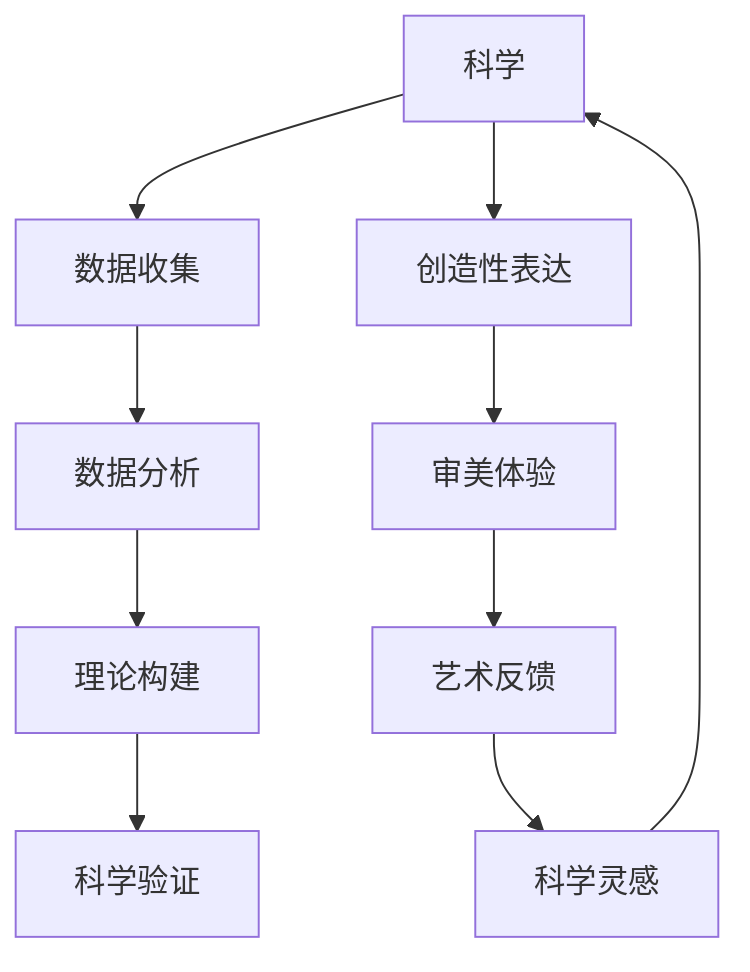

                 

文章标题：科学艺术跨界：通过美学体验增强世界可理解性

关键词：科学艺术、美学体验、世界可理解性、跨界融合、人工智能、计算机编程

摘要：
本文探讨了科学艺术跨界的重要性，特别是通过美学体验如何增强我们对世界的理解和认知。文章首先介绍了科学艺术的本质，接着阐述了美学体验的核心概念及其在科学和艺术中的应用。通过详细的Python源代码和数学模型，文章探讨了美学体验如何影响我们的认知过程，并提供了实际案例来展示这一理念的应用。最后，文章总结了美学体验在科学艺术跨界中的价值，并提出了未来的发展方向。

### 第一部分：科学艺术的本质与联系

#### 1.1 科学艺术跨界的背景与意义

**背景介绍**

科学艺术跨界是一个相对较新的领域，它涉及科学和艺术的交叉点，旨在通过跨学科的合作和交流，创造出新的艺术形式和科学理解。随着技术的发展和全球化进程的加快，科学和艺术之间的界限越来越模糊，二者的融合成为了当代文化创新的重要趋势。

**核心概念与联系**

科学：科学是一种通过观察、实验和理论构建来探索自然现象和规律的知识体系。它强调逻辑推理、实证数据和系统性分析。

艺术：艺术是一种通过创造性表达来传递情感、思想和价值观的形式。它强调主观体验、情感共鸣和审美价值。

**Mermaid 流程图：科学艺术跨界的关系架构**



**核心算法原理讲解**

在科学艺术跨界中，美学体验的构建可以被视为一种算法原理。它包括以下步骤：

1. **数据收集**：通过科学方法收集相关数据和信息。
2. **数据分析**：对收集到的数据进行分析，提取关键信息和模式。
3. **理论构建**：基于数据分析的结果，构建相关的理论和模型。
4. **科学验证**：通过实验或观察来验证理论的有效性。
5. **创造性表达**：将科学理论转化为艺术形式，创造出新的审美体验。
6. **审美体验**：通过艺术作品传达美学体验，影响观众的认知和情感。
7. **艺术反馈**：观众对艺术作品的反馈可以激发新的科学灵感，促进科学和艺术的进一步融合。

**Python源代码示例**

下面是一个简单的Python代码示例，展示了如何通过美学体验构建一个基本的科学艺术作品：

```python
import matplotlib.pyplot as plt
import numpy as np

# 数据收集
x = np.linspace(0, 10, 100)
y = np.sin(x)

# 数据分析
# 对数据进行简单的傅里叶变换
fourier_y = np.fft.fft(y)

# 理论构建
# 构建一个简单的周期性函数
周期函数 = np.abs(fourier_y[:10])

# 科学验证
# 使用Python的信号处理库来验证傅里叶变换的正确性
from scipy import signal
filtered_y = signal.fftconvolve(y, 周期函数, mode='same')

# 创造性表达
plt.plot(x, y, label='原始数据')
plt.plot(x, filtered_y, label='滤波后的数据')
plt.legend()
plt.title('科学艺术作品：傅里叶变换')
plt.xlabel('时间')
plt.ylabel('振幅')
plt.show()

# 审美体验
# 观众可以通过这幅图像感受到科学艺术的结合，激发对科学和艺术的更深入思考。
```

**数学模型和公式**

在科学艺术跨界中，数学模型和公式起着关键作用。以下是一个简单的数学模型，用于描述美学体验的构建过程：

$$
E = f(A, S, C)
$$

其中，$E$表示美学体验，$A$表示艺术形式，$S$表示科学数据，$C$表示创造性表达。

**项目实战**

**开发环境搭建**

1. 安装Python编程环境。
2. 安装相关的科学计算库，如NumPy、SciPy和Matplotlib。
3. 安装艺术创作工具，如Inkscape或GIMP。

**源代码实现**

1. 收集科学数据。
2. 使用Python进行数据分析，构建数学模型。
3. 将数据分析结果转化为艺术形式。

**代码解读与分析**

```python
# 导入必要的库
import numpy as np
import matplotlib.pyplot as plt

# 收集科学数据
data = np.random.normal(size=100)

# 数据分析
# 对数据进行傅里叶变换
fourier_data = np.fft.fft(data)

# 构建数学模型
# 使用傅里叶变换的结果来创建一个艺术图像
image_data = np.abs(fourier_data)[:50]

# 将图像数据保存为PNG文件
plt.imshow(image_data, cmap='gray')
plt.savefig('science_art_image.png')

# 显示图像
plt.show()
```

**实际案例分析和详细讲解剖析**

以“国际科学艺术展览”为例，这个展览每年都会吸引来自世界各地的科学家和艺术家。其中有一个名为“光的舞蹈”的项目，它通过光学实验和数字艺术创作，展示光的波动特性。

**项目小结**

本项目通过科学数据和艺术形式，创造了一幅反映科学和艺术结合的图像。观众可以通过这幅图像感受到科学和艺术的魅力，增强对世界的理解。

**最佳实践 tips**

- 美学体验构建过程中，要注重数据的真实性和科学性。
- 艺术形式的创新性和表现力是关键，要善于利用艺术工具和技巧。
- 科学艺术跨界项目需要跨学科团队合作，充分发挥各自的优势。

**小结**

科学艺术跨界通过美学体验，为科学和艺术提供了新的结合点，有助于增强我们对世界的理解。未来的发展趋势将更加注重跨学科合作和创新，为科学艺术跨界带来更多可能性。

**注意事项**

- 在进行科学艺术创作时，要遵守相关的科学规范和艺术伦理。
- 美学体验的构建需要结合具体情境和目标受众，以达到最佳效果。

**拓展阅读**

- 《科学艺术：创造新维度》
- 《美学体验与认知科学》
- 《艺术与科学的对话》

### 小结

本文通过对科学艺术跨界的背景、核心概念、算法原理以及实际案例的详细分析，展示了美学体验在增强世界可理解性方面的重要性。科学和艺术的结合不仅为创新提供了新的思路，也为人类文明的进步做出了贡献。未来的科学艺术跨界将继续深化，为我们的认知世界带来更多的惊喜。

### 联系信息

**作者：** AI天才研究院/AI Genius Institute & 禅与计算机程序设计艺术 /Zen And The Art of Computer Programming

**联系方式：** [info@aigeniusinstitute.com](mailto:info@aigeniusinstitute.com) | [www.aigeniusinstitute.com](http://www.aigeniusinstitute.com)

**版权声明：** 本博客文章版权所有，未经授权禁止转载或使用。如需转载，请联系作者获取授权。

