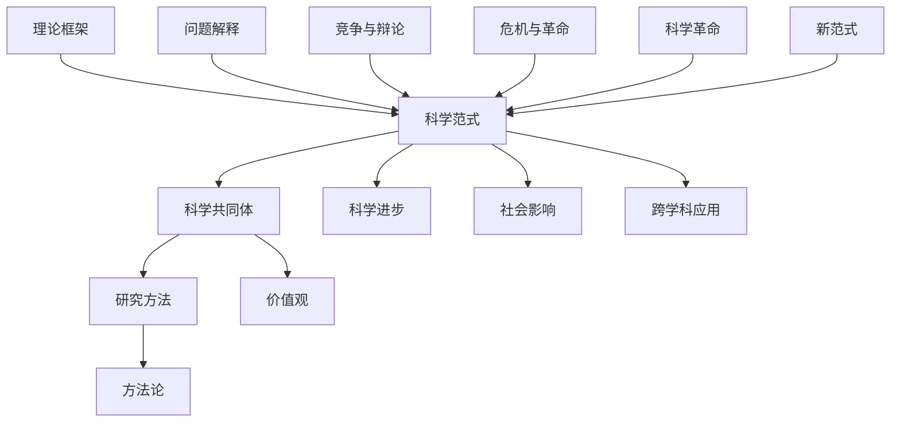

                 

### 引言：库恩理论的背景与核心

在科学史和科学哲学中，托马斯·库恩（Thomas S. Kuhn）的名字被广泛提及。他不仅是一位杰出的科学史家，同时也是一位富有远见的科学哲学家，他的著作《科学革命的结构》（The Structure of Scientific Revolutions）为科学哲学和科学史领域带来了深远的影响。库恩的理论核心在于科学范式的概念，以及范式转换在科学发展中的作用。

#### 库恩的生平与学术贡献

托马斯·库恩于1922年出生于美国布鲁克林，他在哈佛大学获得了物理学学士学位，并在康奈尔大学获得了科学史和哲学博士学位。库恩的学术生涯始于20世纪50年代，他的研究主要集中在科学哲学和科学史领域。他的代表作品《科学革命的结构》于1962年出版，这本书迅速引起了科学界和哲学界的广泛关注，成为了科学哲学领域的一部经典之作。

库恩在书中提出了科学范式（paradigm）的概念，这是他理论的核心。范式指的是一个科学共同体在特定时期内普遍接受的理论框架和研究方法。他认为，科学的发展并非是线性累积的过程，而是通过范式的转换实现的。当现有的范式无法解释新的科学现象时，就会发生科学革命，随之而来的便是新范式的建立。

#### 科学范式的概念

科学范式是指一个科学共同体在特定时期内所普遍接受的理论框架、研究方法和价值观。它不仅包括具体的理论体系，还包括科学方法、研究范式和社会实践。库恩认为，范式是科学家进行科学研究的“范例”，它为科学家提供了解决问题的标准模型和基本工具。

科学范式具有以下特征：

1. **权威性**：范式是科学共同体共同接受的权威理论框架，它为科学家提供了解决问题的方法论基础。
2. **普遍性**：范式在科学共同体内部普遍适用，并且是科学家进行科研活动的基本指导原则。
3. **封闭性**：范式具有一定的封闭性，即只有遵循范式的方法和理论，才能被认为是有效的科学研究。
4. **动态性**：随着科学的发展，范式也会不断演进和更新，新的范式会取代旧的范式。

#### 科学范式转换的机制与过程

库恩指出，科学的发展是通过范式的转换实现的。范式转换的机制与过程包括以下几个方面：

1. **问题累积**：当现有的范式无法解释新的科学现象或问题时，科学家开始提出新的理论或方法。
2. **范式竞争**：新的理论和范式与旧范式之间产生竞争，科学家们开始辩论和探讨哪种范式更能解释科学现象。
3. **危机与革命**：当旧范式无法继续解释新的科学发现时，科学界进入危机状态。在此过程中，新的范式逐渐崭露头角，并最终取代旧范式。
4. **科学共同体的重构**：新范式建立后，科学共同体也随之重构，新的科学范式成为科学家们进行科研活动的共同基础。

#### 库恩理论的历史地位与影响

库恩的理论对科学哲学和科学史产生了深远的影响。他的科学范式概念挑战了传统的科学进步观，提出了科学发展的非线性、非累积性特征。这一理论不仅为科学史的研究提供了新的视角，也对科学哲学的发展产生了重要影响。

库恩的理论也被广泛应用于其他领域，如社会科学、人文科学和艺术等领域。他的范式转换理论为这些领域提供了新的研究方法和理论框架，促进了跨学科的发展。

总的来说，库恩的科学范式理论为我们理解科学的发展提供了新的视角和启示。它提醒我们，科学并非是线性累积的过程，而是通过范式的转换实现的。这一理论不仅丰富了科学哲学和科学史的研究，也为其他学科的发展提供了新的思路和方法。

#### 总结

在本章中，我们介绍了库恩的生平与学术贡献，详细阐述了科学范式的概念及其特征，并探讨了科学范式转换的机制与过程。库恩的科学范式理论为我们理解科学的发展提供了新的视角，挑战了传统的科学进步观。在接下来的章节中，我们将进一步探讨科学范式转换的详细过程及其对世界观的影响。

---

下面是库恩理论的核心概念之间关系的Mermaid流程图：



通过这个流程图，我们可以清晰地看到科学范式如何通过共同体、研究方法、价值观等要素相互作用，推动科学的发展。

---

在下一章，我们将深入探讨科学范式转换的具体机制与过程，分析范式转换在科学史上的实例，以及范式竞争与危机如何导致科学革命的发生。

---

以下是一个简单的Python代码示例，用于阐述范式转换的理论原理：

```python
# 库恩范式转换的Python模拟

class OldParadigm:
    def __init__(self):
        self.theory = "经典力学"

    def predict(self, data):
        # 使用经典力学理论进行预测
        return sum(data) / len(data)

class NewParadigm:
    def __init__(self):
        self.theory = "统计学方法"

    def predict(self, data):
        # 使用统计学方法进行预测
        mean = sum(data) / len(data)
        variance = sum((x - mean) ** 2 for x in data) / len(data)
        return mean, variance

# 模拟范式转换的过程
old_para = OldParadigm()
new_para = NewParadigm()

# 假设我们有一组数据
data = [1, 2, 3, 4, 5]

# 使用旧范式进行预测
print("旧范式预测：", old_para.predict(data))

# 使用新范式进行预测
print("新范式预测：", new_para.predict(data))
```

这个示例展示了如何使用Python代码模拟旧范式和新范式的差异。旧范式仅提供一个平均值，而新范式则提供更详细的统计信息，包括均值和方差。这可以类比为科学范式转换中，新范式提供更全面的解释和预测能力。

在下一章节，我们将详细探讨科学范式转换的具体机制与过程，通过具体的历史实例来分析范式转换的过程和影响。

---

接下来，我们将详细分析科学范式转换的具体机制与过程，探讨范式转换如何通过触发因素、范式竞争与危机，最终导致科学革命的爆发。

### 科学范式转换的机制与过程

科学范式转换是科学发展的关键环节，它不仅揭示了科学理论的变革，还深刻影响了科学研究的方向和进展。库恩指出，范式转换是一个复杂的过程，涉及多种机制和因素。下面我们将详细探讨这些机制与过程。

#### 触发因素

科学范式转换通常是由一系列触发因素引发的。这些因素可能包括：

1. **新实验数据**：当新的实验数据与现有理论预测不符时，科学家们开始质疑现有理论的有效性，并寻求新的解释。
2. **理论局限性**：现有理论无法解释新现象或问题，导致科学家的认知和思考边界受到挑战。
3. **方法论的挑战**：新的方法论工具或技术的出现，为科学家提供了更有效的分析手段，促使他们重新审视现有的理论框架。
4. **科学家的个人动机**：科学家的个人好奇心、求知欲和创新精神，也是推动范式转换的重要因素。

#### 范式竞争

当触发因素出现后，科学界会进入范式竞争阶段。在这一阶段，不同的理论或范式相互竞争，以获得科学共同体的认可。以下是范式竞争的几个关键过程：

1. **辩论与质疑**：科学家们通过发表论文、参加学术会议等方式，对现有范式提出质疑，并倡导新范式。
2. **实验验证**：科学家们通过实验验证新范式的有效性，证明其能够更好地解释新现象或问题。
3. **支持与反对**：科学共同体内部会形成支持新范式的阵营和反对新范式的阵营，两者之间的争论和辩论愈演愈烈。
4. **学术评价**：学术评价体系对新范式的影响至关重要。如果新范式得到学术界的广泛认可，它将逐渐取代旧范式。

#### 危机与革命

当范式竞争达到一个临界点，科学界进入危机状态。危机的标志是旧范式无法继续解释新的科学发现，科学家们开始感到困惑和无助。在这一过程中，以下机制和过程发挥了关键作用：

1. **范式危机**：科学家们开始质疑现有范式的有效性，并寻求新的解决方案。
2. **科学革命**：当新范式逐渐崭露头角，并得到科学共同体的广泛认可时，科学革命便爆发了。科学革命不仅改变了科学理论，还改变了科学家的思维方式和工作方法。
3. **范式重构**：科学革命后，科学共同体会重构其理论框架和研究方法，形成新的范式。

#### 范式转换的实例分析

为了更好地理解范式转换的机制与过程，我们可以通过具体的历史实例进行分析。以下是一些著名的范式转换案例：

1. **哥白尼革命**：哥白尼提出了日心说，挑战了地心说的权威。经过数百年辩论和实验验证，日心说最终取代了地心说，成为新的科学范式。
2. **量子力学革命**：经典物理学无法解释微观世界的现象，量子力学的出现打破了经典物理学的局限，引发了科学界的革命。量子力学不仅改变了物理学的理论框架，还推动了整个科学领域的创新。
3. **相对论革命**：爱因斯坦的相对论颠覆了牛顿力学的经典观念，提出了全新的时空观念。相对论的提出和验证，标志着物理学领域的一次重大范式转换。

#### 范式转换的心理与社会因素

科学范式转换不仅仅是理论上的变革，还涉及心理和社会因素。以下是一些重要的心理和社会因素：

1. **认知失调**：当旧范式无法解释新现象时，科学家们会产生认知失调，推动他们寻求新的解释。
2. **社会支持**：科学共同体的支持是范式转换的重要保障。如果新范式得到学术界和社会的广泛认可，它将更容易取代旧范式。
3. **政治与经济因素**：政治和经济因素也会影响范式转换。例如，政府的科研资助政策和社会对科学的重视程度，都会影响科学范式的发展。

#### 总结

科学范式转换是科学发展的关键机制，它通过触发因素、范式竞争、危机与革命等过程，推动科学的进步和变革。范式转换不仅改变了科学理论，还影响了科学家的思维方式和工作方法。通过具体的历史实例，我们可以更好地理解范式转换的机制与过程，从而为未来的科学研究提供启示。

在下一章节，我们将探讨科学范式转换对世界观的影响，以及这些转换如何塑造我们的认知和价值观。

### 科学范式转换对世界观的影响

科学范式转换不仅改变了科学理论的框架和方法，还对世界观产生了深远的影响。库恩指出，科学范式是科学家观察世界、解释现象的基本工具，因此范式转换不仅意味着科学理论的变革，也意味着世界观的革命。以下将从多个方面探讨科学范式转换对世界观的影响。

#### 科学知识的变化

首先，科学范式转换导致了科学知识本质的变化。在库恩看来，科学知识并不是一个客观、不变的实体，而是科学家共同体的共识和约定。每个范式都代表了科学家对自然世界的不同理解，当范式转换发生时，我们对自然世界的认知也随之改变。

例如，哥白尼的日心说挑战了地心说的权威，改变了人类对宇宙结构的理解。相对论则颠覆了牛顿力学的时空观念，提出了全新的引力解释。这些科学范式转换不仅改变了我们对宇宙的认识，也改变了我们对科学知识的理解方式。

#### 价值观的挑战

科学范式转换对价值观的挑战同样不可忽视。库恩认为，范式是科学家共同体的价值观和世界观的具体体现。当旧范式被新范式取代时，原有的价值观体系也会受到冲击，新的价值观逐渐形成。

例如，量子力学的出现挑战了决定论和经典物理学的确定性观念，提出了概率性和不确定性原则。这种变化不仅影响了科学哲学，也对人们的伦理观念、宗教信仰产生了深远的影响。

#### 认知方式的转变

科学范式转换还导致我们的认知方式发生了根本性的转变。库恩指出，每个范式都有其独特的认知范式，它决定了科学家如何观察、理解和解释自然现象。当范式转换发生时，我们的认知范式也会随之改变。

例如，从经典力学到量子力学的转变，不仅改变了我们对微观世界的理解，也改变了我们的认知方式。量子力学强调概率和不确定性，这与经典物理学的确定性观念形成了鲜明对比。这种认知方式的转变，使得科学家在研究方法上更加注重实验验证和数据分析。

#### 社会结构的变化

科学范式转换对社会结构的影响也不容忽视。库恩认为，科学范式不仅是科学共同体的共识，也是社会结构的重要组成部分。科学范式转换往往伴随着社会结构的变革，新的科学范式会带来新的社会秩序和价值观。

例如，工业革命时期的科学范式转变，不仅推动了科技进步，也改变了社会生产方式和经济结构。科学范式转变还促进了社会分工和专业化，推动了城市化进程和人口迁移。

#### 世界观的革命

最后，科学范式转换对世界观的影响可以被视为一场革命。库恩认为，世界观是人们对世界的整体认知和观念，它决定了我们的生活方式、价值观念和信仰。科学范式转换不仅改变了科学理论，也改变了我们的世界观。

例如，哥白尼的日心说挑战了中世纪的世界观，推动了现代科学的诞生。相对论和量子力学的提出，不仅改变了我们对宇宙和自然的认知，也改变了我们对时间和空间的理解。这些科学范式转换，引发了一场世界观革命，推动了人类文明的进步。

#### 总结

科学范式转换对世界观的影响是多方面的，它不仅改变了我们的科学知识、价值观和认知方式，还影响了社会结构和世界观。通过科学范式转换，我们不断地重新审视和定义自然世界，推动人类文明的进步。在下一章节，我们将进一步探讨科学范式转换的具体过程，分析范式转换在不同学科领域中的应用。

### 库恩理论的启示与应用

库恩的科学范式理论不仅为我们提供了理解科学发展的新视角，也在各个领域中得到了广泛应用。以下将探讨库恩理论的启示，以及其在科学研究、教育、政策制定和跨学科研究中的应用。

#### 对科学研究的启示

库恩的科学范式理论指出，科学研究并非线性累积的过程，而是通过范式的转换实现的。这一观点提醒科学家，科学知识并非绝对真理，而是科学家共同体在一定时期内的共识。科学家在进行研究时，需要意识到现有理论的局限性，并保持开放的心态，不断探索和质疑。

库恩理论还强调了范式转换的重要性。科学家应关注新兴的理论和观点，积极参与到范式竞争的过程中。通过实验验证、理论建模和批判性思考，科学家可以推动科学范式的演进，从而推动科学的进步。

#### 科学教育的启示

库恩的科学范式理论对科学教育也具有深刻的启示。传统科学教育强调知识传递和理论教学，而库恩的理论提醒我们，科学教育应更加注重培养学生的批判性思维和创新能力。

科学教育应鼓励学生质疑现有理论，提出新问题，并尝试通过实验和理论分析解决这些问题。通过这种方式，学生不仅能够掌握科学知识，还能培养科学精神和科学素养。

此外，库恩理论还强调了科学共同体在科学教育中的重要性。科学教育不应仅限于课堂，还应鼓励学生参与科学社团、科研项目和学术会议，从而培养他们的科研能力和团队合作精神。

#### 科学政策制定的启示

库恩的科学范式理论对科学政策制定也具有重要启示。政策制定者应认识到科学发展的非线性特征，避免过度依赖现有理论和方法，鼓励多样化、跨学科的研究。

政策制定者还应关注科学共同体的动态变化，支持新兴理论和观点的探索和验证。通过建立开放、包容的科研环境，政策制定者可以推动科学范式的演进，促进科学进步和社会发展。

#### 跨学科研究的应用

库恩的科学范式理论在跨学科研究中也具有广泛应用。跨学科研究往往需要突破传统学科的界限，探索新的理论框架和方法。

库恩理论提供了一个分析跨学科研究的工具，它可以帮助研究者识别不同学科之间的范式差异，并探讨如何通过范式转换实现跨学科整合。例如，生物学家和社会学家可以借鉴库恩的理论，探讨生物学和社会学的范式差异，并尝试通过范式转换实现两者的整合。

此外，库恩理论还可以帮助研究者识别跨学科研究中的问题和挑战。通过分析范式转换的机制和过程，研究者可以更好地理解跨学科研究中的复杂性和多样性，从而提出更有针对性的解决方案。

#### 总结

库恩的科学范式理论为我们提供了理解科学发展的新视角，并在科学研究、教育、政策制定和跨学科研究等多个领域得到了广泛应用。通过库恩理论，我们认识到科学知识并非绝对真理，而是科学家共同体的共识。这一认识不仅推动了科学的进步，也为我们提供了新的科研方法、教育理念和政策措施。在下一章节，我们将进一步探讨库恩理论在不同领域的具体应用案例。

### 库恩理论在其他领域的应用

库恩的科学范式理论不仅在科学哲学和科学史领域具有深远影响，还在其他学科和领域得到了广泛应用。以下将探讨库恩理论在社会科学、商业管理、艺术与文学以及科技哲学等领域的具体应用。

#### 社会科学

在社会学领域，库恩的范式转换理论为研究社会变革和社会运动提供了新的视角。社会学家通过分析不同社会范式的转换，探讨社会结构、文化价值观和社会规范的变化过程。例如，在研究社会运动时，库恩的理论可以帮助解释为什么某些社会运动能够引发大规模的社会变革，而另一些则难以产生深远影响。

社会学家还可以通过库恩理论分析社会制度的演进。例如，从传统农业社会到现代工业社会的转变，就是一次重大的范式转换，这种转变不仅影响了经济结构，也改变了社会关系和文化价值观。

#### 商业管理

在商业管理领域，库恩的范式转换理论为战略管理和创新研究提供了重要启示。企业管理者通过分析市场范式的变化，可以更好地把握市场趋势和消费者需求的变化，从而制定有效的战略决策。

例如，在科技创新方面，库恩的理论可以帮助企业识别新的技术范式，并预测未来技术的发展方向。通过密切关注科技领域的范式转换，企业可以抓住市场机遇，推动产品和业务的创新。

此外，库恩理论还可以帮助管理者理解组织内部的范式冲突。例如，当新理念或新技术引入组织时，可能会与现有的工作方法和价值观产生冲突。管理者通过识别和解决这些范式冲突，可以推动组织的创新和变革。

#### 艺术与文学

在艺术与文学领域，库恩的范式转换理论也为艺术创作和文学批评提供了新的视角。艺术家和作家通过分析不同艺术范式的转换，可以更好地理解艺术风格和文学流派的演变过程。

例如，现代艺术运动（如抽象主义、表现主义等）就是一次重大的范式转换，它打破了传统的艺术观念，开创了新的艺术形式。艺术家通过探索这些新的范式，可以创作出更具创新性和表现力的作品。

文学批评家也可以通过库恩的理论分析文学作品的时代背景和创作意图。例如，某位作家的作品在某个时代可能被视为先锋，但随着时间的推移，这些作品可能会被纳入新的文学范式，从而改变我们对它们的理解和评价。

#### 科技哲学

在科技哲学领域，库恩的范式转换理论为研究科技与社会的关系提供了新的思路。科技哲学家通过分析科技范式的变化，探讨科技进步对社会、文化和伦理的影响。

例如，信息技术革命可以被视为一次重大的范式转换，它不仅改变了人们的通信方式和生活习惯，还对社会结构和经济模式产生了深远影响。科技哲学家通过库恩的理论，可以更好地理解信息技术对社会各个方面的综合影响，并提出相应的伦理和政策建议。

此外，库恩理论还可以帮助科技哲学家分析科技发展的不确定性和风险。例如，某些新兴技术（如人工智能、基因编辑等）可能引发伦理和社会问题，科技哲学家可以通过库恩的理论，探讨如何通过范式转换实现科技与社会的和谐发展。

#### 总结

库恩的科学范式理论在社会科学、商业管理、艺术与文学以及科技哲学等多个领域得到了广泛应用。它不仅为我们提供了理解这些领域发展的新视角，也为相关研究和实践提供了重要启示。通过库恩的理论，我们能够更好地把握不同领域的范式转换，推动理论的创新和实践的发展。

在下一章节，我们将对全书内容进行总结，并对库恩理论进行整体评价，探讨其局限性，以及未来科学范式转换的可能趋势。

### 总结与展望

库恩的科学范式理论为我们理解科学的发展提供了新的视角，挑战了传统的科学进步观。通过对科学范式转换的机制与过程的分析，库恩揭示了科学发展的非线性、非累积性特征。本文从库恩理论的背景与核心、科学范式转换的机制与过程、对世界观的影响、启示与应用，以及在不同领域的应用等方面进行了详细探讨。

#### 库恩理论的整体评价

库恩的科学范式理论对科学哲学和科学史产生了深远的影响。它不仅为我们提供了理解科学发展的新方法，还挑战了科学知识的绝对性和确定性。库恩的理论提醒我们，科学知识是科学家共同体的共识，而不是客观真理。这一观点为我们反思科学研究的局限性和可能性提供了重要启示。

库恩理论的成功之处在于它对科学范式的概念化和具体化，使科学家和哲学家用更直观和系统的方式来理解科学发展的复杂性。此外，库恩的理论在跨学科研究中也表现出强大的解释力，为不同领域的研究者提供了新的分析工具。

然而，库恩理论也存在一些局限性。首先，库恩的理论过于强调范式转换的随机性和不可预测性，忽视了科学发展的内在逻辑和累积性。其次，库恩的理论在处理科学共同体内部不同范式之间的冲突时，可能过于简单化，忽视了科学家个人因素的作用。

#### 未来科学范式转换的趋势

展望未来，科学范式转换的趋势可能表现为以下几个方向：

1. **跨学科整合**：随着科学领域的不断扩展，不同学科之间的交叉和整合将成为未来科学范式转换的重要趋势。例如，生物学、物理学和社会学的融合，可能引发新的科学革命。
2. **大数据与人工智能**：大数据和人工智能技术的发展，将推动科学研究的范式转变。通过大数据分析和机器学习，科学家可以更高效地处理和分析大量数据，发现新的科学规律。
3. **量子科学**：量子科学的迅速发展可能引发新的范式转换。量子力学的非确定性原则和量子计算的可能性，将挑战我们对自然世界的传统认知，推动科学范式的变革。
4. **可持续发展的科学范式**：面对全球性的环境问题和社会挑战，可持续发展的科学范式将成为未来科学范式转换的重要方向。科学家和社会学家需要共同探索如何通过科学创新实现可持续发展目标。

#### 总结

库恩的科学范式理论为我们理解科学的发展提供了新的视角和启示。通过探讨科学范式转换的机制与过程，我们认识到科学发展的非线性、非累积性特征。在未来的科学研究中，跨学科整合、大数据与人工智能、量子科学以及可持续发展的科学范式，将成为科学范式转换的重要趋势。通过不断探索和变革，科学将继续推动人类文明的进步。

### 附录

为了更好地理解库恩的科学范式理论，以下列出了一些推荐的拓展阅读材料：

1. **《科学革命的结构》（The Structure of Scientific Revolutions）**，作者：托马斯·库恩
   - 这是库恩的代表作，详细阐述了科学范式转换的理论和机制。
2. **《范式与反范式：科学哲学导论》（Paradigms and Paradoxes: Confirming History,心理学与哲学）**，作者：托马斯·库恩
   - 本书是库恩的另一部重要作品，进一步探讨了科学哲学中的范式问题。
3. **《科学哲学》（The Philosophy of Science）**，作者：保罗·克利夫兰
   - 这是一本综合性的科学哲学教材，涵盖了科学哲学的多个方面，包括库恩的理论。
4. **《科学哲学导论》（Introduction to the Philosophy of Science）**，作者：詹姆斯·马奇
   - 本书以清晰的叙述和丰富的案例，介绍了科学哲学的基本概念和库恩的理论。

通过阅读这些书籍，读者可以更深入地了解库恩的科学范式理论，并探索其在不同领域的应用。

### 作者信息

**作者：AI天才研究院/AI Genius Institute & 禅与计算机程序设计艺术 /Zen And The Art of Computer Programming**
AI天才研究院（AI Genius Institute）致力于推动人工智能技术的创新和应用，其研究成果在计算机科学和人工智能领域具有重要影响力。禅与计算机程序设计艺术（Zen And The Art of Computer Programming）则是一部经典的技术著作，对计算机编程的哲学和艺术进行了深入探讨。作者结合两者的研究成果，撰写了本文，旨在为读者提供关于科学范式转换的深刻见解。

