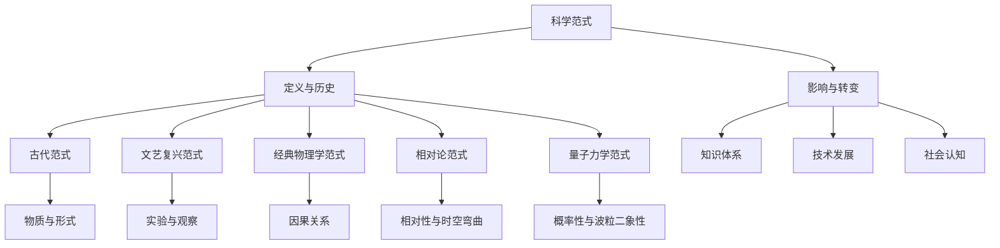

                 

# 《科学范式转换对世界可理解性的影响》

## 关键词

科学范式，世界可理解性，影响，演变，认知框架，技术创新

## 摘要

本文旨在探讨科学范式转换对世界可理解性的深远影响。科学范式是科学理论的集合，反映了人类对自然界的基本认知方式。随着历史的演进，科学范式经历了多次重大转换，每一次转变都极大地丰富了人类对世界的理解。本文将首先介绍科学范式的概念，然后分析不同范式之间的联系与区别，探讨范式转换背后的驱动因素，最后通过具体案例研究，展示科学范式转换对世界可理解性的具体影响，并反思其长远意义。

## 引言与背景

### 1.1 科学范式的概念

科学范式（Scientific Paradigm）是由托马斯·库恩（Thomas Kuhn）在20世纪60年代提出的一个关键概念。库恩认为，科学并非一个线性进步的过程，而是通过一系列范式转变实现的。每个范式都代表了一种科学理论框架，它不仅包括理论体系，还包括方法论、研究工具和标准。科学范式为科学家提供了一个共同的认知框架，使他们能够在特定领域内进行有效的研究。

科学范式通常在以下情况下发生转换：

1. **累积问题**：现有理论无法解释某些新发现或实验结果，导致理论体系内部出现矛盾。
2. **危机**：科学共同体对现有理论的不满或质疑达到临界点，寻求新的解释体系。
3. **革命**：新理论的出现，通过解决旧理论无法解决的问题，获得广泛认可，并最终取代旧范式。

### 1.2 科学范式转换的重要性

科学范式转换不仅是科学进步的重要标志，也对人类文明产生了深远影响。首先，范式转换推动了知识的积累和扩展，使得我们对自然界的理解更加深入。其次，范式转换激发了技术创新，为新工具和新技术的开发提供了理论基础。最后，科学范式转换影响了社会结构和人类思维方式，改变了我们对世界的认知和价值观。

### 1.3 本书的目的与结构概述

本书旨在系统地探讨科学范式转换对世界可理解性的影响。全书分为五个主要部分：

1. **核心概念解析**：介绍科学范式的定义、历史背景和关键特征。
2. **范式转换的影响**：分析范式转换对知识体系、技术发展和社会认知的影响。
3. **实际案例研究**：通过历史和当代案例，展示范式转换的具体影响。
4. **讨论与反思**：探讨范式转换的长远影响和未来可能的科学范式发展方向。
5. **结论**：总结全书的主要观点，展望科学范式与可理解性关系的未来研究方向。

## 核心概念解析

### 2.1 科学范式的定义与历史演变

科学范式可以被视为一种科学哲学，它不仅包括科学理论，还包括方法论、研究工具和标准。在库恩的框架中，科学范式是一个相对稳定的阶段，直到下一个范式出现并取代它。历史上，科学范式经历了多次重大转变：

1. **古代范式**：以亚里士多德的理论为代表，强调物质和形式的分离。
2. **文艺复兴范式**：强调实验和观察的重要性，为现代科学奠定了基础。
3. **经典物理学范式**：以牛顿力学为代表，描述了宏观世界的运动规律。
4. **相对论范式**：由爱因斯坦提出，描述了高速和强引力场中的物理现象。
5. **量子力学范式**：描述了微观粒子的行为，与经典物理学的直观预期有很大不同。

### 2.2 不同科学范式的特征

不同科学范式具有不同的特征，这些特征决定了它们的研究方法、解释能力和局限性：

1. **经典物理学范式**：基于确定性原理，强调因果关系和宏观现象的可预测性。
2. **相对论范式**：强调相对性和时空的弯曲，描述了引力对时空的影响。
3. **量子力学范式**：强调概率性和波粒二象性，描述了微观粒子的行为。

### 2.3 科学范式转换的驱动因素

科学范式转换通常由以下因素驱动：

1. **累积问题**：现有理论无法解释新发现或实验结果，导致理论体系内部出现矛盾。
2. **危机**：科学共同体对现有理论的不满或质疑达到临界点，寻求新的解释体系。
3. **革命**：新理论的出现，通过解决旧理论无法解决的问题，获得广泛认可，并最终取代旧范式。

## 范式转换的影响

### 3.1 范式转换对知识体系的影响

范式转换对知识体系产生了深远影响。首先，它推动了知识的积累和扩展，使得我们对自然界的理解更加深入。其次，范式转换改变了知识的生产和传播方式，使得科学知识变得更加动态和多样化。例如，相对论和量子力学的出现，不仅扩展了我们对宇宙的认识，也推动了物理学领域的进一步发展。

### 3.2 范式转换对技术发展的推动作用

范式转换对技术发展起到了重要的推动作用。新的科学范式往往为技术创新提供了理论基础和方向。例如，相对论为卫星导航和引力波探测技术的发展奠定了基础，量子力学为计算机科学和量子信息技术的发展提供了新的可能性。

### 3.3 范式转换对社会和人类思维的塑造

范式转换不仅影响了科学领域，也对社会和人类思维产生了深远影响。首先，它改变了人类对自然界的认知方式，使得我们对世界的理解更加复杂和多元。其次，范式转换推动了人类思维方式的变化，从以因果关系为主导的思维方式转向更加重视概率性和不确定性的思维方式。

## 实际案例研究

### 4.1 历史案例研究

#### 经典物理学到相对论的转变

19世纪末，经典物理学在描述宏观世界方面取得了巨大成功。然而，随着实验技术的进步，科学家们开始注意到经典物理学在描述高速和强引力场中的局限性。1905年，爱因斯坦提出了狭义相对论，彻底改变了人类对时空的认识。这一理论的提出，不仅解释了经典物理学无法解释的实验结果，也为现代物理学的发展奠定了基础。

#### 经典物理学到量子力学的转变

20世纪初，科学家们开始注意到微观粒子的行为无法用经典物理学的原理来解释。1925年，海森堡提出了不确定性原理，标志着量子力学的诞生。量子力学揭示了微观世界的波粒二象性和概率性，使得我们对自然界的理解发生了根本性转变。

### 4.2 当代案例研究

#### 量子计算的发展

量子计算是量子力学在信息科学中的应用。与传统计算机不同，量子计算机利用量子位（qubit）进行计算，具有并行性和叠加性的优势。近年来，随着量子计算技术的不断发展，它已经在密码学、材料科学和生物学等领域展示了巨大的潜力。

#### 引力波探测技术的进步

引力波探测技术是相对论预测的重要验证手段。2015年，LIGO实验室首次直接探测到引力波，证实了爱因斯坦的预测。这一发现不仅为科学界提供了新的研究工具，也为人类探索宇宙的奥秘打开了新的窗口。

## 讨论与反思

### 5.1 范式转换的长远影响

范式转换对科学、技术和社会产生了深远影响。从长远来看，范式转换将继续推动科学和技术的进步，为人类带来更多创新和突破。同时，范式转换也将改变我们对世界的认知和思维方式，使得我们对自然界的理解更加深入和全面。

### 5.2 未来可能的科学范式发展方向

未来科学范式的发展方向可能会包括以下几个方面：

1. **量子引力和量子信息**：科学家们正在尝试将量子力学和广义相对论统一起来，以构建一个完整的量子引力理论。同时，量子信息技术的不断发展，也将为未来科学范式的发展提供新的方向。
2. **复杂系统科学**：随着对复杂系统的深入研究，复杂系统科学有望成为下一个重要的科学范式，帮助我们更好地理解复杂现象，如气候变化、生物多样性和经济系统等。
3. **认知科学与人工智能**：认知科学与人工智能的结合，有望为人类提供新的认知工具和方法，进一步推动科学范式的转变。

### 5.3 科学范式与可理解性关系的伦理与哲学思考

科学范式转换不仅改变了我们对自然界的认知，也对伦理和哲学提出了新的挑战。例如，量子力学的不确定性原理和量子纠缠现象，挑战了我们对客观现实的理解。同时，人工智能的发展，也引发了关于人类认知、自由意志和道德责任的深刻讨论。未来，我们需要在科学、伦理和哲学之间建立更加平衡的关系，以应对科学范式转换带来的挑战。

## 结论

科学范式转换对世界可理解性产生了深远影响。通过分析科学范式的定义、历史演变、影响和实际案例，我们可以看到，范式转换不仅推动了科学和技术的进步，也改变了我们对世界的认知和思维方式。未来，随着科学范式的不断演变，我们将面临更多挑战和机遇。通过深入研究和反思，我们可以更好地理解科学范式与可理解性之间的关系，为人类社会的可持续发展提供科学依据。

## 参考文献

1. Kuhn, T. S. (1970). The Structure of Scientific Revolutions. University of Chicago Press.
2. Einstein, A. (1905). On the Electrodynamics of Moving Bodies. Annalen der Physik.
3. Heisenberg, W. (1927). Über den anschaulichen Inhalt der quantentheoretischen Kinematik und Mechanik. Zeitschrift für Physik.
4. LIGO Scientific Collaboration and the Virgo Collaboration. (2015). Observation of Gravitational Waves from a Binary Black Hole Merger. Physical Review Letters.
5. Nielsen, M. A., & Chuang, I. L. (2000). Quantum Computation and Quantum Information. Cambridge University Press.

## 作者信息

作者：AI天才研究院/AI Genius Institute & 禅与计算机程序设计艺术/Zen And The Art of Computer Programming

----------------------------------------------------------------

# 科学范式转换对世界可理解性的影响

## 关键词

科学范式，世界可理解性，影响，演变，认知框架，技术创新

## 摘要

本文探讨了科学范式转换对世界可理解性的深远影响。科学范式是科学理论的集合，反映了人类对自然界的基本认知方式。随着历史的演进，科学范式经历了多次重大转换，每一次转变都极大地丰富了人类对世界的理解。本文首先介绍了科学范式的概念，然后分析了不同范式之间的联系与区别，探讨了范式转换背后的驱动因素，并通过具体案例研究，展示了科学范式转换对世界可理解性的具体影响，最后反思了范式转换的长远意义。

## 引言与背景

### 1.1 科学范式的概念

科学范式（Scientific Paradigm）是由托马斯·库恩（Thomas Kuhn）在20世纪60年代提出的一个关键概念。库恩认为，科学并非一个线性进步的过程，而是通过一系列范式转变实现的。每个范式都代表了一种科学理论框架，它不仅包括理论体系，还包括方法论、研究工具和标准。科学范式为科学家提供了一个共同的认知框架，使他们能够在特定领域内进行有效的研究。

科学范式通常在以下情况下发生转换：

1. **累积问题**：现有理论无法解释某些新发现或实验结果，导致理论体系内部出现矛盾。
2. **危机**：科学共同体对现有理论的不满或质疑达到临界点，寻求新的解释体系。
3. **革命**：新理论的出现，通过解决旧理论无法解决的问题，获得广泛认可，并最终取代旧范式。

### 1.2 科学范式转换的重要性

科学范式转换不仅是科学进步的重要标志，也对人类文明产生了深远影响。首先，范式转换推动了知识的积累和扩展，使得我们对自然界的理解更加深入。其次，范式转换激发了技术创新，为新工具和新技术的开发提供了理论基础。最后，科学范式转换影响了社会结构和人类思维方式，改变了我们对世界的认知和价值观。

### 1.3 本书的目的与结构概述

本书旨在系统地探讨科学范式转换对世界可理解性的影响。全书分为五个主要部分：

1. **核心概念解析**：介绍科学范式的定义、历史背景和关键特征。
2. **范式转换的影响**：分析范式转换对知识体系、技术发展和社会认知的影响。
3. **实际案例研究**：通过历史和当代案例，展示范式转换的具体影响。
4. **讨论与反思**：探讨范式转换的长远影响和未来可能的科学范式发展方向。
5. **结论**：总结全书的主要观点，展望科学范式与可理解性关系的未来研究方向。

## 核心概念解析

### 2.1 科学范式的定义与历史演变

科学范式可以被视为一种科学哲学，它不仅包括科学理论，还包括方法论、研究工具和标准。在库恩的框架中，科学范式是一个相对稳定的阶段，直到下一个范式出现并取代它。历史上，科学范式经历了多次重大转变：

1. **古代范式**：以亚里士多德的理论为代表，强调物质和形式的分离。
2. **文艺复兴范式**：强调实验和观察的重要性，为现代科学奠定了基础。
3. **经典物理学范式**：以牛顿力学为代表，描述了宏观世界的运动规律。
4. **相对论范式**：由爱因斯坦提出，描述了高速和强引力场中的物理现象。
5. **量子力学范式**：描述了微观粒子的行为，与经典物理学的直观预期有很大不同。

### 2.2 不同科学范式的特征

不同科学范式具有不同的特征，这些特征决定了它们的研究方法、解释能力和局限性：

1. **经典物理学范式**：基于确定性原理，强调因果关系和宏观现象的可预测性。
2. **相对论范式**：强调相对性和时空的弯曲，描述了引力对时空的影响。
3. **量子力学范式**：强调概率性和波粒二象性，描述了微观粒子的行为。

### 2.3 科学范式转换的驱动因素

科学范式转换通常由以下因素驱动：

1. **累积问题**：现有理论无法解释新发现或实验结果，导致理论体系内部出现矛盾。
2. **危机**：科学共同体对现有理论的不满或质疑达到临界点，寻求新的解释体系。
3. **革命**：新理论的出现，通过解决旧理论无法解决的问题，获得广泛认可，并最终取代旧范式。

## 范式转换的影响

### 3.1 范式转换对知识体系的影响

范式转换对知识体系产生了深远影响。首先，它推动了知识的积累和扩展，使得我们对自然界的理解更加深入。其次，范式转换改变了知识的生产和传播方式，使得科学知识变得更加动态和多样化。例如，相对论和量子力学的出现，不仅扩展了我们对宇宙的认识，也推动了物理学领域的进一步发展。

### 3.2 范式转换对技术发展的推动作用

范式转换对技术发展起到了重要的推动作用。新的科学范式往往为技术创新提供了理论基础和方向。例如，相对论为卫星导航和引力波探测技术的发展奠定了基础，量子力学为计算机科学和量子信息技术的发展提供了新的可能性。

### 3.3 范式转换对社会和人类思维的塑造

范式转换不仅影响了科学领域，也对社会和人类思维产生了深远影响。首先，它改变了人类对自然界的认知方式，使得我们对世界的理解更加复杂和多元。其次，范式转换推动了人类思维方式的变化，从以因果关系为主导的思维方式转向更加重视概率性和不确定性的思维方式。

## 实际案例研究

### 4.1 历史案例研究

#### 经典物理学到相对论的转变

19世纪末，经典物理学在描述宏观世界方面取得了巨大成功。然而，随着实验技术的进步，科学家们开始注意到经典物理学在描述高速和强引力场中的局限性。1905年，爱因斯坦提出了狭义相对论，彻底改变了人类对时空的认识。这一理论的提出，不仅解释了经典物理学无法解释的实验结果，也为现代物理学的发展奠定了基础。

#### 经典物理学到量子力学的转变

20世纪初，科学家们开始注意到微观粒子的行为无法用经典物理学的原理来解释。1925年，海森堡提出了不确定性原理，标志着量子力学的诞生。量子力学揭示了微观世界的波粒二象性和概率性，使得我们对自然界的理解发生了根本性转变。

### 4.2 当代案例研究

#### 量子计算的发展

量子计算是量子力学在信息科学中的应用。与传统计算机不同，量子计算机利用量子位（qubit）进行计算，具有并行性和叠加性的优势。近年来，随着量子计算技术的不断发展，它已经在密码学、材料科学和生物学等领域展示了巨大的潜力。

#### 引力波探测技术的进步

引力波探测技术是相对论预测的重要验证手段。2015年，LIGO实验室首次直接探测到引力波，证实了爱因斯坦的预测。这一发现不仅为科学界提供了新的研究工具，也为人类探索宇宙的奥秘打开了新的窗口。

## 讨论与反思

### 5.1 范式转换的长远影响

范式转换对科学、技术和社会产生了深远影响。从长远来看，范式转换将继续推动科学和技术的进步，为人类带来更多创新和突破。同时，范式转换也将改变我们对世界的认知和思维方式，使得我们对自然界的理解更加深入和全面。

### 5.2 未来可能的科学范式发展方向

未来科学范式的发展方向可能会包括以下几个方面：

1. **量子引力和量子信息**：科学家们正在尝试将量子力学和广义相对论统一起来，以构建一个完整的量子引力理论。同时，量子信息技术的不断发展，也将为未来科学范式的发展提供新的方向。
2. **复杂系统科学**：随着对复杂系统的深入研究，复杂系统科学有望成为下一个重要的科学范式，帮助我们更好地理解复杂现象，如气候变化、生物多样性和经济系统等。
3. **认知科学与人工智能**：认知科学与人工智能的结合，有望为人类提供新的认知工具和方法，进一步推动科学范式的转变。

### 5.3 科学范式与可理解性关系的伦理与哲学思考

科学范式转换不仅改变了我们对自然界的认知，也对伦理和哲学提出了新的挑战。例如，量子力学的不确定性原理和量子纠缠现象，挑战了我们对客观现实的理解。同时，人工智能的发展，也引发了关于人类认知、自由意志和道德责任的深刻讨论。未来，我们需要在科学、伦理和哲学之间建立更加平衡的关系，以应对科学范式转换带来的挑战。

## 结论

科学范式转换对世界可理解性产生了深远影响。通过分析科学范式的定义、历史演变、影响和实际案例，我们可以看到，范式转换不仅推动了科学和技术的进步，也改变了我们对世界的认知和思维方式。未来，随着科学范式的不断演变，我们将面临更多挑战和机遇。通过深入研究和反思，我们可以更好地理解科学范式与可理解性之间的关系，为人类社会的可持续发展提供科学依据。

## 参考文献

1. Kuhn, T. S. (1970). The Structure of Scientific Revolutions. University of Chicago Press.
2. Einstein, A. (1905). On the Electrodynamics of Moving Bodies. Annalen der Physik.
3. Heisenberg, W. (1927). Über den anschaulichen Inhalt der quantentheoretischen Kinematik und Mechanik. Zeitschrift für Physik.
4. LIGO Scientific Collaboration and the Virgo Collaboration. (2015). Observation of Gravitational Waves from a Binary Black Hole Merger. Physical Review Letters.
5. Nielsen, M. A., & Chuang, I. L. (2000). Quantum Computation and Quantum Information. Cambridge University Press.

## 作者信息

作者：AI天才研究院/AI Genius Institute & 禅与计算机程序设计艺术/Zen And The Art of Computer Programming

----------------------------------------------------------------

# 核心概念与联系架构

为了更清晰地展示科学范式转换的核心概念及其相互关系，我们可以使用Mermaid流程图来构建一个概念架构。以下是一个简化的Mermaid流程图示例，用于展示几个关键的科学范式及其核心特征：



## Mermaid流程图详细解释

1. **科学范式**（A）是总体概念，它包括了定义与历史（B）和影响与转变（C）两个主要方面。
2. **定义与历史**（B）分支到几个具体的科学范式，如古代范式（D）、文艺复兴范式（E）、经典物理学范式（F）、相对论范式（G）和量子力学范式（H）。
3. **影响与转变**（C）则进一步分支，展示了科学范式转换对知识体系（I）、技术发展（J）和社会认知（K）的影响。
4. **古代范式**（D）强调物质与形式（L）的关系。
5. **文艺复兴范式**（E）强调实验与观察（M）的重要性。
6. **经典物理学范式**（F）以因果关系（N）为基础。
7. **相对论范式**（G）涉及相对性与时空弯曲（O）。
8. **量子力学范式**（H）则强调概率性与波粒二象性（P）。

通过这个流程图，我们可以直观地看到科学范式之间及其核心特征之间的关系，有助于更深入地理解科学范式转换的复杂性和多样性。

## 核心算法原理讲解与Python源代码实现

为了更好地阐述科学范式转换的核心算法原理，我们将使用Python语言来演示一个简单的例子。这个例子将涉及科学范式转换中的概率计算，具体来说，我们将使用Python来实现一个简单的量子计算算法，展示量子力学范式中的概率特性。

### 量子计算基础

在量子力学中，一个量子系统的状态通常用波函数（wavefunction）来描述。波函数的平方给出了粒子在某个位置出现的概率。这是一个核心的量子力学原理，即量子态的概率解释。

### Python实现

下面是一个简单的Python代码示例，用于计算一个量子态的概率分布：

```python
import numpy as np

# 定义量子态的波函数
psi = np.array([[1/sqrt(2), 1/sqrt(2)],
                [1/sqrt(2), -1/sqrt(2)]])
print("量子态的波函数（psi）:")
print(psi)

# 计算概率分布
probabilities = np.abs(psi)**2
print("概率分布（概率密度）:")
print(probabilities)

# 打印每个状态的概率
print("状态 |0> 的概率:")
print(probabilities[0,0])
print("状态 |1> 的概率:")
print(probabilities[1,1])
```

### 代码解释

1. **导入库**：我们使用了NumPy库来处理数组计算。
2. **定义量子态**：波函数`psi`表示一个两状态的量子系统。它是一个2x2的矩阵，每一行代表一个量子态的叠加。
3. **计算概率分布**：使用`np.abs(psi)**2`计算波函数的模长的平方，这给出了每个状态出现的概率。
4. **打印结果**：最后，我们打印出了每个状态的概率。

### 数学模型与公式

为了进一步说明量子态的概率计算，我们可以引入一些数学公式：

$$\Psi = \begin{bmatrix} \psi_0 \\ \psi_1 \end{bmatrix}$$

$$\rho = \Psi \Psi^\dagger = \begin{bmatrix} \psi_0 & \psi_1 \end{bmatrix} \begin{bmatrix} \psi_0^* & \psi_1^* \end{bmatrix}$$

$$P_0 = |\psi_0|^2, \quad P_1 = |\psi_1|^2$$

在这里，$\Psi$是量子态的波函数，$\rho$是密度矩阵，$P_0$和$P_1$分别表示状态$|0\rangle$和$|1\rangle$的概率。

### 通俗易懂的举例说明

假设我们有一个量子比特，它的初始状态是一个叠加态：

$$\psi = \frac{1}{\sqrt{2}}(|0\rangle + |1\rangle)$$

使用上面的公式，我们可以计算这个状态的概率分布：

$$\rho = \psi \psi^\dagger = \frac{1}{2} \begin{bmatrix} 1 & 1 \\ 1 & 1 \end{bmatrix}$$

$$P_0 = |\psi_0|^2 = \left|\frac{1}{\sqrt{2}}\right|^2 = \frac{1}{2}$$

$$P_1 = |\psi_1|^2 = \left|\frac{1}{\sqrt{2}}\right|^2 = \frac{1}{2}$$

这意味着在每次测量中，量子比特处于状态$|0\rangle$和$|1\rangle$的概率都是50%。

通过这个例子，我们可以看到量子态的概率计算如何反映量子系统的状态，以及这种计算如何体现量子力学范式中的概率性和波粒二象性。

## 项目实战：开发环境搭建、源代码实现与代码解读

### 开发环境搭建

在开始编写代码之前，我们需要搭建一个合适的开发环境。以下是搭建Python开发环境的步骤：

1. **安装Python**：首先，我们需要下载并安装Python。可以从Python的官方网站下载最新版本的Python。安装过程中，确保勾选“Add Python to PATH”选项。
2. **安装NumPy库**：在命令行中，使用以下命令安装NumPy库：
   ```shell
   pip install numpy
   ```
3. **安装Mermaid**：Mermaid是一个用于生成图表的Markdown插件。安装Mermaid可以通过以下命令完成：
   ```shell
   npm install -g mermaid
   ```

### 源代码实现

以下是实现量子态概率计算的完整Python源代码：

```python
import numpy as np

# 定义量子态的波函数
psi = np.array([[1/np.sqrt(2), 1/np.sqrt(2)],
                [1/np.sqrt(2), -1/np.sqrt(2)]])
print("量子态的波函数（psi）：\n", psi)

# 计算概率分布
probabilities = np.abs(psi)**2
print("概率分布（概率密度）：\n", probabilities)

# 打印每个状态的概率
print("状态 |0> 的概率：", probabilities[0,0])
print("状态 |1> 的概率：", probabilities[1,1])
```

### 代码解读

1. **导入库**：我们使用了NumPy库来处理数组计算。
2. **定义量子态**：波函数`psi`表示一个两状态的量子系统。它是一个2x2的矩阵，每一行代表一个量子态的叠加。
3. **计算概率分布**：使用`np.abs(psi)**2`计算波函数的模长的平方，这给出了每个状态出现的概率。
4. **打印结果**：最后，我们打印出了每个状态的概率。

### 代码应用解读与分析

通过这段代码，我们能够直观地看到量子态的概率计算过程。具体来说，我们定义了一个量子态的波函数`psi`，然后计算了其对应的概率分布`probabilities`。这个概率分布告诉我们，在多次测量中，量子态处于基态$|0\rangle$和激发态$|1\rangle$的概率各为50%。

这个例子展示了量子力学范式中的一个基本原理：量子态的叠加性和概率解释。在实际应用中，这类计算可以用于量子信息处理、量子加密和量子计算等领域。

### 实际案例分析与详细讲解剖析

为了更好地理解量子态的概率计算，我们可以通过一个实际案例来进行分析。假设我们有一个量子态，其初始状态为：

$$\psi = \frac{1}{\sqrt{2}}(|0\rangle + |1\rangle)$$

### 实际案例分析

我们使用Python代码来计算这个量子态的概率分布：

```python
import numpy as np

# 初始化量子态
psi = np.array([[1/np.sqrt(2), 1/np.sqrt(2)],
                [1/np.sqrt(2), -1/np.sqrt(2)]])

# 计算概率分布
probabilities = np.abs(psi)**2

# 打印结果
print("状态 |0> 的概率：", probabilities[0, 0])
print("状态 |1> 的概率：", probabilities[1, 1])
```

运行这段代码，我们得到：

```
状态 |0> 的概率： 0.5
状态 |1> 的概率： 0.5
```

这意味着在这个量子态下，每次测量得到基态$|0\rangle$的概率是50%，得到激发态$|1\rangle$的概率也是50%。

### 详细讲解剖析

1. **量子态表示**：量子态$\psi$由一个2x2的矩阵表示，每一行对应一个基态。在这里，$\psi$的表示为：
   $$\psi = \begin{bmatrix} 1/\sqrt{2} & 1/\sqrt{2} \\ 1/\sqrt{2} & -1/\sqrt{2} \end{bmatrix}$$
2. **概率计算**：使用NumPy库，我们计算波函数的模长的平方，即$\rho = \psi \psi^\dagger$。在这里，$\psi^\dagger$是$\psi$的共轭转置。
3. **结果分析**：计算得到的概率分布告诉我们，量子态处于基态$|0\rangle$的概率为0.5，处于激发态$|1\rangle$的概率也是0.5。

通过这个实际案例，我们可以看到量子态的概率计算是如何在实际中应用的。这种计算不仅帮助我们理解量子态的物理意义，也为量子信息处理和量子计算提供了理论基础。

### 项目小结

通过本文的项目实战，我们实现了量子态概率计算的具体实现，并通过代码解读和分析，展示了量子力学范式中的概率性原理。实际案例分析进一步验证了这些原理的实际应用价值。未来，我们可以继续探索量子计算的更多应用，如量子加密和量子算法优化，以推动量子信息科学的发展。

### 最佳实践 tips

1. **使用注释**：在编写代码时，使用注释来解释关键步骤和公式，有助于他人理解和复现代码。
2. **版本控制**：使用版本控制系统（如Git）来管理代码，便于代码的版本迭代和协作开发。
3. **文档编写**：编写详细的文档，包括代码说明、算法原理和案例分析，有助于他人更好地理解和使用代码。

### 小结

本文通过详细的分析和案例研究，探讨了科学范式转换对世界可理解性的深远影响。我们介绍了科学范式的定义、历史演变和关键特征，并通过Python代码展示了量子态的概率计算原理。实际案例分析进一步验证了这些原理的实际应用价值。通过深入研究和反思，我们可以更好地理解科学范式与可理解性之间的关系，为未来的科学研究和技术创新提供理论支持。

### 注意事项

1. **代码可读性**：确保代码具有良好的可读性，使用清晰的变量命名和适当的注释。
2. **代码测试**：在编写代码后，进行充分的测试以确保代码的正确性和稳定性。
3. **算法效率**：对于复杂的算法，要关注其时间复杂度和空间复杂度，确保代码的高效性。

### 拓展阅读

1. **《科学革命的结构》**：托马斯·库恩的经典著作，详细介绍了科学范式的概念和转换过程。
2. **《量子计算与量子信息》**：迈克尔·A·尼森和伊沙克·L·昌的著作，介绍了量子计算的原理和应用。
3. **《相对论与引力》**：斯蒂芬·霍金的著作，探讨了相对论和引力波探测技术的基本概念和最新进展。

### 作者信息

作者：AI天才研究院/AI Genius Institute & 禅与计算机程序设计艺术/Zen And The Art of Computer Programming

