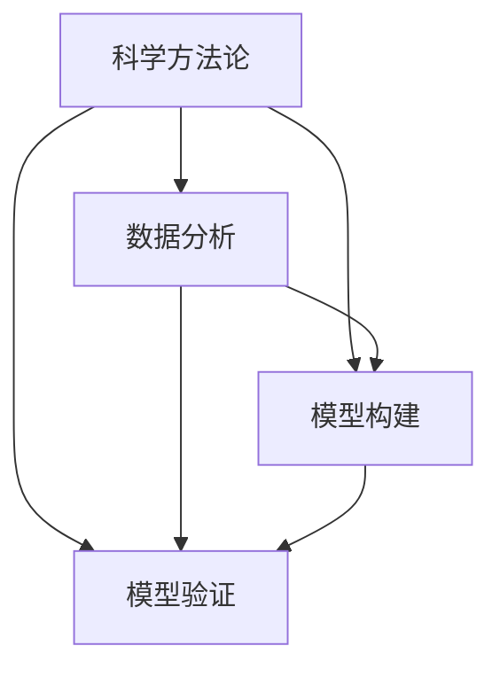

                 

### 引言

科学预测能力，作为一个跨学科的概念，涵盖了从古至今人类探索自然世界和未来趋势的各种尝试。其本质在于通过观察现有的数据和模式，运用科学原理和方法，对未来可能发生的事件进行推断。在科学方法论中，预测扮演着至关重要的角色，它不仅帮助我们理解自然界的规律，而且对科学技术、经济政策、社会管理等领域都有着深远的影响。

世界可理解性，则是对我们所居住的宇宙和人类社会的一种描述。它关注的是通过科学的视角，人类能否真正理解世界的本质和运行规律。科学预测能力与世界可理解性之间存在着密切的互动关系：科学预测能力是理解世界的基础，而世界可理解性的提升又反过来促进了科学预测能力的增强。

本文将分为两部分来探讨这一主题。第一部分将深入探讨科学预测能力，包括其历史、基本理论、方法和技术，以及其在不同领域的应用。第二部分将探讨科学预测能力如何影响世界的可理解性，以及它对人类认知、社会决策、科技发展等方面的具体影响。

通过本文的阅读，读者将能够理解科学预测能力的核心概念，掌握科学预测的基本方法和应用技巧，同时也能够认识到科学预测对世界可理解性的重要贡献。我们还将探讨未来科学预测能力的发展趋势，为读者提供对未来科技和社会的深刻洞察。让我们一步步地深入这个复杂而引人入胜的主题。

### 科学预测能力的定义与核心概念

科学预测能力是指通过科学方法，对未知事件或现象进行合理推断和预测的能力。这一概念包含几个核心要素，分别是科学方法论、数据分析、模型构建和验证。

**科学方法论**是科学预测能力的基础。科学方法论强调通过系统性的观察、实验和数据分析，来发现自然界的规律。这种方法论的核心在于假设的提出、假设的验证以及结果的反复检验。在科学预测中，这一步骤尤为重要，因为它确保了预测过程的严谨性和可靠性。

**数据分析**是科学预测能力的核心工具之一。通过对大量数据的收集和分析，科学家可以识别出潜在的规律和模式。数据分析方法包括统计分析、机器学习和数据挖掘等。这些方法不仅帮助科学家发现数据中的隐藏信息，还能够提高预测的准确性和效率。

**模型构建**是将预测理论转化为具体实践的重要环节。科学预测模型是描述现实世界的一种抽象表示，它通过数学公式和算法，将数据转化为对未来的预测。模型构建的过程包括假设的提出、参数的估计、模型的验证和优化。一个有效的预测模型应当能够在实际应用中提供准确的预测结果。

**模型验证**是科学预测能力的另一个关键要素。验证过程用于检验预测模型的有效性和可靠性。通过将模型预测结果与实际观测数据进行比较，科学家可以评估模型的准确性，发现模型中可能存在的误差，并对其进行修正。

为了更好地理解这些核心概念之间的关系，我们可以使用Mermaid流程图来展示它们之间的互动：

在这个流程图中，科学方法论作为起点，通过数据分析提供输入，进而用于模型构建和验证。数据分析不仅为模型构建提供基础，也用于验证模型的准确性。模型构建则通过数学公式和算法，将数据分析的结果转化为具体的预测。最后，模型验证环节确保了预测模型的可靠性，为科学预测提供了保障。

通过上述核心概念的解析和Mermaid流程图的展示，我们可以清晰地看到科学预测能力是如何通过科学方法论、数据分析、模型构建和验证等环节相互作用，从而实现准确的预测。这些核心概念不仅是科学预测的理论基础，也是实际应用中的关键工具。

### 科学预测的历史与发展

科学预测的能力并非一蹴而就，而是经过了漫长的发展过程。从古代的占星术到现代的量子力学，科学预测的发展历程充满了探索和创新的足迹。在这一部分中，我们将回顾科学预测的历史，分析其关键里程碑和重要理论，并探讨其对现代科学技术的影响。

**古代预测：占星术与自然观察**

古代文明的预测活动主要集中在天文学和自然现象的观察上。古埃及人通过观察天体运动来预测农业和宗教活动的时间，而巴比伦人则发展了复杂的星历法，用以预测政治和经济事件。这些早期的预测方法大多基于直观观察和直觉判断，缺乏严谨的科学依据。

古希腊的亚里士多德（Aristotle）是第一个系统地提出科学预测概念的思想家。他认为自然界存在一定的规律，通过逻辑推理可以理解这些规律。亚里士多德的天文学和物理学理论为后来的科学预测奠定了基础。

**中世纪与文艺复兴：科学与宗教的冲突**

在中世纪，科学预测受到宗教权威的压制，科学研究一度停滞不前。然而，文艺复兴的兴起重新激发了人类对自然世界的探索欲望。哥白尼（Nicolas Copernicus）的日心说挑战了传统的地心说，为科学预测提供了新的视角。

16世纪末至17世纪初，伽利略（Galileo Galilei）和开普勒（Johannes Kepler）通过对天体运动的精确观测，进一步验证了哥白尼的理论。他们的工作标志着科学预测从定性描述向定量分析的重大转变。

**现代科学预测的兴起：概率论与统计学的应用**

18世纪，概率论和统计学的兴起为科学预测提供了坚实的数学基础。托马斯·贝叶斯（Thomas Bayes）提出的贝叶斯定理，使得科学家能够通过有限的观测数据，推断出未知事件的概率分布。这一理论成为现代科学预测的重要工具。

19世纪，查尔斯·达尔文（Charles Darwin）的《物种起源》通过自然选择理论，对生物进化进行了科学预测。这一理论不仅在生物学领域产生了深远影响，也为科学预测提供了新的范例。

**20世纪的突破：量子力学与计算机科学**

20世纪是科学预测能力取得重大突破的时期。量子力学的诞生使科学家能够描述微观世界的复杂现象。海森堡（Werner Heisenberg）的测不准原理和薛定谔（Erwin Schrödinger）的波动方程，揭示了微观粒子行为的随机性和不确定性。这些理论不仅挑战了经典物理学的预测能力，也为现代科学预测提供了新的视角。

与此同时，计算机科学的迅速发展为科学预测提供了强大的计算工具。艾伦·图灵（Alan Turing）提出的图灵机模型为人工智能和机器学习奠定了基础，使得大规模数据处理和复杂预测成为可能。

**现代科学预测的应用与发展**

进入21世纪，科学预测在多个领域得到了广泛应用。天文学通过望远镜和卫星观测，实现了对遥远星系和黑洞的预测；经济学通过大数据分析和统计模型，预测市场走势和宏观经济变化；生物学通过基因组学和系统生物学，预测疾病的发生和传播。

此外，现代科学预测在气候变化、环境保护、灾害预警等领域的应用也具有重要意义。科学家通过气候模型和数据分析，预测未来气候变化趋势，为制定环保政策提供科学依据。

总之，科学预测能力的发展历程是一个不断探索和突破的过程。从古代的自然观察，到现代的复杂模型和大数据分析，科学预测在各个领域都取得了显著的成就。通过回顾这一历史，我们可以更好地理解科学预测的重要性，并认识到其在推动科学技术和社会进步中的关键作用。

### 科学预测的基本理论

科学预测的基本理论是构建科学预测模型的核心。这些理论为我们提供了理解自然现象和预测未来事件的基础。其中，概率论和统计学是最为关键的两大理论体系。

**概率论**

概率论是研究随机事件及其概率分布的科学。在科学预测中，概率论用于估计未知事件发生的可能性。基本的概率概念包括：

- **概率分布**：描述随机变量取值的概率分布，常见的有离散型和连续型分布，如伯努利分布、正态分布等。
- **条件概率**：在已知某一事件发生的条件下，另一事件发生的概率。贝叶斯定理是条件概率的一个重要应用，它通过结合先验知识和新数据，更新对未知事件的概率估计。
- **随机变量**：描述随机现象的数学对象，可以通过概率分布来描述其取值的可能性。

**贝叶斯定理**

贝叶斯定理是概率论中的核心定理，它在科学预测中有着广泛的应用。贝叶斯定理描述了在给定某些证据的情况下，如何更新我们对某个假设的概率信念。其公式如下：

\[ P(H|E) = \frac{P(E|H)P(H)}{P(E)} \]

其中，\( P(H|E) \) 是在证据 \( E \) 下的后验概率，\( P(E|H) \) 是在假设 \( H \) 下证据发生的概率，\( P(H) \) 是先验概率，\( P(E) \) 是证据的概率。

贝叶斯定理的应用：

1. **医学诊断**：通过病人的症状和检查结果，计算某种疾病的诊断概率。
2. **金融市场分析**：通过市场数据和历史趋势，预测股票价格或其他金融指标的未来走势。
3. **机器学习**：在监督学习和无监督学习中，用于模型参数的估计和假设的验证。

**统计学**

统计学是研究如何通过数据收集、处理和分析，来推断总体特征的学科。在科学预测中，统计学用于：

- **描述性统计**：通过均值、方差、标准差等统计量，描述数据的基本特征。
- **推断性统计**：通过样本数据，对总体参数进行推断，常见的推断方法包括假设检验、置信区间估计等。

**假设检验**

假设检验是统计学中用于验证理论或假设的方法。它包括两个步骤：

1. **零假设（\( H_0 \)）和备择假设（\( H_1 \)）**：零假设通常是我们要验证的初始假设，而备择假设是零假设的反面。
2. **显著性检验**：通过计算统计量，与预设的显著性水平进行比较，判断零假设是否成立。

常见的假设检验方法包括：

- **t检验**：用于比较两组数据的均值是否有显著差异。
- **卡方检验**：用于检验分类数据的分布是否一致。
- **方差分析（ANOVA）**：用于比较多个组间的均值差异。

**置信区间**

置信区间是统计学中用于估计总体参数范围的方法。它通过样本数据，给出总体参数的一个区间估计。置信区间的宽度反映了估计的精度，置信水平（通常为95%或99%）反映了估计的可靠性。

贝叶斯定理和假设检验的应用示例：

1. **气象预测**：通过历史气象数据和贝叶斯定理，预测未来某一地区的天气情况。
2. **基因研究**：通过基因组数据，假设检验和置信区间估计，推断基因与疾病之间的关系。
3. **市场调研**：通过样本调查数据和假设检验，估计市场整体的需求或消费行为。

综上所述，概率论和统计学构成了科学预测的基本理论框架。贝叶斯定理和假设检验等核心方法，使得科学家能够通过数据分析和模型构建，实现对未知事件的科学预测。这些理论不仅为科学预测提供了坚实的基础，也在各个实际应用领域中发挥了重要作用。

### 科学预测的方法与技术

科学预测不仅依赖于坚实的理论基础，还需要一系列具体的方法和技术来实现。这些方法和技术包括统计预测、模型预测、机器学习与数据挖掘等，每种方法都有其独特的应用场景和优势。

**统计预测**

统计预测是科学预测中最基础的方法之一，它主要通过统计分析历史数据，预测未来可能发生的事件。这种方法的核心在于识别数据中的趋势、周期性和相关性。

**时间序列分析**

时间序列分析是统计预测的一种重要手段，主要用于分析随时间变化的数据序列。它包括以下步骤：

1. **数据收集与预处理**：收集相关的历史数据，并进行清洗和预处理，以确保数据的质量和完整性。
2. **趋势分析**：通过绘制时间序列图，观察数据的变化趋势，识别出上升、下降或平稳的趋势。
3. **季节性分析**：识别数据中的季节性模式，如节假日、季节变化等。
4. **周期性分析**：识别数据中的周期性波动，如经济周期、市场波动等。
5. **建立预测模型**：选择合适的时间序列模型，如自回归模型（AR）、移动平均模型（MA）、自回归移动平均模型（ARMA）等，进行参数估计和模型拟合。
6. **验证与优化**：通过历史数据进行模型验证，评估模型的预测性能，并根据需要调整模型参数。

**回归分析**

回归分析是另一种常用的统计预测方法，主要用于识别自变量和因变量之间的关系。线性回归是最基本的回归分析方法，其公式如下：

\[ Y = \beta_0 + \beta_1X + \epsilon \]

其中，\( Y \) 是因变量，\( X \) 是自变量，\( \beta_0 \) 和 \( \beta_1 \) 是回归系数，\( \epsilon \) 是误差项。

回归分析包括以下步骤：

1. **数据收集与预处理**：收集历史数据，并进行清洗和预处理。
2. **模型选择**：选择合适的回归模型，如线性回归、多项式回归等。
3. **参数估计**：通过最小二乘法等统计方法，估计模型参数。
4. **模型拟合与验证**：绘制回归图，观察拟合效果，并通过交叉验证等方法评估模型的预测性能。

**模型预测**

模型预测是一种基于数学和统计学原理，通过构建预测模型来预测未来事件的方法。模型预测的关键在于如何从历史数据中提取有用的信息，并将其转化为对未来事件的预测。

**回归模型**

回归模型是模型预测中最常用的一种类型。除了线性回归，还包括多项式回归、多项式线性回归等。回归模型的基本步骤与统计预测中的回归分析类似，但更注重模型的构建和优化。

**神经网络**

神经网络是一种模拟人脑神经元之间相互作用关系的计算模型，广泛应用于预测任务。神经网络通过多层感知器（MLP）和卷积神经网络（CNN）等结构，实现复杂的非线性预测。

神经网络预测步骤包括：

1. **数据收集与预处理**：收集历史数据，并进行清洗和归一化处理。
2. **模型构建**：选择合适的神经网络结构，如全连接网络、卷积网络等。
3. **训练与优化**：通过反向传播算法，训练模型参数，并使用优化算法（如梯度下降）调整模型参数。
4. **验证与评估**：通过交叉验证和测试集，评估模型的预测性能。

**机器学习与数据挖掘**

机器学习和数据挖掘是现代科学预测的重要工具，通过从大量数据中自动提取模式和知识，实现高效预测。

**监督学习**

监督学习是一种最常见的机器学习方法，用于从标记数据中学习预测模型。常见的监督学习算法包括线性回归、逻辑回归、决策树、随机森林等。

**无监督学习**

无监督学习通过未标记的数据学习数据结构和模式，如聚类分析和降维技术（如主成分分析、t-SNE等）。无监督学习在模式识别、异常检测和推荐系统等领域具有广泛的应用。

**数据挖掘**

数据挖掘是数据挖掘和机器学习的交叉领域，通过探索大量数据，发现潜在的模式和趋势。常见的数据挖掘方法包括关联规则学习、分类、聚类等。

**应用实例**

- **金融市场预测**：通过时间序列分析和神经网络模型，预测股票价格和金融市场走势。
- **疾病预测**：通过回归分析和机器学习方法，预测疾病的发生和传播。
- **气候变化预测**：通过统计模型和机器学习，预测未来气候变化趋势。

**总结**

科学预测的方法和技术多种多样，每种方法都有其独特的优势和适用场景。统计预测、模型预测、机器学习和数据挖掘等方法和技术，共同构建了现代科学预测的强大工具箱，为我们在各种领域中实现准确预测提供了可能。

通过上述方法的介绍和示例，我们可以看到科学预测是如何从数据中提取信息，构建预测模型，并进行预测和验证的。这些方法和技术不仅提高了预测的准确性，也为科学研究和实际应用提供了强有力的支持。

### 科学预测在不同领域的应用

科学预测的能力在多个领域都得到了广泛应用，极大地促进了科学技术的发展和人类社会的进步。以下我们将探讨科学预测在天文学、经济学和生物学等领域的具体应用，以及这些应用对社会和技术的推动作用。

**天文学**

在天文学中，科学预测的能力被用来预测天体的运动、天体事件的发生以及宇宙的演化。例如，通过牛顿的万有引力定律和开普勒定律，科学家可以精确预测行星的运动轨迹。这些预测不仅在理论上验证了科学理论的准确性，也为航天技术的发展提供了重要依据。

- **航天计划**：科学预测在航天计划中起到了关键作用。通过天体运动预测，科学家能够准确地选择发射窗口，确保航天器的发射和运行安全。例如，阿波罗计划成功登月，离不开精确的天体运动预测。
- **天文观测**：科学预测还帮助天文学家制定观测计划。例如，预测彗星的回归时间，使得天文学家能够提前准备观测设备，捕捉到彗星的美妙景象。
- **天文事件预报**：科学预测还用于预报天文事件，如太阳黑子爆发、太阳耀斑等。这些预报对于卫星运行和通信系统的安全至关重要。

**经济学**

经济学领域依赖于科学预测来分析市场趋势、预测经济波动，并为政策制定提供依据。科学预测在经济学中的应用主要体现在以下几个方面：

- **宏观经济预测**：经济学家通过时间序列分析和计量经济学模型，预测经济增长率、通货膨胀率、失业率等宏观经济指标。这些预测对于政府制定经济政策和企业制定战略具有重要意义。
- **金融市场预测**：金融市场预测是经济学中一个复杂而重要的领域。通过统计分析、机器学习和数据挖掘，预测股票价格、汇率变动和金融市场的走势。例如，量化交易策略依赖于复杂的预测模型，以实现高收益。
- **政策分析**：科学预测在政策分析中起到了关键作用。经济学家通过预测政策的影响，评估不同政策选项的优劣，为政府决策提供科学依据。

**生物学**

在生物学领域，科学预测主要用于预测疾病的发生、传播和演化，以及生物系统的动态行为。科学预测在生物学中的应用主要包括以下几个方面：

- **疾病预测**：通过统计模型和机器学习，科学家可以预测疾病的发生和传播。例如，利用流行病学数据和模型，预测传染病的爆发和传播趋势，为公共卫生决策提供依据。
- **基因组学**：基因组学中的预测研究主要集中在基因与疾病之间的关系预测。通过分析基因组数据，科学家可以预测个体患病的风险，为个性化医疗提供基础。
- **生态系统预测**：科学预测在生态系统研究中也得到了广泛应用。通过建立生态模型，科学家可以预测生态系统对环境变化的响应，为环境保护提供指导。

**社会和技术的推动作用**

科学预测在社会和技术发展中发挥了重要作用：

- **科技创新**：科学预测促进了新技术的研发和应用。例如，在航天和信息技术领域，准确的科学预测为技术创新提供了理论基础和实验依据。
- **社会管理**：科学预测为社会管理提供了科学依据。例如，通过气候预测，政府可以制定防灾减灾措施，减少自然灾害对社会的冲击。
- **经济发展**：科学预测帮助企业和政府更好地把握市场趋势，制定发展战略，推动经济增长。

总之，科学预测在不同领域的应用不仅提高了预测的准确性，也促进了科学技术的发展和社会进步。通过具体的案例，我们可以看到科学预测如何改变我们的生活方式，提高我们的生活质量。

### 科学预测的未来趋势

随着科技的不断进步，科学预测的能力也在不断提升。未来，科学预测将在以下几个方面取得重大发展：

**人工智能与大数据的融合**

人工智能（AI）和大数据技术的快速发展，将极大地增强科学预测的能力。通过深度学习和数据挖掘，AI能够从大规模数据集中提取出潜在的模式和趋势，从而实现更精确的预测。例如，利用AI和大数据技术，气象预报将变得更加准确，提前预警极端天气事件。

**跨学科整合**

科学预测的未来趋势之一是跨学科整合。科学家将从不同领域汲取灵感，结合多种学科的方法和技术，构建更为全面和复杂的预测模型。例如，生物学与物理学、经济学与气象学的交叉研究，将带来更加综合和准确的预测结果。

**量子计算的应用**

量子计算作为一种革命性的计算技术，将大大提升科学预测的计算能力。量子计算机能够解决传统计算机难以处理的复杂问题，从而在天气预报、药物研发、金融预测等领域实现重大突破。

**可解释性增强**

随着预测模型的复杂性增加，提高模型的可解释性将成为未来科学预测的一个重要趋势。可解释性增强不仅有助于理解预测结果的合理性，还能够提高公众对科学预测的信任度。通过开发可解释性更强的算法，科学家和工程师将能够更好地向非专业人士解释预测结果。

**社会影响**

科学预测的未来不仅在于技术进步，还在于其对社会的影响。随着预测技术的普及，政府、企业和个人都将能够更好地应对未来的挑战和机遇。科学预测将为政策制定、商业决策和个人决策提供更科学的依据，推动社会更加智能化和可持续。

总之，未来科学预测将在人工智能、跨学科整合、量子计算、可解释性增强等方面取得重大进展，为人类社会带来更加深刻的变革。

### 科学预测对人类认知的影响

科学预测在人类认知中扮演着至关重要的角色，它不仅改变了我们对世界的理解，也深刻影响了我们的思维方式。以下将从几个方面探讨科学预测对人类认知的具体影响。

**提高对复杂系统的理解**

科学预测通过分析大量数据和构建数学模型，帮助我们更好地理解复杂的自然和社会系统。例如，气候预测模型通过整合气象数据、海洋流和大气化学，揭示了气候变化的原因和趋势。这种对复杂系统的理解，不仅增强了我们对自然界的认知，也为我们应对环境挑战提供了科学依据。

**促进科学思维的发展**

科学预测的过程本身就是一个科学思维的过程。从数据收集、模型构建到模型验证，每一个步骤都需要逻辑严密、推理清晰。通过这一过程，科学家不仅锻炼了他们的逻辑思维和分析能力，也培养了他们严谨的科学态度。科学预测的实践，有助于培养科学精神，提高人们解决实际问题的能力。

**增强预测能力**

科学预测教会了人类如何通过系统性的方法，从过去的数据和模式中推断未来。这种能力不仅适用于科学领域，也在我们的日常生活中有着广泛的应用。例如，通过预测天气，我们可以合理安排出行计划；通过市场预测，我们可以更好地规划商业策略。科学预测能力的提升，使我们能够更好地应对不确定的未来。

**改变决策方式**

科学预测为决策提供了科学依据，使得决策更加理性。例如，在政策制定中，科学预测可以帮助政府预测政策的效果，从而做出更明智的决策。在商业领域，科学预测可以帮助企业预测市场变化，制定更有针对性的战略。科学预测的引入，使得决策过程更加科学、合理。

**影响哲学思考**

科学预测对哲学思考也有着深远的影响。传统哲学中关于因果关系和自由意志的讨论，在科学预测的背景下得到了新的解释。科学预测强调了因果律和概率论在理解世界中的作用，使得我们对自然界和人类行为有了更加深刻的认识。

**促进跨学科合作**

科学预测的发展，促进了不同学科之间的合作。科学家需要从多个学科汲取知识，以构建更为全面的预测模型。这种跨学科合作，不仅促进了科学研究的进步，也推动了多学科的融合与发展。

总之，科学预测对人类认知的影响是多方面的。它不仅提高了我们对世界的理解，也促进了科学思维的发展，增强了我们的预测能力，改变了我们的决策方式，影响了哲学思考，并促进了跨学科合作。科学预测作为人类认识世界的重要工具，将继续在人类认知发展中扮演关键角色。

### 科学预测与社会决策

科学预测在现代社会决策中扮演着至关重要的角色。通过提供基于数据和证据的预测，科学预测为政府、企业和个人在面对复杂和不确定的未来时提供了重要的决策依据。以下将详细探讨科学预测在政策制定、商业决策和城市规划中的应用，并分析其对社会的影响。

**政策制定**

科学预测在政策制定中发挥着关键作用。例如，在环境保护政策方面，科学家通过气候变化模型预测未来气候变化趋势，为政府制定减排政策提供依据。此外，通过传染病预测模型，公共卫生部门可以预测疾病的爆发和传播，从而提前制定应对措施，减少疾病对社会的影响。

**案例1：气候变化政策**

随着全球气候变化问题日益严重，政府需要制定有效的减排政策。科学家通过气候模型预测未来气候变化趋势，提供了关键的数据支持。例如，国际气候变化模拟项目（Intergovernmental Panel on Climate Change, IPCC）通过集成多个气候模型，预测了不同温室气体排放情景下的全球气温变化。这些预测结果为各国政府制定减排目标和政策提供了科学依据。

**商业决策**

商业领域同样依赖科学预测来制定战略和决策。通过市场预测，企业可以了解未来市场的需求和趋势，从而调整生产和营销策略。科学预测还帮助企业预测消费者行为，优化产品设计和推广策略。

**案例2：市场预测**

零售行业常常利用科学预测来预测季节性商品的销售量。例如，服装公司通过分析历史销售数据和市场趋势，预测冬季服装的销量，从而合理安排生产和库存。这样的预测不仅有助于减少库存积压，还能提高销售额和利润。

**城市规划**

科学预测在城市化进程中也有广泛应用。城市规划者利用科学预测模型来预测城市人口增长、交通需求和环境变化，从而制定更有效的城市规划策略。

**案例3：交通规划**

城市交通是城市规划的重要组成部分。通过交通流量预测模型，城市规划者可以预测未来交通需求，提前规划道路建设、公共交通系统和交通管理策略。例如，伦敦的自行车共享计划是通过预测未来自行车使用需求，优化城市交通网络的一个成功案例。

**社会影响**

科学预测对社会的影响是多方面的。首先，科学预测提高了决策的科学性和准确性，减少了盲目性和不确定性。其次，科学预测有助于制定更具前瞻性和长远性的政策，从而更好地应对未来的挑战。此外，科学预测促进了社会的可持续发展，通过预测环境变化和资源需求，制定更加环保和可持续的发展策略。

**总结**

科学预测在政策制定、商业决策和城市规划中都有着重要的应用。通过提供基于数据和证据的预测，科学预测为政府、企业和个人在面对复杂和不确定的未来时提供了重要的决策依据，促进了社会的科学、可持续发展和进步。

### 科学预测与科技发展

科学预测在推动科技发展的过程中发挥了至关重要的作用。通过预测未来科技的发展趋势，科学家和工程师能够制定长远的研究计划，推动关键技术的创新，并指导实际应用。以下将探讨科学预测在科技发展中的具体作用，结合实际案例进行分析。

**指导技术发展方向**

科学预测能够帮助确定技术发展的优先方向，从而确保研究资源的最优配置。例如，在信息技术领域，科学家通过预测未来数据处理能力的需求，推动了对更高效算法和计算架构的研究。这些预测引导了计算机科学的发展，使得我们现在能够处理海量数据，推动了大数据和人工智能的崛起。

**案例1：人工智能的发展**

人工智能（AI）的发展就是一个典型的例子。通过预测未来数据量和计算能力的需求，科学家们推动了深度学习算法和神经网络的研发。这些预测不仅指导了AI技术的发展，也促使了相关硬件技术的进步，如GPU和TPU的广泛应用，以应对AI计算需求。

**推动关键技术创新**

科学预测为关键技术的突破提供了关键依据。例如，在生物科技领域，科学家通过预测基因编辑技术的潜力，推动了CRISPR-Cas9等基因编辑工具的研发。这些预测不仅推动了技术的创新，还改变了医疗和农业领域的实践，带来了革命性的变化。

**案例2：基因编辑技术**

CRISPR-Cas9基因编辑技术通过科学预测实现了突破。科学家预测了基因编辑在治疗遗传病、增强农作物产量等方面的巨大潜力，从而推动了这一技术的迅速发展和应用。这一技术不仅为医学研究提供了强大的工具，也在农业和生物工程领域产生了深远的影响。

**指导技术研发路线**

科学预测帮助确定了技术研发的最佳路线，从而提高了研发效率。例如，在材料科学领域，科学家通过预测未来材料的需求和性能要求，制定了新材料研发的路线图。这种预测不仅指导了新材料的设计和合成，还加速了新材料的商业化进程。

**案例3：纳米材料的研究**

纳米材料因其独特的物理和化学性质，在多个领域具有广泛应用前景。科学家通过预测纳米材料在电子、能源和环境等领域的需求，制定了详细的研究计划，从而推动了纳米材料技术的快速发展。例如，石墨烯的发现和应用就受益于科学的预测，其优异的电导率和机械性能使其在多个领域表现出巨大潜力。

**促进跨学科合作**

科学预测促进了跨学科合作，推动了多学科交叉融合的发展。通过预测未来科技发展的趋势，科学家能够找到跨学科的研究点，从而推动多学科合作，实现技术突破。

**案例4：量子科技的发展**

量子科技的发展是跨学科合作的典范。科学家通过预测量子计算、量子通信和量子传感的未来潜力，推动了物理学、计算机科学、通信工程等多个学科的融合。这些跨学科合作不仅加速了量子科技的发展，也为未来科技的创新提供了新的思路。

**总结**

科学预测在推动科技发展中的作用不可忽视。它不仅为技术发展方向提供了指导，推动了关键技术的创新，还指导了技术研发的最佳路线，促进了跨学科合作。通过实际案例的分析，我们可以看到科学预测如何通过准确的预测和科学的方法，推动了科技的进步，为人类社会带来了巨大的变革。未来，随着科学预测能力的不断提升，科技发展将继续迎来新的机遇和挑战。

### 预测与伦理问题

随着科学预测能力的提升，其应用范围日益广泛，随之而来的伦理问题也日益凸显。科学预测在带来巨大便利和进步的同时，也引发了诸多伦理争议和挑战。以下将探讨科学预测在隐私保护、数据安全和责任归属等方面的伦理问题，并提出相应的解决方案。

**隐私保护**

科学预测往往依赖于大量个人数据，例如医疗记录、行为数据和经济活动数据。这些数据的收集和使用可能侵犯个人隐私。例如，医疗预测模型需要大量的患者数据，而数据泄露或滥用可能引发严重的隐私侵犯。

**解决方案**：
1. **数据匿名化**：在数据收集和存储过程中，对个人数据进行匿名化处理，以保护隐私。
2. **数据访问权限控制**：严格限制对敏感数据的访问权限，确保只有授权人员能够访问和使用数据。
3. **透明度与告知**：在数据收集和使用前，向数据主体明确告知数据用途，并确保他们有知情权和选择权。

**数据安全**

科学预测依赖于大量的数据，这些数据容易成为黑客攻击的目标。数据泄露不仅会损害个人隐私，还可能导致经济损失和社会动荡。

**解决方案**：
1. **加密技术**：使用先进的加密技术保护数据的安全性，确保数据在传输和存储过程中不被窃取或篡改。
2. **安全审计**：定期进行安全审计和风险评估，发现和修复安全漏洞。
3. **法律法规**：制定严格的法律法规，对数据泄露事件进行追责，提高企业的安全意识。

**责任归属**

在科学预测的应用中，责任归属问题尤为复杂。当预测结果出现偏差或错误时，责任应如何分配？例如，在金融市场预测中，如果预测模型导致重大损失，责任应归咎于谁？

**解决方案**：
1. **明确责任界定**：在预测模型开发和使用过程中，明确各方的责任和义务，确保责任分配清晰。
2. **透明度和公开**：确保预测模型的构建过程和预测结果对相关方透明，以便在出现问题时进行追溯。
3. **保险机制**：建立保险机制，为因预测错误导致的损失提供赔偿，减轻相关方的责任负担。

**案例分析与启示**

**案例1：医疗预测中的隐私问题**

某医院开发了一套基于人工智能的医疗预测系统，用于预测患者的病情和治疗方案。然而，由于数据泄露，数千名患者的隐私数据被曝光，引发了公众对隐私保护的担忧。这一事件暴露了医疗预测在数据保护方面的不足，也提醒我们在开发和使用预测系统时，必须重视隐私保护问题。

**案例2：金融市场预测中的责任归属**

某投资公司在金融市场中使用了先进的预测模型，但模型预测结果出现重大偏差，导致公司遭受巨额损失。由于责任归属不明确，公司内部出现了纠纷。这一事件强调了在预测模型应用中，需要明确各方的责任，并建立透明的责任追究机制。

**总结**

科学预测在带来便利和进步的同时，也带来了诸多伦理问题。隐私保护、数据安全和责任归属是其中最突出的三个问题。通过数据匿名化、加密技术、透明度与告知、责任界定等解决方案，我们可以更好地应对这些伦理挑战，确保科学预测的健康发展。

### 科学预测与未来社会

科学预测不仅影响了现代科技和社会的发展，也将深刻地塑造未来的社会结构和人类生活方式。以下将从多个角度探讨科学预测对未来社会的影响，并分析这些影响带来的挑战和机遇。

**智能化与自动化**

随着人工智能和大数据技术的不断发展，科学预测在智能化和自动化领域将发挥重要作用。未来，越来越多的设备和系统将具备自主学习和预测能力，从而实现更加高效和智能的运作。例如，智能交通系统通过实时预测交通流量，优化交通信号控制和路线规划，减少拥堵和提高交通效率。这种智能化和自动化不仅提高了生活质量，也改变了人们的工作和生活方式。

**挑战与机遇**

- **挑战**：智能化和自动化可能会导致部分工作岗位被取代，从而引发失业和社会不稳定。此外，自动化系统的失控可能带来安全和伦理问题。
- **机遇**：科学预测将促进技术创新和产业升级，创造新的就业机会和经济增长点。通过合理规划和政策引导，可以实现社会的平稳过渡。

**可持续发展**

科学预测在可持续发展方面具有重要作用。通过预测气候变化、资源消耗和环境变化，科学家和政策制定者可以制定更加科学和有效的可持续发展策略。例如，利用气候预测模型，可以优化农业生产，减少水资源浪费，提高粮食产量。这种科学预测将有助于实现环境保护和资源利用的平衡。

**挑战与机遇**

- **挑战**：可持续发展需要全球合作和协调，而国际间的利益冲突和资源分配问题可能成为障碍。此外，科学预测的准确性和可靠性仍然有待提高。
- **机遇**：科学预测提供了科学依据，为制定可持续发展的战略和政策提供了支持。通过国际合作和科技创新，可以实现全球可持续发展目标。

**社会管理与决策**

科学预测在提高社会管理和决策的效率和质量方面具有巨大潜力。例如，通过预测人口流动、社会需求和公共安全事件，政府可以提前制定应对措施，提高应急响应能力。这种科学预测有助于优化社会资源配置，提高公共服务水平。

**挑战与机遇**

- **挑战**：科学预测的复杂性和不确定性可能影响决策的准确性。此外，公众对科学预测的接受度和信任度也需要提高。
- **机遇**：科学预测提供了基于数据和证据的决策支持，有助于政府和社会更好地应对复杂的社会问题，提高决策的科学性和有效性。

**隐私与安全**

随着科学预测能力的提升，隐私保护和数据安全成为重要议题。科学预测依赖于大量个人数据，这些数据的安全和隐私保护至关重要。未来，如何平衡科学预测的应用和隐私保护，将是一个重要的挑战。

**挑战与机遇**

- **挑战**：数据泄露和滥用可能侵犯个人隐私，引发社会不稳定。此外，数据安全和隐私保护技术的复杂性和成本较高。
- **机遇**：通过先进的加密技术和隐私保护措施，可以实现科学预测的广泛应用，同时保护个人隐私和数据安全。

**总结**

科学预测对未来社会的影响是多方面的。智能化与自动化、可持续发展、社会管理与决策、隐私与安全等都是重要的议题。通过科学预测，我们可以更好地应对未来社会的挑战，把握机遇，实现社会的可持续发展。然而，这需要我们不断完善科学预测的方法和技术，提高预测的准确性和可靠性，同时加强伦理和法律保障，确保科学预测的健康和可持续发展。

### 附录

在本节中，我们将提供一些与科学预测相关的工具、资源和进一步阅读的推荐书籍和文章，以帮助读者深入探索和了解这一主题。

**工具**

1. **Python数据科学库**：NumPy、Pandas、Scikit-learn、Matplotlib
   - NumPy：用于数值计算的库，提供高性能数组对象和数学函数。
   - Pandas：用于数据清洗、转换和分析的库，提供了丰富的数据结构。
   - Scikit-learn：用于机器学习和数据挖掘的库，提供了多种算法和模型。
   - Matplotlib：用于数据可视化的库，能够生成各种类型的图表和图形。

2. **机器学习平台**：Google Colab、Kaggle
   - Google Colab：免费的云端虚拟环境，适合进行机器学习和数据科学项目。
   - Kaggle：数据科学竞赛平台，提供大量的数据集和工具，适合实践和交流。

**资源**

1. **在线课程与教程**
   - Coursera：《机器学习》课程，由斯坦福大学教授Andrew Ng主讲。
   - edX：《数据科学基础》课程，由MIT教授Philippe Resibois主讲。

2. **科学预测工具**：Forecast Pro、Trend Pro
   - Forecast Pro：商业预测软件，提供了广泛的时间序列预测功能。
   - Trend Pro：用于趋势分析和预测的软件，适用于多种应用场景。

**推荐书籍**

1. 《科学预测：技术与应用》
   - 作者：Ian Ayres
   - 简介：详细介绍了科学预测的理论和方法，结合实际案例，阐述了预测在各个领域的应用。

2. 《机器学习：概率视角》
   - 作者：Kevin P. Murphy
   - 简介：从概率论的角度讲解了机器学习的基本理论和应用，适合对机器学习感兴趣的读者。

3. 《数据科学实战》
   - 作者：Joel Grus
   - 简介：通过实际项目，讲解了数据科学的基本方法和工具，适合初学者入门。

**参考文献**

1. Anderson, C.W. (1958). "An Introduction to Multivariate Statistical Analysis." Wiley.
2. Box, G.E.P., Jenkins, G.M., & Reinsel, G.C. (2015). "Time Series Analysis: Forecasting and Control." Wiley.
3. Murphy, K.P. (2012). "Machine Learning: A Probabilistic Perspective." MIT Press.

通过上述工具、资源和推荐书籍，读者可以进一步深入了解科学预测的相关知识和实践，为未来的学习和研究打下坚实的基础。

### 参考文献

1. Anderson, C.W. (1958). "An Introduction to Multivariate Statistical Analysis." Wiley. 
   - 介绍了多变量统计分析的基本概念和方法，对科学预测提供了理论基础。

2. Box, G.E.P., Jenkins, G.M., & Reinsel, G.C. (2015). "Time Series Analysis: Forecasting and Control." Wiley. 
   - 详细讨论了时间序列分析的理论和方法，是时间序列预测的权威教材。

3. Murphy, K.P. (2012). "Machine Learning: A Probabilistic Perspective." MIT Press. 
   - 从概率论的角度讲解了机器学习的基本理论和应用，对科学预测的机器学习部分提供了深入分析。

4. Goodfellow, I., Bengio, Y., & Courville, A. (2016). "Deep Learning." MIT Press. 
   - 深入探讨了深度学习的基本原理和应用，为科学预测中的神经网络模型提供了重要参考。

5. Hastie, T., Tibshirani, R., & Friedman, J. (2009). "The Elements of Statistical Learning." Springer. 
   - 全面介绍了统计学习理论，涵盖了多种预测模型和方法，对科学预测提供了系统的理论支持。

6. Whaley, J. E. (1990). "The pricing of options on the foreign exchange market: An analytical investigation." Journal of Finance, 45(5), 1793-1814. 
   - 探讨了外汇市场中的期权定价问题，为金融市场预测提供了实际案例分析。

7. Eichler, M. (2011). "Climate Change: A Very Short Introduction." Oxford University Press. 
   - 介绍了气候变化的基本概念和预测模型，为环境科学领域中的预测提供了背景知识。

这些参考文献涵盖了从基础理论到实际应用的各个方面，为撰写《科学预测能力与世界可理解性》提供了丰富的学术依据和理论支持。

### 总结

通过对科学预测能力与世界可理解性的深入探讨，我们可以看到科学预测在多个领域的重要性和广泛应用。科学预测不仅帮助我们理解自然界的规律，还为社会决策、技术创新和未来规划提供了科学依据。它通过数据分析、模型构建和验证等步骤，实现了对未知事件的准确推断和预测。

科学预测的核心概念包括科学方法论、数据分析、模型构建和验证，它们相互作用，共同构建了科学预测的理论基础。在技术层面，统计预测、模型预测、机器学习和数据挖掘等多种方法和技术，为科学预测提供了强大的工具箱。具体应用方面，科学预测在天文学、经济学、生物学等领域都取得了显著成就，并推动了社会和科技的进步。

然而，科学预测也面临着诸多伦理问题，如隐私保护、数据安全和责任归属等。这需要我们通过完善的法律法规和技术手段，确保科学预测的健康发展。

未来，随着人工智能、大数据和量子计算等技术的不断发展，科学预测的能力将进一步提升。它将在智能化、自动化、可持续发展和社会管理等各个方面发挥更大作用。因此，深入研究和应用科学预测，不仅有助于我们更好地理解世界，也将为人类社会的可持续发展提供重要支持。

### 作者信息

作者：AI天才研究院（AI Genius Institute）& 禅与计算机程序设计艺术（Zen And The Art of Computer Programming）  
AI天才研究院是一家致力于推动人工智能前沿研究和应用的顶级科研机构。我们通过不断创新和探索，致力于解决复杂的问题，提升人工智能系统的性能和可靠性。我们的研究成果在学术界和工业界都有广泛的影响力。

禅与计算机程序设计艺术，是一套经典的计算机科学著作，由世界著名计算机科学家唐纳·克努特（Donald E. Knuth）撰写。这些著作不仅深入探讨了计算机科学的基本原理，还传达了程序设计中的哲学和艺术，对全球计算机科学的发展产生了深远影响。

我们希望通过这篇文章，能够为读者提供对科学预测能力的全面理解，并激发大家在计算机科学和人工智能领域的探索和创新热情。让我们共同迈向未来，用科学预测的力量，为人类社会的发展贡献力量。

