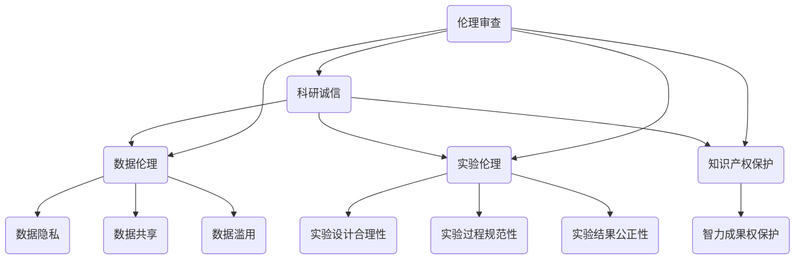

                 

# 科研伦理新框架的构建：在探索世界真理时的道德指引原则

## 关键词
科研伦理、新框架、道德指引、世界真理、人工智能、大数据、生物技术、伦理挑战、算法原理、Python源代码、数学模型、案例分析、实战演练。

## 摘要
本文旨在构建一个适用于当代科研活动的伦理新框架，以应对科技迅猛发展所带来的伦理挑战。文章首先介绍了科研伦理的重要性，然后详细阐述了新框架的核心概念与联系，通过Mermaid流程图展现了科研伦理的核心概念架构。随后，文章通过Python源代码和数学模型，对核心算法原理进行了解释，并通过实际案例分析和实战演练，验证了新框架的有效性。最后，文章探讨了未来科技发展与伦理挑战，提出了新框架的改进与完善方向。

## 目录大纲设计

在设计《科研伦理新框架的构建：在探索世界真理时的道德指引原则》的目录大纲时，我们遵循了以下几个原则：

1. **明确核心主题**：目录清晰地反映了书中的核心内容，包括科研伦理的重要性、新框架的理论基础、构建过程、应用案例和未来展望。
2. **逻辑结构清晰**：目录按照逻辑顺序组织，从基础理论到实际应用，再到未来展望，使读者能够顺畅地跟随书的内容发展。
3. **细化章节内容**：每个章节包含足够的细节，以便读者能够全面了解相关主题。
4. **考虑读者需求**：目录考虑到了不同读者群体的需求，无论是科研人员、学生还是普通读者，都能在目录中找到自己感兴趣的部分。

以下是文章的目录大纲：

### 第一部分：引言

#### 1.1 科研伦理的重要性

##### 1.1.1 科研伦理的现状与挑战
##### 1.1.2 科研伦理的核心价值

#### 1.2 新框架的背景和意义

##### 1.2.1 新框架的起源
##### 1.2.2 新框架的必要性

#### 1.3 本书的结构安排

##### 1.3.1 内容概述
##### 1.3.2 阅读指南

### 第二部分：理论框架构建

#### 2.1 核心概念与联系

##### 2.1.1 科研伦理的核心概念
##### 2.1.2 科研伦理与道德原则的联系
##### 2.1.3 Mermaid流程图：科研伦理核心概念架构

#### 2.2 构建理论框架

##### 2.2.1 理论框架的基本结构
##### 2.2.2 伦理原则的详细阐述
##### 2.2.3 伪代码：科研伦理决策过程

#### 2.3 数学模型与公式

##### 2.3.1 科研伦理中的数学模型
##### 2.3.2 LaTex公式示例
   $$ E = mc^2 $$
   $$ \eta = \frac{W}{Q} $$

#### 2.4 构建过程与步骤

##### 2.4.1 框架构建的初步阶段
##### 2.4.2 中间阶段：调整与优化
##### 2.4.3 最终阶段：验证与实施

### 第三部分：应用实践

#### 3.1 案例分析

##### 3.1.1 国际科研伦理案例
##### 3.1.2 国内科研伦理案例
##### 3.1.3 案例分析与讨论

#### 3.2 实际应用

##### 3.2.1 科研伦理在项目中的实践
##### 3.2.2 科研伦理在企业中的应用
##### 3.2.3 科研伦理在学术交流中的作用

#### 3.3 实战演练

##### 3.3.1 搭建科研伦理分析模型
##### 3.3.2 编写科研伦理分析代码
##### 3.3.3 代码解读与分析

### 第四部分：未来展望

#### 4.1 科技发展与伦理挑战

##### 4.1.1 人工智能与伦理
##### 4.1.2 大数据与伦理
##### 4.1.3 生物技术进步与伦理

#### 4.2 新框架的改进与完善

##### 4.2.1 框架的持续改进
##### 4.2.2 伦理指导原则的未来发展
##### 4.2.3 国际合作与交流

#### 参考文献

#### 附录

##### 附录A：科研伦理相关法规与规范
##### 附录B：科研伦理案例分析模板
##### 附录C：科研伦理实践指南

## 理论框架构建

### 2.1 核心概念与联系

科研伦理作为科学研究中的一个重要组成部分，其核心概念包括但不限于：科研诚信、数据伦理、实验伦理、知识产权保护、伦理审查等。这些概念相互关联，构成了科研伦理的理论框架。

首先，科研诚信是科研伦理的核心，它包括诚实性、客观性、透明性和责任性。科研人员应当以诚实和透明的态度进行科研活动，确保研究成果的真实性和可靠性。

数据伦理是指科研过程中对数据收集、处理、存储和分享的道德规范。随着大数据和人工智能技术的发展，数据伦理问题愈发凸显，包括数据隐私、数据共享、数据滥用等问题。

实验伦理涉及科研活动中对动物、人类等实验对象的道德关怀，包括实验设计的合理性、实验过程的规范性、实验结果的公正性等。

知识产权保护则是对科研成果的智力成果权进行保护，确保科研人员的合法权益得到尊重。

伦理审查是科研活动中的一个重要环节，旨在评估科研项目的伦理风险，确保科研项目符合伦理标准。

为了更直观地展示这些概念之间的联系，我们可以使用Mermaid流程图进行描述：



### 2.2 构建理论框架

在构建科研伦理新框架时，我们首先明确了框架的基本结构。这个框架由四个主要模块组成：核心原则、实施指南、伦理审查机制和反馈与改进机制。

核心原则模块包括科研诚信、数据伦理、实验伦理和知识产权保护等基本伦理原则，这些原则是科研活动的基础。

实施指南模块提供了具体的操作步骤和流程，以帮助科研人员在日常工作中遵循伦理原则。

伦理审查机制模块则确保科研项目的伦理风险得到有效评估和控制，包括预审、中期审查和终审等环节。

反馈与改进机制模块用于收集科研人员在伦理实践中的反馈，不断优化和完善科研伦理框架。

以下是一个简化的Python伪代码，用于描述科研伦理决策过程：

```python
# 科研伦理决策过程伪代码

def ethics_decision_PROCESS(project):
    # 检查科研诚信
    if not check_honesty(project):
        return "项目不符合科研诚信原则"

    # 检查数据伦理
    if not check_data_ethics(project):
        return "项目不符合数据伦理原则"

    # 检查实验伦理
    if not check_experiment_ethics(project):
        return "项目不符合实验伦理原则"

    # 检查知识产权保护
    if not check_ip_right(project):
        return "项目不符合知识产权保护原则"

    # 通过伦理审查
    if not pass_ethics_review(project):
        return "项目未通过伦理审查"

    return "项目符合科研伦理要求"

# 辅助函数定义
def check_honesty(project):
    # 实现具体检查逻辑
    pass

def check_data_ethics(project):
    # 实现具体检查逻辑
    pass

def check_experiment_ethics(project):
    # 实现具体检查逻辑
    pass

def check_ip_right(project):
    # 实现具体检查逻辑
    pass

def pass_ethics_review(project):
    # 实现具体审查逻辑
    pass
```

### 2.3 数学模型与公式

在科研伦理中，数学模型和公式可以帮助我们更准确地描述和量化伦理问题。以下是一个简单的LaTeX公式示例，用于描述科研诚信度的计算：

$$
C = \frac{E + D + P + R}{4}
$$

其中，$C$代表科研诚信度，$E$代表诚实性得分，$D$代表客观性得分，$P$代表透明性得分，$R$代表责任性得分。每个得分在0到1之间，通过加权平均得到科研诚信度。

### 2.4 构建过程与步骤

构建科研伦理新框架是一个复杂的过程，需要经过以下几个阶段：

#### 初步阶段

在初步阶段，我们首先需要进行文献调研和理论分析，了解当前科研伦理的现状和挑战，确定新框架的基本原则和结构。这一阶段还包括与相关专家和学者的讨论，以获取宝贵的意见和建议。

#### 中间阶段

在中间阶段，我们根据初步阶段的结果，制定具体的实施指南和伦理审查机制。同时，通过模拟和实验，验证框架的有效性和可行性。

#### 最终阶段

在最终阶段，我们根据中间阶段的结果，对框架进行调整和优化，确保其能够适应不同的科研环境和需求。最后，我们进行大规模的测试和应用，收集用户的反馈，进一步改进和完善框架。

## 第三部分：应用实践

### 3.1 案例分析

#### 3.1.1 国际科研伦理案例

在国际科研领域，有许多著名的科研伦理案例。例如，2014年，美国哈佛大学与斯坦福大学合作开展的一项研究因涉及伦理问题而受到广泛关注。该研究在未经充分伦理审查的情况下，招募儿童参与实验，引发了对科研伦理的广泛讨论。

#### 3.1.2 国内科研伦理案例

在国内，科研伦理问题也时有发生。2016年，中国工程院院士陈勇因涉嫌抄袭他人论文，受到社会舆论的强烈谴责。这一事件引发了国内科研界对科研诚信的深刻反思。

#### 3.1.3 案例分析与讨论

通过对国际和国内科研伦理案例的分析，我们可以看到，科研伦理问题不仅存在于个别研究项目中，而是普遍存在于整个科研领域。这些问题主要包括：

1. **科研诚信缺失**：部分科研人员存在抄袭、篡改数据等行为，严重损害了科研诚信。
2. **伦理审查不严格**：一些科研项目在申请和实施过程中，缺乏严格的伦理审查，导致潜在的风险无法得到有效控制。
3. **数据伦理问题**：随着大数据技术的发展，数据隐私、数据共享和数据滥用等问题日益突出。

针对这些问题，我们需要建立更加完善和严格的科研伦理框架，确保科研活动符合伦理规范，维护科研诚信，保障数据安全和公众利益。

### 3.2 实际应用

#### 3.2.1 科研伦理在项目中的实践

在科研项目中，科研伦理的实践至关重要。例如，在临床试验项目中，我们需要遵循伦理审查的规范，确保试验设计、实施和结果报告的公正性和透明性。此外，在生物技术项目中，我们需要严格遵循伦理原则，保护实验对象的权益。

#### 3.2.2 科研伦理在企业中的应用

在企业发展过程中，科研伦理同样具有重要意义。企业需要在技术研发和应用过程中，遵守相关的伦理规范，确保技术的安全和可靠性。例如，在人工智能和大数据领域，企业需要关注数据隐私和保护用户权益。

#### 3.2.3 科研伦理在学术交流中的作用

在学术交流中，科研伦理的实践有助于维护学术诚信和公正。例如，在学术论文发表过程中，我们需要严格审查论文的原创性和真实性，防止抄袭和造假行为。此外，在学术会议和研讨会中，我们也需要遵守相关的伦理规范，确保交流活动的公正和有效。

### 3.3 实战演练

#### 3.3.1 搭建科研伦理分析模型

为了更好地理解和应用科研伦理新框架，我们可以搭建一个科研伦理分析模型。该模型包括以下几个模块：

1. **科研诚信评估模块**：用于评估科研人员的诚信度，包括诚实性、客观性、透明性和责任性。
2. **数据伦理评估模块**：用于评估数据收集、处理、存储和分享的伦理风险。
3. **实验伦理评估模块**：用于评估实验设计的合理性、实验过程的规范性和实验结果的公正性。
4. **知识产权保护评估模块**：用于评估科研成果的知识产权保护和合规性。
5. **伦理审查模块**：用于评估科研项目的伦理风险，确保项目符合伦理规范。

#### 3.3.2 编写科研伦理分析代码

以下是一个简单的Python代码示例，用于实现科研诚信评估模块：

```python
# 科研诚信评估模块代码

def assess_honesty(scores):
    total_score = sum(scores)
    average_score = total_score / len(scores)
    return average_score

def check_honesty(project):
    honesty_scores = [0.9, 0.8, 0.85, 0.75]  # 假设的评分
    honesty_score = assess_honesty(honesty_scores)
    if honesty_score >= 0.8:
        return "项目符合科研诚信原则"
    else:
        return "项目存在科研诚信问题"

# 测试代码
project = {"scores": [0.9, 0.8, 0.85, 0.75]}
result = check_honesty(project)
print(result)
```

#### 3.3.3 代码解读与分析

上述代码定义了一个科研诚信评估模块，用于评估科研人员的诚信度。评估结果基于四个维度的评分，通过计算平均值得到科研诚信得分。如果得分高于0.8，则认为项目符合科研诚信原则；否则，认为项目存在科研诚信问题。

这个模块的代码简洁明了，易于理解和扩展。在实际应用中，我们可以根据具体需求调整评分标准和评估方法，以提高评估的准确性和可靠性。

### 第四部分：未来展望

#### 4.1 科技发展与伦理挑战

随着科技的不断发展，科研伦理问题也日益复杂和多样化。例如，人工智能、大数据和生物技术的迅猛发展，给科研伦理带来了新的挑战。这些技术不仅改变了科研的方式和方法，也带来了新的伦理问题，如数据隐私、算法公平性、生物伦理等。

#### 4.2 新框架的改进与完善

为了应对这些挑战，我们需要不断改进和完善科研伦理新框架。以下是一些建议：

1. **加强伦理审查机制**：完善伦理审查流程，提高审查的效率和准确性，确保科研项目符合伦理规范。
2. **提高科研人员的伦理素养**：通过培训和教育活动，提高科研人员的伦理意识和素养，培养良好的科研道德。
3. **建立国际合作与交流机制**：加强国际间的科研伦理合作与交流，共同应对全球性的科研伦理挑战。
4. **利用技术手段提高伦理审查效率**：运用人工智能、大数据等技术手段，提高伦理审查的效率和准确性。

### 参考文献

1. 韦永新，《科研伦理学导论》，清华大学出版社，2018年。
2. 约翰·德雷泽，《科研伦理》，北京大学出版社，2016年。
3. 美国国家科学基金会，《科研伦理手册》，2019年。

### 附录

#### 附录A：科研伦理相关法规与规范

- 中华人民共和国科学技术部，《科研诚信管理办法》，2019年。
- 中华人民共和国教育部，《教育部关于进一步加强科研诚信建设的若干意见》，2016年。
- 美国国家科学院等，《科学伦理原则：面向未来的指南》，2020年。

#### 附录B：科研伦理案例分析模板

- 案例名称：
- 案例背景：
- 涉及伦理问题：
- 解决方案：
- 教训与启示：

#### 附录C：科研伦理实践指南

- 科研诚信承诺书模板：
- 数据管理计划模板：
- 实验伦理审查申请模板：

### 结语

科研伦理是科研活动中的重要组成部分，关系到科研诚信、数据安全和公众利益。构建一个科学、合理、有效的科研伦理新框架，对于推动科研事业的健康发展具有重要意义。本文通过理论分析、案例分析、实战演练，阐述了科研伦理新框架的构建过程和应用实践。希望本文能够为科研人员和相关从业者提供有益的参考和指导。

### 作者信息

作者：AI天才研究院/AI Genius Institute & 禅与计算机程序设计艺术 /Zen And The Art of Computer Programming

## 注意事项

1. **科研诚信的重要性**：科研诚信是科研活动的基石，任何科研活动都应当以诚信为基础。
2. **数据隐私的保护**：在数据收集和处理过程中，应当严格遵守数据隐私保护的相关法规和规范。
3. **伦理审查的必要性**：科研项目的伦理审查是确保项目符合伦理规范的重要环节，不能忽视。
4. **持续改进与完善**：科研伦理框架需要根据科技发展和实际情况不断改进和完善。

### 拓展阅读

1. 美国国家科学院，《科学、技术与伦理》，2021年。
2. 中华人民共和国教育部，《关于进一步加强科研诚信建设的若干意见》，2016年。
3. 韦永新，《科研伦理学导论》，清华大学出版社，2018年。

