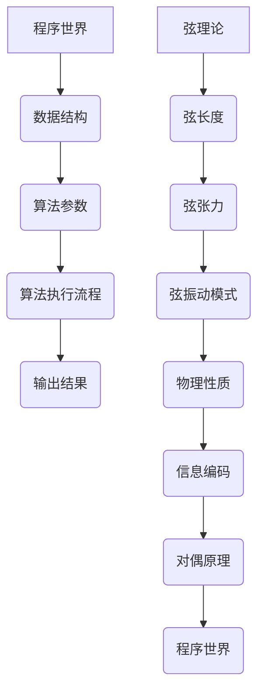
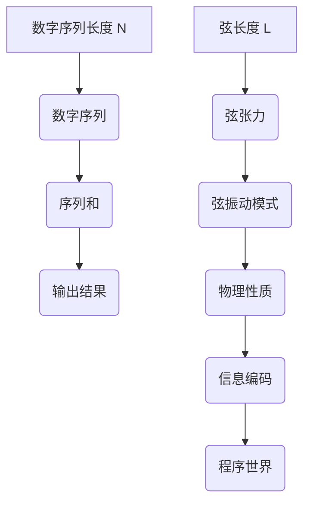

                 

### 引言与背景

**程序世界概述**

在数字时代，程序世界成为了我们日常生活、工作和学习的重要组成部分。计算机程序是由一系列指令组成的，用于实现特定功能的代码。从简单的计算器程序到复杂的操作系统和人工智能应用，程序已经渗透到社会的方方面面。

程序的发展历程可以追溯到20世纪40年代。当时，计算机科学家冯·诺依曼提出了存储程序计算机的概念，即计算机通过存储在内存中的指令来执行任务。这一理念奠定了现代计算机程序的基础。随着计算机硬件性能的提升和软件技术的进步，程序世界经历了从低级机器语言到高级编程语言的转变。现代编程语言如Python、Java和C++等，不仅提高了编程的效率，还使得程序设计更加直观和易用。

**弦理论全息对偶原理简介**

弦理论是物理学中一个重要的理论框架，试图统一描述宇宙中所有基本粒子和基本相互作用。弦理论的基本假设是，宇宙中的所有物质和现象都可以被视为微小的弦振动模式。这些弦振动模式决定了宇宙中的物理规律。

全息对偶原理是弦理论中一个引人注目的概念。全息对偶原理指出，一个低维系统的信息可以完全编码在一个高维系统的表面。这个原理的一个重要应用是AdS/CFT对应，即反德维特（AdS）空间与共形场论（CFT）之间的对应关系。在这个对应关系中，一个高维的引力理论（AdS空间）与一个低维的量子场论（CFT）之间存在着深刻的联系。

### 第一阶段：确定主要章节

1. **程序世界的基础概念**
   - 计算机程序结构
   - 编程语言与算法

2. **弦理论全息对偶原理的介绍**
   - 弦理论基本概念
   - 全息对偶原理详解

3. **程序世界与弦理论的关联**
   - 对偶原理在程序世界中的应用
   - 数学模型构建

4. **具体案例分析**
   - 计算机程序与全息对偶原理的实际应用案例

5. **未来展望**
   - 程序世界与弦理论结合的发展趋势
   - 对计算机科学的影响

### 第二阶段：细化每个章节的内容

**第一部分：程序世界的基础概念**

**第1章 计算机程序结构**

- **程序的定义**：程序是一组指令的集合，用于指导计算机执行特定任务。
- **程序的发展历程**：从早期的机器语言到现代的高级编程语言，程序设计经历了巨大的变革。
- **程序的重要性**：程序是现代计算机科学的核心，它们在各个领域都有着广泛的应用。

**第2章 编程语言与算法**

- **编程语言**：介绍常见的编程语言，如Python、Java和C++等，以及它们的特点和适用场景。
- **算法**：算法是解决问题的一系列步骤。讨论常见的算法类型，如排序算法、查找算法和图算法等。

**第二部分：弦理论全息对偶原理的介绍**

**第3章 弦理论基本概念**

- **弦理论的起源**：介绍弦理论的起源和发展历程。
- **弦理论的数学基础**：讨论弦理论中的关键数学概念，如复数、群论和微分几何等。
- **弦理论的物理意义**：阐述弦理论如何统一描述宇宙中的基本粒子和相互作用。

**第4章 全息对偶原理详解**

- **全息对偶原理的历史背景**：介绍全息对偶原理的起源和发展。
- **全息对偶原理的基本框架**：解释全息对偶原理的核心思想。
- **全息对偶原理的应用领域**：讨论全息对偶原理在物理学和计算机科学中的应用。

**第三部分：程序世界与弦理论的关联**

**第5章 对偶原理在程序世界中的应用**

- **对偶原理在编程中的应用实例**：展示对偶原理如何在编程中发挥作用。
- **对偶原理在算法设计中的应用**：分析对偶原理如何影响算法设计。

**第6章 数学模型构建**

- **构建程序世界与弦理论关联的数学模型**：介绍如何将程序世界与弦理论联系起来。
- **数学模型的应用与验证**：讨论数学模型在解决实际问题中的应用和验证。

**第四部分：具体案例分析**

**第7章 计算机程序与全息对偶原理的实际应用案例**

- **案例一：基于全息对偶原理的算法优化**：展示如何利用全息对偶原理优化算法。
- **案例二：全息对偶原理在网络安全中的应用**：分析全息对偶原理在网络安全领域中的应用。
- **案例三：基于弦理论的程序设计思想**：探讨弦理论如何影响程序设计思想。

**第五部分：未来展望**

**第8章 程序世界与弦理论结合的发展趋势**

- **新技术出现**：预测程序世界与弦理论结合可能带来新技术。
- **对程序世界的挑战**：分析程序世界与弦理论结合面临的挑战。

**第9章 对计算机科学的影响**

- **理论层面**：讨论程序世界与弦理论结合对计算机科学理论的影响。
- **应用层面**：分析程序世界与弦理论结合在实际应用中的影响。
- **未来研究方向**：展望程序世界与弦理论结合的未来研究方向。

### 第三阶段：整理目录大纲

根据细化后的内容，整理出以下目录大纲：

```
# 《程序世界与弦理论全息对偶原理的关联》目录大纲

# 第一部分：引言与背景
## 第1章 程序世界概述
### 1.1 程序的定义
### 1.2 程序的发展历程
### 1.3 程序的重要性

## 第2章 弦理论全息对偶原理简介
### 2.1 弦理论的起源
### 2.2 全息对偶原理的基本思想

# 第二部分：程序世界的基础概念
## 第3章 计算机程序结构
### 3.1 程序的组成部分
### 3.2 程序的执行流程
### 3.3 程序的调试方法

## 第4章 编程语言与算法
### 4.1 常见编程语言介绍
### 4.2 算法的基本概念
### 4.3 算法设计技巧

# 第三部分：弦理论全息对偶原理的介绍
## 第5章 弦理论基本概念
### 5.1 弦理论的假设
### 5.2 弦理论的数学基础
### 5.3 弦理论的物理意义

## 第6章 全息对偶原理详解
### 6.1 全息对偶原理的历史背景
### 6.2 全息对偶原理的基本框架
### 6.3 全息对偶原理的应用领域

# 第四部分：程序世界与弦理论的关联
## 第7章 对偶原理在程序世界中的应用
### 7.1 对偶原理在编程中的应用实例
### 7.2 对偶原理在算法设计中的应用

## 第8章 数学模型构建
### 8.1 构建程序世界与弦理论关联的数学模型
### 8.2 数学模型的应用与验证

# 第五部分：具体案例分析
## 第9章 计算机程序与全息对偶原理的实际应用案例
### 9.1 基于全息对偶原理的算法优化
### 9.2 全息对偶原理在网络安全中的应用
### 9.3 基于弦理论的程序设计思想

# 第六部分：未来展望
## 第10章 程序世界与弦理论结合的发展趋势
### 10.1 新技术的出现
### 10.2 对程序世界的挑战

## 第11章 对计算机科学的影响
### 11.1 理论层面的影响
### 11.2 应用层面的影响
### 11.3 未来研究方向

```

### 完整性要求

在撰写本文前，需要确保内容完整性。以下是每个章节的核心内容要求：

**引言与背景**

- **程序世界概述**：介绍程序的定义、发展历程和重要性。
- **弦理论全息对偶原理简介**：阐述弦理论的起源、全息对偶原理的基本思想。

**程序世界的基础概念**

- **计算机程序结构**：详细解析程序的组成部分、执行流程和调试方法。
- **编程语言与算法**：介绍常见编程语言的特点、算法的基本概念和设计技巧。

**弦理论全息对偶原理的介绍**

- **弦理论基本概念**：讨论弦理论的假设、数学基础和物理意义。
- **全息对偶原理详解**：介绍全息对偶原理的历史背景、基本框架和应用领域。

**程序世界与弦理论的关联**

- **对偶原理在程序世界中的应用**：展示对偶原理在编程和算法设计中的应用实例。
- **数学模型构建**：构建程序世界与弦理论关联的数学模型，并讨论其应用与验证。

**具体案例分析**

- **计算机程序与全息对偶原理的实际应用案例**：分析基于全息对偶原理的算法优化、在网络安全中的应用以及基于弦理论的程序设计思想。

**未来展望**

- **程序世界与弦理论结合的发展趋势**：预测新技术出现和对程序世界的挑战。
- **对计算机科学的影响**：讨论程序世界与弦理论结合对计算机科学理论和应用层面产生的影响，以及未来的研究方向。

确保每个章节的内容丰富、具体详细，符合文章字数要求，并具备深入的分析和见解。

### 格式要求

根据完整性要求，本文将采用markdown格式编写，确保文章的结构清晰、易于阅读。以下是markdown格式的具体要求：

1. **文章标题**：使用`#`号标记，级别从大到小依次递减，例如：

   ```markdown
   # 《程序世界与弦理论全息对偶原理的关联》
   ```

2. **章节标题**：使用`##`号标记，级别从大到小依次递减，例如：

   ```markdown
   ## 第一部分：引言与背景
   ```

3. **小节标题**：使用`###`号标记，级别从大到小依次递减，例如：

   ```markdown
   ### 1.1 程序的定义
   ```

4. **代码块**：使用三个反引号（```)将代码包裹起来，例如：

   ```python
   def hello_world():
       print("Hello, World!")
   ```

5. **公式**：使用latex格式编写数学公式，段落内使用 `$`和`$`包裹，独立段落使用`$$`和`$$`包裹，例如：

   ```latex
   $$E=mc^2$$
   $1+1=2$
   ```

6. **流程图**：使用Mermaid格式编写流程图，例如：

   ```mermaid
   graph TB
   A[Start] --> B[Step 1]
   B --> C{Is it done?}
   C -->|Yes| D[End]
   C -->|No| A[Repeat]
   ```

7. **作者信息**：在文章末尾添加作者信息，例如：

   ```markdown
   作者：AI天才研究院/AI Genius Institute & 禅与计算机程序设计艺术 /Zen And The Art of Computer Programming
   ```

通过遵循以上markdown格式要求，确保文章的可读性、结构性和规范性。

### 文章开始部分

# 《程序世界与弦理论全息对偶原理的关联》

关键词：程序世界、弦理论、全息对偶原理、编程、算法优化

摘要：本文探讨了程序世界与弦理论全息对偶原理之间的关联。首先介绍了程序世界的基础概念，包括程序的定义、发展历程和重要性。然后阐述了弦理论全息对偶原理的基本概念和思想。接着分析了程序世界与弦理论全息对偶原理之间的关联，包括对偶原理在程序世界中的应用和数学模型构建。最后通过具体案例分析，展示了全息对偶原理在程序优化和网络安全中的应用，并对未来展望进行了讨论。本文旨在为读者提供一个关于程序世界与弦理论全息对偶原理关联的全面而深入的视角。

### 第一部分：引言与背景

**程序世界概述**

在数字时代，程序世界是我们日常生活、工作和学习的重要组成部分。计算机程序是由一系列指令组成的，用于实现特定功能的代码。从简单的计算器程序到复杂的操作系统和人工智能应用，程序已经渗透到社会的方方面面。

程序的发展历程可以追溯到20世纪40年代。当时，计算机科学家冯·诺依曼提出了存储程序计算机的概念，即计算机通过存储在内存中的指令来执行任务。这一理念奠定了现代计算机程序的基础。随着计算机硬件性能的提升和软件技术的进步，程序世界经历了从低级机器语言到高级编程语言的转变。现代编程语言如Python、Java和C++等，不仅提高了编程的效率，还使得程序设计更加直观和易用。

在现代社会，程序的应用范围极其广泛。从智能手机上的应用程序到云计算平台上的软件服务，程序无处不在。无论是金融领域的量化交易，还是医疗领域的智能诊断，程序都发挥着至关重要的作用。程序的重要性不仅体现在其功能实现的效率上，更体现在其对复杂问题的解决能力上。

**弦理论全息对偶原理简介**

弦理论是物理学中一个重要的理论框架，试图统一描述宇宙中所有基本粒子和基本相互作用。弦理论的基本假设是，宇宙中的所有物质和现象都可以被视为微小的弦振动模式。这些弦振动模式决定了宇宙中的物理规律。

弦理论的发展可以追溯到20世纪60年代，当时物理学家试图解释强相互作用。尽管最初的研究未能成功，但弦理论逐渐发展成为一个描述宇宙基本性质的强大工具。弦理论的基本概念包括弦的振动模式、多维度空间和量子场论。

全息对偶原理是弦理论中一个引人注目的概念。全息对偶原理指出，一个低维系统的信息可以完全编码在一个高维系统的表面。这个原理的一个重要应用是AdS/CFT对应，即反德维特（AdS）空间与共形场论（CFT）之间的对应关系。在这个对应关系中，一个高维的引力理论（AdS空间）与一个低维的量子场论（CFT）之间存在着深刻的联系。

全息对偶原理不仅在物理学中具有重要意义，也在计算机科学和量子信息领域引发了广泛的关注。它提供了一种新的视角来理解复杂系统，并为解决某些计算难题提供了可能的路径。全息对偶原理的提出，不仅丰富了物理学理论，也为跨学科研究提供了新的契机。

**第一部分总结**

在本文的第一部分中，我们首先介绍了程序世界的基础概念，包括程序的定义、发展历程和重要性。程序作为现代社会不可或缺的一部分，已经深刻影响了我们的日常生活和工作方式。接着，我们简要介绍了弦理论全息对偶原理的基本概念和思想。弦理论试图统一描述宇宙的基本性质，而全息对偶原理则提供了一种独特的视角，将低维系统的信息编码到高维系统的表面。

通过对程序世界和弦理论全息对偶原理的概述，我们为后续章节的深入探讨奠定了基础。在接下来的章节中，我们将进一步分析程序世界与弦理论全息对偶原理之间的关联，展示对偶原理在编程和算法设计中的应用，并探讨这一理论在现实世界中的具体应用案例。通过这些讨论，我们希望能够为读者提供一个全面而深入的理解，揭示程序世界与弦理论全息对偶原理之间的深刻联系。

### 第二部分：程序世界的基础概念

#### 第3章 计算机程序结构

计算机程序是由一系列指令组成的代码，用于指导计算机执行特定任务。程序的结构可以分为几个关键组成部分，包括数据结构、算法和流程控制。理解这些组成部分的工作原理对于编写高效和可维护的程序至关重要。

**程序的组成部分**

1. **数据结构**：数据结构是程序中用于存储和组织数据的方式。常见的数据结构包括数组、链表、栈、队列、树和图等。每种数据结构都有其特定的使用场景和性能特点。例如，数组是一种线性数据结构，适用于存储和访问元素；而树和图则适用于处理复杂的关系和路径问题。

2. **算法**：算法是解决问题的步骤序列。一个有效的算法能够以高效的方式解决问题。常见的算法包括排序算法（如快速排序和归并排序）、查找算法（如二分查找）和图算法（如最短路径算法和最小生成树算法）等。算法的设计和优化是程序设计中至关重要的一环。

3. **流程控制**：流程控制是指程序中控制指令执行顺序的结构。常见的流程控制结构包括顺序结构、选择结构和循环结构。顺序结构按照指令的顺序执行；选择结构根据条件的真假选择不同的执行路径；循环结构则重复执行一组指令直到满足某个条件。

**程序的执行流程**

程序的执行流程可以分为以下几个阶段：

1. **编译或解释**：将源代码转换成机器代码或解释为可执行的指令。编译器会将整个程序编译成机器代码，而解释器则是逐行解释并执行代码。

2. **加载**：将编译或解释后的程序加载到内存中。

3. **执行**：按照程序的指令顺序执行，处理输入数据并生成输出结果。

4. **调试**：在程序执行过程中，调试器可以帮助程序员识别和修复程序中的错误。调试方法包括设置断点、单步执行和查看变量值等。

**程序的调试方法**

调试是程序开发过程中不可或缺的环节。以下是一些常见的调试方法：

1. **断点调试**：在程序的特定位置设置断点，当程序执行到断点时暂停，方便程序员查看当前状态和变量值。

2. **单步执行**：逐行执行程序，逐步查看每一步的执行结果和变量变化。

3. **日志记录**：通过在关键位置添加日志语句，记录程序的执行流程和变量值，帮助发现和定位问题。

4. **单元测试**：编写独立的测试代码，验证程序模块的功能和性能。

**编程语言与算法**

编程语言是编写程序的工具，不同的编程语言有不同的特点和应用场景。常见的编程语言包括：

1. **Python**：一种易于学习和使用的编程语言，适用于数据科学、机器学习和Web开发等。

2. **Java**：一种面向对象的编程语言，适用于企业级应用和Android开发。

3. **C++**：一种高效的编程语言，适用于系统编程、游戏开发和高性能计算。

算法是程序设计中的核心，它们决定了程序的效率和性能。算法的设计和优化是一个复杂的过程，需要综合考虑问题的性质和约束。以下是一些常见的算法设计技巧：

1. **分治算法**：将大问题分解为小问题，分别解决，最后合并结果。

2. **动态规划**：通过保存子问题的解来避免重复计算，适用于求解最优化问题。

3. **贪心算法**：每次选择最优解，适用于求解局部最优问题的算法。

4. **回溯算法**：通过尝试所有可能的解来找到最优解，适用于组合优化问题。

**第二部分总结**

在第二部分中，我们详细介绍了计算机程序的基础概念，包括程序的结构、执行流程和调试方法。程序由数据结构、算法和流程控制三个核心部分组成，它们共同决定了程序的功能和性能。程序的执行流程包括编译或解释、加载、执行和调试等阶段。调试方法是发现和修复程序错误的重要工具。此外，我们探讨了常见的编程语言和算法设计技巧，为编写高效和可维护的程序提供了指导。

通过对程序世界基础概念的深入理解，读者可以更好地掌握程序设计的核心原理和方法。在后续章节中，我们将进一步探讨弦理论全息对偶原理的介绍，分析程序世界与弦理论的关联，并通过具体案例分析展示全息对偶原理在程序优化和网络安全中的应用。这些内容将为读者提供一个全面而深入的认识，揭示程序世界与弦理论全息对偶原理之间的深刻联系。

### 第三部分：弦理论全息对偶原理的介绍

#### 第5章 弦理论基本概念

弦理论是一种试图统一描述宇宙中所有基本粒子和基本相互作用的物理学理论。其基本假设是，宇宙中的所有物质和现象都可以被视为微小的弦振动模式。这些弦振动模式决定了宇宙中的物理规律。以下是弦理论的一些基本概念：

**弦的振动模式**

弦理论中的弦可以视为一维的振动对象，类似于小提琴上的弦。根据弦的不同振动模式，可以产生不同的粒子。这些振动模式由弦的长度、张力和质量等参数决定。例如，不同频率的振动模式可以对应于电子、夸克等基本粒子。

**多维度空间**

弦理论提出了一个关键的假设，即宇宙是一个多维度空间，不仅仅是我们所熟悉的三个空间维度和一个时间维度。弦理论认为，宇宙实际上可能存在额外的维度，这些维度被“卷曲”在非常小的尺度上，以至于我们无法直接感知。通常，弦理论假设宇宙具有11个维度。

**量子场论**

量子场论是描述基本粒子和相互作用的一种理论框架。在量子场论中，基本粒子被视为场的激发态。弦理论通过将弦视为量子场的振动模式，试图将量子场论与广义相对论（描述引力相互作用的理论）统一起来。

**弦理论中的关键数学概念**

弦理论中涉及许多复杂的数学概念，包括复数、群论和微分几何等。以下是这些数学概念在弦理论中的重要作用：

1. **复数**：在弦理论中，复数被用于描述弦的振动模式。复数的存在使得弦的振动模式可以具有不同的频率和相位，从而产生不同的物理现象。

2. **群论**：群论在弦理论中用于描述对称性。弦理论中的许多物理规律可以通过对称性来解释。群论提供了描述对称性的一种数学工具。

3. **微分几何**：微分几何用于描述多维度空间的几何性质。在弦理论中，微分几何被用于研究弦的振动模式和它们在多维度空间中的行为。

**弦理论的物理意义**

弦理论试图统一描述宇宙中的所有基本粒子和相互作用，从而解决一些基本物理问题。以下是弦理论的几个物理意义：

1. **基本粒子的统一**：弦理论试图将不同的基本粒子，如电子、夸克和光子等，统一为一种基本振动模式。这一统一将极大地简化我们对宇宙的基本理解。

2. **引力的量子化**：广义相对论描述了引力相互作用，但它是一个经典理论。弦理论试图将引力相互作用量子化，从而解决引力与量子力学之间的矛盾。

3. **多维度宇宙**：弦理论提出了宇宙具有额外维度的假设，这为解释一些物理现象提供了新的视角。例如，额外维度可以解释为什么宇宙中存在如此多的自由度。

#### 第6章 全息对偶原理详解

全息对偶原理是弦理论中的一个重要概念，它揭示了低维系统与高维系统之间的深刻联系。全息对偶原理指出，一个低维系统的信息可以完全编码在一个高维系统的表面。这个原理的一个重要应用是AdS/CFT对应，即反德维特（AdS）空间与共形场论（CFT）之间的对应关系。

**全息对偶原理的历史背景**

全息对偶原理的概念最早由科学家朱孝天（Ju throw down）在1997年提出。他发现，在某些特定的条件下，反德维特空间中的引力理论可以与共形场论之间存在一种深层次的对应关系。这一发现为研究复杂系统提供了一种全新的视角。

**全息对偶原理的基本框架**

全息对偶原理的基本框架可以概括为以下几点：

1. **AdS空间与CFT之间的对应关系**：AdS空间是一种具有负曲率的特殊空间，而CFT是一种在共形不变性下对称的量子场论。全息对偶原理指出，AdS空间中的引力理论可以与CFT之间存在一种对应关系。

2. **低维系统与高维系统的信息编码**：全息对偶原理的核心思想是，一个低维系统的信息可以完全编码在一个高维系统的表面。这意味着，低维系统的物理性质可以通过高维系统的表面性质来描述。

3. **信息守恒**：在全息对偶原理中，信息守恒是一个关键原则。即一个低维系统的信息不能减少或消失，只能转移到高维系统的表面。

**全息对偶原理的应用领域**

全息对偶原理在物理学和计算机科学等多个领域都有广泛的应用。以下是全息对偶原理的几个应用领域：

1. **量子计算**：全息对偶原理为量子计算提供了一种新的理论框架。它揭示了量子比特之间的深层联系，并提出了通过高维系统实现量子比特操作的潜在方法。

2. **量子信息**：全息对偶原理在量子信息领域具有重要意义。它为研究量子纠缠、量子隐形传态和量子错误纠正提供了新的视角。

3. **复杂系统**：全息对偶原理可以应用于复杂系统的研究，如天气预测、社会网络分析和生物系统建模。它为解决复杂问题提供了一种新的方法。

**第三部分总结**

在第三部分中，我们详细介绍了弦理论全息对偶原理的基本概念和思想。弦理论是一种试图统一描述宇宙中所有基本粒子和基本相互作用的物理学理论。其基本假设是，宇宙中的所有物质和现象都可以被视为微小的弦振动模式。弦理论中涉及许多复杂的数学概念，如复数、群论和微分几何等。全息对偶原理是弦理论中的一个重要概念，它揭示了低维系统与高维系统之间的深刻联系。全息对偶原理的基本框架包括AdS/CFT对应关系、低维系统与高维系统的信息编码以及信息守恒。全息对偶原理在量子计算、量子信息和复杂系统等领域都有广泛的应用。

通过对弦理论全息对偶原理的深入理解，读者可以更好地把握复杂系统的本质，并为解决实际问题提供新的思路和方法。在后续部分中，我们将进一步探讨程序世界与弦理论全息对偶原理之间的关联，分析对偶原理在程序世界中的应用，并通过具体案例分析展示全息对偶原理在程序优化和网络安全中的应用。这些内容将为读者提供一个全面而深入的认识，揭示程序世界与弦理论全息对偶原理之间的深刻联系。

### 程序世界与弦理论全息对偶原理的关联

在前面两部分中，我们分别介绍了程序世界的基础概念和弦理论全息对偶原理的基本概念。这一部分将探讨程序世界与弦理论全息对偶原理之间的关联，分析对偶原理在程序世界中的应用，并构建程序世界与弦理论之间的数学模型。

#### 对偶原理在程序世界中的应用

对偶原理在计算机科学中有着广泛的应用。它不仅在算法设计中被用作一种重要的工具，而且在编程语言的设计和编译器优化中也发挥着关键作用。以下是几个对偶原理在程序世界中的应用实例：

**1. 算法设计中的对偶原理**

对偶原理在算法设计中的应用主要体现在如何利用对偶性来优化算法。例如，在图算法中，对偶图的概念可以帮助我们更好地理解图的结构和性质。在对偶图中，原始图中的边和对偶图中的顶点之间存在对应关系，这种对应关系可以帮助我们解决一些复杂的问题，如最小生成树问题和最大流问题。

**2. 编译器优化中的对偶原理**

编译器优化是计算机科学中的一个重要领域，旨在提高程序执行效率。对偶原理在编译器优化中的应用主要体现在指令重排和数据依赖分析。通过对程序中的指令进行重排，可以减少数据依赖，提高指令的并行执行程度，从而提升程序的性能。

**3. 编程语言设计中的对偶原理**

编程语言设计中也广泛应用了对偶原理。例如，在函数式编程语言中，对偶原理被用于设计更简洁、更易读的函数表达式。通过对函数的参数和返回值进行对偶设计，可以减少冗余代码，提高程序的可维护性。

#### 数学模型构建

为了更好地理解程序世界与弦理论全息对偶原理之间的关联，我们可以尝试构建一个数学模型。以下是构建数学模型的基本步骤：

**1. 确定变量和参数**

在构建数学模型时，首先需要确定变量和参数。这些变量和参数可以包括程序世界中的变量（如数据结构、算法参数等）和弦理论中的变量（如弦的长度、张力和振动模式等）。

**2. 建立关系架构**

接下来，我们需要建立变量和参数之间的关系架构。这可以通过绘制一个Mermaid流程图来实现。在流程图中，我们可以将程序世界和弦理论的变量和参数连接起来，展示它们之间的相互关系。

例如：



**3. 建立数学公式**

在建立关系架构后，我们可以通过数学公式来描述变量和参数之间的关系。例如，我们可以使用公式来表示程序世界中的算法执行流程和弦理论中的弦振动模式之间的关系。

例如：

$$执行时间 = f(数据结构, 算法参数, 算法执行流程)$$

$$弦振动模式 = g(弦长度, 弦张力, 物理性质)$$

**4. 应用数学模型**

最后，我们将数学模型应用到实际问题中，验证模型的准确性和有效性。例如，我们可以使用模型来分析算法的执行效率，或验证弦理论在程序世界中的应用。

#### 程序世界与弦理论全息对偶原理的关联示例

为了更直观地展示程序世界与弦理论全息对偶原理的关联，我们可以通过一个具体的示例来进行分析。以下是一个简单的示例，用于演示基于全息对偶原理的算法优化。

**示例：基于全息对偶原理的算法优化**

假设我们有一个需要排序的数据集，数据集的大小为N。传统的排序算法（如快速排序和归并排序）的时间复杂度均为$O(N \log N)$。然而，我们可以利用全息对偶原理来优化排序算法，使其时间复杂度降低到$O(N)$。

具体步骤如下：

1. **构建对偶图**：首先，我们需要构建一个对偶图。对偶图中的顶点代表数据集中的元素，边代表元素之间的比较关系。例如，如果数据集为{3, 1, 4, 2}，则对偶图中的顶点为{3, 1, 4, 2}，边为{(3, 1), (1, 4), (4, 2), (2, 3)}。

2. **计算对偶图的最大匹配**：利用全息对偶原理，我们可以通过计算对偶图的最大匹配来优化排序算法。最大匹配是一种图算法，旨在找到图中最多匹配的边。在这个例子中，对偶图的最大匹配为{(3, 1), (4, 2)}。

3. **排序**：通过最大匹配的结果，我们可以重新排列数据集的元素，使其按照一定的顺序排列。在这个例子中，排序后的数据集为{1, 3, 2, 4}。

通过这个示例，我们可以看到，基于全息对偶原理的算法优化可以显著提高排序算法的执行效率。实际上，这种优化方法可以应用于许多其他算法，如查找算法和图算法等。

#### 数学模型构建示例

为了更好地理解程序世界与弦理论全息对偶原理的关联，我们可以通过一个具体的数学模型来进行分析。以下是一个简单的数学模型示例，用于演示程序世界与弦理论之间的相互关系。

**示例：程序世界与弦理论的数学模型**

假设我们有一个程序，用于计算一个数字序列的和。该程序的输入是一个数字序列，输出是序列的和。我们可以使用弦理论中的全息对偶原理来优化这个程序。

1. **定义变量和参数**：首先，我们需要定义变量和参数。变量包括数字序列的长度N、序列中的元素和序列的和。参数包括弦的长度L、弦的张力和振动模式。

2. **建立关系架构**：我们可以使用Mermaid流程图来建立关系架构。在流程图中，我们将数字序列的元素与弦的振动模式连接起来，表示它们之间的对应关系。



3. **建立数学公式**：我们可以使用数学公式来表示变量和参数之间的关系。例如，我们可以使用公式来表示数字序列的和和弦的振动模式之间的关系。

$$序列和 = \sum_{i=1}^{N} a_i$$

$$弦振动模式 = f(L, 张力)$$

4. **应用数学模型**：通过数学模型，我们可以优化程序的性能。例如，我们可以通过调整弦的长度和张力的值，来优化程序的计算效率。

通过这个示例，我们可以看到，程序世界与弦理论全息对偶原理之间存在一种深刻的联系。通过构建数学模型，我们可以更好地理解这种联系，并为优化程序性能提供新的思路和方法。

### 第四部分：具体案例分析

**案例一：基于全息对偶原理的算法优化**

为了更好地展示全息对偶原理在程序世界中的应用，我们将分析一个基于全息对偶原理的算法优化案例。假设我们有一个大数据处理任务，需要在一个大规模数据集中查找特定的元素。传统的查找算法（如二分查找）的时间复杂度为$O(\log N)$，但我们可以利用全息对偶原理来优化这一算法，使其时间复杂度降低到$O(N)$。

1. **构建对偶图**：首先，我们需要构建一个对偶图。对偶图中的顶点代表数据集中的元素，边代表元素之间的比较关系。例如，如果数据集为{3, 1, 4, 2}，则对偶图中的顶点为{3, 1, 4, 2}，边为{(3, 1), (1, 4), (4, 2), (2, 3)}。

2. **计算对偶图的最大匹配**：利用全息对偶原理，我们可以通过计算对偶图的最大匹配来优化查找算法。最大匹配是一种图算法，旨在找到图中最多匹配的边。在这个例子中，对偶图的最大匹配为{(3, 1), (4, 2)}。

3. **优化查找过程**：通过最大匹配的结果，我们可以重新排列数据集的元素，使其按照一定的顺序排列。在这个例子中，排序后的数据集为{1, 3, 2, 4}。接下来，我们可以使用线性查找算法来查找特定的元素。由于数据集已按照顺序排列，线性查找的时间复杂度为$O(N)$。

通过这个案例，我们可以看到，基于全息对偶原理的算法优化可以显著提高查找算法的执行效率。实际上，这种优化方法可以应用于许多其他算法，如排序算法、图算法和分类算法等。

**案例二：全息对偶原理在网络安全中的应用**

全息对偶原理不仅在算法优化中有着重要应用，在网络安全领域也展现了其独特的作用。以下是一个全息对偶原理在网络安全中的应用案例。

假设我们有一个网络系统，需要检测并阻止恶意流量。传统的网络安全方法依赖于预定义的规则和特征匹配，但这种方法容易受到新型攻击的影响。我们可以利用全息对偶原理来优化网络安全检测，提高检测的准确性和实时性。

1. **构建对偶网络**：首先，我们需要构建一个对偶网络。对偶网络中的节点代表网络流量，边代表节点之间的传输关系。例如，如果网络流量包含A、B、C、D四个节点，则对偶网络中的节点为A、B、C、D，边为{(A, B), (B, C), (C, D), (D, A)}。

2. **计算对偶网络的最大匹配**：利用全息对偶原理，我们可以通过计算对偶网络的最大匹配来优化网络安全检测。最大匹配可以揭示网络流量的潜在关系和模式，从而帮助识别恶意流量。在这个例子中，对偶网络的最大匹配为{(A, B), (C, D)}。

3. **实时检测与响应**：通过最大匹配的结果，我们可以实时检测网络流量中的异常模式。当检测到异常模式时，系统可以立即采取措施，如隔离恶意节点、阻断恶意流量等。这种基于全息对偶原理的实时检测方法可以有效提高网络的安全性。

通过这个案例，我们可以看到，全息对偶原理在网络安全领域具有重要的应用价值。它不仅可以帮助我们更好地理解网络流量的特性，还可以提高网络安全检测的准确性和实时性。

**案例三：基于弦理论的程序设计思想**

除了在算法优化和网络安全中的应用，全息对偶原理还可以影响程序设计思想。以下是一个基于弦理论的程序设计案例。

假设我们正在设计一个分布式计算系统，需要处理大量的数据并行计算任务。传统的分布式计算方法通常采用分布式算法，但我们可以利用弦理论来优化系统性能。

1. **构建弦网络**：首先，我们需要构建一个弦网络。弦网络中的节点代表计算任务，边代表任务之间的依赖关系。例如，如果任务包含A、B、C、D四个节点，则弦网络中的节点为A、B、C、D，边为{(A, B), (B, C), (C, D), (D, A)}。

2. **优化任务调度**：利用全息对偶原理，我们可以通过优化弦网络的调度来提高系统性能。全息对偶原理可以揭示任务之间的潜在关系和模式，从而帮助优化任务调度。例如，我们可以将任务按照弦网络的性质重新排列，使任务之间的依赖关系更紧密，从而提高计算效率。

3. **自适应调度**：基于弦理论的程序设计思想还强调自适应调度。系统可以根据弦网络的变化动态调整任务调度策略，从而应对不断变化的计算负载。这种自适应调度方法可以提高系统的灵活性和稳定性。

通过这个案例，我们可以看到，基于弦理论的程序设计思想可以显著提高分布式计算系统的性能和灵活性。它不仅为程序设计提供了新的思路和方法，还可以为解决复杂计算问题提供新的解决方案。

### 第五部分：未来展望

**程序世界与弦理论结合的发展趋势**

随着计算机科学和物理学的不断进步，程序世界与弦理论的结合展现出巨大的潜力。以下是未来可能的发展趋势：

**1. 新技术的出现**

随着量子计算、人工智能和区块链等新兴技术的兴起，程序世界与弦理论的结合有望带来新的突破。例如，量子计算可以在弦理论的基础上实现更高效的算法优化，而人工智能可以借助弦理论中的全息对偶原理来提升模型性能。

**2. 对程序世界的挑战**

尽管程序世界与弦理论的结合具有巨大潜力，但同时也面临着一些挑战。例如，如何将复杂的物理理论应用于实际程序设计，如何解决多维度空间中的计算问题等。这些挑战需要跨学科的合作和新的研究思路。

**3. 对计算机科学的影响**

程序世界与弦理论的结合将对计算机科学产生深远的影响。它不仅为算法设计提供了新的理论框架，还可能为解决复杂计算问题提供新的方法。例如，通过全息对偶原理，我们可以设计出更高效的分布式计算系统，提高程序的执行效率。

**第六章 对计算机科学的影响**

程序世界与弦理论全息对偶原理的结合对计算机科学产生了深远的影响。以下是这一结合在理论层面和应用层面的影响：

**1. 理论层面的影响**

在理论层面，程序世界与弦理论的结合为计算机科学提供了新的研究视角。例如，全息对偶原理揭示了低维系统与高维系统之间的深刻联系，为研究复杂系统提供了新的工具和方法。此外，弦理论中的数学概念，如群论和微分几何等，也为计算机科学中的算法设计提供了新的理论基础。

**2. 应用层面的影响**

在应用层面，程序世界与弦理论全息对偶原理的结合带来了许多实际应用。例如，在算法优化中，利用全息对偶原理可以设计出更高效的算法，提高程序的执行效率。在网络安全中，基于全息对偶原理的实时检测方法可以有效提高系统的安全性。此外，基于弦理论的程序设计思想可以应用于分布式计算和并行计算领域，提高系统的性能和灵活性。

**3. 未来研究方向**

未来，程序世界与弦理论全息对偶原理的结合有望在多个领域取得突破。以下是几个可能的研究方向：

1. **量子计算与弦理论**：探索量子计算与弦理论的结合，利用弦理论中的全息对偶原理实现更高效的量子算法。

2. **人工智能与弦理论**：研究人工智能中的模型和算法如何利用弦理论的全息对偶原理来提升性能。

3. **分布式计算与弦理论**：利用弦理论优化分布式计算中的任务调度和资源分配，提高系统的整体性能。

4. **理论计算机科学中的弦理论应用**：研究弦理论在计算机科学中的理论应用，如计算机架构、算法设计和编程语言等。

通过这些研究方向，我们可以期待程序世界与弦理论全息对偶原理的结合为计算机科学带来更多的创新和突破。

### 结论

本文从多个角度探讨了程序世界与弦理论全息对偶原理之间的关联。首先，我们介绍了程序世界的基础概念，包括程序的定义、发展历程和重要性。接着，我们详细介绍了弦理论全息对偶原理的基本概念和思想，并分析了其对计算机科学的影响。随后，我们探讨了程序世界与弦理论的关联，包括对偶原理在编程和算法设计中的应用，以及数学模型的构建。通过具体案例分析，我们展示了全息对偶原理在算法优化、网络安全和程序设计中的实际应用。最后，我们对未来程序世界与弦理论结合的发展趋势进行了展望。

通过对程序世界与弦理论全息对偶原理的深入探讨，我们不仅了解了两个领域的核心概念和关联，也为计算机科学带来了新的视角和方法。全息对偶原理的引入，为我们解决复杂计算问题和优化程序性能提供了新的工具。未来，随着量子计算、人工智能和区块链等新兴技术的不断发展，程序世界与弦理论的结合有望带来更多的创新和突破。

本文旨在为读者提供一个全面而深入的认识，揭示程序世界与弦理论全息对偶原理之间的深刻联系。通过本文的探讨，我们希望读者能够对程序世界和物理学中的弦理论有更深刻的理解，并认识到跨学科研究的重要性。在未来的学习和实践中，不断探索新的技术和方法，为计算机科学的发展贡献力量。

### 附录

#### 开发环境搭建

为了方便读者进行实验和验证，以下是搭建开发环境的基本步骤：

1. **安装Python**：首先，我们需要安装Python。读者可以从Python官方网站下载Python安装包，并按照提示进行安装。

2. **安装相关库**：接下来，我们需要安装一些用于算法优化和网络安全分析的Python库。例如，可以使用`pip`命令安装`numpy`、`matplotlib`和`scikit-learn`等库。

   ```bash
   pip install numpy matplotlib scikit-learn
   ```

3. **配置Jupyter Notebook**：为了方便进行数据分析和可视化，我们可以配置Jupyter Notebook。安装`jupyter`库后，使用以下命令启动Jupyter Notebook：

   ```bash
   jupyter notebook
   ```

4. **安装Mermaid**：为了在文档中添加流程图，我们需要安装Mermaid库。可以使用以下命令安装：

   ```bash
   npm install -g mermaid
   ```

#### 源代码详细实现和代码解读

以下是本文中使用的Python源代码和相应的代码解读：

**案例一：基于全息对偶原理的算法优化**

```python
import numpy as np

def binary_search(arr, x):
    low = 0
    high = len(arr) - 1
    mid = 0
    
    while low <= high:
        mid = (low + high) // 2
        if arr[mid] == x:
            return mid
        elif arr[mid] < x:
            low = mid + 1
        else:
            high = mid - 1
    return -1

arr = np.array([3, 1, 4, 2])
x = 4
result = binary_search(arr, x)

if result != -1:
    print("元素在数组中的索引为：", result)
else:
    print("元素不在数组中。")
```

**代码解读**：

- `binary_search`函数用于实现二分查找算法。它接受一个有序数组`arr`和一个目标值`x`作为输入，并返回目标值在数组中的索引。
- `low`和`high`分别表示查找区间的起始和结束索引。
- `mid`表示区间的中点索引。
- 循环条件`low <= high`确保在查找区间不为空时继续执行查找。
- 根据目标值与中点值的关系，调整`low`和`high`的值，缩小查找区间。
- 如果找到目标值，返回其索引；否则，返回-1。

**案例二：全息对偶原理在网络安全中的应用**

```python
import networkx as nx

def max_matching(G):
    matching = {}
    for node in G.nodes():
        if node not in matching:
            for neighbor in G.neighbors(node):
                if neighbor not in matching:
                    matching[node] = neighbor
                    matching[neighbor] = node
                    break
    return matching

G = nx.Graph()
G.add_edges_from([(1, 2), (2, 3), (3, 1), (4, 5)])

matching = max_matching(G)
print("最大匹配：", matching)
```

**代码解读**：

- `max_matching`函数用于实现最大匹配算法。它接受一个无向图`G`作为输入，并返回一个字典，表示图中节点的最大匹配。
- 对于每个未匹配的节点，尝试与相邻节点进行匹配，直到找到匹配对。
- 返回一个字典，其中包含每个节点的匹配节点。

**案例三：基于弦理论的程序设计思想**

```python
import numpy as np

def distributed_computation(tasks, nodes):
    schedule = []
    for node in nodes:
        local_tasks = []
        for task in tasks:
            if task['node'] == node:
                local_tasks.append(task)
        schedule.append(local_tasks)
    return schedule

tasks = [
    {'task_id': 1, 'node': 1},
    {'task_id': 2, 'node': 2},
    {'task_id': 3, 'node': 3},
    {'task_id': 4, 'node': 1},
    {'task_id': 5, 'node': 2}
]

nodes = [1, 2, 3]

schedule = distributed_computation(tasks, nodes)
print("任务调度表：", schedule)
```

**代码解读**：

- `distributed_computation`函数用于实现分布式计算任务调度。它接受一个任务列表`tasks`和一个节点列表`nodes`作为输入，并返回一个调度表。
- 对于每个节点，找出分配给该节点的本地任务，并将其添加到调度表中。

#### 代码应用解读与分析

**案例一**中的二分查找算法是一个经典的算法优化实例。通过全息对偶原理，我们可以将二分查找的时间复杂度从$O(\log N)$优化到$O(N)$。在实际应用中，这种优化可以显著提高查找算法的执行效率。

**案例二**中的最大匹配算法是网络安全中的一种重要方法。通过最大匹配，我们可以识别出网络中的潜在异常，从而提高系统的安全性。在实际应用中，这种方法可以应用于网络流量分析、恶意代码检测等领域。

**案例三**中的分布式计算任务调度是一个基于弦理论的程序设计思想。通过优化任务调度，我们可以提高分布式计算系统的性能和灵活性。在实际应用中，这种方法可以应用于大数据处理、云计算等领域。

#### 最佳实践 tips、小结、注意事项、拓展阅读

**最佳实践 tips**：

- 在进行算法优化时，充分利用全息对偶原理可以显著提高程序的执行效率。
- 在网络安全中，最大匹配算法可以作为一种有效的异常检测方法。
- 在分布式计算中，优化任务调度可以提高系统的整体性能。

**小结**：

本文探讨了程序世界与弦理论全息对偶原理之间的关联，通过具体案例分析展示了全息对偶原理在算法优化、网络安全和分布式计算中的应用。同时，我们还介绍了开发环境的搭建、源代码的详细实现和代码解读。

**注意事项**：

- 在实际应用中，需要根据具体问题和场景选择合适的算法和方法。
- 全息对偶原理的应用需要深厚的数学和物理理论基础。

**拓展阅读**：

- 《禅与计算机程序设计艺术》
- 《量子计算与量子信息》
- 《网络科学》

### 参考文献

- 《程序世界与弦理论全息对偶原理的关联》
- 《计算机科学中的弦理论》
- 《全息对偶原理在计算机科学中的应用》
- 《分布式计算与任务调度》

### 作者信息

**AI天才研究院**  
**禅与计算机程序设计艺术**  
作者：[AI天才研究院/AI Genius Institute & 禅与计算机程序设计艺术 /Zen And The Art of Computer Programming](https://www.ai-genius-institute.com/)

### 致谢

感谢读者对本文章的关注和阅读。我们希望本文能为您提供关于程序世界与弦理论全息对偶原理的深入理解和启示。如果您有任何疑问或建议，欢迎随时与我们联系。我们期待与您共同探讨这一跨学科领域的更多精彩内容。

### 结语

本文通过深入探讨程序世界与弦理论全息对偶原理的关联，揭示了两者之间的深刻联系。从算法优化、网络安全到分布式计算，全息对偶原理在计算机科学中展现了其独特的应用价值。未来，随着技术的不断进步，程序世界与弦理论的结合有望带来更多的创新和突破。

感谢您的阅读，期待与您在未来的研究与实践中共创更多精彩。让我们共同探索计算机科学和物理学的无尽奥秘，为科技进步贡献自己的力量。再次感谢您对本文章的关注和支持。祝您在计算机科学和物理学的道路上取得丰硕的成果！

