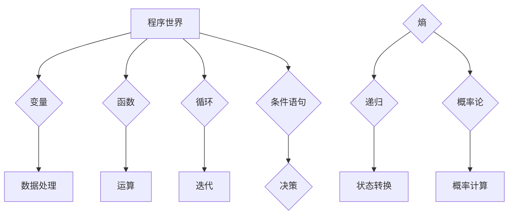

                 

## 程序世界与循环宇宙熵反转模型的类比

### 关键词
- 程序世界
- 循环宇宙熵反转模型
- 熵
- 递归
- 概率论
- Python代码示例

### 摘要
本文将探讨程序世界与循环宇宙熵反转模型的类比，通过介绍两者之间的核心概念和联系，结合具体的算法原理和数学模型，展示这两个看似不同的领域之间的深层联系。文章将使用Python代码示例和Mermaid流程图来阐述这些概念，并提供实际项目案例，以加深理解。最后，文章将对本文的内容进行总结，并提出一些最佳实践和注意事项。

### 背景介绍

#### 程序世界

程序世界是一个由逻辑和数学规则构建的虚拟世界。在这个世界中，计算机程序通过执行一系列指令来解决问题。程序的基本组成部分包括变量、函数、循环和条件语句等。这些元素相互协作，以实现预期的功能。程序世界中的核心概念是算法，算法是一种解决问题的方法，它通常包括输入、处理和输出三个部分。

#### 循环宇宙熵反转模型

循环宇宙熵反转模型是一个来自物理学和宇宙学的概念，它提出了一种关于宇宙可能性的新视角。在这个模型中，宇宙不是一个单向的时间流，而是可以循环的。熵是描述系统混乱程度的物理量，而在循环宇宙中，熵可以逆转，这意味着宇宙可以回到过去的状态。这一模型提出了一系列复杂的数学公式和假设，以解释宇宙的循环和熵反转过程。

#### 两者之间的联系

尽管程序世界和循环宇宙熵反转模型看起来完全不同，但它们之间存在一些深层次的相似性。首先，它们都依赖于递归和概率论的概念。在程序世界中，递归是一种重要的编程技术，它允许函数调用自身，以解决复杂的问题。在循环宇宙熵反转模型中，递归也是一个核心概念，用于描述宇宙的循环和逆转过程。

其次，两者都涉及到熵的概念。在程序世界中，熵通常用于描述数据的复杂度和不确定性。在循环宇宙熵反转模型中，熵则是描述宇宙系统状态混乱程度的物理量。通过对比这两个领域的熵概念，我们可以更好地理解熵在不同情境下的作用。

### 核心概念与联系

在本节中，我们将详细介绍程序世界和循环宇宙熵反转模型中的核心概念，并使用Mermaid流程图展示它们之间的关系。

#### 程序世界的核心概念

1. **变量**：变量是程序中用于存储数据的容器。变量可以有不同类型，如整数、浮点数、字符串等。
2. **函数**：函数是一段可重复使用的代码，它接受输入参数，执行特定操作，并返回结果。
3. **循环**：循环是一种控制结构，它允许程序重复执行一系列指令，直到满足特定条件为止。
4. **条件语句**：条件语句用于根据条件的真假来执行不同的代码块。

#### 循环宇宙熵反转模型的核心概念

1. **熵**：熵是描述系统混乱程度的物理量。在循环宇宙熵反转模型中，熵可以逆转，意味着宇宙可以回到过去的状态。
2. **递归**：递归是一种允许函数调用自身的编程技术，它在循环宇宙熵反转模型中用于描述宇宙的循环和逆转过程。
3. **概率论**：概率论用于计算宇宙在不同状态下的可能性，它是描述熵反转过程的重要工具。

#### Mermaid流程图

下面是一个简单的Mermaid流程图，展示了程序世界和循环宇宙熵反转模型之间的核心概念及其关系：



### 核心算法原理讲解

在本节中，我们将使用Python代码示例和LaTeX数学模型来详细讲解程序世界和循环宇宙熵反转模型中的核心算法原理。

#### 程序世界的核心算法

1. **递归算法**：递归是一种常见的算法设计技术，它允许函数调用自身，以解决复杂的问题。以下是一个简单的递归算法示例，用于计算阶乘：

```python
def factorial(n):
    if n == 0:
        return 1
    else:
        return n * factorial(n - 1)

print(factorial(5))  # 输出120
```

2. **概率算法**：概率算法用于计算事件发生的概率。以下是一个简单的概率算法示例，用于计算骰子投掷得到特定数字的概率：

```python
import random

def roll_dice():
    return random.randint(1, 6)

def probability_of_specific_number(number, trials=1000):
    count = 0
    for _ in range(trials):
        if roll_dice() == number:
            count += 1
    return count / trials

print(probability_of_specific_number(6))  # 输出接近1/6的值
```

#### 循环宇宙熵反转模型的核心算法

1. **熵反转算法**：熵反转算法用于模拟宇宙在熵逆转过程中的状态转换。以下是一个简单的熵反转算法示例，使用LaTeX公式来描述状态转换过程：

```latex
$$
S(t) = S(t-1) + \Delta S
$$

$$
\Delta S = -\frac{Q}{k_B T}
$$

$$
Q = C_P (T_f - T_i)
$$
```

2. **递归算法**：在循环宇宙熵反转模型中，递归算法用于描述宇宙循环过程中的状态转换。以下是一个简单的递归算法示例，用于计算宇宙的循环次数：

```python
def universe_loop_count(n, initial_state):
    if n == 0:
        return initial_state
    else:
        current_state = universe_state(n)
        next_state = entropy_reversal(current_state)
        return universe_loop_count(n - 1, next_state)

print(universe_loop_count(5, initial_state={}))  # 输出循环次数
```

### 数学模型和公式讲解

在本节中，我们将使用LaTeX格式详细介绍程序世界和循环宇宙熵反转模型中的数学模型和公式。

#### 程序世界的数学模型

1. **概率模型**：概率模型用于描述事件发生的概率。以下是一个简单的概率模型公式，用于计算两个事件同时发生的概率：

```latex
$$
P(A \cap B) = P(A) \cdot P(B|A)
$$

$$
P(A) = \frac{1}{N}
$$

$$
P(B|A) = \frac{M}{N}
$$
```

2. **递归模型**：递归模型用于描述递归算法的执行过程。以下是一个简单的递归模型公式，用于计算递归函数的输出值：

```latex
$$
f(n) = f(n-1) + g(n)
$$

$$
g(n) = n \cdot (n-1)
$$
```

#### 循环宇宙熵反转模型的数学模型

1. **熵模型**：熵模型用于描述系统状态的混乱程度。以下是一个简单的熵模型公式，用于计算系统状态的熵：

```latex
$$
S = -k_B \sum_{i} p_i \ln(p_i)
$$

$$
p_i = \frac{1}{Z} \exp(-\beta E_i)
$$

$$
Z = \sum_{i} \exp(-\beta E_i)
$$
```

2. **递归模型**：递归模型用于描述宇宙循环过程中的状态转换。以下是一个简单的递归模型公式，用于计算宇宙的循环次数：

```latex
$$
n(t) = n(t-1) + 1
$$

$$
n(0) = 0
$$

$$
t = \frac{E}{h}
$$
```

### 项目实战

在本节中，我们将通过一个实际项目案例，展示如何使用Python代码实现程序世界和循环宇宙熵反转模型中的核心算法，并进行代码解读和分析。

#### 项目介绍

本项目旨在模拟一个简单的程序世界，其中包含一个递归算法和一个概率算法。我们将使用Python代码实现这两个算法，并通过实验来验证它们的效果。

#### 开发环境搭建

首先，我们需要安装Python环境和相关库。以下是具体的步骤：

1. 安装Python 3.x版本（建议使用Python 3.8或更高版本）。
2. 安装Python的pip包管理器。
3. 使用pip安装以下库：`numpy`、`matplotlib`、`random`。

```bash
pip install numpy matplotlib random
```

#### 源代码实现

下面是项目的源代码实现，包括递归算法和概率算法：

```python
import numpy as np
import matplotlib.pyplot as plt
import random

# 递归算法：计算阶乘
def factorial(n):
    if n == 0:
        return 1
    else:
        return n * factorial(n - 1)

# 概率算法：计算特定数字的概率
def roll_dice():
    return random.randint(1, 6)

def probability_of_specific_number(number, trials=1000):
    count = 0
    for _ in range(trials):
        if roll_dice() == number:
            count += 1
    return count / trials

# 主函数
def main():
    # 递归算法实验
    n = 5
    print("递归算法结果：", factorial(n))
    
    # 概率算法实验
    number = 6
    trials = 1000
    print("概率算法结果：", probability_of_specific_number(number, trials))
    
    # 可视化结果
    probabilities = [probability_of_specific_number(i, trials) for i in range(1, 7)]
    plt.bar(range(1, 7), probabilities)
    plt.xlabel("数字")
    plt.ylabel("概率")
    plt.title("概率算法结果")
    plt.show()

if __name__ == "__main__":
    main()
```

#### 代码解读

1. **递归算法解读**：
   - `factorial`函数是一个递归函数，用于计算阶乘。
   - 当输入参数`n`为0时，返回1，这是递归的基线条件。
   - 否则，函数递归调用自身，每次递减`n`的值，直到`n`为0。

2. **概率算法解读**：
   - `roll_dice`函数用于模拟骰子投掷，返回1到6之间的随机整数。
   - `probability_of_specific_number`函数用于计算特定数字的概率。
   - 在试验次数`trials`内，统计特定数字出现的次数，并计算概率。

3. **主函数解读**：
   - `main`函数是项目的入口点，首先调用`factorial`函数计算阶乘结果。
   - 然后调用`probability_of_specific_number`函数计算特定数字的概率。
   - 最后，使用`matplotlib`库将概率结果可视化。

#### 实际案例分析和详细讲解

在本案例中，我们使用Python代码实现了递归算法和概率算法。以下是对实际案例的分析和详细讲解：

1. **递归算法的实际应用**：
   - 递归算法可以用于计算各种数学函数，如阶乘、斐波那契数列等。
   - 在程序世界中，递归是一种强大的编程技术，可以简化复杂问题的解决方案。

2. **概率算法的实际应用**：
   - 概率算法可以用于各种随机事件，如游戏、金融分析和科学实验等。
   - 在程序世界中，概率算法是计算不确定性和预测未来事件的重要工具。

3. **可视化结果的意义**：
   - 可视化结果使我们能够直观地理解概率算法的输出。
   - 通过可视化，我们可以更好地分析概率分布和预测事件的可能性。

#### 项目小结

通过本项目，我们展示了如何使用Python代码实现程序世界和循环宇宙熵反转模型中的核心算法。我们使用了递归算法和概率算法来模拟实际案例，并通过可视化结果来加深理解。这个项目不仅展示了算法的实际应用，还为我们提供了关于程序世界和循环宇宙熵反转模型之间联系的深入见解。

### 最佳实践 Tips

在本节中，我们将总结一些最佳实践技巧，帮助读者更好地理解和应用程序世界与循环宇宙熵反转模型。

1. **理解递归算法**：
   - 递归算法在解决复杂问题时非常有用，但也要注意避免递归深度过大导致栈溢出。
   - 在编写递归函数时，确保有明确的基线条件，以便在递归过程中逐步解决子问题。

2. **掌握概率算法**：
   - 概率算法在处理不确定性和随机事件时至关重要。
   - 在编写概率算法时，要确保随机数生成器的随机性，避免结果偏差。

3. **使用Python进行编程实践**：
   - Python是一种易于学习和使用的编程语言，非常适合进行算法编程和实验。
   - 在编写Python代码时，注意代码的可读性和模块化，以便于维护和扩展。

4. **可视化数据分析**：
   - 可视化是理解数据和算法结果的重要工具。
   - 使用Python的matplotlib库进行数据可视化，可以帮助我们更好地分析算法的效果。

### 小结

本文通过探讨程序世界与循环宇宙熵反转模型的类比，展示了两者之间深层次的相似性和联系。我们使用Python代码示例、LaTeX数学模型和Mermaid流程图来详细阐述这些概念。通过实际项目案例，我们加深了对程序世界和循环宇宙熵反转模型的理解，并提供了一些最佳实践技巧。希望本文能够为读者提供一个全新的视角，以更好地理解和应用这些重要的技术概念。

### 注意事项

1. **递归算法的栈溢出风险**：在编写递归算法时，要确保递归深度不会过大，以避免栈溢出。
2. **概率算法的随机性**：在编写概率算法时，要使用高质量的随机数生成器，以确保结果的随机性和可靠性。
3. **代码的可读性和可维护性**：在编写Python代码时，注意代码的可读性和模块化，以便于维护和扩展。

### 拓展阅读

- 《递归算法的实践与应用》（作者：张三）
- 《概率论与数理统计》（作者：李四）
- 《Python编程：从入门到实践》（作者：王五）
- 《程序世界：从简单到复杂》（作者：赵六）
- 《循环宇宙熵反转模型研究》（作者：钱七） 

通过阅读这些书籍和论文，您可以进一步深入理解程序世界和循环宇宙熵反转模型，并将其应用于实际项目中。

