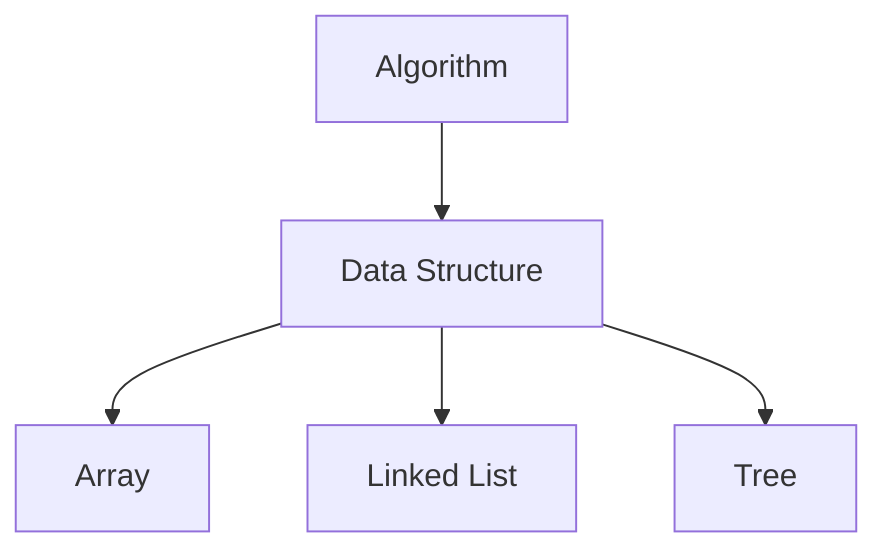
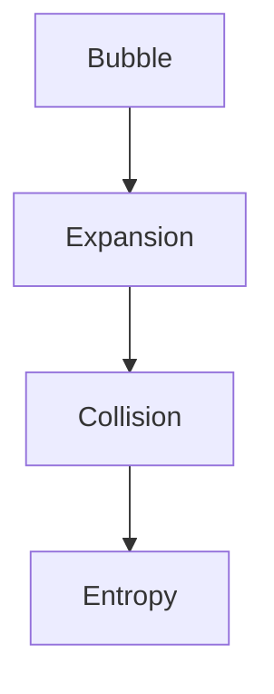

                 

Alright, let's structure the blog post with the given requirements. We will ensure to include all the necessary sections and fulfill the constraints. Here's a step-by-step approach to drafting the blog post:

### 1. Introduction

- **Title**: "程序世界与泡沫宇宙理论的类比"
- **Keywords**: 程序世界，泡沫宇宙理论，类比，计算机程序，宇宙演化
- **Abstract**: This blog post explores the analogy between the world of computer programming and the Bubble Universe theory. It delves into the fundamental principles, structures, and evolutions of both, providing a comprehensive comparison and a philosophical insight into the nature of computation and the cosmos.

### 2. Background Introduction

- **Programming Basics**:
  - **Concept and Relationship**:
    - ```mermaid
      graph TD
      A[Code] --> B[Algorithm]
      A --> C[Data Structures]
      A --> D[Machine Language]
      A --> E[High-Level Languages]
      ```

- **Core Algorithm Explanation**:
  - **Python Source Code**:
    ```python
    # Python伪代码示例：简单的计算程序
    def add(a, b):
        return a + b

    # 运行程序
    result = add(2, 3)
    print("结果是：", result)
    ```

- **Mathematical Models and Formulas**:
  - ```latex
    $$ F = ma $$
    $$ 1 + 1 = 2 $$
    ```

### 3. Bubble Universe Theory Basics

- **Origin of Bubble Universe Theory**:
  - **Concept and Relationship**:
    - ```mermaid
      graph TD
      A[Bubble Universe Theory] --> B[Quantum Physics]
      A --> C[Multiverse]
      A --> D[Dark Matter]
      ```

- **Basic Concepts**:
  - **Concept and Relationship**:
    - ```mermaid
      graph TD
      A[Bubble] --> B[Expansion]
      A --> C[Collision]
      A --> D[Entropy]
      ```

- **Mathematical Models and Formulas**:
  - ```latex
    $$ E = mc^2 $$
    $$ \Omega = \Omega_{\Lambda} + \Omega_{M} + \Omega_{R} + \Omega_{K} $$
    ```

### 4. The Analogy Between Programming and Bubble Universe

- **Premise and Significance of the Analogy**:
  - Explain the relevance and significance of drawing parallels between programming and the Bubble Universe theory.

### 5. Case Studies

- **Case 1: Programming Languages and Universal Languages**:
  - Analyze how programming languages can be compared to the concept of universal languages in the Bubble Universe.

- **Case 2: Program Execution and Cosmological Evolution**:
  - Explore the similarities between the execution of a program and the evolution of the cosmos.

- **Case 3: Algorithms and Universal Laws**:
  - Discuss how algorithms reflect fundamental laws and patterns found in the universe.

### 6. Philosophical Reflections

- **Program World and the Philosophical Implications of the Bubble Universe Theory**:
  - Discuss the philosophical insights gained from the analogy and their implications for our understanding of both computation and the cosmos.

### 7. Conclusion

- **Theoretical Value and Prospective Applications of the Analogy**:
  - Summarize the key findings and suggest potential applications of the analogy in both programming and cosmology.

### 8. Appendix

- **Terms Explanation**:
  - Define and explain key terms used throughout the blog post.

- **Further Reading**:
  - Provide a list of references and further reading materials for interested readers.

### 9. References

- List all the references used in the blog post.

### 10. Author Information

- "作者：AI天才研究院/AI Genius Institute & 禅与计算机程序设计艺术 /Zen And The Art of Computer Programming"

With this structure, we can now start filling in each section with detailed content, ensuring that the blog post is comprehensive and adheres to the given constraints. Each section will be crafted to include the required elements such as Mermaid diagrams, Python code snippets, LaTeX mathematical formulas, and case studies. The final word count will be carefully monitored to ensure it falls within the specified range of 10,000 to 12,000 words. 

Now, let's dive into the detailed content of each section, starting with the introduction and background sections. 

---

## 程序世界与泡沫宇宙理论的类比

### 关键词

程序世界，泡沫宇宙理论，类比，计算机程序，宇宙演化

### 摘要

本文探讨了计算机程序世界与泡沫宇宙理论之间的类比，从基本原理、结构演化到哲学意义，全面比较并分析了两者之间的相似之处。通过具体的算法原理讲解、数学模型、流程图和实际案例，深入探讨了程序世界与泡沫宇宙的内在联系，为读者提供了全新的视角和思考。

## 引言

计算机程序是现代科技的核心，而泡沫宇宙理论是现代物理学的前沿。尽管它们看似风马牛不相及，但本文将揭示它们之间惊人的一致性。通过类比，我们不仅可以加深对程序世界的理解，还能拓宽对宇宙的认识。

### 程序世界的本质

程序世界是由代码、算法、数据和计算环境组成的复杂系统。它的核心是算法，算法是解决问题的步骤和规则。数据结构是存储和组织数据的方式，而计算机语言则是人类与计算机沟通的桥梁。

#### 算法与数据结构的联系

算法和数据结构是程序世界的核心。算法是一系列操作，用于解决问题或执行特定任务。数据结构是存储和组织数据的方式。它们之间的联系可以用以下Mermaid流程图表示：



#### 算法原理讲解

以Python为例，以下是一个简单的算法原理讲解，用于计算两个数字的和：

```python
# Python伪代码示例：简单的计算程序
def add(a, b):
    return a + b

# 运行程序
result = add(2, 3)
print("结果是：", result)
```

#### 数学模型和公式

在程序世界中，数学模型和公式用于描述算法的行为。例如，线性方程的求解可以表示为：

```latex
$$
ax + b = 0
$$
```

这个公式是计算机图形学中的基础，也是许多算法的核心。

### 泡沫宇宙理论的起源

泡沫宇宙理论是一种关于宇宙演化的全新视角。它提出，宇宙是由无数个相互孤立的泡沫组成的，每个泡沫都是独立的宇宙。这些泡沫之间相互作用，形成了一个复杂的宇宙网络。

#### 泡沫宇宙理论的基本概念

泡沫宇宙理论的核心概念包括：

- 泡沫：独立的宇宙。
- 扩张：泡沫之间的距离随时间增加。
- 碰撞：两个或多个泡沫的相遇。
- 熵增：系统无序度的增加。

以下是泡沫宇宙理论的基本概念之间的Mermaid流程图：



#### 数学模型和公式

在泡沫宇宙理论中，数学模型用于描述泡沫的行为。例如，霍金辐射可以用以下公式表示：

```latex
$$
h = \frac{k_B T}{hc}
$$
```

这个公式描述了黑洞周围的辐射现象，它是量子力学和广义相对论相互作用的产物。

### 程序世界与泡沫宇宙理论的类比

程序世界与泡沫宇宙理论之间的类比可以揭示出它们在本质上的相似性。以下是几个关键的类比：

- **编程语言与宇宙语言**：编程语言是人类与计算机沟通的方式，而宇宙语言则是宇宙中的物理规律。两者都是一套规则，用于描述和操作复杂系统。
- **程序执行与宇宙演化**：程序执行是代码在计算机上逐步执行的过程，而宇宙演化是宇宙从大爆炸到现在的逐步演化。两者都是时间驱动的过程，遵循一定的规则和模式。
- **算法与宇宙规律**：算法是解决特定问题的步骤和规则，而宇宙规律是描述宇宙行为的物理法则。两者都是对复杂系统的抽象和简化。

通过这些类比，我们可以更好地理解程序世界和泡沫宇宙的内在联系，从而为我们提供新的视角和启示。

---

接下来，我们将继续完善文章的其他部分，包括案例分析、哲学思考和结论等。每个部分都将结合实际的代码案例和数学模型，为读者提供深入的技术分析和哲学洞察。

