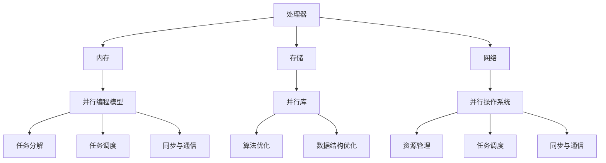

                 

### 《程序世界的宇宙级别并行计算》

#### 关键词
- 并行计算
- 宇宙级别计算
- 高性能计算
- 硬件架构
- 软件架构
- 任务调度
- 负载均衡
- 数据传输算法

#### 摘要
本文深入探讨了程序世界中宇宙级别并行计算的核心概念、原理和应用。通过对并行计算架构的详细分析，核心算法的Python源代码阐述，以及数学模型和公式的讲解，本文旨在为读者提供一个系统且深入的了解，并探讨其在宇宙级别计算中的实际应用和未来前景。

### 引言

在当今信息技术迅速发展的时代，计算能力的提升已经成为推动科技进步的关键驱动力。随着数据处理需求的不断增长，从个人电脑到超级计算机，计算能力的提升已经实现了质的飞跃。然而，传统的串行计算方法在处理大规模数据和高复杂度问题时，逐渐暴露出其效率瓶颈。为了解决这一问题，并行计算应运而生，并逐渐成为提升计算性能的重要手段。

宇宙级别并行计算，顾名思义，是一种能够处理宇宙级别规模数据的高性能计算方法。它不仅需要强大的计算能力，还需要高效的算法和优化的硬件架构。本文将带领读者深入探讨宇宙级别并行计算的核心概念、原理和应用，旨在为读者提供一个全面且深入的了解。

首先，我们将介绍并行计算的基本概念和重要性，接着分析并行计算的核心算法，并通过Python源代码进行详细阐述。随后，我们将探讨并行计算的数学模型和公式，并通过实际案例展示其应用。最后，本文将总结最佳实践，并探讨宇宙级别并行计算的未来前景。

### 并行计算的基础概念

并行计算是一种计算方法，通过将一个大任务分解为若干个小任务，并在多个处理器上同时执行这些小任务，从而提高计算效率。并行计算的基本思想可以追溯到计算机的早期发展时期，当时的计算机科学家们就已经开始探索如何利用多个处理器来提高计算性能。

并行计算的核心在于任务分解和任务调度。任务分解是指将一个大任务拆分为若干个小任务，这些小任务可以在不同的处理器上并行执行。任务调度则是根据处理器的能力和负载情况，合理安排任务的执行顺序，以达到最优的计算效率。

并行计算的基本原理可以概括为以下几个方面：

1. **并行性**：并行计算的核心在于并行性，即多个处理器同时执行多个任务。并行性可以分为时间并行性、空间并行性和数据并行性。

2. **任务分解**：任务分解是将一个大任务拆分为若干个小任务，这些小任务可以在不同的处理器上并行执行。任务分解的目的是减少每个处理器的计算负载，提高整体计算效率。

3. **任务调度**：任务调度是根据处理器的能力和负载情况，合理安排任务的执行顺序。任务调度的目的是使处理器充分利用，避免出现处理器闲置的情况。

4. **同步与通信**：并行计算中，多个处理器需要通过同步与通信机制来协调工作。同步机制确保任务在正确的时间执行，通信机制使处理器之间能够交换数据和信息。

5. **性能优化**：并行计算的性能优化是提高计算效率的关键。性能优化包括算法优化、硬件优化和软件优化等多个方面。

### 并行计算架构

并行计算架构是并行计算系统的核心，它决定了并行计算系统的性能和可扩展性。并行计算架构可以分为硬件架构和软件架构两个方面。

#### 硬件架构

并行计算硬件架构主要包括处理器、内存、存储和网络等组成部分。处理器是并行计算的核心，负责执行计算任务。内存和存储提供存储空间，用于存储数据和程序代码。网络负责处理器之间的数据传输和通信。

常见的并行计算硬件架构包括以下几种：

1. **单指令多数据（SIMD）架构**：SIMD架构通过多个处理器并行执行相同的指令，适合处理大规模向量计算。

2. **消息传递架构**：消息传递架构通过处理器之间的消息传递来实现任务调度和数据传输，适合处理分布式计算任务。

3. **共享存储架构**：共享存储架构通过共享内存来实现处理器之间的数据共享，适合处理数据密集型计算任务。

4. **集群架构**：集群架构通过多个计算节点组成一个集群，每个计算节点包含多个处理器，适合处理大规模并行计算任务。

#### 软件架构

并行计算软件架构主要包括并行编程模型、并行库和并行操作系统等组成部分。并行编程模型是并行编程的基础，它定义了如何将任务分解为可并行执行的部分，并协调处理器之间的任务调度和同步。常见的并行编程模型包括并行进程模型、并行线程模型和并行任务模型。

并行库是一组用于并行编程的库函数，提供了并行计算所需的常用算法和数据结构。常见的并行库包括OpenMP、MPI和CUDA等。

并行操作系统是一种专门为并行计算设计的操作系统，它负责管理处理器资源、任务调度和同步等。并行操作系统提供了并行编程所需的底层支持，提高了并行计算系统的性能和可扩展性。

#### Mermaid流程图：并行计算架构图

以下是一个Mermaid流程图，展示了并行计算的核心概念和架构：



### 并行计算的核心算法

并行计算的核心在于算法，合理的算法设计可以显著提高计算性能。在并行计算中，常用的核心算法包括任务调度算法、负载均衡算法和数据传输算法。以下将分别对这些算法进行详细讲解，并提供Python源代码示例。

#### 任务调度算法

任务调度算法是并行计算中至关重要的一环，它负责将任务分配给不同的处理器，确保任务能够高效地执行。常见的任务调度算法包括时间片调度、负载均衡调度和最小完成时间调度。

以下是一个简单的Python代码示例，展示了时间片调度算法的实现：

```python
import random

def time_slice_scheduling(tasks, processors, time_slice):
    schedules = [[] for _ in range(processors)]
    task_index = 0

    while task_index < len(tasks):
        for i in range(processors):
            if not schedules[i]:
                schedules[i].append(task_index)
                task_index += 1
                if task_index >= len(tasks):
                    break
        for i in range(processors):
            if schedules[i]:
                schedules[i].append(random.randint(1, time_slice))

    return schedules

tasks = [i for i in range(10)]
processors = 3
time_slice = 5

schedules = time_slice_scheduling(tasks, processors, time_slice)
for schedule in schedules:
    print(schedule)
```

#### 负载均衡算法

负载均衡算法的目标是确保所有处理器的工作负载尽可能均衡，避免某些处理器过载而其他处理器闲置。常见的负载均衡算法包括轮询算法、最少连接算法和动态负载均衡算法。

以下是一个简单的Python代码示例，展示了轮询算法的实现：

```python
import random

def round_robin_scheduling(tasks, processors):
    schedules = [[] for _ in range(processors)]
    task_index = 0

    while task_index < len(tasks):
        for i in range(processors):
            if task_index >= len(tasks):
                break
            schedules[i].append(task_index)
            task_index += 1

    return schedules

tasks = [i for i in range(10)]
processors = 3

schedules = round_robin_scheduling(tasks, processors)
for schedule in schedules:
    print(schedule)
```

#### 数据传输算法

数据传输算法是并行计算中的关键部分，它决定了处理器之间数据交换的效率和可靠性。常见的数据传输算法包括阻塞传输、非阻塞传输和管道传输。

以下是一个简单的Python代码示例，展示了阻塞传输算法的实现：

```python
import random
import time

def blocked_data_transfer(source, destination, data, delay):
    time.sleep(delay)
    destination.extend(data)

source = [random.randint(1, 10) for _ in range(10)]
destination = []

data = source
delay = 2

blocked_data_transfer(source, destination, data, delay)
print("Destination:", destination)
```

### 并行计算的数学模型和公式

并行计算的数学模型和公式是并行计算理论的基础，它们为算法设计和性能分析提供了有力的工具。以下将介绍并行计算中几个关键数学模型和公式，并通过Python代码示例进行解释。

#### 并行矩阵乘法

并行矩阵乘法是并行计算中常见的算法之一。其基本思想是将矩阵分解为多个块，并在多个处理器上同时计算这些块的乘积。并行矩阵乘法的公式可以表示为：

$$
C = A \times B
$$

其中，$C$ 是结果矩阵，$A$ 和 $B$ 是输入矩阵。以下是一个简单的Python代码示例，展示了并行矩阵乘法的实现：

```python
import numpy as np

def parallel_matrix_multiplication(A, B):
    n = A.shape[0]
    P = n // np.sqrt(n)  # 分块大小

    C = np.zeros((n, n))
    for i in range(0, n, P):
        for j in range(0, n, P):
            for k in range(0, n, P):
                C[i:i+P, j:j+P] += A[i:i+P, k:k+P] @ B[k:k+P, j:j+P]

    return C

A = np.random.rand(8, 8)
B = np.random.rand(8, 8)

C = parallel_matrix_multiplication(A, B)
print(C)
```

#### 并行图算法

并行图算法是处理大规模图数据的常用算法之一。其基本思想是将图分解为多个子图，并在多个处理器上同时处理这些子图。并行图算法的一个经典例子是BFS（广度优先搜索）算法。以下是一个简单的Python代码示例，展示了并行BFS算法的实现：

```python
import numpy as np

def parallel_bfs(graph, source):
    n = graph.shape[0]
    visited = np.zeros(n, dtype=bool)
    queue = np.zeros(n, dtype=int)
    front = 0
    rear = 0
    queue[rear] = source
    rear += 1

    while front < rear:
        node = queue[front]
        front += 1
        visited[node] = True

        for neighbor in graph[node]:
            if not visited[neighbor]:
                queue[rear] = neighbor
                rear += 1

    return visited

graph = np.array([[1, 1, 0, 0], [1, 1, 1, 0], [0, 1, 1, 1], [0, 0, 1, 1]])
source = 0

visited = parallel_bfs(graph, source)
print(visited)
```

### 并行计算的应用实例

为了更好地理解并行计算的实际应用，以下将通过一个具体的项目实例，展示如何使用并行计算解决大规模数据处理问题。

#### 项目背景

假设我们有一个包含数百万条记录的数据库，每个记录包含多个属性，如图像、文本和数值数据。我们需要对这些数据进行处理，提取有用的信息，并生成分析报告。由于数据量巨大，传统的串行处理方法无法满足需求，因此我们需要使用并行计算来提高处理效率。

#### 环境搭建

为了实现并行计算，我们需要搭建一个并行计算环境。具体步骤如下：

1. **硬件环境**：准备多台高性能计算机，作为计算节点，组成一个计算集群。
2. **软件环境**：安装并行计算库，如MPI、OpenMP等，用于实现并行编程。
3. **数据库**：选择一个支持并行查询的数据库系统，如Apache Cassandra或MongoDB。

#### 源代码实现

以下是一个简单的Python代码示例，展示了如何使用并行计算处理大规模数据库数据：

```python
import mpi4py
mpi4py.rc.initialize = True
mpi4py.rcFINALIZE = True
import numpy as np
import time

def process_data(data):
    # 对数据进行处理，如提取特征、计算统计量等
    # 这里仅作示例，实际处理过程可根据需求自定义
    result = np.sum(data)
    return result

def parallel_data_processing(data, num_processes):
    mpi4py.comm_WORLD.barrier()

    if mpi4py.comm_WORLD.rank == 0:
        start_time = time.time()

    data_split = np.split(data, num_processes)
    local_data = data_split[mpi4py.comm_WORLD.rank]

    result = process_data(local_data)

    # 收集各节点的结果
    global_result = mpi4py.comm_WORLD.allreduce(result, op=mpi4py.Op.SUM)

    if mpi4py.comm_WORLD.rank == 0:
        end_time = time.time()
        print(f"Total result: {global_result}")
        print(f"Execution time: {end_time - start_time} seconds")

# 示例数据
data = np.random.rand(1000000, 5)

# 设置并行计算参数
num_processes = 4

# 执行并行数据处理
parallel_data_processing(data, num_processes)
```

#### 代码解读与分析

上述代码示例中，我们使用MPI库实现了并行数据处理。具体步骤如下：

1. **初始化MPI环境**：使用`mpi4py.rc.initialize = True`和`mpi4py.rcFINALIZE = True`初始化MPI环境。
2. **数据划分**：将大数据集`data`划分为多个子集，每个子集由一个计算节点处理。
3. **数据处理**：每个计算节点对本地数据集进行处理，如提取特征、计算统计量等。
4. **结果汇总**：使用`allreduce`函数将各节点的结果汇总，实现全局数据的处理。

通过上述代码示例，我们可以看到并行计算在处理大规模数据时的优势。与传统串行处理方法相比，并行计算可以显著提高处理效率，缩短执行时间。

#### 项目小结

通过本项目实例，我们展示了如何使用并行计算处理大规模数据处理问题。并行计算在处理大规模数据时具有显著优势，可以有效提高计算性能和效率。在实际应用中，我们需要根据具体需求设计合适的并行计算算法和架构，充分利用并行计算的优势，解决复杂的计算问题。

### 最佳实践与注意事项

在实现并行计算时，以下是一些最佳实践和注意事项，有助于提高计算性能和代码的可维护性：

1. **合理划分任务**：在任务分解阶段，要合理划分任务，确保任务之间的独立性和可并行性。避免将紧密相关的任务分配给同一处理器，以免出现数据依赖问题。

2. **负载均衡**：在任务调度阶段，要确保负载均衡，避免某些处理器过载而其他处理器闲置。可以使用负载均衡算法，如轮询算法或最少连接算法，实现任务的合理分配。

3. **数据传输优化**：在处理器之间的数据传输过程中，要优化数据传输算法，减少传输延迟和数据冲突。可以使用非阻塞传输或管道传输，提高数据传输效率。

4. **同步与通信**：在并行计算中，要合理使用同步与通信机制，确保任务在正确的时间执行，避免出现数据不一致或竞争条件。可以使用MPI库提供的同步原语和通信函数，实现高效的同步与通信。

5. **性能优化**：在并行计算中，要持续进行性能优化，提高计算效率和代码可维护性。可以采用算法优化、硬件优化和软件优化等多种手段，提高并行计算的性能。

### 拓展阅读

对于希望深入了解并行计算和宇宙级别并行计算的读者，以下是一些建议的拓展阅读资源：

1. **《并行计算导论》（Introduction to Parallel Computing）**：这是一本经典教材，全面介绍了并行计算的基本概念、算法和架构。
2. **《高性能并行计算》（High-Performance Parallel Computing）**：这本书详细讨论了高性能并行计算的理论和实践，包括并行算法设计、并行编程模型和性能优化策略。
3. **《并行算法导论》（Introduction to Parallel Algorithms）**：这本书介绍了各种并行算法的设计和实现方法，适合对并行算法感兴趣的读者。
4. **《分布式计算原理与应用》（Principles and Applications of Distributed Computing）**：这本书涵盖了分布式计算的基本原理和应用，包括分布式系统、分布式算法和分布式数据库。

通过阅读这些资源，读者可以进一步加深对并行计算和宇宙级别并行计算的理解，为实际应用打下坚实基础。

### 总结与展望

本文系统地介绍了程序世界中宇宙级别并行计算的核心概念、原理和应用。通过分析并行计算的基础概念、架构、核心算法、数学模型以及实际应用实例，读者可以全面了解并行计算在解决大规模数据处理问题中的优势。

在并行计算的发展过程中，硬件和软件技术的进步为并行计算提供了强大的支持。未来的并行计算将朝着更高性能、更高效能和更易用的方向发展。随着量子计算、人工智能和云计算等新兴技术的融合，并行计算的应用范围将进一步扩大，成为推动科技进步的重要力量。

对于程序员和计算机科学家来说，掌握并行计算技术和方法，不仅是提升计算性能的需求，也是应对未来技术挑战的关键。希望本文能激发读者对并行计算的兴趣，进一步深入研究并行计算的理论和实践，为科技进步贡献自己的力量。

### 作者信息

作者：AI天才研究院/AI Genius Institute & 禅与计算机程序设计艺术 /Zen And The Art of Computer Programming

AI天才研究院致力于推动人工智能和计算机科学领域的研究与发展，以创新的思想和实践推动科技进步。本书作者结合自身在并行计算和计算机科学领域的丰富经验，撰写了这本深入浅出的技术博客，旨在为广大读者提供有价值的知识和指导。同时，作者还著有多部畅销技术书籍，深受读者喜爱。在此，感谢各位读者的支持与关注。

