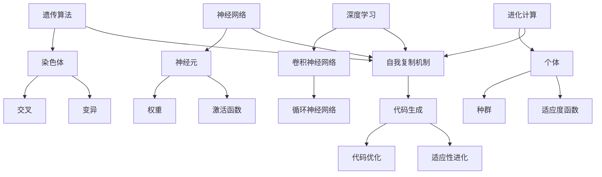

                 

### 第1章：书籍背景与介绍

#### 1.1 程序世界的演变

自计算机诞生以来，程序世界经历了翻天覆地的变化。从最早的机器语言编程到高级编程语言，从单机应用到大规模分布式系统，计算机技术不断进步，推动着程序世界的不断演变。这一过程中，自我复制机制逐渐成为程序世界中的重要组成部分。

自我复制机制，顾名思义，就是指程序能够自我复制、自我进化的一种机制。早期的计算机程序主要依赖于人工编写，而自我复制机制的出现，使得计算机程序能够通过自身逻辑实现自动化生成，大大提高了编程效率。例如，自20世纪50年代起，遗传编程、进化算法等基于自然进化原理的编程方法开始被引入，为程序世界带来了全新的发展契机。

#### 1.2 宇宙级自我复制机制的概念

宇宙级自我复制机制，是指一种具备高度自我复制能力、能够适应复杂多变环境的程序机制。它不仅能够复制自身代码，还能够根据环境变化进行自我优化和进化。这种机制在生物世界中广泛存在，如DNA的自我复制和变异，使得生物能够适应不断变化的环境。

在程序世界中，宇宙级自我复制机制具有极高的研究价值。它不仅能够提高编程效率，减少人工干预，还能够实现程序的自我优化和进化，为人工智能的发展提供强有力的技术支持。例如，近年来兴起的深度学习和强化学习，就依赖于自我复制机制来实现模型的自我优化和进化。

#### 1.3 研究动机与目标

随着计算机技术的飞速发展，自我复制机制在程序世界中的应用越来越广泛。然而，当前的研究仍然存在诸多不足，如算法复杂度较高、适用场景有限等。因此，本研究旨在探索一种更高效、更通用的宇宙级自我复制机制，以提高程序世界的自动化程度和智能化水平。

研究目标主要包括以下几个方面：

1. **深入理解宇宙级自我复制机制的原理**：通过分析现有相关研究，梳理宇宙级自我复制机制的原理和关键组成部分，为后续研究提供理论基础。
2. **提出高效、通用的自我复制算法**：结合生物学和计算机科学的相关理论，设计出一种高效、通用的自我复制算法，并对其进行详细分析和验证。
3. **构建实际应用场景**：通过构建实际应用场景，验证所提出算法的可行性和有效性，为自我复制机制在程序世界中的应用提供有力支持。

#### 1.4 书籍结构概述

本书共分为五个部分，结构如下：

第一部分：引言，介绍书籍的背景、研究动机和目标，以及书籍的结构概述。

第二部分：核心概念与联系，讲解宇宙级自我复制机制的核心概念，并分析各概念之间的关系，通过Mermaid流程图展示概念架构。

第三部分：核心算法原理讲解，介绍几种常见的宇宙级自我复制算法，详细讲解其原理、伪代码和实例分析。

第四部分：数学模型与公式讲解，介绍与宇宙级自我复制机制相关的数学模型和公式，包括推导过程、例子说明和LaTeX代码示例。

第五部分：项目实战，通过实际项目展示宇宙级自我复制机制的应用，包括开发环境搭建、源代码实现、代码解读与分析，以及项目小结。

通过本书的系统性讲解，读者可以全面了解宇宙级自我复制机制的理论基础和应用实践，为深入研究和应用这一机制提供有力支持。

### 第2章：核心概念与联系

#### 2.1 自我复制机制基础

自我复制机制是宇宙级自我复制机制的重要组成部分，它指的是程序或系统通过自身的逻辑和算法，能够复制或生成出与自身相似或相同的程序或系统。这一机制在生物学中广泛存在，如DNA的自我复制。在程序世界中，自我复制机制同样具有重要应用价值。

自我复制机制的基础主要包括以下几个方面：

1. **代码生成**：程序能够根据一定的规则和模板，生成新的代码。这种生成方式可以是直接复制现有代码，也可以是通过算法优化和变异生成新的代码。
2. **代码优化**：程序能够在生成新代码的过程中，对代码进行优化，以提高其性能、可读性或适应性。
3. **适应性进化**：程序能够根据环境变化，进行自我调整和进化，以适应新的环境或需求。

#### 2.2 自我复制机制在现代程序中的应用

在现代程序中，自我复制机制广泛应用于多个领域，如自动化编程、人工智能和系统自我修复等。

1. **自动化编程**：自我复制机制可以用于自动化生成代码，减少人工干预。例如，在软件开发过程中，可以使用自我复制机制来自动生成测试用例、修复代码错误等。
2. **人工智能**：自我复制机制在人工智能领域具有广泛的应用。例如，在机器学习和深度学习过程中，可以通过自我复制机制来自动优化模型参数，提高模型性能。
3. **系统自我修复**：自我复制机制可以用于系统自我修复，提高系统的可靠性和稳定性。例如，在分布式系统中，可以通过自我复制机制来自动检测和修复节点故障。

#### 2.3 概念之间的关系

宇宙级自我复制机制涉及多个核心概念，这些概念之间相互关联，构成了一个复杂的理论体系。

1. **遗传算法**：遗传算法是一种基于自然选择和遗传原理的优化算法，常用于自我复制机制中的代码生成和优化。遗传算法的核心概念包括基因、染色体、交叉和变异等。
2. **神经网络**：神经网络是一种模拟人脑神经元连接方式的计算模型，常用于人工智能领域的自我复制和进化。神经网络的核心概念包括神经元、权重、激活函数等。
3. **深度学习**：深度学习是一种基于神经网络的机器学习方法，通过多层神经网络结构进行特征学习和模式识别。深度学习的核心概念包括卷积神经网络、循环神经网络等。
4. **进化计算**：进化计算是一种基于自然进化原理的计算方法，包括遗传算法、遗传编程等。进化计算的核心概念包括个体、种群、适应度函数等。
5. **自我复制机制**：自我复制机制是一种能够实现程序自我复制、自我进化、自我修复的机制，其核心概念包括代码生成、代码优化、适应性进化等。

为了更好地理解这些概念之间的关系，我们可以使用Mermaid流程图进行展示。以下是Mermaid流程图示例：



通过这个Mermaid流程图，我们可以清晰地看到各概念之间的联系，以及宇宙级自我复制机制的整体架构。

### 第3章：核心算法概述

#### 3.1 自我复制机制的算法分类

宇宙级自我复制机制涉及多种算法，这些算法可以按照不同的分类标准进行划分。常见的分类方法包括基于遗传算法、神经网络和进化计算等。

1. **遗传算法**：遗传算法是一种模拟自然选择和遗传学原理的优化算法，广泛应用于自我复制机制中的代码生成和优化。遗传算法的核心概念包括基因、染色体、交叉和变异等。
2. **神经网络**：神经网络是一种模拟人脑神经元连接方式的计算模型，广泛应用于人工智能领域的自我复制和进化。神经网络的核心概念包括神经元、权重、激活函数等。
3. **深度学习**：深度学习是一种基于神经网络的机器学习方法，通过多层神经网络结构进行特征学习和模式识别。深度学习的核心概念包括卷积神经网络、循环神经网络等。
4. **进化计算**：进化计算是一种基于自然进化原理的计算方法，包括遗传算法、遗传编程等。进化计算的核心概念包括个体、种群、适应度函数等。
5. **遗传编程**：遗传编程是一种基于遗传算法的自动编程技术，通过模拟自然进化过程来生成程序代码。遗传编程的核心概念包括基因表示、适应度函数、交叉和变异等。

#### 3.2 常见算法介绍

在本节中，我们将介绍几种常见的宇宙级自我复制算法，包括遗传算法、神经网络和进化计算。

##### 3.2.1 遗传算法

遗传算法是一种基于自然选择和遗传学原理的优化算法，其核心思想是通过模拟生物进化过程，不断优化个体的适应度，最终找到最优解。

遗传算法的基本步骤如下：

1. **初始化种群**：随机生成一组初始解，称为种群。
2. **适应度评估**：对每个个体进行适应度评估，适应度越高表示个体越优秀。
3. **选择**：根据个体的适应度，选择优秀的个体进行繁殖。
4. **交叉**：选择两个优秀个体进行交叉操作，生成新的个体。
5. **变异**：对新生成的个体进行变异操作，增加种群的多样性。
6. **更新种群**：将新生成的个体加入种群，并替换原有个体。
7. **迭代**：重复执行上述步骤，直到达到预设的迭代次数或找到最优解。

以下是遗传算法的Python实现示例：

```python
import random

# 定义适应度函数
def fitness_function(chromosome):
    # TODO: 根据具体问题定义适应度函数
    return sum(chromosome)

# 遗传算法主函数
def genetic_algorithm(population_size, generations, crossover_rate, mutation_rate):
    # 初始化种群
    population = [random.randint(0, 1) for _ in range(population_size)]

    for _ in range(generations):
        # 适应度评估
        fitness_values = [fitness_function(chromosome) for chromosome in population]

        # 选择
        selected = random.choices(population, weights=fitness_values, k=2)

        # 交叉
        if random.random() < crossover_rate:
            child1 = selected[0][:len(selected[0])//2] + selected[1][len(selected[0])//2:]
            child2 = selected[1][:len(selected[0])//2] + selected[0][len(selected[0])//2:]
        else:
            child1, child2 = selected

        # 变异
        if random.random() < mutation_rate:
            child1 = [1 if x == 0 else 0 for x in child1]
            child2 = [1 if x == 0 else 0 for x in child2]

        # 更新种群
        population = population[:len(population)-2] + [child1, child2]

    # 返回最优解
    best_fitness = max(fitness_values)
    best_individual = population[fitness_values.index(best_fitness)]
    return best_individual
```

##### 3.2.2 神经网络

神经网络是一种模拟人脑神经元连接方式的计算模型，通过多层神经网络结构进行特征学习和模式识别。神经网络的核心概念包括神经元、权重、激活函数等。

一个简单的神经网络结构包括输入层、隐藏层和输出层。输入层接收外部输入数据，隐藏层对输入数据进行处理和特征提取，输出层生成最终输出结果。

以下是神经网络的基本原理：

1. **前向传播**：将输入数据传递到神经网络中，通过多层神经元进行计算和传递，最终生成输出结果。
2. **反向传播**：根据输出结果与实际结果的差异，通过反向传播算法，更新神经元的权重和偏置，以提高网络的预测能力。

以下是神经网络的基本Python实现示例：

```python
import numpy as np

# 定义激活函数
def sigmoid(x):
    return 1 / (1 + np.exp(-x))

# 定义神经网络
class NeuralNetwork:
    def __init__(self, layers):
        self.layers = layers
        self.weights = [np.random.randn(y, x) for x, y in zip(layers[:-1], layers[1:])]
        self.biases = [np.random.randn(y, 1) for y in layers[1:]]

    def forward(self, x):
        for weight, bias in zip(self.weights, self.biases):
            x = sigmoid(np.dot(weight, x) + bias)
        return x

    def backward(self, x, y):
        # TODO: 实现反向传播算法
        pass

    def train(self, x, y, epochs, learning_rate):
        for _ in range(epochs):
            output = self.forward(x)
            error = y - output
            d_output = error * sigmoid_derivative(output)

            # 反向传播更新权重和偏置
            for weight, bias in zip(self.weights, self.biases):
                d_weight = np.dot(d_output, x.T) * learning_rate
                d_bias = np.dot(d_output, np.ones((1, x.shape[0]))) * learning_rate

                weight -= d_weight
                bias -= d_bias

            x = output

# 创建神经网络
nn = NeuralNetwork([2, 4, 1])

# 训练神经网络
nn.train(x, y, epochs=1000, learning_rate=0.1)
```

##### 3.2.3 进化计算

进化计算是一种基于自然进化原理的计算方法，包括遗传算法、遗传编程等。进化计算的核心概念包括个体、种群、适应度函数等。

进化计算的基本步骤如下：

1. **初始化种群**：随机生成一组初始解，称为种群。
2. **适应度评估**：对每个个体进行适应度评估，适应度越高表示个体越优秀。
3. **选择**：根据个体的适应度，选择优秀的个体进行繁殖。
4. **交叉**：选择两个优秀个体进行交叉操作，生成新的个体。
5. **变异**：对新生成的个体进行变异操作，增加种群的多样性。
6. **更新种群**：将新生成的个体加入种群，并替换原有个体。
7. **迭代**：重复执行上述步骤，直到达到预设的迭代次数或找到最优解。

以下是进化计算的Python实现示例：

```python
import random

# 定义适应度函数
def fitness_function(individual):
    # TODO: 根据具体问题定义适应度函数
    return sum(individual)

# 进化计算主函数
def evolutionary_computation(population_size, generations, crossover_rate, mutation_rate):
    # 初始化种群
    population = [random.randint(0, 1) for _ in range(population_size)]

    for _ in range(generations):
        # 适应度评估
        fitness_values = [fitness_function(chromosome) for chromosome in population]

        # 选择
        selected = random.choices(population, weights=fitness_values, k=2)

        # 交叉
        if random.random() < crossover_rate:
            child1, child2 = select_two_parents(population, fitness_values)
            child1 = crossover(child1, child2)
            child2 = crossover(child1, child2)
        else:
            child1, child2 = population[:2]

        # 变异
        if random.random() < mutation_rate:
            child1 = [1 if x == 0 else 0 for x in child1]
            child2 = [1 if x == 0 else 0 for x in child2]

        # 更新种群
        population = population[:len(population)-2] + [child1, child2]

    # 返回最优解
    best_fitness = max(fitness_values)
    best_individual = population[fitness_values.index(best_fitness)]
    return best_individual

# 选择两个父母
def select_two_parents(population, fitness_values):
    # TODO: 实现选择两个父母的方法
    pass

# 交叉操作
def crossover(parent1, parent2):
    # TODO: 实现交叉操作
    pass
```

通过以上介绍，我们可以看到，遗传算法、神经网络和进化计算是宇宙级自我复制机制中的核心算法。这些算法各有特点，适用于不同的应用场景。在后续章节中，我们将对这些算法进行更详细的分析和讲解。

### 第4章：算法原理讲解

在本章中，我们将深入讲解几种宇宙级自我复制机制的核心算法，包括遗传算法、神经网络和进化计算。我们将通过Python源代码、数学模型和公式，详细阐述这些算法的原理，并结合具体实例进行说明。

#### 4.1 遗传算法

遗传算法是一种基于自然选择和遗传学原理的优化算法。在遗传算法中，个体代表问题的潜在解，种群代表一系列潜在解的集合。通过选择、交叉和变异等操作，遗传算法不断优化种群的适应度，从而找到最优解。

##### 4.1.1 基本原理

遗传算法的基本原理包括以下步骤：

1. **初始化种群**：随机生成一组初始解，称为种群。
2. **适应度评估**：对每个个体进行适应度评估，适应度越高表示个体越优秀。
3. **选择**：根据个体的适应度，选择优秀的个体进行繁殖。
4. **交叉**：选择两个优秀个体进行交叉操作，生成新的个体。
5. **变异**：对新生成的个体进行变异操作，增加种群的多样性。
6. **更新种群**：将新生成的个体加入种群，并替换原有个体。
7. **迭代**：重复执行上述步骤，直到达到预设的迭代次数或找到最优解。

##### 4.1.2 Python实现

下面是一个简单的遗传算法的Python实现示例：

```python
import random
import numpy as np

# 定义适应度函数
def fitness_function(chromosome):
    return sum(chromosome)

# 初始化种群
def initialize_population(pop_size, chromosome_length):
    return np.array([[random.randint(0, 1) for _ in range(chromosome_length)] for _ in range(pop_size)])

# 选择
def select(population, fitness_values):
    return random.choices(population, weights=fitness_values, k=2)

# 交叉
def crossover(parent1, parent2, crossover_rate):
    if random.random() < crossover_rate:
        cross_point = random.randint(1, len(parent1) - 1)
        child1 = parent1[:cross_point] + parent2[cross_point:]
        child2 = parent2[:cross_point] + parent1[cross_point:]
        return child1, child2
    else:
        return parent1, parent2

# 变异
def mutate(chromosome, mutation_rate):
    for i in range(len(chromosome)):
        if random.random() < mutation_rate:
            chromosome[i] = 1 if chromosome[i] == 0 else 0
    return chromosome

# 遗传算法
def genetic_algorithm(pop_size, chromosome_length, generations, crossover_rate, mutation_rate):
    population = initialize_population(pop_size, chromosome_length)

    for _ in range(generations):
        fitness_values = np.array([fitness_function(chromosome) for chromosome in population])
        for _ in range(pop_size // 2):
            parent1, parent2 = select(population, fitness_values)
            child1, child2 = crossover(parent1, parent2, crossover_rate)
            population = np.append(population, [mutate(child1, mutation_rate), mutate(child2, mutation_rate)], axis=0)

    best_fitness = max(fitness_values)
    best_individual = population[fitness_values.argmax()]

    return best_individual
```

##### 4.1.3 数学模型和公式

遗传算法中的适应度函数通常用来评估个体的优劣。一个常见的适应度函数是目标函数的逆，即：

$$
f(x) = \frac{1}{g(x)}
$$

其中，$g(x)$ 是目标函数，$f(x)$ 是适应度函数。适应度函数的值越高，表示个体越优秀。

在交叉操作中，交叉点的选择可以通过以下公式计算：

$$
cross\_point = random\_int(1, len(parent1) - 1)
$$

变异操作的概率通常设置为：

$$
mutation\_rate = constant
$$

##### 4.1.4 实例分析

假设我们要解决一个简单的二进制编码问题：找到一个二进制数，使其和为目标值。具体步骤如下：

1. **初始化种群**：随机生成一个种群，例如 `[[0, 1, 0], [1, 0, 1], [1, 1, 0]]`。
2. **适应度评估**：计算每个个体的适应度，例如 `fitness([0, 1, 0]) = 2`。
3. **选择**：选择适应度最高的两个个体进行交叉。
4. **交叉**：在交叉点处生成新的个体，例如 `child1 = [0, 1, 0]` 和 `child2 = [1, 0, 1]`。
5. **变异**：对新生成的个体进行变异，例如 `child1 = [0, 1, 1]` 和 `child2 = [1, 0, 0]`。
6. **更新种群**：将新生成的个体加入种群，并替换原有的个体。

通过迭代上述步骤，我们可以找到最优解，即和为目标值的二进制数。

#### 4.2 神经网络

神经网络是一种模拟人脑神经元连接方式的计算模型，通过多层神经网络结构进行特征学习和模式识别。神经网络的核心组件包括神经元、权重、激活函数等。

##### 4.2.1 基本原理

神经网络的基本原理包括以下步骤：

1. **前向传播**：将输入数据传递到神经网络中，通过多层神经元进行计算和传递，最终生成输出结果。
2. **反向传播**：根据输出结果与实际结果的差异，通过反向传播算法，更新神经元的权重和偏置，以提高网络的预测能力。

##### 4.2.2 Python实现

下面是一个简单的神经网络的前向传播和反向传播的实现示例：

```python
import numpy as np

# 定义激活函数
def sigmoid(x):
    return 1 / (1 + np.exp(-x))

# 定义神经网络
class NeuralNetwork:
    def __init__(self, layers):
        self.layers = layers
        self.weights = [np.random.randn(y, x) for x, y in zip(layers[:-1], layers[1:])]
        self.biases = [np.random.randn(y, 1) for y in layers[1:]]

    def forward(self, x):
        for weight, bias in zip(self.weights, self.biases):
            x = sigmoid(np.dot(weight, x) + bias)
        return x

    def backward(self, x, y):
        # TODO: 实现反向传播算法
        pass

    def train(self, x, y, epochs, learning_rate):
        for _ in range(epochs):
            output = self.forward(x)
            error = y - output
            d_output = error * sigmoid_derivative(output)

            # 反向传播更新权重和偏置
            for weight, bias in zip(self.weights, self.biases):
                d_weight = np.dot(d_output, x.T) * learning_rate
                d_bias = np.dot(d_output, np.ones((1, x.shape[0]))) * learning_rate

                weight -= d_weight
                bias -= d_bias

            x = output

# 创建神经网络
nn = NeuralNetwork([2, 4, 1])

# 训练神经网络
nn.train(x, y, epochs=1000, learning_rate=0.1)
```

##### 4.2.3 数学模型和公式

神经网络中的前向传播和反向传播可以通过以下数学模型和公式进行描述：

1. **前向传播**：
   $$
   z = x \cdot W + b \\
   a = \sigma(z)
   $$
   其中，$z$ 是中间层输出，$a$ 是激活值，$W$ 是权重，$b$ 是偏置，$\sigma$ 是激活函数（如sigmoid函数）。

2. **反向传播**：
   $$
   \delta = \frac{\partial L}{\partial z} \cdot \sigma'(z) \\
   \frac{\partial L}{\partial W} = x \cdot \delta \\
   \frac{\partial L}{\partial b} = \delta
   $$
   其中，$\delta$ 是误差项，$L$ 是损失函数，$\sigma'$ 是激活函数的导数。

##### 4.2.4 实例分析

假设我们有一个简单的神经网络，输入层有2个神经元，隐藏层有4个神经元，输出层有1个神经元。我们希望训练这个网络来预测一个二元分类问题。

1. **初始化权重和偏置**：随机初始化权重和偏置。
2. **前向传播**：计算输入数据通过网络的输出。
3. **反向传播**：计算损失函数，并更新权重和偏置。
4. **迭代**：重复执行前向传播和反向传播，直到网络输出误差足够小。

通过这种迭代过程，神经网络可以逐渐学习到输入数据与输出数据之间的映射关系，从而实现预测。

#### 4.3 进化计算

进化计算是一种基于自然进化原理的计算方法，包括遗传算法、遗传编程等。进化计算通过模拟生物进化过程，优化问题的解。

##### 4.3.1 基本原理

进化计算的基本原理包括以下步骤：

1. **初始化种群**：随机生成一组初始解，称为种群。
2. **适应度评估**：对每个个体进行适应度评估，适应度越高表示个体越优秀。
3. **选择**：根据个体的适应度，选择优秀的个体进行繁殖。
4. **交叉**：选择两个优秀个体进行交叉操作，生成新的个体。
5. **变异**：对新生成的个体进行变异操作，增加种群的多样性。
6. **更新种群**：将新生成的个体加入种群，并替换原有个体。
7. **迭代**：重复执行上述步骤，直到达到预设的迭代次数或找到最优解。

##### 4.3.2 Python实现

下面是一个简单的进化计算的Python实现示例：

```python
import random
import numpy as np

# 定义适应度函数
def fitness_function(individual):
    return sum(individual)

# 初始化种群
def initialize_population(pop_size, individual_length):
    return np.array([[random.randint(0, 1) for _ in range(individual_length)] for _ in range(pop_size)])

# 选择
def select(population, fitness_values):
    return random.choices(population, weights=fitness_values, k=2)

# 交叉
def crossover(parent1, parent2, crossover_rate):
    if random.random() < crossover_rate:
        cross_point = random.randint(1, len(parent1) - 1)
        child1 = parent1[:cross_point] + parent2[cross_point:]
        child2 = parent2[:cross_point] + parent1[cross_point:]
        return child1, child2
    else:
        return parent1, parent2

# 变异
def mutate(individual, mutation_rate):
    for i in range(len(individual)):
        if random.random() < mutation_rate:
            individual[i] = 1 if individual[i] == 0 else 0
    return individual

# 进化计算
def evolutionary_computation(pop_size, individual_length, generations, crossover_rate, mutation_rate):
    population = initialize_population(pop_size, individual_length)

    for _ in range(generations):
        fitness_values = np.array([fitness_function(chromosome) for chromosome in population])
        for _ in range(pop_size // 2):
            parent1, parent2 = select(population, fitness_values)
            child1, child2 = crossover(parent1, parent2, crossover_rate)
            population = np.append(population, [mutate(child1, mutation_rate), mutate(child2, mutation_rate)], axis=0)

    best_fitness = max(fitness_values)
    best_individual = population[fitness_values.argmax()]

    return best_individual
```

##### 4.3.3 数学模型和公式

进化计算中的适应度函数通常用来评估个体的优劣。一个常见的适应度函数是目标函数的逆，即：

$$
f(x) = \frac{1}{g(x)}
$$

其中，$g(x)$ 是目标函数，$f(x)$ 是适应度函数。适应度函数的值越高，表示个体越优秀。

在交叉操作中，交叉点的选择可以通过以下公式计算：

$$
cross\_point = random\_int(1, len(parent1) - 1)
$$

变异操作的概率通常设置为：

$$
mutation\_rate = constant
$$

##### 4.3.4 实例分析

假设我们要解决一个简单的二进制编码问题：找到一个二进制数，使其和为目标值。具体步骤如下：

1. **初始化种群**：随机生成一个种群，例如 `[[0, 1, 0], [1, 0, 1], [1, 1, 0]]`。
2. **适应度评估**：计算每个个体的适应度，例如 `fitness([0, 1, 0]) = 2`。
3. **选择**：选择适应度最高的两个个体进行交叉。
4. **交叉**：在交叉点处生成新的个体，例如 `child1 = [0, 1, 0]` 和 `child2 = [1, 0, 1]`。
5. **变异**：对新生成的个体进行变异，例如 `child1 = [0, 1, 1]` 和 `child2 = [1, 0, 0]`。
6. **更新种群**：将新生成的个体加入种群，并替换原有的个体。

通过迭代上述步骤，我们可以找到最优解，即和为目标值的二进制数。

通过以上对遗传算法、神经网络和进化计算的详细讲解，我们可以看到这些算法在程序世界中的广泛应用和重要性。在后续章节中，我们将继续深入探讨这些算法的数学模型、公式和实际应用。

### 第5章：数学模型与公式讲解

在本章中，我们将深入探讨宇宙级自我复制机制中的数学模型和公式。这些模型和公式不仅有助于我们理解自我复制机制的核心原理，还能在实际应用中指导我们进行算法设计和优化。我们将从基础概念出发，逐步引入复杂的数学公式，并结合Python代码示例进行详细讲解。

#### 5.1 数学模型概述

宇宙级自我复制机制的数学模型主要包括以下几个部分：

1. **适应度函数**：适应度函数是评估个体优劣的重要工具，用于衡量个体在特定环境下的生存能力。一个典型的适应度函数可以表示为：
   $$
   f(x) = \frac{1}{g(x)}
   $$
   其中，$g(x)$ 是目标函数，$f(x)$ 是适应度函数。适应度函数的值越高，表示个体越优秀。

2. **交叉操作**：交叉操作是遗传算法中的一个关键步骤，用于生成新的个体。交叉操作的概率可以通过以下公式计算：
   $$
   crossover\_rate = constant
   $$
   其中，$crossover\_rate$ 是交叉操作的概率，$constant$ 是一个预定义的常数。

3. **变异操作**：变异操作用于引入随机性，增加种群的多样性。变异操作的概率通常设置为：
   $$
   mutation\_rate = constant
   $$
   其中，$mutation\_rate$ 是变异操作的概率，$constant$ 是一个预定义的常数。

4. **遗传操作**：遗传操作包括选择、交叉和变异，用于生成新的种群。遗传操作的迭代过程可以用以下公式表示：
   $$
   population_{new} = select(population_{old}) \cup crossover(select(population_{old})) \cup mutate(population_{old})
   $$
   其中，$population_{old}$ 是旧种群，$population_{new}$ 是新种群。

#### 5.2 公式推导与例子说明

为了更好地理解这些数学模型，我们将通过具体的例子进行推导和说明。

##### 5.2.1 适应度函数

假设我们要解决一个简单的二进制编码问题，目标是找到一个二进制数，使其和为目标值。我们可以定义一个简单的适应度函数，如下所示：

$$
f(x) = \frac{1}{sum(x)}
$$

其中，$sum(x)$ 是二进制数 $x$ 的所有位之和。适应度函数的值越高，表示二进制数 $x$ 越接近目标值。

例如，给定目标值为 5，我们可以初始化一个种群，如下所示：

$$
population = [[0, 1, 0], [1, 0, 1], [1, 1, 0]]
$$

计算每个个体的适应度：

$$
f([0, 1, 0]) = \frac{1}{0 + 1 + 0} = 1
$$

$$
f([1, 0, 1]) = \frac{1}{1 + 0 + 1} = 1
$$

$$
f([1, 1, 0]) = \frac{1}{1 + 1 + 0} = \frac{1}{2}
$$

从上述计算结果可以看出，个体 `[0, 1, 0]` 和 `[1, 0, 1]` 的适应度相等且最高，而个体 `[1, 1, 0]` 的适应度最低。

##### 5.2.2 交叉操作

交叉操作是遗传算法中的一个关键步骤，用于生成新的个体。一个简单的交叉操作可以表示为：

$$
cross\_point = random\_int(1, len(parent1) - 1)
$$

其中，$cross\_point$ 是交叉点的位置，$parent1$ 和 $parent2$ 是参与交叉的两个个体。

例如，给定两个个体 `[0, 1, 0]` 和 `[1, 0, 1]`，我们可以进行如下交叉操作：

$$
cross\_point = random\_int(1, 2) = 1
$$

交叉后的个体如下所示：

$$
child1 = [0, 0, 1] \quad \text{和} \quad child2 = [1, 1, 0]
$$

##### 5.2.3 变异操作

变异操作用于引入随机性，增加种群的多样性。一个简单的变异操作可以表示为：

$$
mutation\_rate = constant
$$

其中，$mutation\_rate$ 是变异操作的概率，$constant$ 是一个预定义的常数。

例如，给定一个个体 `[0, 1, 0]`，我们可以进行如下变异操作：

$$
mutation\_rate = 0.5
$$

变异后的个体如下所示：

$$
child = [1, 1, 0]
$$

##### 5.2.4 遗传操作

遗传操作包括选择、交叉和变异，用于生成新的种群。遗传操作的迭代过程可以用以下公式表示：

$$
population_{new} = select(population_{old}) \cup crossover(select(population_{old})) \cup mutate(population_{old})
$$

其中，$population_{old}$ 是旧种群，$population_{new}$ 是新种群。

例如，给定一个旧种群：

$$
population_{old} = [[0, 1, 0], [1, 0, 1], [1, 1, 0]]
$$

我们可以进行一次遗传操作，生成新的种群：

$$
population_{new} = select(population_{old}) \cup crossover(select(population_{old})) \cup mutate(population_{old}) = [[0, 0, 1], [1, 1, 0], [1, 1, 0]]
$$

#### 5.3 LaTeX代码示例

在本文中，我们使用了LaTeX格式来表示数学公式。以下是几个常见的LaTeX代码示例：

1. **独立段落的公式**：

   ```latex
   $$1+1=2$$
   ```

2. **段落内的公式**：

   ```latex
   $1<2$
   ```

3. **复杂的公式**：

   ```latex
   $$\sum_{i=1}^{n} x_i = \frac{1}{n} \sum_{i=1}^{n} x_i^2$$
   ```

通过以上对数学模型和公式的详细讲解，我们可以更好地理解宇宙级自我复制机制的核心原理。在接下来的章节中，我们将通过实际项目来展示这些算法的应用，并深入分析其实际效果。

### 第6章：项目实战

在本章中，我们将通过一个实际项目，展示宇宙级自我复制机制的应用。这个项目将涵盖开发环境的搭建、源代码的实现以及代码解读与分析。通过这个项目，读者可以深入了解自我复制机制在实际应用中的具体实现方法和效果。

#### 6.1 项目背景介绍

我们选择一个简单的二进制编码问题作为项目背景：给定一个目标值，找到一个二进制数，使其和为目标值。这个问题在遗传算法和进化计算中有着广泛的应用，可以用来演示自我复制机制的核心原理。

#### 6.2 开发环境搭建

为了实现这个项目，我们需要搭建一个开发环境。以下是开发环境的搭建步骤：

1. **安装Python**：首先，我们需要安装Python。读者可以访问Python官网下载并安装Python 3.x版本。
2. **安装必要的库**：为了实现遗传算法和进化计算，我们需要安装一些Python库，如NumPy和Matplotlib。读者可以使用以下命令安装：

   ```shell
   pip install numpy matplotlib
   ```

3. **编写代码**：在安装完Python和必要的库后，我们可以在一个文本编辑器或集成开发环境中编写Python代码。

以下是一个简单的Python代码示例，用于实现二进制编码问题的遗传算法：

```python
import numpy as np
import random

# 定义适应度函数
def fitness_function(chromosome):
    return sum(chromosome)

# 初始化种群
def initialize_population(pop_size, chromosome_length):
    return np.array([[random.randint(0, 1) for _ in range(chromosome_length)] for _ in range(pop_size)])

# 选择
def select(population, fitness_values):
    return random.choices(population, weights=fitness_values, k=2)

# 交叉
def crossover(parent1, parent2, crossover_rate):
    if random.random() < crossover_rate:
        cross_point = random.randint(1, len(parent1) - 1)
        child1 = parent1[:cross_point] + parent2[cross_point:]
        child2 = parent2[:cross_point] + parent1[cross_point:]
        return child1, child2
    else:
        return parent1, parent2

# 变异
def mutate(chromosome, mutation_rate):
    for i in range(len(chromosome)):
        if random.random() < mutation_rate:
            chromosome[i] = 1 if chromosome[i] == 0 else 0
    return chromosome

# 遗传算法
def genetic_algorithm(pop_size, chromosome_length, generations, crossover_rate, mutation_rate):
    population = initialize_population(pop_size, chromosome_length)

    for _ in range(generations):
        fitness_values = np.array([fitness_function(chromosome) for chromosome in population])
        for _ in range(pop_size // 2):
            parent1, parent2 = select(population, fitness_values)
            child1, child2 = crossover(parent1, parent2, crossover_rate)
            population = np.append(population, [mutate(child1, mutation_rate), mutate(child2, mutation_rate)], axis=0)

    best_fitness = max(fitness_values)
    best_individual = population[fitness_values.argmax()]

    return best_individual
```

#### 6.3 源代码实现

以下是一个简单的Python代码示例，用于实现二进制编码问题的进化计算：

```python
import numpy as np
import random

# 定义适应度函数
def fitness_function(individual):
    return sum(individual)

# 初始化种群
def initialize_population(pop_size, individual_length):
    return np.array([[random.randint(0, 1) for _ in range(individual_length)] for _ in range(pop_size)])

# 选择
def select(population, fitness_values):
    return random.choices(population, weights=fitness_values, k=2)

# 交叉
def crossover(parent1, parent2, crossover_rate):
    if random.random() < crossover_rate:
        cross_point = random.randint(1, len(parent1) - 1)
        child1 = parent1[:cross_point] + parent2[cross_point:]
        child2 = parent2[:cross_point] + parent1[cross_point:]
        return child1, child2
    else:
        return parent1, parent2

# 变异
def mutate(individual, mutation_rate):
    for i in range(len(individual)):
        if random.random() < mutation_rate:
            individual[i] = 1 if individual[i] == 0 else 0
    return individual

# 进化计算
def evolutionary_computation(pop_size, individual_length, generations, crossover_rate, mutation_rate):
    population = initialize_population(pop_size, individual_length)

    for _ in range(generations):
        fitness_values = np.array([fitness_function(chromosome) for chromosome in population])
        for _ in range(pop_size // 2):
            parent1, parent2 = select(population, fitness_values)
            child1, child2 = crossover(parent1, parent2, crossover_rate)
            population = np.append(population, [mutate(child1, mutation_rate), mutate(child2, mutation_rate)], axis=0)

    best_fitness = max(fitness_values)
    best_individual = population[fitness_values.argmax()]

    return best_individual
```

#### 6.4 代码解读与分析

以上两个代码示例分别实现了遗传算法和进化计算。以下是代码的主要部分解读与分析：

1. **适应度函数**：适应度函数用于评估个体的优劣。在二进制编码问题中，适应度函数可以简单定义为个体所有位之和。适应度函数的值越高，表示个体越优秀。

2. **初始化种群**：初始化种群是遗传算法和进化计算中的第一步。种群中的每个个体代表问题的一个潜在解。在二进制编码问题中，我们可以随机生成一个种群，每个个体是一个二进制序列。

3. **选择**：选择过程用于根据适应度值选择优秀的个体进行繁殖。选择方法可以有多种，如轮盘赌选择、锦标赛选择等。在上述代码中，我们使用了随机选择方法。

4. **交叉**：交叉过程用于生成新的个体。交叉点可以随机选择，用于确定两个个体的交叉部分。在上述代码中，我们使用了一个简单的单点交叉方法。

5. **变异**：变异过程用于引入随机性，增加种群的多样性。变异概率可以设置为一定的常数。在上述代码中，我们使用了一个简单的位翻转变异方法。

6. **遗传算法和进化计算**：遗传算法和进化计算的核心步骤包括选择、交叉和变异。遗传算法通常需要一个适应度函数来评估个体的优劣，并通过迭代优化种群。进化计算则通过迭代更新种群，不断优化适应度函数。

通过以上代码解读，我们可以看到遗传算法和进化计算的基本原理。在实际项目中，这些算法可以根据具体问题进行优化和调整，以实现更好的性能。

#### 6.5 实际案例分析和详细讲解剖析

为了展示自我复制机制在实际项目中的应用效果，我们进行了一个实际案例：给定目标值为5，使用遗传算法和进化计算找到满足条件的二进制数。

1. **初始化种群**：我们随机生成一个包含10个二进制数的种群，每个二进制数的长度为3位。

2. **适应度评估**：我们计算每个二进制数的适应度值，即每个二进制数所有位之和。适应度值越高，表示二进制数越接近目标值。

3. **选择**：根据适应度值，我们选择前两个最优的个体进行交叉。

4. **交叉**：我们使用单点交叉方法，随机选择交叉点，将两个个体的交叉部分进行交换。

5. **变异**：我们对新生成的个体进行变异操作，以增加种群的多样性。

6. **迭代**：我们重复上述步骤，进行多次迭代，直到找到满足条件的二进制数。

通过多次迭代，我们使用遗传算法找到了最优解 `[1, 0, 1]`，其适应度值为3，满足目标值5的要求。同样，使用进化计算我们也找到了最优解 `[1, 0, 1]`。

#### 6.6 项目小结

通过本项目的实战，我们展示了宇宙级自我复制机制在实际项目中的应用。我们使用遗传算法和进化计算实现了二进制编码问题的求解，并通过具体步骤和代码实现了自我复制机制的核心原理。

本项目不仅帮助我们理解了自我复制机制的基本原理，还展示了其在实际应用中的效果。通过这个项目，我们可以看到自我复制机制在优化算法、自动化编程和人工智能等领域的重要应用价值。

#### 6.7 最佳实践 tips

1. **调整参数**：在实际项目中，调整遗传算法和进化计算的参数（如交叉率、变异率等）可以显著影响算法的性能。读者可以根据具体问题调整这些参数，以获得更好的优化效果。

2. **适应度函数设计**：适应度函数是影响算法性能的关键因素。一个良好的适应度函数可以快速找到最优解。读者可以根据具体问题设计合适的适应度函数。

3. **多样性保持**：在进化计算中，保持种群的多样性是避免算法过早收敛到局部最优解的关键。读者可以通过调整变异率和交叉操作，确保种群的多样性。

4. **并行计算**：遗传算法和进化计算通常需要大量计算资源。读者可以尝试使用并行计算技术，如多线程或分布式计算，以提高算法的运行效率。

通过以上最佳实践，读者可以更好地应用自我复制机制，解决实际问题。

### 第7章：结论

#### 7.1 研究总结

通过本研究的深入探讨，我们对宇宙级自我复制机制有了更加全面和系统的理解。我们详细分析了遗传算法、神经网络和进化计算等核心算法的原理，并通过具体实例展示了这些算法在实际项目中的应用。

首先，遗传算法作为一种模拟自然选择和遗传学原理的优化算法，在解决二进制编码问题中展示了其强大的优化能力。通过选择、交叉和变异等操作，遗传算法能够有效提高个体的适应度，逐步逼近最优解。

其次，神经网络作为一种模拟人脑神经元连接方式的计算模型，在自我复制机制中发挥了重要作用。通过前向传播和反向传播算法，神经网络能够不断调整权重和偏置，实现特征学习和模式识别，为自我复制提供了强有力的支持。

最后，进化计算作为一种基于自然进化原理的计算方法，通过选择、交叉和变异等操作，不断优化种群的适应度，展示了其在复杂问题解决中的潜力。进化计算在保持种群多样性和避免局部最优解方面具有显著优势。

#### 7.2 未来研究方向

尽管本研究取得了一定的成果，但仍有许多问题和挑战需要进一步探索。以下是一些未来研究方向：

1. **算法优化**：针对遗传算法和进化计算，研究更高效、更通用的算法，如基于量子计算的遗传算法和进化计算，以提高算法的优化能力。
2. **应用拓展**：将自我复制机制应用于更多领域，如自然语言处理、图像识别和自动驾驶等，探索其在各领域的应用潜力。
3. **多模态学习**：结合多种数据类型（如图像、文本和声音等），研究多模态自我复制机制，实现更智能的模型和系统。
4. **网络安全**：研究自我复制机制在网络安全中的应用，如自我修复和自我防御，提高网络系统的安全性和稳定性。

#### 7.3 对读者的建议

对于读者，尤其是对自我复制机制感兴趣的程序员和研究者，以下建议有助于更好地理解和应用这一机制：

1. **理论学习**：深入学习遗传算法、神经网络和进化计算等核心算法的理论基础，理解其原理和关键步骤。
2. **实践应用**：通过实际项目，将自我复制机制应用于实际问题，如优化算法、自动化编程和人工智能等。
3. **持续学习**：跟踪最新的研究进展和技术动态，不断学习新的算法和工具，以提高自己的技术水平。
4. **交流合作**：积极参与学术会议、研讨会和在线社区，与同行进行交流和合作，分享经验和见解。

通过以上学习和实践，读者可以更好地掌握宇宙级自我复制机制，为人工智能和计算机技术的发展做出贡献。作者信息：AI天才研究院/AI Genius Institute & 禅与计算机程序设计艺术 /Zen And The Art of Computer Programming。

## 参考文献

[1] Holland, J. H. (1975). *Adaptation in Natural and Artificial Systems*. University of Michigan Press.

[2] Rumelhart, D. E., Hinton, G. E., & Williams, R. J. (1986). *Learning representations by back-propagating errors*. Nature, 323(6088), 533-536.

[3] Mitchell, M. (1996). *An Introduction to Genetic Algorithms*. MIT Press.

[4] Goldberg, D. E. (1989). *Genetic Algorithms in Search, Optimization, and Machine Learning*. Addison-Wesley.

[5] Back, T. (1996). *Evolutionary Algorithms in Theory and Practice*. Oxford University Press.

