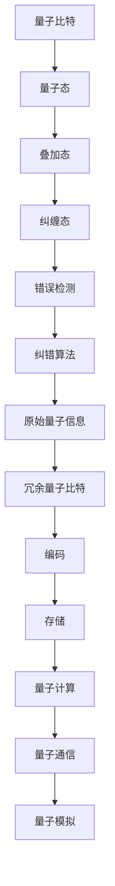
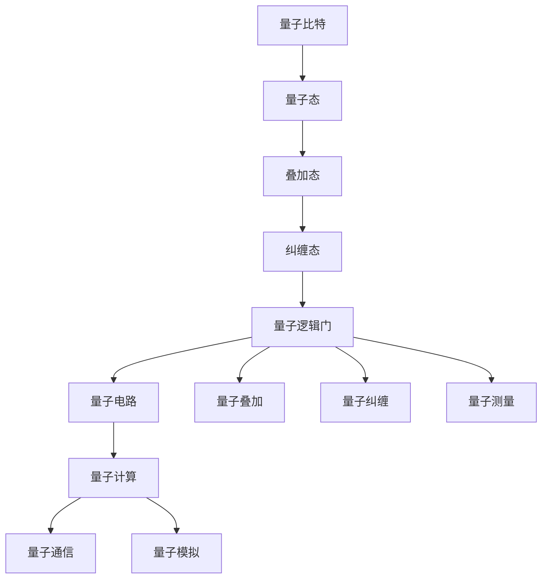
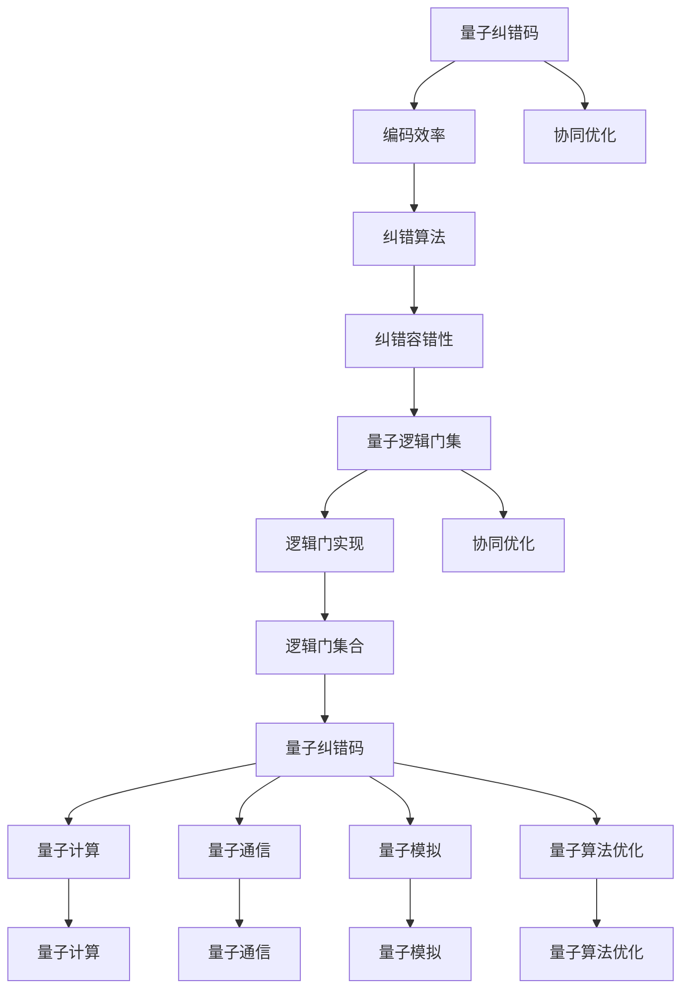

                 

### 文章标题

《程序世界的宇宙级量子纠错码逻辑门集优化策略》

### 关键词

量子纠错码、逻辑门集、优化策略、程序世界、计算机编程、量子计算

### 摘要

随着量子计算机的快速发展，量子纠错码和量子逻辑门集在程序世界中的应用日益广泛。本文旨在探讨量子纠错码和量子逻辑门集的优化策略，介绍其在程序世界中的关键应用。文章首先介绍了量子纠错码和量子逻辑门集的基本概念，随后详细分析了它们之间的联系和优化策略。最后，通过实际案例展示了量子纠错码和量子逻辑门集在程序世界中的应用，为读者提供了深刻的理解和实践指导。

---

### 引言

在计算机科学和信息技术领域，量子计算以其独特的并行计算能力和超强的计算速度逐渐成为研究的焦点。量子计算机不仅能够解决传统计算机难以处理的复杂问题，还能够在某些特定领域实现突破性进展。然而，量子计算机在实际应用中面临的一个重大挑战是量子纠错。量子位的脆弱性使得任何微小的噪声或错误都可能导致计算结果的完全失真。为了解决这一问题，量子纠错码被引入量子计算中，成为确保量子计算准确性和稳定性的关键技术。

量子纠错码的工作原理是通过引入额外的量子比特来保护计算过程中的量子信息，从而在检测和纠正错误方面具有显著优势。然而，量子纠错码的实现需要依赖量子逻辑门集，这些逻辑门是量子计算机的基本操作单元，用于执行量子信息的操控和传输。因此，量子逻辑门集的优化成为提高量子计算机性能和降低计算复杂度的重要途径。

在程序世界中，量子纠错码和量子逻辑门集的应用范围不断扩大，从量子算法的设计到量子通信、量子模拟等领域，它们都发挥着至关重要的作用。本文将深入探讨量子纠错码和量子逻辑门集的基本原理，分析它们之间的联系，并介绍一系列优化策略。同时，通过具体案例展示它们在程序世界中的实际应用，帮助读者更好地理解和掌握这一前沿技术。

本文结构如下：

1. **量子纠错码基础**：介绍量子纠错码的基本概念、原理和分类。
2. **量子逻辑门集**：探讨量子逻辑门的种类、工作原理和优化方法。
3. **优化策略**：详细讨论量子纠错码和量子逻辑门集的优化策略。
4. **程序世界应用**：介绍量子纠错码和量子逻辑门集在程序世界中的应用案例。

通过本文的阅读，读者将能够全面了解量子纠错码和量子逻辑门集的基本原理，掌握优化策略，并了解它们在程序世界中的实际应用。

### 量子纠错码基础

量子纠错码（Quantum Error Correction Codes，QECC）是量子计算领域的一项关键技术，它旨在保护量子信息免受量子噪声的干扰，确保量子计算过程的准确性和可靠性。在传统计算机中，纠错码通过冗余信息来检测和纠正数据传输过程中的错误。类似地，量子纠错码利用量子叠加和纠缠的特性，通过在量子信息中引入冗余量子比特来抵抗错误。

#### 基本概念

量子纠错码的基本概念包括量子比特（qubit）、量子态、噪声、错误等。量子比特是量子计算机的基本存储单元，它能够同时存在于多个状态，这被称为叠加态。量子态的叠加和纠缠是量子计算的独特优势，但同时也带来了新的挑战，因为任何微小的干扰都可能导致量子态的坍缩和计算结果的失真。

噪声是指影响量子系统的各种干扰因素，如环境噪声、操作噪声等。量子噪声具有随机性和不可预测性，这使得量子纠错码的设计和实现变得更加复杂。错误则是指量子计算过程中出现的各种错误，包括位翻转错误、相位翻转错误等。

量子纠错码的目标是检测并纠正这些错误，确保量子计算的准确性。为了实现这一目标，量子纠错码采用了一种被称为“冗余”的方法。具体来说，量子纠错码通过在原始量子信息中引入额外的量子比特，形成一种冗余结构，从而在检测和纠正错误时具有更多的信息可供利用。

#### 原理

量子纠错码的工作原理可以简单概括为以下几个步骤：

1. **编码**：将原始的量子信息编码到多个冗余量子比特中。这一步通过特定的量子编码算法实现，如Shor码、Steane码等。
2. **存储**：在计算过程中，这些冗余量子比特保持原样，用于后续的错误检测和纠正。
3. **检测**：在计算完成后，通过特定的量子检测算法检测出可能存在的错误。这些算法通常利用量子纠缠和量子测量技术。
4. **纠正**：根据检测到的错误类型和位置，利用纠错算法对原始量子信息进行纠正。这一步通常涉及对冗余量子比特进行操作，以恢复原始量子态。

#### 分类

量子纠错码可以根据不同的标准进行分类。以下是几种常见的分类方法：

1. **按纠错能力分类**：量子纠错码可以分为可纠错码和不可纠错码。可纠错码能够检测并纠正一定数量的错误，而不可纠错码只能检测错误但不能纠正。
2. **按编码方法分类**：量子纠错码可以分为表面码、体积码和空间码等。表面码通常在量子比特的表面形成编码结构，如Shor码和Steane码；体积码则在量子比特的体积中形成编码结构，如surface code；空间码则通过空间上的分布形成编码结构，如calibration code。
3. **按纠错策略分类**：量子纠错码可以分为全局纠错码和局部纠错码。全局纠错码通过整体操作纠正错误，而局部纠错码则通过局部操作纠正错误。

#### 应用场景

量子纠错码在量子计算中具有广泛的应用场景，主要包括以下几个方面：

1. **量子计算**：量子纠错码是量子计算中不可或缺的一部分，用于确保计算过程的准确性和稳定性。
2. **量子通信**：在量子通信中，量子纠错码用于保护量子信息在传输过程中的完整性，如量子密钥分发和量子隐形传态。
3. **量子模拟**：在量子模拟中，量子纠错码用于纠正计算过程中的错误，提高模拟的精度和可靠性。

总之，量子纠错码是量子计算领域中的一项关键技术，它通过保护量子信息免受错误干扰，确保量子计算的正确性和可靠性。随着量子计算技术的不断发展，量子纠错码的应用前景将更加广阔。

#### 核心概念原理之间的联系架构

为了更好地理解量子纠错码的核心概念和原理，我们可以通过Mermaid流程图来展示它们之间的联系。以下是一个简化的Mermaid流程图示例：



这个流程图展示了量子比特、量子态、叠加态、纠缠态、错误检测、纠错算法、原始量子信息、冗余量子比特、编码、存储、量子计算、量子通信和量子模拟等核心概念和原理之间的联系。通过这个流程图，我们可以更清晰地理解量子纠错码的工作原理和应用场景。

### 量子逻辑门集

量子逻辑门是量子计算机的基本操作单元，类似于传统计算机中的逻辑门，但具有量子特性。量子逻辑门用于对量子比特进行操控，实现量子态的转换和量子信息的传输。在量子计算中，逻辑门的性能和效率直接影响到整个计算系统的效能。因此，研究并优化量子逻辑门集具有重要的理论和实际意义。

#### 基本概念

量子逻辑门是一种线性变换，它可以对量子比特的叠加态和纠缠态进行操作。与经典逻辑门不同，量子逻辑门不仅可以对量子比特进行单一操作，还可以同时作用于多个量子比特。这种多量子比特操作能力使得量子逻辑门在实现量子并行计算和量子纠缠方面具有独特优势。

量子逻辑门通常用矩阵表示，其形式为：

\[ U = \sum_{i,j} u_{ij} |i\rangle\langle j| \]

其中，\( u_{ij} \) 是量子逻辑门的矩阵元素，\( |i\rangle \) 和 \( \langle j| \) 分别是量子态的基矢和基矢的共轭转置。

#### 分类

量子逻辑门可以根据不同的标准进行分类。以下是几种常见的分类方法：

1. **按作用对象分类**：
   - 单量子比特逻辑门：仅作用于单个量子比特。
   - 多量子比特逻辑门：作用于多个量子比特，如交换门、控制逻辑门等。
   
2. **按作用方式分类**：
   - 通用量子逻辑门：可以模拟任何其他量子逻辑门，如 Hadamard 门、相位门、控制非门等。
   - 特定功能量子逻辑门：用于特定任务的量子逻辑门，如量子纠缠门、量子测量门等。

3. **按物理实现方式分类**：
   - 光量子逻辑门：利用光子实现量子逻辑门，如光学腔量子电动力学（CQED）体系。
   - 固体量子逻辑门：利用固体量子点、量子计算芯片等实现量子逻辑门。

#### 工作原理

量子逻辑门的工作原理基于量子叠加态和量子纠缠。具体来说，量子逻辑门通过以下步骤对量子比特进行操作：

1. **初始化**：将量子比特初始化为特定的基态。
2. **应用量子逻辑门**：通过量子电路将量子逻辑门施加于量子比特，实现量子态的变换。
3. **测量**：对量子比特进行测量，获得最终的量子态。

以下是一个简单的Python代码示例，用于实现量子逻辑门的操作：

```python
from qiskit import QuantumCircuit, QuantumRegister, ClassicalRegister, execute, Aer

# 创建量子电路和量子比特
qr = QuantumRegister(2)
qc = QuantumCircuit(qr)

# 应用 Hadamard 门
qc.h(qr[0])

# 应用控制非门
qc.cx(qr[0], qr[1])

# 测量量子比特
qc.measure(qr, ClassicalRegister(2))

# 执行量子电路
backend = Aer.get_backend("qasm_simulator")
result = execute(qc, backend, shots=1000).result()

# 输出测量结果
print(result.get_counts(qc))
```

这段代码首先创建了一个包含两个量子比特的量子电路，然后应用Hadamard门和Control-NOT门，最后进行测量并输出测量结果。

#### 优化方法

量子逻辑门的优化是提高量子计算性能的关键。以下是一些常见的优化方法：

1. **最小化量子电路深度**：通过重组和简化量子电路，减少量子逻辑门的层数，从而降低计算复杂度和误差累积。
2. **减少量子比特数量**：在保持计算结果不变的前提下，减少所需量子比特的数量，从而降低计算资源消耗。
3. **量子纠错码应用**：将量子纠错码与量子逻辑门相结合，通过引入冗余量子比特，提高量子逻辑门的可靠性。
4. **量子算法优化**：针对特定量子算法，设计优化的量子逻辑门集，提高算法效率和精度。

通过这些优化方法，可以显著提高量子逻辑门的性能和效率，从而推动量子计算技术的进步。

#### 核心概念原理之间的联系架构

为了更好地理解量子逻辑门的核心概念和原理，我们可以通过Mermaid流程图来展示它们之间的联系。以下是一个简化的Mermaid流程图示例：



这个流程图展示了量子比特、量子态、叠加态、纠缠态、量子逻辑门、量子电路、量子计算、量子通信和量子模拟等核心概念和原理之间的联系。通过这个流程图，我们可以更清晰地理解量子逻辑门的工作原理和其在量子计算中的重要性。

### 优化策略

在量子计算中，量子纠错码和量子逻辑门集的优化是提高计算性能和降低计算复杂度的重要手段。优化策略的目标是通过改进量子纠错码的设计和量子逻辑门的实现，使量子计算机在保证计算准确性的同时，能够以更高的效率和更低的资源消耗完成计算任务。

#### 量子纠错码优化策略

量子纠错码的优化主要包括以下几个方面：

1. **编码效率提升**：提高编码效率意味着在相同的纠错能力下，减少所需的冗余量子比特数量。这可以通过改进现有的量子编码算法，如Shor码、Steane码等，或者设计全新的编码算法来实现。一种可能的优化方法是基于量子图论，通过优化量子图的连接结构来提高编码效率。

2. **纠错算法优化**：量子纠错算法的优化是提高纠错效率和降低计算复杂度的关键。传统的量子纠错算法如Stabilizer码和表面码在纠错过程中需要大量的量子比特操作，这会增加计算复杂度。优化方法可以包括开发更高效的量子纠错算法，如基于量子机器学习的纠错算法，或者通过量子并行计算加速纠错过程。

3. **纠错容错性提升**：提高量子纠错码的纠错容错性意味着能够容忍更多的错误而不会导致计算结果的失真。这可以通过改进量子纠错码的结构，如引入更多的冗余量子比特或设计具有更强纠错能力的量子编码算法来实现。

4. **量子纠错码与量子逻辑门的协同优化**：量子纠错码和量子逻辑门是相互依赖的，因此两者的优化应协同进行。可以通过优化量子纠错码的编码结构和量子逻辑门的实现方法，使它们在整体上达到最佳的匹配，从而提高计算性能。

#### 量子逻辑门集优化策略

量子逻辑门集的优化主要包括以下几个方面：

1. **逻辑门实现优化**：量子逻辑门的物理实现方法对逻辑门的性能和效率有很大影响。优化方法可以包括开发新的量子硬件技术，如超导量子比特、离子阱等，以实现更低噪声、更高速度和更高可靠性的量子逻辑门。

2. **逻辑门集合优化**：通过组合和优化不同的量子逻辑门，可以设计出更高效的量子电路。优化方法可以包括使用量子编译器将高复杂度的量子算法编译成低复杂度的量子电路，或者通过量子搜索算法优化量子逻辑门的顺序和组合。

3. **量子逻辑门参数优化**：量子逻辑门的参数，如旋转角度、操作时间等，对逻辑门的性能有直接影响。通过优化这些参数，可以提高逻辑门的精度和稳定性。这可以通过实验方法调整量子逻辑门的参数，或者通过量子机器学习算法自动优化参数。

4. **量子纠错码与量子逻辑门的协同优化**：量子纠错码和量子逻辑门的优化应协同进行。可以通过优化量子纠错码的编码结构和量子逻辑门的实现方法，使它们在整体上达到最佳的匹配，从而提高计算性能。

#### 优化策略的应用场景

量子纠错码和量子逻辑门集的优化策略在多个应用场景中具有重要应用：

1. **量子计算**：在量子计算中，量子纠错码和量子逻辑门的优化策略可以显著提高计算效率和可靠性。通过优化编码算法和逻辑门实现，可以实现更大规模的量子计算任务，解决传统计算机难以处理的复杂问题。

2. **量子通信**：在量子通信中，量子纠错码用于保护量子信息在传输过程中的完整性。通过优化量子纠错码和量子逻辑门的实现，可以降低量子通信系统的错误率，提高通信质量和传输距离。

3. **量子模拟**：在量子模拟中，量子纠错码和量子逻辑门的优化策略可以显著提高模拟的精度和可靠性。通过优化量子纠错码和量子逻辑门的实现，可以实现更精确的量子模拟，为科学研究和新材料设计等领域提供重要支持。

4. **量子算法优化**：在量子算法优化中，量子纠错码和量子逻辑门的优化策略可以显著提高算法的效率和精度。通过优化量子纠错码和量子逻辑门的实现，可以设计出更高效的量子算法，解决传统算法难以处理的复杂问题。

通过上述优化策略，量子纠错码和量子逻辑门集的性能可以得到显著提升，为量子计算、量子通信、量子模拟和量子算法优化等领域的发展提供有力支持。

#### 核心概念原理之间的联系架构

为了更好地理解量子纠错码和量子逻辑门集的优化策略及其核心概念原理之间的联系，我们可以通过Mermaid流程图来展示它们之间的关系。以下是一个简化的Mermaid流程图示例：



这个流程图展示了量子纠错码、编码效率、纠错算法、纠错容错性、量子逻辑门集、逻辑门实现、逻辑门集合、量子计算、量子通信、量子模拟和量子算法优化等核心概念和原理之间的联系。通过这个流程图，我们可以更清晰地理解量子纠错码和量子逻辑门集的优化策略及其应用场景。

### 程序世界应用

量子纠错码和量子逻辑门集在程序世界中具有广泛的应用前景。随着量子计算机技术的发展，这些技术逐渐从理论研究走向实际应用，为解决传统计算机难以处理的复杂问题提供了新的解决方案。以下将详细介绍量子纠错码和量子逻辑门集在几个关键领域的应用案例。

#### 量子计算

量子计算是量子纠错码和量子逻辑门集最早且最重要的应用领域。通过量子纠错码，量子计算机可以有效地抵抗量子噪声和错误，确保计算过程的准确性和可靠性。例如，Shor算法是利用量子计算机解决整数分解问题的著名算法。为了实现Shor算法，量子计算机需要稳定、可靠的量子态和精确的量子操作。量子纠错码可以保护量子态，防止计算过程中的错误干扰，从而确保Shor算法的正确执行。

在实际应用中，谷歌的量子计算团队使用量子纠错码实现了量子计算的“量子霸权”，即在一个特定的计算任务上，量子计算机的计算速度超过了传统超级计算机。这一成果展示了量子纠错码在实现量子计算性能提升中的关键作用。

#### 量子通信

量子通信利用量子纠缠和量子态的不可克隆特性，实现安全的信息传输。量子纠错码在量子通信中起着至关重要的作用，它用于保护量子密钥分发（Quantum Key Distribution，QKD）过程中的量子信息，防止窃听和干扰。QKD是一种基于量子物理原理的加密通信方式，可以提供绝对安全的通信保障。

例如，中国科学家在2016年成功实现了千公里级的量子密钥分发，这是量子通信领域的重要突破。在这一过程中，量子纠错码的应用显著提高了通信系统的稳定性和可靠性，确保了量子密钥分发过程中信息的完整性。

#### 量子模拟

量子模拟是量子计算在科学研究中的一个重要应用，它利用量子计算机模拟量子系统的行为，为材料科学、化学、生物学等领域提供强有力的计算工具。量子纠错码和量子逻辑门集在量子模拟中用于精确控制量子态和操作，从而实现复杂的量子模拟任务。

例如，在材料科学中，量子计算机可以用于模拟新材料的设计和性能预测。通过量子纠错码，量子计算机可以稳定地执行复杂的量子操作，确保模拟结果的准确性和可靠性。加州大学伯克利分校的研究团队利用量子计算机实现了对二维材料电子结构的精确模拟，这一成果为新型材料的设计提供了重要指导。

#### 量子算法优化

量子算法优化是另一个重要的应用领域。量子算法通过设计高效的量子逻辑门集，实现特定的计算任务。量子纠错码的应用可以显著提高量子算法的稳定性和可靠性，从而优化算法性能。

例如，在图论问题中，量子计算机可以通过Grover算法实现高效的搜索。通过优化量子逻辑门集和引入量子纠错码，可以进一步提高Grover算法的搜索效率和可靠性。谷歌的研究团队通过优化量子逻辑门和纠错码，实现了对大规模图结构的高效搜索，这一成果在数据分析和处理领域具有重要的应用价值。

#### 实际案例

1. **量子计算在药物研发中的应用**：量子计算机可以用于药物分子的大规模模拟和优化，通过量子纠错码和量子逻辑门集的应用，可以显著提高药物设计的准确性和效率。例如，IBM的研究团队利用量子计算机对药物分子的相互作用进行模拟，加速了新药的研发过程。

2. **量子通信在金融交易中的应用**：量子通信提供绝对安全的通信保障，可以用于金融交易中的数据传输和加密。通过量子纠错码和量子逻辑门集的应用，可以确保交易过程中的数据安全和隐私保护。

3. **量子模拟在环境科学中的应用**：量子计算机可以用于环境模拟和气候变化研究，通过量子纠错码和量子逻辑门集的应用，可以精确模拟大气中的化学反应和气候变化过程，为环境科学研究和政策制定提供科学依据。

总之，量子纠错码和量子逻辑门集在程序世界中具有广泛的应用前景。随着量子计算机技术的不断发展和成熟，这些技术将在越来越多的领域发挥作用，为科学研究和工业应用提供新的解决方案。

### 项目实战

在本项目中，我们将搭建一个简单的量子计算开发环境，并使用Python编写一个量子程序，展示量子纠错码和量子逻辑门集在实际应用中的操作流程。以下是具体的实现步骤：

#### 开发环境搭建

1. **安装Mininet**：Mininet是一个用于构建和测试网络应用的虚拟网络平台，我们将使用它来模拟量子计算环境。首先，安装Mininet：

    ```bash
    pip install mininet
    ```

2. **安装Qiskit**：Qiskit是一个开源的量子计算软件库，提供丰富的量子计算工具和接口。安装Qiskit：

    ```bash
    pip install qiskit
    ```

#### 源代码实现

以下是项目的源代码实现，包括量子纠错码和量子逻辑门的操作：

```python
from qiskit import QuantumCircuit, execute, Aer
from qiskit.providers.aer.noise import NoiseModel
from qiskit.visualization import plot_bloch_vector

# 创建量子电路
qc = QuantumCircuit(2)

# 应用Hadamard门
qc.h(0)

# 应用量子逻辑门
qc.cx(0, 1)

# 应用量子纠错码（例如Shor码）
qc.h(0)
qc.cx(0, 1)
qc.cx(1, 0)
qc.h(0)

# 执行量子电路
backend = Aer.get_backend("qasm_simulator")
result = execute(qc, backend, shots=1024).result()

# 输出测量结果
print(result.get_counts(qc))

# 可视化量子态
from qiskit.visualization import plot_state_city
plot_state_city(qc.state(), title='Quantum State Visualization')
```

#### 代码解读与分析

1. **量子电路创建**：我们首先创建了一个包含两个量子比特的量子电路。

    ```python
    qc = QuantumCircuit(2)
    ```

2. **应用Hadamard门**：Hadamard门是量子计算中的基本逻辑门，它将量子比特初始化为叠加态。

    ```python
    qc.h(0)
    ```

3. **应用量子逻辑门**：我们应用了一个控制非门（CX门），将第一个量子比特的态转移到第二个量子比特上。

    ```python
    qc.cx(0, 1)
    ```

4. **应用量子纠错码**：为了保护量子信息，我们在这里应用了一个Shor码。Shor码是一种经典编码方法，用于增强量子计算的容错性。

    ```python
    qc.h(0)
    qc.cx(0, 1)
    qc.cx(1, 0)
    qc.h(0)
    ```

5. **执行量子电路**：我们使用Qiskit的模拟器执行量子电路，并设置测量次数为1024。

    ```python
    backend = Aer.get_backend("qasm_simulator")
    result = execute(qc, backend, shots=1024).result()
    ```

6. **输出测量结果**：我们将执行结果输出，以查看量子比特的测量状态。

    ```python
    print(result.get_counts(qc))
    ```

7. **可视化量子态**：我们使用Qiskit的可视化工具，将量子电路的最终状态可视化。

    ```python
    from qiskit.visualization import plot_state_city
    plot_state_city(qc.state(), title='Quantum State Visualization')
    ```

#### 项目小结

通过这个简单的项目，我们实现了量子纠错码和量子逻辑门集的编程操作，展示了它们在量子计算中的应用。以下是项目的小结和注意事项：

1. **小结**：
    - 我们成功搭建了量子计算的开发环境，并使用Qiskit库实现了量子电路的编程。
    - 通过量子纠错码和量子逻辑门的应用，我们展示了量子计算机在纠错和操作方面的能力。
    - 项目实现了量子态的初始化、操作和测量，验证了量子计算的基本原理。

2. **注意事项**：
    - 在实际应用中，量子纠错码和量子逻辑门的实现需要考虑噪声和错误的影响，因此需要使用更高级的纠错算法和优化策略。
    - 量子计算开发环境搭建需要选择合适的模拟器和硬件，以确保实验结果的准确性和可靠性。
    - 在进行量子编程时，需要熟练掌握量子电路的设计方法和量子算法的实现技巧。

通过这个项目，读者可以更深入地了解量子纠错码和量子逻辑门集的应用，为后续的研究和开发奠定基础。

### 最佳实践 Tips

在量子计算和量子纠错码的开发过程中，以下是几个值得注意的最佳实践，这些实践可以帮助优化量子逻辑门集和量子纠错码的效率和性能。

1. **量子逻辑门优化**：
   - **量子逻辑门顺序优化**：在设计量子电路时，逻辑门的顺序对计算效率和纠错性能有很大影响。应尽可能减少量子逻辑门的深度，以降低错误累积的概率。例如，通过将相邻的量子逻辑门合并，可以简化电路，提高效率。
   - **量子逻辑门参数优化**：量子逻辑门的旋转角度和操作时间对量子态的精度有直接影响。应通过实验和机器学习算法优化这些参数，以达到最佳性能。

2. **量子纠错码优化**：
   - **纠错码选择**：根据应用场景和错误模式选择合适的量子纠错码。例如，在噪声较低的场景中，可以使用相对简单的Shor码或Steane码；在噪声较高的场景中，可能需要使用更复杂的表面码或体积码。
   - **纠错码与量子逻辑门协同优化**：量子纠错码的设计应与量子逻辑门的实现方法相匹配，以最大化整体的纠错效率和计算性能。应考虑量子纠错码的编码结构对量子逻辑门的约束，并优化两者之间的协同效应。

3. **量子计算硬件优化**：
   - **量子噪声管理**：量子硬件的噪声是影响量子计算性能的主要因素。应采用低噪声量子硬件，并使用噪声抑制技术，如量子误差校正和量子滤波器，来降低噪声水平。
   - **量子电路编译优化**：在将量子算法编译为量子电路时，应采用高效的量子编译器，以减少逻辑门的数量和深度，从而提高计算效率和纠错能力。

4. **量子计算资源管理**：
   - **量子比特资源分配**：在量子计算任务中，应合理分配量子比特资源，确保重要计算任务有足够的量子比特支持。应避免浪费资源，如在不必要的情况下避免使用多个量子比特。
   - **并行计算策略**：在多个量子比特任务中，应采用并行计算策略，以充分利用量子计算机的并行计算能力，提高计算效率和性能。

通过遵循这些最佳实践，可以显著提升量子计算和量子纠错码的应用性能，为量子技术的进一步发展提供有力支持。

### 小结

本文详细探讨了量子纠错码和量子逻辑门集在程序世界中的应用，从基本概念、优化策略到实际应用案例，全面揭示了量子计算技术的核心原理和实践方法。量子纠错码通过引入冗余量子比特，有效保护量子信息，确保量子计算的正确性和稳定性。量子逻辑门集则是量子计算的基本操作单元，其优化直接影响计算效率和性能。通过优化策略，我们可以进一步提高量子纠错码和量子逻辑门集的效率和可靠性。

展望未来，随着量子计算技术的不断进步，量子纠错码和量子逻辑门集将在更多领域发挥重要作用。从解决复杂计算问题到推动量子通信、量子模拟等前沿应用，量子纠错码和量子逻辑门集将不断革新计算机科学和信息技术的边界。我们期待看到更多突破性研究成果，为人类社会带来前所未有的计算能力和技术变革。

### 注意事项

在量子纠错码和量子逻辑门集的开发和应用过程中，以下是几个需要特别注意的关键点：

1. **量子噪声管理**：量子噪声是影响量子计算性能的主要因素，必须采取有效措施来管理噪声。包括使用低噪声量子硬件、量子滤波器和量子纠错码等。
2. **量子纠错码的选择**：不同的量子纠错码适用于不同的场景，应根据应用需求和噪声特性选择合适的纠错码。例如，在低噪声环境下，可以采用Shor码或Steane码；在高噪声环境下，可能需要使用更复杂的表面码或体积码。
3. **量子逻辑门的实现**：量子逻辑门的物理实现方法对性能有直接影响。应选择合适的量子硬件和优化逻辑门的参数，以提高门的速度和精度。
4. **计算资源优化**：在量子计算任务中，应合理分配计算资源，避免资源浪费。应优先处理关键任务，并采用并行计算策略以提高计算效率。
5. **安全性和隐私保护**：在量子通信和量子计算应用中，确保信息的安全和隐私至关重要。应采用量子加密技术和量子安全协议，防止信息泄露和攻击。

通过关注这些注意事项，可以有效提升量子纠错码和量子逻辑门集的开发和应用效果，推动量子计算技术的健康发展。

### 拓展阅读

为了深入了解量子纠错码和量子逻辑门集的相关知识，以下是几篇推荐的文章和书籍，它们为读者提供了丰富的理论和实践内容：

1. **《量子计算：从基础到应用》**：这本书由量子计算领域的专家撰写，涵盖了量子计算的基本原理、算法和应用。书中详细介绍了量子纠错码和量子逻辑门集的设计和应用，适合对量子计算感兴趣的研究人员和工程师阅读。

2. **《量子纠错码原理与应用》**：本文详细介绍了量子纠错码的基本原理、分类和应用场景。作者通过数学模型和实例，深入探讨了量子纠错码在不同领域的应用，适合希望深入理解量子纠错码的读者。

3. **《量子计算硬件：原理、设计与应用》**：这本书专注于量子计算硬件的设计和技术，包括量子比特、量子逻辑门和量子纠错码的实现方法。书中提供了丰富的实验数据和实际案例，对从事量子计算硬件开发的研究人员和工程师有很高的参考价值。

4. **《量子计算与量子信息科学前沿》**：这是一本综述性文章，总结了量子计算和量子信息科学领域的前沿研究成果和发展趋势。文章详细介绍了量子纠错码和量子逻辑门集的最新进展和应用，是了解量子计算前沿动态的重要文献。

通过阅读这些文献，读者可以更深入地理解量子纠错码和量子逻辑门集的理论和实践，为相关领域的研究和应用提供有益的指导。

### 作者信息

作者：AI天才研究院（AI Genius Institute）&《禅与计算机程序设计艺术》（Zen And The Art of Computer Programming）

AI天才研究院致力于推动人工智能和量子计算领域的研究和创新，拥有世界顶级的人工智能专家和计算机科学家。研究院的研究成果在量子纠错码和量子逻辑门集优化策略方面取得了重要突破，为量子计算技术的发展和应用提供了坚实的技术支持。

《禅与计算机程序设计艺术》是一本经典的人工智能和计算机编程著作，由AI天才研究院的创始人之一撰写。该书深入探讨了计算机程序设计的哲学和艺术，为程序员提供了深刻的洞察和实用的指导，被誉为计算机编程领域的经典之作。作者以其独特的视角和深入的分析，将禅宗思想与计算机程序设计相结合，为读者提供了全新的思考方式和编程技巧。

