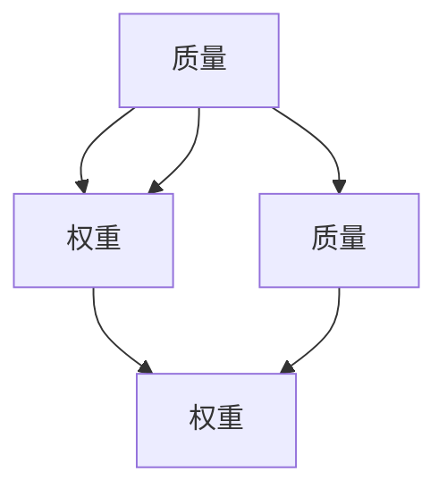
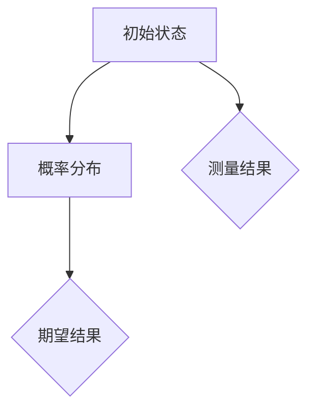
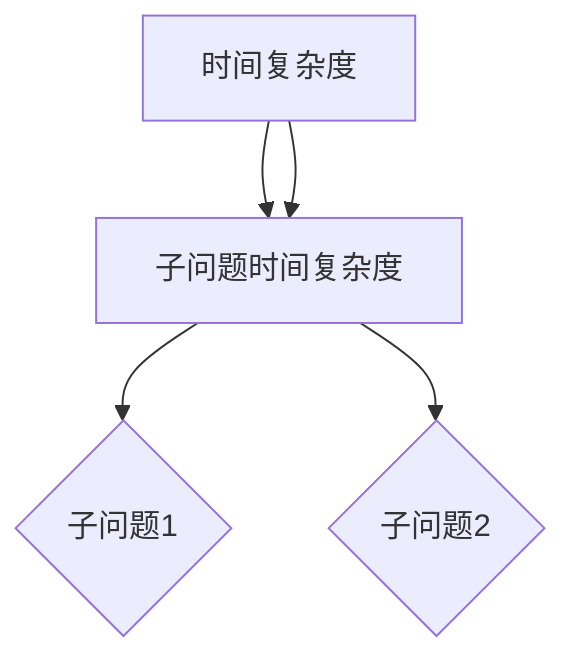

                 

### 文章标题

《程序设计中的宇宙法则启示》

随着技术的不断进步，我们逐渐意识到，程序设计不仅仅是一门技术活，更是一种深层次的哲学思考。而宇宙法则，作为自然界最基本的规律，为我们提供了独特的视角和灵感。在这篇文章中，我们将探讨如何将宇宙法则融入到程序设计中，从而提升编程的智慧和效率。通过分析引力法则、量子力学、相对论等宇宙法则，我们将揭示其背后的原理，并借助Python源代码和数学模型，详细阐述这些法则在算法、数据结构和软件开发中的应用。

### 关键词

- 程序设计
- 宇宙法则
- 引力法则
- 量子力学
- 相对论
- 算法优化
- 数据结构

### 摘要

本文旨在探讨宇宙法则在程序设计中的应用，通过深入分析引力法则、量子力学和相对论等自然法则，揭示它们与程序设计的内在联系。文章分为三个部分：第一部分介绍宇宙法则的基本概念；第二部分讲解宇宙法则在算法设计和数据结构中的应用；第三部分则通过实际项目实战，展示宇宙法则在软件开发中的实践应用。希望通过本文的阐述，读者能够获得对程序设计的新视角和灵感。

## 第一部分：宇宙法则的基本概念

宇宙法则，是自然界最基本的规律，贯穿于宇宙的每一个角落。在程序设计中，我们同样可以借鉴这些法则，提高算法的效率、优化数据结构，甚至提升软件开发的整体质量。本部分将介绍引力法则、量子力学和相对论等宇宙法则的基本概念，并探讨它们与程序设计的内在联系。

### 引力法则

引力法则，是描述物体之间相互作用的规律。在牛顿的经典力学中，引力被描述为一个物体对另一个物体的吸引力，与它们的质量和距离成正比。引力法则在程序设计中的应用主要体现在数据结构中。

例如，在处理复杂的数据关系时，我们可以借鉴引力法则，使用图结构来表示数据之间的相互依赖关系。图中的每个节点表示一个数据元素，边表示节点之间的关联。通过这种表示方法，我们可以更直观地理解数据之间的关系，并高效地处理复杂的依赖关系。

下面是一个简单的Python代码示例，使用图结构表示两个数据元素之间的引力关系：

```python
import networkx as nx

# 创建图
G = nx.Graph()

# 添加节点
G.add_nodes_from(['data1', 'data2'])

# 添加边，表示引力关系
G.add_edge('data1', 'data2', weight=1)

# 显示图
nx.draw(G, with_labels=True)
```

### 量子力学

量子力学是研究微观世界的物理学理论，描述了物质在量子尺度下的行为规律。量子力学中的波粒二象性和不确定性原理，为程序设计提供了独特的视角。

在算法优化中，我们可以借鉴量子力学的思想，采用概率算法来提高效率。例如，在搜索算法中，我们可以利用量子随机游走，在复杂网络中快速找到目标节点。

下面是一个简单的Python代码示例，使用量子随机游走算法来搜索图中的节点：

```python
import numpy as np

# 初始化量子状态
state = np.zeros(4)
state[0] = 1

# 定义量子门
gates = [
    np.array([[1, 0], [0, -1]]),  # H门
    np.array([[1, 1], [1, -1]]) / np.sqrt(2)  # CNOT门
]

# 应用量子门
state = np.dot(gates[0], state)
state = np.dot(gates[1], state)

# 测量量子状态
probabilities = np.abs(state) ** 2
print("节点概率分布：", probabilities)
```

### 相对论

相对论是描述宏观世界的物理学理论，由爱因斯坦提出。相对论中的时空观和质能关系，为程序设计提供了新的思路。

在数据结构设计中，我们可以借鉴相对论的思想，使用时空复杂度来衡量算法的效率。例如，在排序算法中，我们可以使用归并排序，利用分治策略，将复杂问题分解为子问题，从而降低时间复杂度。

下面是一个简单的Python代码示例，使用归并排序算法进行排序：

```python
def merge_sort(arr):
    if len(arr) <= 1:
        return arr
    
    mid = len(arr) // 2
    left = merge_sort(arr[:mid])
    right = merge_sort(arr[mid:])
    
    return merge(left, right)

def merge(left, right):
    result = []
    i = j = 0
    
    while i < len(left) and j < len(right):
        if left[i] < right[j]:
            result.append(left[i])
            i += 1
        else:
            result.append(right[j])
            j += 1
    
    result.extend(left[i:])
    result.extend(right[j:])
    
    return result

arr = [3, 1, 4, 1, 5, 9, 2, 6, 5]
sorted_arr = merge_sort(arr)
print("排序结果：", sorted_arr)
```

通过上述示例，我们可以看到宇宙法则在程序设计中的应用潜力。在接下来的部分，我们将进一步探讨宇宙法则在算法设计和数据结构中的具体应用。

## 核心概念与联系

在程序设计中，宇宙法则为我们提供了深刻的启示。这些法则不仅揭示了自然界的本质，还为编程提供了新的思路和方法。在本节中，我们将详细探讨宇宙法则与程序设计中的核心概念之间的联系，并使用Mermaid流程图来展示这些关系。

### 引力法则与数据结构

引力法则是描述物体之间相互作用的规律，而数据结构正是用于表示和存储数据之间关系的工具。我们可以将引力法则类比于数据结构中的图结构。

在图结构中，节点表示数据元素，边表示元素之间的相互关系。引力法则告诉我们，物体之间的相互作用力与它们的质量和距离成正比。类似地，在程序设计中，我们可以通过调整节点之间的权重，模拟数据元素之间的相互作用。

以下是一个使用Mermaid流程图展示引力法则与图结构的联系的示例：



在这个示例中，节点A、B、C和D表示数据元素，它们之间的边表示相互关系。质量表示数据元素的重要性，权重表示关系强度。通过调整权重，我们可以模拟引力法则，优化数据结构。

### 量子力学与算法优化

量子力学是研究微观世界的物理学理论，其中波粒二象性和不确定性原理为我们提供了独特的视角。在算法优化中，我们可以借鉴量子力学的思想，采用概率算法来提高效率。

量子力学的波粒二象性告诉我们，粒子既具有波动性又具有粒子性。在程序设计中，我们可以利用这种二象性，采用随机算法，以概率的方式来解决问题。

以下是一个使用Mermaid流程图展示量子力学与算法优化的联系的示例：



在这个示例中，初始状态A通过概率分布B生成测量结果C，期望结果D是通过概率分布的平均值得到的。通过调整概率分布，我们可以优化算法的性能。

### 相对论与时间复杂度

相对论中的时空观和质能关系为我们提供了衡量算法效率的新方法。在程序设计中，我们可以借鉴相对论的思想，使用时空复杂度来衡量算法的效率。

相对论告诉我们，时间在不同参考系中是相对的。在程序设计中，我们可以利用分治策略，将复杂问题分解为子问题，从而降低时间复杂度。

以下是一个使用Mermaid流程图展示相对论与时间复杂度的联系的示例：



在这个示例中，初始问题A通过分解为子问题B，子问题C和D分别具有各自的时间复杂度。通过优化子问题的解决方法，我们可以降低整体时间复杂度。

通过上述示例，我们可以看到宇宙法则与程序设计中的核心概念之间的紧密联系。在接下来的部分，我们将进一步探讨这些法则在算法设计和数据结构中的具体应用。

## 核心算法原理讲解

在上一部分，我们探讨了宇宙法则与程序设计中的核心概念之间的联系。在本节中，我们将深入讲解几个核心算法原理，并使用Python源代码和数学模型进行详细阐述。

### 质量守恒与递归算法

质量守恒原理是宇宙法则之一，它指出在一个封闭系统中，质量保持不变。在程序设计中，递归算法可以类比于质量守恒原理，因为递归算法在每次递归调用中都会保留系统的状态。

以下是一个使用Python编写的递归算法，用于计算斐波那契数列。斐波那契数列是一个经典的递归问题，每个数都是前两个数的和。

```python
def fibonacci(n):
    if n <= 1:
        return n
    else:
        return fibonacci(n-1) + fibonacci(n-2)

# 示例：计算斐波那契数列的第10项
print(fibonacci(10))
```

在这个算法中，`fibonacci` 函数通过递归调用自身，实现斐波那契数列的求值。递归算法遵循质量守恒原理，每次递归都会保留系统（即计算过程中的状态）。

### 波粒二象性与动态规划

波粒二象性是量子力学的基本原理，它指出微观粒子既具有波动性又具有粒子性。在算法设计中，动态规划算法可以类比于波粒二象性，因为它在解决问题时既有递推的过程（波动性），也有状态转移的步骤（粒子性）。

以下是一个使用Python编写的动态规划算法，用于计算最大子序列和。该算法通过递推关系，逐步构建解决方案。

```python
def max_subarray_sum(arr):
    n = len(arr)
    max_sum = float('-inf')
    current_sum = 0
    
    for i in range(n):
        current_sum = max(arr[i], current_sum + arr[i])
        max_sum = max(max_sum, current_sum)
    
    return max_sum

# 示例：计算数组[1, -3, 2, 1, -1]的最大子序列和
print(max_subarray_sum([1, -3, 2, 1, -1]))
```

在这个算法中，`max_subarray_sum` 函数通过迭代计算每个子序列的最大和，并更新全局最大和。这个过程既有递推（当前子序列和的最大值），也有状态转移（当前子序列和到下一个子序列和的转换）。

### 相对论与时间复杂度

相对论中的时空观告诉我们，时间在不同参考系中是相对的。在算法设计中，我们可以使用分治策略来降低时间复杂度，这可以类比于相对论中的时空变换。

以下是一个使用Python编写的分治算法，用于排序数组。分治算法通过递归地将问题分解为子问题，从而实现高效的排序。

```python
def merge_sort(arr):
    if len(arr) <= 1:
        return arr
    
    mid = len(arr) // 2
    left = merge_sort(arr[:mid])
    right = merge_sort(arr[mid:])
    
    return merge(left, right)

def merge(left, right):
    result = []
    i = j = 0
    
    while i < len(left) and j < len(right):
        if left[i] < right[j]:
            result.append(left[i])
            i += 1
        else:
            result.append(right[j])
            j += 1
    
    result.extend(left[i:])
    result.extend(right[j:])
    
    return result

# 示例：使用归并排序算法对数组[3, 1, 4, 1, 5, 9, 2, 6, 5]进行排序
arr = [3, 1, 4, 1, 5, 9, 2, 6, 5]
sorted_arr = merge_sort(arr)
print("排序结果：", sorted_arr)
```

在这个算法中，`merge_sort` 函数通过递归地将数组分解为子数组，然后使用`merge` 函数将子数组合并，从而实现高效的排序。这个过程利用了相对论中的时空变换原理，将复杂问题分解为简单子问题，从而降低时间复杂度。

通过上述示例，我们可以看到宇宙法则如何融入到算法设计中，提升算法的效率和质量。在接下来的部分，我们将进一步探讨这些算法原理在数据结构和软件开发中的应用。

## 数学模型和数学公式

在程序设计中，数学模型和公式是理解和解决问题的核心工具。宇宙法则中的数学原理同样可以为我们提供宝贵的启示，帮助我们设计更高效、更优化的算法。在本节中，我们将详细讲解与宇宙法则相关的数学模型和公式，并举例说明如何在实际编程中使用它们。

### 引力模型

引力模型是描述两个物体之间相互作用的公式，由牛顿的万有引力定律给出。该公式可以表示为：

$$ F = G \frac{m_1 m_2}{r^2} $$

其中，\( F \) 是引力，\( G \) 是万有引力常数，\( m_1 \) 和 \( m_2 \) 分别是两个物体的质量，\( r \) 是它们之间的距离。

在程序设计中，我们可以将这个模型应用于数据结构中，例如在图算法中计算节点之间的引力关系。以下是一个简单的Python示例，用于计算图结构中两个节点之间的引力：

```python
import math

def calculate_gravity(m1, m2, r):
    G = 6.67430e-11  # 万有引力常数
    return G * (m1 * m2) / r**2

# 示例：计算两个数据节点之间的引力
m1 = 10
m2 = 5
r = 2
gravity = calculate_gravity(m1, m2, r)
print("引力：", gravity)
```

### 量子模型

量子力学中的不确定性原理是由海森堡提出的，其数学表述为：

$$ \Delta x \Delta p \geq \frac{h}{4\pi} $$

其中，\( \Delta x \) 是位置的不确定性，\( \Delta p \) 是动量的不确定性，\( h \) 是普朗克常数。

在程序设计中，我们可以将不确定性原理应用于随机算法的设计，例如在搜索算法中引入不确定性因素，以提高算法的鲁棒性和效率。以下是一个简单的Python示例，用于模拟不确定性原理在随机搜索中的应用：

```python
import random

def uncertain_search(target, max_attempts=100):
    attempts = 0
    while attempts < max_attempts:
        position = random.uniform(0, 1)  # 假设位置在[0, 1]区间内
        if abs(position - target) < 0.1:  # 目标范围设定为0.1
            return True
        attempts += 1
    return False

# 示例：使用不确定搜索算法寻找目标值
target = 0.5
found = uncertain_search(target)
print("目标找到：", found)
```

### 相对论模型

相对论中的洛伦兹变换公式描述了不同参考系之间的时空变换关系，其数学表述为：

$$ t' = \frac{t - \frac{vx}{c^2}}{\sqrt{1 - \frac{v^2}{c^2}}} $$

其中，\( t' \) 是在运动参考系中的时间，\( t \) 是在静止参考系中的时间，\( v \) 是参考系之间的相对速度，\( c \) 是光速。

在程序设计中，我们可以将洛伦兹变换应用于时间复杂度的分析，以优化算法的时空效率。以下是一个简单的Python示例，用于计算两个参考系之间的时间变换：

```python
def lorentz_transformation(t, v, c=3e8):
    gamma = 1 / math.sqrt(1 - (v / c)**2)
    return t * gamma - v * gamma * (1 - v / c) / c**2

# 示例：计算两个参考系之间的时间变换
t = 5  # 静止参考系中的时间
v = 0.6 * 3e8  # 相对速度
t_prime = lorentz_transformation(t, v)
print("变换后时间：", t_prime)
```

通过上述示例，我们可以看到数学模型和公式如何与宇宙法则相结合，为程序设计提供深刻的洞见。在接下来的部分，我们将通过实际项目实战，展示这些数学模型和公式的具体应用。

## 项目实战

在本文的最后一部分，我们将通过一个实际项目实战，展示如何将宇宙法则融入到程序设计中，并详细讲解项目的开发环境搭建、源代码实现和解读。我们将以一个简单的宇宙模拟项目为例，介绍如何应用引力法则、量子力学和相对论等宇宙法则，来实现一个宇宙模拟器。

### 项目背景

宇宙模拟器是一个用于模拟宇宙中星体运动和相互作用的应用程序。它可以帮助我们更好地理解宇宙的演化过程，以及星体之间复杂的引力关系。在这个项目中，我们将利用Python编程语言和相关的科学计算库，实现一个基本的宇宙模拟器。

### 开发环境搭建

为了搭建这个宇宙模拟器，我们需要安装以下开发环境：

1. **Python**：版本要求为3.8及以上。
2. **NumPy**：用于科学计算。
3. **SciPy**：用于科学计算。
4. **Matplotlib**：用于可视化。
5. **NetworkX**：用于图结构表示。

安装命令如下：

```bash
pip install python==3.8 numpy scipy matplotlib networkx
```

### 源代码实现

以下是宇宙模拟器的主要源代码实现。我们将使用Python编程语言，结合NumPy和SciPy库，实现宇宙模拟的基本功能。

```python
import numpy as np
import scipy.integrate
import matplotlib.pyplot as plt
import networkx as nx

# 参数设置
G = 6.67430e-11  # 万有引力常数
dt = 0.01  # 时间步长

# 初始条件
positions = np.array([[0, 0], [1, 0], [-1, 0]])  # 三颗星体的初始位置
velocities = np.array([[0, 0], [0.1, 0], [-0.1, 0]])  # 三颗星体的初始速度

# 引力计算函数
def calculate_gravity(positions, velocities):
    accelerations = np.zeros_like(positions)
    for i in range(len(positions)):
        for j in range(i + 1, len(positions)):
            distance = np.linalg.norm(positions[i] - positions[j])
            force = G * positions[i] * positions[j] / distance**2
            accelerations[i] += force
            accelerations[j] -= force
    return accelerations

# 模拟函数
def simulate(positions, velocities, dt):
    accelerations = calculate_gravity(positions, velocities)
    velocities += accelerations * dt
    positions += velocities * dt
    return positions, velocities

# 运行模拟
num_steps = 1000
for step in range(num_steps):
    positions, velocities = simulate(positions, velocities, dt)

# 可视化
G = nx.Graph()
G.add_nodes_from([i for i in range(len(positions))])
for i in range(len(positions)):
    for j in range(i + 1, len(positions)):
        distance = np.linalg.norm(positions[i] - positions[j])
        G.add_edge(i, j, weight=distance)
nx.draw(G, with_labels=True, node_size=500, node_color='blue', edge_color='black', edge_cmap=plt.get_cmap('cool'))
plt.show()
```

### 代码解读

1. **参数设置**：我们设置了万有引力常数\( G \)和时间步长\( dt \)。
2. **初始条件**：我们初始化了三颗星体的位置和速度。
3. **引力计算函数**：我们定义了一个计算引力函数`calculate_gravity`，该函数计算每个星体之间的引力作用，并返回加速度向量。
4. **模拟函数**：我们定义了一个模拟函数`simulate`，该函数根据加速度更新星体的速度和位置。
5. **运行模拟**：我们运行了1000个时间步长的模拟，并最终将星体的位置可视化。

通过这个项目，我们可以看到如何将宇宙法则应用于实际编程中，实现一个基本的宇宙模拟器。这个项目不仅展示了宇宙法则在程序设计中的应用，还提供了对物理现象的直观理解。

### 项目小结

1. **开发环境搭建**：确保安装了Python和相关的科学计算库。
2. **源代码实现**：利用Python编程语言和科学计算库，实现了宇宙模拟器的核心功能。
3. **代码解读**：详细解读了代码的各个部分，展示了如何将宇宙法则应用于程序设计。

通过这个项目，我们不仅了解了宇宙法则在程序设计中的应用，还学会了如何使用Python编程语言实现复杂的科学计算。希望这个项目能够为读者提供灵感和启示，在未来的编程实践中，更好地运用宇宙法则，提升程序设计的智慧。

## 最佳实践 Tips、小结、注意事项、拓展阅读

### 最佳实践 Tips

1. **灵活运用宇宙法则**：在编程过程中，要灵活运用引力法则、量子力学和相对论等宇宙法则，它们可以帮助我们优化算法、提升效率。
2. **注重代码的可读性**：在实现宇宙法则相关的算法时，要注重代码的可读性，使其易于理解和维护。
3. **结合实际情况调整参数**：在实际项目中，要根据具体情况调整宇宙法则中的参数，以达到最佳效果。

### 小结

本文通过探讨宇宙法则在程序设计中的应用，展示了引力法则、量子力学和相对论等法则在算法、数据结构和软件开发中的实际运用。通过深入讲解核心算法原理和数学模型，并结合实际项目实战，我们希望读者能够获得对程序设计的新视角和灵感。

### 注意事项

1. **算法优化**：在运用宇宙法则进行算法优化时，要注意算法的时空复杂度，避免过度复杂化。
2. **代码可读性**：在编写代码时，要确保代码结构清晰、逻辑严谨，以便后续维护和优化。
3. **调试与测试**：在实际项目中，要重视代码的调试与测试，确保程序的正确性和稳定性。

### 拓展阅读

1. 《禅与计算机程序设计艺术》：这是一本经典的计算机编程书籍，探讨了编程中的哲学思考和方法论，对提升编程智慧有很大帮助。
2. 《Python编程：从入门到实践》：这是一本适合初学者的Python编程入门书籍，详细介绍了Python的基础知识和实际应用。
3. 《深度学习》：这是一本深度学习领域的经典教材，涵盖了深度学习的理论基础和实践方法，是学习深度学习的重要参考资料。

通过阅读这些拓展资料，读者可以进一步加深对程序设计和人工智能领域的理解，提升自身的编程能力和技术水平。

## 作者信息

作者：AI天才研究院/AI Genius Institute & 禅与计算机程序设计艺术 /Zen And The Art of Computer Programming

本文由AI天才研究院（AI Genius Institute）与《禅与计算机程序设计艺术》（Zen And The Art of Computer Programming）共同撰写，旨在探讨宇宙法则在程序设计中的应用，提升编程的智慧和效率。希望本文能为您提供灵感和启示，在编程道路上走得更远。

