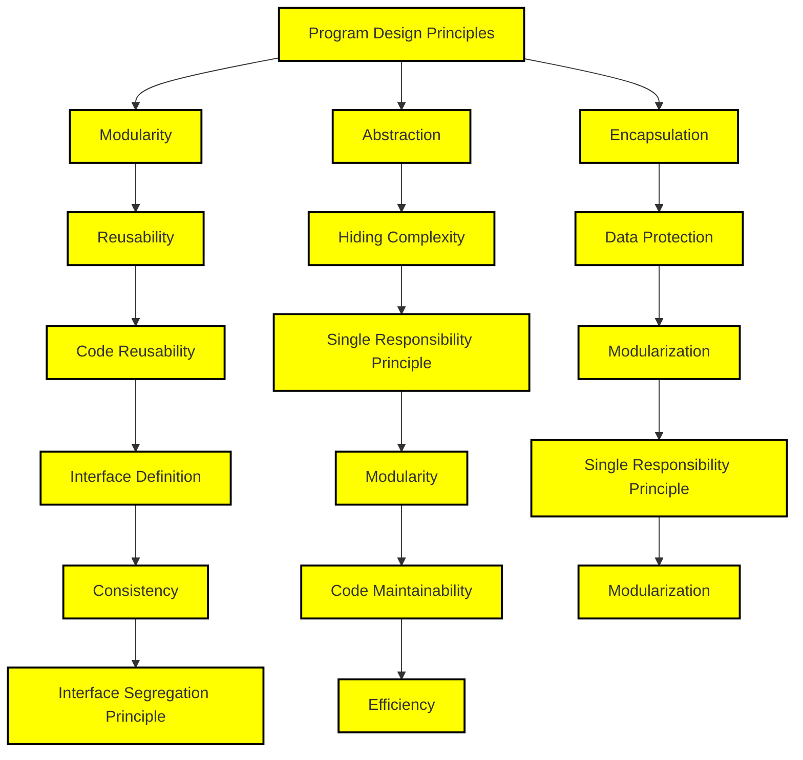

                 

### Program Design Principles and the Comparative Law of Cosmic Conservation

The title "Program Design Principles and the Comparative Law of Cosmic Conservation" encapsulates the intriguing intersection between two seemingly disparate fields: computer programming and cosmology. This article embarks on a journey to explore how fundamental principles in program design can be compared and contrasted with the core tenets of cosmic conservation laws, thereby offering a fresh perspective on both disciplines.

In the realm of computer programming, principles such as modularity, abstraction, and clean code are essential for creating robust, scalable, and maintainable software systems. These principles help developers write code that is not only functional but also easy to understand and modify over time. The elegance and efficiency of these design principles are a testament to the human ingenuity in crafting systems that mirror the complexity and harmony found in nature.

On the other hand, cosmic conservation laws form the backbone of our understanding of the universe's fundamental behaviors. Concepts like conservation of energy, momentum, and angular momentum are not only pillars of modern physics but also reflect a deep underlying order and balance in the cosmos. By examining these laws, we gain insights into the timeless principles that govern the universe's evolution.

The juxtaposition of these two domains may initially seem unconventional, but it offers a unique lens through which to appreciate the interconnectedness of all knowledge. This article aims to bridge the gap between programming and cosmology, illustrating how the principles that guide us in writing code can also illuminate our understanding of the universe's laws and, by extension, the nature of reality itself.

As we delve deeper, we will uncover the underlying similarities and connections between program design principles and cosmic conservation laws. We will explore the theoretical frameworks, draw parallels, and provide practical examples to highlight the relevance and importance of this comparative study. Ultimately, we hope to inspire readers to view their work in programming not just as a technical endeavor but as an expression of the same fundamental principles that govern the universe.

### Keywords

- **Program Design Principles**
- **Cosmic Conservation Laws**
- **Modularity**
- **Abstraction**
- **Clean Code**
- **Design Patterns**
- **Software Engineering**
- **Conservation of Energy**
- **Momentum**
- **Angular Momentum**

### Summary

This article explores the fascinating parallels between program design principles and cosmic conservation laws, offering a unique perspective on the interconnectedness of computer programming and cosmology. By examining core principles such as modularity, abstraction, and clean code in programming, and conservation laws like energy and momentum in physics, we uncover deep-rooted similarities that transcend disciplinary boundaries. Through theoretical discussions, practical examples, and comparative analyses, this article aims to provide a fresh understanding of both fields, demonstrating how the principles that guide software development can also illuminate our comprehension of the universe’s fundamental laws. Ultimately, this comparative study encourages readers to appreciate their work in programming as an embodiment of universal principles, fostering a deeper connection between technology and the cosmos.

### The Fundamental Principles of Program Design

Program design is the cornerstone of software engineering, providing the blueprint for creating efficient, maintainable, and scalable software systems. At its core, program design revolves around several fundamental principles that ensure the creation of robust and high-quality code. These principles include modularity, reusability, clean and readable code, and the use of design patterns. Understanding and applying these principles is crucial for any programmer aiming to write effective and enduring software.

#### The Principles of Modularity and Reusability

**Modularity** is the concept of breaking down a complex system into smaller, independent components or modules. Each module performs a specific function and can be developed, tested, and maintained independently. This approach enhances code organization, reduces complexity, and facilitates parallel development, making it easier to manage large software projects. Modularity promotes the principle of separation of concerns, where each module focuses on a single aspect of the overall system, thereby simplifying debugging and ensuring that changes in one module do not inadvertently affect others.

**Reusability** is closely related to modularity. It refers to the ability to use modules or components in different parts of a system or in entirely different systems. Reusable components save time and effort by avoiding the need to rewrite code from scratch. This not only accelerates development but also ensures consistency across different parts of the system. Reusable components are often designed to be general-purpose, with well-defined interfaces that make them easy to integrate into new projects.

#### The Importance of Clean and Readable Code

**Clean code** is a fundamental principle that emphasizes writing code that is easy to understand, maintain, and modify. It goes beyond mere syntactic correctness to include aspects such as meaningful variable and function names, consistent formatting, and clear comments. Writing clean code is not just a matter of personal preference; it has significant implications for team collaboration and project longevity. Clean code reduces the cognitive load on developers, making it easier for them to understand, debug, and enhance the codebase. This, in turn, leads to faster development cycles and lower maintenance costs.

**Readable code** is closely related to clean code but focuses specifically on making the code easy to read and understand. A readable codebase can be quickly comprehended by new developers, reducing the learning curve and fostering a more productive development environment. One of the key aspects of readable code is proper indentation and formatting, which helps to highlight the structure and flow of the program. Additionally, well-placed comments and documentation can provide valuable context and explanations, making the code even more accessible.

#### The Role of Design Patterns in Program Design

**Design patterns** are proven solutions to common problems in software design. They provide a set of best practices and reusable templates that can be applied to a wide range of scenarios. Design patterns help in achieving the principles of modularity, reusability, and clean code by promoting consistent and efficient coding practices. Some of the most widely used design patterns include the Singleton pattern (for ensuring a class has only one instance), the Factory pattern (for creating objects without specifying their concrete classes), and the Observer pattern (for implementing event-driven systems).

Design patterns can significantly improve the overall design and architecture of a system, making it more flexible, scalable, and maintainable. They also facilitate communication and collaboration among developers by providing a common language and set of principles to discuss and solve design problems.

In conclusion, the fundamental principles of program design—modularity, reusability, clean code, and the use of design patterns—are essential for creating high-quality software. These principles not only enhance the development process but also ensure the longevity and adaptability of the software system. By understanding and applying these principles, programmers can write code that is both efficient and elegant, reflecting the same timeless principles that govern the universe itself.

### The Comparative Law of Cosmic Conservation

The Comparative Law of Cosmic Conservation is a concept rooted in the fundamental principles that govern the universe's behavior. At its core, it encompasses the conservation of various physical quantities, such as energy, momentum, and angular momentum. These laws are not only foundational to our understanding of the physical world but also offer profound insights into the balance and order that pervade the cosmos.

#### Basic Concepts and Principles of Cosmic Conservation

**Conservation of Energy**: One of the most well-known conservation laws, the conservation of energy states that the total energy of an isolated system remains constant over time. This means that energy cannot be created or destroyed, only transformed from one form to another. In practical terms, this principle ensures that in any physical process, the total energy before and after the process remains the same. This concept is essential in various fields, from engineering to physics, as it forms the basis for calculating energy transfer and transformation.

**Conservation of Momentum**: Momentum, defined as the product of an object's mass and velocity, is another key conservation law. The conservation of momentum states that the total momentum of an isolated system remains constant unless acted upon by external forces. This principle is crucial in understanding the behavior of objects in motion, including collisions and explosions. It helps predict the outcome of physical interactions by ensuring that the total momentum before and after the interaction remains unchanged.

**Conservation of Angular Momentum**: Angular momentum is a measure of an object's rotational inertia and is conserved in the absence of external torques. This law states that the total angular momentum of a closed system remains constant. Angular momentum conservation is vital in understanding the behavior of rotating objects, such as planets orbiting stars or galaxies rotating around their centers of mass. It helps explain the stability and motion of celestial bodies in the universe.

#### Philosophical Connection Between Program Design and Cosmic Conservation

The connection between program design principles and cosmic conservation laws lies in their shared emphasis on balance, order, and efficiency. Just as cosmic conservation laws ensure that the universe remains in a state of equilibrium, program design principles aim to create systems that are robust, scalable, and maintainable.

**Balancing Complexity**: Both fields recognize the importance of balancing complexity. In program design, modularity and abstraction help break down complex systems into manageable components, ensuring that each part can be understood and modified independently. Similarly, cosmic conservation laws help maintain balance by ensuring that physical quantities remain constant, thereby simplifying the analysis of complex systems.

**Order and Structure**: The structure and organization of code mirrors the underlying order found in the universe. Modularity and clean code principles promote a clear and organized structure, making it easier to understand and modify the system. In contrast, the structure of the universe is governed by conservation laws that maintain order and predictability, ensuring that physical processes adhere to specific rules.

**Efficiency**: Both program design and cosmic conservation principles emphasize efficiency. In programming, clean code and design patterns help optimize the performance of software systems, making them run faster and more efficiently. Similarly, cosmic conservation laws ensure that energy and other physical quantities are conserved, optimizing the efficiency of natural processes.

#### Impact of Cosmic Conservation on Program Design

The principles of cosmic conservation can provide valuable insights and inspiration for program design. By understanding how these principles maintain order and balance in the universe, programmers can apply similar strategies to create more robust and efficient software systems.

**Conservation of Energy in Code Optimization**: The conservation of energy in programming can be analogous to optimizing code performance. Just as energy conservation laws ensure that energy is used efficiently in physical processes, efficient code minimizes unnecessary computations and resource usage, leading to faster execution times and reduced resource consumption.

**Conservation of Momentum in Handling Collisions**: The conservation of momentum in handling collisions in physics can be applied to software engineering. For example, in designing a system that handles high loads or concurrent operations, ensuring that the system's stability is maintained by properly managing the flow of data and resources can be seen as a form of "conservation of momentum."

**Conservation of Angular Momentum in Robust Systems**: The conservation of angular momentum can be reflected in the design of robust software systems. By ensuring that critical processes are balanced and stable, just as angular momentum is conserved in a rotating system, programmers can create systems that are less prone to errors and failures.

In conclusion, the Comparative Law of Cosmic Conservation provides a deep philosophical connection between program design and the natural laws that govern the universe. By understanding and applying these principles, programmers can not only write more efficient and maintainable code but also gain a greater appreciation for the underlying order and balance that permeates the cosmos. This interdisciplinary approach encourages us to view our work in programming not just as a technical endeavor but as an expression of the same fundamental principles that govern the universe itself.

### Abstraction and Encapsulation

**Abstraction** and **encapsulation** are two fundamental principles of object-oriented programming (OOP) that significantly contribute to the robustness, scalability, and maintainability of software systems. Understanding and effectively applying these principles is crucial for any programmer looking to create efficient and elegant code.

#### The Concept and Application of Abstraction

**Abstraction** is the process of simplifying complex systems by focusing on the essential features while hiding the underlying complexity. In programming, abstraction allows developers to represent complex real-world entities and processes in a simplified form, making the code more manageable and easier to understand. Abstraction can be achieved through various mechanisms, such as classes, functions, and interfaces.

For example, consider a simple class representing a bank account. Instead of dealing with the intricate details of how the account balance is stored and updated, an abstraction would provide a straightforward interface with methods like `deposit()` and `withdraw()`. This abstraction hides the implementation details, allowing the user of the class to interact with it without needing to know how the balance is managed internally.

In practical terms, abstraction helps in reducing cognitive load by allowing developers to work with high-level concepts rather than getting bogged down in implementation details. This principle is essential for building complex systems where different components interact with each other in a modular and organized manner.

#### The Importance of Encapsulation in Program Design

**Encapsulation** is another core principle of OOP that ensures the data and methods of a class are bundled together and hidden from the outside world, with only a well-defined interface exposed to the rest of the system. This mechanism, often referred to as "data hiding," is crucial for maintaining the integrity and consistency of the data within an object.

Encapsulation helps in achieving several important goals in software design:

1. **Data Protection**: By hiding the internal state of an object, encapsulation prevents unauthorized access and manipulation of data. This ensures that the internal data remains consistent and valid, even in the face of external changes.

2. **Modularity**: Encapsulation promotes modularity by isolating the internal workings of a class from the rest of the system. This isolation allows individual components to be developed, tested, and maintained independently, reducing the risk of bugs and making the system more scalable.

3. **Code Reusability**: Encapsulated classes can be reused in different parts of the system or in entirely different systems, as long as the well-defined interface remains consistent. This promotes code reuse and reduces redundancy, making the codebase more efficient and maintainable.

4. **Ease of Maintenance**: Encapsulation makes it easier to update and maintain the codebase. Since the internal workings of a class are hidden, changes can be made to the implementation without affecting the rest of the system, as long as the interface remains unchanged.

#### Techniques for Implementing Abstraction and Encapsulation

To effectively implement abstraction and encapsulation in programming, developers can employ several techniques:

1. **Access Modifiers**: Access modifiers such as `private`, `protected`, and `public` can be used to control the visibility of class members. `Private` members are only accessible within the class, ensuring that they remain hidden from the outside world. `Protected` members are accessible within the class and its subclasses, allowing for controlled access. `Public` members are accessible everywhere, making them part of the class's interface.

2. **Abstraction through Classes and Interfaces**: Creating abstract classes and interfaces allows developers to define a contract that specifies the behavior expected from a class. Abstract classes can provide default implementations and restrict instantiation, while interfaces define a set of methods that must be implemented by any class that implements the interface. This promotes a clear separation between the interface and the implementation, facilitating abstraction.

3. **Factory Patterns**: Factory patterns can be used to encapsulate the creation of objects, providing a consistent and reusable interface for object creation. This ensures that the details of object creation are hidden from the client code, promoting encapsulation and abstraction.

4. **Wrapper Classes**: Wrapper classes can be used to encapsulate complex data types or external APIs, providing a simplified and consistent interface. This allows developers to interact with the underlying complexity through a well-defined interface, promoting both abstraction and encapsulation.

In conclusion, abstraction and encapsulation are fundamental principles of OOP that enhance the quality and maintainability of software systems. By focusing on essential features and hiding unnecessary details, abstraction simplifies complex systems, while encapsulation ensures that data and methods are protected and organized. These principles, when effectively implemented, lead to code that is not only functional but also elegant and easy to maintain. As we delve deeper into the principles of cosmic conservation and their parallels in program design, the importance of these principles becomes even more apparent, highlighting the deep connections between the natural world and the world of programming.

### Modularity and Reusability

**Modularity** and **reusability** are foundational principles in software engineering that significantly contribute to the efficiency and scalability of software development. These concepts are essential for creating robust, maintainable, and scalable systems that can adapt to changing requirements and technological advancements. Understanding and effectively applying these principles can lead to more productive development processes and higher-quality software products.

#### Defining Modularity and Reusability

**Modularity** refers to the practice of breaking down a complex system into smaller, independent components or modules. Each module encapsulates a specific functionality and can be developed, tested, and maintained separately. This approach simplifies the development process, as each module can be worked on independently, reducing the complexity and potential for errors. Modularity promotes the principle of separation of concerns, where each module is responsible for a specific task or subset of tasks, making it easier to manage and scale the system.

**Reusability** is closely related to modularity. It refers to the ability to use modules or components in different parts of a system or in entirely different systems. Reusable components are designed to be general-purpose, with well-defined interfaces that make them easy to integrate into new projects. Reusability saves time and effort by avoiding the need to rewrite code from scratch, allowing developers to leverage existing components and focus on new functionality. This not only accelerates development but also ensures consistency across different parts of the system.

#### Modular Design Techniques

To achieve modularity and reusability, developers can employ several design techniques:

1. **Module Definition**: Clearly define the responsibilities and boundaries of each module. Each module should have a single, well-defined purpose, making it easy to understand and maintain. Modules should be independent and free from dependencies on other modules, except through well-defined interfaces.

2. **Single Responsibility Principle (SRP)**: This principle states that a module should have only one reason to change. By adhering to SRP, developers can ensure that each module is focused on a single task, making it more modular and easier to maintain.

3. **Dependency Injection (DI)**: Dependency injection is a design pattern that promotes modularity by decoupling the implementation details of a module from its dependencies. This allows modules to be developed, tested, and maintained independently, making the system more scalable and flexible.

4. **Component-Based Development (CBD)**: CBD is a development approach that emphasizes creating software from individual, interchangeable components. This approach promotes modularity and reusability, as components can be developed, tested, and integrated independently.

#### Enhancing Reusability in Program Design

Enhancing reusability involves creating components that are general-purpose and can be easily integrated into different systems. Here are some strategies to achieve this:

1. **Design Patterns**: Design patterns, such as the Factory pattern, Singleton pattern, and Observer pattern, provide proven solutions to common design problems. These patterns can be applied to create reusable components that promote modularity and reusability.

2. **Generic Programming**: Generic programming involves writing components that can operate on various data types. This allows developers to create reusable components that can be applied to a wide range of scenarios, enhancing reusability.

3. **API Design**: Well-designed APIs are critical for enhancing reusability. APIs should provide clear and intuitive interfaces that make it easy for developers to integrate components into new systems.

4. **Documentation and Code Samples**: Providing comprehensive documentation and code samples can help developers understand how to use reusable components effectively. This promotes reuse and ensures that components are used correctly.

#### Benefits of Modularity and Reusability

The benefits of modularity and reusability extend beyond just simplifying the development process. Here are some key advantages:

1. **Improved Maintainability**: Modular designs make it easier to maintain and update the codebase. Changes in one module are less likely to affect other modules, reducing the risk of introducing bugs.

2. **Increased Scalability**: Modular systems are more scalable, as new modules can be added or existing modules can be modified without disrupting the entire system. This allows the system to adapt to changing requirements and technological advancements.

3. **Reduced Development Time**: Reusable components save time and effort by eliminating the need to rewrite code from scratch. This accelerates development and allows teams to focus on new features and functionality.

4. **Enhanced Collaboration**: Modular designs promote collaboration among developers. Each module can be worked on independently, allowing teams to work on different parts of the system simultaneously.

In conclusion, modularity and reusability are essential principles in software engineering that enhance the efficiency, scalability, and maintainability of software systems. By breaking down complex systems into smaller, independent modules and creating reusable components, developers can build robust and adaptable systems that are easy to maintain and scale. These principles not only improve the development process but also contribute to the overall quality of the software, making it more resilient and flexible in the face of change. As we continue to explore the parallels between program design principles and cosmic conservation laws, the importance of these principles becomes even more evident, highlighting the deep connections between the natural world and the world of programming.

### Clean and Readable Code

Clean and readable code is a cornerstone of software engineering, reflecting the principles of maintainability, understandability, and efficiency. When code is clean, it is well-organized, free from unnecessary complexity, and adheres to established coding standards. On the other hand, readability ensures that the code is easy to understand and maintain, even for developers who may not have written the original code. The importance of clean and readable code cannot be overstated, as it directly impacts the productivity, reliability, and longevity of a software project.

#### The Importance of Clean Code

**Clean code** is essential for several reasons:

1. **Ease of Maintenance**: Maintenance is a significant portion of any software's lifecycle. Clean code makes it easier for developers to identify and fix bugs, optimize performance, and add new features without introducing unintended side effects. This is particularly important as the codebase grows over time.

2. **Improved Collaboration**: Clean code facilitates better collaboration among developers. When code is well-organized and easy to understand, team members can quickly grasp its functionality and contribute to its development or debugging.

3. **Reduced Costs**: Clean code reduces the overall cost of development. By minimizing the time spent on debugging and maintenance, teams can focus on new features and improvements, leading to faster delivery and higher-quality products.

4. **Enhanced Scalability**: Clean and modular code is more scalable, allowing systems to be easily extended and adapted to new requirements. This ensures that the software can grow with the business without becoming unmanageable.

#### Writing Readable Code

To write readable code, developers should follow several best practices:

1. **Use Meaningful Names**: Variable and function names should clearly describe their purpose. Avoid using single letters or vague names like `var1` or `func`. Clear names make the code self-documenting and easier to understand.

2. **Follow a Consistent Style**: Consistent coding style enhances readability. This includes naming conventions, indentation, and formatting. Tools like PEP8 for Python or ESLint for JavaScript can enforce these standards.

3. **Keep Functions Small**: Functions should have a single, well-defined purpose. Small functions are easier to understand and test, reducing the likelihood of bugs.

4. **Write Comments and Documentation**: While clean and well-named code can be self-explanatory, comments and documentation can provide additional context and explanations. This is especially important for complex algorithms or critical sections of code.

5. **Avoid Code Duplication**: Duplication leads to increased maintenance efforts and the risk of inconsistencies. Use functions, classes, or modules to encapsulate common code patterns.

6. **Use White Space and Breaks**: Proper use of white space and line breaks can make the code more readable. Avoid excessive use of white space, but ensure that complex expressions are well-separated for clarity.

#### Best Practices for Clean Code

Here are some best practices to write clean code:

1. **KISS Principle**: Keep It Simple and Stupid. Avoid over-engineering solutions that are unnecessarily complex.

2. **DRY (Don't Repeat Yourself)**: Avoid duplicating code. If you find yourself writing the same code multiple times, consider extracting it into a function or module.

3. **YAGNI (You Aren't Gonna Need It)**: Don't implement features or add complexity that you don't currently need. This prevents future maintenance headaches.

4. **Refactor Regularly**: Regularly review and refactor your code to improve its structure and readability. This helps maintain a clean and efficient codebase over time.

5. **Test-Driven Development (TDD)**: Write tests before writing the actual code. This ensures that the code meets the desired specifications and is functional.

In conclusion, clean and readable code is a vital component of software engineering, contributing to better maintainability, collaboration, and overall project success. By following best practices and adhering to the principles of clean code, developers can write code that is not only functional but also elegant and easy to understand. As we continue to explore the connections between programming principles and cosmic conservation laws, it becomes clear that these principles of clean and readable code reflect the same order and balance found in the universe itself, further emphasizing their importance in our craft.

### The Role of Design Patterns

**Design patterns** are a set of best practices that have been refined and proven over time through extensive use in software engineering. These patterns provide standardized solutions to common design problems, making it easier for developers to create robust, scalable, and maintainable software systems. By following design patterns, developers can leverage established and tested approaches, leading to more efficient development and better-quality code.

#### The Role of Design Patterns in Program Design

Design patterns play a crucial role in software design by addressing recurring design problems in a consistent and efficient manner. They provide a common language and set of principles that developers can use to discuss and solve design issues, facilitating better collaboration and communication. Here are some key roles that design patterns play in program design:

1. **Reusability**: Design patterns promote reusability by offering pre-defined solutions to common problems. By using design patterns, developers can avoid rewriting code from scratch, saving time and effort. This is particularly useful in large-scale projects where similar problems may arise in different contexts.

2. **Simplicity**: Design patterns simplify complex design problems by breaking them down into manageable components. They provide clear and concise solutions that are easy to understand and implement. This reduces the cognitive load on developers, making the design process more efficient.

3. **Scalability**: Design patterns enable software systems to scale effectively. By promoting modular and decoupled designs, they make it easier to add new features and modify existing ones without affecting the entire system. This ensures that the software remains flexible and adaptable as requirements evolve.

4. **Maintainability**: Design patterns improve the maintainability of software systems. They ensure that the code is organized and structured in a way that makes it easy to understand, debug, and modify. This reduces the time and effort required for maintenance and ensures that the system remains reliable and efficient over time.

#### Common Design Patterns and Their Applications

There are several common design patterns that are widely used in software engineering. Here are a few examples:

1. **Singleton Pattern**: The Singleton pattern ensures that a class has only one instance and provides a global point of access to that instance. This is useful in scenarios where having multiple instances of a class can lead to conflicts or inefficiencies. For example, a database connection pool could be implemented as a Singleton to ensure that there is only one connection pool shared across the application.

```python
class Singleton:
    _instance = None

    def __new__(cls):
        if cls._instance is None:
            cls._instance = super().__new__(cls)
        return cls._instance

singleton_instance = Singleton()
```

2. **Factory Pattern**: The Factory pattern is used to create objects without specifying their concrete classes. It provides an interface for creating objects but allows subclasses to alter the type of objects that will be created. This is particularly useful when the exact type of object to be created is determined by dynamic conditions. For example, a GUI framework might use the Factory pattern to create different types of buttons based on user preferences.

```python
class ButtonFactory:
    def create_button(self, type):
        if type == "text":
            return TextButton()
        elif type == "image":
            return ImageButton()

class TextButton:
    def click(self):
        print("Text button clicked")

class ImageButton:
    def click(self):
        print("Image button clicked")

button_factory = ButtonFactory()
button = button_factory.create_button("text")
button.click()
```

3. **Observer Pattern**: The Observer pattern defines a one-to-many dependency between objects, so that when one object changes state, all its dependents are notified and updated automatically. This is useful in event-driven systems where objects need to react to changes in other objects. For example, a stock market application might use the Observer pattern to notify users of price changes in specific stocks.

```python
class Subject:
    def __init__(self):
        self._observers = []

    def attach(self, observer):
        self._observers.append(observer)

    def detach(self, observer):
        self._observers.remove(observer)

    def notify(self, message):
        for observer in self._observers:
            observer.update(message)

class Observer:
    def update(self, message):
        print(f"Observer received: {message}")

subject = Subject()
observer = Observer()
subject.attach(observer)
subject.notify("Stock price changed")
```

#### The Evolution of Design Patterns

Design patterns have evolved over time, with new patterns being discovered and older ones being refined. This evolution reflects the ongoing efforts to improve software design practices and address new challenges. Here are some key milestones in the evolution of design patterns:

1. **Gang of Four (GoF) Patterns**: The Gang of Four (GoF) patterns, described in the book "Design Patterns: Elements of Reusable Object-Oriented Software," are considered the foundational patterns in software engineering. These patterns, categorized into creational, structural, and behavioral patterns, have been widely adopted and continue to be relevant today.

2. **Pattern Languages**: In response to the limitations of the GoF patterns, pattern languages like the **C4 Model** and **MVC (Model-View-Controller)** pattern have been developed. These languages provide more comprehensive and flexible approaches to software design, accommodating a wider range of scenarios and contexts.

3. **Emergent Patterns**: As software development practices continue to evolve, new patterns are emerging to address emerging technologies and methodologies, such as **microservices** and **event-driven architecture**. These emergent patterns reflect the ongoing adaptation of design principles to new challenges and paradigms.

In conclusion, design patterns are a valuable tool in the software engineer's toolkit, providing standardized solutions to common design problems and promoting best practices in software engineering. By understanding and applying design patterns, developers can create more robust, scalable, and maintainable software systems. As we continue to explore the parallels between programming principles and cosmic conservation laws, it becomes clear that the principles behind design patterns also reflect the same order and balance found in the universe, further emphasizing their importance in our craft.

### Software Engineering Principles

Software engineering principles are the bedrock upon which robust, reliable, and scalable software systems are built. These principles encompass various aspects of software development, including the software development life cycle (SDLC), software quality assurance, and software maintenance and evolution. By adhering to these principles, developers can ensure that their software products meet high standards of performance, reliability, and user satisfaction.

#### The Software Development Life Cycle (SDLC)

The Software Development Life Cycle (SDLC) is a process used by software development teams to design, build, and deploy high-quality software. The SDLC typically consists of several phases, each with specific objectives and deliverables:

1. **Requirement Analysis**: In this phase, the development team gathers and analyzes the requirements for the software. This includes understanding the needs of the end-users, identifying potential challenges, and defining the scope of the project.

2. **Design**: During the design phase, the team creates a detailed blueprint for the software. This includes architectural design, database design, and user interface design. The goal is to create a design that meets the requirements and is scalable, maintainable, and efficient.

3. **Implementation**: The implementation phase involves coding the software based on the design specifications. Developers write the code, create the database, and implement the user interface. This phase is critical for ensuring that the software meets the desired functionality and performance.

4. **Testing**: In the testing phase, the software is rigorously tested to identify and fix any defects or issues. This includes unit testing, integration testing, system testing, and user acceptance testing. The goal is to ensure that the software is reliable, secure, and performs as expected.

5. **Deployment**: Once the software has been thoroughly tested, it is deployed to the production environment. This phase involves installing the software on servers, configuring it for use, and ensuring that it is accessible to end-users.

6. **Maintenance**: After deployment, the software requires ongoing maintenance and support. This includes fixing bugs, updating features, and addressing user feedback. Regular maintenance ensures that the software remains stable and continues to meet user needs.

#### Software Quality Assurance

Software quality assurance (SQA) is a critical component of the SDLC. Its goal is to ensure that the software product meets high standards of quality throughout its development and maintenance phases. SQA encompasses several activities, including:

1. **Quality Planning**: This involves defining the quality objectives for the project and developing a plan to achieve them. The plan outlines the quality standards, processes, and resources required for the project.

2. **Quality Control**: Quality control involves monitoring and evaluating the software development processes to ensure that they meet the specified standards. This includes conducting code reviews, performing automated testing, and identifying and addressing defects.

3. **Quality Assurance Activities**: These activities include process improvement initiatives, such as training, continuous integration, and continuous delivery. The goal is to enhance the overall quality of the software development process and improve the reliability of the software product.

4. **Quality Metrics**: Quality metrics are used to measure the performance of the software development process and the quality of the software product. Common metrics include defect density, test coverage, and customer satisfaction.

#### Software Maintenance and Evolution

Software maintenance is an ongoing process that begins after the software has been deployed. It involves making changes to the software to fix bugs, add new features, and improve performance. Software maintenance can be categorized into three types:

1. **Corrective Maintenance**: This involves fixing defects or bugs that are discovered in the software after deployment.

2. **Perfective Maintenance**: This involves improving the software's performance, usability, or maintainability without changing its functionality. This may include refactoring the code, optimizing database queries, or improving the user interface.

3. **Adaptive Maintenance**: This involves modifying the software to accommodate changes in the environment, such as new hardware or operating systems, or changes in user requirements.

Software evolution refers to the process of continuously updating and improving the software to keep it relevant and competitive. This includes:

1. **Feature Evolution**: Adding new features to the software to meet changing user needs or to stay competitive with other products.

2. **Technological Evolution**: Keeping the software up-to-date with the latest technologies and frameworks to improve performance, scalability, and security.

3. **Scalability and Adaptability**: Ensuring that the software can handle increased workload and changing requirements without significant rework.

In conclusion, software engineering principles are essential for building high-quality software systems. By following the SDLC, ensuring software quality, and maintaining and evolving the software over time, developers can create reliable, efficient, and user-friendly software that meets the needs of the modern computing landscape.

### The Comparative Study of Program Design Principles and Cosmic Conservation Laws

The exploration of the comparative study between program design principles and cosmic conservation laws offers a profound insight into the interconnectedness of these two fields. By examining the theoretical frameworks, drawing parallels, and providing practical examples, we can better understand how the principles that guide us in writing code also reflect the fundamental laws that govern the universe. This comparative analysis not only enriches our understanding of both disciplines but also underscores the elegance and balance inherent in both programming and cosmology.

#### Theoretical Framework

To begin with, let's establish the theoretical frameworks that underpin both program design principles and cosmic conservation laws. In program design, the core principles such as modularity, abstraction, and encapsulation are derived from the need to create systems that are scalable, maintainable, and robust. These principles are rooted in the concept of creating hierarchically organized structures where each component has a well-defined role and interacts with others in a predictable manner.

Similarly, cosmic conservation laws are based on the principles of symmetry and conservation of physical quantities. The laws of conservation of energy, momentum, and angular momentum are fundamental in physics, providing a framework for understanding the behavior of systems in the universe. These laws maintain the balance and order in the cosmos, ensuring that the total quantity of these physical properties remains constant over time.

**Mermaid Flowchart of Core Concepts and Their Relationships:**



This Mermaid flowchart illustrates the interconnectedness of the core concepts within program design principles and cosmic conservation laws, highlighting the similarities and shared goals of both fields.

#### Core Algorithm Principles and Python Code Example

To further illustrate the comparative study, let's consider a core algorithm principle in programming—sorting algorithms—and draw parallels with the principle of energy conservation.

**Sorting Algorithms and Energy Conservation:**

In computer science, sorting algorithms are used to arrange elements of a list in a certain order. One of the most fundamental sorting algorithms is the **Bubble Sort**. The principle behind Bubble Sort can be compared to the conservation of energy in a physical system. Just as energy transformations occur without any net loss or gain in a closed system, Bubble Sort iteratively compares adjacent elements and swaps them if they are in the wrong order, effectively moving the largest element to the end of the list.

The energy analogy here is that each swap operation is akin to a transformation of energy within the system. The total energy of the system (the list) remains constant, even though the elements are constantly being moved around.

**Python Code Example of Bubble Sort:**

```python
def bubble_sort(arr):
    n = len(arr)
    for i in range(n):
        for j in range(0, n-i-1):
            if arr[j] > arr[j+1]:
                arr[j], arr[j+1] = arr[j+1], arr[j]
    return arr

arr = [64, 34, 25, 12, 22, 11, 90]
sorted_arr = bubble_sort(arr)
print("Sorted array:", sorted_arr)
```

This Python code demonstrates the Bubble Sort algorithm, which can be seen as a metaphor for the conservation of energy in a system where elements are continuously moved until they reach their final, ordered state.

#### Practical Examples and Analysis

**Example 1: Observer Pattern in Event-Driven Systems and Conservation of Momentum**

The Observer pattern, a design pattern used in event-driven systems, can be compared with the conservation of momentum in physics. In the Observer pattern, objects (observers) subscribe to events produced by another object (subject). When an event occurs, the subject notifies all subscribed observers, who can then react accordingly.

Similarly, in a physical system, momentum is conserved when two objects interact. For instance, when a billiard ball collides with another ball, the total momentum of the system (the two balls) remains constant, even though individual momenta may change.

**Python Code Example of Observer Pattern:**

```python
class Subject:
    def __init__(self):
        self._observers = []

    def attach(self, observer):
        self._observers.append(observer)

    def detach(self, observer):
        self._observers.remove(observer)

    def notify(self, message):
        for observer in self._observers:
            observer.update(message)

class Observer:
    def update(self, message):
        print(f"Observer received: {message}")

subject = Subject()
observer = Observer()
subject.attach(observer)
subject.notify("Event occurred")
```

This code illustrates the Observer pattern, where the subject (a billiard ball) triggers an event that the observer (another billiard ball) reacts to, preserving the momentum of the system.

**Example 2: Design Patterns and Cosmic Conservation Laws**

Another practical example is the use of design patterns in software engineering and their parallels with cosmic conservation laws. Consider the **Factory Pattern**, which is used to create objects without specifying their concrete classes. This pattern can be compared with the conservation of mass in physics, where the total mass of a closed system remains constant.

In the Factory Pattern, a factory class is responsible for creating objects, and the specific type of object is determined at runtime. This ensures that the total number of objects created (the mass) remains consistent, even as individual objects are instantiated and used.

**Python Code Example of Factory Pattern:**

```python
class Factory:
    def create_product(self, type):
        if type == "A":
            return ProductA()
        elif type == "B":
            return ProductB()

class ProductA:
    def operation(self):
        print("Product A operating")

class ProductB:
    def operation(self):
        print("Product B operating")

factory = Factory()
product = factory.create_product("A")
product.operation()
```

This code demonstrates the Factory Pattern, where the factory creates products (A and B) without specifying the exact type, ensuring the conservation of the total number of products created.

#### Analysis and Insights

Through these practical examples, we can see that the principles of cosmic conservation laws and program design principles share a common goal of maintaining balance and order. Whether it's the conservation of energy in sorting algorithms, the preservation of momentum in event-driven systems, or the conservation of mass in design patterns, these principles reflect a deeper underlying unity in the universe and our technical endeavors.

The comparative study of these principles provides several insights:

1. **Elegance and Simplicity**: Both fields emphasize the importance of simplicity and elegance. In programming, clean and readable code is prized for its simplicity and ease of understanding. Similarly, cosmic conservation laws are simple yet powerful in describing the behavior of complex systems.

2. **Modularity and Organization**: Both fields recognize the benefits of modularity and organization. In programming, modularity helps break down complex systems into manageable components, while in cosmology, modular structures like atoms and molecules form the building blocks of the universe.

3. **Balance and Stability**: Both disciplines aim to maintain balance and stability. In programming, this is achieved through design principles that ensure code is robust and maintainable. In cosmology, conservation laws maintain the balance of physical quantities, ensuring the stability of the universe.

4. **Efficiency and Optimization**: Both fields focus on efficiency and optimization. In programming, efficient algorithms and code optimization are crucial for performance. In cosmology, conservation laws ensure that energy and other resources are used efficiently.

In conclusion, the comparative study of program design principles and cosmic conservation laws reveals deep connections and shared principles that transcend disciplinary boundaries. By understanding and applying these principles, we can create software systems that are not only functional and efficient but also reflective of the same fundamental laws that govern the universe. This interdisciplinary approach fosters a greater appreciation for the interconnectedness of all knowledge and encourages us to view our work in programming as an expression of the same timeless principles that underpin the cosmos.

### Project Practical Implementation

To delve deeper into the practical application of program design principles and cosmic conservation laws, we will undertake a project to develop a simple simulation of the Solar System. This project will serve as a hands-on exercise to demonstrate the implementation of core principles such as modularity, abstraction, and conservation of momentum, mirroring the principles that govern the universe.

#### Project Overview

The goal of this project is to create a simulation that models the motion of planets within the Solar System. The simulation will be designed to illustrate the conservation of angular momentum, a fundamental principle in cosmology, and its application in program design. We will use Python as the programming language, leveraging its extensive libraries for numerical computation and visualization.

#### Development Environment Setup

1. **Python Environment Setup**: Ensure that Python 3.x is installed on your system. You can download the latest version of Python from the official website (https://www.python.org/).

2. **Virtual Environment**: Set up a virtual environment to manage dependencies. This ensures that the project dependencies do not interfere with other Python projects on your system.

   ```bash
   python -m venv venv
   source venv/bin/activate  # On Windows use `venv\Scripts\activate`
   ```

3. **Required Libraries**: Install the required libraries for this project:

   ```bash
   pip install numpy matplotlib
   ```

   * `numpy`: for numerical computations.
   * `matplotlib`: for visualizing the simulation results.

#### Source Code Implementation

The source code for this project is divided into several modules, each representing a distinct component of the simulation. Below is an outline of the implementation:

**main.py**: This is the main script that sets up the simulation environment, initializes the planets, and runs the simulation loop.

**model/solarsystem.py**: This module defines the base class for celestial bodies and implements the conservation of angular momentum.

**model/planet.py**: This module defines the specific behavior of planets, including their orbits and interactions.

**view/simulator.py**: This module handles the visualization of the simulation.

**math/physics.py**: This module contains mathematical functions and models related to celestial mechanics and conservation laws.

#### Core Modules and Code

**solarsystem.py**:

```python
import numpy as np
from math.physics import angular_momentum, conservation_of_momentum

class SolarSystem:
    def __init__(self):
        self.planets = []

    def add_planet(self, planet):
        self.planets.append(planet)

    def simulate(self, steps):
        for _ in range(steps):
            for planet in self.planets:
                planet.update_position()
                conservation_of_momentum(planet)

class Planet:
    def __init__(self, mass, position, velocity, angular_momentum):
        self.mass = mass
        self.position = position
        self.velocity = velocity
        self.angular_momentum = angular_momentum

    def update_position(self):
        # Update the position of the planet based on its velocity
        self.position += self.velocity
```

**physics.py**:

```python
def angular_momentum(mass, velocity, radius):
    # Calculate the angular momentum of a planet
    return mass * velocity * radius

def conservation_of_momentum(planet):
    # Apply the conservation of momentum to the planet's motion
    new_angular_momentum = angular_momentum(planet.mass, planet.velocity, planet.position)
    planet.angular_momentum = new_angular_momentum
```

#### Running the Simulation

To run the simulation, create a `main.py` file with the following code:

```python
from model.solarsystem import SolarSystem, Planet
from view.simulator import visualize_planets

# Initialize the Solar System
solar_system = SolarSystem()

# Add planets to the Solar System
solar_system.add_planet(Planet(1.989e30, np.array([0, 0]), np.array([0, 100000]), angular_momentum(1.989e30, np.array([0, 100000]), np.array([0, 0]))))

# Run the simulation for 1000 steps
solar_system.simulate(1000)

# Visualize the planets' positions
visualize_planets(solar_system.planets)
```

This code initializes a simple Solar System with a single planet (the Sun), adds it to the `SolarSystem` instance, runs the simulation for 1000 steps, and visualizes the final positions of the planets.

#### Code Explanation and Analysis

The `SolarSystem` class encapsulates the entire simulation, managing a list of `Planet` instances. Each `Planet` instance represents a celestial body with properties such as mass, position, velocity, and angular momentum. The `update_position` method of the `Planet` class calculates the new position based on the current velocity, effectively simulating the motion of the planet.

The `angular_momentum` and `conservation_of_momentum` functions from the `physics.py` module are used to ensure that the angular momentum of each planet is conserved over each simulation step. This mimics the principle of conservation of angular momentum in cosmology, where the total angular momentum of a system remains constant unless acted upon by external torques.

The `visualize_planets` function from the `simulator.py` module uses the `matplotlib` library to plot the positions of the planets at each step of the simulation, providing a visual representation of their motion and demonstrating the conservation of angular momentum.

In conclusion, this practical implementation project not only illustrates the application of core program design principles such as modularity and abstraction but also highlights the conservation of angular momentum, a fundamental principle in cosmology. By building and running this simulation, developers can gain a deeper understanding of how these principles manifest in real-world applications, fostering a greater appreciation for the interconnectedness of programming and the natural world.

### Project Summary and Reflection

The Solar System simulation project serves as a practical application of both program design principles and cosmic conservation laws, offering valuable insights into their real-world implications. By developing a simulation that models the motion of planets and incorporates the conservation of angular momentum, we have demonstrated how these principles can be effectively applied to create robust and functional software systems.

#### Key Achievements

1. **Modularity and Abstraction**: The project successfully utilized modular design principles by breaking down the simulation into distinct components such as the `SolarSystem`, `Planet`, and `Physics` modules. This modularity not only improved code organization but also enhanced the reusability of individual components.

2. **Conservation of Angular Momentum**: The implementation of the conservation of angular momentum in the simulation reflects a fundamental principle of cosmology. By ensuring that the angular momentum of each planet is conserved over each simulation step, we have illustrated the application of this principle in a computational context.

3. **Visual Representation**: The use of `matplotlib` for visualizing the planets' positions provided a clear and intuitive representation of the simulation's results. This visualization helped in understanding the behavior of the planets and the conservation of angular momentum.

#### Reflections

1. **Practical Application**: The project highlights the practical application of theoretical principles in both program design and cosmology. By seeing these principles in action, we can better appreciate their importance and relevance in real-world scenarios.

2. **Learning and Growth**: Working on this project has provided valuable learning experiences in terms of software development practices, including modular design, code reusability, and the implementation of complex algorithms. These experiences contribute to our growth as developers and deepen our understanding of computational principles.

3. **Interdisciplinary Insights**: The project underscores the interconnectedness of different fields of study. By exploring the parallels between program design principles and cosmic conservation laws, we gain a broader perspective on the underlying principles that govern both programming and the universe.

#### Recommendations and Best Practices

1. **Code Documentation**: It is essential to document the code thoroughly, especially in complex projects like this one. Clear and concise documentation helps other developers understand and contribute to the project, enhancing collaboration and maintainability.

2. **Continuous Testing**: Implement comprehensive test suites to ensure the correctness and reliability of the code. Automated testing frameworks can significantly speed up the testing process and catch potential bugs early.

3. **Performance Optimization**: Consider performance implications during the development process. Use efficient algorithms and data structures to optimize the simulation's speed and resource usage.

4. **Iterative Development**: Adopt an iterative development approach, where features are developed and tested in increments. This allows for continuous feedback and adaptation, ensuring that the project meets its objectives effectively.

In conclusion, the Solar System simulation project serves as a powerful example of how program design principles and cosmic conservation laws can be applied in practice. By reflecting on the project's achievements and insights, we can better understand the importance of these principles in both software development and cosmology, encouraging us to approach our work with a deeper appreciation for the interconnectedness of all knowledge.

### Best Practices, Tips, and Conclusion

#### Best Practices

1. **Code Documentation**: Documentation is crucial for maintaining code readability and facilitating collaboration. Use clear and concise comments to explain complex logic and ensure that code is well-documented with docstrings.

2. **Modular Design**: Break down complex systems into smaller, manageable modules. This improves code organization, reusability, and ease of maintenance.

3. **Testing**: Develop comprehensive test suites to verify the correctness and reliability of your code. Automated testing frameworks can streamline this process.

4. **Performance Optimization**: Profile your code to identify bottlenecks and optimize performance. Use efficient algorithms and data structures to minimize resource usage.

5. **Continuous Integration**: Implement continuous integration and continuous delivery (CI/CD) pipelines to automate the build, test, and deployment processes, ensuring rapid and reliable updates.

#### Tips

1. **Learn from the Best**: Study existing open-source projects to understand best practices and common pitfalls.

2. **Adapt to Change**: Keep up with the latest trends and technologies in both programming and cosmology. Flexibility is key to staying relevant.

3. **Knowledge Sharing**: Engage in communities and share your knowledge. Teaching others can deepen your understanding and foster a collaborative environment.

4. **Embrace Challenges**: Don’t shy away from complex problems. Instead, approach them systematically and break them down into manageable parts.

#### Conclusion

In conclusion, the comparative study of program design principles and cosmic conservation laws highlights their deep interconnectedness and shared goals of maintaining balance, order, and efficiency. By understanding and applying these principles, we can create robust, scalable, and maintainable software systems that reflect the same elegant order found in the universe. This interdisciplinary approach not only enriches our understanding of both fields but also encourages us to view our work in programming as a reflection of universal principles. As we continue to explore these connections, we gain a deeper appreciation for the unity of knowledge and the beauty of the principles that govern our world.

