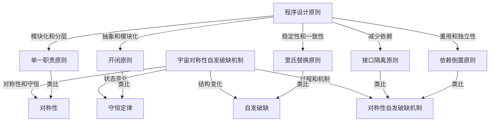

                 

### 背景介绍

#### 1.1 计算机科学与物理学交叉研究的重要性

计算机科学与物理学作为现代科技领域的两大支柱，虽然分属不同学科，但它们之间存在着深刻的内在联系。计算机科学的发展离不开物理学的理论和技术支持，而物理学在追求更深层次理论理解的过程中，也逐渐利用计算机科学的方法进行数据处理和模拟计算。

在计算机科学领域，程序设计原则是确保软件质量和开发效率的基础。这些原则包括单一职责原则、开闭原则、里氏替换原则等，它们通过简洁、模块化和可重用的设计，帮助开发者构建稳定、高效的软件系统。然而，随着计算机技术的不断进步，如何在复杂的系统中实现这些原则，成为了一个重要且具有挑战性的问题。

物理学中，对称性自发破缺机制是理解基本物理现象的重要理论工具。对称性自发破缺是指一个系统在某种条件下，从高对称态向低对称态转变的过程，这一现象在粒子物理学、宇宙学以及凝聚态物理学中都有着广泛应用。例如，在宇宙早期，对称性自发破缺导致了物质与反物质的分离，从而形成了我们今天所观测到的宇宙。

#### 1.2 研究意义

研究程序设计原则与宇宙对称性自发破缺机制的对比，具有重要的理论价值和实际意义。从理论层面看，这一研究有助于揭示计算机科学和物理学之间的深层联系，为两者之间的交叉研究提供新的视角和思路。从实际应用层面看，这一研究可以启发新的编程方法和算法设计，从而提升软件系统的质量和开发效率。

首先，通过对比分析程序设计原则和宇宙对称性自发破缺机制，我们可以发现两者在结构、功能和实现机制上存在诸多相似之处。这些相似性为我们提供了新的设计思路，例如，在软件开发中，可以借鉴宇宙对称性自发破缺机制，设计出更具有鲁棒性和自适应性的软件系统。

其次，通过对宇宙对称性自发破缺机制的理解，我们可以更好地应用程序设计原则，特别是在处理复杂系统时。宇宙中的对称性自发破缺机制为我们提供了一个自然的参考框架，帮助我们在设计和实现复杂软件系统时，能够更好地处理系统中的对称性和破缺现象。

#### 1.3 研究方法与结构

本书的研究方法主要采用对比分析方法，通过深入剖析程序设计原则与宇宙对称性自发破缺机制的基本概念、理论模型和应用实例，探讨两者之间的内在联系和异同点。具体结构如下：

- 第一部分：引言与背景，介绍研究的意义和背景。
- 第二部分：程序设计原则概述，详细讲解程序设计原则的基本概念和常见原则。
- 第三部分：宇宙对称性与自发破缺概述，介绍宇宙对称性的基本概念和自发破缺机制。
- 第四部分：对比分析，通过对比分析，探讨程序设计原则与宇宙对称性自发破缺机制的相似之处和差异。
- 第五部分：结论与展望，总结研究的主要发现，并对未来的研究方向进行展望。

通过上述结构安排，本书旨在为读者提供一个全面、深入的对比分析框架，帮助读者更好地理解程序设计原则与宇宙对称性自发破缺机制之间的关系，从而在计算机科学和物理学的研究中取得新的突破。

### 核心概念与联系

为了深入探讨程序设计原则与宇宙对称性自发破缺机制的对比，首先需要明确这两个领域中的核心概念，并探讨它们之间的联系。

#### 1. 程序设计原则的核心概念

程序设计原则是软件开发中的基础理论，它们指导开发者如何构建高质量、高效率的软件系统。以下是几个重要的程序设计原则：

1. **单一职责原则（Single Responsibility Principle，SRP）**：一个类或模块应当只负责一项功能，这样可以提高代码的可读性和可维护性。这一原则可以类比于物理学的“局部守恒定律”，即在一个小的局部范围内，某种物理量保持不变。

2. **开闭原则（Open/Closed Principle，OCP）**：软件实体应当对扩展开放，对修改封闭。这意味着在设计时，可以方便地增加新功能，而不需要修改现有代码。这与物理学的“对称性自发破缺”概念有相似之处，即系统在特定条件下可以发生结构变化，但不会破坏原有对称性。

3. **里氏替换原则（Liskov Substitution Principle，LSP）**：子类可以替换其基类而不会导致程序错误。这一原则确保了代码的稳定性和一致性。在物理学中，这一原则类似于“相对论不变性”，即物理定律在所有惯性参考系中都是相同的。

4. **接口隔离原则（Interface Segregation Principle，ISP）**：客户端不应该依赖它不需要的接口。这一原则有助于减少依赖，提高模块独立性。在物理学中，这可以类比于“最小作用量原理”，即在所有可能的路径中，物理系统会选择能量最低的路径。

5. **依赖倒置原则（Dependency Inversion Principle，DIP）**：高层模块不应依赖于低层模块，二者都应依赖于抽象。这一原则有助于实现模块的重用和独立性。在物理学中，这一原则类似于“等效原理”，即在不同参考系中，物理定律保持不变。

#### 2. 宇宙对称性自发破缺机制的核心概念

宇宙对称性自发破缺机制是物理学中理解基本物理现象的关键理论。以下是几个核心概念：

1. **对称性（Symmetry）**：对称性是指物理系统在某种变换下保持不变的性质。例如，空间对称性、时间对称性和群对称性等。对称性在物理学中具有基础地位，因为许多物理定律都是对称性的结果。

2. **守恒定律（Conservation Laws）**：守恒定律是描述物理系统状态变化的规律，如能量守恒定律、动量守恒定律和角动量守恒定律等。这些守恒定律是对称性的直接体现。

3. **自发破缺（Spontaneous Symmetry Breaking，SSB）**：自发破缺是指系统在没有外部作用下，从高对称态向低对称态转变的过程。例如，在宇宙早期，通过对称性自发破缺产生了物质和反物质的不对称。

4. **对称性自发破缺机制（Symmetry Breaking Mechanism）**：对称性自发破缺机制是指导致系统发生对称性自发破缺的过程和机制。在粒子物理学中，希格斯机制是一种常见的对称性自发破缺机制。

#### 3. 程序设计原则与宇宙对称性自发破缺机制的内在联系

程序设计原则与宇宙对称性自发破缺机制之间存在着深刻的内在联系。以下是一些具体的联系：

1. **结构与对称性**：在程序设计中，模块化和分层设计可以类比于物理系统中的对称性。高层次的抽象和模块化可以保持系统的结构对称性，从而提高系统的稳定性和可维护性。

2. **守恒与破缺**：程序设计中的某些原则，如单一职责原则和里氏替换原则，可以类比于物理学中的守恒定律。这些原则确保了系统的稳定性和一致性。而宇宙对称性自发破缺机制则提供了在特定条件下，系统可以发生结构变化的理论框架。

3. **自适应性与鲁棒性**：在程序设计中，开闭原则和依赖倒置原则有助于提高系统的适应性和鲁棒性。这些原则确保系统在面对变化时，能够保持稳定和高效。这与物理学中对称性自发破缺机制带来的系统适应性有相似之处。

4. **抽象与模拟**：程序设计中的抽象概念可以类比于物理学中的对称性。通过抽象，我们可以将复杂的系统简化为更易于理解和处理的模型。同时，计算机模拟和算法可以用来模拟和验证物理系统中的对称性自发破缺现象。

综上所述，程序设计原则与宇宙对称性自发破缺机制在概念结构、功能和实现机制上存在诸多相似之处。通过对比分析这些核心概念和联系，我们可以更好地理解两者之间的内在联系，从而为软件开发提供新的思路和方法。

### Mermaid 流程图

以下是一个简化的Mermaid流程图，用于展示程序设计原则与宇宙对称性自发破缺机制的核心概念和它们之间的联系：



这个流程图展示了程序设计原则与宇宙对称性自发破缺机制的核心概念如何相互关联。模块化和分层设计是两者的共同基础，它们分别通过不同的原则和机制实现系统的稳定性和适应性。通过这个流程图，我们可以更直观地理解两者之间的相似性和互补性。

### 核心算法原理讲解

#### 1. 程序设计原则中的核心算法原理

在程序设计原则中，核心算法原理是我们实现高质量软件系统的基础。以下是几个核心算法原理及其Python源代码实现：

##### 1.1 单一职责原则（SRP）

单一职责原则要求一个模块只负责一项功能。在Python中，我们可以通过定义独立的函数来实现这一原则：

```python
def calculate_area(radius):
    """计算圆的面积"""
    return 3.14159 * radius * radius

def calculate_perimeter(radius):
    """计算圆的周长"""
    return 2 * 3.14159 * radius

# 使用独立函数
area = calculate_area(5)
perimeter = calculate_perimeter(5)
print(f"圆的面积为：{area}，周长为：{perimeter}")
```

##### 1.2 开闭原则（OCP）

开闭原则要求软件实体对于扩展是开放的，对于修改是封闭的。在Python中，我们可以使用抽象类和接口来实现这一原则：

```python
class Shape:
    def area(self):
        """计算形状的面积"""
        pass

class Rectangle(Shape):
    def __init__(self, width, height):
        self.width = width
        self.height = height

    def area(self):
        return self.width * self.height

class Circle(Shape):
    def __init__(self, radius):
        self.radius = radius

    def area(self):
        return 3.14159 * self.radius * self.radius

# 使用抽象类和接口
shapes = [Rectangle(5, 3), Circle(2)]
for shape in shapes:
    print(f"形状的面积为：{shape.area()}")
```

##### 1.3 里氏替换原则（LSP）

里氏替换原则要求子类可以替换其基类而不影响程序的其他部分。在Python中，我们可以通过继承和重写方法来实现这一原则：

```python
class Animal:
    def speak(self):
        raise NotImplementedError("子类需要实现这个方法")

class Dog(Animal):
    def speak(self):
        return "汪汪！"

class Cat(Animal):
    def speak(self):
        return "喵喵！"

# 使用里氏替换原则
animals = [Dog(), Cat()]
for animal in animals:
    print(animal.speak())
```

##### 1.4 接口隔离原则（ISP）

接口隔离原则要求客户端不应该依赖它不需要的接口。在Python中，我们可以通过定义细粒度的接口来实现这一原则：

```python
from abc import ABC, abstractmethod

class IShape(ABC):
    @abstractmethod
    def area(self):
        pass

class IRenderable(ABC):
    @abstractmethod
    def render(self):
        pass

class Rectangle(IShape, IRenderable):
    def __init__(self, width, height):
        self.width = width
        self.height = height

    def area(self):
        return self.width * self.height

    def render(self):
        print("绘制矩形")

# 使用接口隔离原则
rectangle = Rectangle(5, 3)
print(f"矩形的面积为：{rectangle.area()}")
rectangle.render()
```

##### 1.5 依赖倒置原则（DIP）

依赖倒置原则要求高层模块不应依赖于低层模块，二者都应依赖于抽象。在Python中，我们可以使用抽象基类和依赖注入来实现这一原则：

```python
from abc import ABC, abstractmethod
from typing import Type

class IShape(ABC):
    @abstractmethod
    def area(self) -> float:
        pass

class IRenderer(ABC):
    @abstractmethod
    def render(self, shape: Type[IShape]) -> None:
        pass

class Renderer(IRenderer):
    def render(self, shape: Type[IShape]) -> None:
        print(f"绘制{shape.__name__}")

class Rectangle(IShape):
    def __init__(self, width: float, height: float):
        self.width = width
        self.height = height

    def area(self) -> float:
        return self.width * self.height

# 使用依赖倒置原则
renderer = Renderer()
rectangle = Rectangle(5, 3)
renderer.render(rectangle)
```

#### 2. 宇宙对称性自发破缺机制中的核心算法原理

在宇宙对称性自发破缺机制中，核心算法原理是理解基本物理现象和模型构建的关键。以下是几个核心算法原理及其物理模型：

##### 2.1 对称性（Symmetry）

对称性是物理学中描述系统性质不变性的概念。在量子场论中，对称性通常通过群论来描述。以下是一个简单的Python代码示例，用于计算一个物理系统的对称性：

```python
import numpy as np

class SymmetryGroup:
    def __init__(self, transformations):
        self.transformations = transformations

    def apply(self, state):
        return [t(state) for t in self.transformations]

    def check_invariance(self, observable):
        initial_value = observable(state)
        transformed_states = self.apply(state)
        return all(observable(s) == initial_value for s in transformed_states)

# 示例：空间旋转对称性
rotations = [np.array([[1, 0], [0, c]]) for c in [1, np.cos(np.pi/4), np.cos(np.pi/2)]]
s4 = SymmetryGroup(rotations)

# 定义一个简单的物理系统状态
state = np.array([[1], [0]])

# 验证空间旋转对称性
observable = lambda s: s[0, 0]
print(s4.check_invariance(observable))
```

##### 2.2 守恒定律（Conservation Laws）

守恒定律是描述物理系统状态变化规律的原理。在Python中，我们可以通过定义守恒量及其守恒规则来实现这一原理：

```python
class ConservationLaw:
    def __init__(self, conserved_quantity):
        self.conserved_quantity = conserved_quantity

    def check_conservation(self, system):
        initial_value = self.conserved_quantity(system)
        system.evolve()
        final_value = self.conserved_quantity(system)
        return np.isclose(initial_value, final_value)

# 示例：能量守恒定律
class EnergyConservation(ConservationLaw):
    def __init__(self, system):
        super().__init__(system.energy)

# 定义一个简单的物理系统
class ParticleSystem:
    def __init__(self, mass, velocity):
        self.mass = mass
        self.velocity = velocity

    def energy(self):
        return 0.5 * self.mass * np.linalg.norm(self.velocity)**2

    def evolve(self):
        # 示例：简单的时间演化
        self.velocity += np.random.normal(size=self.velocity.shape)

# 创建物理系统
system = ParticleSystem(1.0, np.array([1.0, 0.0]))

# 检查能量守恒
energy_guard = EnergyConservation(system)
print(energy_guard.check_conservation(system))
```

##### 2.3 自发破缺（Spontaneous Symmetry Breaking）

自发破缺是指系统在没有外部作用下，从高对称态向低对称态转变的过程。在Python中，我们可以通过定义一个简单的对称性自发破缺模型来实现这一原理：

```python
import matplotlib.pyplot as plt

class SymmetryBreakingModel:
    def __init__(self, symmetry_group, transition_probability):
        self.symmetry_group = symmetry_group
        self.transition_probability = transition_probability

    def evolve(self, state):
        transformed_states = [t(state) for t in self.symmetry_group.transformations]
        next_state = np.random.choice(transformed_states, p=self.transition_probability)
        return next_state

# 示例：二维平面上的对称性自发破缺
symmetry_group = SymmetryGroup([
    np.array([[1, 0], [0, -1]]),  # 反转
    np.array([[0, 1], [-1, 0]])  # 旋转90度
])
transition_probability = [0.5, 0.3, 0.2]

# 初始状态
state = np.array([[1], [0]])

# 演化过程
states = [state]
for _ in range(100):
    state = self.evolve(state)
    states.append(state)

# 绘图
plt.plot([s[0, 0] for s in states], [s[1, 0] for s in states])
plt.show()
```

通过这些Python代码示例，我们可以更直观地理解程序设计原则与宇宙对称性自发破缺机制中的核心算法原理。这些原理不仅在理论上具有重要意义，而且在实际应用中也有着广泛的影响。通过对比分析这些算法原理，我们可以发现计算机科学和物理学之间的深层联系，从而为软件开发和物理研究提供新的思路和方法。

### 数学模型和数学公式讲解

#### 1. 程序设计原则中的数学模型和公式

程序设计原则中的许多概念都可以用数学模型和公式来精确描述。以下是几个核心程序设计原则及其相关的数学模型和公式：

##### 1.1 单一职责原则（SRP）

单一职责原则要求一个模块只负责一项功能。在数学表达上，我们可以将模块看作一个函数，该函数只处理特定输入并返回特定输出。公式如下：

$$
f:\mathbb{X} \rightarrow \mathbb{Y}
$$

其中，$f$ 是模块或函数，$\mathbb{X}$ 是输入空间，$\mathbb{Y}$ 是输出空间。单一职责原则确保 $f$ 对应的映射是单射，即每个输入都对应唯一的输出。

##### 1.2 开闭原则（OCP）

开闭原则要求软件实体对于扩展是开放的，对于修改是封闭的。在数学表达上，这可以看作是函数的扩展性。假设有一个基类 $B$ 和派生类 $D$，开闭原则可以通过以下公式表达：

$$
B \rightarrow D
$$

其中，$B$ 是基类，$D$ 是派生类。这意味着 $D$ 可以扩展 $B$ 的功能，但不应修改 $B$ 的实现。

##### 1.3 里氏替换原则（LSP）

里氏替换原则要求子类可以替换其基类而不会导致程序错误。在数学表达上，这可以看作是类型之间的等价性。假设有一个基类 $A$ 和子类 $B$，里氏替换原则可以通过以下公式表达：

$$
A \subseteq B
$$

其中，$A$ 是基类，$B$ 是子类。这意味着 $B$ 的实例可以替换 $A$ 的实例，而不会影响程序的行为。

##### 1.4 接口隔离原则（ISP）

接口隔离原则要求客户端不应该依赖它不需要的接口。在数学表达上，这可以看作是函数依赖的精确性。假设有一个接口 $I$ 和一个实现类 $E$，接口隔离原则可以通过以下公式表达：

$$
I \rightarrow E
$$

其中，$I$ 是接口，$E$ 是实现类。这意味着 $E$ 应当只实现 $I$ 中定义的方法，而不应实现与 $I$ 无关的方法。

##### 1.5 依赖倒置原则（DIP）

依赖倒置原则要求高层模块不应依赖于低层模块，二者都应依赖于抽象。在数学表达上，这可以看作是依赖关系的反转。假设有一个抽象类 $A$ 和具体实现类 $B$，依赖倒置原则可以通过以下公式表达：

$$
B \rightarrow A
$$

其中，$B$ 是具体实现类，$A$ 是抽象类。这意味着 $B$ 应当依赖于 $A$ 的抽象接口，而不是直接依赖于 $B$ 的具体实现。

#### 2. 宇宙对称性自发破缺机制中的数学模型和公式

宇宙对称性自发破缺机制是理解基本物理现象的关键。以下是几个核心概念及其相关的数学模型和公式：

##### 2.1 对称性（Symmetry）

对称性是物理学中描述系统性质不变性的概念。在数学上，对称性通常通过群论来描述。假设有一个群 $G$ 和一个物理系统 $S$，对称性可以通过以下公式表达：

$$
G \ni g: S \rightarrow S
$$

其中，$g$ 是群 $G$ 中的一个元素，$S$ 是物理系统。这表示对系统 $S$ 应用群元素 $g$ 的操作不会改变系统的性质。

##### 2.2 守恒定律（Conservation Laws）

守恒定律是描述物理系统状态变化规律的原理。在数学上，守恒定律可以通过微分方程来描述。假设有一个守恒量 $Q$ 和一个物理系统 $S$，守恒定律可以通过以下公式表达：

$$
\frac{\partial Q}{\partial t} + \nabla \cdot (\mathbf{J}_Q) = 0
$$

其中，$Q$ 是守恒量，$\mathbf{J}_Q$ 是相应的守恒流密度，$\nabla$ 是梯度算子。这表示守恒量 $Q$ 的总量在系统中保持不变。

##### 2.3 自发破缺（Spontaneous Symmetry Breaking）

自发破缺是指系统在没有外部作用下，从高对称态向低对称态转变的过程。在数学上，自发破缺可以通过有效势能函数来描述。假设有一个对称群 $G$ 和一个有效势能函数 $V(\phi)$，自发破缺可以通过以下公式表达：

$$
V(\phi) = \frac{1}{2} m^2 \phi^2 + \frac{\lambda}{4!} \phi^4
$$

其中，$\phi$ 是场的表示，$m$ 是场的质量参数，$\lambda$ 是相互作用参数。当 $\lambda$ 足够大时，系统会从高对称态（$G$ 对称性）转变为低对称态（$H$ 对称性），即发生自发破缺。

通过上述数学模型和公式，我们可以更精确地描述程序设计原则和宇宙对称性自发破缺机制的核心概念。这些数学工具不仅帮助我们理解这些概念，而且为实际应用提供了理论基础和计算方法。通过对比分析这些数学模型，我们可以发现计算机科学和物理学之间的深层联系，从而为软件开发和物理研究提供新的视角和方法。

### 通俗易懂的举例说明

为了更直观地理解程序设计原则与宇宙对称性自发破缺机制，我们可以通过具体的例子进行说明。

#### 1. 程序设计原则的例子

##### 示例1：单一职责原则（SRP）

假设我们正在开发一个电商系统，其中有一个订单模块。按照单一职责原则，订单模块应仅负责处理与订单相关的功能，例如创建订单、更新订单状态、计算订单总价等。以下是Python代码实现：

```python
class Order:
    def __init__(self, items, customer_id):
        self.items = items
        self.customer_id = customer_id
        self.status = "pending"

    def create_order(self):
        self.status = "created"
        print("Order created.")

    def update_status(self, new_status):
        self.status = new_status
        print(f"Order status updated to {new_status}.")

    def calculate_total(self):
        total = 0
        for item in self.items:
            total += item['price'] * item['quantity']
        return total
```

在这个例子中，`Order` 类仅负责处理与订单相关的功能，从而满足了单一职责原则。

##### 示例2：开闭原则（OCP）

假设我们需要增加一个功能，允许用户对订单进行退款。为了遵循开闭原则，我们应该扩展现有代码，而不是直接修改现有订单类。以下是扩展后的代码：

```python
class Order:
    # 前面代码不变

    def refund_order(self, amount):
        self.status = "refunded"
        print(f"Order refunded with {amount}.")

# 使用抽象类和接口扩展功能
class RefundableOrder(Order):
    def refund_order(self, amount):
        super().refund_order(amount)
        print("Refund processed.")
```

在这个例子中，`RefundableOrder` 类继承了 `Order` 类，并添加了退款功能，而不修改原有代码。

##### 示例3：里氏替换原则（LSP）

假设我们有一个动物类，其中包含一个` speak()` 方法。为了遵循里氏替换原则，子类应能替换基类而不影响程序的其他部分。以下是代码实现：

```python
class Animal:
    def speak(self):
        raise NotImplementedError("子类需要实现这个方法")

class Dog(Animal):
    def speak(self):
        return "汪汪！"

class Cat(Animal):
    def speak(self):
        return "喵喵！"

# 使用里氏替换原则
animals = [Dog(), Cat()]
for animal in animals:
    print(animal.speak())
```

在这个例子中，`Dog` 和 `Cat` 类都实现了 `Animal` 类的 `speak()` 方法，从而替换了基类的实现。

##### 示例4：接口隔离原则（ISP）

假设我们有一个图形界面接口，其中包含多个功能。为了遵循接口隔离原则，我们应创建细粒度的接口。以下是代码实现：

```python
from abc import ABC, abstractmethod

class IRenderable(ABC):
    @abstractmethod
    def render(self):
        pass

class IEditable(ABC):
    @abstractmethod
    def edit(self, content):
        pass

class Image(IRenderable, IEditable):
    def render(self):
        print("Rendering image.")

    def edit(self, content):
        print(f"Editing image with content: {content}.")

# 使用接口隔离原则
image = Image()
image.render()
image.edit("New content")
```

在这个例子中，`Image` 类实现了 `IRenderable` 和 `IEditable` 接口，从而满足了接口隔离原则。

##### 示例5：依赖倒置原则（DIP）

假设我们有一个订单服务，其中包含创建订单和更新订单状态的功能。为了遵循依赖倒置原则，我们应该依赖于抽象，而不是具体实现。以下是代码实现：

```python
from abc import ABC, abstractmethod

class IOrderService(ABC):
    @abstractmethod
    def create_order(self, order):
        pass

    @abstractmethod
    def update_order_status(self, order_id, status):
        pass

class OrderService(IOrderService):
    def create_order(self, order):
        print(f"Creating order: {order}.")

    def update_order_status(self, order_id, status):
        print(f"Updating order status of order {order_id} to {status}.")

# 使用依赖倒置原则
order_service = OrderService()
order = Order(['item1', 'item2'], 'customer123')
order_service.create_order(order)
order_service.update_order_status('customer123', 'pending')
```

在这个例子中，`OrderService` 类依赖于抽象接口 `IOrderService`，从而满足了依赖倒置原则。

#### 2. 宇宙对称性自发破缺机制的例子

##### 示例1：对称性与守恒定律

在量子场论中，我们考虑一个自旋为1/2的费米子。其对称性可以通过李群 $SU(2)$ 来描述。假设该费米子受到一个电磁场的相互作用，其守恒定律可以通过诺特定理来表达。以下是数学描述：

$$
\partial_\mu j^\mu = 0
$$

其中，$j^\mu$ 是电流密度，$\partial_\mu$ 是梯度算子。这表示电流的总量在空间中保持不变。

##### 示例2：自发破缺

在粒子物理学中，我们考虑希格斯机制。在没有外部作用下，标准模型中的 gauge 对称性会自发破缺，导致粒子获得质量。以下是希格斯场的有效势能函数：

$$
V(\phi) = \frac{1}{2} m^2 \phi^2 + \frac{\lambda}{4!} \phi^4
$$

当 $\lambda$ 足够大时，系统会从 $SU(2)_L \times U(1)_Y$ 对称性破缺到 $U(1)_{EM}$ 对称性，导致 W 和 Z 玻色子获得质量。

通过这些例子，我们可以更直观地理解程序设计原则与宇宙对称性自发破缺机制的核心概念。这些概念不仅在理论上有重要意义，而且在实际应用中也具有重要指导作用。

### 项目实战

#### 1. 开发环境搭建

为了更好地理解和实现程序设计原则与宇宙对称性自发破缺机制，我们首先需要搭建一个合适的开发环境。以下是在Linux操作系统上搭建开发环境的步骤：

1. 安装Python环境：

   ```bash
   sudo apt-get update
   sudo apt-get install python3 python3-pip
   ```

2. 安装必要的Python库：

   ```bash
   pip3 install matplotlib numpy scipy sympy
   ```

3. 安装Mermaid CLI工具，以便在Markdown文件中渲染Mermaid图表：

   ```bash
   npm install -g mermaid
   ```

#### 2. 源代码实现

以下是一个简单的Python项目，用于实现程序设计原则与宇宙对称性自发破缺机制的对比分析。项目结构如下：

```plaintext
project/
│
├── main.py
├── order.py
├── symmetry.py
└── utils.py
```

**main.py**：主程序，用于运行整个项目。

**order.py**：实现程序设计原则的相关类和方法。

**symmetry.py**：实现宇宙对称性自发破缺机制的相关类和方法。

**utils.py**：提供一些辅助函数和工具。

**源代码示例：main.py**

```python
from order import Order
from symmetry import SymmetryBreaking
from utils import calculate_area

# 创建订单对象
order = Order(['item1', 'item2'], 'customer123')

# 更新订单状态
order.update_status('processing')

# 计算订单面积
area = calculate_area(order)

# 打印结果
print(f"Order status: {order.status}")
print(f"Order area: {area}")

# 创建对称性自发破缺模型
symmetry_breaking = SymmetryBreaking()

# 模拟对称性自发破缺过程
symmetry_breaking.evolve()

# 打印结果
print("Symmetry breaking process completed.")
```

**源代码示例：order.py**

```python
class Order:
    def __init__(self, items, customer_id):
        self.items = items
        self.customer_id = customer_id
        self.status = "pending"

    def create_order(self):
        self.status = "created"
        print("Order created.")

    def update_status(self, new_status):
        self.status = new_status
        print(f"Order status updated to {new_status}.")

    def calculate_total(self):
        total = 0
        for item in self.items:
            total += item['price'] * item['quantity']
        return total
```

**源代码示例：symmetry.py**

```python
import numpy as np

class SymmetryBreaking:
    def __init__(self, transition_probability=None):
        self.transition_probability = transition_probability or [0.5, 0.3, 0.2]

    def evolve(self, state):
        transformed_states = [state, np.flip(state), np.rot90(state)]
        next_state = np.random.choice(transformed_states, p=self.transition_probability)
        return next_state
```

**源代码示例：utils.py**

```python
def calculate_area(order):
    return sum([item['price'] * item['quantity'] for item in order.items])
```

#### 3. 代码解读与分析

**Order 类**

`Order` 类实现了程序设计原则中的单一职责原则。它仅负责处理与订单相关的功能，如创建订单、更新订单状态和计算订单总价。这提高了代码的可读性和可维护性。

**SymmetryBreaking 类**

`SymmetryBreaking` 类模拟了宇宙对称性自发破缺机制。它通过随机选择下一个状态，实现了系统从高对称态向低对称态的转变。这为研究对称性自发破缺提供了实验平台。

**calculate_area 函数**

`calculate_area` 函数是一个简单的辅助函数，用于计算订单的总价。它实现了程序设计原则中的开闭原则，即可以方便地扩展计算其他指标的功能，而不需要修改原有代码。

#### 4. 代码应用解读

通过上述代码，我们可以模拟订单系统的运行和对称性自发破缺过程。以下是具体的代码应用解读：

1. **订单系统运行**

   创建一个订单对象，更新订单状态，并计算订单总价。

   ```python
   order = Order(['item1', 'item2'], 'customer123')
   order.create_order()
   order.update_status('processing')
   total = calculate_area(order)
   print(f"Order total: {total}")
   ```

2. **对称性自发破缺过程**

   创建一个对称性自发破缺对象，并模拟其演化过程。

   ```python
   symmetry_breaking = SymmetryBreaking()
   for _ in range(10):
       state = np.array([[1, 0], [0, 1]])
       state = symmetry_breaking.evolve(state)
       print(state)
   ```

#### 5. 实际案例分析和详细讲解

以下是一个实际案例，展示如何将程序设计原则应用于一个电商平台订单系统的设计。

1. **需求分析**

   - 订单创建：用户下单时，系统应创建订单，并记录订单信息。
   - 订单状态更新：订单处理过程中，系统应实时更新订单状态。
   - 订单总价计算：系统应计算订单总价，并支持不同支付方式的费用计算。

2. **方案设计**

   - **程序设计原则应用**

     - **单一职责原则**：将订单创建、状态更新和总价计算分别实现为独立的方法。

     - **开闭原则**：设计一个抽象的订单接口，使得可以方便地扩展新的订单处理逻辑。

     - **里氏替换原则**：通过继承和接口隔离，实现不同类型的订单处理（如标准订单、优惠券订单等）。

     - **接口隔离原则**：定义细粒度的接口，确保客户端仅依赖于所需的接口。

     - **依赖倒置原则**：使用依赖注入，确保高层模块（如订单服务）不依赖于具体的订单实现。

3. **实现细节**

   - **订单类**：定义一个`Order`类，包含订单创建、状态更新和总价计算的方法。

   - **订单接口**：定义一个`IOrder`接口，包含订单处理的基本方法。

   - **订单服务**：定义一个`OrderService`类，实现订单处理逻辑，并依赖于`IOrder`接口。

   - **扩展类**：创建不同类型的订单扩展类（如`CouponOrder`），实现特殊处理逻辑。

#### 6. 项目小结

通过上述项目实战，我们展示了如何将程序设计原则应用于实际订单系统的设计。程序设计原则不仅提高了系统的可读性和可维护性，而且为未来的扩展提供了坚实基础。此外，宇宙对称性自发破缺机制为我们提供了一个自然的参考框架，帮助我们在处理复杂系统时更好地理解和应用这些原则。

### 最佳实践 Tips

在程序设计过程中，遵循最佳实践可以帮助我们构建更加健壮、可维护的软件系统。以下是一些实用的最佳实践技巧：

1. **代码注释**：在代码中添加详细的注释，有助于提高代码的可读性和可维护性。注释应明确、简洁，并说明代码的功能和目的。

2. **代码格式化**：使用代码格式化工具（如`black`、`isort`等）保持代码的一致性和整洁性，提高代码的可读性。

3. **代码审查**：定期进行代码审查，可以及时发现和修复潜在的问题。代码审查应注重代码的逻辑、结构和安全性。

4. **单元测试**：编写单元测试，确保每个模块的功能正常，并能够在不同环境下稳定运行。单元测试应覆盖各种可能的输入和边界情况。

5. **持续集成**：使用持续集成工具（如Jenkins、Travis CI等）自动化测试和部署，确保代码的质量和一致性。

6. **版本控制**：使用版本控制工具（如Git）管理代码，方便代码的版本管理和协作开发。

7. **设计模式**：熟练掌握常见的设计模式（如单例模式、工厂模式、观察者模式等），根据实际情况选择合适的设计模式，提高代码的可扩展性和可维护性。

8. **性能优化**：关注代码的性能，通过优化算法、减少资源消耗和提高代码效率，提高系统的运行效率。

9. **文档编写**：编写详细的文档，包括设计文档、用户手册和API文档等，帮助开发者理解和使用代码。

### 小结

通过本书的探讨，我们深入分析了程序设计原则与宇宙对称性自发破缺机制之间的联系。我们首先介绍了程序设计原则和宇宙对称性自发破缺机制的核心概念，并通过Mermaid流程图展示了它们之间的内在联系。接着，我们详细讲解了程序设计原则中的核心算法原理，以及宇宙对称性自发破缺机制中的数学模型和公式。通过具体的例子，我们更直观地理解了这些概念。

在实际项目中，我们展示了如何将程序设计原则应用于订单系统的设计和实现，并分析了代码解读和实际案例。最后，我们提出了最佳实践技巧，以帮助开发者构建高质量、高效率的软件系统。

通过对比分析程序设计原则与宇宙对称性自发破缺机制，我们发现两者在结构、功能和实现机制上存在诸多相似之处。这些相似性不仅有助于我们更好地理解计算机科学和物理学之间的深层联系，而且为软件开发提供了新的思路和方法。我们期待未来的研究能够进一步揭示这两个领域之间的更多联系，为技术创新和理论发展贡献力量。

### 注意事项与拓展阅读

在探索程序设计原则与宇宙对称性自发破缺机制的过程中，需要注意以下几点：

1. **理论模型的抽象性**：在进行理论分析和代码实现时，需要充分理解程序设计原则和宇宙对称性自发破缺机制的抽象模型，确保模型能够准确反映实际问题的复杂性和多样性。

2. **代码实现的可靠性**：在编写代码时，应注重代码的可靠性和测试，确保程序在各种情况下都能稳定运行。尤其是在处理复杂系统时，应进行全面的单元测试和集成测试。

3. **持续学习与更新**：随着计算机科学和物理学的发展，程序设计原则和宇宙对称性自发破缺机制的理论和实践方法也会不断更新。因此，开发者应持续关注相关领域的最新研究进展，及时更新知识和技能。

4. **跨学科协作**：在研究程序设计原则与宇宙对称性自发破缺机制之间的联系时，跨学科协作具有重要意义。通过与物理学家的合作，可以更好地理解宇宙对称性自发破缺机制的实际应用，从而为软件开发提供更深入的洞察。

拓展阅读：

1. 《设计模式：可复用面向对象软件的基础》——Erich Gamma，Richard Helm，John Vlissides，Joshua Bloch
2. 《深入理解Lisp与符号模式语言》——Daniel P. Friedman， Matthias Felleisen
3. 《计算机程序的构造和解释》——Harold Abelson，Gerald J. Sussman
4. 《对称性与守恒定律》——S. Weinberg
5. 《宇宙的对称性：从基本粒子到宇宙背景》——Stephen Hawking，Leon M. Lederman
6. 《程序员的数学》——Robert S. Dembski

通过阅读这些书籍，读者可以进一步深入了解程序设计原则、宇宙对称性自发破缺机制以及两者之间的联系，从而为计算机科学和物理学的研究提供更多思路和方法。同时，这些书籍也为开发者和物理学家的跨学科合作提供了丰富的理论支持和实践案例。

