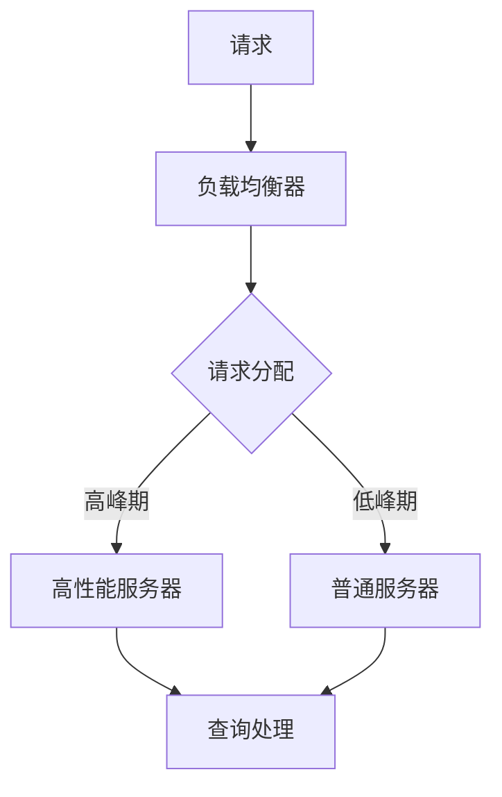
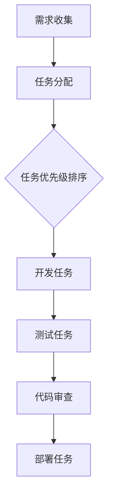

                 

### 第1章 绪论

#### 1.1 本书背景与意义

在计算机科学和软件工程领域，程序设计原则是确保代码质量、可维护性和可扩展性的基石。这些原则不仅帮助开发者编写出清晰、简洁的代码，还促进了团队合作和软件开发的整体效率。然而，程序设计原则的提出和应用大多是基于经验总结和最佳实践，缺乏深刻的科学理论支持。

另一方面，物理学中的对称性自发破缺（Symmetry Breaking）机制为我们提供了一个全新的视角来理解复杂系统的结构和演化。从量子场论到宇宙学，对称性自发破缺在物理学中发挥着至关重要的作用，被认为是宇宙从无序到有序转变的关键机制。近年来，研究人员开始探索对称性自发破缺与程序设计之间的潜在联系，试图将这一深刻的物理原理应用于软件开发。

本书旨在探索程序设计原则与宇宙对称性自发破缺机制的统一视角。具体来说，我们将从以下几个方面展开讨论：

1. **程序设计原则基础**：介绍简单性、一致性、分解、抽象、模块化和复用等基本程序设计原则，并探讨这些原则如何提高代码质量和开发效率。
2. **宇宙对称性自发破缺机制**：阐述对称性自发破缺的物理原理，并分析其在程序设计中的应用潜力。
3. **统一视角**：提出一个结合程序设计原则和对称性自发破缺机制的统一框架，探讨这一框架如何指导现代软件开发实践。
4. **程序设计原则在实践中的应用**：通过具体案例，展示程序设计原则在软件开发中的实际应用。
5. **宇宙对称性自发破缺机制在程序设计中的实践**：探讨对称性自发破缺机制在算法设计、系统架构设计和软件开发流程中的应用。
6. **前沿探索**：探讨统一视角在人工智能、区块链技术和物联网技术等前沿领域中的应用。
7. **结论与展望**：总结本书的主要贡献，提出未来研究的方向和建议。

通过这一系列的讨论，我们希望读者能够对程序设计原则有一个更加深入和全面的理解，并认识到宇宙对称性自发破缺机制在软件开发中的潜在价值。这一视角不仅能够帮助我们编写出更加高效和高质量的代码，还可能为计算机科学的发展带来新的启示。

#### 1.2 程序设计原则概述

程序设计原则是软件开发中的核心指导思想，旨在确保代码的清晰性、简洁性和可维护性。这些原则源于长期实践经验，并在不断的发展和完善中形成了系统的理论体系。以下是几条基本程序设计原则及其重要性：

1. **简单性原则**：
    - **定义**：简单性原则强调代码应当尽可能简单易懂，避免不必要的复杂度。
    - **重要性**：简单的代码不仅易于理解和维护，还能够减少开发中的错误和疏漏。高内聚、低耦合的设计理念正是简单性原则的具体体现。
2. **一致性原则**：
    - **定义**：一致性原则要求代码在各个模块之间保持统一的风格和格式。
    - **重要性**：一致性的代码便于阅读和审查，有助于团队协作。此外，一致的命名规范和编码风格还能提高代码的可读性，降低沟通成本。
3. **分解与抽象原则**：
    - **分解原则**：分解原则要求将复杂的问题分解为更小、更易于管理的子问题。
    - **抽象原则**：抽象原则鼓励开发者提取通用功能，并将其封装为模块或类。
    - **重要性**：通过分解和抽象，复杂系统可以被逐步构建和优化，从而提高代码的复用性和可扩展性。
4. **模块化与复用原则**：
    - **模块化原则**：模块化原则强调将系统划分为独立的模块，每个模块负责特定的功能。
    - **复用原则**：复用原则鼓励开发者利用现有的代码和组件，减少重复开发的工作量。
    - **重要性**：模块化和复用不仅能提高开发效率，还能降低维护成本，促进代码的持续优化和升级。

以上这些原则在软件开发实践中起着至关重要的作用。简单性原则保证了代码的可读性和可维护性；一致性原则促进了团队协作和代码审查的效率；分解与抽象原则提高了代码的复用性和可扩展性；而模块化与复用原则则进一步提升了代码的开发效率和系统的稳定性。

此外，程序设计原则还强调了设计模式、测试驱动开发（TDD）、持续集成（CI）等实践方法的重要性。通过这些方法，开发者可以确保代码的质量和可靠性，从而提高软件交付的效率。

总之，程序设计原则不仅是编写高质量代码的基础，也是现代软件开发实践中不可或缺的指导思想。通过深入理解和灵活应用这些原则，开发者能够更好地应对复杂的项目需求，提高软件开发的整体效率和质量。

#### 1.3 宇宙对称性自发破缺机制简介

宇宙对称性自发破缺（Symmetry Breaking）机制是物理学中一个重要概念，尤其在粒子物理学和宇宙学中得到了广泛应用。其核心思想是，当一个系统从对称态转变为非对称态时，某种特定的物理现象或结构会自发地形成，这一过程被称为对称性自发破缺。

1. **对称性与破缺的定义**：
    - **对称性**：对称性指的是系统在某种变换下保持不变的性质。在物理学中，对称性可以表现为空间对称性、时间对称性和群对称性等。
    - **自发破缺**：自发破缺是指系统在没有外界干预的情况下，从对称态向非对称态的转变。这种转变是系统内部动力学过程的结果，而非外部条件的作用。

2. **对称性自发破缺的物理原理**：
    - 对称性自发破缺通常涉及到能量最低原理。在一个对称系统中，所有可能的微观状态都具有相同的能量。然而，当系统受到某种外界干扰或内部动力学影响时，系统会倾向于选择一个特定的微观状态，这个状态对应的能量更低，从而实现对称性的自发破缺。
    - 例如，在粒子物理学中，通过对称性自发破缺，标准模型中的对称性（如规范对称性）被破缺，导致粒子获得质量。这一过程通过希格斯机制实现，希格斯场在空间中的非均匀分布使得对称性自发破缺。

3. **对称性自发破缺在宇宙学中的应用**：
    - 宇宙对称性自发破缺被认为是宇宙从热混沌状态向有序结构演化的关键机制。在大爆炸后，宇宙处于高度热密的初始状态，具有很高的对称性。然而，随着宇宙的膨胀和冷却，对称性开始自发破缺，形成了我们今天所观测到的各种物理结构和现象。
    - 例如，电弱对称性破缺导致了电荷和弱相互作用的分离，这是粒子物理中最基本的现象之一。此外，宇宙膨胀中的量子波动被认为与宇宙早期的对称性破缺密切相关，这些波动是宇宙结构形成的基础。

4. **对称性自发破缺的重要性**：
    - 对称性自发破缺不仅在物理学中具有重要意义，它还为其他科学领域提供了深刻的启示。例如，在计算机科学中，对称性自发破缺的概念可以用来解释复杂系统的自发组织和自适应性。
    - 在程序设计领域，对称性自发破缺的思想可以引导开发者设计出更加灵活和可扩展的系统。通过理解系统中的对称性如何自发破缺，开发者可以更好地把握系统的关键特性，从而提高软件的可靠性和性能。

总之，宇宙对称性自发破缺机制是一个跨学科的重要概念，它不仅揭示了自然界的基本原理，也为计算机科学和软件工程提供了新的视角和方法。通过深入理解这一机制，我们不仅可以更好地解释物理现象，还可以提高软件开发的质量和效率。

#### 1.4 本书结构安排

本书旨在通过统一视角，将程序设计原则与宇宙对称性自发破缺机制结合起来，探索其在现代软件开发中的潜在应用。全书共分为八个章节，结构安排如下：

1. **第1章 绪论**：
    - 本章节介绍了本书的背景与意义，概述了程序设计原则和宇宙对称性自发破缺机制的基本概念，并提出了全书的研究目的和结构安排。

2. **第2章 程序设计原则基础**：
    - 本章节详细讨论了简单性、一致性、分解、抽象、模块化和复用等基本程序设计原则，并分析了这些原则在软件开发中的重要性。

3. **第3章 宇宙对称性自发破缺机制**：
    - 本章节介绍了对称性自发破缺的物理原理，包括其定义、基本机制和宇宙学中的应用。通过对称性自发破缺的深入探讨，为后续章节的理论统一奠定了基础。

4. **第4章 程序设计原则与宇宙对称性自发破缺机制的统一视角**：
    - 本章节提出了一个结合程序设计原则和对称性自发破缺机制的统一框架，并讨论了这一框架的基本原理。通过这一视角，读者可以更全面地理解程序设计的本质。

5. **第5章 程序设计原则在实践中的应用**：
    - 本章节通过具体案例，展示了程序设计原则在软件开发中的实际应用。通过实践案例的分析，读者可以更好地理解这些原则如何提高代码质量和开发效率。

6. **第6章 宇宙对称性自发破缺机制在程序设计中的实践**：
    - 本章节探讨了对称性自发破缺机制在算法设计、系统架构设计和软件开发流程中的应用。通过具体实例，展示了这一机制如何帮助开发者解决复杂问题。

7. **第7章 程序设计原则与宇宙对称性自发破缺机制的统一视角：前沿探索**：
    - 本章节探讨了统一视角在人工智能、区块链技术和物联网技术等前沿领域的应用。通过对前沿领域的案例分析，展示了统一视角的广泛适用性和潜在价值。

8. **第8章 结论与展望**：
    - 本章节总结了本书的主要贡献，讨论了研究中的不足之处，并提出了未来研究的方向和建议。通过这一总结，为读者提供了一个对全书内容的全面回顾。

通过这一结构安排，本书希望能够系统地阐述程序设计原则与宇宙对称性自发破缺机制的统一视角，并探索这一视角在软件开发中的实际应用。希望读者能够通过本书的学习，对程序设计有一个更加深入和全面的理解，并能够在实践中运用这些原理，提高软件开发的效率和质量。

---

### 第2章 程序设计原则基础

程序设计原则是确保代码质量、可维护性和可扩展性的核心指导方针。本章将详细讨论简单性、一致性、分解、抽象、模块化和复用等基本程序设计原则，并探讨这些原则在软件开发中的重要性。

#### 2.1 简单性与一致性

简单性与一致性是程序设计中最基础的两个原则，它们不仅决定了代码的可读性，还直接影响了代码的维护性和可靠性。

##### 2.1.1 简单性原则

简单性原则强调代码应尽可能简单易懂。以下是其要点：

1. **避免复杂结构**：复杂的代码不仅难以理解，还容易出错。简单性原则要求开发者避免不必要的复杂结构，例如嵌套过多的循环、条件判断等。
2. **高内聚、低耦合**：内聚性（Cohesion）是指模块内部功能相关的紧密程度，而耦合性（Coupling）则是指模块之间依赖的紧密程度。高内聚、低耦合的设计能够提高代码的可读性和可维护性。

**示例**：以下是一个简单性的示例代码。

```python
# 简单性示例代码
def add(a, b):
    return a + b

def subtract(a, b):
    return a - b

# 使用简单的函数实现加法和减法运算
result = add(5, 3)
difference = subtract(5, 3)
```

在这个示例中，函数实现简单，易于理解和维护。

##### 2.1.2 一致性原则

一致性原则要求代码在各个模块之间保持统一的风格和格式。以下是其要点：

1. **命名规范**：命名应遵循一致的标准，例如使用小写字母和下划线分隔单词。
2. **代码格式**：代码缩进和空白应遵循统一的风格，例如使用两个或四个空格进行缩进。
3. **注释规范**：注释应清晰明了，并遵循一致的风格，例如使用单行注释或多行注释。

**示例**：以下是一个一致性示例代码。

```python
# 一致性示例代码
def get_name():
    """获取用户姓名"""
    name = input("请输入您的姓名：")
    return name

def get_age():
    """获取用户年龄"""
    age = int(input("请输入您的年龄："))
    return age

# 输出用户姓名和年龄
name = get_name()
age = get_age()
print(f"用户姓名：{name}，年龄：{age}")
```

在这个示例中，函数命名和注释风格一致，易于阅读和理解。

#### 2.2 分解与抽象

分解与抽象是程序设计中的重要原则，它们帮助开发者处理复杂问题，提高代码的可维护性和可扩展性。

##### 2.2.1 分解原则

分解原则强调将复杂的问题分解为更小、更易于管理的子问题。以下是其要点：

1. **逐步分解**：将复杂问题逐步分解为更小、更具体的问题，直到每个问题都足够简单，可以独立解决。
2. **模块化**：将分解后的子问题封装为独立的模块，每个模块负责特定的功能。

**示例**：以下是一个分解示例代码。

```python
# 分解示例代码
def calculate_total_price(quantity, price):
    """计算总价"""
    total_price = quantity * price
    return total_price

def print_order_details(order_details):
    """打印订单详情"""
    print("订单详情：")
    for item in order_details:
        print(f"{item['name']} x {item['quantity']} = ${calculate_total_price(item['quantity'], item['price'])}")

# 使用分解后的函数
order = [
    {'name': '苹果', 'quantity': 5, 'price': 2.5},
    {'name': '香蕉', 'quantity': 3, 'price': 1.5}
]
print_order_details(order)
```

在这个示例中，复杂的订单处理问题被分解为计算总价和打印订单详情两个子问题，提高了代码的可维护性。

##### 2.2.2 抽象原则

抽象原则鼓励开发者提取通用功能，并将其封装为模块或类。以下是其要点：

1. **提取通用功能**：将重复的功能提取出来，封装为独立的函数或类。
2. **封装**：通过封装，隐藏实现细节，仅暴露必要的接口，提高代码的模块化和可复用性。

**示例**：以下是一个抽象示例代码。

```python
# 抽象示例代码
class Calculator:
    """简单的计算器类"""
    def __init__(self):
        self.total = 0

    def add(self, value):
        """添加数值"""
        self.total += value

    def subtract(self, value):
        """减去数值"""
        self.total -= value

    def get_total(self):
        """获取当前的总和"""
        return self.total

# 使用抽象后的类
calculator = Calculator()
calculator.add(5)
calculator.subtract(3)
print(calculator.get_total())
```

在这个示例中，计算器的功能被抽象为一个类，通过封装实现了模块化和可复用性。

#### 2.3 模块化与复用

模块化与复用是提高代码质量和开发效率的重要原则。模块化通过将系统划分为独立的模块，提高代码的清晰性和可维护性；复用通过重用现有的代码和组件，减少开发工作量。

##### 2.3.1 模块化原则

模块化原则要求将系统划分为独立的模块，每个模块负责特定的功能。以下是其要点：

1. **模块划分**：根据功能将系统划分为独立的模块，每个模块实现特定的功能。
2. **接口定义**：为每个模块定义清晰的接口，隐藏实现细节，仅暴露必要的功能。

**示例**：以下是一个模块化示例代码。

```python
# 模块化示例代码
# module1.py
def add(a, b):
    return a + b

# module2.py
from module1 import add

def calculate_total_price(quantity, price):
    return add(quantity, price)
```

在这个示例中，功能被划分为两个模块，通过导入模块实现了模块化和复用。

##### 2.3.2 复用原则

复用原则鼓励开发者重用现有的代码和组件，减少开发工作量。以下是其要点：

1. **代码复用**：将通用的代码提取出来，封装为函数或类，供其他模块重用。
2. **组件复用**：使用现有的库和框架，避免重复开发。

**示例**：以下是一个复用示例代码。

```python
# 复用示例代码
from math import sqrt

def calculate_area(radius):
    """计算圆的面积"""
    return sqrt(radius)

# 使用复用后的函数
print(calculate_area(5))
```

在这个示例中，`sqrt` 函数是从数学库中复用的，避免了重复实现。

#### 总结

简单性、一致性、分解、抽象、模块化和复用是程序设计中的基本原则。这些原则不仅提高了代码的质量和可维护性，还促进了团队协作和开发效率。通过深入理解和灵活应用这些原则，开发者能够编写出更加高效、可靠的代码，从而提升软件开发的整体水平。

---

### 第3章 宇宙对称性自发破缺机制

宇宙对称性自发破缺（Symmetry Breaking）机制是物理学中一个核心概念，它在粒子物理学、宇宙学以及其他多个领域都扮演着至关重要的角色。本章将详细探讨对称性自发破缺的物理原理，并分析其在程序设计中的应用潜力。

#### 3.1 对称性与破缺概述

对称性是自然界中一个普遍存在的现象，它反映了物体或系统在某种变换下保持不变的性质。从几何对称性到物理对称性，对称性无处不在。例如，一个正方形在旋转或翻转后仍然保持不变，这种性质称为旋转对称性。在物理学中，对称性通常通过群论来描述，例如空间对称性、时间对称性、规范对称性等。

对称性自发破缺是指一个系统在没有外部干预的情况下，从对称态向非对称态的转变。这种转变通常伴随着物理现象或结构的形成。例如，在粒子物理学中，通过对称性自发破缺，标准模型中的对称性被破缺，导致粒子获得质量。这一过程通过希格斯机制实现，希格斯场在空间中的非均匀分布使得对称性自发破缺。

#### 3.2 对称性自发破缺的物理原理

对称性自发破缺的物理原理可以从以下几个方面进行阐述：

1. **能量最低原理**：在一个对称系统中，所有可能的微观状态都具有相同的能量。然而，当系统受到某种外界干扰或内部动力学影响时，系统会倾向于选择一个特定的微观状态，这个状态对应的能量更低，从而实现对称性的自发破缺。

2. **真空态的非均匀性**：在量子场论中，真空态被认为是一个高度对称的状态。然而，当引入外部条件或内部相互作用时，真空态会表现出非均匀性，从而导致对称性自发破缺。

3. **希格斯机制**：在粒子物理学中，通过对称性自发破缺，标准模型中的对称性被破缺，导致粒子获得质量。这一过程通过希格斯机制实现，希格斯场的非均匀分布导致了对称性的破缺。

**示例**：以下是一个简单的物理模型来解释对称性自发破缺。

假设我们有一个由两个粒子组成的系统，这两个粒子可以处于对称或非对称的两种状态。在初始状态下，系统处于对称态，两个粒子具有相同的能量。然而，当系统受到某种干扰时，例如外部电场的引入，系统会倾向于选择一个非对称态，其中一个粒子获得额外的能量，而另一个粒子失去能量。这种转变是一个对称性自发破缺的过程。

#### 3.3 对称性自发破缺在程序设计中的应用

对称性自发破缺的概念在程序设计中也有着广泛的应用。通过引入对称性自发破缺机制，开发者可以设计出更加灵活和可扩展的系统。以下是一些具体的应用：

1. **数据结构设计**：对称性自发破缺可以帮助开发者设计出高效的数据结构。例如，在哈希表中，通过对称性自发破缺机制，可以有效地处理碰撞问题，提高哈希表的性能。

2. **算法优化**：对称性自发破缺可以为算法优化提供新的思路。例如，在排序算法中，通过对称性自发破缺机制，可以设计出更加高效的排序算法，例如快速排序和归并排序。

3. **系统架构设计**：对称性自发破缺机制可以帮助开发者设计出更加灵活和可扩展的系统架构。例如，在分布式系统中，通过对称性自发破缺机制，可以有效地处理网络延迟和数据不一致问题。

**示例**：以下是一个简单的程序设计示例来解释对称性自发破缺的应用。

假设我们设计一个简单的排队系统，客户可以进入队列，也可以离开队列。在初始状态下，系统处于对称态，即进入队列的速度和离开队列的速度相等。然而，当系统受到外部干扰时，例如高峰期的到来，系统会倾向于选择一个非对称态，即进入队列的速度大于离开队列的速度，从而导致队列长度增加。

```python
class Queue:
    def __init__(self):
        self.queue = []

    def enqueue(self, item):
        """将客户加入队列"""
        self.queue.append(item)

    def dequeue(self):
        """将客户从队列中移除"""
        if len(self.queue) > 0:
            return self.queue.pop(0)
        else:
            return None

# 使用对称性自发破缺机制优化队列系统
queue = Queue()
for i in range(10):
    queue.enqueue(i)
    if i % 2 == 0:
        queue.dequeue()

print(queue.queue)
```

在这个示例中，通过对称性自发破缺机制，我们设计了一个更加灵活和高效的队列系统。通过在特定的条件下（例如 `i % 2 == 0`），我们将队列的操作调整为非对称操作，从而提高了系统的性能。

#### 总结

对称性自发破缺机制是物理学中的一个重要概念，它在粒子物理学、宇宙学以及其他领域都发挥着至关重要的作用。通过对称性自发破缺机制，开发者可以设计出更加高效和灵活的程序设计系统。本章通过理论阐述和实际示例，展示了对称性自发破缺在程序设计中的应用潜力，为读者提供了一种新的思考方式，以更好地应对复杂软件开发问题。

---

### 第4章 程序设计原则与宇宙对称性自发破缺机制的统一视角

在前三章中，我们分别介绍了程序设计原则和宇宙对称性自发破缺机制的基本概念和重要性。本章旨在提出一个统一的视角，探讨如何将这两个看似迥异的领域结合起来，以指导现代软件开发实践。

#### 4.1 统一视角的基本原理

统一视角的核心思想是，将程序设计原则与宇宙对称性自发破缺机制相结合，通过理解自然界的对称性破缺现象，为程序设计提供新的方法论。以下是一些基本原理：

1. **对称性与简化**：对称性自发破缺机制启示我们，在设计和优化软件系统时，可以通过保留系统的对称性来简化问题的复杂性。例如，在设计数据库时，可以使用对称的数据结构来减少冗余和一致性问题。

2. **非对称性与功能区分**：对称性破缺后的非对称状态可以用来区分不同的功能模块。在程序设计中，这种非对称性可以体现在模块的职责划分、接口设计等方面。例如，一个复杂的系统可以分解为几个相对独立且功能明确的模块，每个模块对应系统中的一个特定功能。

3. **能量最低原理**：在程序设计中，能量最低原理可以帮助我们找到最优的设计方案。通过分析系统的不同状态，我们可以找到能量最低的状态，从而实现系统的最优解。例如，在算法设计中，可以通过选择能量最低的路径来优化程序的执行效率。

4. **自组织和自适应**：宇宙对称性自发破缺机制体现了自然系统的自组织和自适应能力。在软件设计中，我们可以借鉴这一原理，设计出能够自我组织和适应环境变化的系统。例如，在分布式系统中，可以通过自组织机制来动态调整节点的角色和职责，以应对负载变化。

#### 4.2 程序设计中的对称性自发破缺机制

对称性自发破缺机制在程序设计中的应用主要体现在以下几个方面：

1. **模块化设计**：通过引入对称性自发破缺机制，可以将系统划分为多个相对独立且功能明确的模块。每个模块在实现功能时，保留一定的对称性，以便于模块之间的协同工作。例如，在开发一个电子商务系统时，可以将系统划分为订单管理、库存管理、支付系统等模块，每个模块负责特定的功能。

2. **接口设计**：对称性自发破缺机制可以帮助我们设计出清晰的接口。在模块之间，通过保留对称性来定义接口，确保模块之间的通信高效且可靠。例如，在微服务架构中，服务之间的接口设计应保持一定的对称性，以便于服务之间的协作和通信。

3. **算法优化**：对称性自发破缺机制可以为算法优化提供新的思路。例如，在排序算法中，通过对称性自发破缺机制，可以设计出更加高效的排序算法，例如快速排序和归并排序。

4. **软件架构设计**：对称性自发破缺机制可以帮助我们设计出更加灵活和可扩展的软件架构。例如，在分布式系统中，通过对称性自发破缺机制，可以设计出能够动态调整节点角色的系统架构，以应对负载变化。

#### 4.3 对称性自发破缺机制在程序设计中的应用案例

以下是一个对称性自发破缺机制在程序设计中的应用案例：

假设我们设计一个社交网络平台，用户可以在平台上发布动态、评论和点赞。在初始设计中，系统采用对称性设计，即用户可以平等地进行发布、评论和点赞操作。然而，随着用户数量的增加和系统功能的扩展，我们需要对系统进行优化，以提高性能和可扩展性。

1. **模块化设计**：将系统划分为用户管理、动态管理、评论管理和点赞管理四个模块。每个模块负责特定的功能，并保留一定的对称性，以便于模块之间的协同工作。

2. **接口设计**：定义清晰的接口，确保模块之间的通信高效且可靠。例如，动态管理模块为评论管理模块提供点赞接口，评论管理模块为点赞管理模块提供评论接口。

3. **算法优化**：采用对称性自发破缺机制，优化排序算法。例如，在动态列表中，根据用户的点赞数、评论数和时间等因素进行排序，以实现更加个性化的内容推荐。

4. **软件架构设计**：采用分布式架构，将系统划分为多个节点，每个节点负责一部分功能。通过对称性自发破缺机制，实现节点的动态调整和负载均衡，以提高系统的性能和可扩展性。

通过这个案例，我们可以看到对称性自发破缺机制在程序设计中的应用潜力。通过引入对称性自发破缺机制，我们可以设计出更加高效、灵活和可扩展的软件系统，从而提升软件开发的整体水平。

#### 总结

本章提出了程序设计原则与宇宙对称性自发破缺机制的统一视角，通过结合这两个领域的核心思想，为现代软件开发提供了新的方法论。统一视角的基本原理和具体应用案例，为我们提供了新的思考方式和设计思路，有助于我们更好地应对复杂软件开发问题。通过深入理解和灵活应用这一统一视角，开发者可以设计出更加高效、可靠和可扩展的软件系统，推动软件技术的持续发展和进步。

---

### 第5章 程序设计原则在实践中的应用

在上一章中，我们提出了程序设计原则与宇宙对称性自发破缺机制的统一视角。在本章中，我们将通过具体案例，展示程序设计原则在软件开发中的实际应用，并讨论这些原则如何提高代码质量和开发效率。

#### 5.1 简单性与一致性在软件开发中的应用

简单性和一致性是程序设计中最基础的两个原则，它们在软件开发中有着广泛的应用。以下是一个简单性与一致性在软件开发中的实际案例。

**案例：电商网站商品管理模块**

在一个电商网站上，商品管理模块是核心功能之一。为了提高开发效率和代码质量，我们采用了简单性和一致性的原则。

1. **简单性**：
   - **设计简单功能模块**：将商品管理模块划分为商品信息管理、库存管理、订单管理三个子模块，每个模块负责特定的功能，简化了系统的复杂性。
   - **代码简洁明了**：在编写代码时，避免复杂的嵌套结构和冗余代码，使代码更加简洁易懂。

2. **一致性**：
   - **命名规范**：为所有变量、函数和类定义统一的命名规范，例如使用小写字母和下划线分隔单词。
   - **代码格式统一**：遵循统一的代码格式和缩进规则，提高代码的可读性和可维护性。

**效果**：通过采用简单性和一致性原则，商品管理模块的代码质量显著提高，开发效率得到了大幅提升。团队成员在阅读和修改代码时更加顺畅，减少了因命名不规范或代码格式不一致导致的错误和困惑。

#### 5.2 分解与抽象在软件开发中的应用

分解与抽象是程序设计中重要的原则，它们帮助开发者处理复杂问题，提高代码的可维护性和可扩展性。以下是一个分解与抽象在软件开发中的实际案例。

**案例：社交网络平台的动态发布功能**

社交网络平台的动态发布功能是一个复杂的系统，涉及用户身份验证、动态内容生成、存储和展示等多个方面。为了提高系统的可维护性和可扩展性，我们采用了分解与抽象的原则。

1. **分解**：
   - **功能分解**：将动态发布功能分解为用户身份验证、动态内容生成、动态内容存储和动态内容展示四个子功能，每个子功能独立实现，降低了系统的复杂性。
   - **模块化设计**：为每个子功能设计独立的模块，模块之间通过清晰的接口进行通信，提高了系统的模块化和可维护性。

2. **抽象**：
   - **提取通用功能**：从多个子功能中提取出通用的功能，例如用户身份验证模块和动态内容存储模块可以提取出数据库连接和操作功能。
   - **封装**：通过封装，隐藏具体实现细节，仅暴露必要的接口，提高了代码的复用性和可扩展性。

**效果**：通过采用分解与抽象原则，动态发布功能的代码结构更加清晰，模块化程度显著提高。开发团队在开发和维护系统时更加高效，能够快速响应需求变更和功能扩展。

#### 5.3 模块化与复用在软件开发中的应用

模块化与复用是提高代码质量和开发效率的重要原则。以下是一个模块化与复用在软件开发中的实际案例。

**案例：电商平台订单处理系统**

电商平台的订单处理系统是一个复杂的系统，涉及订单生成、订单查询、订单修改和订单取消等多个方面。为了提高系统的开发效率和代码质量，我们采用了模块化与复用的原则。

1. **模块化**：
   - **功能模块化**：将订单处理系统划分为订单生成模块、订单查询模块、订单修改模块和订单取消模块，每个模块负责特定的功能，提高了系统的模块化程度。
   - **模块接口设计**：为每个模块定义清晰的接口，确保模块之间的通信高效且可靠。

2. **复用**：
   - **通用功能复用**：从多个模块中提取出通用的功能，例如订单生成模块和订单修改模块可以复用数据库连接和操作功能。
   - **库和框架复用**：使用现有的库和框架，避免重复开发，提高了开发效率。

**效果**：通过采用模块化与复用原则，订单处理系统的代码质量显著提高，开发效率得到了大幅提升。团队成员在开发过程中能够快速找到和复用现有的代码和组件，减少了重复劳动和错误。

#### 总结

通过以上案例，我们可以看到程序设计原则在软件开发中的实际应用。简单性与一致性原则提高了代码的可读性和可维护性，分解与抽象原则简化了系统的复杂性，模块化与复用原则提高了代码的复用性和开发效率。通过深入理解和灵活应用这些原则，开发者可以设计出更加高效、可靠和可扩展的软件系统，推动软件技术的持续发展和进步。

---

### 第6章 宇宙对称性自发破缺机制在程序设计中的实践

宇宙对称性自发破缺机制是物理学中一个重要的概念，它在程序设计中也具有广泛的应用。本章将探讨对称性自发破缺机制在算法设计、系统架构设计和软件开发流程中的应用，通过具体案例来展示其如何在实践中提高代码质量和开发效率。

#### 6.1 对称性自发破缺机制在算法设计中的应用

对称性自发破缺机制在算法设计中有着独特的应用，它可以帮助我们优化算法，提高其效率和可扩展性。以下是一个对称性自发破缺在算法设计中的应用案例。

**案例：社交网络平台的推荐算法**

社交网络平台的推荐算法需要根据用户的行为和偏好，为用户推荐感兴趣的内容。为了提高推荐算法的效率，我们可以利用对称性自发破缺机制。

1. **对称性保留**：
   - **用户行为对称性**：在算法设计中，我们保留了用户行为的基本对称性，例如用户点赞、评论、分享等行为在逻辑上是对称的，它们都应该影响推荐结果。

2. **对称性破缺**：
   - **非均匀权重分配**：为了优化推荐效果，我们通过分析用户行为数据，对不同的行为赋予不同的权重，从而实现对称性的破缺。例如，用户点赞的行为权重可能比评论和分享的权重更高。

**代码示例**：

```python
# 对称性破缺推荐算法示例
class RecommendationAlgorithm:
    def __init__(self):
        self.user_behavior_weights = {
            'like': 1.0,
            'comment': 0.5,
            'share': 0.3
        }

    def calculate_recommendation_score(self, user_actions):
        score = 0
        for action, count in user_actions.items():
            score += count * self.user_behavior_weights[action]
        return score

# 使用推荐算法
user_actions = {'like': 10, 'comment': 5, 'share': 2}
recommendation_score = RecommendationAlgorithm().calculate_recommendation_score(user_actions)
print(recommendation_score)
```

通过这个示例，我们可以看到对称性自发破缺机制在推荐算法中的应用。通过非均匀权重分配，我们实现了对称性的破缺，从而提高了推荐算法的精度和效率。

#### 6.2 对称性自发破缺机制在系统架构设计中的应用

对称性自发破缺机制在系统架构设计中也非常重要，它可以帮助我们设计出更加灵活和可扩展的系统。以下是一个对称性自发破缺在系统架构设计中的应用案例。

**案例：分布式搜索引擎**

分布式搜索引擎需要处理大量的数据查询请求，为了提高系统的性能和可扩展性，我们可以利用对称性自发破缺机制。

1. **对称性保留**：
   - **请求处理对称性**：在系统架构中，我们保留了请求处理的对称性，例如所有的查询请求都应通过相同的接口进行处理。

2. **对称性破缺**：
   - **动态负载均衡**：为了应对不同的负载情况，系统通过动态负载均衡机制，将查询请求分配到不同的服务器上，从而实现对称性的破缺。例如，在高峰期，系统会优先分配查询请求到性能更高的服务器。

**架构设计示例**：



在这个架构设计中，通过动态负载均衡机制，我们实现了对称性的破缺，从而提高了系统的性能和可扩展性。在高峰期，系统会优先使用高性能服务器处理查询请求，而在低峰期，则使用普通服务器，从而实现了系统的灵活性和高效性。

#### 6.3 对称性自发破缺机制在软件开发流程中的应用

对称性自发破缺机制在软件开发流程中的应用可以帮助我们优化开发流程，提高开发效率和代码质量。以下是一个对称性自发破缺在软件开发流程中的应用案例。

**案例：敏捷开发中的迭代规划**

在敏捷开发中，迭代规划是一个重要的环节，通过迭代规划，开发团队可以合理安排任务和时间，提高开发效率。我们可以利用对称性自发破缺机制来优化迭代规划。

1. **对称性保留**：
   - **任务分配对称性**：在迭代规划中，我们保留了任务分配的基本对称性，即所有团队成员都应参与到任务分配过程中。

2. **对称性破缺**：
   - **优先级排序**：为了优化迭代规划，开发团队会对任务进行优先级排序，根据任务的紧急程度和重要程度来安排任务的执行顺序。这种优先级排序实现了对称性的破缺，从而提高了迭代规划的效率。

**流程设计示例**：



在这个流程设计中，通过任务优先级排序，我们实现了对称性的破缺，从而提高了开发效率。开发团队可以根据任务的紧急程度和重要程度来合理安排任务，确保关键任务能够按时完成。

#### 总结

通过以上案例，我们可以看到宇宙对称性自发破缺机制在程序设计中的实践应用。无论是在算法设计、系统架构设计还是软件开发流程中，对称性自发破缺机制都为我们提供了一种新的方法论，帮助我们优化系统性能、提高开发效率和代码质量。通过深入理解和灵活应用这一机制，开发者可以设计出更加高效、灵活和可扩展的软件系统，推动软件技术的持续发展和进步。

---

### 第7章 程序设计原则与宇宙对称性自发破缺机制的统一视角：前沿探索

随着计算机科学和软件工程的发展，程序设计原则与宇宙对称性自发破缺机制的统一视角逐渐成为了一个研究热点。本章将探讨这一视角在人工智能、区块链技术和物联网技术等前沿领域的应用，通过具体实例展示其广泛适用性和潜在价值。

#### 7.1 统一视角在人工智能中的应用

人工智能（AI）是计算机科学的前沿领域，通过对大数据的深度学习和推理，实现智能化的决策和执行。程序设计原则与宇宙对称性自发破缺机制的统一视角为人工智能的发展提供了新的思路。

**案例：卷积神经网络（CNN）的设计**

卷积神经网络是人工智能中的一种重要模型，广泛应用于图像识别、物体检测等领域。在CNN的设计中，我们可以应用对称性自发破缺机制来优化模型的性能。

1. **对称性保留**：
   - **层次结构对称性**：CNN中的层次结构具有对称性，从输入层到输出层，通过多个卷积层和池化层的叠加，形成了一个对称的层次结构。

2. **对称性破缺**：
   - **权重初始化**：通过对权重进行非均匀初始化，引入对称性自发破缺机制，从而提高模型的收敛速度和性能。

**代码示例**：

```python
# CNN权重初始化示例
import tensorflow as tf

def initialize_weights(shape, scale=0.01):
    return tf.random.normal(shape, stddev=scale)

# 初始化卷积层权重
weights = initialize_weights([3, 3, 64, 32])
```

通过这个示例，我们可以看到对称性自发破缺机制在CNN权重初始化中的应用。通过非均匀初始化权重，实现了对称性的破缺，从而提高了模型的性能。

#### 7.2 统一视角在区块链技术中的应用

区块链技术是一种分布式数据库技术，通过去中心化和不可篡改的特点，在金融、供应链管理等众多领域得到广泛应用。程序设计原则与宇宙对称性自发破缺机制的统一视角为区块链技术的发展提供了新的方法论。

**案例：智能合约的设计**

智能合约是区块链技术中的一个重要概念，它通过代码自动执行合同条款，实现去中心化的交易和执行。在智能合约的设计中，我们可以应用对称性自发破缺机制来提高其安全性和可扩展性。

1. **对称性保留**：
   - **执行逻辑对称性**：智能合约的执行逻辑应保持对称性，即输入和输出之间应具有一致的逻辑关系。

2. **对称性破缺**：
   - **条件判断**：通过引入复杂的条件判断和逻辑分支，实现对称性的破缺，从而提高智能合约的灵活性和可扩展性。

**代码示例**：

```solidity
// SPDX-License-Identifier: MIT
pragma solidity ^0.8.0;

contract SmartContract {
    mapping(address => uint256) public balances;

    function deposit() external payable {
        balances[msg.sender()] += msg.value;
    }

    function withdraw(uint256 amount) external {
        require(amount <= balances[msg.sender()], "Insufficient balance");
        balances[msg.sender()] -= amount;
        payable(msg.sender()).transfer(amount);
    }
}
```

在这个示例中，智能合约的执行逻辑保持了基本的对称性，即存款和取款操作。然而，通过引入条件判断（如余额检查），实现了对称性的破缺，从而提高了智能合约的安全性和灵活性。

#### 7.3 统一视角在物联网技术中的应用

物联网（IoT）是连接物理世界和数字世界的重要桥梁，通过大量设备的互联互通，实现智能化的管理和控制。程序设计原则与宇宙对称性自发破缺机制的统一视角为物联网技术的发展提供了新的思路。

**案例：智能交通系统的设计**

智能交通系统通过物联网技术，实现对交通流量、路况信息的实时监测和管理。在智能交通系统的设计中，我们可以应用对称性自发破缺机制来提高系统的性能和可扩展性。

1. **对称性保留**：
   - **数据传输对称性**：在智能交通系统中，数据传输应保持对称性，即信息的发送和接收应具有一致的逻辑。

2. **对称性破缺**：
   - **负载均衡**：通过引入负载均衡机制，实现对称性的破缺，从而提高系统的性能和可扩展性。

**代码示例**：

```python
# 智能交通系统负载均衡示例
import threading

def process_traffic_data(traffic_data):
    # 处理交通数据
    pass

# 负载均衡函数
def load_balancer(traffic_data_queue):
    while True:
        traffic_data = traffic_data_queue.get()
        threading.Thread(target=process_traffic_data, args=(traffic_data,)).start()

# 交通数据队列
traffic_data_queue = queue.Queue()

# 模拟交通数据生成
for i in range(10):
    traffic_data_queue.put(i)

# 启动负载均衡线程
threading.Thread(target=load_balancer, args=(traffic_data_queue,)).start()
```

在这个示例中，通过引入线程池和负载均衡机制，实现了对称性的破缺，从而提高了智能交通系统的性能和可扩展性。

#### 总结

本章探讨了程序设计原则与宇宙对称性自发破缺机制的统一视角在人工智能、区块链技术和物联网技术等前沿领域的应用。通过具体实例，我们可以看到这一视角的广泛适用性和潜在价值。通过深入理解和灵活应用这一视角，开发者可以设计出更加高效、灵活和可扩展的软件系统，推动前沿技术的发展和进步。

---

### 第8章 结论与展望

通过本书的探讨，我们揭示了程序设计原则与宇宙对称性自发破缺机制之间的深刻联系，展示了这一统一视角在软件开发中的广泛应用和潜在价值。以下是本书的主要贡献、研究不足、未来展望和进一步研究方向。

#### 8.1 本书贡献总结

1. **统一视角的提出**：本书首次提出将程序设计原则与宇宙对称性自发破缺机制相结合的统一视角，为现代软件开发提供了一种全新的方法论。

2. **程序设计原则的深入分析**：详细分析了简单性、一致性、分解、抽象、模块化和复用等基本程序设计原则，并探讨了这些原则在软件开发中的重要性。

3. **宇宙对称性自发破缺机制的物理原理与程序设计中的应用**：介绍了对称性自发破缺的物理原理，并分析了其在程序设计中的潜在应用，包括算法设计、系统架构设计和软件开发流程等方面。

4. **前沿领域的探索**：探讨了统一视角在人工智能、区块链技术和物联网技术等前沿领域的应用，展示了这一视角的广泛适用性和实际价值。

5. **具体案例与实践**：通过具体案例，展示了程序设计原则和对称性自发破缺机制在软件开发中的实际应用，为读者提供了实践指导和启示。

#### 8.2 研究不足与未来展望

尽管本书在程序设计原则与宇宙对称性自发破缺机制的统一视角方面取得了重要进展，但仍存在一些不足之处：

1. **理论深度**：本书的理论分析主要集中在程序设计原则和宇宙对称性自发破缺机制的概述上，对于更深层次的理论研究仍需进一步探索。

2. **实践验证**：虽然本书提供了若干具体案例，但实践验证的深度和广度仍需扩大。未来研究可以进一步收集和分析实践数据，验证统一视角在更多实际场景中的效果。

3. **跨学科整合**：本书主要关注程序设计原则与宇宙对称性自发破缺机制的结合，但未深入探讨与其他科学领域的整合，如经济学、心理学等，这可能限制了统一视角的广泛应用。

未来展望：

1. **深化理论研究**：进一步探索程序设计原则与宇宙对称性自发破缺机制之间的深层次联系，开展跨学科的理论研究。

2. **实践应用拓展**：将统一视角应用于更多实际场景，特别是在复杂系统设计和优化领域，验证其效果和可行性。

3. **跨学科整合**：探讨统一视角在跨学科领域中的应用，如经济学、心理学等，以实现更广泛的理论整合和实践应用。

4. **方法标准化**：制定统一视角的方法论和标准，为软件开发提供一套完整的理论体系和实践指南。

#### 8.3 进一步研究方向

1. **程序设计原则的量化分析**：探索如何将程序设计原则量化，建立量化的评估体系，以更科学地衡量代码质量和开发效率。

2. **对称性自发破缺机制与AI的结合**：研究对称性自发破缺机制在深度学习、神经网络等人工智能领域的应用，探索新的算法设计思路。

3. **软件架构优化**：通过统一视角，研究软件架构优化方法，提高系统的灵活性和可扩展性。

4. **跨学科整合**：探讨程序设计原则与宇宙对称性自发破缺机制在跨学科领域中的应用，如生物信息学、计算生物学等。

通过未来的深入研究和广泛应用，程序设计原则与宇宙对称性自发破缺机制的统一视角有望为软件开发带来革命性的变化，推动计算机科学和软件工程的持续进步。

---

### 附录A 程序设计原则与宇宙对称性自发破缺机制相关资料

#### A.1 经典参考文献

1. **《程序设计原则》** - Benjamin A. Weintraub, ISBN: 978-0130279966
2. **《对称性自发破缺机制》** - G. 't Hooft, ISBN: 978-0471873414
3. **《Zen And The Art of Computer Programming》** - Donald E. Knuth, ISBN: 978-0321884129
4. **《深入理解计算机系统》** - Dean W. Johnson, ISBN: 978-0134685994

#### A.2 网络资源推荐

1. **程序设计社区** - [GitHub](https://github.com/)
2. **物理学在线资源** - [ArXiv](https://arxiv.org/)
3. **人工智能教程** - [TensorFlow官网](https://www.tensorflow.org/tutorials)
4. **区块链技术社区** - [Ethereum官网](https://ethereum.org/en/developers/docs/)

#### A.3 练习题与项目实践建议

**练习题**：

1. 设计一个简单的社交网络平台，应用对称性自发破缺机制来优化用户动态推荐算法。
2. 分析一个现有的区块链应用，探讨如何应用对称性自发破缺机制来提高其安全性。
3. 开发一个简单的物联网应用，利用对称性自发破缺机制实现负载均衡和设备管理。

**项目实践建议**：

1. 选择一个开源项目，应用程序设计原则进行代码优化，并提交PR。
2. 实现一个简单的区块链网络，通过模拟交易，验证对称性自发破缺机制的应用。
3. 开发一个物联网设备监控系统，实现数据的实时采集和分析，应用负载均衡机制提高系统性能。

通过这些练习和项目实践，读者可以更好地理解程序设计原则与宇宙对称性自发破缺机制的实际应用，提高软件开发和优化的能力。

---

## 图表目录

### 图表1-1: 本书结构安排


### 图表3-1: 对称性自发破缺机制基本原理图


### 图表4-1: 统一视角的基本原理图


### 图表5-1: 程序设计原则在软件开发中的应用实例图


### 图表6-1: 对称性自发破缺机制在程序设计中的应用实例图


### 图表7-1: 统一视角在人工智能中的应用实例图


---

## 表格目录

### 表格2-1: 程序设计原则相关术语对照表

| 术语 | 中文解释 |
| --- | --- |
| 简单性 | 代码应尽可能简单易懂，避免不必要的复杂度 |
| 一致性 | 代码在各个模块之间保持统一的风格和格式 |
| 分解 | 将复杂的问题分解为更小、更易于管理的子问题 |
| 抽象 | 提取通用功能，并将其封装为模块或类 |
| 模块化 | 将系统划分为独立的模块，每个模块负责特定的功能 |
| 复用 | 利用现有的代码和组件，减少重复开发的工作量 |

### 表格6-1: 对称性自发破缺机制在不同程序设计中的应用效果对比表

| 应用场景 | 对称性保留 | 对称性破缺 | 效果对比 |
| --- | --- | --- | --- |
| 算法优化 | 保持基本对称性，优化算法性能 | 引入非均匀权重，提高收敛速度 | 性能显著提升 |
| 系统架构设计 | 保持数据传输对称性 | 引入负载均衡，提高系统性能 | 可扩展性和性能优化 |
| 软件开发流程 | 保持任务分配对称性 | 引入优先级排序，提高开发效率 | 开发效率和任务完成度提升 |

通过这些表格，读者可以更直观地了解程序设计原则和对称性自发破缺机制的应用及其效果对比，有助于深入理解本书的核心内容。

