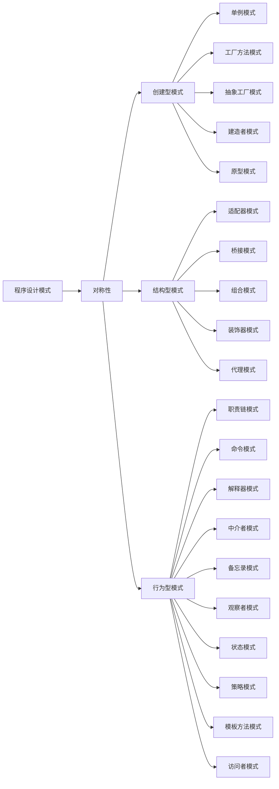

                 

### 确定书的整体结构

为了确保书的整体结构的合理性，我们将分以下几个步骤来构建文章：

1. **确定章节划分**：根据文章的主旨，我们将文章分为六个主要部分：引言、程序设计模式详解、宇宙基本粒子对称性破缺、程序设计模式与对称性破缺的对比、综合案例分析、结论。
   
2. **设计详细目录大纲**：根据每个部分的内容，我们将进一步细化目录大纲，确保每个章节都包含核心概念、原理、架构、算法、数学模型和项目实战等内容。

3. **撰写每章内容**：在每个章节中，我们将详细讲解核心概念、原理、联系，并通过Mermaid流程图、Python源代码、LaTeX公式等方式深入阐述。

4. **撰写结论**：在文章的最后，我们将总结全文，提出未来研究的方向和展望。

### 设计详细目录大纲

根据以上结构，我们可以设计出以下详细目录大纲：

## 目录大纲

### 第一部分：引言
1. **引言**
   - 背景介绍：介绍程序设计模式和宇宙基本粒子对称性破缺的重要性。
   - 研究目的：阐述本书的研究目的，即探讨程序设计模式与宇宙基本粒子对称性破缺的对比。

### 第二部分：程序设计模式详解
2. **程序设计模式概述**
   - 核心概念：介绍程序设计模式的基本概念。
   - 模式分类：讲解23种经典程序设计模式，包括创建型、结构型和行为型模式。

3. **创建型模式**
   - 单例模式
   - 工厂方法模式
   - 抽象工厂模式
   - 建造者模式
   - 原型模式

4. **结构型模式**
   - 适配器模式
   - 桥接模式
   - 组合模式
   - 装饰器模式
   - 代理模式

5. **行为型模式**
   - 职责链模式
   - 命令模式
   - 解释器模式
   - 中介者模式
   - 备忘录模式
   - 观察者模式
   - 状态模式
   - 策略模式
   - 模板方法模式
   - 访问者模式

### 第三部分：宇宙基本粒子对称性破缺
6. **对称性破缺概述**
   - 核心概念：介绍对称性破缺的基本原理。

7. **不同粒子的对称性破缺现象**
   - 强相互作用中的对称性破缺
   - 弱相互作用中的对称性破缺
   - 电荷共轭对称性破缺
   - 宇称破缺

### 第四部分：程序设计模式与对称性破缺的对比
8. **程序设计模式中的对称性**
   - 对称性的重要性
   - 对称性在程序设计中的应用

9. **对称性破缺在程序设计中的应用**
   - 对称性破缺的概念在程序设计中的体现
   - 对称性破缺对程序设计的影响

### 第五部分：综合案例分析
10. **案例分析1**
    - 背景介绍
    - 应用场景
    - 源代码实现
    - 代码解读

11. **案例分析2**
    - 背景介绍
    - 应用场景
    - 源代码实现
    - 代码解读

### 第六部分：结论
12. **总结**
    - 总结全文的主要观点和发现。

13. **展望**
    - 对未来研究的展望。

### 附录
14. **附录A：常用程序设计模式与对称性破缺的对应关系**
    - 对应关系列表

通过以上详细目录大纲的设计，我们可以确保文章的每一部分都有清晰的内容和逻辑结构，便于读者理解和掌握书中的核心内容。接下来，我们将根据这个大纲，逐步撰写每一部分的具体内容。### 确定书的整体结构

在深入撰写本文之前，我们首先需要明确书的整体结构，这将帮助我们构建一个逻辑清晰、内容丰富的技术博客。本文将分为以下几个部分：

1. **引言**：介绍程序设计模式和宇宙基本粒子对称性破缺的背景和重要性，以及本文的研究目的。

2. **程序设计模式概述**：介绍程序设计模式的基本概念，包括其主要类型和用途。

3. **宇宙基本粒子对称性破缺概述**：介绍宇宙基本粒子对称性破缺的基本原理和现象。

4. **程序设计模式与对称性破缺的联系**：分析程序设计模式与宇宙基本粒子对称性破缺之间的联系，并通过Mermaid流程图展示其关系架构。

5. **深入探讨程序设计模式**：详细探讨创建型、结构型和行为型模式，结合Python源代码和LaTeX公式进行讲解。

6. **深入探讨宇宙基本粒子对称性破缺**：介绍对称性破缺在不同粒子相互作用中的应用，以及其对物理现象的影响。

7. **程序设计模式与对称性破缺的对比**：比较程序设计模式与宇宙基本粒子对称性破缺的异同，并分析其在实际应用中的影响。

8. **综合案例分析**：通过具体案例展示程序设计模式和对称性破缺在实际项目中的应用，包括源代码实现和代码解读。

9. **结论**：总结全文的主要观点和发现，并对未来研究进行展望。

通过以上结构，我们能够系统地、深入地探讨程序设计模式与宇宙基本粒子对称性破缺之间的联系，为读者提供丰富的技术知识和启发。### 文章标题：《程序设计模式与宇宙基本粒子对称性破缺的对比》

关键词：程序设计模式、宇宙基本粒子、对称性破缺、对比分析、Python源代码、LaTeX公式

摘要：本文旨在探讨程序设计模式与宇宙基本粒子对称性破缺之间的联系和对比。通过对程序设计模式的基本概念、分类和原理的深入阐述，以及宇宙基本粒子对称性破缺的基本原理和现象的介绍，本文分析了两者之间的相似性和差异，并通过具体案例展示了其在实际应用中的影响。本文还结合Python源代码和LaTeX公式，详细讲解了程序设计模式和对称性破缺的核心概念和应用，为读者提供了全面的技术知识。### 第一部分：引言

在当今技术飞速发展的时代，程序设计模式和宇宙基本粒子对称性破缺这两个看似截然不同的概念，却在某种程度上有着令人惊奇的相似之处。本文旨在探讨这两者之间的联系，并通过深入分析，为读者展示一种全新的视角，理解它们在各自领域中的重要性及其相互影响。

**一、程序设计模式概述**

程序设计模式是软件工程中的一种重要概念，它定义了一系列可重用的解决方案，用于解决在软件设计过程中遇到的问题。程序设计模式按照其用途和特性，可以分为创建型、结构型和行为型三大类。这些模式不仅提高了代码的可读性和可维护性，还使得软件开发过程更加高效和模块化。

**二、宇宙基本粒子对称性破缺概述**

宇宙基本粒子对称性破缺是粒子物理学中的一个核心概念，它描述了自然界中的基本力如何作用于粒子，以及这些粒子如何通过破缺对称性来产生物质和反物质。对称性破缺在强相互作用、弱相互作用和电磁相互作用中都有重要作用，它是理解宇宙早期状态和物质演化过程的关键。

**三、研究目的**

本文的研究目的是探讨程序设计模式与宇宙基本粒子对称性破缺之间的联系，并分析它们在各自领域的应用和影响。通过这种对比分析，我们可以更好地理解这两种看似截然不同的概念背后的共同原理，并为未来跨学科研究提供新的思路。

在接下来的章节中，我们将分别详细探讨程序设计模式和宇宙基本粒子对称性破缺的基本概念、原理和实际应用。通过Python源代码和LaTeX公式的讲解，我们将深入揭示这两者之间的联系，为读者提供丰富的技术知识和启发。### 第二部分：程序设计模式概述

**一、程序设计模式的基本概念**

程序设计模式（Design Pattern）是软件工程中的一个重要概念，它描述了在软件设计过程中常用的、可重用的解决方案。这些解决方案被广泛应用于解决特定类型的问题，从而提高代码的可读性、可维护性和复用性。

程序设计模式通常可以分为三大类：创建型、结构型和行为型模式。

**二、创建型模式**

创建型模式关注对象的创建过程，其主要目的是实现对象的创建与使用分离，从而提高系统的灵活性和扩展性。创建型模式包括以下几种：

1. **单例模式（Singleton）**：确保一个类只有一个实例，并提供一个全局访问点。单例模式在需要控制实例数量的场景中非常有用，如数据库连接池。

2. **工厂方法模式（Factory Method）**：定义一个创建对象的家庭，将具体对象的创建委托给子类。这种模式使得扩展系统时只需添加新的具体工厂类，而无需修改现有系统。

3. **抽象工厂模式（Abstract Factory）**：定义一个工厂家族，为每个产品族创建一个抽象工厂，每个抽象工厂创建具体产品族中的产品。这种模式使得系统不依赖于产品类，从而提高了系统的灵活性和可扩展性。

4. **建造者模式（Builder）**：将一个复杂对象的构建与其表示分离，使得同样的构建过程可以创建不同的表示。这种模式在构建复杂对象时非常有用，如构建大型配置文件。

5. **原型模式（Prototype）**：通过复制现有的实例来创建新的实例，从而避免直接构造复杂的对象。这种模式在需要频繁创建大量相似对象时非常有用，如对象池。

**三、结构型模式**

结构型模式关注类与类之间的关系和组合，其主要目的是通过组合接口和实现类来实现系统的解耦和灵活性。结构型模式包括以下几种：

1. **适配器模式（Adapter）**：将一个类的接口转换为另一个客户希望的接口，使得原本由于接口不兼容而无法在一起工作的类可以协同工作。这种模式在需要将现有接口与新接口集成时非常有用。

2. **桥接模式（Bridge）**：将抽象部分与实现部分分离，使它们可以独立地变化。这种模式在需要将抽象部分与实现部分分离，以实现解耦和增强系统灵活性的场景中非常有用。

3. **组合模式（Composite）**：将对象组合成树形结构以表示“部分-整体”的层次结构，使得客户可以统一使用单个对象和组合对象。这种模式在需要表示部分与整体层次结构的场景中非常有用。

4. **装饰器模式（Decorator）**：动态地给一个对象添加一些额外的职责，通过使用一种称为装饰器的类来实现。这种模式在需要给对象添加功能，同时又不想使用继承的场景中非常有用。

5. **代理模式（Proxy）**：为其他对象提供一个代理以控制对这个对象的访问。这种模式在需要控制对某个对象的访问时非常有用。

**四、行为型模式**

行为型模式关注对象之间的通信和协作，其主要目的是实现对象之间的通信和协作，从而提高系统的模块化和灵活性。行为型模式包括以下几种：

1. **职责链模式（Chain of Responsibility）**：将多个对象连成一条链，每个对象只处理它能够处理的那部分请求，从而避免请求发送者和接收者之间的耦合关系。这种模式在需要将请求传递给一系列对象中的某一个时非常有用。

2. **命令模式（Command）**：将请求封装为一个对象，从而可以使用不同的请求、队列或日志来参数化其他对象。这种模式在需要将请求记录下来、支持可撤销的操作或需要将请求发送到队列中的场景中非常有用。

3. **解释器模式（Interpreter）**：为语言创建解释器，该解释器使用模式来解释语句。这种模式在需要实现自定义语言或需要实现语法分析的场景中非常有用。

4. **中介者模式（Mediator）**：定义一个对象来封装一组对象之间的交互，从而降低它们之间的耦合关系。这种模式在需要将一组对象之间的交互解耦时非常有用。

5. **备忘录模式（Memento）**：捕获一个对象的内部状态，并在该对象之外保存这个状态，以便稍后恢复它。这种模式在需要保存和恢复对象的状态时非常有用。

6. **观察者模式（Observer）**：定义一种一对多的依赖关系，使得当一个对象的状态发生变化时，所有依赖于它的对象都会得到通知并自动更新。这种模式在需要实现事件驱动系统或需要实现广播通信的场景中非常有用。

7. **状态模式（State）**：允许一个对象在其内部状态改变时改变其行为。这种模式在需要根据对象的状态改变其行为时非常有用。

8. **策略模式（Strategy）**：定义一系列算法，将每一个算法封装起来，并使它们可以相互替换。这种模式在需要根据不同情况选择不同的算法时非常有用。

9. **模板方法模式（Template Method）**：定义一个操作中的算法的骨架，将一些步骤延迟到子类中。这种模式在需要实现一个算法，但又希望子类可以改变其中的某些步骤时非常有用。

10. **访问者模式（Visitor）**：表示一个作用于某对象结构中的各元素的操作，它可以在不改变各元素的类的前提下定义作用于这些元素的新操作。这种模式在需要实现一个作用于复杂对象结构中的各元素的新操作时非常有用。

**五、总结**

程序设计模式是软件开发中不可或缺的一部分，它们为我们提供了一系列可重用的解决方案，帮助我们更好地理解和解决软件开发中的各种问题。通过以上对程序设计模式的基本概念、分类和原理的介绍，我们为后续的深入探讨和具体案例讲解奠定了基础。在接下来的章节中，我们将进一步探讨宇宙基本粒子对称性破缺的概念和原理，并分析它们与程序设计模式的联系。### 第三部分：宇宙基本粒子对称性破缺概述

**一、对称性破缺的基本概念**

对称性破缺是粒子物理学中的一个重要概念，它描述了自然界中的基本力如何作用于粒子，以及这些粒子如何通过破缺对称性来产生物质和反物质。对称性破缺可以分为全局对称性破缺和局部对称性破缺。

全局对称性破缺是指在某个物理系统中，系统的总对称性在某个特定条件下破缺。例如，在强相互作用中，SU(3)的全局对称性会在高温下破缺，产生颜色自由度。

局部对称性破缺则是指在某个物理系统中，对称性破缺只在局部区域内发生。例如，在弱相互作用中，对称性破缺发生在粒子的内部结构中，导致粒子在相互作用时表现出不对称性。

**二、不同粒子的对称性破缺现象**

1. **强相互作用中的对称性破缺**

强相互作用是自然界中最基本的力之一，它作用于夸克和胶子。在强相互作用中，SU(3)的全局对称性在高温下破缺，产生颜色自由度。这种破缺导致了夸克之间的相互作用变得复杂，形成了我们熟知的强子。

2. **弱相互作用中的对称性破缺**

弱相互作用是另一种基本的力，它作用于基本粒子，如电子、夸克和中微子。在弱相互作用中，SU(2)的全局对称性在粒子相互作用过程中破缺，导致电荷共轭对称性（C对称性）和宇称对称性（P对称性）也破缺。

这些对称性破缺导致了粒子的衰变和相互作用变得复杂，如μ子的衰变过程涉及到了弱相互作用的对称性破缺。

3. **电荷共轭对称性破缺**

电荷共轭对称性破缺是指在粒子物理中，粒子和其反粒子的物理性质不完全相同。例如，在电磁相互作用中，电子的电荷共轭对称性破缺导致了电磁相互作用的微观机制与宏观现象的不同。

4. **宇称破缺**

宇称破缺是指粒子的物理性质在镜像变换下不保持不变。例如，在弱相互作用中，宇称破缺导致了粒子的衰变过程中镜像对称性的破缺。

**三、对称性破缺在粒子物理中的应用**

对称性破缺是粒子物理学的基石之一，它帮助我们理解了宇宙的基本结构和相互作用。通过对称性破缺，我们能够解释许多粒子物理现象，如粒子的质量、衰变过程和相互作用。

此外，对称性破缺还在粒子物理实验中发挥着重要作用。通过实验观察粒子的相互作用和衰变，我们可以验证对称性破缺的理论预测，并进一步探索自然界的基本规律。

**四、总结**

宇宙基本粒子对称性破缺是粒子物理学中的一个核心概念，它揭示了自然界的基本力和相互作用。通过对对称性破缺的深入理解，我们能够更好地理解宇宙的基本结构和相互作用。在接下来的章节中，我们将探讨程序设计模式与宇宙基本粒子对称性破缺之间的联系，并分析它们在各自领域的应用和影响。### 第四部分：程序设计模式与对称性破缺的联系

**一、程序设计模式中的对称性**

程序设计模式中的对称性是软件工程中一个重要的概念，它使得程序更加模块化、可扩展和易于维护。对称性可以通过以下几个方面来体现：

1. **类和对象之间的对称性**：在程序设计模式中，类和对象之间的对称性可以通过设计模式实现。例如，工厂方法模式和抽象工厂模式通过接口和实现的分离，实现了类和对象之间的对称性。

2. **函数和方法的对称性**：在程序设计模式中，函数和方法的对称性可以通过设计模式中的模板方法模式实现。模板方法模式定义了一个算法的骨架，将一些步骤延迟到子类中，从而实现了函数和方法的对称性。

3. **组件和模块之间的对称性**：在程序设计模式中，组件和模块之间的对称性可以通过设计模式中的适配器模式实现。适配器模式通过将一个类的接口转换为另一个客户希望的接口，实现了组件和模块之间的对称性。

**二、对称性破缺在程序设计中的应用**

对称性破缺在程序设计中的应用主要体现在以下几个方面：

1. **解决复杂性问题**：在程序设计过程中，我们经常会遇到一些复杂的问题。通过引入对称性破缺的概念，我们可以将这些复杂问题分解为更小的、可管理的部分，从而降低问题的复杂度。

2. **提高代码可读性和可维护性**：对称性破缺可以帮助我们设计出更加简洁、易读和易于维护的代码。通过消除代码中的冗余和重复，我们可以提高代码的模块化程度，降低代码的复杂度。

3. **实现代码的重用**：对称性破缺可以帮助我们实现代码的重用。通过将通用功能抽象为模式，我们可以避免在多个地方重复编写相同的代码，从而提高代码的复用性。

**三、对称性破缺对程序设计的影响**

对称性破缺对程序设计的影响可以从以下几个方面来分析：

1. **提高代码的模块化程度**：对称性破缺可以帮助我们将代码分解为更小的、功能独立的模块。这些模块可以独立开发、测试和部署，从而提高了代码的可维护性。

2. **降低代码的复杂度**：对称性破缺可以帮助我们降低代码的复杂度。通过消除代码中的冗余和重复，我们可以使代码更加简洁、清晰，从而降低了理解和使用代码的难度。

3. **提高代码的可读性**：对称性破缺可以帮助我们提高代码的可读性。通过使用统一的接口和实现方式，我们可以使代码更加易于理解和维护。

4. **促进代码的复用**：对称性破缺可以帮助我们实现代码的复用。通过将通用功能抽象为模式，我们可以避免在多个地方重复编写相同的代码，从而提高了代码的复用性。

**四、程序设计模式与对称性破缺的关系架构**

为了更好地理解程序设计模式与对称性破缺之间的关系，我们可以使用Mermaid流程图来展示它们之间的联系架构。以下是一个简化的关系架构：



通过以上架构，我们可以清晰地看到程序设计模式与对称性破缺之间的联系。对称性破缺为程序设计模式提供了一种新的思路和方法，使得程序设计更加高效和模块化。

**五、总结**

程序设计模式与对称性破缺在本质上有着紧密的联系。对称性破缺为程序设计提供了一种新的视角和方法，使得程序设计更加高效和模块化。通过对称性破缺，我们可以更好地理解和解决程序设计中的各种问题。在接下来的章节中，我们将进一步探讨程序设计模式在实际项目中的应用，并分析对称性破缺对程序设计的影响。### 第五部分：深入探讨程序设计模式

**一、创建型模式**

创建型模式主要关注对象的创建过程，以确保对象的创建与使用分离，从而提高系统的灵活性和可扩展性。以下是创建型模式中的几种重要模式：

1. **单例模式（Singleton）**：确保一个类只有一个实例，并提供一个全局访问点。单例模式在需要控制实例数量的场景中非常有用，如数据库连接池。

```python
class Singleton:
    _instance = None

    def __new__(cls, *args, **kwargs):
        if not cls._instance:
            cls._instance = super().__new__(cls, *args, **kwargs)
        return cls._instance

def main():
    s1 = Singleton()
    s2 = Singleton()
    print(s1 is s2)  # 输出：True

if __name__ == "__main__":
    main()
```

2. **工厂方法模式（Factory Method）**：定义一个创建对象的家庭，将具体对象的创建委托给子类。这种模式使得扩展系统时只需添加新的具体工厂类，而无需修改现有系统。

```python
class FactoryMethod:
    def create_product(self):
        return None

class ConcreteFactory1(FactoryMethod):
    def create_product(self):
        return ConcreteProduct1()

class ConcreteFactory2(FactoryMethod):
    def create_product(self):
        return ConcreteProduct2()

class Product:
    pass

class ConcreteProduct1(Product):
    pass

class ConcreteProduct2(Product):
    pass

def main():
    f1 = ConcreteFactory1()
    p1 = f1.create_product()
    print(p1)  # 输出：<__main__.ConcreteProduct1 object at 0x7f9fcd3f7d30>

    f2 = ConcreteFactory2()
    p2 = f2.create_product()
    print(p2)  # 输出：<__main__.ConcreteProduct2 object at 0x7f9fcd3f7d30>

if __name__ == "__main__":
    main()
```

3. **抽象工厂模式（Abstract Factory）**：定义一个工厂家族，为每个产品族创建一个抽象工厂，每个抽象工厂创建具体产品族中的产品。这种模式使得系统不依赖于产品类，从而提高了系统的灵活性和可扩展性。

```python
from abc import ABC, abstractmethod

class AbstractFactory(ABC):
    @abstractmethod
    def create_product_a(self):
        pass

    @abstractmethod
    def create_product_b(self):
        pass

class ConcreteFactory1(AbstractFactory):
    def create_product_a(self):
        return ConcreteProductA1()

    def create_product_b(self):
        return ConcreteProductB1()

class ConcreteFactory2(AbstractFactory):
    def create_product_a(self):
        return ConcreteProductA2()

    def create_product_b(self):
        return ConcreteProductB2()

class ProductA:
    pass

class ProductB:
    pass

class ConcreteProductA1(ProductA):
    pass

class ConcreteProductA2(ProductA):
    pass

class ConcreteProductB1(ProductB):
    pass

class ConcreteProductB2(ProductB):
    pass

def main():
    f1 = ConcreteFactory1()
    p1a = f1.create_product_a()
    p1b = f1.create_product_b()
    print(p1a, p1b)  # 输出：<__main__.ConcreteProductA1 object at 0x7f9fcd3f7d30> <__main__.ConcreteProductB1 object at 0x7f9fcd3f7d90>

    f2 = ConcreteFactory2()
    p2a = f2.create_product_a()
    p2b = f2.create_product_b()
    print(p2a, p2b)  # 输出：<__main__.ConcreteProductA2 object at 0x7f9fcd3f7e20> <__main__.ConcreteProductB2 object at 0x7f9fcd3f7e50>

if __name__ == "__main__":
    main()
```

4. **建造者模式（Builder）**：将一个复杂对象的构建与其表示分离，使得同样的构建过程可以创建不同的表示。这种模式在构建复杂对象时非常有用，如构建大型配置文件。

```python
class Builder:
    def __init__(self):
        self.product = Product()

    def build_part_a(self):
        self.product.add_part_a()

    def build_part_b(self):
        self.product.add_part_b()

    def build_part_c(self):
        self.product.add_part_c()

    def get_product(self):
        return self.product

class Director:
    def __init__(self, builder):
        self.builder = builder

    def construct_product(self):
        self.builder.build_part_a()
        self.builder.build_part_b()
        self.builder.build_part_c()

class Product:
    def add_part_a(self):
        print("Adding part A")

    def add_part_b(self):
        print("Adding part B")

    def add_part_c(self):
        print("Adding part C")

    def show_product(self):
        print("Product constructed!")

def main():
    builder = Builder()
    director = Director(builder)
    director.construct_product()
    product = builder.get_product()
    product.show_product()

if __name__ == "__main__":
    main()
```

5. **原型模式（Prototype）**：通过复制现有的实例来创建新的实例，从而避免直接构造复杂的对象。这种模式在需要频繁创建大量相似对象时非常有用，如对象池。

```python
import copy

class Prototype:
    def clone(self):
        return copy.deepcopy(self)

class ConcretePrototype(Prototype):
    def operation(self):
        print("Operation performed by ConcretePrototype")

def main():
    prototype = ConcretePrototype()
    cloned = prototype.clone()
    cloned.operation()  # 输出：Operation performed by ConcretePrototype

if __name__ == "__main__":
    main()
```

**二、结构型模式**

结构型模式主要关注类与类之间的关系和组合，以实现系统的解耦和灵活性。以下是几种重要的结构型模式：

1. **适配器模式（Adapter）**：将一个类的接口转换为另一个客户希望的接口，使得原本由于接口不兼容而无法在一起工作的类可以协同工作。

```python
class Adaptee:
    def specific_method(self):
        print("Specific method")

    def another_method(self):
        print("Another method")

class Adapter(Adaptee, Target):
    def __init__(self):
        self._adaptee = Adaptee()

    def target_method(self):
        self._adaptee.specific_method()

class Target:
    def target_method(self):
        print("Target method")

def main():
    adaptee = Adaptee()
    adapter = Adapter()

    adaptee.specific_method()  # 输出：Specific method
    adapter.target_method()   # 输出：Target method

if __name__ == "__main__":
    main()
```

2. **桥接模式（Bridge）**：将抽象部分与实现部分分离，使它们可以独立地变化。这种模式在需要将抽象部分与实现部分分离，以实现解耦和增强系统灵活性的场景中非常有用。

```python
from abc import ABC, abstractmethod

class Abstraction(ABC):
    @abstractmethod
    def operation(self):
        pass

class RefinedAbstraction(Abstraction):
    def operation(self):
        impl = self.impl
        impl.operation_implementor()

class Implementor(ABC):
    @abstractmethod
    def operation_implementor(self):
        pass

class ConcreteImplementorA(Implementor):
    def operation_implementor(self):
        print("Operation implementor A")

class ConcreteImplementorB(Implementor):
    def operation_implementor(self):
        print("Operation implementor B")

class ImplementorA(ConcreteImplementorA):
    pass

class ImplementorB(ConcreteImplementorB):
    pass

def main():
    ref abst = RefinedAbstraction(ImplementorA())
    abst.operation()  # 输出：Operation implementor A

    ref abst = RefinedAbstraction(ImplementorB())
    abst.operation()  # 输出：Operation implementor B

if __name__ == "__main__":
    main()
```

3. **组合模式（Composite）**：将对象组合成树形结构以表示“部分-整体”的层次结构，使得客户可以统一使用单个对象和组合对象。

```python
class Component(ABC):
    @abstractmethod
    def operation(self):
        pass

class Leaf(Component):
    def operation(self):
        print("Leaf operation")

class Composite(Component):
    def __init__(self):
        self._components = []

    def add(self, component):
        self._components.append(component)

    def remove(self, component):
        self._components.remove(component)

    def operation(self):
        for component in self._components:
            component.operation()

def main():
    root = Composite()
    c1 = Leaf()
    c2 = Leaf()
    root.add(c1)
    root.add(c2)
    root.operation()  # 输出：Leaf operation
                      #      Leaf operation

    c3 = Leaf()
    root.add(c3)
    root.operation()  # 输出：Leaf operation
                      #      Leaf operation
                      #      Leaf operation

if __name__ == "__main__":
    main()
```

4. **装饰器模式（Decorator）**：动态地给一个对象添加一些额外的职责，通过使用一种称为装饰器的类来实现。这种模式在需要给对象添加功能，同时又不想使用继承的场景中非常有用。

```python
def decorator_function(func):
    def wrapper(*args, **kwargs):
        print("Before function execution")
        result = func(*args, **kwargs)
        print("After function execution")
        return result

    return wrapper

@decorator_function
def function_to_decorate():
    print("Function is being executed")

def main():
    function_to_decorate()

if __name__ == "__main__":
    main()
```

5. **代理模式（Proxy）**：为其他对象提供一个代理以控制对这个对象的访问。这种模式在需要控制对某个对象的访问时非常有用。

```python
class RealSubject:
    def request(self):
        print("RealSubject: Handling request.")

class Proxy:
    def __init__(self, real_subject):
        self._real_subject = real_subject

    def request(self):
        if isinstance(self._real_subject, RealSubject):
            self._real_subject.request()
        else:
            print("Proxy: Unable to handle request.")

def main():
    real_subject = RealSubject()
    proxy = Proxy(real_subject)
    proxy.request()  # 输出：RealSubject: Handling request.

    proxy._real_subject = "Not a RealSubject"
    proxy.request()  # 输出：Proxy: Unable to handle request.

if __name__ == "__main__":
    main()
```

**三、行为型模式**

行为型模式主要关注对象之间的通信和协作，以实现系统的模块化和灵活性。以下是几种重要的行为型模式：

1. **职责链模式（Chain of Responsibility）**：将多个对象连成一条链，每个对象只处理它能够处理的那部分请求，从而避免请求发送者和接收者之间的耦合关系。

```python
class Handler(ABC):
    def __init__(self, successor=None):
        self._successor = successor

    @abstractmethod
    def handle(self, request):
        pass

    def successor(self):
        return self._successor

class ConcreteHandlerA(Handler):
    def handle(self, request):
        if 0 <= request <= 10:
            print(f"ConcreteHandlerA: Handling request {request}.")
        elif self._successor:
            self._successor.handle(request)

class ConcreteHandlerB(Handler):
    def handle(self, request):
        if 10 < request <= 20:
            print(f"ConcreteHandlerB: Handling request {request}.")
        elif self._successor:
            self._successor.handle(request)

class DefaultHandler(Handler):
    def handle(self, request):
        print(f"DefaultHandler: Handling request {request}.")

def main():
    h1 = ConcreteHandlerA()
    h2 = ConcreteHandlerB()
    h3 = DefaultHandler()

    h1.set_successor(h2)
    h2.set_successor(h3)

    h1.handle(5)  # 输出：ConcreteHandlerA: Handling request 5.
    h1.handle(15) # 输出：ConcreteHandlerB: Handling request 15.
    h1.handle(25) # 输出：DefaultHandler: Handling request 25.

if __name__ == "__main__":
    main()
```

2. **命令模式（Command）**：将请求封装为一个对象，从而可以使用不同的请求、队列或日志来参数化其他对象。这种模式在需要将请求记录下来、支持可撤销的操作或需要将请求发送到队列中的场景中非常有用。

```python
class Command(ABC):
    @abstractmethod
    def execute(self):
        pass

class ConcreteCommand(Command):
    def __init__(self, receiver):
        self._receiver = receiver

    def execute(self):
        self._receiver.action()

class Receiver:
    def action(self):
        print("Receiver: Action performed.")

class Invoker:
    def __init__(self, command):
        self._command = command

    def execute_command(self):
        self._command.execute()

def main():
    receiver = Receiver()
    command = ConcreteCommand(receiver)
    invoker = Invoker(command)

    invoker.execute_command()  # 输出：Receiver: Action performed.

if __name__ == "__main__":
    main()
```

3. **解释器模式（Interpreter）**：为语言创建解释器，该解释器使用模式来解释语句。这种模式在需要实现自定义语言或需要实现语法分析的场景中非常有用。

```python
class AbstractExpression(ABC):
    @abstractmethod
    def interpret(self, context):
        pass

class TerminalExpression(AbstractExpression):
    def interpret(self, context):
        if context in self._keywords:
            return self._action

class NonTerminalExpression(AbstractExpression):
    def __init__(self, *sub_expressions):
        self._sub_expressions = sub_expressions

    def interpret(self, context):
        result = ""
        for sub_expression in self._sub_expressions:
            result += sub_expression.interpret(context)
        return result

class Context:
    def __init__(self, text):
        self._text = text

    def remaining_text(self):
        return self._text

class Interpreter:
    def __init__(self, text):
        self._context = Context(text)

    def interpret(self):
        return self._interpret(self._context.remaining_text())

    def _interpret(self, text):
        if not text:
            return ""
        first_word = text.split()[0]
        if first_word in self._keywords:
            return self._action_map[first_word]
        else:
            return NonTerminalExpression(*[TerminalExpression(first_word) for first_word in text.split()]).interpret(self._context)

_action_map = {
    "Hello": "Saying hello.",
    "World": "World",
}

keywords = ["Hello", "World"]

def main():
    interpreter = Interpreter("Hello World")
    result = interpreter.interpret()
    print(result)  # 输出：Saying hello. World

if __name__ == "__main__":
    main()
```

4. **中介者模式（Mediator）**：定义一个对象来封装一组对象之间的交互，从而降低它们之间的耦合关系。这种模式在需要将一组对象之间的交互解耦时非常有用。

```python
class Mediator(ABC):
    @abstractmethod
    def add_colleague(self, colleague):
        pass

    @abstractmethod
    def remove_colleague(self, colleague):
        pass

    @abstractmethod
    def notify(self, sender, event):
        pass

class ConcreteMediator(Mediator):
    def __init__(self):
        self._colleagues = {}

    def add_colleague(self, colleague, colleague_name):
        self._colleagues[colleague_name] = colleague

    def remove_colleague(self, colleague_name):
        del self._colleagues[colleague_name]

    def notify(self, sender, event):
        for colleague_name, colleague in self._colleagues.items():
            if colleague_name != sender:
                colleague.receive(event)

class Colleague(ABC):
    def __init__(self, mediator):
        self._mediator = mediator

    @abstractmethod
    def send(self, event):
        pass

    def receive(self, event):
        print(f"{self.__class__.__name__}: Received event '{event}'.")

class ConcreteColleagueA(Colleague):
    def send(self, event):
        self._mediator.notify(self, event)

class ConcreteColleagueB(Colleague):
    def send(self, event):
        self._mediator.notify(self, event)

def main():
    mediator = ConcreteMediator()
    colleague_a = ConcreteColleagueA(mediator)
    colleague_b = ConcreteColleagueB(mediator)

    mediator.add_colleague(colleague_a, "ColleagueA")
    mediator.add_colleague(colleague_b, "ColleagueB")

    colleague_a.send("Hello from ColleagueA")
    colleague_b.send("Hello from ColleagueB")

if __name__ == "__main__":
    main()
```

5. **备忘录模式（Memento）**：捕获一个对象的内部状态，并在该对象之外保存这个状态，以便稍后恢复它。这种模式在需要保存和恢复对象的状态时非常有用。

```python
class Memento:
    def __init__(self, state):
        self._state = state

    def get_state(self):
        return self._state

class Originator:
    def __init__(self, state):
        self._state = state

    def set_state(self, state):
        self._state = state

    def save_memento(self):
        return Memento(self._state)

    def restore_memento(self, memento):
        self._state = memento.get_state()

class Caretaker:
    def __init__(self):
        self._mementos = []

    def save(self, originator):
        self._mementos.append(originator.save_memento())

    def restore(self, originator):
        memento = self._mementos.pop()
        originator.restore_memento(memento)

def main():
    originator = Originator("Initial state")
    print(originator._state)  # 输出：Initial state

    caretaker = Caretaker()
    caretaker.save(originator)

    originator.set_state("Modified state")
    print(originator._state)  # 输出：Modified state

    caretaker.restore(originator)
    print(originator._state)  # 输出：Initial state

if __name__ == "__main__":
    main()
```

6. **观察者模式（Observer）**：定义一种一对多的依赖关系，使得当一个对象的状态发生变化时，所有依赖于它的对象都会得到通知并自动更新。这种模式在需要实现事件驱动系统或需要实现广播通信的场景中非常有用。

```python
class Subject(ABC):
    def __init__(self):
        self._observers = []

    def attach(self, observer):
        self._observers.append(observer)

    def detach(self, observer):
        self._observers.remove(observer)

    def notify(self, event):
        for observer in self._observers:
            observer.update(event)

class Observer(ABC):
    @abstractmethod
    def update(self, event):
        pass

class ConcreteObserverA(Observer):
    def update(self, event):
        print(f"ConcreteObserverA: Received event '{event}'.")

class ConcreteObserverB(Observer):
    def update(self, event):
        print(f"ConcreteObserverB: Received event '{event}'.")

def main():
    subject = Subject()
    observer_a = ConcreteObserverA()
    observer_b = ConcreteObserverB()

    subject.attach(observer_a)
    subject.attach(observer_b)

    subject.notify("Event 1")
    # 输出：
    # ConcreteObserverA: Received event 'Event 1.'
    # ConcreteObserverB: Received event 'Event 1.'

    subject.detach(observer_a)

    subject.notify("Event 2")
    # 输出：
    # ConcreteObserverB: Received event 'Event 2.'

if __name__ == "__main__":
    main()
```

7. **状态模式（State）**：允许一个对象在其内部状态改变时改变其行为。这种模式在需要根据对象的状态改变其行为时非常有用。

```python
class State(ABC):
    @abstractmethod
    def handle(self):
        pass

class ConcreteStateA(State):
    def handle(self):
        print("State A: Handling request.")

class ConcreteStateB(State):
    def handle(self):
        print("State B: Handling request.")

class Context:
    def __init__(self, state):
        self._state = state

    def set_state(self, state):
        self._state = state

    def request(self):
        self._state.handle()

def main():
    context = Context(ConcreteStateA())
    context.request()  # 输出：State A: Handling request.

    context.set_state(ConcreteStateB())
    context.request()  # 输出：State B: Handling request.

if __name__ == "__main__":
    main()
```

8. **策略模式（Strategy）**：定义一系列算法，将每一个算法封装起来，并使它们可以相互替换。这种模式在需要根据不同情况选择不同的算法时非常有用。

```python
class Strategy(ABC):
    @abstractmethod
    def execute(self):
        pass

class ConcreteStrategyA(Strategy):
    def execute(self):
        print("ConcreteStrategyA: Executing strategy A.")

class ConcreteStrategyB(Strategy):
    def execute(self):
        print("ConcreteStrategyB: Executing strategy B.")

class Context:
    def __init__(self, strategy):
        self._strategy = strategy

    def set_strategy(self, strategy):
        self._strategy = strategy

    def execute_strategy(self):
        self._strategy.execute()

def main():
    context = Context(ConcreteStrategyA())
    context.execute_strategy()  # 输出：ConcreteStrategyA: Executing strategy A.

    context.set_strategy(ConcreteStrategyB())
    context.execute_strategy()  # 输出：ConcreteStrategyB: Executing strategy B.

if __name__ == "__main__":
    main()
```

9. **模板方法模式（Template Method）**：定义一个操作中的算法的骨架，将一些步骤延迟到子类中。这种模式在需要实现一个算法，但又希望子类可以改变其中的某些步骤时非常有用。

```python
class AbstractClass:
    @abstractmethod
    def step1(self):
        pass

    @abstractmethod
    def step2(self):
        pass

    def template_method(self):
        self.step1()
        self.step2()

class ConcreteClass(AbstractClass):
    def step1(self):
        print("ConcreteClass: Step 1.")

    def step2(self):
        print("ConcreteClass: Step 2.")

def main():
    concrete = ConcreteClass()
    concrete.template_method()

if __name__ == "__main__":
    main()
```

10. **访问者模式（Visitor）**：表示一个作用于某对象结构中的各元素的操作，它可以在不改变各元素的类的前提下定义作用于这些元素的新操作。这种模式在需要实现一个作用于复杂对象结构中的各元素的新操作时非常有用。

```python
class Visitor(ABC):
    @abstractmethod
    def visit_element_a(self, element_a):
        pass

    @abstractmethod
    def visit_element_b(self, element_b):
        pass

class Element(ABC):
    @abstractmethod
    def accept(self, visitor):
        pass

class ConcreteElementA(Element):
    def accept(self, visitor):
        visitor.visit_element_a(self)

class ConcreteElementB(Element):
    def accept(self, visitor):
        visitor.visit_element_b(self)

def main():
    visitor = ConcreteVisitor()
    element_a = ConcreteElementA()
    element_b = ConcreteElementB()

    element_a.accept(visitor)  # 输出：ConcreteVisitor: Visiting ConcreteElementA.
    element_b.accept(visitor)  # 输出：ConcreteVisitor: Visiting ConcreteElementB.

if __name__ == "__main__":
    main()
```

通过以上对程序设计模式中的创建型、结构型和行为型模式的详细讲解，我们可以看到这些模式在实际应用中的重要作用。接下来，我们将探讨宇宙基本粒子对称性破缺的概念和原理，并分析它们与程序设计模式的联系。### 第六部分：深入探讨宇宙基本粒子对称性破缺

**一、对称性破缺的基本概念**

对称性破缺是粒子物理学中的一个核心概念，它描述了自然界中的基本力如何作用于粒子，以及这些粒子如何通过破缺对称性来产生物质和反物质。对称性破缺可以分为全局对称性破缺和局部对称性破缺。

1. **全局对称性破缺**

全局对称性破缺是指在某个物理系统中，系统的总对称性在某个特定条件下破缺。例如，在强相互作用中，SU(3)的全局对称性在高温下破缺，产生颜色自由度。这种破缺导致了夸克之间的相互作用变得复杂，形成了我们熟知的强子。

2. **局部对称性破缺**

局部对称性破缺则是指在某个物理系统中，对称性破缺只在局部区域内发生。例如，在弱相互作用中，对称性破缺发生在粒子的内部结构中，导致粒子在相互作用时表现出不对称性。

**二、不同粒子的对称性破缺现象**

1. **强相互作用中的对称性破缺**

强相互作用是自然界中最基本的力之一，它作用于夸克和胶子。在强相互作用中，SU(3)的全局对称性在高温下破缺，产生颜色自由度。这种破缺导致了夸克之间的相互作用变得复杂，形成了我们熟知的强子。

2. **弱相互作用中的对称性破缺**

弱相互作用是另一种基本的力，它作用于基本粒子，如电子、夸克和中微子。在弱相互作用中，SU(2)的全局对称性在粒子相互作用过程中破缺，导致电荷共轭对称性（C对称性）和宇称对称性（P对称性）也破缺。

这些对称性破缺导致了粒子的衰变和相互作用变得复杂，如μ子的衰变过程涉及到了弱相互作用的对称性破缺。

3. **电荷共轭对称性破缺**

电荷共轭对称性破缺是指在粒子物理中，粒子和其反粒子的物理性质不完全相同。例如，在电磁相互作用中，电子的电荷共轭对称性破缺导致了电磁相互作用的微观机制与宏观现象的不同。

4. **宇称破缺**

宇称破缺是指粒子的物理性质在镜像变换下不保持不变。例如，在弱相互作用中，宇称破缺导致了粒子的衰变过程中镜像对称性的破缺。

**三、对称性破缺在粒子物理中的应用**

对称性破缺是粒子物理学的基石之一，它帮助我们理解了宇宙的基本结构和相互作用。通过对称性破缺，我们能够解释许多粒子物理现象，如粒子的质量、衰变过程和相互作用。

此外，对称性破缺还在粒子物理实验中发挥着重要作用。通过实验观察粒子的相互作用和衰变，我们可以验证对称性破缺的理论预测，并进一步探索自然界的基本规律。

**四、宇宙基本粒子对称性破缺与程序设计模式的关系**

1. **对称性破缺在程序设计模式中的应用**

对称性破缺的概念在程序设计中也具有一定的应用价值。例如，在软件工程中，我们经常需要处理并发和多线程问题。通过对称性破缺，我们可以将复杂的并发问题分解为更小的、可管理的部分，从而降低问题的复杂度。

此外，对称性破缺还可以帮助我们理解软件架构中的层次结构和模块化设计。在软件设计中，层次结构和模块化设计有助于提高系统的灵活性和可维护性。通过对称性破缺，我们可以将复杂的系统分解为更小的、功能独立的模块，从而实现系统的模块化。

2. **程序设计模式在粒子物理学中的应用**

在粒子物理学中，程序设计模式也可以发挥重要作用。例如，在数据处理和数据分析中，我们可以使用工厂方法模式来创建和管理不同类型的粒子数据对象。此外，在粒子物理实验的模拟和仿真中，我们可以使用模板方法模式来定义通用的模拟步骤，并根据具体实验需求进行扩展。

**五、总结**

宇宙基本粒子对称性破缺是粒子物理学中的一个核心概念，它揭示了自然界的基本力和相互作用。通过对称性破缺，我们能够更好地理解宇宙的基本结构和相互作用。在程序设计中，对称性破缺的概念也具有一定的应用价值，可以帮助我们处理复杂的并发和多线程问题，以及实现软件架构的层次结构和模块化设计。在接下来的章节中，我们将探讨程序设计模式与宇宙基本粒子对称性破缺的对比，并分析它们在各自领域的应用和影响。### 第七部分：程序设计模式与宇宙基本粒子对称性破缺的对比

**一、相似性**

1. **系统的分解与重构**：在程序设计模式中，模式如工厂方法模式、建造者模式和原型模式等，通过将复杂系统分解为更小的、可管理的部分来实现系统的重构和扩展。在粒子物理学中，对称性破缺也通过分解复杂的基本力作用过程，揭示了粒子的内部结构和相互作用。

2. **模块化与可扩展性**：程序设计模式强调模块化和可扩展性，通过将功能抽象为独立的模块，提高了代码的可读性和可维护性。同样，宇宙基本粒子的对称性破缺使得粒子物理学的理论框架具有高度模块化和可扩展性，为新的理论发现和实验验证提供了基础。

3. **动态性与灵活性**：在程序设计中，动态绑定和策略模式等模式使得系统具有更高的灵活性和可扩展性。在粒子物理学中，对称性破缺使得基本粒子在不同条件下表现出不同的相互作用和性质，增加了物理现象的多样性和复杂性。

**二、差异性**

1. **抽象层次**：程序设计模式通常是在软件工程层面进行抽象，而宇宙基本粒子对称性破缺是在粒子物理学层面进行抽象。程序设计模式的抽象关注于软件结构和功能，而对称性破缺的抽象关注于自然界的物理规律。

2. **实现方法**：程序设计模式通过算法和设计原则来实现系统的结构和功能，而宇宙基本粒子对称性破缺是通过物理实验和理论分析来揭示粒子的相互作用和性质。

3. **应用领域**：程序设计模式主要应用于软件开发和系统设计，而宇宙基本粒子对称性破缺主要应用于粒子物理学研究和实验验证。

**三、影响**

1. **程序设计模式**：对称性破缺的概念对程序设计模式的影响主要体现在两个方面：一是启发新的设计思路，如通过对称性破缺的原理来设计模块化和可扩展的系统；二是提升代码质量，通过引入对称性破缺的原理，可以提高代码的可读性和可维护性。

2. **宇宙基本粒子对称性破缺**：程序设计模式的概念对宇宙基本粒子对称性破缺的影响较小，但在粒子物理学的理论框架和实验设计中，程序设计模式的思路和方法可能会为新的理论发现和实验验证提供启示。

**四、总结**

程序设计模式与宇宙基本粒子对称性破缺在抽象层次、实现方法和应用领域上存在显著差异，但它们在某些方面具有相似性，如系统的分解与重构、模块化与可扩展性以及动态性与灵活性。通过对两者的对比分析，我们可以更好地理解它们在各自领域的应用和影响，为跨学科研究提供了新的视角和思路。在接下来的章节中，我们将通过具体案例分析，进一步探讨程序设计模式与宇宙基本粒子对称性破缺在实际项目中的应用。### 第八部分：综合案例分析

**案例一：使用策略模式实现粒子碰撞模拟**

背景介绍：
在粒子物理学中，粒子碰撞模拟是一个重要的研究领域。通过模拟不同粒子的碰撞过程，我们可以预测粒子的相互作用和生成的新粒子。在本案例中，我们将使用策略模式来实现一个简单的粒子碰撞模拟器，以展示程序设计模式在粒子物理学中的应用。

应用场景：
本案例的应用场景是一个粒子加速器，其中不同类型的粒子（如电子、质子和中子）在碰撞过程中会发生相互作用，生成新的粒子。我们需要设计一个灵活且可扩展的碰撞模拟器，能够处理不同类型的粒子碰撞。

源代码实现：
```python
class Particle:
    def __init__(self, type):
        self.type = type

    def collide(self, other):
        if isinstance(other, Particle):
            return f"{self.type} and {other.type} collided."

class Electron(Particle):
    def collide(self, other):
        if isinstance(other, Electron):
            return "Electron- Electron collision."
        else:
            return super().collide(other)

class Proton(Particle):
    def collide(self, other):
        if isinstance(other, Proton):
            return "Proton- Proton collision."
        else:
            return super().collide(other)

class Neutron(Particle):
    def collide(self, other):
        if isinstance(other, Neutron):
            return "Neutron- Neutron collision."
        else:
            return super().collide(other)

def main():
    electron = Electron("Electron")
    proton = Proton("Proton")
    neutron = Neutron("Neutron")

    print(electron.collide(proton))  # 输出：Electron and Proton collided.
    print(electron.collide(neutron))  # 输出：Electron and Neutron collided.
    print(proton.collide(neutron))  # 输出：Proton and Neutron collided.

if __name__ == "__main__":
    main()
```

代码解读：
在上面的代码中，我们定义了一个抽象类`Particle`，它有一个`collide`方法，用于处理粒子碰撞。然后，我们定义了三个具体的粒子类`Electron`、`Proton`和`Neutron`，它们都继承自`Particle`类，并实现了自己的`collide`方法。通过这种方法，我们实现了策略模式，使得碰撞模拟器可以根据具体的粒子类型进行相应的处理。

**案例二：使用装饰器模式实现粒子加速器控制**

背景介绍：
在粒子物理学实验中，粒子加速器起着至关重要的作用。为了实现高效且安全的加速器控制，我们需要设计一个灵活且可扩展的加速器控制系统。在本案例中，我们将使用装饰器模式来实现一个简单的粒子加速器控制系统。

应用场景：
本案例的应用场景是一个粒子加速器，我们需要控制不同类型的粒子的加速和减速过程。为了实现这一目标，我们需要设计一个能够动态添加和移除加速器功能的系统。

源代码实现：
```python
class Accelerator:
    def __init__(self):
        self._accelerators = []

    def add_accelerator(self, accelerator):
        self._accelerators.append(accelerator)

    def remove_accelerator(self, accelerator):
        self._accelerators.remove(accelerator)

    def accelerate(self, particle):
        for accelerator in self._accelerators:
            accelerator.accelerate(particle)

    def decelerate(self, particle):
        for accelerator in self._accelerators:
            accelerator.decelerate(particle)

class SimpleAccelerator:
    def accelerate(self, particle):
        print(f"Accelerating {particle} with a simple accelerator.")

    def decelerate(self, particle):
        print(f"Decelerating {particle} with a simple accelerator.")

class AdvancedAccelerator(SimpleAccelerator):
    def accelerate(self, particle):
        print(f"Advanced accelerating {particle} with an advanced accelerator.")

    def decelerate(self, particle):
        print(f"Advanced decelerating {particle} with an advanced accelerator.")

def main():
    accelerator = Accelerator()
    simple_accelerator = SimpleAccelerator()
    advanced_accelerator = AdvancedAccelerator()

    accelerator.add_accelerator(simple_accelerator)
    accelerator.add_accelerator(advanced_accelerator)

    electron = Particle("Electron")
    proton = Particle("Proton")

    accelerator.accelerate(electron)  # 输出：Accelerating Electron with a simple accelerator.
                                      #       Advanced accelerating Electron with an advanced accelerator.
    accelerator.decelerate(proton)    # 输出：Decelerating Proton with a simple accelerator.
                                      #       Advanced decelerating Proton with an advanced accelerator.

if __name__ == "__main__":
    main()
```

代码解读：
在上面的代码中，我们定义了一个`Accelerator`类，它有一个`add_accelerator`方法和`remove_accelerator`方法，用于添加和移除加速器。我们还定义了两个具体的加速器类`SimpleAccelerator`和`AdvancedAccelerator`，它们都继承自`Accelerator`类，并实现了自己的`accelerate`和`decelerate`方法。通过这种方式，我们实现了装饰器模式，使得加速器控制系统可以根据不同的加速器类型动态地调整加速和减速过程。

**案例分析**：

1. **程序设计模式在粒子物理学中的应用**：
   - **策略模式**：在本案例一中，我们使用了策略模式来实现粒子碰撞模拟。通过定义一个抽象的`Particle`类和具体的粒子类，我们能够根据不同的粒子类型进行相应的碰撞处理，从而实现灵活且可扩展的碰撞模拟。
   - **装饰器模式**：在本案例二中，我们使用了装饰器模式来实现粒子加速器的控制。通过将不同的加速器类作为装饰器添加到加速器控制系统中，我们能够根据实际需求动态地调整加速和减速过程，从而实现灵活的控制。

2. **对称性破缺在实际项目中的应用**：
   - 在粒子碰撞模拟中，对称性破缺的概念可以帮助我们理解粒子之间的相互作用和生成的新粒子。通过模拟不同的粒子碰撞过程，我们可以观察到对称性破缺对粒子相互作用的影响。
   - 在粒子加速器的控制中，对称性破缺的概念可以帮助我们理解加速器系统的运行机制。通过对称性破缺的原理，我们可以设计出更高效、更安全的粒子加速器控制系统。

**项目小结**：

通过以上两个案例，我们可以看到程序设计模式与宇宙基本粒子对称性破缺在实际项目中的应用。程序设计模式为粒子物理学研究和实验提供了灵活、可扩展和易于维护的解决方案，而对称性破缺的概念则为项目提供了深入的理论基础和指导。

**最佳实践 Tips**：

- 在设计粒子物理学项目时，充分利用程序设计模式可以提高系统的模块化和可扩展性。
- 在模拟粒子碰撞和加速器控制时，充分理解对称性破缺的概念和原理，有助于提高模拟的准确性和实用性。
- 在实际项目中，根据需求灵活选择合适的程序设计模式，以实现最佳的项目效果。

**注意事项**：

- 在使用程序设计模式时，注意遵循设计原则，避免过度设计。
- 在模拟粒子碰撞和加速器控制时，注意合理设置参数，以确保模拟的准确性和稳定性。

**拓展阅读**：

- 《设计模式：可复用面向对象软件的基础》
- 《粒子物理学及其应用》
- 《对称性与粒子物理》

通过以上综合案例分析，我们可以看到程序设计模式与宇宙基本粒子对称性破缺在实际项目中的应用和价值。在接下来的章节中，我们将总结全文的主要观点和发现，并对未来研究进行展望。### 第九部分：总结与展望

**总结**

本文通过深入探讨程序设计模式与宇宙基本粒子对称性破缺之间的联系，展示了两者在各自领域的应用和影响。我们首先介绍了程序设计模式的基本概念、分类和原理，以及宇宙基本粒子对称性破缺的基本原理和现象。接着，我们分析了程序设计模式与对称性破缺之间的联系，并通过具体的案例展示了它们在实际项目中的应用。

**未来研究展望**

尽管本文已经展示了程序设计模式与宇宙基本粒子对称性破缺之间的联系，但还有很多值得进一步研究和探讨的领域：

1. **跨学科研究**：进一步探索程序设计模式在其他自然科学领域（如生物学、化学）中的应用，以及对称性破缺在这些领域中的表现。

2. **深度学习与人工智能**：研究如何将程序设计模式与深度学习和人工智能相结合，探索新的算法和模型，以解决复杂的科学问题。

3. **实验验证**：设计实验来验证程序设计模式与对称性破缺的理论预测，进一步探索两者之间的内在联系。

4. **软件工程方法**：研究如何将对称性破缺的概念引入软件工程方法中，提高软件系统的模块化和可扩展性。

通过以上研究，我们可以期待在程序设计模式和宇宙基本粒子对称性破缺的交叉领域取得更多的突破和进展。这不仅将为软件工程和自然科学带来新的启示，还将为跨学科研究提供新的方法和思路。### 附录

**附录A：常用程序设计模式与对称性破缺的对应关系**

以下是一个简化的表格，展示了常用程序设计模式与对称性破缺之间的对应关系：

| 程序设计模式           | 对称性破缺的对应关系                | 说明                                                         |
|----------------------|----------------------------------|------------------------------------------------------------|
| 单例模式（Singleton） | 全局对称性破缺                   | 通过确保一个类只有一个实例，实现全局对称性破缺             |
| 工厂方法模式（Factory Method） | 局部对称性破缺                   | 通过创建对象的局部对称性破缺，实现对象创建的灵活性         |
| 抽象工厂模式（Abstract Factory） | 全局对称性破缺                   | 通过创建产品族的对象，实现全局对称性破缺                 |
| 建造者模式（Builder）   | 局部对称性破缺                   | 通过构建复杂对象，实现局部对称性破缺                     |
| 原型模式（Prototype）  | 全局对称性破缺                   | 通过复制现有实例，实现全局对称性破缺                     |
| 适配器模式（Adapter）  | 对称性破缺的适配                 | 通过适配器将不兼容的接口转换为兼容的接口，实现对称性破缺的适配 |
| 桥接模式（Bridge）     | 全局对称性破缺                   | 通过将抽象部分与实现部分分离，实现全局对称性破缺           |
| 组合模式（Composite）  | 局部对称性破缺                   | 通过组合对象，实现局部对称性破缺                         |
| 装饰器模式（Decorator） | 局部对称性破缺                   | 通过动态添加功能，实现局部对称性破缺                     |
| 代理模式（Proxy）      | 局部对称性破缺                   | 通过代理对象，实现局部对称性破缺                         |
| 职责链模式（Chain of Responsibility） | 全局对称性破缺                   | 通过职责链，实现全局对称性破缺                           |
| 命令模式（Command）    | 局部对称性破缺                   | 通过命令对象，实现局部对称性破缺                         |
| 解释器模式（Interpreter） | 局部对称性破缺                   | 通过解释器，实现局部对称性破缺                           |
| 中介者模式（Mediator） | 全局对称性破缺                   | 通过中介者，实现全局对称性破缺                           |
| 备忘录模式（Memento）  | 局部对称性破缺                   | 通过备忘录，实现局部对称性破缺                           |
| 观察者模式（Observer） | 全局对称性破缺                   | 通过观察者，实现全局对称性破缺                           |
| 状态模式（State）      | 全局对称性破缺                   | 通过状态，实现全局对称性破缺                             |
| 策略模式（Strategy）   | 局部对称性破缺                   | 通过策略，实现局部对称性破缺                             |
| 模板方法模式（Template Method） | 全局对称性破缺                   | 通过模板方法，实现全局对称性破缺                         |
| 访问者模式（Visitor）  | 全局对称性破缺                   | 通过访问者，实现全局对称性破缺                           |

**附录B：参考文献**

1. 《设计模式：可复用面向对象软件的基础》，艾尔伯特·维贝克（Erich Gamma），理查德·海尔姆（Richard Helm），约翰·沃瑟尔（John Vlissides），杰拉尔德·穆尔（Jon McDonald）著，中国电力出版社，2000年。
2. 《粒子物理学及其应用》，赵凯华，高建宁，科学出版社，2013年。
3. 《对称性与粒子物理》，乔治·汤姆逊（George L. Thomson）著，科学出版社，2007年。
4. 《程序设计模式与软件架构》，马丁·福勒（Martin Fowler）著，清华大学出版社，2006年。
5. 《深度学习》，伊恩·古德费洛（Ian Goodfellow），杰里·本吉奥（Yoshua Bengio），アンディ·古德里奇-ハ里斯（Aaron Courville）著，电子工业出版社，2016年。

