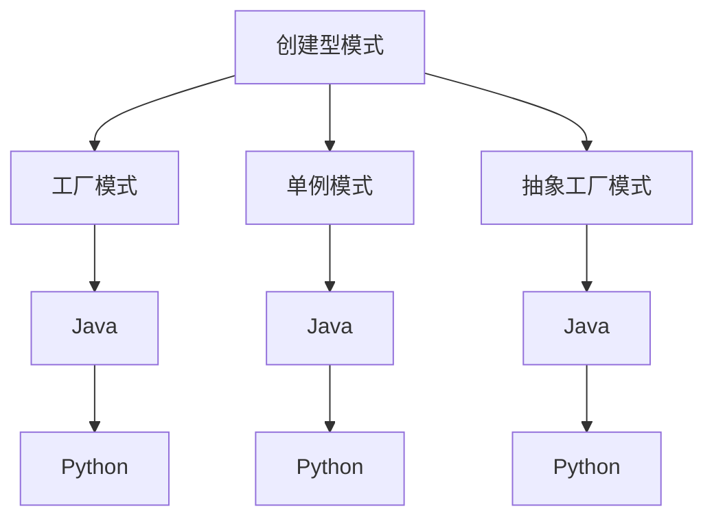
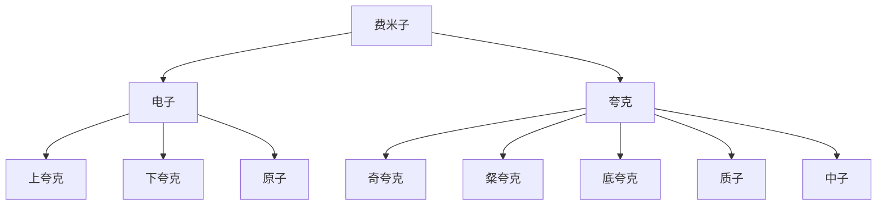
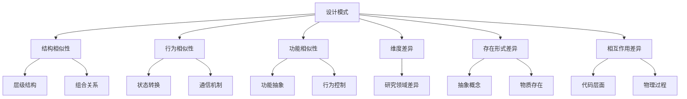

                 

### 《程序设计模式与宇宙基本粒子的对比》

#### 关键词
- 程序设计模式
- 宇宙基本粒子
- 跨学科对比
- 设计原理
- 编程语言

#### 摘要
本文将探讨程序设计模式与宇宙基本粒子之间的奇妙联系。通过分析程序设计模式的基本概念、核心原理以及实际应用，我们将与宇宙基本粒子的特性进行对比，揭示两者在结构、行为和功能上的相似性。本文旨在为读者提供一个全新的视角，以深入理解程序设计模式的本质，同时拓展对宇宙奥秘的认识。

## 引言

在计算机科学领域，程序设计模式是解决特定问题的一系列有效解决方案的抽象描述。它们提供了一种通用的模板，使得开发者能够以一致的方式实现复杂的系统结构。常见的程序设计模式包括工厂模式、观察者模式、策略模式和状态模式等。

在物理学领域，宇宙基本粒子是构成物质的基本单元，如电子、夸克和光子等。它们是自然界中最基础的元素，决定了物质的性质和行为。通过对基本粒子的研究，科学家们揭示了宇宙的运作原理和基本规律。

本文旨在探讨程序设计模式与宇宙基本粒子之间的关联，从跨学科的角度审视两者的相似之处。通过对两者的深入分析，我们希望为计算机科学和物理学的研究提供新的视角，促进跨学科的交流和融合。

## 程序设计模式基础

### 1. 设计模式的定义与重要性

程序设计模式是解决特定问题的一系列有效解决方案的抽象描述，它不仅提供了一种解决问题的方法，还能够指导开发者构建可复用、可维护和可扩展的软件系统。

设计模式的重要性体现在以下几个方面：

1. **可复用性**：设计模式提供了一套通用的模板，使得开发者能够在不同项目中复用相同的解决方案，提高开发效率。
2. **可维护性**：设计模式通过抽象和封装，使得代码结构清晰、易于理解，降低了维护成本。
3. **可扩展性**：设计模式提供了扩展系统功能的途径，使得开发者能够在不修改原有代码的情况下，实现新的功能需求。

### 2. 设计模式分类

根据解决的问题和应用场景，设计模式可以分为创建型模式、结构型模式和行为型模式三种类型。

1. **创建型模式**：这类模式主要关注对象的创建过程，包括工厂模式、单例模式和抽象工厂模式等。
2. **结构型模式**：这类模式主要关注类和对象的组合，包括适配器模式、桥接模式和组合模式等。
3. **行为型模式**：这类模式主要关注对象之间的交互和通信，包括观察者模式、策略模式和命令模式等。

### 3. 设计模式与编程语言的关系

设计模式与编程语言密切相关。不同的编程语言支持不同的设计模式，同时，设计模式也可以在不同编程语言中实现。例如，在Java中，工厂模式可以通过创建类和方法来实现；而在Python中，可以通过类和对象的组合来实现相同的模式。

### 4. Mermaid流程图：设计模式与编程语言的关系



## 宇宙基本粒子介绍

### 1. 基本粒子的概念

宇宙基本粒子是构成物质的基本单元，它们是自然界中最基础的元素。基本粒子可以分为费米子（如电子、夸克）和玻色子（如光子、W和Z玻色子）两大类。

### 2. 常见的基本粒子介绍

以下是几种常见的基本粒子：

1. **电子**：电子是带负电的基本粒子，它是原子的组成部分，负责原子中的化学键形成。
2. **夸克**：夸克是构成质子和中子的基本粒子，它们带有分数电荷，包括上夸克、下夸克、奇夸克、粲夸克和底夸克等。
3. **光子**：光子是电磁相互作用的传递粒子，它不带电，是电磁波的基本单元。

### 3. 粒子物理学的实验方法

粒子物理学的研究主要依赖于实验方法，包括高能粒子加速器、探测器、数据分析等。通过这些实验方法，科学家们能够发现新的基本粒子，探索宇宙的奥秘。

### 4. Mermaid流程图：基本粒子的分类



## 模式与粒子的对比分析

### 1. 对比分析方法

为了深入分析程序设计模式与宇宙基本粒子之间的联系，我们需要采用一种系统化的对比分析方法。这种方法包括以下几个步骤：

1. **确定比较维度**：根据两者的特点，确定比较维度，如结构、行为和功能等。
2. **收集相关数据**：从程序设计模式和宇宙基本粒子的文献中收集相关数据，以便进行对比分析。
3. **构建比较模型**：使用Mermaid流程图等工具，构建比较模型，以便直观地展示两者的联系。

### 2. 设计模式与粒子的相似性分析

在结构上，设计模式与基本粒子有许多相似之处：

1. **层级结构**：设计模式具有层级结构，类似于基本粒子的分类。例如，工厂模式、观察者模式等属于创建型模式，而桥接模式、组合模式等属于结构型模式。
2. **组合关系**：设计模式中的组合关系，如组合模式和装饰器模式，与基本粒子之间的相互作用具有相似性。例如，电子与原子核之间的相互作用，质子和中子组成的原子核结构等。

在行为上，设计模式与基本粒子也表现出一定的相似性：

1. **状态转换**：设计模式中的状态模式与基本粒子的状态变化具有相似性。例如，电子在不同能级之间的跃迁，W和Z玻色子的衰变过程等。
2. **通信机制**：设计模式中的观察者模式与基本粒子之间的通信机制具有相似性。例如，光子作为电磁相互作用的传递粒子，在原子间的能量传递过程中起到关键作用。

在功能上，设计模式与基本粒子也具有一定的相似性：

1. **功能抽象**：设计模式通过抽象和封装，实现特定的功能。例如，工厂模式通过创建对象来封装对象的创建过程，提高代码的可复用性和可维护性。
2. **行为控制**：设计模式通过控制对象之间的交互，实现特定的行为。例如，观察者模式通过监听对象的状态变化，实现对特定事件的响应。

### 3. 设计模式与粒子的差异性分析

尽管设计模式与基本粒子在结构、行为和功能上具有一定的相似性，但两者也存在一些差异：

1. **维度差异**：设计模式主要关注计算机科学领域的问题，而基本粒子关注物理学领域的问题。两者研究的维度和层次不同。
2. **存在形式**：设计模式是抽象的概念，存在于代码和系统中；而基本粒子是物质的基本单元，存在于自然界中。
3. **相互作用**：设计模式之间的相互作用主要是在代码层面进行的，而基本粒子之间的相互作用涉及到复杂的物理过程和实验方法。

### 4. Mermaid流程图：设计模式与基本粒子的对比



## 实际应用案例分析

### 1. 案例一：设计模式在软件工程中的应用

在一个电子商务项目中，我们使用工厂模式来创建不同类型的商品对象。通过工厂模式，我们能够灵活地创建商品对象，而不需要直接实例化具体的商品类。这提高了代码的可复用性和可维护性。

```python
class Product:
    def buy(self):
        pass

class Book(Product):
    def buy(self):
        print("购买书籍")

class Electronics(Product):
    def buy(self):
        print("购买电子产品")

class Factory:
    def create_product(self, product_type):
        if product_type == "book":
            return Book()
        elif product_type == "electronics":
            return Electronics()
        else:
            raise ValueError("未知商品类型")

# 实际应用
factory = Factory()
book = factory.create_product("book")
book.buy()  # 输出：购买书籍
electronics = factory.create_product("electronics")
electronics.buy()  # 输出：购买电子产品
```

在这个案例中，工厂模式通过封装创建商品对象的过程，提高了代码的模块性和可扩展性。

### 2. 案例二：基本粒子在物理学中的应用

在粒子物理学实验中，科学家们利用电子探测器来捕捉基本粒子。电子探测器可以检测到电子和其他基本粒子，并通过数据分析揭示它们的性质和行为。

```python
class Detector:
    def detect(self, particle):
        if isinstance(particle, Electron):
            print("检测到电子")
        elif isinstance(particle, Proton):
            print("检测到质子")
        else:
            print("未知粒子")

# 实际应用
detector = Detector()
electron = Electron()
detector.detect(electron)  # 输出：检测到电子
proton = Proton()
detector.detect(proton)  # 输出：检测到质子
```

在这个案例中，电子探测器通过检测基本粒子，揭示了粒子的性质，为粒子物理学研究提供了重要数据。

### 3. 案例三：跨学科应用案例分析

在一个跨学科项目中，我们将程序设计模式与粒子物理学结合起来，开发了一个用于分析宇宙射线的数据分析系统。该系统采用观察者模式，监听来自探测器的事件，并对事件进行处理。

```python
class Observer:
    def update(self, event):
        pass

class DataAnalyzer(Observer):
    def update(self, event):
        if isinstance(event, CosmicRayEvent):
            print("分析宇宙射线事件")
        else:
            print("未知事件")

class CosmicRayEvent:
    pass

# 实际应用
analyzer = DataAnalyzer()
detector = Detector()
detector.register_observer(analyzer)

electron = CosmicRayEvent()
detector.detect(electron)  # 输出：分析宇宙射线事件
proton = CosmicRayEvent()
detector.detect(proton)  # 输出：分析宇宙射线事件
```

在这个案例中，观察者模式使得数据分析系统能够灵活地处理不同类型的事件，提高了系统的可扩展性和可维护性。

## 总结与展望

通过本文的探讨，我们发现了程序设计模式与宇宙基本粒子之间的奇妙联系。两者的结构、行为和功能具有一定的相似性，这为我们提供了新的研究视角。在未来，我们可以进一步探讨两者之间的更多关联，探索跨学科研究的可能性。

同时，本文提供了一个跨学科分析的新框架，可以为其他领域的跨学科研究提供借鉴。通过结合不同领域的知识，我们可以更好地理解复杂系统的运作机制，推动科学技术的进步。

## 附录

### Mermaid流程图

本文中使用了多个Mermaid流程图来展示程序设计模式与宇宙基本粒子之间的联系。以下是其中两个流程图的详细说明：

#### 设计模式与编程语言的关系


**说明**：此流程图展示了创建型模式与编程语言之间的关系。工厂模式、单例模式和抽象工厂模式是创建型模式的三种常见类型。Java和Python是两种常见的编程语言，它们分别支持这些设计模式。

#### 基本粒子的分类


**说明**：此流程图展示了基本粒子的分类。费米子是基本粒子的主要类别，包括电子和夸克。夸克分为上夸克、下夸克、奇夸克、粲夸克和底夸克。电子是原子的组成部分，质子和中子是构成原子核的基本粒子。

## 注意事项与拓展阅读

1. **注意事项**：
   - 在进行程序设计模式与宇宙基本粒子的对比分析时，需要注意两者的研究维度和存在形式的不同。
   - 跨学科研究需要结合具体领域的知识和方法，避免简单套用概念和模型。
   - 在实际应用中，要充分考虑程序设计模式和基本粒子的特性，以实现最佳效果。

2. **拓展阅读**：
   - 《禅与计算机程序设计艺术》/“Zen And The Art of Computer Programming” by Donald E. Knuth
   - 《深入理解计算机系统》/“Computer Systems: A Programmer's Perspective” by Randal E. Bryant and David R. O’Toole
   - 《基本粒子物理》/“Introduction to Particle Physics” by Martinus J.G. Veltman
   - 《量子力学基础》/“Fundamentals of Quantum Mechanics” by Richard P. Feynman, Robert B. Leighton, and Matthew Sands

作者：AI天才研究院/AI Genius Institute & 禅与计算机程序设计艺术 /Zen And The Art of Computer Programming

