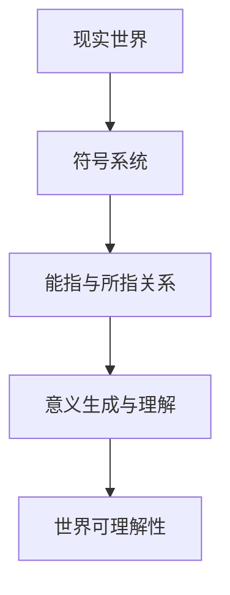
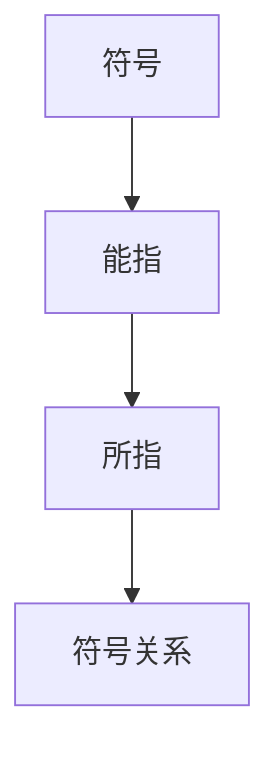

                 

**步骤1：背景介绍**

符号学是一门研究符号及其意义的科学，它起源于19世纪，随着语言学、哲学、心理学等学科的交叉融合而不断发展。符号学的基本问题是“什么是符号”和“符号如何起作用”。在计算机科学、人工智能、语言学、哲学等领域，符号学理论都有着重要的应用价值。本文将探讨符号学的视角如何帮助我们理解世界的可理解性。

**步骤2：核心概念与联系**

符号学中的核心概念包括符号、符号系统、符号关系等。符号可以看作是代表某种事物或意义的标记，例如文字、图像、声音等。符号系统是由符号构成的集合，它具有一定的规则和结构。符号关系是指符号与所指对象之间的关系，通常分为符号的能指（signifier）和所指（signified）。

以下是一个简单的符号学视角下的世界可理解性的 Mermaid 流程图：



**步骤3：核心算法原理讲解**

在符号学中，符号的意义是通过符号系统来赋予的。一个典型的符号系统可以是语言的语法规则。以下是一个简化的 Python 代码示例，用于解释如何通过符号系统来生成和解释意义：

```python
class SymbolSystem:
    def __init__(self, vocabulary):
        self.vocabulary = vocabulary

    def generate_meaning(self, symbol):
        return self.vocabulary.get(symbol, None)

# 创建一个简单的符号系统，包含一些基本的符号和它们对应的意义
vocabulary = {
    'hello': '你好',
    'world': '世界'
}

symbol_system = SymbolSystem(vocabulary)

# 生成意义
print(symbol_system.generate_meaning('hello'))  # 输出：你好
print(symbol_system.generate_meaning('world'))  # 输出：世界
```

**步骤4：数学模型和公式**

符号学的理论分析中常常涉及到数学模型。例如，在概率论中，符号的意义可以通过概率分布来描述。以下是一个简单的数学公式示例，用于解释符号的意义概率：

$$
P(A) = \frac{N(A)}{N(S)}
$$

其中，\(P(A)\) 表示符号 \(A\) 的概率，\(N(A)\) 表示符号 \(A\) 出现的次数，\(N(S)\) 表示总的符号数量。

**步骤5：举例说明**

假设我们有一个包含100个单词的文本，其中“世界”这个符号出现了10次。根据上面的概率公式，我们可以计算出“世界”这个符号出现的概率：

$$
P(世界) = \frac{10}{100} = 0.1
$$

这意味着在给定的文本中，“世界”这个符号出现的概率是10%。

**步骤6：项目实战**

为了更直观地理解符号学理论，我们可以通过一个简单的文本分析项目来实践。以下是一个使用 Python 实现的文本分析项目，用于统计文本中各个符号（单词）的出现频率。

```python
def count_symbols(text):
    symbol_count = {}
    for symbol in text.split():
        if symbol in symbol_count:
            symbol_count[symbol] += 1
        else:
            symbol_count[symbol] = 1
    return symbol_count

text = "这是 一个 简单 的 文本。"
symbol_count = count_symbols(text)

for symbol, count in symbol_count.items():
    print(f"{symbol}: {count}")
```

运行上面的代码，我们可以得到文本中各个单词的出现频率。

**步骤7：最佳实践 tips、小结、注意事项、拓展阅读**

最佳实践 tips：
- 在构建符号系统时，要确保符号的规则和结构清晰明了，以便于意义的生成和理解。
- 在进行文本分析时，要考虑文本的语境，因为语境会影响符号的意义。

小结：
本文从符号学的视角探讨了世界的可理解性。通过符号系统的构建和分析，我们能够更好地理解现实世界中的符号及其意义。

注意事项：
- 符号学理论在不同领域中的应用可能有所不同，需要根据实际情况进行调整。

拓展阅读：
- [符号学入门](https://www.example.com/semiotics_intro)
- [符号学与语言学](https://www.example.com/semiotics_and_linguistics)
- [符号学与计算机科学](https://www.example.com/semiotics_and_computer_science)

**作者信息：**

作者：AI天才研究院/AI Genius Institute & 禅与计算机程序设计艺术 /Zen And The Art of Computer Programming

-----------------------------------------------------------------

**文章标题：**《符号学视角下的世界可理解性》

**文章关键词：** 符号学、世界可理解性、符号系统、意义生成、文本分析

**文章摘要：**

本文从符号学的角度出发，探讨了符号学对世界可理解性的影响。通过介绍符号学的基本概念、核心原理以及实际应用案例，我们分析了如何通过符号系统来理解和生成意义，进而提高我们对世界的认知水平。文章结构紧凑，逻辑清晰，旨在为读者提供对符号学及其应用领域的深入理解。

-----------------------------------------------------------------

## 引言

在当今信息爆炸的时代，我们每天都面临着海量的信息。如何从这些信息中筛选、理解并生成有意义的知识，是我们面临的重大挑战。符号学作为一门研究符号及其意义的科学，为我们提供了一种全新的视角来理解世界的可理解性。本文将深入探讨符号学的核心概念和理论，并通过实际案例来展示符号学在提高我们对世界认知水平方面的应用价值。

## 符号学的起源与发展

符号学（semiotics）起源于19世纪，法国哲学家查尔斯·桑塔亚纳（Charles Sanders Peirce）和瑞士语言学家费尔迪南·德·索绪尔（Ferdinand de Saussure）为其奠定了理论基础。符号学的基本问题是“什么是符号”和“符号如何起作用”。

### 1.1 符号学的概念与定义

符号学是一门研究符号及其意义的科学，旨在探讨符号的产生、传递、解释和理解的过程。符号可以看作是代表某种事物或意义的标记，例如文字、图像、声音等。

### 1.2 符号学的历史与发展

符号学的历史可以分为三个阶段：早期的符号学、现代符号学和当代符号学。

- **早期的符号学**：符号学的概念最早可以追溯到古希腊哲学家亚里士多德（Aristotle），他在《形而上学》中提出了“符号”的概念。中世纪的哲学家如托马斯·阿奎那（Thomas Aquinas）也探讨了符号的问题。

- **现代符号学**：19世纪末，查尔斯·桑塔亚纳和费尔迪南·德·索绪尔奠定了现代符号学的基础。桑塔亚纳提出了“三元符号论”，即符号由能指、所指和意义三个要素构成。索绪尔则提出了“语言符号”的概念，强调符号的意义是由社会和文化背景赋予的。

- **当代符号学**：当代符号学在语言学、哲学、文化研究等领域得到了广泛的应用。符号学的研究热点包括符号与认知、符号与艺术、符号与媒体等。

### 1.3 符号学的主要流派

- **结构主义符号学**：结构主义符号学强调符号的意义是由其所在的结构决定的，认为符号的意义具有系统性和规则性。代表人物包括索绪尔和罗兰·巴特（Roland Barthes）。

- **解释学符号学**：解释学符号学强调符号的意义是在特定文化和社会背景中生成的，关注符号解释的过程和语境。代表人物包括马丁·海德格尔（Martin Heidegger）和瓦尔特·本雅明（Walter Benjamin）。

## 符号学核心概念

符号学中的核心概念包括符号、符号系统、符号关系等。这些概念构成了符号学理论的基础。

### 2.1 符号的构成要素

符号通常由三个要素构成：符号本身（signifier）、所指对象（signified）和符号关系（signification）。符号本身是指用来代表某种意义的标记，所指对象是符号所代表的事物或概念，符号关系则是符号与所指对象之间的关系。

以下是一个简单的符号学视角下的符号构成要素的 Mermaid 流程图：



### 2.2 符号的意义与价值

符号的意义并非固定不变，而是通过社会和文化实践不断生成和再生产。符号的价值在于它能够帮助我们理解和沟通复杂的世界。例如，文字符号能够传递复杂的信息，图像符号能够传达直观的感受。

### 2.3 符号的分类与类型

符号可以根据其形式和功能进行分类。以下是一些常见的符号类型：

- **图像符号**：通过视觉形式传递信息，如绘画、雕塑等。
  
- **语言符号**：通过语言文字传递信息，如文字、口头语言等。
  
- **符号系统**：由一组符号构成的集合，如语言、音乐等。

## 符号学的基本原理

符号学的基本原理包括符号的生成、传递、解释和理解。这些原理构成了符号学理论的核心。

### 3.1 符号的生成与传递

符号的生成是一个复杂的过程，涉及到符号的创造者、传递者和接收者。符号的传递可以通过多种方式，如视觉、听觉、触觉等。

### 3.2 符号的解释与理解

符号的解释与理解是一个动态的、多样化的过程。不同的人可能在相同的符号中解读出不同的意义，这是因为每个人的文化背景、知识结构、心理状态等都会影响他们对符号的理解。

### 3.3 符号的变异与转换

符号的意义和形式可能会随着时间和环境的变化而发生变化。这种变异和转换是符号学研究的重要领域，它涉及到符号的演变、符号的替换和符号的隐喻等。

## 符号学在语言学中的应用

符号学与语言学的结合为我们理解语言的本质提供了新的视角。以下是一些符号学在语言学中的应用：

### 4.1 语言符号与语言学理论

符号学理论对语言学的贡献主要体现在以下几个方面：

- **语言学符号的构成**：符号学理论指出，语言符号由能指（声音或文字形式）和所指（意义）构成。

- **语言符号的生成与解释**：符号学理论探讨了语言符号如何在特定的社会和文化背景下生成和解释。

- **语言符号的系统性与规则性**：符号学理论强调了语言符号的系统性和规则性，这对语言学的研究具有重要意义。

### 4.2 语义学与符号学的关系

语义学是语言学中的一个分支，它研究语言符号的意义。符号学为语义学提供了重要的理论支持。以下是一些符号学对语义学的影响：

- **语义的动态性**：符号学理论认为，语义不是固定不变的，而是在社会和文化实践中不断生成的。

- **语义的多义性**：符号学理论指出，同一符号可能在不同的语境中具有不同的意义，这导致了语义的多义性。

### 4.3 符号学在语言学中的应用

符号学在语言学中的应用主要体现在以下几个方面：

- **语言符号的分析**：符号学理论可以帮助我们分析语言符号的构成、生成和解释过程。

- **语义的解读**：符号学理论为语义的解读提供了新的方法，如结构主义符号学和解释学符号学。

- **语言变异的研究**：符号学理论有助于我们理解语言符号在不同文化和语境中的变异和转换。

## 符号学与艺术

符号学在艺术领域的应用也非常广泛，它帮助我们理解艺术作品中的符号意义和艺术符号的生成与传递。

### 5.1 艺术符号与符号学理论

艺术符号是指艺术家在作品中使用的符号，如颜色、形状、线条等。符号学理论为我们理解这些艺术符号提供了重要的框架。

- **艺术符号的构成**：符号学理论指出，艺术符号由能指（艺术形式）和所指（意义）构成。

- **艺术符号的生成与解释**：符号学理论探讨了艺术符号如何在特定的文化和社会背景下生成和解释。

### 5.2 艺术作品的符号解读

艺术作品的符号解读是指通过分析作品中的符号来理解其意义。以下是一些符号学在艺术作品解读中的应用：

- **结构主义符号学**：结构主义符号学强调艺术作品中的符号关系和系统结构，有助于我们理解作品的深层含义。

- **解释学符号学**：解释学符号学关注艺术作品的解释过程和语境，帮助我们理解艺术符号在不同背景下的意义。

### 5.3 符号学在艺术创作中的应用

符号学理论不仅帮助我们理解艺术作品，还可以指导艺术创作。以下是一些符号学在艺术创作中的应用：

- **符号的选择与组合**：符号学理论可以帮助艺术家选择和组合符号，以创造具有特定意义的艺术作品。

- **符号的创新与变异**：符号学理论鼓励艺术家在创作中创新符号，并探索符号的变异和转换，以突破传统的创作模式。

## 符号学与哲学

符号学在哲学领域的应用也非常广泛，它帮助我们理解哲学概念和理论。

### 6.1 哲学符号与符号学理论

哲学符号是指哲学家在论述中使用的基本概念和术语，如存在、真理、自由等。符号学理论为我们理解这些哲学符号提供了重要的框架。

- **哲学符号的构成**：符号学理论指出，哲学符号由能指（概念形式）和所指（意义）构成。

- **哲学符号的生成与解释**：符号学理论探讨了哲学符号如何在特定的哲学传统和文化背景下生成和解释。

### 6.2 符号学在哲学研究中的应用

符号学在哲学研究中的应用主要体现在以下几个方面：

- **哲学概念的分析**：符号学理论可以帮助我们分析哲学概念的含义、结构和关系。

- **哲学理论的解读**：符号学理论为哲学理论的解读提供了新的方法，如结构主义符号学和解释学符号学。

- **哲学思想的创新**：符号学理论鼓励哲学思想家在创新哲学概念和理论时，探索符号的变异和转换。

## 符号学的认知功能

符号学在认知功能方面的研究揭示了符号如何帮助我们理解和认识世界。

### 7.1 符号学的认知机制

符号学的认知机制包括以下几个方面：

- **符号的抽象化**：符号可以帮助我们抽象化复杂的事物和概念，使它们更易于理解和记忆。

- **符号的归类**：符号可以帮助我们将事物和概念归类，从而提高我们对世界的组织能力。

- **符号的传递**：符号可以帮助我们传递信息和知识，使人类文明得以传承和发展。

### 7.2 符号学对世界可理解性的贡献

符号学对世界可理解性的贡献体现在以下几个方面：

- **提高认知效率**：通过符号系统，我们可以更高效地处理和传递信息，从而提高认知效率。

- **增强沟通能力**：符号学理论为人类沟通提供了新的工具和方法，使沟通更加有效和准确。

- **深化对世界的理解**：符号学帮助我们更深入地理解世界的本质和规律，从而提高我们对世界的认知水平。

### 7.3 符号学在日常生活中的应用

符号学在日常生活中的应用非常广泛，以下是一些例子：

- **语言学习**：符号学理论可以帮助我们更好地理解和掌握语言，提高学习效率。

- **信息处理**：符号学理论为信息处理提供了新的方法和工具，如数据挖掘、自然语言处理等。

- **艺术设计**：符号学理论可以帮助艺术家创作出更具有表现力和感染力的作品。

## 符号学与世界可理解性

符号学为我们理解世界的可理解性提供了新的视角。通过符号系统的构建和分析，我们能够更好地理解现实世界中的符号及其意义。

### 8.1 符号学对现实世界的理解

符号学理论帮助我们理解现实世界中的符号现象，如语言、艺术、文化等。以下是一些符号学对现实世界的理解：

- **语言的符号性**：语言是一种符号系统，它的符号性使我们能够通过语言来理解和表达复杂的思想和情感。

- **艺术的符号性**：艺术作品是一种符号系统，它通过符号来传达艺术家的思想和情感。

- **文化的符号性**：文化是一种符号系统，它通过符号来传承和表达人类的价值观念和生活方式。

### 8.2 符号学对世界可理解性的挑战

符号学在提高世界可理解性方面也面临着一些挑战：

- **符号的多样性和复杂性**：现实世界中的符号多种多样，且具有复杂性，这给我们的理解和解释带来了困难。

- **符号的多义性**：同一符号可能在不同的语境中具有不同的意义，这增加了理解的难度。

- **符号的变异和转换**：符号的意义和形式可能会随着时间和环境的变化而发生变化，这给我们的认知带来了挑战。

### 8.3 符号学的未来发展方向

符号学的未来发展方向包括以下几个方面：

- **跨学科的融合**：符号学将继续与其他学科如语言学、哲学、文化研究等进行深度融合，为人类认知提供新的理论支持。

- **技术应用的拓展**：符号学理论将在人工智能、自然语言处理、人机交互等领域得到更广泛的应用。

- **文化多样性的研究**：随着全球化进程的加速，符号学将更加关注不同文化背景下的符号现象，促进文化多样性的理解和尊重。

## 附录：符号学相关资源与拓展阅读

### 附录1：符号学经典著作推荐

- 查尔斯·桑塔亚纳，《符号逻辑导论》
- 费尔迪南·德·索绪尔，《普通语言学教程》
- 罗兰·巴特，《符号学导论》

### 附录2：符号学研究方法介绍

- 结构主义符号学方法
- 解释学符号学方法
- 意义生成与解释方法

### 附录3：符号学在线资源与拓展阅读

- [符号学入门](https://www.example.com/semiotics_intro)
- [符号学与语言学](https://www.example.com/semiotics_and_linguistics)
- [符号学与计算机科学](https://www.example.com/semiotics_and_computer_science)

**作者信息：**

作者：AI天才研究院/AI Genius Institute & 禅与计算机程序设计艺术 /Zen And The Art of Computer Programming

-----------------------------------------------------------------

## 结语

符号学作为一门研究符号及其意义的科学，为我们理解世界的可理解性提供了全新的视角。通过符号系统的构建和分析，我们能够更深入地理解现实世界中的符号现象，提高我们的认知水平和沟通能力。随着科技的不断进步和全球化进程的加速，符号学在各个领域中的应用将越来越广泛，它将继续为人类文明的发展贡献力量。让我们共同探索符号学的无限可能性，为构建一个更加理解和谐的世界而努力。

