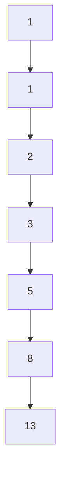

                 

### 1. 引言

简单数学背后的自然智慧，这一主题揭示了一个奇妙的现象：看似简单的数学概念和原理，如何在自然界中发挥着深远的作用。数学，作为一门抽象的科学，其魅力在于其简洁性和普适性。通过数学模型，我们可以理解和描述复杂的自然现象，从而揭示隐藏在表象背后的深层规律。

在自然界中，从生物体的生长模式到生态系统的演化，从天体运动的轨迹到气候变化，数学无处不在。例如，斐波那契数列不仅出现在植物的生长中，还与金融市场的波动有着千丝万缕的联系；分形几何则为我们展示了自然界中丰富的自相似结构。这些现象不仅激发了人类对自然奥秘的探索，也推动了数学在各个领域的应用。

本文旨在探讨数学与自然界之间的深刻联系，通过具体的实例和深入的分析，揭示简单数学背后隐藏的自然智慧。文章将分为以下几个部分：

1. **数学与自然的基本联系**：介绍数学的基本概念，并探讨其在自然界中的应用。
2. **具体数学分支在自然中的应用**：详细讨论几何学、代数学、概率论和微积分在自然现象中的具体应用。
3. **数学模型的生物学意义**：探讨数学模型在生物学研究中的应用，包括生物系统、生物进化、生物网络和生物多样性保护等方面。
4. **自然现象的数学描述**：分析天文学、地球科学、气候变化和海洋生态等自然现象的数学描述。
5. **数学在探索自然智慧中的应用**：讨论数学模型在人工智能、生物信息学、人类行为研究和认知科学中的应用。
6. **总结与展望**：总结数学在探索自然智慧中的作用，并展望未来数学与自然研究的趋势。

通过这一系列的探讨，我们希望能够激发读者对数学与自然之间联系的思考，揭示简单数学背后蕴含的深层次智慧。

### 2. 数学与自然的基本联系

要理解数学与自然之间的联系，我们首先需要回顾数学的基本概念。数学是一门以抽象为基础、以逻辑推理为手段的学科，其核心包括数、几何、代数、微积分等分支。每一个数学分支都在自然界中找到了其对应的体现，这种对应关系不仅丰富了我们对自然界的认识，也推动了数学理论的不断发展和完善。

#### 数学的基本概念

**数**：数是数学中最基本的概念，用来表示物体的数量。在自然界中，无论是生物体的数量、天体的排列，还是生态系统的复杂结构，都离不开数的基本概念。例如，在生态学中，物种数量通常用种群密度来表示，这实际上是对数的应用。

**几何**：几何学研究形状、大小和空间关系。自然界中的许多结构都具有几何性质。例如，植物的生长通常遵循几何级数，从种子到成株，每一个阶段的增长都可以用几何形状来描述。此外，地球上的地形地貌也具有明显的几何特征，如山脉的对称性、海岸线的曲折等。

**代数**：代数学研究符号表示和方程的解法。在生物学中，代数被用来描述基因的表达和遗传规律。例如，通过代数方程可以解释孟德尔的遗传规律，即基因在后代中的传递方式。

**微积分**：微积分是研究变化和积分的数学分支。自然界中的许多现象都是动态变化的，如天气变化、生物体的生长过程、物种的消长等，这些现象都可以通过微积分模型来描述。例如，生态学中的种群动态模型就是基于微积分方程建立的。

#### 数学原理在自然界中的应用

**斐波那契数列**：斐波那契数列是一个递推数列，每个数字是前两个数字的和。这个简单的数列在自然界中有着广泛的体现。例如，许多植物的叶子排列、向日葵的花序、蜗牛的螺旋形壳等，都遵循斐波那契数列的规律。

**分形几何**：分形几何是描述自然界中自相似结构的一种几何学。分形结构在自然界中无处不在，如海岸线、云朵、树冠等。分形几何不仅丰富了我们对自然界形态的认识，还为研究自然现象提供了新的数学工具。

**概率论**：概率论研究随机事件的规律。在自然界中，许多现象都具有随机性，如物种的灭绝、地震的发生等。通过概率论，我们可以预测这些随机事件的可能性，从而更好地理解和应对自然界的风险。

**牛顿运动定律**：牛顿运动定律是物理学中的基本定律，描述了物体在力的作用下的运动状态。这些定律不仅在理论上解释了天体的运动，还为我们提供了预测和计算自然现象的工具。

通过上述实例，我们可以看到，数学不仅是一种抽象的理论，更是一种理解和描述自然现象的重要工具。数学的基本概念和原理，在自然界中找到了它们的真实体现，这种体现不仅加深了我们对自然界的认识，也推动了数学理论的发展和应用的拓展。

### 3. 具体数学分支在自然中的应用

在自然界中，数学的各个分支都找到了其独特的应用场景，这些应用不仅帮助我们更好地理解自然现象，还为我们提供了新的研究方法和工具。以下将详细探讨几何学、代数学、概率论和微积分在自然现象中的具体应用。

#### 几何学在自然中的应用

**植物生长**：植物的生长模式常常遵循几何学原理，尤其是斐波那契数列和黄金比例。例如，许多植物的叶子排列遵循斐波那契螺旋，这种排列方式有助于最大限度地捕捉阳光，提高光合作用的效率。此外，植物的分支结构也常常呈现出自相似的分形几何形态。

**动物运动**：动物的运动轨迹常常可以用几何学原理来描述。例如，鸟类的迁徙路径往往呈现出对称的几何形状，如螺旋线和抛物线。这些几何形状有助于动物在迁徙过程中节省能量，找到最优的路径。

**地形地貌**：地球上的地形地貌也具有明显的几何特征。例如，山脉的对称性、海岸线的曲折等，都展示了几何学在自然界中的美妙应用。通过几何学模型，科学家可以更好地理解地形的形成过程，预测地震和火山等自然灾害的发生。

#### 代数学在自然中的应用

**遗传学**：代数学在遗传学中扮演着重要角色。孟德尔的遗传定律可以用代数方程来描述，这些方程帮助我们理解基因在后代中的传递方式。例如，通过代数运算，我们可以预测杂交后代的具体基因组合及其出现的概率。

**生态学**：在生态学中，代数学被用来建立种群动态模型。这些模型可以预测物种数量的变化，帮助我们理解生态系统的稳定性和动态平衡。例如，Lotka-Volterra方程描述了捕食者和被捕食者之间的相互作用，通过代数运算可以预测它们的种群数量变化。

**气象学**：代数学在气象学中也得到广泛应用。例如，通过建立大气动力学方程，科学家可以预测天气变化和气候变化。这些方程通过代数运算，可以提供天气预报和气候模型，为我们的生活和经济活动提供重要参考。

#### 概率论在自然中的应用

**生态学**：概率论在生态学中的应用主要体现在物种灭绝的概率计算和生态风险评估。例如，通过计算物种灭绝的概率，我们可以预测生态系统的稳定性和保护措施的有效性。

**气象学**：概率论在气象学中的应用同样重要。通过计算天气事件的概率，我们可以提供更准确的天气预报和气候预测。例如，概率论可以帮助我们预测暴雨、台风等极端天气事件的发生概率，从而为防灾减灾提供科学依据。

**金融学**：概率论在金融学中的应用也非常广泛。金融市场的波动具有随机性，概率论帮助我们评估金融风险，预测市场走势。例如，通过计算概率，我们可以评估某种金融产品的风险等级，为投资者提供参考。

#### 微积分在自然中的应用

**生物学**：微积分在生物学中的应用主要体现在生物系统的动态分析。通过微积分方程，我们可以描述和预测生物体的生长、繁殖和种群动态。例如，种群动态模型可以通过微积分方程来建立和求解，从而帮助科学家理解物种的演化过程。

**物理学**：微积分在物理学中的应用非常广泛，尤其是描述力和运动的牛顿运动定律。通过微积分，我们可以精确描述物体的运动轨迹和受力情况，为研究自然现象提供理论支持。

**环境科学**：微积分在环境科学中的应用主要体现在环境变化的建模和分析。例如，通过微积分方程，我们可以描述气候变化和环境污染的动态过程，为环境治理提供科学依据。

通过上述具体实例，我们可以看到，数学的各个分支在自然界中都发挥着重要作用。这些应用不仅丰富了我们对自然现象的理解，也推动了数学理论的发展和应用的拓展。数学不仅是人类智慧的结晶，也是探索自然智慧的重要工具。

### 4. 数学模型的生物学意义

在生物学领域，数学模型作为一种强有力的工具，被广泛应用于描述和分析生物系统的动态行为、演化过程和生态关系。这些数学模型不仅帮助我们理解生物现象的内在机制，还为生物科学的研究提供了新的视角和方法。

#### 生物系统的数学模型

生物系统的数学模型主要用于描述生物体的生长、繁殖和种群动态。以下是一些常见的数学模型及其应用：

**种群动态模型**：种群动态模型是研究生物种群数量随时间变化的数学模型。最经典的模型是Lotka-Volterra模型，它描述了捕食者与被捕食者之间的相互作用。该模型通过微分方程描述种群数量的变化，帮助我们理解生态系统的稳定性。

**捕食-猎物模型**：该模型通过非线性微分方程描述捕食者（如狼）和猎物（如兔子）之间的相互影响。例如，Lotka-Volterra方程组可以用来模拟捕食者-猎物系统的动态行为，从而预测种群数量的变化趋势。

**种群增长率模型**：Logistic模型描述了种群增长速率与种群数量之间的关系。该模型通过种群增长速率函数，描述了种群数量在资源有限条件下的增长规律。Logistic方程可以用来预测种群数量在特定环境下的稳定状态。

**年龄结构模型**：年龄结构模型用于描述不同年龄组在种群中的分布情况。这类模型通过年龄分布函数，可以预测未来种群数量的变化趋势，有助于生态学家评估种群的健康状况。

#### 生物进化与数学模型

生物进化是生物学中的一个核心问题，数学模型在解释和预测生物进化过程中发挥着重要作用。以下是一些常见的数学模型及其应用：

**自然选择模型**：自然选择模型通过概率统计方法描述生物种群在进化过程中的变化。最经典的模型是Hardy-Weinberg平衡，该模型描述了在没有突变、迁移和自然选择的情况下，基因频率在种群中的稳定分布。

**遗传漂变模型**：遗传漂变模型描述了小种群中基因频率的随机变化。这类模型通过随机过程，描述了种群基因多样性的减少和基因突变的影响。

**适应性进化模型**：适应性进化模型通过非线性方程描述生物在进化过程中对环境变化的适应。例如，通过微分方程可以描述生物在环境压力下的适应速率和适应程度。

**多尺度模型**：多尺度模型结合了不同时间尺度的进化过程，例如，通过耦合微分方程和代数方程，可以描述从微观到宏观的进化现象。这类模型有助于我们理解生物进化的复杂机制。

#### 生物网络与数学模型

生物网络是一种描述生物系统中各种生物实体之间相互作用的数学模型。以下是一些常见的生物网络模型及其应用：

**基因组网络**：基因组网络描述了基因在基因组中的相互关系，包括基因调控、共表达关系等。这类模型通过图论方法，可以揭示基因之间的功能关联，有助于基因组学研究。

**代谢网络**：代谢网络描述了生物体内的化学反应及其相互关系。通过代谢网络模型，可以分析代谢途径、中间产物和关键酶的作用，从而揭示生物体的代谢机制。

**蛋白质相互作用网络**：蛋白质相互作用网络描述了蛋白质之间的相互作用关系。这类模型通过图论方法，可以揭示蛋白质功能的复杂性和网络特性，有助于理解细胞内信号传导和生物过程的调控机制。

#### 生物多样性保护与数学模型

生物多样性保护是当前生态学领域的重要任务，数学模型在生物多样性保护中的应用日益广泛。以下是一些常见的数学模型及其应用：

**生态位模型**：生态位模型描述了不同物种在生态系统中的空间分布和资源利用。这类模型通过空间分析，可以评估物种的生态位重叠程度，从而预测生物多样性变化。

**保护区规划模型**：保护区规划模型用于确定最合适的保护区布局，以保护生物多样性。这类模型通过优化算法，可以找到最小的保护区面积，确保物种的生存和繁衍。

**生态风险评估模型**：生态风险评估模型用于评估人类活动对生态系统的影响。通过建立数学模型，可以预测生态系统变化对生物多样性的影响，从而制定有效的保护措施。

通过上述数学模型的应用，我们可以看到数学在生物学领域的重要作用。这些模型不仅帮助我们理解和解释生物现象，还为生物科学的研究提供了新的工具和方法。随着数学模型的发展和应用的深入，我们有理由相信，数学将在揭示生物系统的复杂性和推动生物科学进步中发挥更大的作用。

### 5. 自然现象的数学描述

自然界中存在着无数令人惊叹的现象，这些现象在数学的视角下可以被精确描述。通过数学模型，我们可以揭示自然现象背后的规律，从而更好地理解和预测这些现象。以下将分析天文学、地球科学、气候变化和海洋生态等自然现象的数学描述。

#### 天文学中的数学模型

在天文学中，数学模型被广泛应用于描述天体的运动、星系的演化以及宇宙的膨胀。最经典的天文学数学模型之一是开普勒定律，它描述了行星围绕太阳运动的规律。

**开普勒定律**：开普勒定律由德国天文学家约翰内斯·开普勒提出，分为三定律：
1. 行星轨道是椭圆形的，太阳位于椭圆的一个焦点上。
2. 行星在其轨道上运动时，行星与太阳的连线在相等时间内扫过相等的面积，这被称为面积定律。
3. 行星绕太阳运动的周期的平方与其轨道半长轴的立方成正比，即第三定律。

**牛顿引力定律**：牛顿的万有引力定律描述了天体之间的引力作用，公式为 \( F = G\frac{m_1m_2}{r^2} \)，其中 \( F \) 是引力，\( G \) 是引力常数，\( m_1 \) 和 \( m_2 \) 是两个天体的质量，\( r \) 是它们之间的距离。

通过这些数学模型，天文学家可以精确计算行星的轨道、预测天体的位置以及理解星系的演化过程。

#### 地球科学中的数学模型

地球科学中的数学模型广泛应用于地震预测、火山喷发、地质构造和地质勘探等领域。

**地震预测模型**：地震是一种复杂的自然现象，其发生机制和预测一直是地球科学的研究重点。数学模型如震源机制解、地震波传播模型等被用于地震预测。例如，通过分析地震波的传播速度和振幅变化，可以推断震源的深度和位置。

**地质构造模型**：地质构造模型描述了地壳的运动和变形。断层模型、板块构造模型等都是基于数学原理建立的。这些模型帮助我们理解地壳的运动机制和预测地质灾害的风险。

**地质勘探模型**：地质勘探中使用的数学模型包括地质统计学模型、地球物理模型等。这些模型通过分析地质数据，预测矿产资源的分布和储量，为矿产资源的勘探和开发提供科学依据。

#### 气候变化中的数学模型

气候变化是当前全球面临的一个重大挑战，数学模型在气候预测、气候变率分析和温室气体排放评估中发挥着重要作用。

**全球气候模型**：全球气候模型（GCM）是一种复杂的数学模型，用于模拟和预测全球气候变化。这些模型通过数值模拟大气、海洋和陆地的物理过程，可以预测未来气候的变化趋势。

**气候变率模型**：气候变率模型用于研究气候系统的波动和变率。例如，El Niño-La Niña事件是一种重要的气候变率现象，通过建立数学模型，可以预测这些事件的周期性和强度。

**温室气体排放模型**：温室气体排放模型用于评估人类活动对气候变化的影响。这些模型通过分析温室气体的排放量和吸收量，预测未来温室气体浓度的变化趋势，为气候政策的制定提供科学依据。

#### 海洋生态中的数学模型

海洋生态是地球上最重要的生态系统之一，其研究涉及海洋生物的分布、种群动态、食物网结构和海洋环境保护等方面。

**海洋生物分布模型**：海洋生物分布模型描述了海洋生物在不同环境条件下的分布规律。例如，通过建立数学模型，可以预测鱼类、珊瑚等生物在不同海域的分布。

**食物网模型**：食物网模型描述了海洋生态系统中不同生物之间的相互关系。这些模型通过分析生物之间的捕食和被捕食关系，可以揭示食物网的稳定性和动态变化。

**海洋环境模型**：海洋环境模型用于模拟和预测海洋环境的动态变化，如海洋温度、盐度和洋流等。这些模型可以帮助我们理解海洋生态系统的响应机制，从而制定有效的海洋环境保护措施。

通过上述数学模型的应用，我们可以看到数学在描述自然现象中的重要作用。这些模型不仅帮助我们理解自然现象的内在规律，还为预测和应对气候变化、地质灾害等提供了科学依据。随着数学模型的发展和应用的深入，我们有理由相信，数学将继续为探索自然智慧提供强大的工具。

### 6. 数学在探索自然智慧中的应用

数学不仅是描述自然现象的工具，更是在探索自然智慧中的关键科学。通过数学模型，我们能够模拟、预测和深入理解复杂的自然过程，从而揭示自然界的智慧。以下将详细讨论数学模型在人工智能、生物信息学、人类行为研究和认知科学中的应用。

#### 人工智能中的数学模型

人工智能（AI）是数学模型在现代科技中的重要应用领域。AI中的许多算法和模型都建立在数学基础上，包括机器学习、神经网络、决策树等。

**机器学习**：机器学习是AI的核心技术之一，其基本原理是通过训练数据集来建立模型，从而进行预测和分类。数学模型如线性回归、支持向量机（SVM）和深度学习神经网络等，为机器学习提供了强大的工具。例如，线性回归模型可以通过最小二乘法来拟合数据，预测未知数据点的值。而深度学习神经网络则通过多层非线性变换，模拟人脑的学习过程，从而实现复杂任务的自动学习和预测。

**神经网络**：神经网络是AI中的基础模型，其结构类似于人脑神经元之间的连接。通过反向传播算法，神经网络可以不断调整权重，优化模型性能。例如，卷积神经网络（CNN）在图像识别任务中取得了显著成效，其通过卷积操作和池化操作，提取图像特征，实现高度准确的分类和识别。

**决策树**：决策树是一种基于规则的学习模型，通过多级判断来分类或回归数据。数学模型中的信息增益和基尼不纯度等概念，为决策树的构建提供了理论基础，使得决策树在分类问题中表现出色。

#### 生物信息学中的数学模型

生物信息学是研究生物数据（如基因组、蛋白质序列等）的数学科学。数学模型在生物信息学中的应用，极大地推动了生物学和医学的发展。

**基因组序列分析**：基因组序列分析是生物信息学的核心任务之一。通过序列比对、聚类分析和基因表达分析等数学模型，我们可以识别基因家族、预测基因功能和发现遗传变异。例如，BLAST（Basic Local Alignment Search Tool）是一种基于动态规划的序列比对算法，用于寻找基因组中的相似序列，从而推断基因功能。

**蛋白质结构预测**：蛋白质结构预测是生物信息学中的重大挑战。通过数学模型如主成分分析（PCA）、支持向量机和深度学习等，我们可以预测蛋白质的三维结构。这些模型不仅帮助我们理解蛋白质的功能，还为药物设计提供了重要的基础。

**生物网络分析**：生物网络分析通过数学模型描述生物系统中的相互作用关系，如基因调控网络、蛋白质相互作用网络和代谢网络等。这些模型帮助我们揭示生物系统的复杂性和功能机制，为生物科学的研究提供了新的视角。

#### 人类行为研究中的数学模型

数学模型在人类行为研究中扮演着重要角色，帮助心理学家和社会学家理解行为模式、决策过程和社会动态。

**行为经济学**：行为经济学通过数学模型研究人类在经济决策中的行为。例如，前景理论（Prospect Theory）通过构建数学模型，描述了个体在面临风险和不确定性时的决策行为。这些模型揭示了传统经济学中的理性假设与现实行为之间的差异。

**社会网络分析**：社会网络分析通过数学模型研究社会结构和社会关系。例如，基于图论的模型可以描述人际关系的复杂网络，揭示社会传播、网络效应和群体行为等社会现象。

**决策理论**：决策理论通过数学模型描述个体在决策过程中的思考和行为。例如，期望效用理论（Expected Utility Theory）通过构建数学模型，分析了个体在不同风险和收益情况下的决策行为。

#### 认知科学中的数学模型

认知科学是研究人类认知过程的跨学科领域，数学模型在其中发挥了关键作用，帮助揭示认知机制的内在规律。

**神经网络模型**：神经网络模型是认知科学中的基础模型，模拟人脑神经元之间的信息传递和计算过程。通过这些模型，我们可以理解记忆、感知、学习和思考等认知过程。例如，Hopfield网络是一种模拟人脑记忆的神经网络模型，通过能量函数和神经元状态，实现了信息存储和恢复。

**计算认知模型**：计算认知模型通过数学方法模拟人类的认知过程，如符号计算模型、概率计算模型等。这些模型通过符号运算和概率分布，揭示了认知过程的计算机制。例如，概率图模型（如贝叶斯网络）在推理和决策中得到了广泛应用。

**认知神经科学**：认知神经科学通过数学模型结合神经科学和认知科学的方法，研究认知过程在神经层面的实现。例如，通过功能性磁共振成像（fMRI）和脑电图（EEG）等数据，数学模型可以揭示大脑不同区域在认知任务中的激活模式和功能连接。

通过数学模型的应用，我们在探索自然智慧方面取得了显著的成果。这些模型不仅帮助我们理解自然现象和生物系统，还在人工智能、生物信息学、人类行为研究和认知科学等众多领域推动了科学进步。随着数学模型的发展和应用的深入，我们有理由相信，数学将在揭示自然智慧的道路上继续发挥重要作用。

### 7. 总结与展望

本文通过对数学与自然之间联系的探讨，揭示了简单数学背后隐藏的深刻智慧。从几何学、代数学、概率论和微积分等数学分支在自然现象中的应用，到数学模型在生物学、天文学、地球科学、气候变化和海洋生态等领域的应用，我们看到了数学在探索自然智慧中的巨大潜力。此外，数学模型在人工智能、生物信息学、人类行为研究和认知科学等现代科技领域中的广泛应用，进一步彰显了数学的重要性。

展望未来，数学与自然研究将继续深度融合，推动科学技术的进步。随着数学模型和计算能力的不断提升，我们有望更深入地揭示自然界的奥秘，解决诸如气候变化、生物多样性和生态平衡等全球性问题。同时，数学在人工智能和生物科技等前沿领域的应用，将为人类社会带来更多的创新和发展机遇。

我们鼓励读者继续探索数学与自然之间的联系，发挥数学在解决现实问题中的关键作用。通过不断学习和实践，我们可以更好地理解自然智慧，为科学技术的进步和社会的发展做出贡献。让我们携手前行，共同探索数学与自然智慧的无限可能。

### 附录

#### 附录 A 数学公式与图解

以下是一些重要的数学公式和图解，用于进一步理解本文中讨论的概念：

$$
1+1=2
$$

$$
F = G\frac{m_1m_2}{r^2}
$$

图解：斐波那契数列图示



#### 附录 B 项目实战案例

以下是一个简单的项目实战案例，展示如何使用Python和数学模型解决一个实际问题。

**项目名称**：基于Lotka-Volterra模型的捕食者-猎物种群动态分析

**开发环境**：Python 3.x，NumPy，Matplotlib

**源代码**：

```python
import numpy as np
import matplotlib.pyplot as plt

# 设置参数
alpha = 0.1  # 猎物种群增长率
beta = 0.02  # 捕食者种群增长率
delta = 0.1  # 捕食者对猎物种群的捕食率
gamma = 0.02  # 捕食者种群的自然死亡率

# 初始条件
N0 = 100  # 猎物种群初始数量
P0 = 20   # 捕食者种群初始数量

# 时间步长和总时间
dt = 0.01
t_max = 100

# 时间序列
t = np.arange(0, t_max, dt)

# 模型方程
def lotka_volterra(N, P):
    dN_dt = alpha * N - delta * N * P
    dP_dt = beta * N * P - gamma * P
    return dN_dt, dP_dt

# 解方程
N = np.zeros(t_max)
P = np.zeros(t_max)
N[0] = N0
P[0] = P0
for i in range(1, t_max):
    dN_dt, dP_dt = lotka_volterra(N[i-1], P[i-1])
    N[i] = N[i-1] + dN_dt * dt
    P[i] = P[i-1] + dP_dt * dt

# 绘图
plt.figure(figsize=(10, 5))
plt.plot(t, N, label='Prey')
plt.plot(t, P, label='Predator')
plt.xlabel('Time')
plt.ylabel('Population')
plt.legend()
plt.title('Lotka-Volterra Model')
plt.show()
```

**代码解读**：

1. 导入所需的库：NumPy 用于数学计算，Matplotlib 用于绘图。
2. 设置模型参数和初始条件。
3. 定义Lotka-Volterra模型方程。
4. 使用循环迭代求解模型方程。
5. 使用Matplotlib绘制种群动态图。

**应用解读与分析**：

通过此案例，我们展示了如何使用数学模型（Lotka-Volterra模型）模拟捕食者-猎物系统的动态行为。在实际应用中，我们可以根据具体问题调整模型参数，从而分析不同环境条件下的种群变化趋势。这有助于生态学家理解生态系统的稳定性和保护策略的有效性。

#### 附录 C 进一步阅读资源

以下是一些推荐的阅读资源，以帮助读者深入了解数学与自然智慧的相关主题：

1. **《自然数学》（Nature Mathematics）**：这是国际上知名的数学期刊，涵盖了数学在自然和生命科学中的应用研究。
2. **《数学与自然科学》（Mathematics and Science of Complex Systems）**：这是一本学术期刊，专注于数学模型在复杂系统研究中的应用。
3. **《生物信息学手册》（Bioinformatics Handbook）**：本书详细介绍了生物信息学中的数学模型和方法，适合对生物信息学感兴趣的读者。
4. **《生态学中的数学模型》（Mathematical Models in Ecology）**：这是一本经典的生态学教材，详细讲解了生态学中常用的数学模型。
5. **《数学与自然界》（Mathematics and the Natural World）**：这是一本面向大众的科普读物，介绍了数学在自然界中的应用和重要性。

通过阅读这些资源，读者可以进一步深入了解数学与自然智慧的相关知识，拓宽视野，激发探索自然的热情。

### 8. 最佳实践 Tips、小结、注意事项、拓展阅读

#### 最佳实践 Tips

1. **理解基本概念**：在探索数学与自然智慧的过程中，首先需要掌握数学的基本概念，如数、几何、代数、微积分等。这些基础概念是理解和应用高级数学模型的前提。
2. **动手实践**：通过实际操作和编程，将数学理论应用到实际问题中。例如，尝试使用Python编写数学模型，模拟捕食者-猎物系统或生态系统动态。
3. **跨学科学习**：数学与自然智慧涉及多个学科，如生物学、生态学、物理学等。通过跨学科学习，可以更好地理解数学模型在不同领域的应用。
4. **持续更新知识**：数学和自然科学是快速发展的领域，定期阅读相关期刊和书籍，了解最新的研究成果和应用趋势。

#### 小结

本文通过详细探讨数学与自然之间的联系，揭示了简单数学背后蕴含的深刻智慧。从几何学、代数学、概率论和微积分等数学分支在自然现象中的应用，到数学模型在生物学、天文学、地球科学等领域的应用，以及数学在人工智能、生物信息学等现代科技领域中的广泛应用，我们看到了数学在探索自然智慧中的巨大潜力。

#### 注意事项

1. **模型假设**：在建立数学模型时，需要注意模型的假设条件，确保模型适用于具体问题。
2. **数据质量**：数学模型的准确性依赖于数据的质量。因此，在数据分析中，需要注意数据的收集和处理，以确保模型的有效性。
3. **模型验证**：在实际应用中，需要对数学模型进行验证，确保其预测结果的可靠性。

#### 拓展阅读

1. **《数学之美》（吴军著）**：本书从计算机科学的角度探讨了数学在计算机科学中的应用，适合对数学与科技有兴趣的读者。
2. **《生物数学原理》（H. M. Walther著）**：这是一本经典的生物数学教材，详细介绍了数学在生物学中的应用。
3. **《自然辩证法》（恩格斯著）**：这本书探讨了自然界和人类社会的辩证关系，对理解数学与自然智慧的关系有深刻启示。

通过这些最佳实践 Tips、小结、注意事项和拓展阅读，读者可以进一步提升对数学与自然智慧的理解和应用能力。

