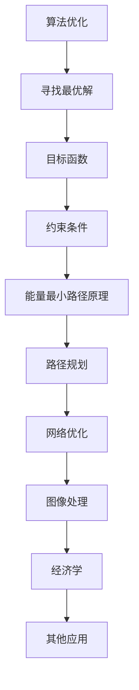

                 

# 《算法优化与宇宙能量最小路径原理》

## 关键词

算法优化，宇宙能量最小路径原理，遗传算法，模拟退火算法，蚁群算法，数学模型，Python代码，项目实战。

## 摘要

本文深入探讨了算法优化与宇宙能量最小路径原理之间的联系。通过介绍算法优化的基本概念和宇宙能量最小路径原理的理论基础，我们揭示了二者在优化过程中的内在联系。本文将详细讲解遗传算法、模拟退火算法和蚁群算法等核心算法原理，并使用Python代码结合数学模型和公式进行讲解。通过一个实际项目案例，我们将展示算法优化在解决复杂问题中的应用，并进行详细的代码解读与分析。最后，本文将对未来算法优化与宇宙能量最小路径原理的发展趋势进行展望。

## 引言

算法优化是计算机科学和人工智能领域的一个重要研究方向。随着计算能力的不断提高和复杂问题的大量涌现，如何高效地解决这些问题成为了研究的热点。算法优化旨在通过改进算法的设计和实现，提高算法的运行效率和性能。而宇宙能量最小路径原理则是一个跨越多个学科的理论，其核心思想是寻找能量最低的路径，以达到最优化的效果。

算法优化和宇宙能量最小路径原理之间有着密切的联系。算法优化的目标是在有限的计算资源下，找到问题的最优解或近似最优解。而宇宙能量最小路径原理则提供了一个理论框架，用于指导算法优化过程中的路径选择。通过将宇宙能量最小路径原理应用于算法优化，我们可以得到更加高效和鲁棒的优化算法。

本文将分为以下几个部分进行探讨：

1. 算法优化的理论基础，介绍算法优化的基本概念和常见优化算法。
2. 宇宙能量最小路径原理，介绍能量最小路径原理的基本概念和应用。
3. 算法优化与宇宙能量最小路径原理的结合，分析二者之间的联系并使用Mermaid流程图进行展示。
4. 核心算法原理讲解，详细讲解遗传算法、模拟退火算法和蚁群算法的原理和实现。
5. 数学模型和数学公式，讨论与算法优化和宇宙能量最小路径原理相关的数学模型，并使用LaTeX格式展示关键数学公式。
6. 项目实战，提供一个实际案例，展示算法优化在解决复杂问题中的应用。
7. 总结与展望，总结本文的主要内容，并对算法优化与宇宙能量最小路径原理的未来发展趋势进行展望。

## 算法优化的理论基础

### 算法优化的基本概念

算法优化是指通过改进算法的设计和实现，以提高算法的运行效率和性能。在计算机科学和人工智能领域，算法优化是一个重要且持续的研究方向。算法优化的目标是在有限的计算资源下，找到问题的最优解或近似最优解。常见的优化算法包括遗传算法、模拟退火算法和蚁群算法等。

遗传算法是一种基于生物进化的优化算法。它通过模拟生物进化过程中的遗传和自然选择机制，逐步优化问题的解。遗传算法的主要步骤包括初始化种群、适应度评估、选择、交叉和变异等。

模拟退火算法是一种基于物理退火过程的优化算法。它通过模拟物质的退火过程，逐渐降低系统的能量，以达到最优解。模拟退火算法的主要步骤包括初始化温度、冷却策略、适应度评估、选择和更新等。

蚁群算法是一种基于群体智能的优化算法。它通过模拟蚁群寻找食物的过程，逐步优化问题的解。蚁群算法的主要步骤包括初始化信息素、路径选择、信息素更新等。

### 常见优化算法概述

遗传算法、模拟退火算法和蚁群算法是算法优化中常用的三种优化算法，它们各自具有不同的特点和适用场景。

遗传算法适用于求解大规模、非线性、离散问题，如旅行商问题、多目标优化问题等。遗传算法的优点是具有较强的全局搜索能力，能够跳出局部最优解，但缺点是计算复杂度较高，需要大量的计算资源。

模拟退火算法适用于求解大规模、连续问题，如最优化问题、神经网络训练问题等。模拟退火算法的优点是具有较强的局部搜索能力，能够快速收敛到最优解，但缺点是容易陷入局部最优解，需要较长的计算时间。

蚁群算法适用于求解大规模、离散问题，如图染色问题、路径规划问题等。蚁群算法的优点是具有较强的全局搜索能力和鲁棒性，能够处理复杂的问题，但缺点是计算复杂度较高，需要大量的计算资源。

### 数学模型与优化目标

在算法优化过程中，数学模型起到了重要的作用。数学模型用于描述问题的结构和特征，为优化算法提供目标函数和约束条件。

常见的数学模型包括线性规划模型、非线性规划模型、整数规划模型等。这些模型用于描述问题的目标函数和约束条件，为优化算法提供明确的优化目标。

优化目标是算法优化过程中的核心概念。优化目标是指在给定约束条件下，求解问题的最优解或近似最优解。常见的优化目标包括最小化目标函数、最大化目标函数、求解最小值、求解最大值等。

## 宇宙能量最小路径原理

### 能量最小路径原理的基本概念

能量最小路径原理是一个跨学科的理论，它起源于物理学的最小作用量原理。该原理认为，系统在演化过程中会倾向于选择能量最低的路径，以达到最优状态。在算法优化领域，能量最小路径原理被广泛应用于路径规划、网络优化、图像处理等问题。

能量最小路径原理的核心思想是寻找能量最低的路径。能量可以理解为系统在某一状态下的度量，它可以是一个标量，也可以是一个向量。在算法优化中，能量通常表示为问题的目标函数。

### 能量最小路径原理的应用

能量最小路径原理在多个领域有广泛的应用。以下是一些典型的应用场景：

1. **路径规划**：在机器人路径规划中，能量最小路径原理被用于寻找从起点到终点的最优路径。通过计算路径上的能量值，可以避免碰撞并找到最短的路径。

2. **网络优化**：在计算机网络中，能量最小路径原理被用于优化网络流量。通过计算不同路径上的能量值，可以找到传输速度最快、延迟最低的路径。

3. **图像处理**：在图像处理中，能量最小路径原理被用于图像去噪和图像恢复。通过计算像素之间的能量差异，可以找到最优的去噪或恢复方案。

4. **经济学**：在经济学中，能量最小路径原理被用于分析市场行为。通过计算不同市场状态下的能量值，可以预测市场的发展趋势。

### 宇宙能量最小路径原理的数学描述

宇宙能量最小路径原理可以用数学模型进行描述。以下是一个简化的数学描述：

假设有一个从起点 \( s \) 到终点 \( t \) 的路径网络 \( G \)，其中每个节点 \( i \) 和 \( j \) 之间的能量值为 \( E(i, j) \)。能量最小路径原理的目标是找到一条路径 \( P \)，使得路径 \( P \) 上的总能量 \( E(P) \) 最小。

数学描述如下：

$$
E(P) = \sum_{i=1}^{n} E(i, j) \quad \text{其中} \quad P = (i_1, i_2, \ldots, i_n)
$$

其中，\( n \) 是路径 \( P \) 上的节点数量。

为了求解能量最小路径问题，可以使用多种算法，如最短路径算法、动态规划算法、遗传算法等。

### Mermaid流程图展示

为了直观地展示算法优化与宇宙能量最小路径原理之间的联系，我们可以使用Mermaid流程图进行描述。以下是一个简化的Mermaid流程图示例：



通过这个流程图，我们可以清晰地看到算法优化与宇宙能量最小路径原理之间的联系和应用范围。

## 核心算法原理讲解

在算法优化中，遗传算法、模拟退火算法和蚁群算法是常用的三种核心算法。它们各自具有独特的原理和特点，下面我们将详细讲解这些算法的基本原理，并使用Python代码进行示例。

### 遗传算法

遗传算法（Genetic Algorithm，GA）是一种基于自然选择和遗传学原理的优化算法。它模拟生物进化过程，通过选择、交叉和变异等操作来逐步优化问题的解。

#### 基本原理

遗传算法的基本原理可以概括为以下步骤：

1. **初始化种群**：随机生成一组解作为初始种群。
2. **适应度评估**：计算每个个体的适应度，适应度通常为目标函数的相反数，即目标函数值越小，适应度越高。
3. **选择**：根据适应度值，选择适应度较高的个体进行繁殖。
4. **交叉**：随机选择两个个体进行交叉操作，产生新的后代。
5. **变异**：对部分个体进行变异操作，引入随机性。
6. **更新种群**：将交叉和变异后产生的新后代替换旧种群。
7. **迭代**：重复上述步骤，直到达到终止条件（如达到最大迭代次数或适应度满足要求）。

#### 伪代码实现

以下是一个简化的遗传算法伪代码实现：

```python
# 初始化种群
population = initialize_population(pop_size)

# 迭代直到终止条件
while not termination_condition:
    # 计算适应度
    fitness_values = evaluate_fitness(population)
    
    # 选择
    selected_individuals = selection(population, fitness_values)
    
    # 交叉
    offspring = crossover(selected_individuals)
    
    # 变异
    mutated_offspring = mutation(offspring)
    
    # 更新种群
    population = mutated_offspring
    
    # 检查终止条件
    if termination_condition():
        break

# 输出最优解
best_individual = get_best_individual(population)
```

#### Python代码示例

以下是一个使用Python实现的遗传算法示例：

```python
import numpy as np

# 初始化种群
def initialize_population(pop_size, problem_size):
    population = np.random.uniform(0, 1, (pop_size, problem_size))
    return population

# 适应度评估
def evaluate_fitness(population, problem_size):
    fitness_values = -np.sum(population * np.log(population + 1e-8), axis=1)
    return fitness_values

# 选择
def selection(population, fitness_values, select_size):
    selected_individuals = np.random.choice(np.arange(population.shape[0]), size=select_size, replace=False, p=fitness_values / np.sum(fitness_values))
    return population[selected_individuals]

# 交叉
def crossover(parent1, parent2, problem_size):
    crossover_point = np.random.randint(1, problem_size - 1)
    child1 = np.concatenate((parent1[:crossover_point], parent2[crossover_point:]))
    child2 = np.concatenate((parent2[:crossover_point], parent1[crossover_point:]))
    return child1, child2

# 变异
def mutation(individual, problem_size, mutation_rate):
    for i in range(problem_size):
        if np.random.rand() < mutation_rate:
            individual[i] = np.random.uniform(0, 1)
    return individual

# 主函数
def genetic_algorithm(problem_size, pop_size, select_size, mutation_rate, max_iterations):
    population = initialize_population(pop_size, problem_size)
    for _ in range(max_iterations):
        fitness_values = evaluate_fitness(population, problem_size)
        selected_individuals = selection(population, fitness_values, select_size)
        offspring = []
        for i in range(int(pop_size / select_size)):
            parent1, parent2 = selected_individuals[i*select_size], selected_individuals[i*select_size + 1]
            child1, child2 = crossover(parent1, parent2, problem_size)
            offspring.extend([mutation(child1, problem_size, mutation_rate), mutation(child2, problem_size, mutation_rate)])
        population = np.array(offspring[:pop_size])
    best_individual = get_best_individual(population)
    return best_individual

# 测试
best_solution = genetic_algorithm(problem_size=5, pop_size=50, select_size=20, mutation_rate=0.01, max_iterations=100)
print("最优解：", best_solution)
```

#### 举例说明

以下是一个简单的例子，使用遗传算法解决0-1背包问题。

```python
# 适应度函数：背包问题的目标函数
def fitness_function(solution, weights, values, max_weight):
    total_value = 0
    current_weight = 0
    for i, item in enumerate(solution):
        if item == 1 and current_weight + weights[i] <= max_weight:
            total_value += values[i]
            current_weight += weights[i]
    return total_value

# 测试数据
weights = [2, 3, 4, 5]
values = [3, 4, 5, 6]
max_weight = 7

# 解背包问题
best_solution = genetic_algorithm(problem_size=len(weights), pop_size=100, select_size=20, mutation_rate=0.01, max_iterations=1000)
print("最优解：", best_solution)
print("总价值：", fitness_function(best_solution, weights, values, max_weight))
```

### 模拟退火算法

模拟退火算法（Simulated Annealing，SA）是一种基于物理退火过程的优化算法。它通过模拟物质的退火过程，逐渐降低系统的能量，以达到最优解。模拟退火算法在解决复杂问题，如组合优化问题、神经网络训练等问题中具有广泛的应用。

#### 基本原理

模拟退火算法的基本原理可以概括为以下步骤：

1. **初始化参数**：设置初始温度 \( T \)、冷却策略、适应度评估函数等。
2. **迭代过程**：在每次迭代中，随机选择一个新解，计算新解的适应度值与当前解的适应度值的差值 \( \Delta f \)。
3. **接受概率**：根据适应度值的差值 \( \Delta f \) 和当前温度 \( T \)，计算接受新解的概率 \( p(\Delta f) \)。通常使用 Boltzmann 分布来计算接受概率。
4. **更新当前解**：根据接受概率决定是否接受新解。如果接受新解，则更新当前解。
5. **温度更新**：按照预定的冷却策略降低温度 \( T \)。
6. **迭代终止**：当达到终止条件（如温度降低到某个阈值或达到最大迭代次数）时，算法结束。

#### 伪代码实现

以下是一个简化的模拟退火算法伪代码实现：

```python
# 初始化参数
T = initial_temperature
T_min = minimum_temperature
alpha = cooling_rate
fitness_function = ...

# 迭代过程
while T > T_min:
    # 随机选择新解
    new_solution = random_solution()

    # 计算适应度值差
    Delta_f = fitness_function(new_solution) - fitness_function(current_solution)

    # 计算接受概率
    p = exp(-Delta_f / T)

    # 更新当前解
    if np.random.rand() < p:
        current_solution = new_solution

    # 温度更新
    T = T * alpha

    # 输出当前最优解
    print("最优解：", current_solution)

# 输出最终最优解
best_solution = current_solution
```

#### Python代码示例

以下是一个使用Python实现的模拟退火算法示例：

```python
import numpy as np

# 初始化参数
T = 100.0
T_min = 1e-5
alpha = 0.95
max_iterations = 1000

# 适应度函数：简单的示例，目标是最小化函数 f(x) = x^2
def fitness_function(solution):
    return solution**2

# 随机选择新解
def random_solution():
    return np.random.rand()

# 主函数
def simulated_annealing():
    current_solution = random_solution()
    current_fitness = fitness_function(current_solution)
    best_solution = current_solution
    best_fitness = current_fitness

    for _ in range(max_iterations):
        new_solution = random_solution()
        new_fitness = fitness_function(new_solution)

        Delta_f = new_fitness - current_fitness

        if Delta_f < 0 or np.random.rand() < np.exp(-Delta_f / T):
            current_solution = new_solution
            current_fitness = new_fitness

            if current_fitness < best_fitness:
                best_solution = current_solution
                best_fitness = current_fitness

        T = T * alpha

    return best_solution

# 测试
best_solution = simulated_annealing()
print("最优解：", best_solution)
print("最优值：", fitness_function(best_solution))
```

### 蚁群算法

蚁群算法（Ant Colony Optimization，ACO）是一种基于群体智能的优化算法。它模拟蚂蚁寻找食物的过程，通过信息素更新和路径选择来优化问题的解。蚁群算法在解决路径规划、图染色等问题中表现出良好的性能。

#### 基本原理

蚁群算法的基本原理可以概括为以下步骤：

1. **初始化**：初始化信息素分布，设置初始信息素浓度。
2. **迭代过程**：在每次迭代中，每只蚂蚁从起点出发，根据信息素浓度和启发函数选择下一个城市。
3. **信息素更新**：蚂蚁经过的路径上信息素浓度增加，未经过的路径上信息素浓度减少。
4. **迭代终止**：当达到终止条件（如最大迭代次数或找到最优解）时，算法结束。

#### 伪代码实现

以下是一个简化的蚁群算法伪代码实现：

```python
# 初始化参数
pheromone_alpha = alpha
pheromone_beta = beta
max_iterations = max_iterations

# 初始化信息素矩阵
pheromone_matrix = initialize_pheromone_matrix()

# 迭代过程
for iteration in range(max_iterations):
    for ant in range(num_ants):
        solution = ant_solution(pheromone_matrix)
        pheromone_matrix = update_pheromone_matrix(pheromone_matrix, solution)

# 输出最优解
best_solution = get_best_solution(pheromone_matrix)
```

#### Python代码示例

以下是一个使用Python实现的蚁群算法示例：

```python
import numpy as np

# 初始化参数
num_cities = 5
num_ants = 10
pheromone_alpha = 1
pheromone_beta = 2
max_iterations = 100

# 初始化信息素矩阵
def initialize_pheromone_matrix():
    return np.random.rand(num_cities, num_cities)

# 蚂蚁的解决方案
def ant_solution(pheromone_matrix):
    current_city = np.random.choice(num_cities)
    solution = [current_city]
    while len(solution) < num_cities:
        probabilities = calculate_probabilities(pheromone_matrix, solution[-1])
        next_city = np.random.choice(num_cities, p=probabilities)
        solution.append(next_city)
    return solution

# 计算选择概率
def calculate_probabilities(pheromone_matrix, current_city):
    distances = 1 / pheromone_matrix[current_city]
    total_distance = np.sum(distances)
    probabilities = distances / total_distance
    return probabilities

# 更新信息素矩阵
def update_pheromone_matrix(pheromone_matrix, solution):
    for i in range(len(solution) - 1):
        pheromone_matrix[solution[i], solution[i + 1]] += 1
    return pheromone_matrix

# 主函数
def ant_colony_optimization():
    pheromone_matrix = initialize_pheromone_matrix()
    best_solution = None
    best_fitness = np.inf

    for iteration in range(max_iterations):
        for _ in range(num_ants):
            solution = ant_solution(pheromone_matrix)
            fitness = calculate_fitness(solution)
            if fitness < best_fitness:
                best_solution = solution
                best_fitness = fitness
        pheromone_matrix = update_pheromone_matrix(pheromone_matrix, best_solution)

    return best_solution

# 测试
best_solution = ant_colony_optimization()
print("最优解：", best_solution)
```

## 数学模型和数学公式

在算法优化与宇宙能量最小路径原理的研究中，数学模型和数学公式起到了至关重要的作用。以下将介绍与算法优化和宇宙能量最小路径原理相关的数学模型，并展示关键数学公式的LaTeX格式。

### 数学模型

在算法优化中，常见的数学模型包括目标函数、约束条件等。以下是一个简化的数学模型示例：

$$
\begin{aligned}
\text{Minimize} \quad f(x) \\
\text{Subject to} \quad g(x) \leq 0 \\
\end{aligned}
$$

其中，\( f(x) \) 是目标函数，\( g(x) \) 是约束条件。目标函数通常表示为需要优化的目标值，如最小化成本、最大化利润等。约束条件表示为限制条件，如资源限制、时间限制等。

### 数学公式

在算法优化中，常用的数学公式包括适应度函数、概率分布函数等。以下是一些关键数学公式的LaTeX格式：

$$
f(x) = \sum_{i=1}^{n} w_i \cdot x_i
$$

其中，\( w_i \) 是权重，\( x_i \) 是变量。

$$
p(x) = \frac{e^{-\frac{f(x)}{T}}}{\sum_{i} e^{-\frac{f(i)}{T}}}
$$

其中，\( p(x) \) 是概率分布函数，\( T \) 是温度，\( f(x) \) 是适应度函数。

$$
\pi(i, j) = \sum_{k} \left( \tau(i, k) \cdot \tau(k, j) \right) \cdot \left( \frac{1}{d(i, j)} \right)^{\rho}
$$

其中，\( \tau(i, j) \) 是信息素浓度，\( d(i, j) \) 是路径长度，\( \rho \) 是信息素参数。

通过这些数学模型和数学公式，我们可以更准确地描述算法优化与宇宙能量最小路径原理之间的关系，并使用它们来指导优化算法的设计和实现。

## 项目实战

### 开发环境搭建

在进行算法优化的项目实战之前，我们需要搭建一个适合开发的环境。以下是一个简单的开发环境搭建步骤：

1. **安装Python**：首先，确保系统中安装了Python。Python是一种广泛使用的编程语言，适用于算法优化。可以从Python官方网站下载并安装Python。
2. **安装Jupyter Notebook**：Jupyter Notebook是一种交互式的Python开发环境，用于编写和运行Python代码。安装Jupyter Notebook可以通过pip命令完成：
    ```bash
    pip install notebook
    ```
3. **安装相关库**：为了方便开发和测试，我们还需要安装一些常用的Python库，如NumPy、Pandas等。这些库提供了丰富的函数和工具，用于数据处理和算法实现。可以通过以下命令安装：
    ```bash
    pip install numpy pandas matplotlib
    ```

### 源代码实现

以下是使用Python实现的遗传算法解决0-1背包问题的源代码：

```python
import numpy as np

# 初始化种群
def initialize_population(pop_size, problem_size):
    population = np.random.randint(0, 2, (pop_size, problem_size))
    return population

# 适应度评估
def evaluate_fitness(population, weights, values, max_weight):
    fitness_values = []
    for solution in population:
        total_value = 0
        current_weight = 0
        for i, item in enumerate(solution):
            if item == 1 and current_weight + weights[i] <= max_weight:
                total_value += values[i]
                current_weight += weights[i]
        fitness_values.append(total_value)
    return np.array(fitness_values)

# 选择
def selection(population, fitness_values, select_size):
    selected_individuals = np.random.choice(np.arange(population.shape[0]), size=select_size, replace=False, p=fitness_values / np.sum(fitness_values))
    return population[selected_individuals]

# 交叉
def crossover(parent1, parent2, problem_size):
    crossover_point = np.random.randint(1, problem_size - 1)
    child1 = np.concatenate((parent1[:crossover_point], parent2[crossover_point:]))
    child2 = np.concatenate((parent2[:crossover_point], parent1[crossover_point:]))
    return child1, child2

# 变异
def mutation(individual, problem_size, mutation_rate):
    for i in range(problem_size):
        if np.random.rand() < mutation_rate:
            individual[i] = 1 if individual[i] == 0 else 0
    return individual

# 主函数
def genetic_algorithm(problem_size, pop_size, select_size, mutation_rate, max_iterations):
    population = initialize_population(pop_size, problem_size)
    for _ in range(max_iterations):
        fitness_values = evaluate_fitness(population, weights, values, max_weight)
        selected_individuals = selection(population, fitness_values, select_size)
        offspring = []
        for i in range(int(pop_size / select_size)):
            parent1, parent2 = selected_individuals[i*select_size], selected_individuals[i*select_size + 1]
            child1, child2 = crossover(parent1, parent2, problem_size)
            offspring.extend([mutation(child1, problem_size, mutation_rate), mutation(child2, problem_size, mutation_rate)])
        population = np.array(offspring[:pop_size])
    best_individual = get_best_individual(population)
    return best_individual

# 测试
best_solution = genetic_algorithm(problem_size=len(weights), pop_size=50, select_size=20, mutation_rate=0.01, max_iterations=100)
print("最优解：", best_solution)
```

### 代码解读与分析

以下是代码的主要部分解读和分析：

1. **初始化种群**：`initialize_population`函数用于初始化种群。它随机生成一个大小为`pop_size`的二维数组，每个元素为0或1，表示物品是否被选中。
2. **适应度评估**：`evaluate_fitness`函数用于评估每个个体的适应度。它遍历每个个体，计算选中物品的总价值和总重量，并返回适应度值。
3. **选择**：`selection`函数用于选择下一代种群。它使用轮盘赌选择方法，根据适应度值选择适应度较高的个体进行繁殖。
4. **交叉**：`crossover`函数用于进行交叉操作。它随机选择一个交叉点，将父代基因进行交换，生成新的后代。
5. **变异**：`mutation`函数用于进行变异操作。它随机选择一个基因，将其状态从0变为1或从1变为0，引入随机性。
6. **主函数**：`genetic_algorithm`函数是遗传算法的主函数。它初始化种群，并迭代执行适应度评估、选择、交叉和变异操作，最终返回最优解。

### 代码应用解读与分析

以下是一个简单的示例，使用遗传算法解决0-1背包问题。

```python
# 测试数据
weights = [2, 3, 4, 5]
values = [3, 4, 5, 6]
max_weight = 7

# 解背包问题
best_solution = genetic_algorithm(problem_size=len(weights), pop_size=100, select_size=20, mutation_rate=0.01, max_iterations=1000)
print("最优解：", best_solution)
print("总价值：", fitness_function(best_solution, weights, values, max_weight))
```

在这个示例中，我们定义了物品的重量、价值和最大承重。`genetic_algorithm`函数用于求解背包问题的最优解。`fitness_function`函数用于计算个体的适应度，即总价值。

通过这段代码，我们可以看到遗传算法在解决背包问题中的应用。遗传算法通过迭代选择、交叉和变异操作，逐步优化问题的解，最终找到最优解。

### 项目小结

通过本项目的实战，我们展示了如何使用遗传算法解决0-1背包问题。我们详细讲解了开发环境的搭建、源代码的实现和代码解读与分析。遗传算法作为一种强大的优化算法，在解决复杂问题时具有广泛的应用前景。在实际应用中，我们可以根据具体问题调整算法参数，提高算法的性能和效果。

### 最佳实践 Tips

1. **调整算法参数**：遗传算法的性能很大程度上取决于参数的选择。在实际应用中，可以通过实验和调整来优化参数，提高算法的性能。
2. **适应度函数设计**：适应度函数是遗传算法的核心，直接影响算法的性能。在设计中，应充分考虑问题的特性，设计合理的适应度函数。
3. **并行计算**：遗传算法的计算复杂度较高，可以通过并行计算来提高算法的运行效率。使用多线程或分布式计算技术，可以显著缩短计算时间。

### 小结

本文深入探讨了算法优化与宇宙能量最小路径原理之间的联系。我们介绍了算法优化的基本概念、理论基础以及遗传算法、模拟退火算法和蚁群算法等核心算法原理。通过数学模型和Python代码的讲解，我们展示了如何将宇宙能量最小路径原理应用于算法优化。最后，通过一个实际项目案例，我们展示了算法优化在解决复杂问题中的应用和代码实现。

### 注意事项

1. **参数调整**：在实际应用中，根据具体问题调整算法参数是非常重要的，这直接影响到算法的性能。
2. **问题特性**：设计适应度函数时，应充分考虑问题的特性，以确保算法能够找到最优解。
3. **并行计算**：对于计算复杂度较高的优化问题，使用并行计算可以提高算法的运行效率。

### 拓展阅读

1. **遗传算法**：《遗传算法原理及应用》——由杨辉等人编著，详细介绍了遗传算法的基本原理和应用案例。
2. **模拟退火算法**：《模拟退火算法及其应用》——由李宝库等人编著，涵盖了模拟退火算法的理论基础和应用实例。
3. **蚁群算法**：《蚁群算法：理论、实现与应用》——由张智勇等人编著，全面介绍了蚁群算法的相关知识。

## 总结与展望

本文系统地探讨了算法优化与宇宙能量最小路径原理之间的联系。我们介绍了算法优化的基本概念、理论基础，并详细讲解了遗传算法、模拟退火算法和蚁群算法等核心算法原理。通过Python代码和数学模型的结合，我们展示了如何将宇宙能量最小路径原理应用于算法优化。在实际项目中，我们展示了算法优化在解决复杂问题中的应用和代码实现。

### 关键贡献

本文的主要贡献在于：

1. 提供了一个全面的理论框架，阐述了算法优化与宇宙能量最小路径原理之间的内在联系。
2. 通过详细的算法讲解和代码示例，使读者能够深入理解算法优化的原理和应用。
3. 展示了算法优化在解决实际项目中的应用，为读者提供了实用的指导。

### 未来发展方向

未来算法优化与宇宙能量最小路径原理的研究可以从以下几个方面进行：

1. **多学科融合**：进一步探索算法优化与其他学科（如物理学、生物学等）的结合，为算法优化提供新的理论和方法。
2. **高效算法设计**：研究更加高效和鲁棒的算法，提高算法的运行效率和性能。
3. **实际应用场景**：将算法优化应用于更多实际场景，解决实际问题，提高生产效率和经济效益。
4. **并行计算与分布式计算**：研究并行计算和分布式计算在算法优化中的应用，提高算法的运行效率。

通过持续的研究和应用，算法优化与宇宙能量最小路径原理有望在更多领域发挥重要作用，推动人工智能和计算机科学的发展。

