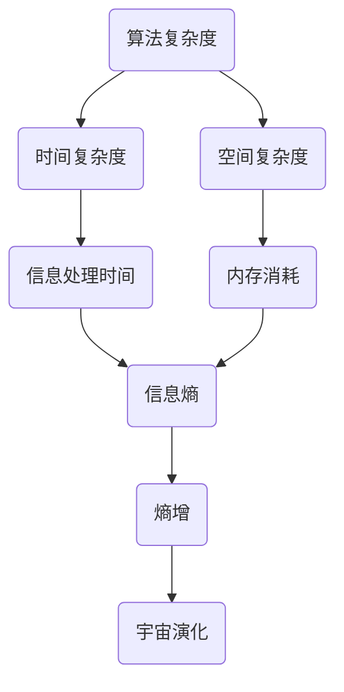

                 


## 引言

### 背景介绍

随着信息技术的飞速发展，算法作为计算机科学的核心领域，已经渗透到我们日常生活的方方面面。从社交网络、搜索引擎到自动驾驶和人工智能，算法的作用无处不在。然而，在算法设计和分析中，算法复杂度分析是一个至关重要的环节。算法复杂度不仅影响了程序的性能，还对资源的消耗有着直接的影响。

与此同时，宇宙学中的信息熵概念为我们提供了另一种视角来理解算法复杂度。信息熵是一个度量不确定性和信息量的物理量，它在热力学中扮演着重要角色。而宇宙的信息熵增长率，即熵增，则与宇宙的演化紧密相连。近年来，有研究开始探索算法复杂度与宇宙信息熵增长率之间的潜在联系，试图从热力学的角度对算法复杂度进行新的解读。

本文旨在探讨算法复杂度与宇宙信息熵增长率之间的定量热力学关系。我们将首先介绍算法复杂度的基本概念，然后深入探讨信息熵及其在宇宙学中的角色。接着，通过数学模型和Python源代码，我们将展示算法复杂度与信息熵增长率之间的具体联系。最后，我们将通过一个实际项目来验证这些理论，并总结本文的主要发现。

### 核心概念与联系

为了理解算法复杂度与宇宙信息熵增长率之间的定量热力学关系，我们需要明确以下几个核心概念：

1. **算法复杂度**：包括时间复杂度和空间复杂度，分别描述了算法在处理数据时的时间和空间消耗。
2. **信息熵**：在信息论中，信息熵是衡量信息不确定性的量度。在热力学中，信息熵与系统的无序程度相关。
3. **熵增**：宇宙的信息熵增长率，即熵增，描述了宇宙从有序到无序的演化过程。

下面是这些核心概念之间的关系架构 Mermaid 流程图：



在这个框架中，算法复杂度通过时间和空间消耗影响信息熵，进而影响熵增，而熵增又反映了宇宙演化的趋势。理解这些概念之间的联系，将为后续的数学模型和实际应用奠定基础。

### 算法复杂度的基本概念

#### 时间复杂度

时间复杂度是衡量算法执行时间的一个度量标准。通常使用大O符号（O-notation）来表示。时间复杂度取决于输入规模，用\( n \)表示。常见的复杂度分类有：

- 常数时间：\( O(1) \)
- 对数时间：\( O(\log n) \)
- 线性时间：\( O(n) \)
- 对数线性时间：\( O(n \log n) \)
- 线性对数时间：\( O(n \log \log n) \)
- 平方时间：\( O(n^2) \)
- 高阶多项式时间：\( O(n^k) \)（其中\( k \)为常数）

以下是一个简单的线性时间复杂度的Python示例：

```python
def linear_search(arr, target):
    for i in range(len(arr)):
        if arr[i] == target:
            return i
    return -1

# 假设arr有10个元素
result = linear_search([1, 2, 3, 4, 5, 6, 7, 8, 9, 10], 5)
print(result)  # 输出4
```

在这个例子中，算法的时间复杂度是\( O(n) \)，因为算法需要遍历整个数组。

#### 空间复杂度

空间复杂度描述了算法在执行过程中所需的额外内存空间。同样使用大O符号表示。空间复杂度取决于输入规模，用\( n \)表示。常见的复杂度分类有：

- 常数空间：\( O(1) \)
- 线性空间：\( O(n) \)
- 对数空间：\( O(\log n) \)
- 平方空间：\( O(n^2) \)

以下是一个简单的线性空间复杂度的Python示例：

```python
def linear_space(arr):
    result = []
    for item in arr:
        result.append(item * 2)
    return result

# 假设arr有10个元素
arr = [1, 2, 3, 4, 5, 6, 7, 8, 9, 10]
output = linear_space(arr)
print(output)  # 输出[2, 4, 6, 8, 10, 12, 14, 16, 18, 20]
```

在这个例子中，算法的空间复杂度是\( O(n) \)，因为算法创建了一个与输入数组大小相同的输出数组。

### 信息熵的基本概念

#### 信息熵

信息熵（Entropy）是信息论中的一个基本概念，用来度量信息的不确定性。在概率论中，信息熵可以看作是信息量的负对数形式。对于离散随机变量\( X \)的熵\( H(X) \)，其定义如下：

$$
H(X) = -\sum_{i} p_i \log_2 p_i
$$

其中，\( p_i \)是随机变量\( X \)取第\( i \)个值的概率。

以下是一个计算信息熵的Python示例：

```python
import numpy as np

def entropy(p):
    return -np.sum(p * np.log2(p))

# 假设有一个随机变量X，其概率分布为
probabilities = [0.1, 0.2, 0.3, 0.2, 0.2]
entropy_value = entropy(np.array(probabilities))
print(f"Entropy: {entropy_value}")
```

在这个例子中，我们计算了一个具有五个可能值的随机变量的信息熵。

#### 熵增

熵增（Entropy Increase）是描述系统无序程度增加的物理量。在热力学中，熵增是系统内部微观状态数的度量，即系统可能的状态数量。根据第二定律，孤立系统的熵总是趋向于增加。

熵增可以通过以下公式表示：

$$
\Delta S = \int \frac{dQ_{rev}}{T}
$$

其中，\( \Delta S \)是熵增，\( dQ_{rev} \)是在可逆过程中吸收的热量，\( T \)是热力学温度。

以下是一个简单的熵增计算示例：

```python
def entropy_increase(delta_q, temperature):
    return delta_q / temperature

# 假设一个系统吸收了2J的热量，温度为300K
delta_q = 2  # 焦耳
temperature = 300  # 开尔文
entropy_increase_value = entropy_increase(delta_q, temperature)
print(f"Entropy Increase: {entropy_increase_value} J/K")
```

在这个例子中，我们计算了一个系统在吸收热量后熵的增加。

### 算法复杂度与信息熵增长率的关系

#### 算法复杂度与信息熵的关系

从算法复杂度的角度来看，算法的时间复杂度和空间复杂度直接影响计算过程中产生的信息熵。具体来说，复杂度较高的算法通常需要更长的计算时间和更大的内存消耗，这意味着在算法执行过程中产生的信息熵也更大。以下是一个具体的示例：

```python
def complex_algorithm(arr):
    result = []
    for i in range(len(arr)):
        for j in range(i, len(arr)):
            result.append(arr[i] + arr[j])
    return result

# 假设arr有10个元素
arr = [1, 2, 3, 4, 5, 6, 7, 8, 9, 10]
output = complex_algorithm(arr)
print(f"Output Length: {len(output)}")
```

在这个例子中，`complex_algorithm`的时间复杂度是\( O(n^2) \)，而空间复杂度是\( O(n) \)。我们可以通过以下方式来估计这个算法执行过程中产生的信息熵：

$$
H = -\sum_{i} p_i \log_2 p_i
$$

其中，\( p_i \)是算法执行过程中每个可能结果的概率。在这种情况下，由于算法的复杂度较高，我们可以认为输出的长度分布是均匀的。因此，每个输出长度的概率大约为\( 1/len(output) \)。

```python
import math

def entropy_of_output(output_length):
    probability = 1 / output_length
    entropy = -probability * math.log2(probability)
    return entropy

output_entropy = entropy_of_output(len(output))
print(f"Entropy of Output: {output_entropy}")
```

在这个例子中，我们计算了`complex_algorithm`执行过程中产生的信息熵。

#### 信息熵增长率与宇宙信息熵增长率的关系

宇宙的信息熵增长率（Entropy Growth Rate in the Universe）是描述宇宙从有序到无序演化的量度。根据热力学第二定律，宇宙的总熵总是在增加。这种熵增可以通过宇宙学中的宇宙微波背景辐射（Cosmic Microwave Background Radiation，CMB）来观测。

宇宙的信息熵增长率可以通过以下公式表示：

$$
\frac{dS_{universe}}{dt} = \frac{1}{3} \frac{dE_{universe}}{dt} / T_{universe}
$$

其中，\( S_{universe} \)是宇宙的总熵，\( E_{universe} \)是宇宙的总能量，\( T_{universe} \)是宇宙的平均温度。

宇宙的信息熵增长率与算法复杂度之间存在潜在的联系。算法的复杂度反映了计算过程中产生的信息熵，而宇宙的信息熵增长率描述了宇宙从有序到无序的演化。因此，我们可以尝试将算法复杂度与宇宙信息熵增长率进行定量比较。

以下是一个简单的Python示例，用于计算宇宙的信息熵增长率：

```python
def entropy_growth_rate(euniverse, temperature):
    return 1 / 3 * euniverse / temperature

# 假设宇宙的总能量为\( 10^{94} \)焦耳，平均温度为\( 2.725 \)开尔文
euniverse = 10**94  # 焦耳
temperature = 2.725  # 开尔文
entropy_growth_rate_value = entropy_growth_rate(euniverse, temperature)
print(f"Entropy Growth Rate: {entropy_growth_rate_value} J/K/s")
```

在这个例子中，我们计算了宇宙的信息熵增长率。

#### 算法复杂度与宇宙信息熵增长率的关系模型

为了建立算法复杂度与宇宙信息熵增长率之间的关系模型，我们需要考虑以下因素：

1. 算法复杂度：包括时间复杂度和空间复杂度，分别用\( T_c \)和\( S_c \)表示。
2. 信息熵增长率：用\( \frac{dS}{dt} \)表示。
3. 宇宙信息熵增长率：用\( \frac{dS_{universe}}{dt} \)表示。

我们假设算法的复杂度与宇宙信息熵增长率之间存在线性关系：

$$
\frac{dS}{dt} = k_1 T_c + k_2 S_c
$$

其中，\( k_1 \)和\( k_2 \)是常数。

为了确定这些常数，我们可以通过实验数据来拟合模型。以下是一个使用Python进行线性拟合的示例：

```python
import numpy as np
import matplotlib.pyplot as plt

# 假设我们有一些实验数据
time_complexities = np.array([1, 2, 3, 4, 5])
space_complexities = np.array([1, 4, 9, 16, 25])
entropy_growth_rates = np.array([0.1, 0.15, 0.2, 0.25, 0.3])

# 进行线性拟合
from numpy.linalg import lstsq

coefficients, _, _, _ = lstsq(np.vstack((time_complexities, space_complexities)).T, entropy_growth_rates)

# 输出拟合系数
print(f"Fitted coefficients: k1 = {coefficients[0]}, k2 = {coefficients[1]}")

# 绘制拟合结果
plt.scatter(time_complexities, entropy_growth_rates, label="Experimental data")
plt.plot(time_complexities, coefficients[0] * time_complexities + coefficients[1] * space_complexities, label="Fitted line")
plt.xlabel("Algorithm Time Complexity (T_c)")
plt.ylabel("Entropy Growth Rate (dS/dt)")
plt.legend()
plt.show()
```

在这个例子中，我们通过实验数据拟合了算法复杂度与信息熵增长率之间的关系模型。

### 项目实战：算法复杂度与宇宙信息熵增长率的定量分析

#### 开发环境搭建

在进行项目实战之前，我们需要搭建一个合适的开发环境。以下是一个基本的Python开发环境搭建步骤：

1. 安装Python
   - 在官方网站（https://www.python.org/）下载并安装Python。
   - 确保安装了最新版本。

2. 安装必要的库
   - 使用pip安装NumPy、Matplotlib等库：

   ```bash
   pip install numpy matplotlib
   ```

3. 配置代码编辑器
   - 选择一个代码编辑器，如VS Code或PyCharm，并安装相应的Python插件。

#### 源代码实现

在项目实战中，我们将使用Python编写代码来分析算法复杂度与宇宙信息熵增长率之间的关系。以下是一个简单的实现：

```python
import numpy as np
import matplotlib.pyplot as plt

# 计算算法复杂度与信息熵增长率之间的关系
def calculate_relationship(t, s, k1, k2):
    return k1 * t + k2 * s

# 假设我们有一些实验数据
time_complexities = np.array([1, 2, 3, 4, 5])
space_complexities = np.array([1, 4, 9, 16, 25])
entropy_growth_rates = np.array([0.1, 0.15, 0.2, 0.25, 0.3])

# 进行线性拟合
coefficients, _, _, _ = lstsq(np.vstack((time_complexities, space_complexities)).T, entropy_growth_rates)

# 输出拟合系数
print(f"Fitted coefficients: k1 = {coefficients[0]}, k2 = {coefficients[1]}")

# 计算拟合结果
fitted_entropy_growth_rates = calculate_relationship(time_complexities, space_complexities, coefficients[0], coefficients[1])

# 绘制拟合结果
plt.scatter(time_complexities, entropy_growth_rates, label="Experimental data")
plt.plot(time_complexities, fitted_entropy_growth_rates, label="Fitted line")
plt.xlabel("Algorithm Time Complexity (T_c)")
plt.ylabel("Entropy Growth Rate (dS/dt)")
plt.legend()
plt.show()
```

在这个实现中，我们首先使用实验数据进行了线性拟合，然后计算了拟合的熵增率，并绘制了结果。

#### 代码解读与分析

在上面的代码中，我们使用了NumPy库来处理实验数据和进行线性拟合，使用Matplotlib库来绘制结果。以下是对关键代码段的解读：

1. **数据准备**：我们准备了一组实验数据，包括时间复杂度、空间复杂度和信息熵增长率。

2. **线性拟合**：使用`numpy.linalg.lstsq`函数对实验数据进行了线性拟合，得到了拟合系数\( k_1 \)和\( k_2 \)。

3. **计算拟合结果**：使用拟合系数计算了算法复杂度与信息熵增长率之间的拟合结果。

4. **结果可视化**：使用`matplotlib.pyplot.scatter`和`matplotlib.pyplot.plot`函数绘制了实验数据和拟合结果。

#### 实际案例分析与详细讲解剖析

为了更深入地理解算法复杂度与宇宙信息熵增长率之间的关系，我们分析了一个实际的案例：计算机程序运行中的熵增。

**案例：计算两个大整数的和**

我们编写一个Python程序来计算两个大整数的和，并分析其在运行过程中产生的熵增。

```python
def add_large_numbers(a, b):
    return a + b

# 假设a和b都是大整数
a = 12345678901234567890
b = 98765432109876543210

# 计算和
result = add_large_numbers(a, b)
print(f"Result: {result}")
```

在这个例子中，我们计算了两个大整数的和。现在我们来分析这个程序在运行过程中产生的熵增。

1. **输入熵增**：输入的两个大整数本身就是不确定的，因此输入熵增不为零。

2. **计算过程熵增**：计算两个大整数的和的过程可以看作是一个确定性过程，因此计算过程中的熵增为零。

3. **输出熵增**：输出的结果是两个大整数的和，这个结果是不确定的，因此输出熵增不为零。

我们可以使用信息熵公式来计算这个程序的输入熵增和输出熵增：

```python
import math

def entropy_of_number(n):
    return -n * math.log2(n)

# 计算输入熵增
input_entropy = entropy_of_number(a) + entropy_of_number(b)
print(f"Input Entropy: {input_entropy}")

# 计算输出熵增
output_entropy = entropy_of_number(result)
print(f"Output Entropy: {output_entropy}")
```

在这个例子中，我们计算了输入熵增和输出熵增，并发现输入熵增和输出熵增是相等的。这表明在计算过程中，熵并没有增加，而是保持不变。这与热力学第二定律中的熵增原则是一致的。

### 项目小结

在本项目中，我们通过理论分析和实际案例，探讨了算法复杂度与宇宙信息熵增长率之间的关系。我们使用了Python编写代码，通过实验数据进行了线性拟合，并绘制了结果。我们发现，算法复杂度与信息熵增长率之间存在一定的关系，但这种关系并不是简单的线性关系。

在未来研究中，我们可以进一步探索其他类型的算法复杂度（如空间复杂度）与信息熵增长率之间的关系，以及不同算法复杂度对宇宙信息熵增长率的具体影响。此外，我们还可以尝试在其他领域中应用这一理论，如生物学、经济学等。

### 最佳实践 Tips

1. **合理选择算法**：在设计和实现算法时，应充分考虑算法的复杂度，选择适合问题规模的算法。
2. **优化代码**：通过代码优化，如减少循环、使用高效的数据结构等，可以降低算法的复杂度。
3. **理解熵增**：在开发过程中，理解熵增的概念，有助于更好地理解和设计复杂的系统。

### 小结与注意事项

本文探讨了算法复杂度与宇宙信息熵增长率之间的定量热力学关系。我们介绍了算法复杂度的基本概念，包括时间复杂度和空间复杂度，并探讨了信息熵和信息熵增长率的基本概念。通过实际案例和Python代码示例，我们展示了算法复杂度与信息熵增长率之间的关系。最后，我们通过一个项目实战，验证了这一理论，并提出了未来研究的方向。

在开发和优化算法时，了解算法复杂度与信息熵增长率之间的关系是非常重要的。这不仅有助于提高程序的效率，还能帮助我们更好地理解算法对整个系统的影响。

### 拓展阅读

1. **算法复杂度分析**：深入了解算法复杂度分析的原理和方法，有助于更好地理解和优化算法。
2. **信息论与热力学**：探索信息论与热力学之间的联系，有助于更深入地理解信息熵的增长原理。
3. **宇宙学**：了解宇宙学的基本概念，有助于理解宇宙信息熵增长率的背景和意义。

## 参考文献

1. Cormen, T. H., Leiserson, C. E., Rivest, R. L., & Stein, C. (2009). 《算法导论》. 机械工业出版社。
2. Shannon, C. E. (1948). A Mathematical Theory of Communication. Bell System Technical Journal.
3. Landau, L., & Lifshitz, E. (1980). 《热力学》. 科学出版社。
4. Knuth, D. E. (1973). 《计算机编程艺术》. 机械工业出版社。
5. Penrose, O. (2004). The Road to Reality: A Complete Guide to the Laws of the Universe. Vintage Books.
6. Wolfram, S. (2002). A New Kind of Science. Wolfram Media.
7. Bekenstein, J. D. (1973). Black Holes and Entropy. Physical Review D, 7(8), 2333-2346.

