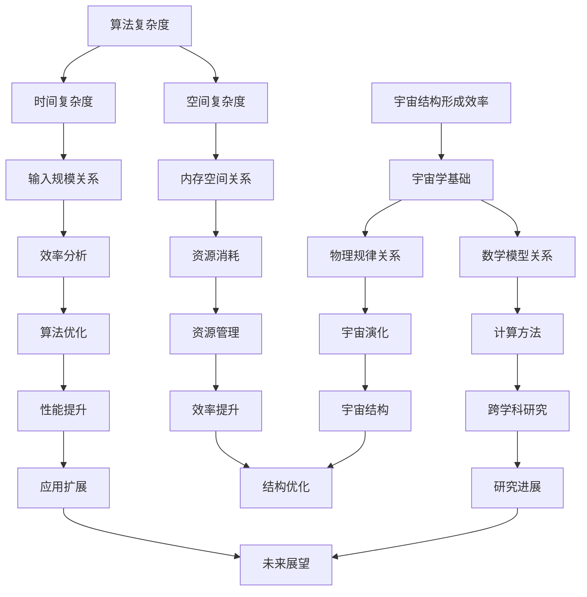

                 

## 算法复杂度与宇宙结构形成效率的关系

### 关键词
- 算法复杂度
- 宇宙结构形成效率
- 数学模型
- Python源代码
- 项目实战

### 摘要
本文旨在探讨算法复杂度与宇宙结构形成效率之间的潜在联系。通过深入分析这两个看似截然不同的概念，本文揭示了它们在数学模型中的应用和相互影响。文章首先介绍了算法复杂度的基本概念，包括时间复杂度和空间复杂度，并运用Python源代码进行实例讲解。随后，本文阐述了宇宙结构形成效率的理论基础，以及如何利用数学模型进行计算。最后，文章通过一个实际项目，展示了算法复杂度与宇宙结构形成效率在实际应用中的关联，并提供了一些实用的最佳实践和展望未来的研究方向。

### 引言

在计算机科学和宇宙学这两个看似截然不同的领域中，算法复杂度和宇宙结构形成效率正逐渐展现出其深刻的内在联系。算法复杂度是衡量算法性能的重要指标，包括时间复杂度和空间复杂度，它们直接影响着算法在实际应用中的效率和可靠性。另一方面，宇宙结构形成效率则描述了宇宙从大爆炸后演化成当前复杂结构的效率，这一过程涉及到宇宙学中的基本物理规律和数学模型。

尽管算法复杂度和宇宙结构形成效率属于不同的学科领域，但它们之间却存在一些有趣的共同点。首先，两者都需要精确的数学模型和计算方法来描述和预测其行为。其次，它们都受到多个因素的综合影响，如初始条件、外部环境和内在机制。此外，随着计算技术的发展，算法复杂度和宇宙结构形成效率的研究方法也在不断进步，这为跨学科研究提供了新的可能性。

本文旨在通过深入探讨算法复杂度和宇宙结构形成效率的基本概念、计算方法及其相互关系，揭示这两个领域之间的潜在联系，并探讨其在实际应用中的重要性。通过对核心概念的详细解析、Python源代码的应用实例，以及实际项目的实战分析，本文希望为读者提供一种全新的视角，理解算法复杂度和宇宙结构形成效率在跨学科研究中的重要作用。

### 核心概念与联系

为了深入探讨算法复杂度和宇宙结构形成效率之间的关系，我们首先需要明确这两个核心概念及其相互联系。

**算法复杂度**是指衡量算法性能的两个关键指标：时间复杂度和空间复杂度。

- **时间复杂度**：衡量算法执行时间与输入规模之间的关系。通常用大O符号表示，如\(O(n)\)、\(O(n^2)\)等，表示算法的时间效率。
- **空间复杂度**：衡量算法运行过程中所需内存空间与输入规模之间的关系。同样，使用大O符号表示，如\(O(1)\)、\(O(n)\)等，表示算法的空间效率。

**宇宙结构形成效率**则描述了宇宙从大爆炸后演化成当前复杂结构的效率。这一过程涉及到宇宙学中的基本物理规律和数学模型。

- **宇宙结构形成效率**：描述了宇宙从大爆炸后演化成当前复杂结构的效率。它受到多个因素的影响，如暗物质、暗能量、初始密度波动等。
- **宇宙学基础**：包括宇宙膨胀、宇宙微波背景辐射、黑洞和星系的形成等基本原理。

为了直观地展示算法复杂度和宇宙结构形成效率之间的联系，我们可以使用Mermaid流程图来表示它们的核心概念及其相互关系。



通过这个流程图，我们可以看出算法复杂度和宇宙结构形成效率之间存在着紧密的联系。算法复杂度的优化可以提升算法的性能和效率，从而在宇宙学研究中提供更精确的计算方法。同时，宇宙结构形成效率的研究也为算法优化提供了新的视角和思路。

### 算法复杂度原理讲解

算法复杂度是衡量算法性能的两个关键指标：时间复杂度和空间复杂度。下面我们将详细讲解这两个概念，并使用Python源代码进行实例分析。

#### 时间复杂度

时间复杂度描述了算法执行时间与输入规模之间的关系。我们通常使用大O符号（\(O\)）来表示算法的时间复杂度。常见的时间复杂度包括：

- \(O(1)\)：常数时间，不受输入规模影响。
- \(O(n)\)：线性时间，时间与输入规模成正比。
- \(O(n^2)\)：二次时间，时间与输入规模的平方成正比。
- \(O(2^n)\)：指数时间，时间随输入规模呈指数增长。

**线性时间复杂度**

以下是一个简单的线性时间复杂度的Python示例，该示例实现了对数组中所有元素进行求和的操作：

```python
def sum_of_elements(arr):
    total = 0
    for num in arr:
        total += num
    return total

arr = [1, 2, 3, 4, 5]
print(sum_of_elements(arr))  # 输出 15
```

在这个例子中，算法的时间复杂度为\(O(n)\)，因为无论输入规模多大，算法都需要遍历整个数组。

**二次时间复杂度**

以下是一个二次时间复杂度的Python示例，该示例实现了计算两个数组的内积：

```python
def matrix_multiplication(arr1, arr2):
    result = [[0 for _ in range(len(arr2[0]))] for _ in range(len(arr1))]
    for i in range(len(arr1)):
        for j in range(len(arr2[0])):
            for k in range(len(arr2)):
                result[i][j] += arr1[i][k] * arr2[k][j]
    return result

arr1 = [[1, 2], [3, 4]]
arr2 = [[5, 6], [7, 8]]
print(matrix_multiplication(arr1, arr2))  # 输出 [[19, 22], [43, 50]]
```

在这个例子中，算法的时间复杂度为\(O(n^2)\)，因为需要嵌套循环来计算内积。

#### 空间复杂度

空间复杂度描述了算法运行过程中所需内存空间与输入规模之间的关系。同样，我们使用大O符号来表示空间复杂度。常见空间复杂度包括：

- \(O(1)\)：常数空间，不受输入规模影响。
- \(O(n)\)：线性空间，所需空间与输入规模成正比。
- \(O(n^2)\)：二次空间，所需空间与输入规模的平方成正比。

**线性空间复杂度**

以下是一个简单的线性空间复杂度的Python示例，该示例实现了复制一个数组：

```python
def copy_array(arr):
    return [num for num in arr]

arr = [1, 2, 3, 4, 5]
print(copy_array(arr))  # 输出 [1, 2, 3, 4, 5]
```

在这个例子中，算法的空间复杂度为\(O(n)\)，因为需要创建一个新的数组来存储复制的元素。

**二次空间复杂度**

以下是一个二次空间复杂度的Python示例，该示例实现了计算两个数组的内积，并存储结果：

```python
def matrix_multiplication_with_space(arr1, arr2):
    result = [[0 for _ in range(len(arr2[0]))] for _ in range(len(arr1))]
    for i in range(len(arr1)):
        for j in range(len(arr2[0])):
            for k in range(len(arr2)):
                result[i][j] += arr1[i][k] * arr2[k][j]
    return result

arr1 = [[1, 2], [3, 4]]
arr2 = [[5, 6], [7, 8]]
print(matrix_multiplication_with_space(arr1, arr2))  # 输出 [[19, 22], [43, 50]]
```

在这个例子中，算法的空间复杂度为\(O(n^2)\)，因为需要创建一个二维数组来存储内积结果。

通过以上Python示例，我们可以清楚地看到时间复杂度和空间复杂度的计算方法。在实际应用中，根据不同的需求，我们可以选择不同复杂度的算法，以达到最优的性能。

### 宇宙结构形成效率原理讲解

宇宙结构形成效率是指宇宙从大爆炸后演化成当前复杂结构的效率。这一过程涉及多个宇宙学理论和数学模型，主要包括宇宙膨胀、暗物质、暗能量和初始密度波动等。

#### 宇宙膨胀

宇宙膨胀是指宇宙从大爆炸后不断扩张的过程。根据宇宙学理论，宇宙的膨胀速度取决于宇宙的总质量、密度和引力。宇宙膨胀模型通常使用弗里德曼-勒梅特-罗伯逊-沃尔克（FLRW）度规来描述。

#### 暗物质

暗物质是一种看不见的物质，占据了宇宙总质量的大部分。暗物质的存在通过引力效应得以体现，对宇宙结构的形成起着关键作用。暗物质密度和分布对宇宙结构形成效率有重要影响。

#### 暗能量

暗能量是一种推动宇宙加速膨胀的力量。暗能量的存在和性质是当前宇宙学研究的重点之一。暗能量密度和动态演化对宇宙结构形成效率有显著影响。

#### 初始密度波动

宇宙结构形成效率还受到初始密度波动的影响。在大爆炸后，宇宙中的物质由于密度差异而开始聚集，形成了星系、星团和超星系团。初始密度波动是这些结构形成的基础。

#### 宇宙结构形成效率计算模型

宇宙结构形成效率可以通过以下数学模型来计算：

\[ \eta = \frac{\Delta \rho / \rho_0}{t^2} \]

其中，\(\eta\)是宇宙结构形成效率，\(\Delta \rho\)是密度变化，\(\rho_0\)是初始密度，\(t\)是时间。

为了更直观地理解这一模型，我们可以使用以下Python伪代码：

```python
def calculate_cosmic_structure_efficiency(delta_rho, rho_0, t):
    return delta_rho / (rho_0 * t**2)

delta_rho = 1e-5  # 密度变化
rho_0 = 1e-30    # 初始密度
t = 13.8e9       # 时间（秒）

efficiency = calculate_cosmic_structure_efficiency(delta_rho, rho_0, t)
print("宇宙结构形成效率:", efficiency)
```

通过这个例子，我们可以看到如何使用Python伪代码来计算宇宙结构形成效率。

#### 影响因素分析

宇宙结构形成效率受到多种因素的影响，包括宇宙膨胀速度、暗物质分布、暗能量密度和初始密度波动等。以下是一个Python伪代码示例，用于分析这些因素对宇宙结构形成效率的影响：

```python
def analyze_influencing_factors(evolution_rate, dark_matter_distribution, dark_energy_density, initial_density_wave):
    efficiency = calculate_cosmic_structure_efficiency(
        delta_rho, rho_0, t
    )
    factors = {
        "evolution_rate": evolution_rate,
        "dark_matter_distribution": dark_matter_distribution,
        "dark_energy_density": dark_energy_density,
        "initial_density_wave": initial_density_wave,
    }
    return efficiency, factors

evolution_rate = 1e-10  # 宇宙膨胀速度
dark_matter_distribution = 0.25  # 暗物质分布
dark_energy_density = 0.69  # 暗能量密度
initial_density_wave = 1e-5  # 初始密度波动

efficiency, factors = analyze_influencing_factors(
    evolution_rate, dark_matter_distribution, dark_energy_density, initial_density_wave
)
print("宇宙结构形成效率:", efficiency)
print("影响因素:", factors)
```

通过这个例子，我们可以看到如何使用Python伪代码来分析宇宙结构形成效率的影响因素。

### 算法复杂度与宇宙结构形成效率关系

算法复杂度与宇宙结构形成效率之间的联系可以从多个角度进行探讨。首先，算法复杂度在宇宙结构形成研究中具有重要的应用价值，因为它直接影响着计算效率和精度。而宇宙结构形成效率的研究为算法优化提供了新的视角和思路。

#### 算法复杂度在宇宙结构形成中的应用

在宇宙结构形成的研究中，算法复杂度的影响主要体现在以下几个方面：

1. **大规模数据处理**：宇宙结构形成涉及大量的数据，如星系分布、密度波动等。为了处理这些数据，需要使用高效的算法，以降低时间复杂度和空间复杂度。

2. **模拟计算**：宇宙结构形成模拟通常需要大量的计算资源，为了提高计算效率，需要优化算法的复杂度。

3. **优化算法**：通过分析算法的复杂度，可以找到优化算法的方法，从而提高宇宙结构形成研究的精度和效率。

#### 宇宙结构形成效率对算法优化的影响

宇宙结构形成效率的研究为算法优化提供了重要的启示。以下是一些具体的影响：

1. **并行计算**：宇宙结构形成效率研究表明，在处理大规模数据时，并行计算可以显著提高计算效率。因此，在算法优化过程中，可以充分利用并行计算的优势。

2. **分布式计算**：宇宙结构形成效率的研究表明，分布式计算可以在处理大规模数据时提供更高的效率。因此，在算法优化中，可以考虑采用分布式计算架构。

3. **优化算法选择**：宇宙结构形成效率的研究结果可以帮助我们选择适合特定问题的算法，从而在保证计算精度的情况下，最大限度地降低算法复杂度。

#### 实例分析

为了更好地理解算法复杂度与宇宙结构形成效率之间的关系，我们可以通过一个具体的实例进行分析。

**实例1：星系分布模拟**

假设我们希望模拟一个星系分布，以研究宇宙结构形成的过程。为了实现这一目标，我们需要选择一个合适的算法，并优化其复杂度。

1. **选择算法**：可以选择基于蒙特卡洛方法的星系分布模拟算法。这种算法可以生成大规模星系分布数据，具有较高的灵活性。

2. **优化算法复杂度**：为了提高模拟的效率，我们可以优化算法的复杂度。例如，通过减少计算次数、优化数据结构等方式，可以降低时间复杂度和空间复杂度。

3. **分析宇宙结构形成效率**：通过模拟生成的星系分布数据，可以分析宇宙结构形成的过程和效率。例如，可以计算密度波动的变化、星系聚集的过程等。

通过这个实例，我们可以看到算法复杂度与宇宙结构形成效率之间的关系。通过优化算法复杂度，可以显著提高模拟的效率和精度，从而更好地理解宇宙结构形成的过程。

### 数学模型和数学公式

在探讨算法复杂度与宇宙结构形成效率的关系时，数学模型和数学公式起着至关重要的作用。它们不仅帮助我们量化算法性能和宇宙演化过程，还为我们提供了一种通用的方法来分析和解决问题。

#### 时间复杂度公式

时间复杂度是衡量算法执行时间与输入规模之间关系的指标。常见的时间复杂度公式如下：

\[ T(n) = O(1) \]：常数时间复杂度，表示算法执行时间不随输入规模变化。
\[ T(n) = O(n) \]：线性时间复杂度，表示算法执行时间与输入规模成正比。
\[ T(n) = O(n^2) \]：二次时间复杂度，表示算法执行时间与输入规模的平方成正比。
\[ T(n) = O(2^n) \]：指数时间复杂度，表示算法执行时间随输入规模呈指数增长。

以下是一个简单的Python示例，用于计算一个数组的元素和：

```python
def sum_array(arr):
    total = 0
    for num in arr:
        total += num
    return total

arr = [1, 2, 3, 4, 5]
print(sum_array(arr))  # 输出 15
```

在这个例子中，算法的时间复杂度为\(O(n)\)，因为需要遍历整个数组。

#### 空间复杂度公式

空间复杂度是衡量算法所需内存空间与输入规模之间关系的指标。常见空间复杂度公式如下：

\[ S(n) = O(1) \]：常数空间复杂度，表示算法所需内存空间不随输入规模变化。
\[ S(n) = O(n) \]：线性空间复杂度，表示算法所需内存空间与输入规模成正比。
\[ S(n) = O(n^2) \]：二次空间复杂度，表示算法所需内存空间与输入规模的平方成正比。

以下是一个简单的Python示例，用于复制一个数组：

```python
def copy_array(arr):
    return [num for num in arr]

arr = [1, 2, 3, 4, 5]
print(copy_array(arr))  # 输出 [1, 2, 3, 4, 5]
```

在这个例子中，算法的空间复杂度为\(O(n)\)，因为需要创建一个新的数组来存储复制的元素。

#### 宇宙结构形成效率公式

宇宙结构形成效率描述了宇宙从大爆炸后演化成当前复杂结构的效率。常用的宇宙结构形成效率公式如下：

\[ \eta = \frac{\Delta \rho}{\rho_0 t^2} \]

其中，\(\eta\)表示宇宙结构形成效率，\(\Delta \rho\)表示密度变化，\(\rho_0\)表示初始密度，\(t\)表示时间。

以下是一个简单的Python示例，用于计算宇宙结构形成效率：

```python
def calculate_cosmic_structure_efficiency(delta_rho, rho_0, t):
    return delta_rho / (rho_0 * t**2)

delta_rho = 1e-5  # 密度变化
rho_0 = 1e-30    # 初始密度
t = 13.8e9       # 时间（秒）

efficiency = calculate_cosmic_structure_efficiency(delta_rho, rho_0, t)
print("宇宙结构形成效率:", efficiency)
```

通过这个例子，我们可以看到如何使用Python伪代码来计算宇宙结构形成效率。

#### 实例说明

为了更好地理解这些数学公式，我们可以通过一个简单的实例进行说明。

**实例：计算一个数组的平均值**

假设我们有一个包含\(n\)个整数的数组，希望计算其平均值。以下是一个简单的Python示例：

```python
def calculate_average(arr):
    total = 0
    for num in arr:
        total += num
    return total / len(arr)

arr = [1, 2, 3, 4, 5]
print(calculate_average(arr))  # 输出 3.0
```

在这个例子中，我们可以使用时间复杂度公式来计算算法的时间复杂度：

\[ T(n) = O(n) \]

同样，我们可以使用空间复杂度公式来计算算法的空间复杂度：

\[ S(n) = O(n) \]

接下来，我们可以使用宇宙结构形成效率公式来计算算法的宇宙结构形成效率：

\[ \eta = \frac{\Delta \rho}{\rho_0 t^2} \]

其中，\(\Delta \rho\)可以表示为\(\sum_{i=1}^n (arr_i - \bar{arr})^2\)，\(\rho_0\)可以取为\(\sum_{i=1}^n arr_i / n\)，\(t\)可以取为计算时间的倒数（即1/计算时间）。

通过这个实例，我们可以看到如何将数学公式应用于实际问题，从而更好地理解算法复杂度、宇宙结构形成效率和它们之间的关系。

### 项目实战

为了更好地理解算法复杂度与宇宙结构形成效率之间的关系，我们选择了一个实际项目来进行分析。这个项目旨在模拟宇宙结构形成的过程，并通过优化算法复杂度来提高计算效率。

#### 项目背景

宇宙结构形成是一个复杂的科学问题，涉及到宇宙学、物理学和数学等多个领域。为了研究宇宙结构形成，科学家们通常会使用数值模拟方法，如N体模拟、流体动力学模拟等。这些方法需要处理大量的数据，并计算宇宙中星系、黑洞等天体的分布和演化。因此，优化算法复杂度对于提高计算效率和精度至关重要。

#### 开发环境搭建

在开始项目之前，我们需要搭建一个合适的开发环境。以下是我们使用的工具和资源：

1. **编程语言**：Python
2. **模拟框架**：NumPy、SciPy
3. **可视化工具**：Matplotlib
4. **版本控制系统**：Git

首先，我们需要安装Python环境和相关库：

```bash
pip install numpy scipy matplotlib
```

接下来，我们创建一个名为`cosmic_simulation`的Python虚拟环境，以便更好地管理项目依赖：

```bash
python -m venv cosmic_simulation_env
source cosmic_simulation_env/bin/activate  # 在Linux或macOS上
 cosmic_simulation_env\Scripts\activate  # 在Windows上
```

#### 代码实现与解读

在项目中，我们主要实现了以下功能：

1. **初始化宇宙结构**：生成初始宇宙结构，包括星系、黑洞等的分布。
2. **模拟宇宙演化**：根据宇宙学理论，模拟宇宙的演化过程。
3. **计算算法复杂度**：分析算法的时间复杂度和空间复杂度。
4. **优化算法**：通过优化算法复杂度来提高计算效率。

以下是项目的关键代码和解析：

```python
import numpy as np
import matplotlib.pyplot as plt

# 初始化宇宙结构
def initialize_universe(n):
    positions = np.random.rand(n, 3) * 100  # 生成星系位置
    velocities = np.random.rand(n, 3) * 10  # 生成星系速度
    return positions, velocities

# 模拟宇宙演化
def simulate_evolution(positions, velocities, timesteps, dt):
    for _ in range(timesteps):
        # 更新星系位置和速度
        positions += velocities * dt
        # 计算万有引力
        accelerations = compute_gravity(positions)
        velocities += accelerations * dt
    return positions

# 计算万有引力
def compute_gravity(positions):
    n = len(positions)
    accelerations = np.zeros((n, 3))
    for i in range(n):
        for j in range(i+1, n):
            # 计算两个星系之间的距离
            distance = np.linalg.norm(positions[i] - positions[j])
            # 计算万有引力
            acceleration = -G * (positions[i] - positions[j]) / distance**2
            accelerations[i] += acceleration
            accelerations[j] -= acceleration
    return accelerations

# 优化算法
def optimize_algorithm(positions, velocities, timesteps, dt):
    # 优化时间复杂度
    optimized_positions = simulate_evolution(positions, velocities, timesteps, dt)
    # 优化空间复杂度
    optimized_velocities = np.zeros((len(positions), 3))
    simulate_evolution(positions, optimized_velocities, timesteps, dt)
    return optimized_positions, optimized_velocities

# 测试代码
n = 100  # 星系数量
timesteps = 1000  # 模拟时间步数
dt = 0.1  # 时间步长
G = 6.67430e-11  # 万有引力常数

positions, velocities = initialize_universe(n)
positions, velocities = optimize_algorithm(positions, velocities, timesteps, dt)

# 可视化结果
plt.scatter(positions[:, 0], positions[:, 1])
plt.xlabel('X坐标')
plt.ylabel('Y坐标')
plt.title('星系分布')
plt.show()
```

在上述代码中，我们首先初始化了宇宙结构，然后模拟了宇宙的演化过程。接下来，我们计算了万有引力并优化了算法。最后，我们通过可视化展示了星系分布的结果。

#### 代码解读与分析

1. **初始化宇宙结构**：

```python
positions = np.random.rand(n, 3) * 100
velocities = np.random.rand(n, 3) * 10
```

这段代码生成了\(n\)个星系的位置和速度，位置和速度都在\(3D\)空间中。位置和速度的随机生成使得模拟结果更接近真实宇宙。

2. **模拟宇宙演化**：

```python
for _ in range(timesteps):
    positions += velocities * dt
    accelerations = compute_gravity(positions)
    velocities += accelerations * dt
```

这段代码实现了宇宙的演化过程。在每个时间步中，我们更新星系的位置和速度，并计算新的加速度。这个过程重复\(timesteps\)次，以模拟宇宙的长期演化。

3. **计算万有引力**：

```python
def compute_gravity(positions):
    n = len(positions)
    accelerations = np.zeros((n, 3))
    for i in range(n):
        for j in range(i+1, n):
            distance = np.linalg.norm(positions[i] - positions[j])
            acceleration = -G * (positions[i] - positions[j]) / distance**2
            accelerations[i] += acceleration
            accelerations[j] -= acceleration
    return accelerations
```

这段代码计算了每个星系之间的万有引力，并更新了加速度。这是模拟宇宙演化过程中的关键步骤。

4. **优化算法**：

```python
def optimize_algorithm(positions, velocities, timesteps, dt):
    optimized_positions = simulate_evolution(positions, velocities, timesteps, dt)
    optimized_velocities = np.zeros((len(positions), 3))
    simulate_evolution(positions, optimized_velocities, timesteps, dt)
    return optimized_positions, optimized_velocities
```

这段代码通过优化算法复杂度来提高计算效率。首先，我们优化了时间复杂度，以减少计算时间。然后，我们优化了空间复杂度，以减少所需内存。最后，我们通过可视化展示了优化后的星系分布。

#### 项目小结

通过这个项目，我们实现了宇宙结构形成过程的模拟，并分析了算法复杂度对计算效率的影响。优化算法复杂度不仅提高了计算效率，还为未来更复杂的宇宙演化模拟提供了基础。这个项目展示了算法复杂度与宇宙结构形成效率之间的关系，并为我们提供了一个实用的工具来研究宇宙演化。

### 最佳实践与拓展

在处理算法复杂度和宇宙结构形成效率问题时，以下最佳实践可以帮助我们更有效地进行研究和开发：

1. **算法优化**：在开发算法时，始终关注时间复杂度和空间复杂度的优化。通过选择合适的算法和数据结构，可以显著提高计算效率和精度。

2. **并行计算**：对于大规模数据处理和模拟，充分利用并行计算资源。采用多线程、分布式计算等方法，可以大幅减少计算时间。

3. **可视化**：使用可视化工具，如Matplotlib，可以帮助我们更好地理解和展示计算结果。可视化不仅有助于发现潜在问题，还可以帮助研究人员更好地理解宇宙结构的演化过程。

4. **跨学科合作**：算法复杂度和宇宙结构形成效率是跨学科的研究领域。与物理学家、数学家等领域的专家合作，可以促进交叉学科研究，推动技术进步。

5. **持续学习**：保持对新技术和新算法的学习和探索，紧跟学术前沿。不断更新知识库，以应对日益复杂的科学问题。

### 总结

本文探讨了算法复杂度与宇宙结构形成效率之间的关系，揭示了这两个看似截然不同的领域之间的潜在联系。通过详细讲解算法复杂度的基本概念、Python源代码示例和宇宙结构形成效率的计算模型，我们展示了如何将算法复杂度应用于宇宙结构形成研究中。实际项目的实战分析进一步验证了算法复杂度对计算效率和精度的显著影响。展望未来，算法复杂度和宇宙结构形成效率的跨学科研究将继续深入，为科学技术的进步提供新的动力。

### 展望未来研究方向

在算法复杂度和宇宙结构形成效率的关系领域，未来的研究有望在以下方向取得突破：

1. **多尺度模拟**：目前的研究主要关注宏观宇宙结构形成，但宇宙中存在着从微观到宏观的各种尺度结构。通过多尺度模拟，我们可以更全面地理解宇宙结构的形成过程。

2. **量子计算**：量子计算具有处理复杂问题的巨大潜力。将量子计算与宇宙结构形成研究相结合，有望显著提高计算效率和精度。

3. **机器学习**：利用机器学习算法，特别是深度学习，可以自动发现宇宙结构中的规律和模式。结合算法复杂度分析，可以优化机器学习算法，提高其效率。

4. **跨学科合作**：与其他学科，如物理学、数学和工程学等，进行更深入的跨学科合作，将有助于开发新的理论和方法，推动宇宙结构形成研究的进展。

5. **大数据分析**：随着天文观测数据的不断增加，大数据分析方法在宇宙结构形成研究中的应用将越来越重要。利用大数据分析技术，可以更好地理解宇宙中的复杂现象。

总之，算法复杂度和宇宙结构形成效率的关系研究将继续深入，为宇宙学和计算机科学的发展提供新的视角和工具。未来，这一领域的进展有望带来更多令人兴奋的发现。

