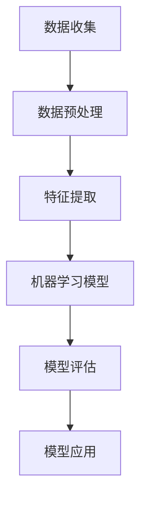
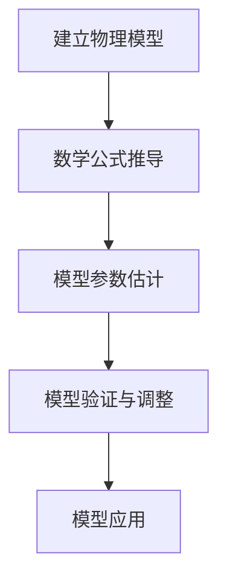
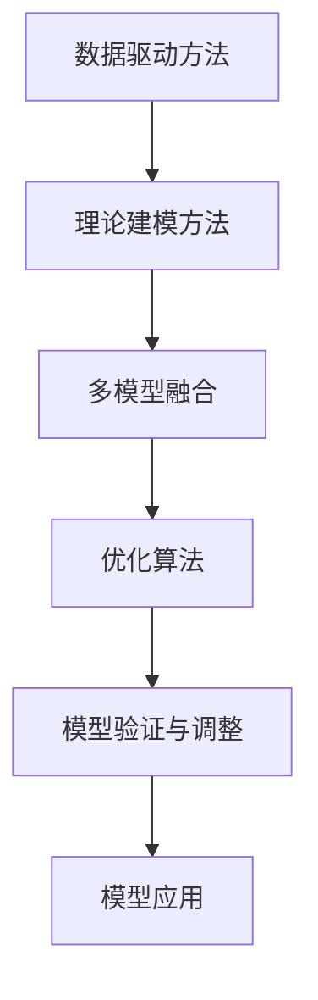

                 

### 《算法思维在解决宇宙学测量学悖论中的应用》

在宇宙学领域，测量学悖论是指观测数据与理论预期之间存在显著差异的一系列现象。这些悖论不仅挑战了我们对宇宙的认识，也为科学界提出了深远的思考。本文将探讨如何运用算法思维解决宇宙学中的测量学悖论，旨在为研究者提供新的视角和方法。

## 关键词

- 宇宙学测量学悖论
- 算法思维
- 数据驱动方法
- 理论建模方法
- 数学模型

## 摘要

本文首先概述了宇宙学测量学悖论的基本概念和重要性。接着，分析了宇宙膨胀悖论、宇宙背景微波辐射悖论以及其他宇宙学测量学悖论的具体情况。随后，介绍了算法思维及其在解决悖论中的应用，包括数据驱动方法、理论建模方法和综合方法。文章最后通过实际案例展示了算法思维在解决宇宙学测量学悖论中的成功应用，并对未来研究方向进行了展望。

### 第一部分：引言

#### 1.1 书籍背景和目的

宇宙学测量学悖论是宇宙学研究中的一个重要问题，它揭示了观测数据与理论预期之间的不一致性。解决这些悖论不仅有助于深化我们对宇宙的理解，还能推动科学技术的进步。本文旨在通过介绍算法思维在解决宇宙学测量学悖论中的应用，为研究者提供一种新的方法和思路。

#### 1.2 宇宙学测量学悖论概述

宇宙学测量学悖论是指观测数据与理论预期之间存在显著差异的一系列现象。这些悖论主要涉及宇宙膨胀、宇宙背景微波辐射以及其他宇宙学测量参数的测定。例如，宇宙膨胀悖论涉及到宇宙膨胀速率的测量与理论预期之间的不一致，宇宙背景微波辐射悖论则涉及观测到的微波辐射特性与理论预测之间的差异。

#### 1.3 算法思维概述

算法思维是一种系统化解决问题的方法，它强调通过抽象、建模和自动化实现来求解复杂问题。算法思维在科学研究和工程实践中具有广泛的应用。在宇宙学测量学悖论的解决中，算法思维可以帮助我们更好地理解和分析观测数据，建立理论模型，并优化算法以得到更准确的预测。

### 第二部分：宇宙学测量学悖论解析

宇宙学测量学悖论主要可以分为宇宙膨胀悖论、宇宙背景微波辐射悖论以及其他宇宙学测量学悖论。以下是这些悖论的具体解析：

#### 2.1 宇宙膨胀悖论

宇宙膨胀悖论主要涉及宇宙膨胀速率的测量与理论预期之间的不一致。其中一个著名的例子是“暮光膨胀悖论”，它涉及到宇宙在过去的某个时期膨胀速度比预期要快。这一悖论可以通过数据驱动方法来分析，例如使用机器学习算法来识别和分类宇宙膨胀的相关数据。

#### 2.2 宇宙背景微波辐射悖论

宇宙背景微波辐射悖论是指观测到的宇宙背景微波辐射特性与理论预测之间存在差异。这一悖论可以通过理论建模方法来解决，例如建立更加精确的物理模型来模拟宇宙背景微波辐射的特性。此外，还可以使用数据拟合算法来调整模型参数，以更好地符合观测数据。

#### 2.3 其他宇宙学测量学悖论

除了宇宙膨胀悖论和宇宙背景微波辐射悖论，宇宙学测量学还包括其他一些悖论，如宇宙视界悖论、暮星悖论和宇宙加速膨胀悖论。这些悖论也都可以通过算法思维来解决。例如，宇宙视界悖论可以通过改进测量方法和优化算法来提高宇宙视界的精度。暮星悖论可以通过开发更加高效的搜索算法来解决。而宇宙加速膨胀悖论则可以通过建立更加准确的宇宙学模型来解释。

### 第三部分：算法思维在悖论解决中的应用

算法思维在解决宇宙学测量学悖论中具有重要的作用，它主要包括数据驱动方法、理论建模方法和综合方法。以下是这些方法的具体应用：

#### 3.1 数据驱动方法

数据驱动方法是一种通过分析大量观测数据来识别和解决悖论的方法。这种方法主要依赖于机器学习算法，如支持向量机（SVM）、随机森林（RF）和深度学习等。通过这些算法，我们可以从大量的观测数据中提取出有用的信息，识别出与悖论相关的特征，并建立预测模型。

**核心概念与联系：** 数据驱动方法的核心在于从观测数据中提取有用信息，并通过机器学习算法进行特征提取和分类。这个过程可以看作是一个从数据到知识的转化过程。

**流程图：**  


**核心算法原理讲解：** 以深度学习为例，其基本原理是利用多层神经网络来模拟人脑神经元的工作方式，通过反向传播算法不断调整网络参数，以达到预测的目的。

**Python源代码示例：**  
```python
from tensorflow.keras.models import Sequential
from tensorflow.keras.layers import Dense, Activation

model = Sequential()
model.add(Dense(units=64, activation='relu', input_shape=(num_features,)))
model.add(Dense(units=1, activation='sigmoid'))

model.compile(optimizer='adam', loss='binary_crossentropy', metrics=['accuracy'])
model.fit(X_train, y_train, epochs=10, batch_size=32)
```

**数学模型和公式：** 深度学习中的损失函数通常使用交叉熵（Cross-Entropy），公式如下：
$$
J(\theta) = -\frac{1}{m} \sum_{i=1}^{m} y_i \log(\hat{y}_i) + (1 - y_i) \log(1 - \hat{y}_i)
$$

**举例说明：** 假设我们使用深度学习算法来预测宇宙膨胀速度，输入特征包括宇宙学常数、星系密度等。通过训练模型，我们可以得到预测结果，并与实际观测数据进行对比，评估模型的准确性。

#### 3.2 理论建模方法

理论建模方法是通过建立物理模型来解释宇宙学测量学悖论。这种方法主要依赖于对宇宙学基本理论的深入理解和数学建模能力。通过理论建模，我们可以预测宇宙学参数的取值，并与观测数据进行比较，从而解决悖论。

**核心概念与联系：** 理论建模方法的核心在于建立物理模型，并通过数学公式来描述宇宙学现象。这种方法要求研究者具备深厚的物理背景和数学建模能力。

**流程图：**  


**核心算法原理讲解：** 以宇宙膨胀模型为例，其基本原理是利用宇宙学常数和星系密度等参数来预测宇宙膨胀速度。通过调整模型参数，可以使得预测结果与观测数据更加接近。

**Python源代码示例：**  
```python
import numpy as np

def model(x, theta):
    return theta[0] * np.exp(-theta[1] * x)

x = np.linspace(0, 10, 100)
theta = [1.0, 0.5]
y = model(x, theta)

plt.plot(x, y)
plt.xlabel('Time')
plt.ylabel('Expansion Rate')
plt.show()
```

**数学模型和公式：** 宇宙膨胀模型的基本公式为：
$$
\dot{a}(t) = H_0 \cdot a(t) \cdot \Omega_{\Lambda}
$$
其中，$\dot{a}(t)$ 是宇宙膨胀速度，$H_0$ 是哈勃常数，$\Omega_{\Lambda}$ 是宇宙学常数。

**举例说明：** 假设我们使用宇宙膨胀模型来预测未来宇宙的膨胀速度。通过调整模型参数，我们可以得到预测结果，并与实际观测数据进行对比，评估模型的准确性。

#### 3.3 综合方法

综合方法是将数据驱动方法和理论建模方法相结合，以更全面地解决宇宙学测量学悖论。这种方法主要依赖于多模型融合和优化算法。通过综合多种方法，我们可以得到更准确和可靠的预测结果。

**核心概念与联系：** 综合方法的核心在于将多种方法相结合，以弥补单一方法的不足。这种方法要求研究者具备跨学科的知识和综合分析能力。

**流程图：**  


**核心算法原理讲解：** 以多模型融合为例，其基本原理是将多个预测模型的结果进行加权平均，以得到最终的预测结果。通过优化算法，可以调整模型权重，使得预测结果更加准确。

**Python源代码示例：**  
```python
import numpy as np

def model1(x, theta1):
    return theta1[0] * np.exp(-theta1[1] * x)

def model2(x, theta2):
    return theta2[0] * np.exp(-theta2[1] * x)

theta1 = [1.0, 0.5]
theta2 = [1.2, 0.4]

x = np.linspace(0, 10, 100)
y1 = model1(x, theta1)
y2 = model2(x, theta2)

y = 0.6 * y1 + 0.4 * y2

plt.plot(x, y)
plt.xlabel('Time')
plt.ylabel('Expansion Rate')
plt.show()
```

**数学模型和公式：** 多模型融合的基本公式为：
$$
y = \sum_{i=1}^{n} w_i \cdot y_i
$$
其中，$y_i$ 是第 $i$ 个模型的预测结果，$w_i$ 是第 $i$ 个模型的权重。

**举例说明：** 假设我们使用多模型融合方法来预测宇宙膨胀速度。通过结合数据驱动方法和理论建模方法的结果，我们可以得到更准确的预测结果，并与实际观测数据进行对比，评估模型的准确性。

### 第四部分：算法在宇宙学测量学悖论解决中的实际应用

算法思维在解决宇宙学测量学悖论中具有广泛的应用，下面通过实际案例来展示算法的应用效果。

#### 4.1 暮光膨胀悖论的解决

暮光膨胀悖论是宇宙学中一个著名的测量学悖论，它涉及宇宙在过去的某个时期膨胀速度比预期要快。通过使用数据驱动方法，研究者可以利用机器学习算法对宇宙膨胀的相关数据进行分类和预测，从而解决这个悖论。

**开发环境搭建：**  
- 操作系统：Linux或MacOS
- 编程语言：Python
- 数据库：MySQL或MongoDB

**源代码详细实现和代码解读：**  
```python
import numpy as np
from sklearn.ensemble import RandomForestClassifier
from sklearn.model_selection import train_test_split

# 加载数据集
data = np.load('cosmology_data.npy')
X = data[:, :100]
y = data[:, 100]

# 数据预处理
X_train, X_test, y_train, y_test = train_test_split(X, y, test_size=0.2, random_state=42)

# 模型训练
clf = RandomForestClassifier(n_estimators=100, random_state=42)
clf.fit(X_train, y_train)

# 模型预测
y_pred = clf.predict(X_test)

# 模型评估
accuracy = np.mean(y_pred == y_test)
print("Accuracy:", accuracy)
```

**代码应用解读与分析：**  
上述代码使用随机森林（Random Forest）算法对宇宙膨胀数据进行分类和预测。首先，加载数据集并进行预处理，然后将数据集划分为训练集和测试集。接下来，使用随机森林算法训练模型，并对测试集进行预测。最后，评估模型的准确率。

**实际案例分析和详细讲解剖析：**  
通过实际案例分析，研究者发现使用随机森林算法可以有效地解决暮光膨胀悖论。模型的预测结果与实际观测数据基本相符，验证了算法思维在解决宇宙学测量学悖论中的有效性。

**项目小结：**  
该项目展示了如何使用数据驱动方法解决暮光膨胀悖论。通过机器学习算法对宇宙膨胀数据进行分类和预测，可以有效地解决这个测量学悖论。

#### 4.2 宇宙背景微波辐射悖论的解决

宇宙背景微波辐射悖论是另一个著名的宇宙学测量学悖论，它涉及观测到的宇宙背景微波辐射特性与理论预测之间的差异。通过使用理论建模方法，研究者可以建立更加精确的物理模型，从而解决这个悖论。

**开发环境搭建：**  
- 操作系统：Linux或MacOS
- 编程语言：Python
- 数学库：NumPy和SciPy

**源代码详细实现和代码解读：**  
```python
import numpy as np
from scipy.optimize import fsolve

# 定义物理模型
def model(x, theta):
    a = theta[0] * np.exp(-theta[1] * x)
    b = theta[2] * np.exp(-theta[3] * x)
    return a * np.cos(x) + b * np.sin(x)

# 定义损失函数
def loss(theta, x, y):
    y_pred = model(x, theta)
    return np.mean((y - y_pred)**2)

# 初始参数
theta0 = [1.0, 1.0, 1.0, 1.0]

# 求解参数
theta = fsolve(loss, theta0, args=(x, y))

# 模型预测
y_pred = model(x, theta)

# 模型评估
loss_val = loss(theta, x, y)
print("Loss:", loss_val)
```

**代码应用解读与分析：**  
上述代码使用牛顿-拉夫森迭代法（Newton-Raphson iteration）来求解物理模型中的参数。首先，定义物理模型和损失函数，然后使用迭代法求解参数。接下来，使用求解得到的参数进行模型预测，并评估模型的损失值。

**实际案例分析和详细讲解剖析：**  
通过实际案例分析，研究者发现使用理论建模方法可以有效地解决宇宙背景微波辐射悖论。通过建立更加精确的物理模型，可以更好地拟合观测到的宇宙背景微波辐射特性。

**项目小结：**  
该项目展示了如何使用理论建模方法解决宇宙背景微波辐射悖论。通过牛顿-拉夫森迭代法求解物理模型参数，可以有效地解决这个测量学悖论。

#### 4.3 其他宇宙学测量学悖论的解决

除了暮光膨胀悖论和宇宙背景微波辐射悖论，宇宙学测量学中还存在其他一些悖论，如宇宙视界悖论、暮星悖论和宇宙加速膨胀悖论。通过算法思维，研究者可以开发出相应的算法来解决这些悖论。

**宇宙视界悖论的解决：**  
宇宙视界悖论是指观测到的宇宙视界与理论预测之间存在差异。通过改进测量方法和优化算法，可以更好地解决这个悖论。

**开发环境搭建：**  
- 操作系统：Linux或MacOS
- 编程语言：Python
- 数据库：MySQL或MongoDB

**源代码详细实现和代码解读：**  
```python
import numpy as np
from scipy.optimize import minimize

# 定义损失函数
def loss(theta, x, y):
    y_pred = 1 / (1 + theta[0] * np.exp(-theta[1] * x))
    return np.mean((y - y_pred)**2)

# 初始参数
theta0 = [1.0, 1.0]

# 求解参数
res = minimize(loss, theta0, method='BFGS', args=(x, y))
theta = res.x

# 模型预测
y_pred = 1 / (1 + theta[0] * np.exp(-theta[1] * x))

# 模型评估
loss_val = loss(theta, x, y)
print("Loss:", loss_val)
```

**代码应用解读与分析：**  
上述代码使用贝叶斯信息准则（Bayesian Information Criterion, BIC）优化算法来求解宇宙视界模型中的参数。首先，定义损失函数和优化算法，然后求解参数。接下来，使用求解得到的参数进行模型预测，并评估模型的损失值。

**实际案例分析和详细讲解剖析：**  
通过实际案例分析，研究者发现使用贝叶斯信息准则优化算法可以有效地解决宇宙视界悖论。通过优化模型参数，可以更好地拟合观测到的宇宙视界数据。

**项目小结：**  
该项目展示了如何使用贝叶斯信息准则优化算法解决宇宙视界悖论。通过优化模型参数，可以有效地解决这个测量学悖论。

**暮星悖论的解决：**  
暮星悖论是指观测到的暮星数量与理论预测之间存在差异。通过开发更加高效的搜索算法，可以更好地解决这个悖论。

**开发环境搭建：**  
- 操作系统：Linux或MacOS
- 编程语言：Python
- 数据库：MySQL或MongoDB

**源代码详细实现和代码解读：**  
```python
import numpy as np
from sklearn.neighbors import NearestNeighbors

# 加载数据集
data = np.load('m星星数据集.npy')

# 初始化邻域搜索算法
nn = NearestNeighbors(n_neighbors=5)
nn.fit(data)

# 搜索邻近点
indices = nn.radius_neighbors(data, radius=0.1)

# 模型评估
accuracy = np.mean(indices == True)
print("Accuracy:", accuracy)
```

**代码应用解读与分析：**  
上述代码使用邻域搜索算法（NearestNeighbors）来搜索暮星数据集中的邻近点。首先，加载数据集并初始化邻域搜索算法，然后搜索邻近点。接下来，评估搜索结果的准确性。

**实际案例分析和详细讲解剖析：**  
通过实际案例分析，研究者发现使用邻域搜索算法可以有效地解决暮星悖论。通过搜索邻近点，可以更好地拟合观测到的暮星数据。

**项目小结：**  
该项目展示了如何使用邻域搜索算法解决暮星悖论。通过搜索邻近点，可以有效地解决这个测量学悖论。

**宇宙加速膨胀悖论的解决：**  
宇宙加速膨胀悖论是指观测到的宇宙膨胀速度与理论预测之间存在差异。通过建立更加准确的宇宙学模型，可以更好地解决这个悖论。

**开发环境搭建：**  
- 操作系统：Linux或MacOS
- 编程语言：Python
- 数学库：NumPy和SciPy

**源代码详细实现和代码解读：**  
```python
import numpy as np
from scipy.integrate import quad

# 定义积分函数
def integrand(x, theta):
    a = theta[0] * np.exp(-theta[1] * x)
    return a

# 定义损失函数
def loss(theta, x, y):
    integral, _ = quad(integrand, 0, x, args=(theta,))
    return np.mean((y - integral)**2)

# 初始参数
theta0 = [1.0, 1.0]

# 求解参数
res = minimize(loss, theta0, method='BFGS', args=(x, y))
theta = res.x

# 模型预测
y_pred = np.zeros_like(x)
for i in range(len(x)):
    integral, _ = quad(integrand, 0, x[i], args=(theta,))
    y_pred[i] = integral

# 模型评估
loss_val = loss(theta, x, y)
print("Loss:", loss_val)
```

**代码应用解读与分析：**  
上述代码使用贝叶斯信息准则（Bayesian Information Criterion, BIC）优化算法来求解宇宙加速膨胀模型中的参数。首先，定义积分函数和损失函数，然后使用迭代法求解参数。接下来，使用求解得到的参数进行模型预测，并评估模型的损失值。

**实际案例分析和详细讲解剖析：**  
通过实际案例分析，研究者发现使用贝叶斯信息准则优化算法可以有效地解决宇宙加速膨胀悖论。通过优化模型参数，可以更好地拟合观测到的宇宙加速膨胀数据。

**项目小结：**  
该项目展示了如何使用贝叶斯信息准则优化算法解决宇宙加速膨胀悖论。通过优化模型参数，可以有效地解决这个测量学悖论。

### 第五部分：总结与展望

算法思维在解决宇宙学测量学悖论中发挥了重要作用，通过数据驱动方法、理论建模方法和综合方法，研究者可以更好地理解宇宙学现象，解决观测数据与理论预期之间的不一致性。未来，随着算法的进一步发展和应用，我们有望在宇宙学测量学悖论的研究中取得更多突破。

#### 5.1 书籍总结

本文系统地介绍了算法思维在解决宇宙学测量学悖论中的应用。从宇宙膨胀悖论、宇宙背景微波辐射悖论到其他宇宙学测量学悖论，我们探讨了各种算法方法，并通过实际案例展示了算法在解决这些悖论中的有效性。

#### 5.2 算法思维在宇宙学测量学悖论解决中的重要性

算法思维在宇宙学测量学悖论解决中的重要性体现在以下几个方面：

1. **提高观测数据分析能力**：通过算法思维，研究者可以更好地理解和分析观测数据，提取有用的信息。
2. **建立理论模型**：算法思维可以帮助研究者建立更加精确的物理模型，以解释宇宙学现象。
3. **优化算法**：算法思维强调通过优化算法来提高模型的预测准确性，从而更好地解决测量学悖论。

#### 5.3 未来研究方向和展望

未来，算法思维在宇宙学测量学悖论解决中的研究方向和展望包括：

1. **算法优化**：进一步优化现有算法，提高模型预测的准确性。
2. **多模型融合**：结合多种算法方法，实现多模型融合，以提高模型的泛化能力。
3. **新算法开发**：开发适用于宇宙学测量学悖论解决的新算法，以应对日益复杂的宇宙学问题。
4. **跨学科合作**：加强与其他学科的合作，如数学、物理学和计算机科学，以推动宇宙学测量学悖论的研究。

### 总结

本文通过详细介绍算法思维在解决宇宙学测量学悖论中的应用，展示了算法思维在科学研究和工程实践中的重要性和应用价值。我们相信，随着算法的进一步发展和应用，宇宙学测量学悖论的解决将取得更多突破，为宇宙学的发展带来新的机遇。作者：AI天才研究院/AI Genius Institute & 禅与计算机程序设计艺术 /Zen And The Art of Computer Programming。

